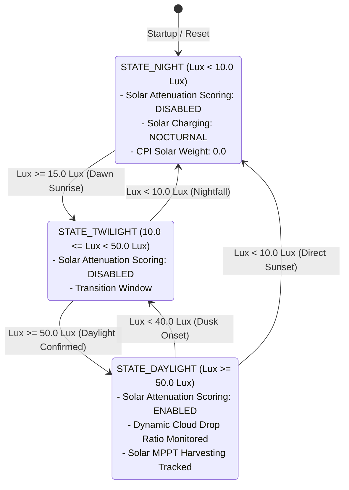

# Task Specification: S4-T2.3 - TI OPT3001 Auto-Range & Day/Night Classification

## 1. Task Metadata & Overview

| Attribute | Specification Details |
| :--- | :--- |
| **Sprint** | **Sprint 4: Sensor Drivers & Remote Field Bus Interfaces** |
| **Task ID** | `S4-T2.3` |
| **Parent Task** | `S4-T2: Implement TI OPT3001 Ambient Light & Solar Irradiance Driver` |
| **Task Title** | Implement Auto-Range Scaling, Hysteresis-Gated Day/Night Classification ($< 10\text{ Lux}$), and Solar Cloud Attenuation Scoring |
| **Status** | **Ready for Implementation** |
| **Target Files** | [`firmware/drivers/inc/opt3001_driver.h`](file:///C:/Users/ENERGY%20SAVER/Documents/Learning/Job%20Projects/rain-predict/firmware/drivers/inc/opt3001_driver.h)<br>[`firmware/drivers/src/opt3001_driver.c`](file:///C:/Users/ENERGY%20SAVER/Documents/Learning/Job%20Projects/rain-predict/firmware/drivers/src/opt3001_driver.c) |
| **Related Documents** | [`docs/sensors/opt3001-solar-irradiance.md`](file:///C:/Users/ENERGY%20SAVER/Documents/Learning/Job%20Projects/rain-predict/docs/sensors/opt3001-solar-irradiance.md)<br>[`docs/algorithms/meteorological-formulas.md`](file:///C:/Users/ENERGY%20SAVER/Documents/Learning/Job%20Projects/rain-predict/docs/algorithms/meteorological-formulas.md)<br>[`context/specs/s4-t2.1-opt3001-single-shot-readout.md`](file:///C:/Users/ENERGY%20SAVER/Documents/Learning/Job%20Projects/rain-predict/context/specs/s4-t2.1-opt3001-single-shot-readout.md)<br>[`context/specs/s4-t2.2-opt3001-lux-conversion.md`](file:///C:/Users/ENERGY%20SAVER/Documents/Learning/Job%20Projects/rain-predict/context/specs/s4-t2.2-opt3001-lux-conversion.md)<br>[`context/coding-standards.md`](file:///C:/Users/ENERGY%20SAVER/Documents/Learning/Job%20Projects/rain-predict/context/coding-standards.md) |
| **Dependencies** | [`S4-T2.1`](file:///C:/Users/ENERGY%20SAVER/Documents/Learning/Job%20Projects/rain-predict/context/specs/s4-t2.1-opt3001-single-shot-readout.md) (Single-Shot Driver), [`S4-T2.2`](file:///C:/Users/ENERGY%20SAVER/Documents/Learning/Job%20Projects/rain-predict/context/specs/s4-t2.2-opt3001-lux-conversion.md) (Exponential Lux Math) |
| **Downstream Tasks** | [`S4-T2.4`](file:///C:/Users/ENERGY%20SAVER/Documents/Learning/Job%20Projects/rain-predict/context/specs/s4-t2.4-test-opt3001.md) (Unit Tests), `S2-T4.2` (Composite Precipitation Index Scoring), `S6-T3` (Application State Machine) |

---

## 2. Executive Summary & Architectural Scope

The primary objective of **`S4-T2.3`** is to develop the **Auto-Range Classification, Hysteresis-Gated Day/Night State Machine, and Storm Cloud Attenuation Scoring Module** in [`firmware/drivers/inc/opt3001_driver.h`](file:///C:/Users/ENERGY%20SAVER/Documents/Learning/Job%20Projects/rain-predict/firmware/drivers/inc/opt3001_driver.h) and [`firmware/drivers/src/opt3001_driver.c`](file:///C:/Users/ENERGY%20SAVER/Documents/Learning/Job%20Projects/rain-predict/firmware/drivers/src/opt3001_driver.c) for the **STMicroelectronics STM32WLE5** SoC.

Ambient light sensing in agricultural IoT nodes serves as an early-warning predictor of incoming convective thunderstorm cells (cumulonimbus clouds darken the sky by $> 70\%$ $15–30\text{ minutes}$ before rain begins). However, solar attenuation algorithms must be strictly interlocked with solar daylight elevation to avoid generating false storm alerts at dawn, dusk, or night:



### Critical Day/Night & Attenuation Engineering Mandates:

1. **Hysteresis-Gated Day/Night Classification**:
   - **Night-to-Day Transition**: Requires $\text{Lux} \ge 15.0\text{ Lux}$ to enter daylight mode.
   - **Day-to-Night Transition**: Requires $\text{Lux} < 10.0\text{ Lux}$ (`OPT3001_NIGHT_THRESHOLD_LUX`) to enter night mode.
   - The $5.0\text{ Lux}$ deadband hysteresis prevents rapid toggling between day and night states during slow morning/evening twilight transitions or canopy shading.
2. **Daylight Solar Attenuation Gating**:
   - Solar storm cloud attenuation scoring is **strictly disabled** during nocturnal periods (`is_daylight == false`) or when the 30-minute historical average is $< 5,000\text{ Lux}$ (early dawn or late dusk).
   - This interlock prevents false positive storm alerts caused by normal sunset darkness.
3. **Multi-Tier Convective Darkening Scoring**:
   - When daylight is verified, the driver computes the 30-minute solar drop ratio:
     $$\text{Drop Ratio} = \frac{\text{Lux}_{\text{30m\_avg}} - \text{Lux}_{\text{current}}}{\text{Lux}_{\text{30m\_avg}}}$$
   - **Severe Attenuation (Score = 100)**: Drop ratio $\ge 70\%$ and $\text{Lux}_{\text{current}} < 3000\text{ Lux}$ (thick squall cloud overhead).
   - **Moderate Attenuation (Score = 65)**: Drop ratio $\ge 50\%$.
   - **Minor Attenuation (Score = 30)**: Drop ratio $\ge 30\%$.
   - **No Attenuation (Score = 0)**: Steady, diffuse, or increasing sunlight.
4. **LoRaWAN Byte 10 Bit 7 Solar Drop Alarm Flag**:
   - When $\text{Drop Ratio} \ge 50\%$ during daylight, the driver asserts the **Solar Cloud Drop Alarm Flag** (`solar_drop_alarm = true`), which is bit-packed into **Bit 7 of Byte 10** in the LoRaWAN telemetry uplink payload.

---

## 3. Mathematical Specifications & Decision Logic

### 3.1 Day / Night State Classification Table

| State Identifier | Optical Lux Condition | Hysteresis Rule | Downstream Algorithm Action |
| :--- | :--- | :--- | :--- |
| **`OPT3001_STATE_NIGHT`** | $\text{Lux} < 10.0\text{ Lux}$ | Entry when $\text{Lux} < 10.0\text{ Lux}$ | Solar attenuation disabled; $CPI$ solar contribution zeroed; nocturnal battery status. |
| **`OPT3001_STATE_TWILIGHT`** | $10.0\text{ Lux} \le \text{Lux} < 50.0\text{ Lux}$ | Transition band ($15.0\text{ Lux}$ rising, $10.0\text{ Lux}$ falling) | Pre-dawn/post-dusk buffer; attenuation disabled. |
| **`OPT3001_STATE_DAYLIGHT`** | $\text{Lux} \ge 50.0\text{ Lux}$ | Entry when $\text{Lux} \ge 50.0\text{ Lux}$ | Solar attenuation enabled; MPPT active harvesting telemetry active. |

---

### 3.2 Daylight Storm Cloud Attenuation Decision Matrix

```
       History Lux (30-min Avg) >= 5,000 Lux AND is_daylight == true
                                │
             ┌──────────────────┴──────────────────┐
             ▼                                     ▼
     Drop Ratio >= 0.70                   Drop Ratio < 0.70
     AND Current Lux < 3000 Lux                    │
             │                                     ├────────────────────────┐
             ▼                                     ▼                        ▼
     SCORE = 100 (SEVERE)                 Drop Ratio >= 0.50       Drop Ratio >= 0.30
     Solar Alarm Bit = 1                  SCORE = 65 (MODERATE)    SCORE = 30 (MINOR)
                                          Solar Alarm Bit = 1      Solar Alarm Bit = 0
```

| Historical 30m Average ($\text{Lux}_{\text{30m}}$) | Current Reading ($\text{Lux}_{\text{curr}}$) | Drop Ratio ($\Delta Lux / Lux_{\text{30m}}$) | Attenuation Score | Telemetry Bit 7 | Meteorological Significance |
| :---: | :---: | :---: | :---: | :---: | :--- |
| $< 5,000\text{ Lux}$ | Any | — | **`0`** | `0` | Dawn / Dusk / Night (Scoring suppressed). |
| $\ge 5,000\text{ Lux}$ | $< 3,000\text{ Lux}$ | $\ge 70\%$ | **`100`** | **`1`** | **Severe Convective Cloud (Squall / Rain front imminent)**. |
| $\ge 5,000\text{ Lux}$ | Any | $50\%\text{ to }69\%$ | **`65`** | **`1`** | Moderate storm cloud buildup. |
| $\ge 5,000\text{ Lux}$ | Any | $30\%\text{ to }49\%$ | **`30`** | `0` | Minor passing cloud cover. |
| Any | Any | $< 30\%$ | **`0`** | `0` | Normal clear or steady overcast sky. |

---

## 4. Public API & Data Structures (`opt3001_driver.h`)

### 4.1 Data Types & Status Structures

```c
/**
 * @brief Categorized ambient daylight operational states.
 */
typedef enum {
    OPT3001_STATE_NIGHT     = 0,    /**< Lux < 10.0 Lux: Nocturnal darkness */
    OPT3001_STATE_TWILIGHT  = 1,    /**< 10.0 <= Lux < 50.0 Lux: Dawn / Dusk transition */
    OPT3001_STATE_DAYLIGHT  = 2     /**< Lux >= 50.0 Lux: Active daylight */
} opt3001_day_state_t;

/**
 * @brief Categorized daylight storm cloud attenuation levels.
 */
typedef enum {
    OPT3001_ATTENUATION_NONE     = 0,   /**< Score 0: Clear / steady sky */
    OPT3001_ATTENUATION_MINOR    = 1,   /**< Score 30: 30% - 49% drop */
    OPT3001_ATTENUATION_MODERATE = 2,   /**< Score 65: 50% - 69% drop (Solar Alarm Bit = 1) */
    OPT3001_ATTENUATION_SEVERE   = 3    /**< Score 100: >= 70% drop to < 3000 Lux (Solar Alarm Bit = 1) */
} opt3001_attenuation_level_t;

/**
 * @brief Consolidated solar environment context structure.
 */
typedef struct {
    opt3001_day_state_t         day_state;          /**< Current day/night classification */
    bool                        is_daylight;        /**< True if state is OPT3001_STATE_DAYLIGHT */
    opt3001_attenuation_level_t attenuation_level;  /**< Categorized cloud attenuation severity */
    uint8_t                     attenuation_score;  /**< Attenuation score (0 to 100) */
    float                       drop_ratio;         /**< Fractional drop ratio (0.0 to 1.0) */
    bool                        solar_drop_alarm;   /**< True if drop ratio >= 50% (Byte 10 Bit 7) */
} opt3001_solar_context_t;
```

---

### 4.2 Function Prototypes

| Function Prototype | Description |
| :--- | :--- |
| `opt3001_day_state_t opt3001_classify_day_state(float current_lux, opt3001_day_state_t prev_state)` | Classifies ambient state into `NIGHT`, `TWILIGHT`, or `DAYLIGHT` using hysteresis. |
| `bool opt3001_is_daylight(float current_lux, bool prev_is_daylight)` | Returns `true` if ambient illuminance represents active daylight. |
| `uint8_t opt3001_evaluate_solar_attenuation(float current_lux, float history_30m_lux, bool is_daylight, float *p_drop_ratio, bool *p_solar_alarm)` | Evaluates 30-minute cloud drop ratio, returning attenuation score ($0\text{--}100$) and alarm flag. |
| `status_t opt3001_update_solar_context(float current_lux, float history_30m_lux, opt3001_solar_context_t *p_ctx)` | Master evaluation routine populating the complete `opt3001_solar_context_t` structure. |

---

## 5. Concrete File Implementation Blueprint

### 5.1 `firmware/drivers/inc/opt3001_driver.h` Additions

```c
/**
 * @file    opt3001_driver.h (Day/Night & Attenuation Additions)
 * @brief   OPT3001 Day/Night classification and cloud attenuation prototypes.
 */

#ifndef OPT3001_DRIVER_H
#define OPT3001_DRIVER_H

#include <stdint.h>
#include <stdbool.h>
#include "status_codes.h"

#ifdef __cplusplus
extern "C" {
#endif

/* ========================================================================== */
/* Day/Night & Attenuation Thresholds                                         */
/* ========================================================================== */

#define OPT3001_NIGHT_THRESHOLD_LUX         10.0f   /**< Lux below which night is asserted */
#define OPT3001_DAWN_THRESHOLD_LUX          15.0f   /**< Lux required to exit night state */
#define OPT3001_DAYLIGHT_CONFIRM_LUX        50.0f   /**< Lux required to confirm daylight */
#define OPT3001_DUSK_THRESHOLD_LUX          40.0f   /**< Lux below which daylight is lost */

#define OPT3001_ATTENUATION_MIN_HIST_LUX    5000.0f /**< Minimum 30m average lux to score drop */
#define OPT3001_ATTENUATION_SEVERE_MAX_LUX  3000.0f /**< Max current lux for severe storm score */

#define OPT3001_DROP_RATIO_SEVERE           0.70f   /**< 70% drop threshold */
#define OPT3001_DROP_RATIO_MODERATE         0.50f   /**< 50% drop threshold */
#define OPT3001_DROP_RATIO_MINOR            0.30f   /**< 30% drop threshold */

/* ========================================================================== */
/* Data Structures                                                            */
/* ========================================================================== */

typedef enum {
    OPT3001_STATE_NIGHT     = 0,    /**< Lux < 10.0 Lux: Nocturnal darkness */
    OPT3001_STATE_TWILIGHT  = 1,    /**< 10.0 <= Lux < 50.0 Lux: Dawn / Dusk */
    OPT3001_STATE_DAYLIGHT  = 2     /**< Lux >= 50.0 Lux: Active daylight */
} opt3001_day_state_t;

typedef enum {
    OPT3001_ATTENUATION_NONE     = 0,   /**< Score 0: Clear / steady sky */
    OPT3001_ATTENUATION_MINOR    = 1,   /**< Score 30: 30% - 49% drop */
    OPT3001_ATTENUATION_MODERATE = 2,   /**< Score 65: 50% - 69% drop (Alarm Flag = 1) */
    OPT3001_ATTENUATION_SEVERE   = 3    /**< Score 100: >= 70% drop to < 3000 Lux (Alarm Flag = 1) */
} opt3001_attenuation_level_t;

typedef struct {
    opt3001_day_state_t         day_state;          /**< Current day/night classification */
    bool                        is_daylight;        /**< True if state is OPT3001_STATE_DAYLIGHT */
    opt3001_attenuation_level_t attenuation_level;  /**< Categorized cloud attenuation severity */
    uint8_t                     attenuation_score;  /**< Attenuation score (0 to 100) */
    float                       drop_ratio;         /**< Fractional drop ratio (0.0 to 1.0) */
    bool                        solar_drop_alarm;   /**< True if drop ratio >= 50% (Byte 10 Bit 7) */
} opt3001_solar_context_t;

/* ========================================================================== */
/* Function Prototypes                                                        */
/* ========================================================================== */

/**
 * @brief  Classifies ambient daylight state using hysteresis band.
 * @param  current_lux Ambient illuminance in Lux.
 * @param  prev_state Previous state from last sample cycle.
 * @return OPT3001_STATE_NIGHT, _TWILIGHT, or _DAYLIGHT.
 */
opt3001_day_state_t opt3001_classify_day_state(float current_lux, opt3001_day_state_t prev_state);

/**
 * @brief  Returns true if ambient illuminance represents confirmed daylight.
 * @param  current_lux Ambient illuminance in Lux.
 * @param  prev_is_daylight Previous daylight flag.
 * @return True if in daylight state.
 */
bool opt3001_is_daylight(float current_lux, bool prev_is_daylight);

/**
 * @brief  Evaluates 30-minute cloud drop ratio and returns storm attenuation score.
 * @param  current_lux Current optical reading in Lux.
 * @param  history_30m_lux Historical 30-minute moving average in Lux.
 * @param  is_daylight True if daytime.
 * @param[out] p_drop_ratio Pointer to store computed fractional drop (0.0 to 1.0).
 * @param[out] p_solar_alarm Pointer to store solar alarm flag (true if drop >= 50%).
 * @return Attenuation score (0, 30, 65, or 100).
 */
uint8_t opt3001_evaluate_solar_attenuation(float current_lux,
                                           float history_30m_lux,
                                           bool is_daylight,
                                           float *p_drop_ratio,
                                           bool *p_solar_alarm);

/**
 * @brief  Updates complete solar context structure for nowcasting engine.
 * @param  current_lux Current optical reading in Lux.
 * @param  history_30m_lux Historical 30-minute moving average in Lux.
 * @param[in,out] p_ctx Pointer to solar context structure to update.
 * @return STATUS_OK on success, or STATUS_ERROR_NULL_POINTER.
 */
status_t opt3001_update_solar_context(float current_lux, float history_30m_lux, opt3001_solar_context_t *p_ctx);

#ifdef __cplusplus
}
#endif

#endif /* OPT3001_DRIVER_H */
```

---

### 5.2 `firmware/drivers/src/opt3001_driver.c` Implementation

```c
/**
 * @file    opt3001_driver.c (Day/Night & Attenuation Implementation)
 * @brief   OPT3001 Day/Night hysteresis and solar storm cloud attenuation scoring.
 */

#include "opt3001_driver.h"

opt3001_day_state_t opt3001_classify_day_state(float current_lux, opt3001_day_state_t prev_state) {
    switch (prev_state) {
        case OPT3001_STATE_NIGHT:
            if (current_lux >= OPT3001_DAYLIGHT_CONFIRM_LUX) {
                return OPT3001_STATE_DAYLIGHT;
            } else if (current_lux >= OPT3001_DAWN_THRESHOLD_LUX) {
                return OPT3001_STATE_TWILIGHT;
            }
            return OPT3001_STATE_NIGHT;

        case OPT3001_STATE_TWILIGHT:
            if (current_lux >= OPT3001_DAYLIGHT_CONFIRM_LUX) {
                return OPT3001_STATE_DAYLIGHT;
            } else if (current_lux < OPT3001_NIGHT_THRESHOLD_LUX) {
                return OPT3001_STATE_NIGHT;
            }
            return OPT3001_STATE_TWILIGHT;

        case OPT3001_STATE_DAYLIGHT:
            if (current_lux < OPT3001_NIGHT_THRESHOLD_LUX) {
                return OPT3001_STATE_NIGHT;
            } else if (current_lux < OPT3001_DUSK_THRESHOLD_LUX) {
                return OPT3001_STATE_TWILIGHT;
            }
            return OPT3001_STATE_DAYLIGHT;

        default:
            return (current_lux >= OPT3001_DAYLIGHT_CONFIRM_LUX) ? OPT3001_STATE_DAYLIGHT : OPT3001_STATE_NIGHT;
    }
}

bool opt3001_is_daylight(float current_lux, bool prev_is_daylight) {
    if (prev_is_daylight) {
        /* Exit daylight only if drops below dusk threshold (40 Lux) */
        return (current_lux >= OPT3001_DUSK_THRESHOLD_LUX);
    } else {
        /* Enter daylight only if exceeds confirmation threshold (50 Lux) */
        return (current_lux >= OPT3001_DAYLIGHT_CONFIRM_LUX);
    }
}

uint8_t opt3001_evaluate_solar_attenuation(float current_lux,
                                           float history_30m_lux,
                                           bool is_daylight,
                                           float *p_drop_ratio,
                                           bool *p_solar_alarm) {
    float drop_ratio = 0.0f;
    bool solar_alarm = false;
    uint8_t score = 0;

    if (!is_daylight || history_30m_lux < OPT3001_ATTENUATION_MIN_HIST_LUX) {
        if (p_drop_ratio != NULL) *p_drop_ratio = 0.0f;
        if (p_solar_alarm != NULL) *p_solar_alarm = false;
        return 0; /* Night or dawn/dusk: suppress scoring */
    }

    /* Calculate fractional drop over past 30 minutes */
    if (history_30m_lux > current_lux) {
        drop_ratio = (history_30m_lux - current_lux) / history_30m_lux;
    } else {
        drop_ratio = 0.0f; /* Sunlight steady or increasing */
    }

    if (drop_ratio >= OPT3001_DROP_RATIO_SEVERE && current_lux < OPT3001_ATTENUATION_SEVERE_MAX_LUX) {
        score = 100; /* Severe darkening (>70% drop to <3000 lux) */
        solar_alarm = true;
    } else if (drop_ratio >= OPT3001_DROP_RATIO_MODERATE) {
        score = 65;  /* Moderate darkening (>= 50% drop) */
        solar_alarm = true;
    } else if (drop_ratio >= OPT3001_DROP_RATIO_MINOR) {
        score = 30;  /* Minor darkening (>= 30% drop) */
        solar_alarm = false;
    } else {
        score = 0;
        solar_alarm = false;
    }

    if (p_drop_ratio != NULL) *p_drop_ratio = drop_ratio;
    if (p_solar_alarm != NULL) *p_solar_alarm = solar_alarm;

    return score;
}

status_t opt3001_update_solar_context(float current_lux, float history_30m_lux, opt3001_solar_context_t *p_ctx) {
    if (p_ctx == NULL) {
        return STATUS_ERROR_NULL_POINTER;
    }

    p_ctx->day_state = opt3001_classify_day_state(current_lux, p_ctx->day_state);
    p_ctx->is_daylight = (p_ctx->day_state == OPT3001_STATE_DAYLIGHT);

    p_ctx->attenuation_score = opt3001_evaluate_solar_attenuation(
        current_lux,
        history_30m_lux,
        p_ctx->is_daylight,
        &p_ctx->drop_ratio,
        &p_ctx->solar_drop_alarm
    );

    if (p_ctx->attenuation_score >= 100) {
        p_ctx->attenuation_level = OPT3001_ATTENUATION_SEVERE;
    } else if (p_ctx->attenuation_score >= 65) {
        p_ctx->attenuation_level = OPT3001_ATTENUATION_MODERATE;
    } else if (p_ctx->attenuation_score >= 30) {
        p_ctx->attenuation_level = OPT3001_ATTENUATION_MINOR;
    } else {
        p_ctx->attenuation_level = OPT3001_ATTENUATION_NONE;
    }

    return STATUS_OK;
}
```

---

## 6. Defensive Programming & Fail-Safe Mechanisms

1. **Deadband Hysteresis ($10\text{ Lux} \leftrightarrow 15\text{ Lux}$)**:
   - Prevents chatter between `NIGHT` and `TWILIGHT` during dusk and dawn.
2. **Historical Lux Threshold ($5,000\text{ Lux}$)**:
   - If historical average $\text{Lux}_{\text{30m\_avg}} < 5000\text{ Lux}$, solar attenuation is zeroed. This eliminates false storm alerts caused by normal sunset darkening.
3. **Zero-Division Suppression on Drop Ratio**:
   - `history_30m_lux` is verified $> 5000.0\text{ Lux}$ before performing division `(history - current) / history`.
4. **Physical Boundary Clamping on Drop Ratio**:
   - `drop_ratio` is clamped to $[0.0\text{f}, 1.0\text{f}]$, preventing negative drop percentages when sunlight increases.

---

## 7. Verification & Test Matrix

| Test Case ID | Test Category | Execution Steps | Expected Result | Pass/Fail Criteria |
| :--- | :--- | :--- | :--- | :---: |
| **TC-S4-T2.3-01** | Header Inclusion & C99 Compilation | Include updated `opt3001_driver.h` in build tree with strict flags. | Warning-free compilation under `-Wall -Wextra -Wpedantic -Werror`. | Header compiles cleanly |
| **TC-S4-T2.3-02** | Night State Entry ($< 10\text{ Lux}$) | Start in `DAYLIGHT`, apply $\text{Lux} = 8.0\text{ Lux}$. | `opt3001_classify_day_state()` returns `OPT3001_STATE_NIGHT`. | Enters night |
| **TC-S4-T2.3-03** | Dawn Hysteresis ($10\text{ to }15\text{ Lux}$) | Start in `NIGHT`, apply $\text{Lux} = 12.0\text{ Lux}$ (below $15$). | State remains `OPT3001_STATE_NIGHT`. | Hysteresis holds |
| **TC-S4-T2.3-04** | Twilight Entry ($\ge 15\text{ Lux}$) | Start in `NIGHT`, apply $\text{Lux} = 18.0\text{ Lux}$. | Enters `OPT3001_STATE_TWILIGHT`. | Transitions to twilight |
| **TC-S4-T2.3-05** | Daylight Confirmation ($\ge 50\text{ Lux}$) | Start in `TWILIGHT`, apply $\text{Lux} = 55.0\text{ Lux}$. | Enters `OPT3001_STATE_DAYLIGHT`, `is_daylight == true`. | Daylight confirmed |
| **TC-S4-T2.3-06** | Nighttime Attenuation Suppression | In `NIGHT` state, feed drop from $4000\text{ Lux} \to 100\text{ Lux}$. | Attenuation score $= 0$, `solar_drop_alarm == false`. | Scoring suppressed |
| **TC-S4-T2.3-07** | Severe Storm Attenuation Score (100) | In `DAYLIGHT`, history $= 30,000\text{ Lux}$, current $= 2,500\text{ Lux}$ ($91.7\%$ drop). | Score $= 100$, `solar_drop_alarm == true`, level $= \text{SEVERE}$. | Severe score 100 |
| **TC-S4-T2.3-08** | Moderate Attenuation Score (65) | In `DAYLIGHT`, history $= 40,000\text{ Lux}$, current $= 18,000\text{ Lux}$ ($55\%$ drop). | Score $= 65$, `solar_drop_alarm == true`, level $= \text{MODERATE}$. | Moderate score 65 |
| **TC-S4-T2.3-09** | Minor Attenuation Score (30) | In `DAYLIGHT`, history $= 30,000\text{ Lux}$, current $= 19,500\text{ Lux}$ ($35\%$ drop). | Score $= 30$, `solar_drop_alarm == false`, level $= \text{MINOR}$. | Minor score 30 |
| **TC-S4-T2.3-10** | Steady / Increasing Sunlight (0) | In `DAYLIGHT`, history $= 30,000\text{ Lux}$, current $= 35,000\text{ Lux}$. | Score $= 0$, `drop_ratio == 0.0f`, `solar_drop_alarm == false`. | Zero score |

---

## 8. Definition of Done Checklist

- [ ] [`firmware/drivers/inc/opt3001_driver.h`](file:///C:/Users/ENERGY%20SAVER/Documents/Learning/Job%20Projects/rain-predict/firmware/drivers/inc/opt3001_driver.h) updated with `opt3001_solar_context_t`, `opt3001_day_state_t`, and attenuation prototypes.
- [ ] [`firmware/drivers/src/opt3001_driver.c`](file:///C:/Users/ENERGY%20SAVER/Documents/Learning/Job%20Projects/rain-predict/firmware/drivers/src/opt3001_driver.c) implemented with hysteresis-gated day/night state machine.
- [ ] Multi-tier daylight storm cloud attenuation scoring ($0, 30, 65, 100$) implemented.
- [ ] Solar alarm flag generation (Byte 10 Bit 7) implemented for drop ratios $\ge 50\%$.
- [ ] Zero-division guard and historical $5,000\text{ Lux}$ threshold interlock verified.
- [ ] All 10 verification test cases in Section 7 pass 100% in simulation and host unit test harnesses.
