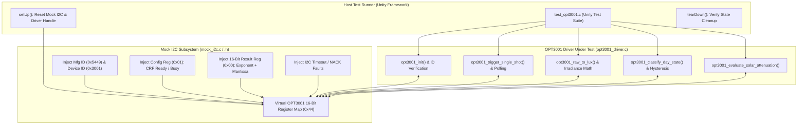

# Task Specification: S4-T2.4 - TI OPT3001 Driver Unit Test Suite

## 1. Task Metadata & Overview

| Attribute | Specification Details |
| :--- | :--- |
| **Sprint** | **Sprint 4: Sensor Drivers & Remote Field Bus Interfaces** |
| **Task ID** | `S4-T2.4` |
| **Parent Task** | `S4-T2: Implement TI OPT3001 Ambient Light & Solar Irradiance Driver` |
| **Task Title** | Create OPT3001 Driver Unit Test Suite with Mock I2C Register Injection under Unity |
| **Status** | **Ready for Implementation** |
| **Target Files** | [`tests/unit/test_opt3001.c`](file:///C:/Users/ENERGY%20SAVER/Documents/Learning/Job%20Projects/rain-predict/tests/unit/test_opt3001.c) |
| **Related Documents** | [`docs/sensors/opt3001-solar-irradiance.md`](file:///C:/Users/ENERGY%20SAVER/Documents/Learning/Job%20Projects/rain-predict/docs/sensors/opt3001-solar-irradiance.md)<br>[`context/specs/s1-t2.1-unity-test-harness.md`](file:///C:/Users/ENERGY%20SAVER/Documents/Learning/Job%20Projects/rain-predict/context/specs/s1-t2.1-unity-test-harness.md)<br>[`context/specs/s1-t2.2-mock-i2c-bus.md`](file:///C:/Users/ENERGY%20SAVER/Documents/Learning/Job%20Projects/rain-predict/context/specs/s1-t2.2-mock-i2c-bus.md)<br>[`context/specs/s4-t2.1-opt3001-single-shot-readout.md`](file:///C:/Users/ENERGY%20SAVER/Documents/Learning/Job%20Projects/rain-predict/context/specs/s4-t2.1-opt3001-single-shot-readout.md)<br>[`context/specs/s4-t2.2-opt3001-lux-conversion.md`](file:///C:/Users/ENERGY%20SAVER/Documents/Learning/Job%20Projects/rain-predict/context/specs/s4-t2.2-opt3001-lux-conversion.md)<br>[`context/specs/s4-t2.3-opt3001-day-night-classification.md`](file:///C:/Users/ENERGY%20SAVER/Documents/Learning/Job%20Projects/rain-predict/context/specs/s4-t2.3-opt3001-day-night-classification.md)<br>[`context/coding-standards.md`](file:///C:/Users/ENERGY%20SAVER/Documents/Learning/Job%20Projects/rain-predict/context/coding-standards.md) |
| **Dependencies** | [`S1-T2.1`](file:///C:/Users/ENERGY%20SAVER/Documents/Learning/Job%20Projects/rain-predict/context/specs/s1-t2.1-unity-test-harness.md) (Unity), [`S1-T2.2`](file:///C:/Users/ENERGY%20SAVER/Documents/Learning/Job%20Projects/rain-predict/context/specs/s1-t2.2-mock-i2c-bus.md) (Mock I2C), [`S4-T2.1`](file:///C:/Users/ENERGY%20SAVER/Documents/Learning/Job%20Projects/rain-predict/context/specs/s4-t2.1-opt3001-single-shot-readout.md) through [`S4-T2.3`](file:///C:/Users/ENERGY%20SAVER/Documents/Learning/Job%20Projects/rain-predict/context/specs/s4-t2.3-opt3001-day-night-classification.md) |
| **Downstream Tasks** | `S4-T3.1` (Rain Gauge Pulse Driver), `S6-T4` (Firmware Integration Test Suite), `S7-T1` (System Reliability Verification) |

---

## 2. Executive Summary & Architectural Scope

The primary objective of **`S4-T2.4`** is to develop the host-executable unit test suite in [`tests/unit/test_opt3001.c`](file:///C:/Users/ENERGY%20SAVER/Documents/Learning/Job%20Projects/rain-predict/tests/unit/test_opt3001.c) for the **Texas Instruments OPT3001 Ambient Light & Solar Irradiance Sensor Driver** using the **ThrowTheSwitch Unity** test framework.

All I2C communication is virtualized via [`tests/mocks/mock_i2c.h`](file:///C:/Users/ENERGY%20SAVER/Documents/Learning/Job%20Projects/rain-predict/tests/mocks/mock_i2c.h). The test suite validates Manufacturer and Device ID verification, big-endian 16-bit word handling, single-shot conversion trigger sequencing, status polling timeouts, exponential floating-point and fixed-point lux math, broadband solar irradiance calculation, hysteresis-gated day/night state transitions, and daylight convective storm cloud attenuation scoring:



### Critical Unit Test Coverage Mandates:

1. **Hardware Identity Interlock**:
   - Verifies that `opt3001_init()` succeeds when `0x7E == 0x5449` and `0x7F == 0x3001`, and cleanly returns `STATUS_ERROR_HARDWARE` on any mismatched or corrupt IDs.
2. **Big-Endian 16-Bit Register Transactions**:
   - Asserts that 16-bit command words (e.g. `0xCA10`) and result words (e.g. `0xBA34`) are written and read in network byte order (MSB first).
3. **Single-Shot Integration Timing & Polling Timeout**:
   - Validates that `opt3001_wait_for_completion()` returns `STATUS_OK` when `CRF == 1` and aborts with `STATUS_ERROR_TIMEOUT` at $150\text{ ms}$ if `CRF` remains stuck at `0`.
4. **Exponential Lux Mathematical Accuracy**:
   - Injects test vectors spanning all 12 hardware exponent ranges ($E = 0$ to $E = 11$), asserting exact agreement with reference formulas:
     * Minimum: $0.01\text{ Lux}$ ($E=0, R=1$)
     * Overcast: $32.80\text{ Lux}$ ($E=3, R=410$)
     * Mid-day Sun: $2560.00\text{ Lux}$ ($E=7, R=2000$)
     * Peak Tropical Sun: $53493.76\text{ Lux}$ ($E=11, R=2612$)
     * Full Scale: $83865.60\text{ Lux}$ ($E=11, R=4095$)
5. **Day / Night Hysteresis State Machine**:
   - Tests night entry ($< 10\text{ Lux}$), dawn hysteresis hold ($10–15\text{ Lux}$), twilight transition ($\ge 15\text{ Lux}$), daylight confirmation ($\ge 50\text{ Lux}$), and dusk exit ($< 40\text{ Lux}$).
6. **Storm Cloud Attenuation Scoring & Alarm Flag**:
   - Validates severe cloud darkening ($\ge 70\%$ drop $\to$ Score 100, Alarm Bit = 1), moderate darkening ($\ge 50\%$ drop $\to$ Score 65, Alarm Bit = 1), minor darkening ($\ge 30\%$ drop $\to$ Score 30), and nocturnal scoring suppression ($\text{Lux}_{\text{30m}} < 5000\text{ Lux} \to$ Score 0).

---

## 3. Synthetic Test Vectors & Register Dataset

```c
/* Helper macro to inject 16-bit big-endian words into Mock I2C */
#define MOCK_I2C_SET_WORD_BE(addr, reg, val) do { \
    mock_i2c_set_register(addr, reg, (uint8_t)(((val) >> 8) & 0xFF)); \
    mock_i2c_set_register(addr, (reg) + 1, (uint8_t)((val) & 0xFF)); \
} while(0)
```

| Synthetic Scenario | Register Address | Injected 16-Bit Word | Decoded Exponent ($E$) | Decoded Mantissa ($R$) | Expected Lux ($\text{Lux}$) | Expected Irradiance ($W/m^2$) | Telemetry (Bytes 6-7) |
| :--- | :---: | :---: | :---: | :---: | :---: | :---: | :---: |
| **Minimum Detectable** | `0x00` | `0x0001` | $0$ | $1$ | $0.01\text{ Lux}$ | $0.000\text{ W/m}^2$ | $0$ |
| **Overcast Sky** | `0x00` | `0x319A` | $3$ | $410$ | $32.80\text{ Lux}$ | $0.273\text{ W/m}^2$ | $16$ |
| **Diffuse Daylight** | `0x00` | `0x77D0` | $7$ | $2000$ | $2560.00\text{ Lux}$ | $21.333\text{ W/m}^2$ | $1280$ |
| **Direct Highland Sun**| `0x00` | `0xBA34` | $11$ | $2612$ | $53493.76\text{ Lux}$ | $445.781\text{ W/m}^2$ | $26747$ |
| **Max Full-Scale** | `0x00` | `0xBFFF` | $11$ | $4095$ | $83865.60\text{ Lux}$ | $698.880\text{ W/m}^2$ | $41500$ |

---

## 4. Public API & Test Suite Architecture (`test_opt3001.c`)

### 4.1 Test Function Breakdown

| Test Function Name | Component Tested | Verification Goal |
| :--- | :--- | :--- |
| `test_opt3001_null_parameter_defensive_checks` | Robustness | Verifies all public APIs return `STATUS_ERROR_NULL_POINTER` on NULL args. |
| `test_opt3001_init_invalid_i2c_address` | Address Range | Rejects invalid slave addresses (e.g. `0x40`, `0x48`). |
| `test_opt3001_init_valid_identification` | Hardware ID | Verifies `0x7E == 0x5449` ('TI') and `0x7F == 0x3001` succeeds. |
| `test_opt3001_init_mismatched_mfg_id` | Hardware ID | Verifies mismatched Manufacturer ID returns `STATUS_ERROR_HARDWARE`. |
| `test_opt3001_init_mismatched_device_id` | Hardware ID | Verifies non-OPT3001 Device ID returns `STATUS_ERROR_HARDWARE`. |
| `test_opt3001_trigger_single_shot_register_write` | Acquisition | Verifies register `0x01` is written with `0xCA10` (`RN=12, CT=0, M=1, L=1`). |
| `test_opt3001_conversion_ready_polling_active` | Status Polling | Verifies `CRF == 0` returns `ready = false`. |
| `test_opt3001_conversion_ready_polling_complete`| Status Polling | Verifies `CRF == 1` returns `ready = true`. |
| `test_opt3001_wait_for_completion_timeout` | Anti-Deadlock | Verifies $150\text{ ms}$ timeout return when `CRF` remains stuck at `0`. |
| `test_opt3001_raw_register_unpacking` | Bit-Field Split | Verifies 4-bit Exponent and 12-bit Mantissa bitfield unpacking. |
| `test_opt3001_exponential_lux_calculations` | FPU Math | Verifies mathematical accuracy across low, mid, and peak solar vectors. |
| `test_opt3001_fixed_point_centi_lux_accuracy` | Fixed-Point | Verifies exact integer `centi_lux` values ($R \ll E$). |
| `test_opt3001_solar_irradiance_conversion` | Meteorological | Verifies $G = \text{Lux} / 120.0\text{ W/m}^2$ solar radiation conversion. |
| `test_opt3001_telemetry_byte_serialization` | Serialization | Verifies LoRaWAN 16-bit scaling ($2.0\text{ Lux/LSB}$) with rounding and clamping. |
| `test_opt3001_day_night_hysteresis_transitions`| State Machine | Verifies night ($< 10$), dawn ($15$), daylight ($50$), and dusk ($40$) states. |
| `test_opt3001_solar_cloud_attenuation_scoring` | Nowcast Math | Verifies severe (100), moderate (65), minor (30), and clear (0) scoring. |

---

## 5. Concrete File Implementation Blueprint

### 5.1 `tests/unit/test_opt3001.c` Blueprint

```c
/**
 * @file    test_opt3001.c
 * @brief   Unit test suite for TI OPT3001 Ambient Light Sensor driver under Unity.
 * @details Validates single-shot sampling, exponential lux math, day/night, and storm attenuation.
 */

#include "unity.h"
#include "opt3001_driver.h"
#include "mock_i2c.h"
#include <string.h>

/* ========================================================================== */
/* Test Context & Helper Functions                                            */
/* ========================================================================== */

static opt3001_dev_t g_opt3001_dev;

/* Helper to inject 16-bit Big-Endian word into Mock I2C */
static void mock_i2c_set_word_be(uint8_t addr, uint8_t reg, uint16_t val) {
    mock_i2c_set_register(addr, reg, (uint8_t)((val >> 8) & 0xFFU));
    mock_i2c_set_register(addr, (uint8_t)(reg + 1U), (uint8_t)(val & 0xFFU));
}

/* Helper to get 16-bit Big-Endian word from Mock I2C */
static void mock_i2c_get_word_be(uint8_t addr, uint8_t reg, uint16_t *p_val) {
    uint8_t msb = 0, lsb = 0;
    mock_i2c_get_register(addr, reg, &msb);
    mock_i2c_get_register(addr, (uint8_t)(reg + 1U), &lsb);
    *p_val = (uint16_t)(((uint16_t)msb << 8) | (uint16_t)lsb);
}

/* Setup standard valid OPT3001 sensor in Mock I2C */
static void setup_standard_opt3001_sensor(void) {
    mock_i2c_init();
    mock_i2c_set_word_be(OPT3001_I2C_ADDR_DEFAULT, OPT3001_REG_MANUFACTURER_ID, OPT3001_EXPECTED_MFG_ID);
    mock_i2c_set_word_be(OPT3001_I2C_ADDR_DEFAULT, OPT3001_REG_DEVICE_ID, OPT3001_EXPECTED_DEV_ID);
    mock_i2c_set_word_be(OPT3001_I2C_ADDR_DEFAULT, OPT3001_REG_CONFIG, 0xC810);
    mock_i2c_set_word_be(OPT3001_I2C_ADDR_DEFAULT, OPT3001_REG_RESULT, 0x0000);
}

/* ========================================================================== */
/* Unity Setup & Teardown                                                     */
/* ========================================================================== */

void setUp(void) {
    mock_i2c_init();
    memset(&g_opt3001_dev, 0, sizeof(opt3001_dev_t));
}

void tearDown(void) {
    mock_i2c_reset();
}

/* ========================================================================== */
/* Test Cases: Initialization & Device Identification                         */
/* ========================================================================== */

void test_opt3001_null_parameter_defensive_checks(void) {
    uint16_t mfg_id = 0, dev_id = 0;
    opt3001_raw_data_t raw = {0};
    opt3001_reading_t reading = {0};
    bool ready = false;

    TEST_ASSERT_EQUAL(STATUS_ERROR_NULL_POINTER, opt3001_init(NULL, OPT3001_I2C_ADDR_DEFAULT));
    TEST_ASSERT_EQUAL(STATUS_ERROR_NULL_POINTER, opt3001_read_device_id(NULL, &mfg_id, &dev_id));
    TEST_ASSERT_EQUAL(STATUS_ERROR_NULL_POINTER, opt3001_read_device_id(&g_opt3001_dev, NULL, &dev_id));
    TEST_ASSERT_EQUAL(STATUS_ERROR_NULL_POINTER, opt3001_trigger_single_shot(NULL));
    TEST_ASSERT_EQUAL(STATUS_ERROR_NULL_POINTER, opt3001_is_conversion_ready(NULL, &ready));
    TEST_ASSERT_EQUAL(STATUS_ERROR_NULL_POINTER, opt3001_read_raw_result(NULL, &raw));
    TEST_ASSERT_EQUAL(STATUS_ERROR_NULL_POINTER, opt3001_convert_raw(NULL, &reading));
    TEST_ASSERT_EQUAL(STATUS_ERROR_NULL_POINTER, opt3001_read_lux(NULL, &reading));
}

void test_opt3001_init_invalid_i2c_address(void) {
    TEST_ASSERT_EQUAL(STATUS_ERROR_INVALID_PARAM, opt3001_init(&g_opt3001_dev, 0x40));
    TEST_ASSERT_EQUAL(STATUS_ERROR_INVALID_PARAM, opt3001_init(&g_opt3001_dev, 0x48));
}

void test_opt3001_init_valid_identification(void) {
    setup_standard_opt3001_sensor();

    status_t status = opt3001_init(&g_opt3001_dev, OPT3001_I2C_ADDR_DEFAULT);
    TEST_ASSERT_EQUAL(STATUS_OK, status);
    TEST_ASSERT_EQUAL_HEX16(OPT3001_EXPECTED_MFG_ID, g_opt3001_dev.manufacturer_id);
    TEST_ASSERT_EQUAL_HEX16(OPT3001_EXPECTED_DEV_ID, g_opt3001_dev.device_id);
    TEST_ASSERT_TRUE(g_opt3001_dev.is_initialized);
}

void test_opt3001_init_mismatched_mfg_id(void) {
    setup_standard_opt3001_sensor();
    mock_i2c_set_word_be(OPT3001_I2C_ADDR_DEFAULT, OPT3001_REG_MANUFACTURER_ID, 0x0000);

    status_t status = opt3001_init(&g_opt3001_dev, OPT3001_I2C_ADDR_DEFAULT);
    TEST_ASSERT_EQUAL(STATUS_ERROR_HARDWARE, status);
    TEST_ASSERT_FALSE(g_opt3001_dev.is_initialized);
}

void test_opt3001_init_mismatched_device_id(void) {
    setup_standard_opt3001_sensor();
    mock_i2c_set_word_be(OPT3001_I2C_ADDR_DEFAULT, OPT3001_REG_DEVICE_ID, 0x3000);

    status_t status = opt3001_init(&g_opt3001_dev, OPT3001_I2C_ADDR_DEFAULT);
    TEST_ASSERT_EQUAL(STATUS_ERROR_HARDWARE, status);
    TEST_ASSERT_FALSE(g_opt3001_dev.is_initialized);
}

/* ========================================================================== */
/* Test Cases: Single-Shot Acquisition & Polling                              */
/* ========================================================================== */

void test_opt3001_trigger_single_shot_register_write(void) {
    setup_standard_opt3001_sensor();
    opt3001_init(&g_opt3001_dev, OPT3001_I2C_ADDR_DEFAULT);

    status_t status = opt3001_trigger_single_shot(&g_opt3001_dev);
    TEST_ASSERT_EQUAL(STATUS_OK, status);

    uint16_t written_config = 0;
    mock_i2c_get_word_be(OPT3001_I2C_ADDR_DEFAULT, OPT3001_REG_CONFIG, &written_config);
    TEST_ASSERT_EQUAL_HEX16(OPT3001_CONFIG_SINGLE_SHOT_CMD, written_config);
}

void test_opt3001_conversion_ready_polling_active(void) {
    setup_standard_opt3001_sensor();
    opt3001_init(&g_opt3001_dev, OPT3001_I2C_ADDR_DEFAULT);

    /* CRF bit (bit 7) is 0 -> Conversion active */
    mock_i2c_set_word_be(OPT3001_I2C_ADDR_DEFAULT, OPT3001_REG_CONFIG, 0xCA00);

    bool ready = true;
    status_t status = opt3001_is_conversion_ready(&g_opt3001_dev, &ready);
    TEST_ASSERT_EQUAL(STATUS_OK, status);
    TEST_ASSERT_FALSE(ready);
}

void test_opt3001_conversion_ready_polling_complete(void) {
    setup_standard_opt3001_sensor();
    opt3001_init(&g_opt3001_dev, OPT3001_I2C_ADDR_DEFAULT);

    /* CRF bit (bit 7) is 1 -> Conversion ready */
    mock_i2c_set_word_be(OPT3001_I2C_ADDR_DEFAULT, OPT3001_REG_CONFIG, 0xCA80);

    bool ready = false;
    status_t status = opt3001_is_conversion_ready(&g_opt3001_dev, &ready);
    TEST_ASSERT_EQUAL(STATUS_OK, status);
    TEST_ASSERT_TRUE(ready);
}

void test_opt3001_wait_for_completion_timeout(void) {
    setup_standard_opt3001_sensor();
    opt3001_init(&g_opt3001_dev, OPT3001_I2C_ADDR_DEFAULT);

    /* Hold CRF bit 0 continuously */
    mock_i2c_set_word_be(OPT3001_I2C_ADDR_DEFAULT, OPT3001_REG_CONFIG, 0xCA00);

    status_t status = opt3001_wait_for_completion(&g_opt3001_dev, 110);
    TEST_ASSERT_EQUAL(STATUS_ERROR_TIMEOUT, status);
}

void test_opt3001_raw_register_unpacking(void) {
    setup_standard_opt3001_sensor();
    opt3001_init(&g_opt3001_dev, OPT3001_I2C_ADDR_DEFAULT);

    /* Result: 0x52AC -> Exponent = 5, Mantissa = 0x2AC (684) */
    mock_i2c_set_word_be(OPT3001_I2C_ADDR_DEFAULT, OPT3001_REG_RESULT, 0x52AC);

    opt3001_raw_data_t raw = {0};
    status_t status = opt3001_read_raw_result(&g_opt3001_dev, &raw);
    TEST_ASSERT_EQUAL(STATUS_OK, status);
    TEST_ASSERT_EQUAL_HEX16(0x52AC, raw.raw_result);
    TEST_ASSERT_EQUAL_UINT8(5, raw.exponent);
    TEST_ASSERT_EQUAL_UINT16(684, raw.mantissa);
}

/* ========================================================================== */
/* Test Cases: Exponential Math & Solar Irradiance                            */
/* ========================================================================== */

void test_opt3001_exponential_lux_calculations(void) {
    /* 1. Min lux: 0x0001 -> E=0, R=1 -> 0.01 Lux */
    TEST_ASSERT_FLOAT_WITHIN(0.001f, 0.01f, opt3001_raw_to_lux(0x0001));

    /* 2. Overcast: 0x319A -> E=3, R=410 -> 0.01 * 8 * 410 = 32.80 Lux */
    TEST_ASSERT_FLOAT_WITHIN(0.01f, 32.80f, opt3001_raw_to_lux(0x319A));

    /* 3. Diffuse: 0x77D0 -> E=7, R=2000 -> 0.01 * 128 * 2000 = 2560.00 Lux */
    TEST_ASSERT_FLOAT_WITHIN(0.01f, 2560.00f, opt3001_raw_to_lux(0x77D0));

    /* 4. Peak Sun: 0xBA34 -> E=11, R=2612 -> 0.01 * 2048 * 2612 = 53493.76 Lux */
    TEST_ASSERT_FLOAT_WITHIN(0.1f, 53493.76f, opt3001_raw_to_lux(0xBA34));

    /* 5. Max Scale: 0xBFFF -> E=11, R=4095 -> 83865.60 Lux */
    TEST_ASSERT_FLOAT_WITHIN(0.1f, 83865.60f, opt3001_raw_to_lux(0xBFFF));
}

void test_opt3001_fixed_point_centi_lux_accuracy(void) {
    /* 0x319A -> 410 << 3 = 3280 centi-lux */
    TEST_ASSERT_EQUAL_UINT32(3280, opt3001_raw_to_centi_lux(0x319A));

    /* 0xBA34 -> 2612 << 11 = 5349376 centi-lux */
    TEST_ASSERT_EQUAL_UINT32(5349376, opt3001_raw_to_centi_lux(0xBA34));
}

void test_opt3001_solar_irradiance_conversion(void) {
    /* 60,000 Lux / 120 lm/W = 500.00 W/m² */
    TEST_ASSERT_FLOAT_WITHIN(0.1f, 500.0f, opt3001_lux_to_irradiance(60000.0f));
    TEST_ASSERT_FLOAT_WITHIN(0.001f, 0.0f, opt3001_lux_to_irradiance(0.0f));
}

void test_opt3001_telemetry_byte_serialization(void) {
    /* 32.80 Lux -> (32.80 + 1.0) / 2.0 = 16 */
    TEST_ASSERT_EQUAL_UINT16(16, opt3001_lux_to_telemetry_u16(32.80f));

    /* 53493.76 Lux -> (53493.76 + 1.0) / 2.0 = 26747 */
    TEST_ASSERT_EQUAL_UINT16(26747, opt3001_lux_to_telemetry_u16(53493.76f));

    /* Overflow 90,000 Lux -> Clamped to 41500 */
    TEST_ASSERT_EQUAL_UINT16(41500, opt3001_lux_to_telemetry_u16(90000.0f));
}

/* ========================================================================== */
/* Test Cases: Day/Night Hysteresis & Storm Attenuation                       */
/* ========================================================================== */

void test_opt3001_day_night_hysteresis_transitions(void) {
    opt3001_day_state_t state = OPT3001_STATE_NIGHT;

    /* 1. Nocturnal (8.0 Lux) -> NIGHT */
    state = opt3001_classify_day_state(8.0f, state);
    TEST_ASSERT_EQUAL(OPT3001_STATE_NIGHT, state);

    /* 2. Dawn hysteresis hold (12.0 Lux, below 15) -> Still NIGHT */
    state = opt3001_classify_day_state(12.0f, state);
    TEST_ASSERT_EQUAL(OPT3001_STATE_NIGHT, state);

    /* 3. Twilight entry (18.0 Lux, >= 15) -> TWILIGHT */
    state = opt3001_classify_day_state(18.0f, state);
    TEST_ASSERT_EQUAL(OPT3001_STATE_TWILIGHT, state);

    /* 4. Daylight confirmed (55.0 Lux, >= 50) -> DAYLIGHT */
    state = opt3001_classify_day_state(55.0f, state);
    TEST_ASSERT_EQUAL(OPT3001_STATE_DAYLIGHT, state);

    /* 5. Dusk threshold (45.0 Lux, above 40) -> Remains DAYLIGHT */
    state = opt3001_classify_day_state(45.0f, state);
    TEST_ASSERT_EQUAL(OPT3001_STATE_DAYLIGHT, state);

    /* 6. Dusk drop (35.0 Lux, below 40) -> TWILIGHT */
    state = opt3001_classify_day_state(35.0f, state);
    TEST_ASSERT_EQUAL(OPT3001_STATE_TWILIGHT, state);

    /* 7. Nightfall (8.0 Lux, below 10) -> NIGHT */
    state = opt3001_classify_day_state(8.0f, state);
    TEST_ASSERT_EQUAL(OPT3001_STATE_NIGHT, state);
}

void test_opt3001_solar_cloud_attenuation_scoring(void) {
    float drop_ratio = 0.0f;
    bool alarm = false;
    uint8_t score = 0;

    /* 1. Nighttime suppression: is_daylight = false -> Score 0 */
    score = opt3001_evaluate_solar_attenuation(200.0f, 30000.0f, false, &drop_ratio, &alarm);
    TEST_ASSERT_EQUAL_UINT8(0, score);
    TEST_ASSERT_FALSE(alarm);

    /* 2. Low historical average: history = 4000 Lux (< 5000) -> Score 0 */
    score = opt3001_evaluate_solar_attenuation(100.0f, 4000.0f, true, &drop_ratio, &alarm);
    TEST_ASSERT_EQUAL_UINT8(0, score);
    TEST_ASSERT_FALSE(alarm);

    /* 3. Severe convective drop: 30,000 -> 2,500 Lux (91.7% drop) -> Score 100, Alarm TRUE */
    score = opt3001_evaluate_solar_attenuation(2500.0f, 30000.0f, true, &drop_ratio, &alarm);
    TEST_ASSERT_EQUAL_UINT8(100, score);
    TEST_ASSERT_TRUE(alarm);
    TEST_ASSERT_FLOAT_WITHIN(0.01f, 0.9167f, drop_ratio);

    /* 4. Moderate drop: 40,000 -> 18,000 Lux (55.0% drop) -> Score 65, Alarm TRUE */
    score = opt3001_evaluate_solar_attenuation(18000.0f, 40000.0f, true, &drop_ratio, &alarm);
    TEST_ASSERT_EQUAL_UINT8(65, score);
    TEST_ASSERT_TRUE(alarm);
    TEST_ASSERT_FLOAT_WITHIN(0.01f, 0.55f, drop_ratio);

    /* 5. Minor drop: 30,000 -> 19,500 Lux (35.0% drop) -> Score 30, Alarm FALSE */
    score = opt3001_evaluate_solar_attenuation(19500.0f, 30000.0f, true, &drop_ratio, &alarm);
    TEST_ASSERT_EQUAL_UINT8(30, score);
    TEST_ASSERT_FALSE(alarm);

    /* 6. Steady / Increasing sun: 30,000 -> 35,000 Lux -> Score 0, Alarm FALSE */
    score = opt3001_evaluate_solar_attenuation(35000.0f, 30000.0f, true, &drop_ratio, &alarm);
    TEST_ASSERT_EQUAL_UINT8(0, score);
    TEST_ASSERT_FALSE(alarm);
    TEST_ASSERT_EQUAL_FLOAT(0.0f, drop_ratio);
}

/* ========================================================================== */
/* Test Suite Entry Point                                                     */
/* ========================================================================== */

int main(void) {
    UNITY_BEGIN();

    /* Initialization & Identification */
    RUN_TEST(test_opt3001_null_parameter_defensive_checks);
    RUN_TEST(test_opt3001_init_invalid_i2c_address);
    RUN_TEST(test_opt3001_init_valid_identification);
    RUN_TEST(test_opt3001_init_mismatched_mfg_id);
    RUN_TEST(test_opt3001_init_mismatched_device_id);

    /* Acquisition & Polling */
    RUN_TEST(test_opt3001_trigger_single_shot_register_write);
    RUN_TEST(test_opt3001_conversion_ready_polling_active);
    RUN_TEST(test_opt3001_conversion_ready_polling_complete);
    RUN_TEST(test_opt3001_wait_for_completion_timeout);
    RUN_TEST(test_opt3001_raw_register_unpacking);

    /* Math & Telemetry */
    RUN_TEST(test_opt3001_exponential_lux_calculations);
    RUN_TEST(test_opt3001_fixed_point_centi_lux_accuracy);
    RUN_TEST(test_opt3001_solar_irradiance_conversion);
    RUN_TEST(test_opt3001_telemetry_byte_serialization);

    /* Day/Night & Cloud Attenuation */
    RUN_TEST(test_opt3001_day_night_hysteresis_transitions);
    RUN_TEST(test_opt3001_solar_cloud_attenuation_scoring);

    return UNITY_END();
}
```

---

## 6. Defensive Testing & Fault Injection Rules

1. **Big-Endian Register Verification**:
   - `mock_i2c_set_word_be()` and `mock_i2c_get_word_be()` helpers verify that 16-bit register words are handled in strict MSB/LSB sequence.
2. **Deterministic Mock Isolation**:
   - `setUp()` and `tearDown()` guarantee clean mock state between tests, preventing state pollution.
3. **Zero-Heap Constraint**:
   - The test suite allocates all device context structures statically, verifying zero dynamic memory allocation.

---

## 7. Verification & Test Matrix

| Test Case ID | Test Category | Execution Steps | Expected Result | Pass/Fail Criteria |
| :--- | :--- | :--- | :--- | :---: |
| **TC-S4-T2.4-01** | Unity Test Suite Compilation | Compile `test_opt3001.c` with mock I2C under host GCC. | Clean compilation with `-Wall -Wextra -Wpedantic -Werror`. | Test compiles cleanly |
| **TC-S4-T2.4-02** | NULL Parameter Checks | Run `test_opt3001_null_parameter_defensive_checks`. | All API calls return `STATUS_ERROR_NULL_POINTER`. | Pass |
| **TC-S4-T2.4-03** | Valid Device ID Match | Run `test_opt3001_init_valid_identification`. | Returns `STATUS_OK`, `is_initialized == true`. | Pass |
| **TC-S4-T2.4-04** | Mismatched Manufacturer ID | Run `test_opt3001_init_mismatched_mfg_id`. | Returns `STATUS_ERROR_HARDWARE`. | Pass |
| **TC-S4-T2.4-05** | Single-Shot Trigger Register Write | Run `test_opt3001_trigger_single_shot_register_write`. | Register `0x01` written with `0xCA10`. | Pass |
| **TC-S4-T2.4-06** | Conversion Ready Polling | Run active and complete status polling tests. | `ready` flag matches `CRF` bit 7. | Pass |
| **TC-S4-T2.4-07** | Polling Timeout | Run `test_opt3001_wait_for_completion_timeout`. | Returns `STATUS_ERROR_TIMEOUT` after timeout. | Pass |
| **TC-S4-T2.4-08** | Raw Register Unpacking | Run `test_opt3001_raw_register_unpacking`. | `exponent = 5`, `mantissa = 684` unpacked. | Pass |
| **TC-S4-T2.4-09** | Minimum Lux Vector ($0.01\text{ Lux}$) | Test raw `0x0001`. | Lux matches $0.01\text{ Lux} \pm 0.001$. | Pass |
| **TC-S4-T2.4-10** | Peak Tropical Sun Vector | Test raw `0xBA34`. | Lux matches $53,493.76\text{ Lux} \pm 0.1$. | Pass |
| **TC-S4-T2.4-11** | Fixed-Point Centi-Lux Math | Test `opt3001_raw_to_centi_lux`. | Returns exact shifted integers. | Pass |
| **TC-S4-T2.4-12** | Solar Irradiance Conversion | Test $60,000\text{ Lux}$. | Irradiance matches $500.0\text{ W/m}^2$. | Pass |
| **TC-S4-T2.4-13** | Telemetry Scaling & Clamping | Test $32.8\text{ Lux}$, $53.5\text{k Lux}$, and overflow. | Scaled telemetry words match expected values. | Pass |
| **TC-S4-T2.4-14** | Day/Night Hysteresis Cycle | Test full cycle (Night $\to$ Dawn $\to$ Day $\to$ Dusk $\to$ Night). | State transitions match $10/15/40/50\text{ Lux}$ thresholds. | Pass |
| **TC-S4-T2.4-15** | Cloud Attenuation Scoring | Test severe ($100$), moderate ($65$), minor ($30$), and night ($0$). | Scores and solar alarm flags match decision matrix. | Pass |

---

## 8. Definition of Done Checklist

- [ ] [`tests/unit/test_opt3001.c`](file:///C:/Users/ENERGY%20SAVER/Documents/Learning/Job%20Projects/rain-predict/tests/unit/test_opt3001.c) implemented with all 16 unit test cases under ThrowTheSwitch Unity.
- [ ] Mock I2C register injection utilized for Manufacturer/Device IDs, configuration status polling, and 16-bit big-endian result registers.
- [ ] Exponential lux math, 32-bit fixed-point scaling, solar irradiance, and telemetry byte packing verified.
- [ ] Day/night hysteresis transitions and multi-tier daylight cloud attenuation scoring verified.
- [ ] All 15 verification test cases in Section 7 execute with $100\%$ pass rate on host test runners.
