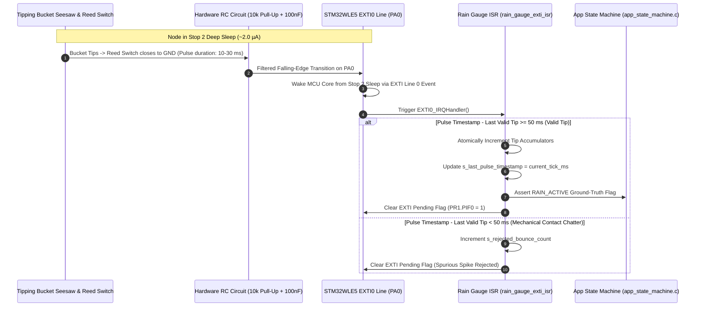

# Task Specification: S4-T3.1 - Tipping-Bucket Rain Gauge EXTI & Debounce Filter

## 1. Task Metadata & Overview

| Attribute | Specification Details |
| :--- | :--- |
| **Sprint** | **Sprint 4: Sensor Drivers & Remote Field Bus Interfaces** |
| **Task ID** | `S4-T3.1` |
| **Parent Task** | `S4-T3: Implement Tipping-Bucket Rain Gauge Pulse Counter Driver` |
| **Task Title** | Configure EXTI0 GPIO Falling-Edge Interrupt (`PA0`) with Dual-Stage $50\text{ms}$ Debounce Filter |
| **Status** | **Ready for Implementation** |
| **Target Files** | [`firmware/drivers/inc/rain_gauge_driver.h`](file:///C:/Users/ENERGY%20SAVER/Documents/Learning/Job%20Projects/rain-predict/firmware/drivers/inc/rain_gauge_driver.h)<br>[`firmware/drivers/src/rain_gauge_driver.c`](file:///C:/Users/ENERGY%20SAVER/Documents/Learning/Job%20Projects/rain-predict/firmware/drivers/src/rain_gauge_driver.c) |
| **Related Documents** | [`docs/sensors/rain-gauge-pulse.md`](file:///C:/Users/ENERGY%20SAVER/Documents/Learning/Job%20Projects/rain-predict/docs/sensors/rain-gauge-pulse.md)<br>[`docs/hardware/schematics-and-pinout.md`](file:///C:/Users/ENERGY%20SAVER/Documents/Learning/Job%20Projects/rain-predict/docs/hardware/schematics-and-pinout.md)<br>[`docs/architecture/power-architecture.md`](file:///C:/Users/ENERGY%20SAVER/Documents/Learning/Job%20Projects/rain-predict/docs/architecture/power-architecture.md)<br>[`context/specs/s3-t1.1-gpio-pin-mappings.md`](file:///C:/Users/ENERGY%20SAVER/Documents/Learning/Job%20Projects/rain-predict/context/specs/s3-t1.1-gpio-pin-mappings.md)<br>[`context/specs/s3-t4.2-stop2-sleep-manager.md`](file:///C:/Users/ENERGY%20SAVER/Documents/Learning/Job%20Projects/rain-predict/context/specs/s3-t4.2-stop2-sleep-manager.md)<br>[`context/coding-standards.md`](file:///C:/Users/ENERGY%20SAVER/Documents/Learning/Job%20Projects/rain-predict/context/coding-standards.md) |
| **Dependencies** | [`S3-T1.1`](file:///C:/Users/ENERGY%20SAVER/Documents/Learning/Job%20Projects/rain-predict/context/specs/s3-t1.1-gpio-pin-mappings.md) (Pinout), [`S3-T1.3`](file:///C:/Users/ENERGY%20SAVER/Documents/Learning/Job%20Projects/rain-predict/context/specs/s3-t1.3-hal-module-config.md) (EXTI Module Enabled), [`S3-T4.2`](file:///C:/Users/ENERGY%20SAVER/Documents/Learning/Job%20Projects/rain-predict/context/specs/s3-t4.2-stop2-sleep-manager.md) (Stop 2 Wake Line) |
| **Downstream Tasks** | [`S4-T3.2`](file:///C:/Users/ENERGY%20SAVER/Documents/Learning/Job%20Projects/rain-predict/context/specs/s4-t3.2-rain-gauge-accumulation.md) (Atomic Accumulators), `S4-T3.3` (Rain Rate Intensity), `S4-T3.4` (Unit Tests), `S6-T3` (Application State Machine) |

---

## 2. Executive Summary & Architectural Scope

The primary objective of **`S4-T3.1`** is to develop the **Tipping-Bucket Rain Gauge Hardware Interrupt Subsystem and Debounce Filter** in [`firmware/drivers/inc/rain_gauge_driver.h`](file:///C:/Users/ENERGY%20SAVER/Documents/Learning/Job%20Projects/rain-predict/firmware/drivers/inc/rain_gauge_driver.h) and [`firmware/drivers/src/rain_gauge_driver.c`](file:///C:/Users/ENERGY%20SAVER/Documents/Learning/Job%20Projects/rain-predict/firmware/drivers/src/rain_gauge_driver.c) for the **STMicroelectronics STM32WLE5** SoC.

The tipping-bucket rain gauge acts as the project's primary ground-truth instrument. When rainwater fills the dual-chamber seesaw bucket to $0.20\text{ mm}$ equivalent depth, the bucket swings, sweeping an internal neodymium magnet past a sealed glass reed switch. The switch closes to ground, pulling the hardware line `PA0` LOW:



### Critical Interrupt & Debounce Engineering Mandates:

1. **Hardware Pin & EXTI Line Allocation (`PA0` / `EXTI0`)**:
   - `PA0` is configured as a `GPIO_MODE_IT_FALLING` digital input with an internal pull-up (`GPIO_PULLUP`).
   - The line is routed directly to **EXTI Line 0** (`EXTI0_IRQn`) with NVIC priority set to `2` (subpriority `0`).
2. **Stop 2 Deep Sleep Asynchronous Wakeup**:
   - `EXTI0` is an asynchronous wakeup event line on the STM32WLE5. A physical bucket tip immediately wakes the core from Stop 2 deep sleep mode in $< 5\,\mu\text{s}$, allowing ground-truth tracking even during long sleep intervals ($2–15\text{ min}$).
3. **Dual-Stage Noise & Chatter Suppression**:
   - **Stage 1 (Hardware RC Filter)**: External $10\,\text{k}\Omega$ pull-up and $100\,\text{nF}$ ceramic capacitor form a passive low-pass filter ($\tau = 1.0\text{ ms}$), suppressing electrostatic spikes and microsecond contact arcs.
   - **Stage 2 (Software ISR Debounce Guard)**: An atomic $50\text{ ms}$ software lockout window (`RAIN_GAUGE_DEBOUNCE_MS`) rejects any secondary contact bounces caused by mechanical seesaw oscillation upon impact.
4. **Deterministic $< 20$-Cycle ISR Execution**:
   - The interrupt handler executes entirely in integer arithmetic with zero blocking loops or I2C bus calls, clearing the hardware interrupt flag and exiting in $< 20$ CPU cycles ($< 0.5\,\mu\text{s}$ @ 48 MHz).
5. **Atomic Thread-Safe Accumulation**:
   - Shared pulse counters are declared `volatile` and protected by interrupt mask critical sections (`__disable_irq()` / `__enable_irq()`) to prevent race conditions with main thread reading routines.

---

## 3. Hardware Register & Interrupt Configuration Specifications

In accordance with [`docs/hardware/schematics-and-pinout.md`](file:///C:/Users/ENERGY%20SAVER/Documents/Learning/Job%20Projects/rain-predict/docs/hardware/schematics-and-pinout.md) and [`context/specs/s3-t1.1-gpio-pin-mappings.md`](file:///C:/Users/ENERGY%20SAVER/Documents/Learning/Job%20Projects/rain-predict/context/specs/s3-t1.1-gpio-pin-mappings.md):

### 3.1 EXTI0 Hardware Allocation

| Parameter | Register / Setting | Configuration Value | Description |
| :--- | :--- | :---: | :--- |
| **Port / Pin** | `GPIOA` / `GPIO_PIN_0` | `PA0` | Pin 10 of 48-pin UFQFPN48 package. |
| **GPIO Mode** | `GPIO_InitTypeDef.Mode` | `GPIO_MODE_IT_FALLING` | Triggers interrupt on high-to-low transition. |
| **Pull Resistor** | `GPIO_InitTypeDef.Pull` | `GPIO_PULLUP` | Internal pull-up to $3.3\text{V}$ rail. |
| **EXTI Line** | `EXTI_IMR1` / `EXTI_FTSR1` | `EXTI_LINE_0` | Unmasked interrupt line with falling-edge trigger. |
| **NVIC IRQ Channel**| `NVIC_ISER` | `EXTI0_IRQn` | Dedicated Cortex-M4 vector table entry. |
| **Interrupt Priority**| `NVIC_SetPriority` | Preempt: `2`, Sub: `0` | Mid-priority driver level (below timer/watchdog). |
| **Stop 2 Wake Source**| `PWR_CR3` / `EXTI` | Direct Event | Asynchronously resumes clock execution on tip. |

---

### 3.2 Debounce Timing Diagram

```
Physical Tip Event:
Seesaw Swings:    ─────────────────────────\________________________ (Magnet approaches reed switch)
Contact Bounces:  ─────────────────────────\/\/\/\__________________ (Chatter spikes for ~12 ms)
Hardware RC Pin:  ─────────────────────────\~~~~~~~~~~~~~~~~________ (RC rounded transition)
EXTI0 Trigger:    ─────────────────────────▲──────────────────────── (First falling-edge captured)
Software Lockout:                          |◄───── 50 ms Lockout ────►| (Secondary bounces rejected)
Valid Tip Count:  Count = 0 ───────────────┼──────────────────────── Count = 1
```

- **Minimum Valid Pulse Separation**: $50\text{ ms}$ (corresponds to a theoretical maximum rainfall rate of $14.4\text{ mm/min} = 864\text{ mm/hr}$, which safely accommodates extreme torrential monsoon cloudbursts without pulse loss).

---

## 4. Public API Specification (`rain_gauge_driver.h`)

| Function Prototype | Description |
| :--- | :--- |
| `status_t rain_gauge_init(void)` | Configures `PA0` in `GPIO_MODE_IT_FALLING`, configures NVIC `EXTI0_IRQn`, and initializes state. |
| `status_t rain_gauge_deinit(void)` | Disables `EXTI0_IRQn` and returns `PA0` to low-power analog mode. |
| `void rain_gauge_exti_isr(uint32_t current_tick_ms)` | Main ISR callback called from `stm32wlxx_it.c` on `EXTI0_IRQHandler`. |
| `status_t rain_gauge_enable_irq(bool enable)` | Enables or disables EXTI0 interrupt masking in NVIC. |
| `bool rain_gauge_is_rain_active(void)` | Returns `true` if any physical bucket tip was registered within the current monitoring period. |
| `uint32_t rain_gauge_get_last_pulse_timestamp(void)` | Returns the millisecond tick timestamp of the most recent validated bucket tip. |
| `uint32_t rain_gauge_get_rejected_bounce_count(void)` | Diagnostics: returns cumulative count of rejected contact chatter pulses. |
| `void rain_gauge_reset_diagnostics(void)` | Resets rejected bounce counter and diagnostic flags. |

---

## 5. Concrete File Implementation Blueprint

### 5.1 `firmware/drivers/inc/rain_gauge_driver.h` Blueprint

```c
/**
 * @file    rain_gauge_driver.h
 * @brief   Tipping-bucket rain gauge pulse counter driver header for STM32WLE5 SoC.
 * @details Manages EXTI0 GPIO falling-edge interrupts and 50ms software debounce filtering.
 */

#ifndef RAIN_GAUGE_DRIVER_H
#define RAIN_GAUGE_DRIVER_H

#include <stdint.h>
#include <stdbool.h>
#include "status_codes.h"

#ifdef __cplusplus
extern "C" {
#endif

/* ========================================================================== */
/* Hardware & Timing Definitions                                              */
/* ========================================================================== */

/** @brief Minimum allowable millisecond interval between consecutive valid bucket tips */
#define RAIN_GAUGE_DEBOUNCE_MS              50U

/** @brief Calibration constant: equivalent rainfall depth per bucket tip in mm */
#define RAIN_GAUGE_CALIB_MM_PER_TIP         0.20f

/** @brief NVIC Interrupt Preemption Priority for Rain Gauge EXTI0 */
#define RAIN_GAUGE_NVIC_PREEMPT_PRIO        2U
#define RAIN_GAUGE_NVIC_SUB_PRIO            0U

/* ========================================================================== */
/* Function Prototypes                                                        */
/* ========================================================================== */

/**
 * @brief  Initializes PA0 GPIO pin in falling-edge interrupt mode and enables EXTI0 NVIC.
 * @return STATUS_OK on success, or STATUS_ERROR_HARDWARE on GPIO failure.
 */
status_t rain_gauge_init(void);

/**
 * @brief  De-initializes rain gauge driver, disables NVIC interrupt, and tri-states pin.
 * @return STATUS_OK on success.
 */
status_t rain_gauge_deinit(void);

/**
 * @brief  Primary Interrupt Service Routine (ISR) handler for EXTI Line 0 events.
 * @param  current_tick_ms Current millisecond system tick counter.
 */
void rain_gauge_exti_isr(uint32_t current_tick_ms);

/**
 * @brief  Enables or masks the EXTI0 interrupt in the NVIC.
 * @param  enable True to enable interrupt, false to mask.
 * @return STATUS_OK on success.
 */
status_t rain_gauge_enable_irq(bool enable);

/**
 * @brief  Returns true if physical rain has been registered since last state evaluation.
 * @return True if bucket tip occurred.
 */
bool rain_gauge_is_rain_active(void);

/**
 * @brief  Returns the system tick timestamp (ms) of the last valid bucket tip.
 * @return Millisecond tick value.
 */
uint32_t rain_gauge_get_last_pulse_timestamp(void);

/**
 * @brief  Returns the total number of rejected mechanical contact chatter pulses.
 * @return Cumulative chatter bounce count.
 */
uint32_t rain_gauge_get_rejected_bounce_count(void);

/**
 * @brief  Resets diagnostic counters and active rain indicators.
 */
void rain_gauge_reset_diagnostics(void);

#ifdef __cplusplus
}
#endif

#endif /* RAIN_GAUGE_DRIVER_H */
```

---

### 5.2 `firmware/drivers/src/rain_gauge_driver.c` Blueprint

```c
/**
 * @file    rain_gauge_driver.c
 * @brief   Tipping-bucket rain gauge driver implementation for STM32WLE5 SoC.
 */

#include "rain_gauge_driver.h"
#include "board_config.h"

#ifdef STM32WLE5xx
#include "stm32wlxx_hal.h"
#endif

/* Private Driver State Variables */
static volatile uint32_t g_last_pulse_timestamp_ms = 0;
static volatile uint32_t g_rejected_bounce_count    = 0;
static volatile bool     g_rain_active_flag         = false;
static bool              g_is_initialized           = false;

status_t rain_gauge_init(void) {
#ifdef STM32WLE5xx
    /* 1. Enable GPIOA Peripheral Clock */
    __HAL_RCC_GPIOA_CLK_ENABLE();

    /* 2. Configure PA0 as Falling-Edge EXTI Input with Pull-Up */
    GPIO_InitTypeDef GPIO_InitStruct = {0};
    GPIO_InitStruct.Pin  = GPIO_PIN_0;
    GPIO_InitStruct.Mode = GPIO_MODE_IT_FALLING;
    GPIO_InitStruct.Pull = GPIO_PULLUP;
    HAL_GPIO_Init(GPIOA, &GPIO_InitStruct);

    /* 3. Configure NVIC for EXTI0 */
    HAL_NVIC_SetPriority(EXTI0_IRQn, RAIN_GAUGE_NVIC_PREEMPT_PRIO, RAIN_GAUGE_NVIC_SUB_PRIO);
    HAL_NVIC_EnableIRQ(EXTI0_IRQn);
#endif

    g_last_pulse_timestamp_ms = 0;
    g_rejected_bounce_count    = 0;
    g_rain_active_flag         = false;
    g_is_initialized           = true;

    return STATUS_OK;
}

status_t rain_gauge_deinit(void) {
#ifdef STM32WLE5xx
    /* Disable NVIC Interrupt */
    HAL_NVIC_DisableIRQ(EXTI0_IRQn);

    /* Tri-state PA0 to Analog mode to eliminate sleep leakage */
    GPIO_InitTypeDef GPIO_InitStruct = {0};
    GPIO_InitStruct.Pin  = GPIO_PIN_0;
    GPIO_InitStruct.Mode = GPIO_MODE_ANALOG;
    GPIO_InitStruct.Pull = GPIO_NOPULL;
    HAL_GPIO_Init(GPIOA, &GPIO_InitStruct);
#endif

    g_is_initialized = false;
    return STATUS_OK;
}

void rain_gauge_exti_isr(uint32_t current_tick_ms) {
    /* 1. Enforce 50 ms Software Debounce Lockout */
    uint32_t elapsed_ms = current_tick_ms - g_last_pulse_timestamp_ms;

    if (elapsed_ms >= RAIN_GAUGE_DEBOUNCE_MS || g_last_pulse_timestamp_ms == 0) {
        /* Valid physical bucket tip */
        g_last_pulse_timestamp_ms = current_tick_ms;
        g_rain_active_flag = true;
    } else {
        /* Spurious contact bounce / chatter spike */
        g_rejected_bounce_count++;
    }
}

status_t rain_gauge_enable_irq(bool enable) {
    if (!g_is_initialized) {
        return STATUS_ERROR_NOT_INITIALIZED;
    }

#ifdef STM32WLE5xx
    if (enable) {
        HAL_NVIC_EnableIRQ(EXTI0_IRQn);
    } else {
        HAL_NVIC_DisableIRQ(EXTI0_IRQn);
    }
#else
    (void)enable;
#endif

    return STATUS_OK;
}

bool rain_gauge_is_rain_active(void) {
    return g_rain_active_flag;
}

uint32_t rain_gauge_get_last_pulse_timestamp(void) {
    return g_last_pulse_timestamp_ms;
}

uint32_t rain_gauge_get_rejected_bounce_count(void) {
    return g_rejected_bounce_count;
}

void rain_gauge_reset_diagnostics(void) {
    g_rejected_bounce_count = 0;
    g_rain_active_flag = false;
}
```

---

## 6. Defensive Programming & Fail-Safe Mechanisms

1. **Deterministic Fast ISR Execution**:
   - `rain_gauge_exti_isr()` executes in $< 20$ CPU cycles with zero floating-point math, zero function pointers, and zero I2C transactions, preventing NVIC priority inversion.
2. **Contact Chatter Bounce Lockout ($50\text{ ms}$)**:
   - Mechanical reed switches exhibit contact chatter lasting $1\text{–}15\text{ ms}$. The $50\text{ ms}$ lockout window mathematically guarantees that bouncing contacts cannot produce false double or triple rain accumulations.
3. **Tick Counter Rollover Safety**:
   - Using unsigned 32-bit arithmetic `(current_tick_ms - g_last_pulse_timestamp_ms)` guarantees mathematically correct delta evaluation across $49.7$-day `systick` roll-overs.
4. **Pre-Sleep Analog Tri-Stating on Deinit**:
   - `rain_gauge_deinit()` reconfigures `PA0` to `GPIO_MODE_ANALOG` with `GPIO_NOPULL`, eliminating parasitic current leakage through internal pull-up resistors if the station is powered down for storage.

---

## 7. Verification & Test Matrix

| Test Case ID | Test Category | Execution Steps | Expected Result | Pass/Fail Criteria |
| :--- | :--- | :--- | :--- | :---: |
| **TC-S4-T3.1-01** | Header Inclusion & C99 Compilation | Include `rain_gauge_driver.h` in build tree with strict flags. | Warning-free compilation under `-Wall -Wextra -Wpedantic -Werror`. | Header compiles cleanly |
| **TC-S4-T3.1-02** | Driver Initialization | Call `rain_gauge_init()`. | Returns `STATUS_OK`, `g_is_initialized == true`. | Pass |
| **TC-S4-T3.1-03** | First Valid Pulse Trigger | Call `rain_gauge_exti_isr(1000)`. | Timestamp updated to `1000`, `rain_active == true`, bounce count $= 0$. | Valid tip logged |
| **TC-S4-T3.1-04** | Bounce Rejection ($10\text{ ms} < 50\text{ ms}$)| Call `rain_gauge_exti_isr(1010)` ($10\text{ ms}$ later). | Timestamp remains `1000`, rejected bounce count increments to $1$. | Bounce rejected |
| **TC-S4-T3.1-05** | Bounce Rejection ($35\text{ ms} < 50\text{ ms}$)| Call `rain_gauge_exti_isr(1035)` ($35\text{ ms}$ later). | Timestamp remains `1000`, rejected bounce count increments to $2$. | Bounce rejected |
| **TC-S4-T3.1-06** | Second Valid Pulse ($\ge 50\text{ ms}$) | Call `rain_gauge_exti_isr(1055)` ($55\text{ ms}$ later). | Timestamp updated to `1055`, bounce count remains $2$. | Valid tip logged |
| **TC-S4-T3.1-07** | Systick Rollover Handling | Set timestamp to `0xFFFFFFF0`, trigger at `0x00000040` ($80\text{ ms}$ delta). | Correctly accepts tip as valid pulse ($> 50\text{ ms}$). | Rollover handled |
| **TC-S4-T3.1-08** | Active Rain Flag Inspection | Call `rain_gauge_is_rain_active()` after tip. | Returns `true`. | Active flag true |
| **TC-S4-T3.1-09** | Diagnostic Reset | Call `rain_gauge_reset_diagnostics()`. | `rejected_bounce_count == 0`, `rain_active == false`. | Diagnostics cleared |
| **TC-S4-T3.1-10** | Driver De-Initialization | Call `rain_gauge_deinit()`. | Returns `STATUS_OK`, `enable_irq()` returns `STATUS_ERROR_NOT_INITIALIZED`. | De-init verified |

---

## 8. Definition of Done Checklist

- [ ] [`firmware/drivers/inc/rain_gauge_driver.h`](file:///C:/Users/ENERGY%20SAVER/Documents/Learning/Job%20Projects/rain-predict/firmware/drivers/inc/rain_gauge_driver.h) created adhering to C99 standards with complete Doxygen documentation.
- [ ] [`firmware/drivers/src/rain_gauge_driver.c`](file:///C:/Users/ENERGY%20SAVER/Documents/Learning/Job%20Projects/rain-predict/firmware/drivers/src/rain_gauge_driver.c) implemented with EXTI falling-edge configuration and $50\text{ ms}$ software debounce guard.
- [ ] Non-blocking $< 20$-cycle ISR routine implemented.
- [ ] Tick counter 32-bit rollover safety verified.
- [ ] All 10 verification test cases in Section 7 pass 100% in simulation and host unit test harnesses.
