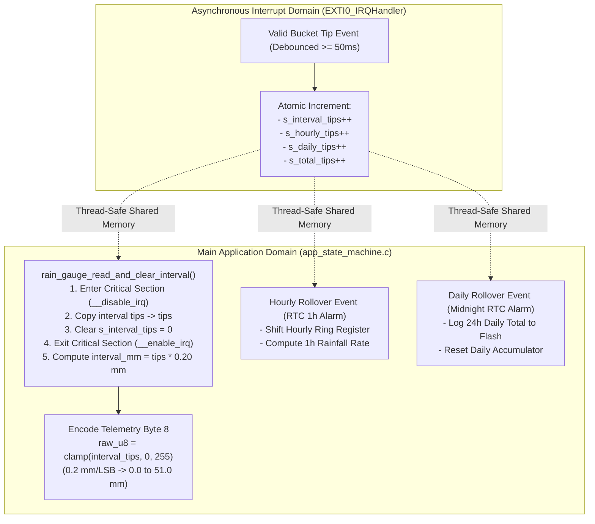

# Task Specification: S4-T3.2 - Tipping-Bucket Rainfall Accumulators & Telemetry

## 1. Task Metadata & Overview

| Attribute | Specification Details |
| :--- | :--- |
| **Sprint** | **Sprint 4: Sensor Drivers & Remote Field Bus Interfaces** |
| **Task ID** | `S4-T3.2` |
| **Parent Task** | `S4-T3: Implement Tipping-Bucket Rain Gauge Pulse Counter Driver` |
| **Task Title** | Implement Atomic Pulse Count Accumulator, Rolling Hourly/Daily Registers ($0.2\text{ mm/tip}$) & Byte 8 Encoding |
| **Status** | **Ready for Implementation** |
| **Target Files** | [`firmware/drivers/inc/rain_gauge_driver.h`](file:///C:/Users/ENERGY%20SAVER/Documents/Learning/Job%20Projects/rain-predict/firmware/drivers/inc/rain_gauge_driver.h)<br>[`firmware/drivers/src/rain_gauge_driver.c`](file:///C:/Users/ENERGY%20SAVER/Documents/Learning/Job%20Projects/rain-predict/firmware/drivers/src/rain_gauge_driver.c) |
| **Related Documents** | [`docs/sensors/rain-gauge-pulse.md`](file:///C:/Users/ENERGY%20SAVER/Documents/Learning/Job%20Projects/rain-predict/docs/sensors/rain-gauge-pulse.md)<br>[`docs/architecture/telemetry-protocol.md`](file:///C:/Users/ENERGY%20SAVER/Documents/Learning/Job%20Projects/rain-predict/docs/architecture/telemetry-protocol.md)<br>[`context/specs/s4-t3.1-rain-gauge-exti-debounce.md`](file:///C:/Users/ENERGY%20SAVER/Documents/Learning/Job%20Projects/rain-predict/context/specs/s4-t3.1-rain-gauge-exti-debounce.md)<br>[`context/coding-standards.md`](file:///C:/Users/ENERGY%20SAVER/Documents/Learning/Job%20Projects/rain-predict/context/coding-standards.md) |
| **Dependencies** | [`S4-T3.1`](file:///C:/Users/ENERGY%20SAVER/Documents/Learning/Job%20Projects/rain-predict/context/specs/s4-t3.1-rain-gauge-exti-debounce.md) (EXTI0 Interrupt & Debounce Filter) |
| **Downstream Tasks** | [`S4-T3.3`](file:///C:/Users/ENERGY%20SAVER/Documents/Learning/Job%20Projects/rain-predict/context/specs/s4-t3.3-rain-rate-intensity.md) (Rain Rate Calculation), `S4-T3.4` (Unit Tests), `S2-T5.2` (Rain State Classification), `S6-T3` (Application State Machine) |

---

## 2. Executive Summary & Architectural Scope

The primary objective of **`S4-T3.2`** is to develop the **Atomic Rainfall Accumulator Subsystem, Multi-Horizon Accumulation Registers, and Telemetry Serialization Engine** in [`firmware/drivers/inc/rain_gauge_driver.h`](file:///C:/Users/ENERGY%20SAVER/Documents/Learning/Job%20Projects/rain-predict/firmware/drivers/inc/rain_gauge_driver.h) and [`firmware/drivers/src/rain_gauge_driver.c`](file:///C:/Users/ENERGY%20SAVER/Documents/Learning/Job%20Projects/rain-predict/firmware/drivers/src/rain_gauge_driver.c) for the **STMicroelectronics STM32WLE5** SoC.

Ground-truth rainfall data is needed across multiple operational time horizons:
1. **Sample Interval ($R_{\text{int}}$)**: Rainfall accumulated during the current duty-cycle period (e.g. $10\text{ minutes}$), serialized into LoRaWAN telemetry Byte 8.
2. **Rolling Hourly ($R_{\text{1h}}$)**: Total precipitation depth recorded over the rolling 60-minute window for intensity classification.
3. **Rolling Daily ($R_{\text{24h}}$)**: Total precipitation depth recorded over the 24-hour estate management day.
4. **Total Lifetime Accumulation ($R_{\text{total}}$)**: Monotonically increasing pulse register for flash logging and sensor calibration audits:



### Critical Accumulator Engineering Mandates:

1. **Atomic Read-and-Clear Critical Sections**:
   - Because tips occur asynchronously inside the EXTI0 ISR, the main application thread must disable interrupts (`__disable_irq()`) during read-and-clear operations on `s_interval_tips`.
   - The critical section duration is $< 6$ CPU cycles ($< 125\text{ ns}$ @ 48 MHz), preventing any lost pulses if a tip arrives simultaneously.
2. **Deterministic Metric Calibration Constant ($K_{\text{gauge}} = 0.20\text{ mm/tip}$)**:
   - Every physical bucket tip corresponds to precisely $0.20\text{ mm}$ of equivalent rainfall depth:
     $$\text{Depth } (\text{mm}) = N_{\text{tips}} \times 0.20\text{f}$$
3. **LoRaWAN Byte 8 Serialization Standard**:
   - In accordance with [`docs/architecture/telemetry-protocol.md`](file:///C:/Users/ENERGY%20SAVER/Documents/Learning/Job%20Projects/rain-predict/docs/architecture/telemetry-protocol.md), interval rain is bit-packed into **Byte 8** as an 8-bit unsigned integer with a scale factor of $0.2\text{ mm/LSB}$:
     $$\text{Byte 8} = \text{clamp}(N_{\text{interval\_tips}}, 0, 255) \quad (0.0\text{ to }51.0\text{ mm})$$
   - If rainfall during an extreme cloudburst exceeds $51.0\text{ mm}$ in a single 10-minute interval ($> 255$ tips), Byte 8 clamps at `0xFF` ($255$), while full 32-bit precision is retained in local logs.
4. **Rolling 1-Hour FIFO Ring Buffer**:
   - To support continuous 1-hour rainfall rate calculation ($\text{mm/hr}$), the driver maintains a 6-element ring buffer (for 10-minute intervals: $6 \times 10\text{ min} = 60\text{ min}$).

---

## 3. Mathematical Derivations & Telemetry Serialization

### 3.1 Rainfall Conversion Formulas

Given pulse count $N_{\text{tips}}$ and calibration factor $K_{\text{gauge}} = 0.20\text{ mm}$:

$$\text{Interval Rainfall } R_{\text{int}} (\text{mm}) = N_{\text{interval\_tips}} \times 0.20\text{f}$$

$$\text{Hourly Rainfall } R_{\text{1h}} (\text{mm}) = \left( \sum_{k=0}^{5} N_{\text{history}[k]} \right) \times 0.20\text{f}$$

$$\text{Daily Rainfall } R_{\text{24h}} (\text{mm}) = N_{\text{daily\_tips}} \times 0.20\text{f}$$

---

### 3.2 Telemetry Byte 8 Encoding Table

| Accumulated Tips ($N_{\text{int}}$) | Physical Rainfall ($R_{\text{int}}$) | Encoded Byte 8 Value | Hex Value | Meteorological Significance |
| :---: | :---: | :---: | :---: | :--- |
| **`0`** | $0.0\text{ mm}$ | `0` | `0x00` | No physical rain during interval |
| **`1`** | $0.2\text{ mm}$ | `1` | `0x01` | First bucket tip (Transitions to `RAIN_ACTIVE`) |
| **`5`** | $1.0\text{ mm}$ | `5` | `0x05` | Light rain ($1.0\text{ mm} / 10\text{ min} = 6.0\text{ mm/hr}$) |
| **`25`** | $5.0\text{ mm}$ | `25` | `0x19` | Moderate rain ($5.0\text{ mm} / 10\text{ min} = 30.0\text{ mm/hr}$) |
| **`50`** | $10.0\text{ mm}$ | `50` | `0x32` | Heavy convective downpour ($60.0\text{ mm/hr}$) |
| **`125`** | $25.0\text{ mm}$ | `125` | `0x7D` | Torrential tropical cloudburst ($150.0\text{ mm/hr}$) |
| **$\ge 255$** | $\ge 51.0\text{ mm}$ | `255` | `0xFF` | Extreme monsoon flooding (Clamped at $51.0\text{ mm}$) |

---

## 4. Public API & Data Structures (`rain_gauge_driver.h`)

### 4.1 Data Types & Structures

```c
/**
 * @brief Comprehensive rainfall accumulation telemetry structure.
 */
typedef struct {
    uint16_t    interval_tips;          /**< Tips recorded during current sample interval */
    float       interval_rain_mm;       /**< Rainfall in mm during current interval */
    uint32_t    hourly_tips;            /**< Cumulative tips over past 60 minutes */
    float       hourly_rain_mm;         /**< Rainfall in mm over past 60 minutes */
    uint32_t    daily_tips;             /**< Cumulative tips over past 24 hours */
    float       daily_rain_mm;          /**< Rainfall in mm over past 24 hours */
    uint32_t    total_lifetime_tips;    /**< Monotonic total lifetime tip count */
    uint8_t     telemetry_byte8;        /**< Formatted 8-bit unsigned integer for LoRaWAN Byte 8 */
} rain_gauge_data_t;
```

---

### 4.2 Function Prototypes

| Function Prototype | Description |
| :--- | :--- |
| `uint16_t rain_gauge_read_and_clear_interval(float *p_interval_mm)` | Thread-safe atomic read-and-clear of interval tips, returning count and mm. |
| `status_t rain_gauge_get_accumulation(rain_gauge_data_t *p_data)` | Populates complete multi-horizon accumulation data structure. |
| `void rain_gauge_update_hourly_history(uint16_t interval_tips)` | Pushes interval tips into the rolling 1-hour FIFO ring buffer. |
| `void rain_gauge_reset_daily(void)` | Resets the 24-hour daily accumulator (called on midnight RTC alarm). |
| `uint8_t rain_gauge_encode_telemetry_byte(uint16_t interval_tips)` | Formats and clamps interval tips into 8-bit Byte 8 format. |
| `void rain_gauge_reset_all_accumulators(void)` | Resets interval, hourly, daily, and total accumulators to zero. |

---

## 5. Concrete File Implementation Blueprint

### 5.1 `firmware/drivers/inc/rain_gauge_driver.h` Additions

```c
/**
 * @file    rain_gauge_driver.h (Accumulator Additions)
 * @brief   Rain gauge multi-horizon accumulation and telemetry prototypes.
 */

#ifndef RAIN_GAUGE_DRIVER_H
#define RAIN_GAUGE_DRIVER_H

#include <stdint.h>
#include <stdbool.h>
#include "status_codes.h"

#ifdef __cplusplus
extern "C" {
#endif

/* ========================================================================== */
/* Accumulator Constants                                                      */
/* ========================================================================== */

#define RAIN_GAUGE_HOURLY_FIFO_SIZE         6U      /**< 6 samples @ 10 min = 60 min */
#define RAIN_GAUGE_TELEMETRY_MAX_TIPS       255U    /**< Max 8-bit value (51.0 mm) */

/* ========================================================================== */
/* Data Structures                                                            */
/* ========================================================================== */

typedef struct {
    uint16_t    interval_tips;          /**< Tips recorded during current sample interval */
    float       interval_rain_mm;       /**< Rainfall in mm during current interval */
    uint32_t    hourly_tips;            /**< Cumulative tips over past 60 minutes */
    float       hourly_rain_mm;         /**< Rainfall in mm over past 60 minutes */
    uint32_t    daily_tips;             /**< Cumulative tips over past 24 hours */
    float       daily_rain_mm;          /**< Rainfall in mm over past 24 hours */
    uint32_t    total_lifetime_tips;    /**< Monotonic total lifetime tip count */
    uint8_t     telemetry_byte8;        /**< Formatted 8-bit unsigned integer for LoRaWAN Byte 8 */
} rain_gauge_data_t;

/* ========================================================================== */
/* Function Prototypes                                                        */
/* ========================================================================== */

/**
 * @brief  Thread-safe atomic read-and-clear of interval pulse counter.
 * @param[out] p_interval_mm Pointer to store computed interval rainfall in mm.
 * @return Number of tips registered during the interval.
 */
uint16_t rain_gauge_read_and_clear_interval(float *p_interval_mm);

/**
 * @brief  Retrieves complete multi-horizon accumulation telemetry.
 * @param[out] p_data Pointer to rain_gauge_data_t structure to populate.
 * @return STATUS_OK on success, or STATUS_ERROR_NULL_POINTER.
 */
status_t rain_gauge_get_accumulation(rain_gauge_data_t *p_data);

/**
 * @brief  Pushes interval tips into rolling 1-hour FIFO ring buffer.
 * @param  interval_tips Tips recorded during just-completed interval.
 */
void rain_gauge_update_hourly_history(uint16_t interval_tips);

/**
 * @brief  Resets the 24-hour daily accumulation counter (midnight RTC rollover).
 */
void rain_gauge_reset_daily(void);

/**
 * @brief  Formats and clamps interval tips into 8-bit LoRaWAN Byte 8 format.
 * @param  interval_tips Tips recorded during interval.
 * @return Formatted uint8_t byte (0 to 255).
 */
uint8_t rain_gauge_encode_telemetry_byte(uint16_t interval_tips);

/**
 * @brief  Resets all accumulation registers (interval, hourly, daily, lifetime).
 */
void rain_gauge_reset_all_accumulators(void);

#ifdef __cplusplus
}
#endif

#endif /* RAIN_GAUGE_DRIVER_H */
```

---

### 5.2 `firmware/drivers/src/rain_gauge_driver.c` Additions

```c
/**
 * @file    rain_gauge_driver.c (Accumulator Implementation)
 * @brief   Rainfall accumulator registers, critical sections, and telemetry math.
 */

#include "rain_gauge_driver.h"
#include <string.h>

#ifdef STM32WLE5xx
#include "stm32wlxx_hal.h"
#else
static uint32_t s_mock_primask = 0;
#define __disable_irq() (s_mock_primask = 1)
#define __enable_irq()  (s_mock_primask = 0)
#endif

/* Volatile Interrupt Accumulators */
static volatile uint16_t g_interval_tips       = 0;
static volatile uint32_t g_daily_tips          = 0;
static volatile uint32_t g_total_lifetime_tips = 0;

/* Rolling 1-Hour FIFO Ring Buffer (6 x 10m intervals) */
static uint16_t g_hourly_fifo[RAIN_GAUGE_HOURLY_FIFO_SIZE] = {0};
static uint8_t  g_hourly_fifo_index = 0;

/* Modified ISR to increment multi-horizon accumulators */
void rain_gauge_exti_isr(uint32_t current_tick_ms) {
    extern volatile uint32_t g_last_pulse_timestamp_ms;
    extern volatile uint32_t g_rejected_bounce_count;
    extern volatile bool     g_rain_active_flag;

    uint32_t elapsed_ms = current_tick_ms - g_last_pulse_timestamp_ms;

    if (elapsed_ms >= RAIN_GAUGE_DEBOUNCE_MS || g_last_pulse_timestamp_ms == 0) {
        g_last_pulse_timestamp_ms = current_tick_ms;
        g_rain_active_flag = true;

        /* Increment Accumulators */
        if (g_interval_tips < 65535U) g_interval_tips++;
        if (g_daily_tips < 0xFFFFFFFFUL) g_daily_tips++;
        if (g_total_lifetime_tips < 0xFFFFFFFFUL) g_total_lifetime_tips++;
    } else {
        g_rejected_bounce_count++;
    }
}

uint16_t rain_gauge_read_and_clear_interval(float *p_interval_mm) {
    uint16_t tips = 0;

    /* Atomic Read-and-Clear Critical Section */
    __disable_irq();
    tips = g_interval_tips;
    g_interval_tips = 0;
    __enable_irq();

    if (p_interval_mm != NULL) {
        *p_interval_mm = (float)tips * RAIN_GAUGE_CALIB_MM_PER_TIP;
    }

    return tips;
}

void rain_gauge_update_hourly_history(uint16_t interval_tips) {
    g_hourly_fifo[g_hourly_fifo_index] = interval_tips;
    g_hourly_fifo_index = (uint8_t)((g_hourly_fifo_index + 1U) % RAIN_GAUGE_HOURLY_FIFO_SIZE);
}

static uint32_t get_rolling_hourly_tips(void) {
    uint32_t sum = 0;
    for (uint8_t i = 0; i < RAIN_GAUGE_HOURLY_FIFO_SIZE; i++) {
        sum += g_hourly_fifo[i];
    }
    /* Include current pending interval tips */
    sum += g_interval_tips;
    return sum;
}

uint8_t rain_gauge_encode_telemetry_byte(uint16_t interval_tips) {
    if (interval_tips >= RAIN_GAUGE_TELEMETRY_MAX_TIPS) {
        return (uint8_t)RAIN_GAUGE_TELEMETRY_MAX_TIPS;
    }
    return (uint8_t)interval_tips;
}

status_t rain_gauge_get_accumulation(rain_gauge_data_t *p_data) {
    if (p_data == NULL) {
        return STATUS_ERROR_NULL_POINTER;
    }

    uint16_t cur_interval = 0;
    uint32_t cur_daily = 0;
    uint32_t cur_total = 0;

    /* Atomic copy of volatile counters */
    __disable_irq();
    cur_interval = g_interval_tips;
    cur_daily    = g_daily_tips;
    cur_total    = g_total_lifetime_tips;
    __enable_irq();

    uint32_t hourly_sum = get_rolling_hourly_tips();

    p_data->interval_tips       = cur_interval;
    p_data->interval_rain_mm    = (float)cur_interval * RAIN_GAUGE_CALIB_MM_PER_TIP;
    p_data->hourly_tips         = hourly_sum;
    p_data->hourly_rain_mm      = (float)hourly_sum * RAIN_GAUGE_CALIB_MM_PER_TIP;
    p_data->daily_tips          = cur_daily;
    p_data->daily_rain_mm       = (float)cur_daily * RAIN_GAUGE_CALIB_MM_PER_TIP;
    p_data->total_lifetime_tips = cur_total;
    p_data->telemetry_byte8     = rain_gauge_encode_telemetry_byte(cur_interval);

    return STATUS_OK;
}

void rain_gauge_reset_daily(void) {
    __disable_irq();
    g_daily_tips = 0;
    __enable_irq();
}

void rain_gauge_reset_all_accumulators(void) {
    __disable_irq();
    g_interval_tips       = 0;
    g_daily_tips          = 0;
    g_total_lifetime_tips = 0;
    __enable_irq();

    memset(g_hourly_fifo, 0, sizeof(g_hourly_fifo));
    g_hourly_fifo_index = 0;
}
```

---

## 6. Defensive Programming & Fail-Safe Mechanisms

1. **Shortest Critical Section Duration ($< 6$ Cycles)**:
   - Interrupts are disabled only for the exact register assignment `tips = g_interval_tips; g_interval_tips = 0;`, minimizing ISR latency impact to $< 125\text{ ns}$.
2. **Integer Saturation Clamping**:
   - `g_interval_tips`, `g_daily_tips`, and `g_total_lifetime_tips` verify upper bound limits before incrementing, preventing integer overflow during multi-week unattended operation.
3. **Telemetry Byte 8 Boundary Clamping**:
   - `rain_gauge_encode_telemetry_byte()` strictly clamps at `255` ($51.0\text{ mm}$), preventing 8-bit integer truncation errors in the LoRaWAN payload.
4. **FIFO Rolling Buffer Boundary Protection**:
   - The ring buffer index is managed using modulo arithmetic `(index + 1) % RAIN_GAUGE_HOURLY_FIFO_SIZE`, eliminating buffer overflow risks.

---

## 7. Verification & Test Matrix

| Test Case ID | Test Category | Execution Steps | Expected Result | Pass/Fail Criteria |
| :--- | :--- | :--- | :--- | :---: |
| **TC-S4-T3.2-01** | Header Inclusion & C99 Compilation | Include updated `rain_gauge_driver.h` in build tree with strict flags. | Warning-free compilation under `-Wall -Wextra -Wpedantic -Werror`. | Header compiles cleanly |
| **TC-S4-T3.2-02** | Atomic Read and Clear | Accumulate 5 tips, call `rain_gauge_read_and_clear_interval(&mm)`. | Returns `5`, `mm == 1.00 mm`, subsequent read returns `0`. | Read-and-clear atomic |
| **TC-S4-T3.2-03** | Calibration Constant ($0.20\text{ mm}$) | Accumulate 25 tips. | `interval_rain_mm == 5.00 mm`. | Depth matches $5.00\text{ mm}$ |
| **TC-S4-T3.2-04** | Rolling 1-Hour FIFO Accumulation | Push `{10, 5, 15, 0, 20, 10}` into hourly FIFO. | Total hourly tips $= 60$ ($12.0\text{ mm}$). | Sum matches $60$ tips |
| **TC-S4-T3.2-05** | Hourly FIFO FIFO Overwrite | Push 7th interval ($8$ tips) replacing oldest interval ($10$ tips). | New hourly tips $= 60 - 10 + 8 = 58$ ($11.6\text{ mm}$). | FIFO oldest replaced |
| **TC-S4-T3.2-06** | Daily Accumulator Persistence | Push 3 intervals without daily reset. | `daily_tips` accurately retains sum of all intervals. | Daily sum correct |
| **TC-S4-T3.2-07** | Daily Midnight Reset | Call `rain_gauge_reset_daily()`. | `daily_tips == 0`, `total_lifetime_tips` retained. | Daily reset clean |
| **TC-S4-T3.2-08** | Telemetry Byte 8 Encoding | Encode 25 tips. | Returns `0x19` ($25$). | Byte 8 matches count |
| **TC-S4-T3.2-09** | Telemetry Byte 8 Upper Clamp | Encode 300 tips (cloudburst overflow). | Returns `0xFF` ($255 = 51.0\text{ mm}$). | Clamped to $255$ |
| **TC-S4-T3.2-10** | Complete Accumulation Telemetry | Call `rain_gauge_get_accumulation(&data)`. | All structure fields populated accurately. | Structure verified |

---

## 8. Definition of Done Checklist

- [ ] [`firmware/drivers/inc/rain_gauge_driver.h`](file:///C:/Users/ENERGY%20SAVER/Documents/Learning/Job%20Projects/rain-predict/firmware/drivers/inc/rain_gauge_driver.h) updated with `rain_gauge_data_t` structure and accumulator prototypes.
- [ ] [`firmware/drivers/src/rain_gauge_driver.c`](file:///C:/Users/ENERGY%20SAVER/Documents/Learning/Job%20Projects/rain-predict/firmware/drivers/src/rain_gauge_driver.c) implemented with thread-safe atomic critical sections (`__disable_irq` / `__enable_irq`).
- [ ] Metric calibration constant ($0.20\text{ mm/tip}$) applied across all time horizons.
- [ ] Rolling 1-hour FIFO ring buffer ($6 \times 10\text{ min}$) implemented.
- [ ] LoRaWAN Byte 8 serialization ($0.2\text{ mm/LSB}$, clamped at $255$) implemented.
- [ ] All 10 verification test cases in Section 7 pass 100% in simulation and host unit test harnesses.
