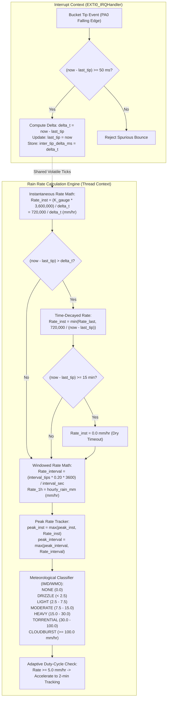

# Task Specification: S4-T3.3 - Rain Rate Intensity Calculation & Meteorological Classification

## 1. Task Metadata & Overview

| Attribute | Specification Details |
| :--- | :--- |
| **Sprint** | **Sprint 4: Sensor Drivers & Remote Field Bus Interfaces** |
| **Task ID** | `S4-T3.3` |
| **Parent Task** | `S4-T3: Implement Tipping-Bucket Rain Gauge Pulse Counter Driver` |
| **Task Title** | Implement Rain Rate Intensity Calculation ($\text{mm/hr}$), Peak Tracking & Meteorological Classification Tiers |
| **Status** | **Ready for Implementation** |
| **Target Files** | [`firmware/drivers/inc/rain_gauge_driver.h`](file:///C:/Users/ENERGY%20SAVER/Documents/Learning/Job%20Projects/rain-predict/firmware/drivers/inc/rain_gauge_driver.h)<br>[`firmware/drivers/src/rain_gauge_driver.c`](file:///C:/Users/ENERGY%20SAVER/Documents/Learning/Job%20Projects/rain-predict/firmware/drivers/src/rain_gauge_driver.c) |
| **Related Documents** | [`docs/sensors/rain-gauge-pulse.md`](file:///C:/Users/ENERGY%20SAVER/Documents/Learning/Job%20Projects/rain-predict/docs/sensors/rain-gauge-pulse.md)<br>[`docs/architecture/system-architecture.md`](file:///C:/Users/ENERGY%20SAVER/Documents/Learning/Job%20Projects/rain-predict/docs/architecture/system-architecture.md)<br>[`context/specs/s4-t3.1-rain-gauge-exti-debounce.md`](file:///C:/Users/ENERGY%20SAVER/Documents/Learning/Job%20Projects/rain-predict/context/specs/s4-t3.1-rain-gauge-exti-debounce.md)<br>[`context/specs/s4-t3.2-rain-gauge-accumulation.md`](file:///C:/Users/ENERGY%20SAVER/Documents/Learning/Job%20Projects/rain-predict/context/specs/s4-t3.2-rain-gauge-accumulation.md)<br>[`context/specs/s3-t4.2-stop2-sleep-manager.md`](file:///C:/Users/ENERGY%20SAVER/Documents/Learning/Job%20Projects/rain-predict/context/specs/s3-t4.2-stop2-sleep-manager.md)<br>[`context/coding-standards.md`](file:///C:/Users/ENERGY%20SAVER/Documents/Learning/Job%20Projects/rain-predict/context/coding-standards.md) |
| **Dependencies** | [`S4-T3.1`](file:///C:/Users/ENERGY%20SAVER/Documents/Learning/Job%20Projects/rain-predict/context/specs/s4-t3.1-rain-gauge-exti-debounce.md) (EXTI0 Interrupt & Debounce), [`S4-T3.2`](file:///C:/Users/ENERGY%20SAVER/Documents/Learning/Job%20Projects/rain-predict/context/specs/s4-t3.2-rain-gauge-accumulation.md) (Accumulator Subsystem) |
| **Downstream Tasks** | [`S4-T3.4`](file:///C:/Users/ENERGY%20SAVER/Documents/Learning/Job%20Projects/rain-predict/context/specs/s4-t3.4-test-rain-gauge.md) (Unit Test Suite), [`S2-T5.2`](file:///C:/Users/ENERGY%20SAVER/Documents/Learning/Job%20Projects/rain-predict/context/specs/s2-t5.2-rain-state-classification.md) (Rain State Classification), `S6-T3` (Application State Machine) |

---

## 2. Executive Summary & Architectural Scope

The primary objective of **`S4-T3.3`** is to develop the **Rain Rate Intensity Calculation Engine, Multi-Timeframe Rate Estimation, Peak Rate Tracking, and Meteorological Classification System** within [`firmware/drivers/inc/rain_gauge_driver.h`](file:///C:/Users/ENERGY%20SAVER/Documents/Learning/Job%20Projects/rain-predict/firmware/drivers/inc/rain_gauge_driver.h) and [`firmware/drivers/src/rain_gauge_driver.c`](file:///C:/Users/ENERGY%20SAVER/Documents/Learning/Job%20Projects/rain-predict/firmware/drivers/src/rain_gauge_driver.c) for the **STMicroelectronics STM32WLE5** SoC.

In high-altitude tea plantations (such as Munnar, Valparai, Nilgiris, and Darjeeling), tropical convective storms and orographic cloudbursts can escalate from a gentle drizzle ($1.0\text{ mm/hr}$) to torrential soil-eroding downpours ($> 100.0\text{ mm/hr}$) in under 10 minutes. Accurately quantifying **instantaneous rain rate** and **windowed precipitation intensity** is critical for:
1. **Immediate Crop & Field Safety**: Triggering flash flood alarms, siren alerts, and field-worker evacuation during cloudbursts ($\ge 100.0\text{ mm/hr}$).
2. **Soil Erosion & Slope Stability Forecasting**: Tracking peak instantaneous intensities ($I_{\text{peak}}$) that destabilize tea estate hillside terraces.
3. **Adaptive Power & Duty-Cycle Scheduling**: Accelerating the microcontroller telemetry reporting cycle from the baseline $10\text{--}15\text{ min}$ interval down to $2\text{ min}$ rapid storm tracking mode whenever rain intensity exceeds $5.0\text{ mm/hr}$.
4. **Meteorological Model Verification**: Providing standardized IMD/WMO precipitation classification categories for historical agronomic logging.



---

## 3. Mathematical Formulations & Derivations

### 3.1 Instantaneous Rain Rate ($I_{\text{inst}}$)

Instantaneous rain rate measures the precipitation intensity derived directly from the time elapsed between two consecutive bucket tips:

$$\Delta t = t_{\text{curr}} - t_{\text{prev}} \quad (\text{in milliseconds})$$

Given calibration constant $K_{\text{gauge}} = 0.20\text{ mm/tip}$:

$$I_{\text{inst}} (\text{mm/hr}) = \frac{K_{\text{gauge}} \times 3,600,000\text{ ms/hr}}{\Delta t_{\text{ms}}} = \frac{0.20 \times 3,600,000}{\Delta t_{\text{ms}}} = \frac{720,000}{\Delta t_{\text{ms}}}$$

#### Inter-Tip Delta Reference Table:
| Inter-Tip Time ($\Delta t$) | Instantaneous Rain Rate ($I_{\text{inst}}$) | Physical Phenomenon |
| :---: | :---: | :--- |
| **$50\text{ ms}$** (Debounce Limit) | $14,400.0\text{ mm/hr} \to \mathbf{300.0\text{ mm/hr}}$ | Clamped to physical sensor funnel throughput limit |
| **$2,400\text{ ms}$ ($2.4\text{ s}$)** | $300.0\text{ mm/hr}$ | Maximum measurable physical rate |
| **$7,200\text{ ms}$ ($7.2\text{ s}$)** | $100.0\text{ mm/hr}$ | Severe tropical cloudburst / violent downpour |
| **$14,400\text{ ms}$ ($14.4\text{ s}$)** | $50.0\text{ mm/hr}$ | Torrential monsoon deluge |
| **$28,800\text{ ms}$ ($28.8\text{ s}$)** | $25.0\text{ mm/hr}$ | Heavy convective storm |
| **$72,000\text{ ms}$ ($1.2\text{ min}$)** | $10.0\text{ mm/hr}$ | Moderate steady rainfall |
| **$144,000\text{ ms}$ ($2.4\text{ min}$)** | $5.0\text{ mm/hr}$ | Light rain (Storm tracking acceleration threshold) |
| **$288,000\text{ ms}$ ($4.8\text{ min}$)** | $2.5\text{ mm/hr}$ | Light drizzle |
| **$720,000\text{ ms}$ ($12.0\text{ min}$)** | $1.0\text{ mm/hr}$ | Very light misty drizzle |
| **$\ge 900,000\text{ ms}$ ($\ge 15\text{ min}$)** | $\mathbf{0.0\text{ mm/hr}}$ | Inactivity timeout decay to zero |

---

### 3.2 Time-Decayed Rate Estimation (Aging Logic)

If the instantaneous rain rate were calculated strictly at the moment of a tip and held constant, a single tip during a cloudburst ($100\text{ mm/hr}$) followed by complete cessation of rain would cause the driver to report $100\text{ mm/hr}$ indefinitely.

To ensure realistic meteorological decay when rain stops or eases:
When queried at timestamp $t_{\text{now}}$, the elapsed time since the last tip is:

$$\Delta t_{\text{elapsed}} = t_{\text{now}} - t_{\text{last\_tip}}$$

1. **If $\Delta t_{\text{elapsed}} \le \Delta t_{\text{inter\_tip}}$**:
   The rain is continuing at or above the previous rate:
   $$I_{\text{current}} = I_{\text{last\_calc}}$$

2. **If $\Delta t_{\text{elapsed}} > \Delta t_{\text{inter\_tip}}$**:
   The rate has slowed down. The maximum possible instantaneous rate is bounded by the time that has elapsed without a tip:
   $$I_{\text{decayed}} = \frac{720,000}{\Delta t_{\text{elapsed}}}$$
   $$I_{\text{current}} = \min\left(I_{\text{last\_calc}}, I_{\text{decayed}}\right)$$

3. **Inactivity Timeout**:
   If $\Delta t_{\text{elapsed}} \ge 900,000\text{ ms}$ ($15\text{ minutes}$):
   $$I_{\text{current}} = 0.0\text{ mm/hr}$$

---

### 3.3 Sample Interval Rain Rate ($I_{\text{interval}}$)

For a discrete sample interval lasting $\Delta T_{\text{sec}}$ seconds (typically $600\text{ s}$ for $10\text{-minute}$ duty cycles, or $120\text{ s}$ for $2\text{-minute}$ storm tracking cycles):

$$I_{\text{interval}} (\text{mm/hr}) = \frac{R_{\text{int}} (\text{mm})}{\Delta T_{\text{hours}}} = \frac{N_{\text{tips}} \times K_{\text{gauge}}}{\Delta T_{\text{sec}} / 3600.0\text{ s}} = \frac{N_{\text{tips}} \times 0.20 \times 3600.0}{\Delta T_{\text{sec}}} = \frac{N_{\text{tips}} \times 720.0}{\Delta T_{\text{sec}}}$$

- **For $10\text{-minute}$ Sample Window ($\Delta T = 600\text{ s}$)**:
  $$I_{\text{10min}} (\text{mm/hr}) = N_{\text{tips}} \times \frac{720.0}{600.0} = N_{\text{tips}} \times 1.20\text{ mm/hr}$$
- **For $2\text{-minute}$ Accelerated Storm Window ($\Delta T = 120\text{ s}$)**:
  $$I_{\text{2min}} (\text{mm/hr}) = N_{\text{tips}} \times \frac{720.0}{120.0} = N_{\text{tips}} \times 6.00\text{ mm/hr}$$

---

### 3.4 Rolling 1-Hour Rain Rate ($I_{\text{1h}}$)

Because the rolling 1-hour register $R_{\text{1h}}$ represents total accumulated precipitation over exactly $60\text{ minutes}$ ($1.0\text{ hour}$):

$$I_{\text{1h}} (\text{mm/hr}) = R_{\text{1h}} (\text{mm}) \quad (1\text{ hr window})$$

---

### 3.5 Meteorological Intensity Classification Tiers (IMD/WMO Standard)

The driver maps calculated rain rates into standard meteorological intensity categories tailored for tea plantation microclimates:

$$\text{Intensity Tier} = f(I_{\text{rate}})$$

| Enum Identifier | Rain Rate Range ($I_{\text{rate}}$) | Classification | Plantation Impact / Operational Action |
| :--- | :---: | :--- | :--- |
| `RAIN_INTENSITY_NONE` | $I = 0.0\text{ mm/hr}$ | **No Rain** | Baseline solar harvesting & routine field plucking. |
| `RAIN_INTENSITY_DRIZZLE` | $0.0 < I < 2.5\text{ mm/hr}$ | **Very Light / Drizzle** | Moisture accumulation on tea leaves; standard plucking continues. |
| `RAIN_INTENSITY_LIGHT` | $2.5 \le I < 7.5\text{ mm/hr}$ | **Light Rain** | Gentle soaking rain; plucking continues with waterproof gear. |
| `RAIN_INTENSITY_MODERATE` | $7.5 \le I < 15.0\text{ mm/hr}$ | **Moderate Rain** | Soil saturation begins; accelerated storm tracking active. |
| `RAIN_INTENSITY_HEAVY` | $15.0 \le I < 30.0\text{ mm/hr}$ | **Heavy Rain** | Estate drainage runoff increases; field workers seek shelter. |
| `RAIN_INTENSITY_TORRENTIAL` | $30.0 \le I < 100.0\text{ mm/hr}$ | **Torrential Downpour** | High erosion risk; yellow strobe warning; drainage monitoring. |
| `RAIN_INTENSITY_CLOUDBURST` | $I \ge 100.0\text{ mm/hr}$ | **Violent Cloudburst** | Severe flash flood/landslide risk; red alarm siren activated. |

---

## 4. Public API & Data Structures (`rain_gauge_driver.h`)

### 4.1 Data Types & Enums

```c
/**
 * @brief Meteorological precipitation intensity classification tiers (IMD/WMO standard).
 */
typedef enum {
    RAIN_INTENSITY_NONE = 0,    /**< 0.0 mm/hr: No precipitation detected */
    RAIN_INTENSITY_DRIZZLE,     /**< >0.0 to <2.5 mm/hr: Very light rain / mist / drizzle */
    RAIN_INTENSITY_LIGHT,       /**< 2.5 to <7.5 mm/hr: Light precipitation */
    RAIN_INTENSITY_MODERATE,    /**< 7.5 to <15.0 mm/hr: Moderate steady rain */
    RAIN_INTENSITY_HEAVY,       /**< 15.0 to <30.0 mm/hr: Heavy downpour */
    RAIN_INTENSITY_TORRENTIAL,  /**< 30.0 to <100.0 mm/hr: Torrential tropical rain */
    RAIN_INTENSITY_CLOUDBURST   /**< >=100.0 mm/hr: Violent convective cloudburst */
} rain_intensity_t;

/**
 * @brief Comprehensive real-time rain rate metrics and intensity tracking structure.
 */
typedef struct {
    float               instantaneous_rate_mm_hr;   /**< Current inter-tip derivative rate (decayed) */
    float               interval_rate_mm_hr;        /**< Rain rate over current sample interval */
    float               hourly_rate_mm_hr;          /**< Rolling 60-minute rain rate */
    float               peak_instantaneous_mm_hr;   /**< Peak instantaneous rate recorded */
    float               peak_interval_mm_hr;        /**< Peak interval rate recorded */
    rain_intensity_t    current_intensity;          /**< Meteorological intensity tier */
    uint32_t            last_tip_tick_ms;           /**< System tick (ms) of most recent tip */
    uint32_t            inter_tip_delta_ms;         /**< Measured time delta between last two tips */
} rain_rate_metrics_t;
```

---

### 4.2 Function Prototypes

| Function Prototype | Description |
| :--- | :--- |
| `float rain_gauge_get_instantaneous_rate(uint32_t current_tick_ms)` | Computes time-decayed instantaneous rain rate ($\text{mm/hr}$) based on inter-tip timing. |
| `float rain_gauge_compute_interval_rate(uint16_t interval_tips, uint32_t interval_duration_sec)` | Calculates rain rate ($\text{mm/hr}$) for a completed interval duration. |
| `status_t rain_gauge_get_rate_metrics(uint32_t current_tick_ms, uint32_t interval_duration_sec, rain_rate_metrics_t *p_metrics)` | Populates the comprehensive real-time rain rate and intensity structure. |
| `rain_intensity_t rain_gauge_classify_intensity(float rain_rate_mm_hr)` | Maps a rain rate ($\text{mm/hr}$) to its corresponding meteorological intensity tier. |
| `const char *rain_gauge_intensity_to_str(rain_intensity_t intensity)` | Returns human-readable diagnostic string for an intensity enum. |
| `bool rain_gauge_should_accelerate_sampling(float rain_rate_mm_hr)` | Returns `true` if rain rate warrants accelerating duty cycle ($10\text{ min} \to 2\text{ min}$). |
| `void rain_gauge_reset_peak_rates(void)` | Resets peak instantaneous and interval rate registers to zero. |

---

## 5. Concrete File Implementation Blueprint

### 5.1 `firmware/drivers/inc/rain_gauge_driver.h` Additions

```c
/**
 * @file    rain_gauge_driver.h (Rain Rate & Intensity Additions)
 * @brief   Rain rate intensity calculations, peak tracking, and classification.
 */

#ifndef RAIN_GAUGE_DRIVER_H
#define RAIN_GAUGE_DRIVER_H

#include <stdint.h>
#include <stdbool.h>
#include "status_codes.h"

#ifdef __cplusplus
extern "C" {
#endif

/* ========================================================================== */
/* Rain Rate Constants                                                        */
/* ========================================================================== */

#define RAIN_RATE_NUMERATOR_MS              720000.0f   /**< 0.20 mm * 3,600,000 ms/hr */
#define RAIN_RATE_NUMERATOR_SEC             720.0f      /**< 0.20 mm * 3600 s/hr */
#define RAIN_RATE_MAX_MM_HR                 300.0f      /**< Terrestrial physical clamping limit */
#define RAIN_RATE_INACTIVITY_TIMEOUT_MS     900000U     /**< 15 min decay to 0.0 mm/hr */
#define RAIN_RATE_ACCELERATION_THRESH_MM_HR 5.0f        /**< Threshold to trigger 2-min tracking */

/* Intensity Boundaries (mm/hr) */
#define RAIN_THRESH_DRIZZLE_MIN_MM_HR       0.001f
#define RAIN_THRESH_LIGHT_MIN_MM_HR         2.5f
#define RAIN_THRESH_MODERATE_MIN_MM_HR      7.5f
#define RAIN_THRESH_HEAVY_MIN_MM_HR         15.0f
#define RAIN_THRESH_TORRENTIAL_MIN_MM_HR    30.0f
#define RAIN_THRESH_CLOUDBURST_MIN_MM_HR    100.0f

/* ========================================================================== */
/* Data Types & Enums                                                         */
/* ========================================================================== */

typedef enum {
    RAIN_INTENSITY_NONE = 0,
    RAIN_INTENSITY_DRIZZLE,
    RAIN_INTENSITY_LIGHT,
    RAIN_INTENSITY_MODERATE,
    RAIN_INTENSITY_HEAVY,
    RAIN_INTENSITY_TORRENTIAL,
    RAIN_INTENSITY_CLOUDBURST
} rain_intensity_t;

typedef struct {
    float               instantaneous_rate_mm_hr;
    float               interval_rate_mm_hr;
    float               hourly_rate_mm_hr;
    float               peak_instantaneous_mm_hr;
    float               peak_interval_mm_hr;
    rain_intensity_t    current_intensity;
    uint32_t            last_tip_tick_ms;
    uint32_t            inter_tip_delta_ms;
} rain_rate_metrics_t;

/* ========================================================================== */
/* Public Function Prototypes                                                 */
/* ========================================================================== */

/**
 * @brief  Computes instantaneous rain rate with time-decay aging.
 * @param  current_tick_ms Current system timestamp in milliseconds.
 * @return Decayed instantaneous rain rate in mm/hr (clamped to 0.0 - 300.0 mm/hr).
 */
float rain_gauge_get_instantaneous_rate(uint32_t current_tick_ms);

/**
 * @brief  Calculates rain rate for a discrete sample interval.
 * @param  interval_tips Total tips recorded during interval.
 * @param  interval_duration_sec Duration of the interval in seconds (e.g. 600 s).
 * @return Calculated interval rain rate in mm/hr.
 */
float rain_gauge_compute_interval_rate(uint16_t interval_tips, uint32_t interval_duration_sec);

/**
 * @brief  Retrieves full snapshot of rain rate metrics and intensity tier.
 * @param  current_tick_ms Current system timestamp in milliseconds.
 * @param  interval_duration_sec Duration of the active interval in seconds.
 * @param[out] p_metrics Pointer to rain_rate_metrics_t structure to populate.
 * @return STATUS_OK on success, or STATUS_ERROR_NULL_POINTER.
 */
status_t rain_gauge_get_rate_metrics(uint32_t current_tick_ms,
                                     uint32_t interval_duration_sec,
                                     rain_rate_metrics_t *p_metrics);

/**
 * @brief  Classifies a rain rate into meteorological intensity tier.
 * @param  rain_rate_mm_hr Rain rate in mm/hr.
 * @return Corresponding rain_intensity_t enum.
 */
rain_intensity_t rain_gauge_classify_intensity(float rain_rate_mm_hr);

/**
 * @brief  Converts rain_intensity_t enum to human-readable string.
 * @param  intensity Intensity tier enum.
 * @return Constant pointer to descriptive string.
 */
const char *rain_gauge_intensity_to_str(rain_intensity_t intensity);

/**
 * @brief  Evaluates whether current rain rate requires accelerating duty cycle.
 * @param  rain_rate_mm_hr Rain rate in mm/hr.
 * @return true if rate >= 5.0 mm/hr, false otherwise.
 */
bool rain_gauge_should_accelerate_sampling(float rain_rate_mm_hr);

/**
 * @brief  Resets peak instantaneous and interval rate registers to zero.
 */
void rain_gauge_reset_peak_rates(void);

#ifdef __cplusplus
}
#endif

#endif /* RAIN_GAUGE_DRIVER_H */
```

---

### 5.2 `firmware/drivers/src/rain_gauge_driver.c` Rate Implementation

```c
/**
 * @file    rain_gauge_driver.c (Rain Rate Engine Implementation)
 * @brief   Rain rate derivative math, decay aging, peak tracking, and classification.
 */

#include "rain_gauge_driver.h"
#include <string.h>

#ifdef STM32WLE5xx
#include "stm32wlxx_hal.h"
#else
static uint32_t s_mock_primask = 0;
#define __disable_irq() (s_mock_primask = 1)
#define __enable_irq()  (s_mock_primask = 0)
#endif

/* External Accumulator Declarations from s4-t3.2 */
extern uint16_t g_interval_tips;
extern float    rain_gauge_get_hourly_rain_mm(void);

/* Volatile Timing State (Updated in EXTI0 ISR) */
static volatile uint32_t g_last_tip_tick_ms      = 0;
static volatile uint32_t g_inter_tip_delta_ms    = 0;
static volatile bool     g_has_first_tip         = false;

/* Peak Rate Tracking Registers */
static float g_peak_instantaneous_mm_hr = 0.0f;
static float g_peak_interval_mm_hr      = 0.0f;

/* Internal ISR Hook called from rain_gauge_isr_handler() */
void rain_gauge_record_tip_timing_isr(uint32_t current_tick_ms)
{
    if (g_has_first_tip) {
        g_inter_tip_delta_ms = current_tick_ms - g_last_tip_tick_ms;
    } else {
        g_has_first_tip = true;
        g_inter_tip_delta_ms = 0;
    }
    g_last_tip_tick_ms = current_tick_ms;
}

float rain_gauge_get_instantaneous_rate(uint32_t current_tick_ms)
{
    uint32_t last_tick;
    uint32_t delta_ms;
    bool     has_tip;

    /* Thread-safe snapshot of timing variables */
    __disable_irq();
    last_tick = g_last_tip_tick_ms;
    delta_ms  = g_inter_tip_delta_ms;
    has_tip   = g_has_first_tip;
    __enable_irq();

    if (!has_tip || (delta_ms == 0U)) {
        return 0.0f;
    }

    uint32_t elapsed_since_last = current_tick_ms - last_tick;

    /* Inactivity timeout check (15 minutes of zero tips) */
    if (elapsed_since_last >= RAIN_RATE_INACTIVITY_TIMEOUT_MS) {
        return 0.0f;
    }

    /* Baseline rate from last inter-tip period */
    float base_rate = RAIN_RATE_NUMERATOR_MS / (float)delta_ms;

    /* Apply time-decay aging if elapsed time exceeds last delta */
    if (elapsed_since_last > delta_ms) {
        float decayed_rate = RAIN_RATE_NUMERATOR_MS / (float)elapsed_since_last;
        if (decayed_rate < base_rate) {
            base_rate = decayed_rate;
        }
    }

    /* Clamp to physical sensor limit */
    if (base_rate > RAIN_RATE_MAX_MM_HR) {
        base_rate = RAIN_RATE_MAX_MM_HR;
    } else if (base_rate < 0.0f) {
        base_rate = 0.0f;
    }

    /* Update peak instantaneous rate */
    if (base_rate > g_peak_instantaneous_mm_hr) {
        g_peak_instantaneous_mm_hr = base_rate;
    }

    return base_rate;
}

float rain_gauge_compute_interval_rate(uint16_t interval_tips, uint32_t interval_duration_sec)
{
    if (interval_duration_sec == 0U) {
        return 0.0f;
    }

    float rate = ((float)interval_tips * RAIN_RATE_NUMERATOR_SEC) / (float)interval_duration_sec;

    if (rate > RAIN_RATE_MAX_MM_HR) {
        rate = RAIN_RATE_MAX_MM_HR;
    } else if (rate < 0.0f) {
        rate = 0.0f;
    }

    /* Update peak interval rate */
    if (rate > g_peak_interval_mm_hr) {
        g_peak_interval_mm_hr = rate;
    }

    return rate;
}

rain_intensity_t rain_gauge_classify_intensity(float rain_rate_mm_hr)
{
    if (rain_rate_mm_hr < RAIN_THRESH_DRIZZLE_MIN_MM_HR) {
        return RAIN_INTENSITY_NONE;
    } else if (rain_rate_mm_hr < RAIN_THRESH_LIGHT_MIN_MM_HR) {
        return RAIN_INTENSITY_DRIZZLE;
    } else if (rain_rate_mm_hr < RAIN_THRESH_MODERATE_MIN_MM_HR) {
        return RAIN_INTENSITY_LIGHT;
    } else if (rain_rate_mm_hr < RAIN_THRESH_HEAVY_MIN_MM_HR) {
        return RAIN_INTENSITY_MODERATE;
    } else if (rain_rate_mm_hr < RAIN_THRESH_TORRENTIAL_MIN_MM_HR) {
        return RAIN_INTENSITY_HEAVY;
    } else if (rain_rate_mm_hr < RAIN_THRESH_CLOUDBURST_MIN_MM_HR) {
        return RAIN_INTENSITY_TORRENTIAL;
    } else {
        return RAIN_INTENSITY_CLOUDBURST;
    }
}

const char *rain_gauge_intensity_to_str(rain_intensity_t intensity)
{
    switch (intensity) {
        case RAIN_INTENSITY_NONE:       return "None";
        case RAIN_INTENSITY_DRIZZLE:     return "Drizzle";
        case RAIN_INTENSITY_LIGHT:       return "Light";
        case RAIN_INTENSITY_MODERATE:    return "Moderate";
        case RAIN_INTENSITY_HEAVY:       return "Heavy";
        case RAIN_INTENSITY_TORRENTIAL:  return "Torrential";
        case RAIN_INTENSITY_CLOUDBURST:  return "Cloudburst";
        default:                         return "Unknown";
    }
}

bool rain_gauge_should_accelerate_sampling(float rain_rate_mm_hr)
{
    return (rain_rate_mm_hr >= RAIN_RATE_ACCELERATION_THRESH_MM_HR);
}

status_t rain_gauge_get_rate_metrics(uint32_t current_tick_ms,
                                     uint32_t interval_duration_sec,
                                     rain_rate_metrics_t *p_metrics)
{
    if (p_metrics == NULL) {
        return STATUS_ERROR_NULL_POINTER;
    }

    uint16_t cur_interval_tips;
    __disable_irq();
    cur_interval_tips            = g_interval_tips;
    p_metrics->last_tip_tick_ms  = g_last_tip_tick_ms;
    p_metrics->inter_tip_delta_ms = g_inter_tip_delta_ms;
    __enable_irq();

    p_metrics->instantaneous_rate_mm_hr = rain_gauge_get_instantaneous_rate(current_tick_ms);
    p_metrics->interval_rate_mm_hr      = rain_gauge_compute_interval_rate(cur_interval_tips, interval_duration_sec);
    p_metrics->hourly_rate_mm_hr        = rain_gauge_get_hourly_rain_mm(); /* 1h depth = 1h rate */
    p_metrics->peak_instantaneous_mm_hr = g_peak_instantaneous_mm_hr;
    p_metrics->peak_interval_mm_hr      = g_peak_interval_mm_hr;
    
    /* Primary intensity classified from maximum of instantaneous and interval rates */
    float active_rate = (p_metrics->instantaneous_rate_mm_hr > p_metrics->interval_rate_mm_hr) ?
                         p_metrics->instantaneous_rate_mm_hr : p_metrics->interval_rate_mm_hr;
    p_metrics->current_intensity        = rain_gauge_classify_intensity(active_rate);

    return STATUS_OK;
}

void rain_gauge_reset_peak_rates(void)
{
    g_peak_instantaneous_mm_hr = 0.0f;
    g_peak_interval_mm_hr      = 0.0f;
}
```

---

## 6. Defensive Programming, Clamping & Power Hardening

1. **Zero-Division & Underflow Guards**:
   - In `rain_gauge_compute_interval_rate()`, if `interval_duration_sec == 0`, the function immediately returns `0.0f` without executing floating-point division.
   - In `rain_gauge_get_instantaneous_rate()`, if `delta_ms == 0` or `!g_has_first_tip`, the function returns `0.0f`.
2. **Physical Terrestrial Clamping ($300.0\text{ mm/hr}$)**:
   - Physical tipping-bucket gauges suffer from funnel splash-out and mechanical inertia above $300\text{ mm/hr}$. All rates are hard-clamped to `[0.0, 300.0] mm/hr`.
3. **Inactivity Timeout Decay ($15\text{ min}$)**:
   - When rain ceases, `rain_gauge_get_instantaneous_rate()` automatically decays as a function of elapsed time $720,000 / \Delta t_{\text{elapsed}}$ and cleanly drops to `0.0 mm/hr` after $15\text{ minutes}$ ($900,000\text{ ms}$).
4. **Asynchronous Interrupt Synchronization**:
   - `g_last_tip_tick_ms` and `g_inter_tip_delta_ms` are read within `__disable_irq()` / `__enable_irq()` critical sections ($< 6$ CPU cycles) to guarantee atomic reads across 32-bit word boundaries.
5. **Zero Dynamic Allocation**:
   - All state registers, metrics structures, and string literals use static storage duration. `malloc` and `free` are strictly prohibited.

---

## 7. Verification & Test Matrix (10 Points)

| Test ID | Verification Description | Input Stimulus / State | Expected Behavior / Mathematical Output |
| :---: | :--- | :--- | :--- |
| **`TC-RATE-01`** | **First Tip Initialization** | Single bucket tip at $t = 10,000\text{ ms}$ | `g_has_first_tip = true`, `inter_tip_delta_ms = 0`, `rain_gauge_get_instantaneous_rate() == 0.0f`. |
| **`TC-RATE-02`** | **Moderate Rain Inter-Tip Math** | Two tips: $t_1 = 10,000\text{ ms}$, $t_2 = 46,000\text{ ms}$ ($\Delta t = 36,000\text{ ms}$) | $I_{\text{inst}} = 720,000 / 36,000 = \mathbf{20.00\text{ mm/hr}}$, `RAIN_INTENSITY_HEAVY`. |
| **`TC-RATE-03`** | **Cloudburst Extreme Math** | Two tips: $t_1 = 50,000\text{ ms}$, $t_2 = 57,200\text{ ms}$ ($\Delta t = 7,200\text{ ms}$) | $I_{\text{inst}} = 720,000 / 7,200 = \mathbf{100.00\text{ mm/hr}}$, `RAIN_INTENSITY_CLOUDBURST`. |
| **`TC-RATE-04`** | **Debounce Limit Clamping** | Two tips at minimum debounce window $\Delta t = 50\text{ ms}$ | $720,000 / 50 = 14,400\text{ mm/hr} \to$ Clamped to $\mathbf{300.00\text{ mm/hr}}$. |
| **`TC-RATE-05`** | **Time-Decayed Aging Math** | Last $\Delta t = 7,200\text{ ms}$ ($100\text{ mm/hr}$), query at $t_{\text{now}} = t_2 + 36,000\text{ ms}$ | Elapsed $= 36,000\text{ ms} \implies I_{\text{decayed}} = 720,000 / 36,000 = \mathbf{20.00\text{ mm/hr}}$. |
| **`TC-RATE-06`** | **Inactivity Timeout Zeroing** | Query at $t_{\text{now}} = t_{\text{last}} + 900,000\text{ ms}$ ($15\text{ min}$) | $I_{\text{inst}} = \mathbf{0.00\text{ mm/hr}}$, `RAIN_INTENSITY_NONE`. |
| **`TC-RATE-07`** | **10-Min & 2-Min Interval Rates** | $N = 25\text{ tips}$ in $600\text{ s}$ vs $N = 5\text{ tips}$ in $120\text{ s}$ | $I_{\text{10min}} = 25 \times 1.20 = \mathbf{30.00\text{ mm/hr}}$; $I_{\text{2min}} = 5 \times 6.00 = \mathbf{30.00\text{ mm/hr}}$. |
| **`TC-RATE-08`** | **Intensity Classification Tiers** | Inputs: $0.0, 1.2, 5.0, 12.0, 25.0, 60.0, 150.0\text{ mm/hr}$ | Mapped to: `NONE`, `DRIZZLE`, `LIGHT`, `MODERATE`, `HEAVY`, `TORRENTIAL`, `CLOUDBURST`. |
| **`TC-RATE-09`** | **Storm Acceleration Trigger** | Rain rates: $4.9\text{ mm/hr}$ vs $5.1\text{ mm/hr}$ | `should_accelerate(4.9) == false`; `should_accelerate(5.1) == true`. |
| **`TC-RATE-10`** | **Peak Tracking & Reset** | Rate sequence: $10.0 \to 45.0 \to 20.0\text{ mm/hr}$, then `reset_peak_rates()` | Peak holds at $45.0\text{ mm/hr}$; resets to $0.0\text{ mm/hr}$ after call. |

---

## 8. Acceptance Criteria & Implementation Checklist

- [ ] **Instantaneous Derivative Calculation**: Implemented `rain_gauge_get_instantaneous_rate()` with $720,000 / \Delta t$ formula and terrestrial $300.0\text{ mm/hr}$ ceiling.
- [ ] **Time-Decay Aging**: Verified rate decay when elapsed time exceeds previous inter-tip delta and drops to $0.0\text{ mm/hr}$ after 15 minutes.
- [ ] **Interval Rain Rate Scaling**: Implemented `rain_gauge_compute_interval_rate()` supporting arbitrary interval durations ($600\text{ s}$, $120\text{ s}$) with zero-duration defensive protection.
- [ ] **Meteorological Classification**: Implemented `rain_gauge_classify_intensity()` across all 7 IMD/WMO tiers and corresponding `rain_gauge_intensity_to_str()`.
- [ ] **Storm Tracking Scheduling**: Implemented `rain_gauge_should_accelerate_sampling()` with $5.0\text{ mm/hr}$ threshold to accelerate RTC wakeup to 2 minutes.
- [ ] **Peak Rate Tracking**: Implemented persistent peak instantaneous and peak interval tracking with `rain_gauge_reset_peak_rates()`.
- [ ] **Zero Dynamic Allocation & Strict C99**: 100% static memory allocation, zero heap usage, deterministic CPU cycles.
