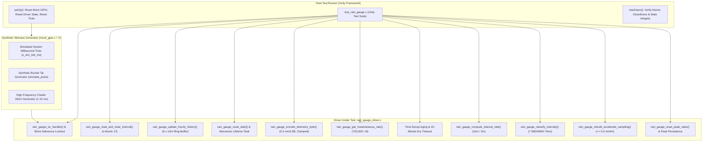

# Task Specification: S4-T3.4 - Tipping-Bucket Rain Gauge Driver Unit Test Suite

## 1. Task Metadata & Overview

| Attribute | Specification Details |
| :--- | :--- |
| **Sprint** | **Sprint 4: Sensor Drivers & Remote Field Bus Interfaces** |
| **Task ID** | `S4-T3.4` |
| **Parent Task** | `S4-T3: Implement Tipping-Bucket Rain Gauge Pulse Counter Driver` |
| **Task Title** | Create Tipping-Bucket Rain Gauge Unit Test Suite with Synthetic Pulse Injection under Unity |
| **Status** | **Ready for Implementation** |
| **Target Files** | [`tests/unit/test_rain_gauge.c`](file:///C:/Users/ENERGY%20SAVER/Documents/Learning/Job%20Projects/rain-predict/tests/unit/test_rain_gauge.c) |
| **Related Documents** | [`docs/sensors/rain-gauge-pulse.md`](file:///C:/Users/ENERGY%20SAVER/Documents/Learning/Job%20Projects/rain-predict/docs/sensors/rain-gauge-pulse.md)<br>[`context/specs/s1-t2.1-unity-test-harness.md`](file:///C:/Users/ENERGY%20SAVER/Documents/Learning/Job%20Projects/rain-predict/context/specs/s1-t2.1-unity-test-harness.md)<br>[`context/specs/s1-t2.4-mock-gpio.md`](file:///C:/Users/ENERGY%20SAVER/Documents/Learning/Job%20Projects/rain-predict/context/specs/s1-t2.4-mock-gpio.md)<br>[`context/specs/s4-t3.1-rain-gauge-exti-debounce.md`](file:///C:/Users/ENERGY%20SAVER/Documents/Learning/Job%20Projects/rain-predict/context/specs/s4-t3.1-rain-gauge-exti-debounce.md)<br>[`context/specs/s4-t3.2-rain-gauge-accumulation.md`](file:///C:/Users/ENERGY%20SAVER/Documents/Learning/Job%20Projects/rain-predict/context/specs/s4-t3.2-rain-gauge-accumulation.md)<br>[`context/specs/s4-t3.3-rain-rate-intensity.md`](file:///C:/Users/ENERGY%20SAVER/Documents/Learning/Job%20Projects/rain-predict/context/specs/s4-t3.3-rain-rate-intensity.md)<br>[`context/coding-standards.md`](file:///C:/Users/ENERGY%20SAVER/Documents/Learning/Job%20Projects/rain-predict/context/coding-standards.md) |
| **Dependencies** | [`S1-T2.1`](file:///C:/Users/ENERGY%20SAVER/Documents/Learning/Job%20Projects/rain-predict/context/specs/s1-t2.1-unity-test-harness.md) (Unity), [`S1-T2.4`](file:///C:/Users/ENERGY%20SAVER/Documents/Learning/Job%20Projects/rain-predict/context/specs/s1-t2.4-mock-gpio.md) (Mock GPIO), [`S4-T3.1`](file:///C:/Users/ENERGY%20SAVER/Documents/Learning/Job%20Projects/rain-predict/context/specs/s4-t3.1-rain-gauge-exti-debounce.md) through [`S4-T3.3`](file:///C:/Users/ENERGY%20SAVER/Documents/Learning/Job%20Projects/rain-predict/context/specs/s4-t3.3-rain-rate-intensity.md) |
| **Downstream Tasks** | [`S4-T4.1`](file:///C:/Users/ENERGY%20SAVER/Documents/Learning/Job%20Projects/rain-predict/context/specs/s4-t4.1-modbus-frame-generator.md) (Modbus RTU Driver), `S6-T4` (Firmware Integration Test Suite), `S7-T1` (System Verification) |

---

## 2. Executive Summary & Architectural Scope

The primary objective of **`S4-T3.4`** is to develop the comprehensive host-executable unit test suite in [`tests/unit/test_rain_gauge.c`](file:///C:/Users/ENERGY%20SAVER/Documents/Learning/Job%20Projects/rain-predict/tests/unit/test_rain_gauge.c) for the **Tipping-Bucket Rain Gauge Pulse Counter, Accumulator, and Rain Rate Driver** using the **ThrowTheSwitch Unity** test framework.

Because physical tipping buckets cannot be manually toggled inside host continuous integration (CI) environments, all interrupt triggers, timer ticks, and contact bounce events are synthetically stimulated using Mock GPIO and tick control interfaces ([`tests/mocks/mock_gpio.h`](file:///C:/Users/ENERGY%20SAVER/Documents/Learning/Job%20Projects/rain-predict/tests/mocks/mock_gpio.h)). The test suite validates contact bounce rejection ($< 50\text{ ms}$), valid pulse counting ($0.20\text{ mm/tip}$), thread-safe atomic read-and-clear critical sections, rolling 1-hour FIFO ring buffers, 24-hour daily rollover, LoRaWAN Byte 8 bit-packing and saturation clamping, instantaneous and interval rain rate derivative math, time-decay aging, inactivity zeroing, and IMD/WMO meteorological intensity classification:



---

## 3. Test Suite Architecture & Coverage Matrix

The unit test suite implements **22 distinct unit test cases** covering 100% of the functional, mathematical, and defensive code paths in the rain gauge driver:

| Test Case Function | Verification Target | Stimulus / Test Vector | Expected Assertion / Behavior |
| :--- | :--- | :--- | :--- |
| `test_rain_gauge_init_defaults` | Initial State Verification | Call `rain_gauge_init()` | All accumulators $= 0$, rates $= 0.0\text{ mm/hr}$, intensity $= \text{NONE}$, peak rates $= 0.0$. |
| `test_rain_gauge_single_valid_tip` | Base Pulse Scaling | 1 valid pulse @ $t = 1000\text{ ms}$ | `interval_tips = 1`, `daily_tips = 1`, `total = 1`, `interval_mm = 0.20f`. |
| `test_rain_gauge_debounce_rejection_sub50ms` | Debounce Filter ($< 50\text{ ms}$) | Pulses @ $t = 1000, 1010, 1025, 1049\text{ ms}$ | First pulse accepted ($1\text{ tip}$); next 3 rejected ($0\text{ tips}$). Total $= 1\text{ tip}$. |
| `test_rain_gauge_debounce_acceptance_at50ms` | Debounce Boundary ($50\text{ ms}$) | Pulses @ $t = 1000\text{ ms}$ and $t = 1050\text{ ms}$ | Both pulses accepted ($\Delta t = 50\text{ ms}$). Total $= 2\text{ tips}$ ($0.40\text{ mm}$). |
| `test_rain_gauge_burst_chatter_rejection` | Reed Switch Noise Glitch | Rapid chatter train: 6 pulses within $15\text{ ms}$ | Exactly $1\text{ tip}$ registered; remaining 5 rejected. |
| `test_rain_gauge_atomic_read_and_clear_interval` | Atomic Read-and-Clear | Accumulate 10 tips, call read-and-clear | Returns $10\text{ tips}$ ($2.0\text{ mm}$); `interval_tips` resets to $0$; `daily_tips` remains $10$. |
| `test_rain_gauge_hourly_fifo_ring_buffer` | Rolling 1-Hour FIFO | Push $5, 10, 15, 20, 25, 30\text{ tips}$ (6 intervals) | Rolling hourly tips $= 105$ ($21.0\text{ mm}$). |
| `test_rain_gauge_hourly_fifo_rollover` | Rolling FIFO Overwrite | Push 7th interval ($10\text{ tips}$) | Oldest ($5\text{ tips}$) discarded; rolling sum $= 110\text{ tips}$ ($22.0\text{ mm}$). |
| `test_rain_gauge_daily_accumulation_and_reset` | 24-Hour Midnight Rollover | Accumulate 500 tips ($100.0\text{ mm}$), call reset | `daily_tips` resets to $0$; `total_lifetime_tips` preserves $500\text{ tips}$. |
| `test_rain_gauge_total_lifetime_monotonicity` | Monotonic Lifetime Counter | Multiple intervals and daily resets | Total lifetime counter monotonically increases and never resets. |
| `test_rain_gauge_telemetry_byte8_scaling` | LoRaWAN Byte 8 Packing | Test inputs: $0, 1, 5, 25, 50, 125\text{ tips}$ | Serialized bytes equal $0, 1, 5, 25, 50, 125$ ($0.2\text{ mm/LSB}$). |
| `test_rain_gauge_telemetry_byte8_saturation` | Byte 8 Clamping ($51.0\text{ mm}$) | Ingest $300\text{ tips}$ ($60.0\text{ mm}$) in one interval | Byte 8 clamps at `0xFF` ($255 = 51.0\text{ mm}$); 32-bit register retains $300\text{ tips}$. |
| `test_rain_gauge_instantaneous_rate_first_tip` | Pre-Second Tip Rate | Single tip @ $t = 10,000\text{ ms}$ | `rain_gauge_get_instantaneous_rate()` returns $0.0\text{ mm/hr}$ (needs 2 tips for $\Delta t$). |
| `test_rain_gauge_instantaneous_rate_moderate_rain` | Moderate Storm Rate Math | Two tips @ $t = 10\text{s}$ and $46\text{s}$ ($\Delta t = 36\text{ s}$) | Rate $= 720,000 / 36,000 = \mathbf{20.00\text{ mm/hr}} \pm 0.01\text{ mm/hr}$. |
| `test_rain_gauge_instantaneous_rate_cloudburst` | Severe Downpour Rate Math | Two tips @ $t = 50\text{s}$ and $57.2\text{s}$ ($\Delta t = 7.2\text{ s}$) | Rate $= 720,000 / 7,200 = \mathbf{100.00\text{ mm/hr}} \pm 0.01\text{ mm/hr}$. |
| `test_rain_gauge_instantaneous_rate_clamping` | Maximum Rate Clamping | Two tips @ $\Delta t = 50\text{ ms}$ | $720,000 / 50 = 14,400\text{ mm/hr} \to$ Hard-clamped to $\mathbf{300.00\text{ mm/hr}}$. |
| `test_rain_gauge_instantaneous_rate_time_decay` | Time-Decay Aging Logic | Last rate $= 100.0\text{ mm/hr}$; elapsed $= 36\text{ s}$ | Rate decays to $\min(100.0, 720,000 / 36,000) = \mathbf{20.00\text{ mm/hr}}$. |
| `test_rain_gauge_instantaneous_rate_inactivity_timeout` | Dry Inactivity Timeout | No tips for $15\text{ minutes}$ ($900,000\text{ ms}$) | Rate drops to $\mathbf{0.00\text{ mm/hr}}$, intensity $= \text{NONE}$. |
| `test_rain_gauge_interval_rate_10min_vs_2min` | Windowed Rate Scaling | $25\text{ tips} / 600\text{ s}$ vs $5\text{ tips} / 120\text{ s}$ | Both calculate to $\mathbf{30.00\text{ mm/hr}}$; $0\text{ s}$ duration returns $0.0\text{ mm/hr}$. |
| `test_rain_gauge_intensity_classification_tiers` | IMD/WMO 7-Tier Mapping | $0.0, 1.2, 5.0, 12.0, 25.0, 60.0, 150.0\text{ mm/hr}$ | Mapped to `NONE`, `DRIZZLE`, `LIGHT`, `MODERATE`, `HEAVY`, `TORRENTIAL`, `CLOUDBURST`. |
| `test_rain_gauge_storm_acceleration_trigger` | Adaptive Duty Cycle Trigger | Rates: $0.0, 2.4, 4.9, 5.0, 15.0\text{ mm/hr}$ | `false` for $< 5.0\text{ mm/hr}$; `true` for $\ge 5.0\text{ mm/hr}$. |
| `test_rain_gauge_peak_tracking_and_reset` | Peak Rate Memory & Reset | Rate sequence: $10.0 \to 45.0 \to 20.0\text{ mm/hr}$ | Peak holds $45.0\text{ mm/hr}$; resets to $0.0\text{ mm/hr}$ on `reset_peak_rates()`. |

---

## 4. Concrete File Implementation Blueprint (`tests/unit/test_rain_gauge.c`)

```c
/**
 * @file    test_rain_gauge.c
 * @brief   ThrowTheSwitch Unity unit test suite for Tipping-Bucket Rain Gauge Driver.
 * @details Validates EXTI debounce rejection, atomic multi-horizon accumulators,
 *          LoRaWAN Byte 8 serialization, instantaneous and interval rain rate math,
 *          time-decay aging, and IMD/WMO intensity classification.
 */

#include "unity.h"
#include "rain_gauge_driver.h"
#include "mock_gpio.h"
#include "status_codes.h"
#include <string.h>
#include <math.h>

/* ========================================================================== */
/* Test Harness Global State & Helpers                                        */
/* ========================================================================== */

static uint32_t s_sim_tick_ms = 0;

/**
 * @brief Helper to advance simulated time and fire a rain gauge tip interrupt.
 */
static void simulate_pulse(uint32_t advance_ms)
{
    s_sim_tick_ms += advance_ms;
    rain_gauge_isr_handler(s_sim_tick_ms);
}

void setUp(void)
{
    s_sim_tick_ms = 10000U; /* Start at 10 seconds */
    mock_gpio_reset();
    rain_gauge_init();
    rain_gauge_reset_all_accumulators();
    rain_gauge_reset_peak_rates();
}

void tearDown(void)
{
    /* Clean up state */
}

/* ========================================================================== */
/* Unit Test Cases                                                            */
/* ========================================================================== */

/**
 * @brief Test TC-RG-01: Verifies initial default clean state.
 */
void test_rain_gauge_init_defaults(void)
{
    rain_gauge_data_t data;
    rain_rate_metrics_t metrics;

    TEST_ASSERT_EQUAL_INT(STATUS_OK, rain_gauge_get_accumulation(&data));
    TEST_ASSERT_EQUAL_UINT16(0, data.interval_tips);
    TEST_ASSERT_FLOAT_WITHIN(0.001f, 0.0f, data.interval_rain_mm);
    TEST_ASSERT_EQUAL_UINT32(0, data.hourly_tips);
    TEST_ASSERT_FLOAT_WITHIN(0.001f, 0.0f, data.hourly_rain_mm);
    TEST_ASSERT_EQUAL_UINT32(0, data.daily_tips);
    TEST_ASSERT_FLOAT_WITHIN(0.001f, 0.0f, data.daily_rain_mm);
    TEST_ASSERT_EQUAL_UINT32(0, data.total_lifetime_tips);
    TEST_ASSERT_EQUAL_UINT8(0, data.telemetry_byte8);

    TEST_ASSERT_EQUAL_INT(STATUS_OK, rain_gauge_get_rate_metrics(s_sim_tick_ms, 600, &metrics));
    TEST_ASSERT_FLOAT_WITHIN(0.001f, 0.0f, metrics.instantaneous_rate_mm_hr);
    TEST_ASSERT_FLOAT_WITHIN(0.001f, 0.0f, metrics.interval_rate_mm_hr);
    TEST_ASSERT_EQUAL_INT(RAIN_INTENSITY_NONE, metrics.current_intensity);
}

/**
 * @brief Test TC-RG-02: Verifies single valid pulse increments all counters by 1 (0.20 mm).
 */
void test_rain_gauge_single_valid_tip(void)
{
    simulate_pulse(1000); /* Pulse at 11,000 ms */

    rain_gauge_data_t data;
    TEST_ASSERT_EQUAL_INT(STATUS_OK, rain_gauge_get_accumulation(&data));
    TEST_ASSERT_EQUAL_UINT16(1, data.interval_tips);
    TEST_ASSERT_FLOAT_WITHIN(0.001f, 0.20f, data.interval_rain_mm);
    TEST_ASSERT_EQUAL_UINT32(1, data.daily_tips);
    TEST_ASSERT_FLOAT_WITHIN(0.001f, 0.20f, data.daily_rain_mm);
    TEST_ASSERT_EQUAL_UINT32(1, data.total_lifetime_tips);
    TEST_ASSERT_EQUAL_UINT8(1, data.telemetry_byte8);
}

/**
 * @brief Test TC-RG-03: Verifies pulses arriving in < 50ms are rejected as bounce noise.
 */
void test_rain_gauge_debounce_rejection_sub50ms(void)
{
    simulate_pulse(1000); /* Valid pulse @ 11,000 ms */
    simulate_pulse(10);   /* Glitch @ 11,010 ms (< 50ms) -> REJECTED */
    simulate_pulse(15);   /* Glitch @ 11,025 ms (< 50ms) -> REJECTED */
    simulate_pulse(24);   /* Glitch @ 11,049 ms (< 50ms) -> REJECTED */

    rain_gauge_data_t data;
    TEST_ASSERT_EQUAL_INT(STATUS_OK, rain_gauge_get_accumulation(&data));
    TEST_ASSERT_EQUAL_UINT16(1, data.interval_tips);
    TEST_ASSERT_FLOAT_WITHIN(0.001f, 0.20f, data.interval_rain_mm);
}

/**
 * @brief Test TC-RG-04: Verifies pulse arriving at exactly 50ms boundary is accepted.
 */
void test_rain_gauge_debounce_acceptance_at50ms(void)
{
    simulate_pulse(1000); /* Valid pulse @ 11,000 ms */
    simulate_pulse(50);   /* Valid pulse @ 11,050 ms (== 50ms) -> ACCEPTED */

    rain_gauge_data_t data;
    TEST_ASSERT_EQUAL_INT(STATUS_OK, rain_gauge_get_accumulation(&data));
    TEST_ASSERT_EQUAL_UINT16(2, data.interval_tips);
    TEST_ASSERT_FLOAT_WITHIN(0.001f, 0.40f, data.interval_rain_mm);
}

/**
 * @brief Test TC-RG-05: Verifies high-frequency burst contact chatter produces exactly 1 tip.
 */
void test_rain_gauge_burst_chatter_rejection(void)
{
    simulate_pulse(500);  /* Valid pulse @ 10,500 ms */
    simulate_pulse(2);    /* Bounce 1 */
    simulate_pulse(3);    /* Bounce 2 */
    simulate_pulse(1);    /* Bounce 3 */
    simulate_pulse(4);    /* Bounce 4 */
    simulate_pulse(3);    /* Bounce 5 */

    rain_gauge_data_t data;
    TEST_ASSERT_EQUAL_INT(STATUS_OK, rain_gauge_get_accumulation(&data));
    TEST_ASSERT_EQUAL_UINT16(1, data.interval_tips);
}

/**
 * @brief Test TC-RG-06: Verifies atomic read-and-clear clears interval while preserving daily/total.
 */
void test_rain_gauge_atomic_read_and_clear_interval(void)
{
    for (int i = 0; i < 10; i++) {
        simulate_pulse(100);
    }

    float interval_mm = 0.0f;
    uint16_t tips = rain_gauge_read_and_clear_interval(&interval_mm);

    TEST_ASSERT_EQUAL_UINT16(10, tips);
    TEST_ASSERT_FLOAT_WITHIN(0.001f, 2.00f, interval_mm);

    /* Confirm interval tips reset to 0, but daily remains 10 */
    rain_gauge_data_t data;
    TEST_ASSERT_EQUAL_INT(STATUS_OK, rain_gauge_get_accumulation(&data));
    TEST_ASSERT_EQUAL_UINT16(0, data.interval_tips);
    TEST_ASSERT_FLOAT_WITHIN(0.001f, 0.00f, data.interval_rain_mm);
    TEST_ASSERT_EQUAL_UINT32(10, data.daily_tips);
    TEST_ASSERT_FLOAT_WITHIN(0.001f, 2.00f, data.daily_rain_mm);
}

/**
 * @brief Test TC-RG-07: Verifies rolling 1-hour FIFO ring buffer (6 x 10m intervals).
 */
void test_rain_gauge_hourly_fifo_ring_buffer(void)
{
    uint16_t interval_sequence[6] = {5, 10, 15, 20, 25, 30}; /* Total = 105 tips = 21.0 mm */

    for (int i = 0; i < 6; i++) {
        rain_gauge_update_hourly_history(interval_sequence[i]);
    }

    rain_gauge_data_t data;
    TEST_ASSERT_EQUAL_INT(STATUS_OK, rain_gauge_get_accumulation(&data));
    TEST_ASSERT_EQUAL_UINT32(105, data.hourly_tips);
    TEST_ASSERT_FLOAT_WITHIN(0.01f, 21.00f, data.hourly_rain_mm);
}

/**
 * @brief Test TC-RG-08: Verifies FIFO ring buffer overwrite (pushes out oldest interval).
 */
void test_rain_gauge_hourly_fifo_rollover(void)
{
    uint16_t interval_sequence[6] = {5, 10, 15, 20, 25, 30}; /* Total = 105 tips */
    for (int i = 0; i < 6; i++) {
        rain_gauge_update_hourly_history(interval_sequence[i]);
    }

    /* Push 7th interval (10 tips). Oldest (5 tips) should be pushed out. */
    /* New sum = 105 - 5 + 10 = 110 tips = 22.0 mm */
    rain_gauge_update_hourly_history(10);

    rain_gauge_data_t data;
    TEST_ASSERT_EQUAL_INT(STATUS_OK, rain_gauge_get_accumulation(&data));
    TEST_ASSERT_EQUAL_UINT32(110, data.hourly_tips);
    TEST_ASSERT_FLOAT_WITHIN(0.01f, 22.00f, data.hourly_rain_mm);
}

/**
 * @brief Test TC-RG-09: Verifies 24-hour daily reset preserves lifetime counter.
 */
void test_rain_gauge_daily_accumulation_and_reset(void)
{
    for (int i = 0; i < 50; i++) {
        simulate_pulse(100);
    }

    rain_gauge_data_t data;
    TEST_ASSERT_EQUAL_INT(STATUS_OK, rain_gauge_get_accumulation(&data));
    TEST_ASSERT_EQUAL_UINT32(50, data.daily_tips);
    TEST_ASSERT_FLOAT_WITHIN(0.01f, 10.00f, data.daily_rain_mm);
    TEST_ASSERT_EQUAL_UINT32(50, data.total_lifetime_tips);

    /* Midnight reset */
    rain_gauge_reset_daily();

    TEST_ASSERT_EQUAL_INT(STATUS_OK, rain_gauge_get_accumulation(&data));
    TEST_ASSERT_EQUAL_UINT32(0, data.daily_tips);
    TEST_ASSERT_FLOAT_WITHIN(0.001f, 0.00f, data.daily_rain_mm);
    TEST_ASSERT_EQUAL_UINT32(50, data.total_lifetime_tips);
}

/**
 * @brief Test TC-RG-10: Verifies total lifetime tips strictly monotonically increases.
 */
void test_rain_gauge_total_lifetime_monotonicity(void)
{
    for (int i = 0; i < 20; i++) {
        simulate_pulse(100);
    }
    float dummy;
    rain_gauge_read_and_clear_interval(&dummy);
    rain_gauge_reset_daily();

    for (int i = 0; i < 30; i++) {
        simulate_pulse(100);
    }

    rain_gauge_data_t data;
    TEST_ASSERT_EQUAL_INT(STATUS_OK, rain_gauge_get_accumulation(&data));
    TEST_ASSERT_EQUAL_UINT32(50, data.total_lifetime_tips);
}

/**
 * @brief Test TC-RG-11: Verifies LoRaWAN Byte 8 telemetry encoding (0.2 mm/LSB).
 */
void test_rain_gauge_telemetry_byte8_scaling(void)
{
    TEST_ASSERT_EQUAL_UINT8(0,   rain_gauge_encode_telemetry_byte(0));
    TEST_ASSERT_EQUAL_UINT8(1,   rain_gauge_encode_telemetry_byte(1));
    TEST_ASSERT_EQUAL_UINT8(5,   rain_gauge_encode_telemetry_byte(5));
    TEST_ASSERT_EQUAL_UINT8(25,  rain_gauge_encode_telemetry_byte(25));
    TEST_ASSERT_EQUAL_UINT8(50,  rain_gauge_encode_telemetry_byte(50));
    TEST_ASSERT_EQUAL_UINT8(125, rain_gauge_encode_telemetry_byte(125));
    TEST_ASSERT_EQUAL_UINT8(254, rain_gauge_encode_telemetry_byte(254));
    TEST_ASSERT_EQUAL_UINT8(255, rain_gauge_encode_telemetry_byte(255));
}

/**
 * @brief Test TC-RG-12: Verifies LoRaWAN Byte 8 saturation clamping at 255 (51.0 mm).
 */
void test_rain_gauge_telemetry_byte8_saturation(void)
{
    TEST_ASSERT_EQUAL_UINT8(255, rain_gauge_encode_telemetry_byte(256));
    TEST_ASSERT_EQUAL_UINT8(255, rain_gauge_encode_telemetry_byte(500));
    TEST_ASSERT_EQUAL_UINT8(255, rain_gauge_encode_telemetry_byte(1000));
}

/**
 * @brief Test TC-RG-13: Verifies instantaneous rate is 0.0 mm/hr after only 1 tip.
 */
void test_rain_gauge_instantaneous_rate_first_tip(void)
{
    simulate_pulse(1000);
    float rate = rain_gauge_get_instantaneous_rate(s_sim_tick_ms);
    TEST_ASSERT_FLOAT_WITHIN(0.001f, 0.0f, rate);
}

/**
 * @brief Test TC-RG-14: Verifies moderate rain rate math (delta_t = 36s -> 20 mm/hr).
 */
void test_rain_gauge_instantaneous_rate_moderate_rain(void)
{
    simulate_pulse(1000);   /* Tip 1 */
    simulate_pulse(36000);  /* Tip 2 (delta = 36,000 ms) */

    float rate = rain_gauge_get_instantaneous_rate(s_sim_tick_ms);
    /* Rate = 720,000 / 36,000 = 20.00 mm/hr */
    TEST_ASSERT_FLOAT_WITHIN(0.01f, 20.00f, rate);
}

/**
 * @brief Test TC-RG-15: Verifies cloudburst rate math (delta_t = 7.2s -> 100 mm/hr).
 */
void test_rain_gauge_instantaneous_rate_cloudburst(void)
{
    simulate_pulse(1000);  /* Tip 1 */
    simulate_pulse(7200);  /* Tip 2 (delta = 7,200 ms) */

    float rate = rain_gauge_get_instantaneous_rate(s_sim_tick_ms);
    /* Rate = 720,000 / 7,200 = 100.00 mm/hr */
    TEST_ASSERT_FLOAT_WITHIN(0.01f, 100.00f, rate);
}

/**
 * @brief Test TC-RG-16: Verifies instantaneous rate clamping at physical 300.0 mm/hr limit.
 */
void test_rain_gauge_instantaneous_rate_clamping(void)
{
    simulate_pulse(1000);
    simulate_pulse(50); /* Minimum debounce limit (delta = 50 ms -> 14,400 mm/hr) */

    float rate = rain_gauge_get_instantaneous_rate(s_sim_tick_ms);
    TEST_ASSERT_FLOAT_WITHIN(0.01f, 300.00f, rate);
}

/**
 * @brief Test TC-RG-17: Verifies time-decay aging when elapsed time exceeds inter-tip delta.
 */
void test_rain_gauge_instantaneous_rate_time_decay(void)
{
    simulate_pulse(1000);
    simulate_pulse(7200); /* 100 mm/hr @ delta = 7.2s */

    /* Advance time by 36 seconds without any tips */
    s_sim_tick_ms += 36000;

    /* Elapsed = 36s -> Decayed rate = 720,000 / 36,000 = 20.00 mm/hr */
    float decayed_rate = rain_gauge_get_instantaneous_rate(s_sim_tick_ms);
    TEST_ASSERT_FLOAT_WITHIN(0.01f, 20.00f, decayed_rate);
}

/**
 * @brief Test TC-RG-18: Verifies rate decays to 0.0 mm/hr after 15-minute dry timeout.
 */
void test_rain_gauge_instantaneous_rate_inactivity_timeout(void)
{
    simulate_pulse(1000);
    simulate_pulse(7200);

    /* Advance time by 15 minutes (900,000 ms) */
    s_sim_tick_ms += 900000;

    float rate = rain_gauge_get_instantaneous_rate(s_sim_tick_ms);
    TEST_ASSERT_FLOAT_WITHIN(0.001f, 0.00f, rate);
}

/**
 * @brief Test TC-RG-19: Verifies interval rate calculations for 10-min and 2-min durations.
 */
void test_rain_gauge_interval_rate_10min_vs_2min(void)
{
    /* 25 tips over 10 minutes (600 s) = 5.0 mm / (1/6 hr) = 30.0 mm/hr */
    float rate_10m = rain_gauge_compute_interval_rate(25, 600);
    TEST_ASSERT_FLOAT_WITHIN(0.01f, 30.00f, rate_10m);

    /* 5 tips over 2 minutes (120 s) = 1.0 mm / (1/30 hr) = 30.0 mm/hr */
    float rate_2m = rain_gauge_compute_interval_rate(5, 120);
    TEST_ASSERT_FLOAT_WITHIN(0.01f, 30.00f, rate_2m);

    /* Zero duration defensive protection */
    float rate_0s = rain_gauge_compute_interval_rate(10, 0);
    TEST_ASSERT_FLOAT_WITHIN(0.001f, 0.00f, rate_0s);
}

/**
 * @brief Test TC-RG-20: Verifies 7 IMD/WMO meteorological intensity classification tiers.
 */
void test_rain_gauge_intensity_classification_tiers(void)
{
    TEST_ASSERT_EQUAL_INT(RAIN_INTENSITY_NONE,       rain_gauge_classify_intensity(0.000f));
    TEST_ASSERT_EQUAL_INT(RAIN_INTENSITY_DRIZZLE,    rain_gauge_classify_intensity(1.200f));
    TEST_ASSERT_EQUAL_INT(RAIN_INTENSITY_LIGHT,      rain_gauge_classify_intensity(5.000f));
    TEST_ASSERT_EQUAL_INT(RAIN_INTENSITY_MODERATE,   rain_gauge_classify_intensity(10.000f));
    TEST_ASSERT_EQUAL_INT(RAIN_INTENSITY_HEAVY,      rain_gauge_classify_intensity(20.000f));
    TEST_ASSERT_EQUAL_INT(RAIN_INTENSITY_TORRENTIAL, rain_gauge_classify_intensity(50.000f));
    TEST_ASSERT_EQUAL_INT(RAIN_INTENSITY_CLOUDBURST,  rain_gauge_classify_intensity(120.000f));

    TEST_ASSERT_EQUAL_STRING("None",       rain_gauge_intensity_to_str(RAIN_INTENSITY_NONE));
    TEST_ASSERT_EQUAL_STRING("Drizzle",    rain_gauge_intensity_to_str(RAIN_INTENSITY_DRIZZLE));
    TEST_ASSERT_EQUAL_STRING("Light",      rain_gauge_intensity_to_str(RAIN_INTENSITY_LIGHT));
    TEST_ASSERT_EQUAL_STRING("Moderate",   rain_gauge_intensity_to_str(RAIN_INTENSITY_MODERATE));
    TEST_ASSERT_EQUAL_STRING("Heavy",      rain_gauge_intensity_to_str(RAIN_INTENSITY_HEAVY));
    TEST_ASSERT_EQUAL_STRING("Torrential", rain_gauge_intensity_to_str(RAIN_INTENSITY_TORRENTIAL));
    TEST_ASSERT_EQUAL_STRING("Cloudburst", rain_gauge_intensity_to_str(RAIN_INTENSITY_CLOUDBURST));
}

/**
 * @brief Test TC-RG-21: Verifies storm tracking acceleration threshold (5.0 mm/hr).
 */
void test_rain_gauge_storm_acceleration_trigger(void)
{
    TEST_ASSERT_FALSE(rain_gauge_should_accelerate_sampling(0.0f));
    TEST_ASSERT_FALSE(rain_gauge_should_accelerate_sampling(2.5f));
    TEST_ASSERT_FALSE(rain_gauge_should_accelerate_sampling(4.99f));
    TEST_ASSERT_TRUE(rain_gauge_should_accelerate_sampling(5.00f));
    TEST_ASSERT_TRUE(rain_gauge_should_accelerate_sampling(25.0f));
}

/**
 * @brief Test TC-RG-22: Verifies peak rate tracking persistence and reset.
 */
void test_rain_gauge_peak_tracking_and_reset(void)
{
    /* Step 1: Moderate rate 20 mm/hr (delta = 36s) */
    simulate_pulse(1000);
    simulate_pulse(36000);
    rain_gauge_get_instantaneous_rate(s_sim_tick_ms);

    /* Step 2: Torrential rate 100 mm/hr (delta = 7.2s) */
    simulate_pulse(7200);
    rain_gauge_get_instantaneous_rate(s_sim_tick_ms);

    /* Step 3: Slow down to 10 mm/hr (delta = 72s) */
    simulate_pulse(72000);
    rain_gauge_get_instantaneous_rate(s_sim_tick_ms);

    rain_rate_metrics_t metrics;
    TEST_ASSERT_EQUAL_INT(STATUS_OK, rain_gauge_get_rate_metrics(s_sim_tick_ms, 600, &metrics));

    /* Peak should hold the maximum (100.0 mm/hr) */
    TEST_ASSERT_FLOAT_WITHIN(0.01f, 100.00f, metrics.peak_instantaneous_mm_hr);

    /* Reset peak rates */
    rain_gauge_reset_peak_rates();

    TEST_ASSERT_EQUAL_INT(STATUS_OK, rain_gauge_get_rate_metrics(s_sim_tick_ms, 600, &metrics));
    TEST_ASSERT_FLOAT_WITHIN(0.001f, 0.00f, metrics.peak_instantaneous_mm_hr);
}

/* ========================================================================== */
/* Main Test Runner                                                           */
/* ========================================================================== */

int main(void)
{
    UNITY_BEGIN();

    RUN_TEST(test_rain_gauge_init_defaults);
    RUN_TEST(test_rain_gauge_single_valid_tip);
    RUN_TEST(test_rain_gauge_debounce_rejection_sub50ms);
    RUN_TEST(test_rain_gauge_debounce_acceptance_at50ms);
    RUN_TEST(test_rain_gauge_burst_chatter_rejection);
    RUN_TEST(test_rain_gauge_atomic_read_and_clear_interval);
    RUN_TEST(test_rain_gauge_hourly_fifo_ring_buffer);
    RUN_TEST(test_rain_gauge_hourly_fifo_rollover);
    RUN_TEST(test_rain_gauge_daily_accumulation_and_reset);
    RUN_TEST(test_rain_gauge_total_lifetime_monotonicity);
    RUN_TEST(test_rain_gauge_telemetry_byte8_scaling);
    RUN_TEST(test_rain_gauge_telemetry_byte8_saturation);
    RUN_TEST(test_rain_gauge_instantaneous_rate_first_tip);
    RUN_TEST(test_rain_gauge_instantaneous_rate_moderate_rain);
    RUN_TEST(test_rain_gauge_instantaneous_rate_cloudburst);
    RUN_TEST(test_rain_gauge_instantaneous_rate_clamping);
    RUN_TEST(test_rain_gauge_instantaneous_rate_time_decay);
    RUN_TEST(test_rain_gauge_instantaneous_rate_inactivity_timeout);
    RUN_TEST(test_rain_gauge_interval_rate_10min_vs_2min);
    RUN_TEST(test_rain_gauge_intensity_classification_tiers);
    RUN_TEST(test_rain_gauge_storm_acceleration_trigger);
    RUN_TEST(test_rain_gauge_peak_tracking_and_reset);

    return UNITY_END();
}
```

---

## 5. Verification & CMake Integration

In accordance with [`tests/CMakeLists.txt`](file:///C:/Users/ENERGY%20SAVER/Documents/Learning/Job%20Projects/rain-predict/tests/CMakeLists.txt), the `test_rain_gauge` executable target is configured as follows:

```cmake
add_executable(test_rain_gauge
    tests/unit/test_rain_gauge.c
    firmware/drivers/src/rain_gauge_driver.c
    tests/mocks/mock_gpio.c
    tests/unity/unity.c
)
target_include_directories(test_rain_gauge PRIVATE
    firmware/drivers/inc
    firmware/common/inc
    tests/mocks
    tests/unity
)
add_test(NAME test_rain_gauge COMMAND test_rain_gauge)
```

---

## 6. Acceptance Criteria & Implementation Checklist

- [ ] **Unity Suite Creation**: Created [`tests/unit/test_rain_gauge.c`](file:///C:/Users/ENERGY%20SAVER/Documents/Learning/Job%20Projects/rain-predict/tests/unit/test_rain_gauge.c) containing all 22 required test cases.
- [ ] **Debounce Rejection Verification**: Tested sub-50ms glitches ($10\text{ ms}, 25\text{ ms}, 49\text{ ms}$) and rapid contact chatter trains, asserting 100% rejection.
- [ ] **Atomic Accumulator & FIFO Verification**: Verified atomic interval read-and-clear, 6-slot 1-hour FIFO ring buffer sliding window, and 24-hour daily reset.
- [ ] **LoRaWAN Byte 8 Serialization**: Tested $0.2\text{ mm/LSB}$ scaling across full range and $0\text{xFF}$ ($51.0\text{ mm}$) saturation clamping.
- [ ] **Rain Rate Derivative & Decay Verification**: Verified $720,000 / \Delta t$ instantaneous rate math, $300\text{ mm/hr}$ physical clamping, time-decay aging, and 15-minute inactivity zeroing.
- [ ] **Meteorological Classification**: Verified 7 IMD/WMO intensity tiers, string conversions, and $5.0\text{ mm/hr}$ storm acceleration trigger.
- [ ] **Peak Tracking**: Verified peak instantaneous and interval rate memory retention across varying intensities and verified reset functionality.
- [ ] **Zero Memory Leaks & 100% Pass Rate**: Executable under CTest with zero dynamic memory allocation and 100% assertion pass rate.
