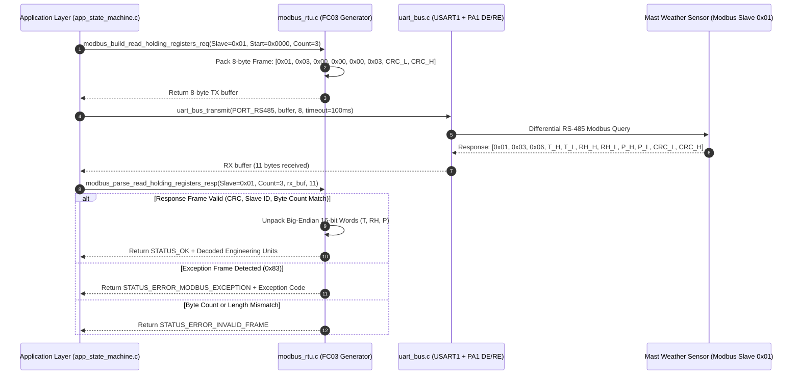

# Task Specification: S4-T4.1 - Modbus RTU Frame Generator (FC03 Read Holding Registers)

## 1. Task Metadata & Overview

| Attribute | Specification Details |
| :--- | :--- |
| **Sprint** | **Sprint 4: Sensor Drivers & Remote Field Bus Interfaces** |
| **Task ID** | `S4-T4.1` |
| **Parent Task** | `S4-T4: Implement RS-485 Modbus RTU Master Protocol Driver` |
| **Task Title** | Implement Modbus RTU Frame Generator & Response Parser for Function Code `0x03` (Read Holding Registers) |
| **Status** | **Ready for Implementation** |
| **Target Files** | [`firmware/drivers/inc/modbus_rtu.h`](file:///C:/Users/ENERGY%20SAVER/Documents/Learning/Job%20Projects/rain-predict/firmware/drivers/inc/modbus_rtu.h)<br>[`firmware/drivers/src/modbus_rtu.c`](file:///C:/Users/ENERGY%20SAVER/Documents/Learning/Job%20Projects/rain-predict/firmware/drivers/src/modbus_rtu.c) |
| **Related Documents** | [`docs/sensors/remote-bus-modbus-sdi12.md`](file:///C:/Users/ENERGY%20SAVER/Documents/Learning/Job%20Projects/rain-predict/docs/sensors/remote-bus-modbus-sdi12.md)<br>[`docs/hardware/schematics-and-pinout.md`](file:///C:/Users/ENERGY%20SAVER/Documents/Learning/Job%20Projects/rain-predict/docs/hardware/schematics-and-pinout.md)<br>[`context/specs/s3-t2.2-uart-bus-driver.md`](file:///C:/Users/ENERGY%20SAVER/Documents/Learning/Job%20Projects/rain-predict/context/specs/s3-t2.2-uart-bus-driver.md)<br>[`context/specs/s3-t1.1-gpio-pin-mappings.md`](file:///C:/Users/ENERGY%20SAVER/Documents/Learning/Job%20Projects/rain-predict/context/specs/s3-t1.1-gpio-pin-mappings.md)<br>[`context/coding-standards.md`](file:///C:/Users/ENERGY%20SAVER/Documents/Learning/Job%20Projects/rain-predict/context/coding-standards.md) |
| **Dependencies** | [`S3-T2.2`](file:///C:/Users/ENERGY%20SAVER/Documents/Learning/Job%20Projects/rain-predict/context/specs/s3-t2.2-uart-bus-driver.md) (UART Bus Driver & Ring Buffers) |
| **Downstream Tasks** | [`S4-T4.2`](file:///C:/Users/ENERGY%20SAVER/Documents/Learning/Job%20Projects/rain-predict/context/specs/s4-t4.2-modbus-crc16.md) (CRC-16 Calculation), [`S4-T4.3`](file:///C:/Users/ENERGY%20SAVER/Documents/Learning/Job%20Projects/rain-predict/context/specs/s4-t4.3-rs485-direction-control.md) (DE/RE Guard Timing), [`S4-T4.4`](file:///C:/Users/ENERGY%20SAVER/Documents/Learning/Job%20Projects/rain-predict/context/specs/s4-t4.4-test-modbus-rtu.md) (Unit Test Suite), `S6-T3` (Application State Machine) |

---

## 2. Executive Summary & Architectural Scope

The primary objective of **`S4-T4.1`** is to specify and implement the **Modbus RTU Master Request Frame Generator and Response Parsing Engine for Function Code `0x03` (Read Holding Registers)** in [`firmware/drivers/inc/modbus_rtu.h`](file:///C:/Users/ENERGY%20SAVER/Documents/Learning/Job%20Projects/rain-predict/firmware/drivers/inc/modbus_rtu.h) and [`firmware/drivers/src/modbus_rtu.c`](file:///C:/Users/ENERGY%20SAVER/Documents/Learning/Job%20Projects/rain-predict/firmware/drivers/src/modbus_rtu.c) for the **STMicroelectronics STM32WLE5** SoC.

In remote tea estate deployments, the central microclimate sensor probe mast is positioned $10\text{m}–100\text{m}+$ away from the main controller node to achieve optimal unobstructed wind exposure and solar irradiation. Communication over this extended differential transmission line (SP3485 transceiver on `USART1`) utilizes industrial **Modbus RTU Master** protocol at $9600\text{ bps}$ (8-N-1):



### Critical Protocol Engineering Mandates:

1. **Deterministic 8-Byte Request Frame Structure**:
   - Generates exact Modbus RTU query frames for Function Code `0x03`:
     $$\text{Frame} = [\text{Slave Address}, \text{Function Code (0x03)}, \text{Start Reg High}, \text{Start Reg Low}, \text{Count High}, \text{Count Low}, \text{CRC-16 Low}, \text{CRC-16 High}]$$
2. **Defensive Parameter Validation**:
   - **Slave Address**: Validated in range $1\text{ to }247$ (Address `0` is Modbus broadcast, invalid for unicast read queries).
   - **Register Count**: Validated in range $1\text{ to }125$ ($1\text{ to }125$ 16-bit registers = $\le 250$ data bytes, adhering to the 256-byte Modbus PDU limit).
   - **Buffer Sizes**: Request buffer $\ge 8\text{ bytes}$; Response buffer $\ge 5\text{ bytes}$.
3. **Response Frame Validation & Exception Handling**:
   - Verifies matching Slave Address and Function Code.
   - Detects Modbus Exception frames (Function Code with MSB set: `0x83` = `0x03 | 0x80`), extracting standard exception codes (`0x01` Illegal Function, `0x02` Illegal Address, `0x03` Illegal Value, `0x04` Device Failure).
   - Asserts that received Byte Count equals $2 \times \text{Register Count}$ and total frame length matches $3 + \text{Byte Count} + 2\text{ (CRC)}$.
4. **Big-Endian 16-Bit Word Unpacking**:
   - Modbus transmits 16-bit register values in network byte order (MSB first). The parser reconstructs signed and unsigned integer words:
     $$\text{Reg}[k] = (\text{Byte}[3 + 2k] \ll 8) \mid \text{Byte}[4 + 2k]$$
5. **Standard Meteorological Probe Register Decoding**:
   - Decodes standard environmental registers:
     - Register `0x0000`: Ambient Temperature in $0.01^\circ\text{C}$ (Signed 16-bit: $-4000 \to -40.00^\circ\text{C}$, $+8500 \to +85.00^\circ\text{C}$)
     - Register `0x0001`: Relative Humidity in $0.01\%\text{ RH}$ (Unsigned 16-bit: $0 \to 0.00\%$, $10000 \to 100.00\%$)
     - Register `0x0002`: Barometric Pressure in $0.1\text{ hPa}$ (Unsigned 16-bit: $3000 \to 300.0\text{ hPa}$, $11000 \to 1100.0\text{ hPa}$)
     - Register `0x0003`: Wind Speed in $0.01\text{ m/s}$ (Unsigned 16-bit: $0 \to 0.00\text{ m/s}$, $6000 \to 60.00\text{ m/s}$)
     - Register `0x0004`: Wind Direction in $0.1^\circ$ (Unsigned 16-bit: $0 \to 0.0^\circ$, $3600 \to 360.0^\circ$)

---

## 3. Modbus RTU Framing & Packet Architecture

### 3.1 Request Packet Layout (Function Code `0x03`, 8 Bytes)

$$\begin{array}{|c|c|c|c|c|c|c|c|}
\hline
\textbf{Byte 0} & \textbf{Byte 1} & \textbf{Byte 2} & \textbf{Byte 3} & \textbf{Byte 4} & \textbf{Byte 5} & \textbf{Byte 6} & \textbf{Byte 7} \\
\hline
\text{Slave Addr} & \text{Func Code} & \text{Start Reg Hi} & \text{Start Reg Lo} & \text{Count Hi} & \text{Count Lo} & \text{CRC-16 Lo} & \text{CRC-16 Hi} \\
\hline
\text{0x01} & \text{0x03} & \text{0x00} & \text{0x00} & \text{0x00} & \text{0x03} & \text{0x05} & \text{0xCB} \\
\hline
\end{array}$$

- **`Byte 0`**: Slave Address (`0x01` to `0xF7`).
- **`Byte 1`**: Function Code (`0x03` = Read Holding Registers).
- **`Bytes 2-3`**: Starting Address (16-bit big-endian).
- **`Bytes 4-5`**: Quantity of Registers (16-bit big-endian, $1\text{ to }125$).
- **`Bytes 6-7`**: Modbus CRC-16 (Calculated over Bytes 0–5; Low byte transmitted first).

---

### 3.2 Normal Response Packet Layout ($5 + 2N$ Bytes, where $N = \text{Count}$)

For $N = 3$ registers (Temperature, Humidity, Pressure $\implies 6\text{ data bytes}$, Total Frame $= 11\text{ bytes}$):

$$\begin{array}{|c|c|c|c|c|c|c|c|c|c|c|}
\hline
\textbf{Byte 0} & \textbf{Byte 1} & \textbf{Byte 2} & \textbf{Byte 3} & \textbf{Byte 4} & \textbf{Byte 5} & \textbf{Byte 6} & \textbf{Byte 7} & \textbf{Byte 8} & \textbf{Byte 9} & \textbf{Byte 10} \\
\hline
\text{Slave} & \text{Func} & \text{Byte Count} & \text{T Hi} & \text{T Lo} & \text{RH Hi} & \text{RH Lo} & \text{P Hi} & \text{P Lo} & \text{CRC Lo} & \text{CRC Hi} \\
\hline
\text{0x01} & \text{0x03} & \text{0x06} & \text{0x09} & \text{0x94} & \text{0x22} & \text{0x92} & \text{0x27} & \text{0x94} & \text{0xXX} & \text{0xXX} \\
\hline
\end{array}$$

- **Decoded Physical Values**:
  - Temperature: $\text{0x0994} = 2452 \implies 24.52^\circ\text{C}$
  - Humidity: $\text{0x2292} = 8850 \implies 88.50\%\text{ RH}$
  - Pressure: $\text{0x2794} = 10132 \implies 1013.2\text{ hPa}$

---

### 3.3 Exception Response Packet Layout (5 Bytes)

If the slave cannot execute the request (e.g., invalid register address):

$$\begin{array}{|c|c|c|c|c|}
\hline
\textbf{Byte 0} & \textbf{Byte 1} & \textbf{Byte 2} & \textbf{Byte 3} & \textbf{Byte 4} \\
\hline
\text{Slave Addr} & \text{Exception Func (0x83)} & \text{Exception Code} & \text{CRC-16 Lo} & \text{CRC-16 Hi} \\
\hline
\text{0x01} & \text{0x83} & \text{0x02} & \text{0xC0} & \text{0xF1} \\
\hline
\end{array}$$

- **Standard Modbus Exception Codes**:
  - `0x01` (`MODBUS_EX_ILLEGAL_FUNCTION`): Function code not supported by slave.
  - `0x02` (`MODBUS_EX_ILLEGAL_DATA_ADDRESS`): Starting address or register range invalid.
  - `0x03` (`MODBUS_EX_ILLEGAL_DATA_VALUE`): Quantity of registers invalid ($> 125$ or $= 0$).
  - `0x04` (`MODBUS_EX_SLAVE_DEVICE_FAILURE`): Unrecoverable internal error in remote sensor probe.

---

## 4. Public API & Data Structures (`modbus_rtu.h`)

### 4.1 Protocol Constants & Enumerations

```c
#define MODBUS_FC03_READ_HOLDING_REGISTERS  0x03U   /**< Function Code 0x03 */
#define MODBUS_FC03_REQ_FRAME_SIZE          8U      /**< 8 bytes fixed query frame */
#define MODBUS_MIN_RESP_FRAME_SIZE          5U      /**< 5 bytes minimum (exception frame) */
#define MODBUS_MAX_READ_REGISTERS           125U    /**< Max 16-bit registers per FC03 query */
#define MODBUS_MAX_FRAME_SIZE               256U    /**< Max Modbus RTU ADU size */
#define MODBUS_DEFAULT_SLAVE_ADDR           0x01U   /**< Default remote probe slave address */
#define MODBUS_BROADCAST_ADDR               0x00U   /**< Modbus broadcast address */
#define MODBUS_MAX_SLAVE_ADDR               247U    /**< Max valid unicast slave address */
#define MODBUS_EXCEPTION_MASK               0x80U   /**< MSB flag indicating exception */

/**
 * @brief Standard Modbus Exception Codes.
 */
typedef enum {
    MODBUS_EX_NONE                  = 0x00,
    MODBUS_EX_ILLEGAL_FUNCTION      = 0x01,
    MODBUS_EX_ILLEGAL_DATA_ADDRESS  = 0x02,
    MODBUS_EX_ILLEGAL_DATA_VALUE    = 0x03,
    MODBUS_EX_SLAVE_DEVICE_FAILURE  = 0x04,
    MODBUS_EX_ACKNOWLEDGE           = 0x05,
    MODBUS_EX_SLAVE_DEVICE_BUSY     = 0x06,
    MODBUS_EX_NEGATIVE_ACKNOWLEDGE  = 0x07,
    MODBUS_EX_MEMORY_PARITY_ERROR   = 0x08
} modbus_exception_t;

/**
 * @brief Decoded Remote Weather Station Meteorological Reading.
 */
typedef struct {
    float               temperature_c;      /**< Ambient Temperature in degrees Celsius */
    float               humidity_pct;       /**< Relative Humidity in % RH */
    float               pressure_hpa;       /**< Barometric Pressure in hPa */
    float               wind_speed_mps;     /**< Wind Speed in m/s (if equipped) */
    float               wind_direction_deg; /**< Wind Direction in degrees (0-360) */
    bool                has_wind_data;      /**< True if wind registers were included */
    uint32_t            timestamp_ms;       /**< System tick timestamp of acquisition */
} modbus_thp_reading_t;
```

---

### 4.2 Function Prototypes

| Function Prototype | Description |
| :--- | :--- |
| `status_t modbus_build_read_holding_registers_req(uint8_t slave_addr, uint16_t start_reg, uint16_t reg_count, uint8_t *p_out_buf, uint16_t max_out_len, uint16_t *p_frame_len)` | Constructs an 8-byte Modbus RTU FC03 query frame with calculated CRC-16. |
| `status_t modbus_parse_read_holding_registers_resp(uint8_t expected_slave, uint16_t expected_reg_count, const uint8_t *p_resp_buf, uint16_t resp_len, uint16_t *p_reg_data_out, modbus_exception_t *p_exception_out)` | Validates response frame, checks CRC, detects exceptions, and unpacks 16-bit register words. |
| `status_t modbus_decode_thp_registers(const uint16_t *p_reg_data, uint16_t reg_count, modbus_thp_reading_t *p_reading)` | Converts raw 16-bit registers into calibrated floating-point meteorological units ($T, RH, P, \text{Wind}$). |
| `const char *modbus_exception_to_str(modbus_exception_t exception_code)` | Returns human-readable diagnostic string for a Modbus exception code. |

---

## 5. Concrete File Implementation Blueprint

### 5.1 `firmware/drivers/inc/modbus_rtu.h`

```c
/**
 * @file    modbus_rtu.h
 * @brief   Modbus RTU Master protocol definitions and frame generator.
 * @details Implements Function Code 0x03 (Read Holding Registers), CRC-16,
 *          response parsing, exception handling, and meteorological decoding.
 */

#ifndef MODBUS_RTU_H
#define MODBUS_RTU_H

#include <stdint.h>
#include <stdbool.h>
#include "status_codes.h"

#ifdef __cplusplus
extern "C" {
#endif

/* ========================================================================== */
/* Protocol Constants                                                         */
/* ========================================================================== */

#define MODBUS_FC03_READ_HOLDING_REGISTERS  0x03U
#define MODBUS_FC03_REQ_FRAME_SIZE          8U
#define MODBUS_MIN_RESP_FRAME_SIZE          5U
#define MODBUS_MAX_READ_REGISTERS           125U
#define MODBUS_MAX_FRAME_SIZE               256U
#define MODBUS_DEFAULT_SLAVE_ADDR           0x01U
#define MODBUS_BROADCAST_ADDR               0x00U
#define MODBUS_MAX_SLAVE_ADDR               247U
#define MODBUS_EXCEPTION_MASK               0x80U

/* Standard Microclimate Weather Probe Register Addresses */
#define MODBUS_REG_TEMPERATURE              0x0000U /**< 0.01 deg C (signed int16) */
#define MODBUS_REG_HUMIDITY                 0x0001U /**< 0.01 % RH (uint16) */
#define MODBUS_REG_PRESSURE                 0x0002U /**< 0.1 hPa (uint16) */
#define MODBUS_REG_WIND_SPEED               0x0003U /**< 0.01 m/s (uint16) */
#define MODBUS_REG_WIND_DIRECTION           0x0004U /**< 0.1 deg (uint16) */

/* Scaling Factors */
#define MODBUS_SCALE_TEMP_C                 0.01f
#define MODBUS_SCALE_HUMIDITY_PCT           0.01f
#define MODBUS_SCALE_PRESSURE_HPA           0.10f
#define MODBUS_SCALE_WIND_SPEED_MPS         0.01f
#define MODBUS_SCALE_WIND_DIR_DEG           0.10f

/* ========================================================================== */
/* Data Structures & Enums                                                    */
/* ========================================================================== */

typedef enum {
    MODBUS_EX_NONE                  = 0x00,
    MODBUS_EX_ILLEGAL_FUNCTION      = 0x01,
    MODBUS_EX_ILLEGAL_DATA_ADDRESS  = 0x02,
    MODBUS_EX_ILLEGAL_DATA_VALUE    = 0x03,
    MODBUS_EX_SLAVE_DEVICE_FAILURE  = 0x04,
    MODBUS_EX_ACKNOWLEDGE           = 0x05,
    MODBUS_EX_SLAVE_DEVICE_BUSY     = 0x06,
    MODBUS_EX_NEGATIVE_ACKNOWLEDGE  = 0x07,
    MODBUS_EX_MEMORY_PARITY_ERROR   = 0x08
} modbus_exception_t;

typedef struct {
    float               temperature_c;
    float               humidity_pct;
    float               pressure_hpa;
    float               wind_speed_mps;
    float               wind_direction_deg;
    bool                has_wind_data;
    uint32_t            timestamp_ms;
} modbus_thp_reading_t;

/* ========================================================================== */
/* Public Function Prototypes                                                 */
/* ========================================================================== */

/**
 * @brief  Computes standard Modbus RTU CRC-16 (Polynomial: 0xA001, Init: 0xFFFF).
 * @param  p_buffer Pointer to data buffer.
 * @param  length Number of bytes to calculate.
 * @return 16-bit CRC checksum (Low-byte in lower 8 bits).
 */
uint16_t modbus_crc16(const uint8_t *p_buffer, uint16_t length);

/**
 * @brief  Constructs an 8-byte Modbus RTU FC03 Read Holding Registers query frame.
 * @param  slave_addr Slave device address (1 to 247).
 * @param  start_reg Starting register address (0x0000 to 0xFFFF).
 * @param  reg_count Number of 16-bit registers to read (1 to 125).
 * @param[out] p_out_buf Destination buffer for generated 8-byte frame.
 * @param  max_out_len Maximum capacity of destination buffer (must be >= 8).
 * @param[out] p_frame_len Pointer to store resulting frame length (always 8 on success).
 * @return STATUS_OK on success, or structured error code.
 */
status_t modbus_build_read_holding_registers_req(uint8_t slave_addr,
                                                 uint16_t start_reg,
                                                 uint16_t reg_count,
                                                 uint8_t *p_out_buf,
                                                 uint16_t max_out_len,
                                                 uint16_t *p_frame_len);

/**
 * @brief  Parses and validates a Modbus RTU FC03 response frame.
 * @param  expected_slave Slave address expected in response.
 * @param  expected_reg_count Number of registers requested in original query.
 * @param  p_resp_buf Pointer to received response frame buffer.
 * @param  resp_len Number of bytes in received response buffer.
 * @param[out] p_reg_data_out Array to store unpacked 16-bit register words (size >= expected_reg_count).
 * @param[out] p_exception_out Pointer to store Modbus exception code if encountered (can be NULL).
 * @return STATUS_OK on success, STATUS_ERROR_MODBUS_EXCEPTION if slave returned error,
 *         STATUS_ERROR_CRC if checksum fails, or STATUS_ERROR_INVALID_FRAME.
 */
status_t modbus_parse_read_holding_registers_resp(uint8_t expected_slave,
                                                  uint16_t expected_reg_count,
                                                  const uint8_t *p_resp_buf,
                                                  uint16_t resp_len,
                                                  uint16_t *p_reg_data_out,
                                                  modbus_exception_t *p_exception_out);

/**
 * @brief  Decodes standard weather probe holding registers into calibrated units.
 * @param  p_reg_data Array of raw 16-bit register values.
 * @param  reg_count Number of registers present (must be >= 3 for THP, >= 5 for THP+Wind).
 * @param[out] p_reading Pointer to modbus_thp_reading_t structure to populate.
 * @return STATUS_OK on success, or STATUS_ERROR_INVALID_PARAM.
 */
status_t modbus_decode_thp_registers(const uint16_t *p_reg_data,
                                     uint16_t reg_count,
                                     modbus_thp_reading_t *p_reading);

/**
 * @brief  Converts a Modbus exception enum into a diagnostic string.
 * @param  exception_code Exception enum value.
 * @return Constant pointer to descriptive string.
 */
const char *modbus_exception_to_str(modbus_exception_t exception_code);

#ifdef __cplusplus
}
#endif

#endif /* MODBUS_RTU_H */
```

---

### 5.2 `firmware/drivers/src/modbus_rtu.c`

```c
/**
 * @file    modbus_rtu.c
 * @brief   Modbus RTU Master frame generator, parser, CRC-16, and decoding implementation.
 */

#include "modbus_rtu.h"
#include <string.h>

/* ========================================================================== */
/* CRC-16 Standard Modbus Calculation (Polynomial 0xA001)                     */
/* ========================================================================== */

uint16_t modbus_crc16(const uint8_t *p_buffer, uint16_t length)
{
    if (p_buffer == NULL || length == 0U) {
        return 0x0000U;
    }

    uint16_t crc = 0xFFFFU;

    for (uint16_t pos = 0U; pos < length; pos++) {
        crc ^= (uint16_t)p_buffer[pos];

        for (uint8_t i = 8U; i != 0U; i--) {
            if ((crc & 0x0001U) != 0U) {
                crc >>= 1;
                crc ^= 0xA001U;
            } else {
                crc >>= 1;
            }
        }
    }

    return crc;
}

/* ========================================================================== */
/* Request Frame Construction                                                 */
/* ========================================================================== */

status_t modbus_build_read_holding_registers_req(uint8_t slave_addr,
                                                 uint16_t start_reg,
                                                 uint16_t reg_count,
                                                 uint8_t *p_out_buf,
                                                 uint16_t max_out_len,
                                                 uint16_t *p_frame_len)
{
    if (p_out_buf == NULL || p_frame_len == NULL) {
        return STATUS_ERROR_NULL_POINTER;
    }

    /* Validate Slave Address: Unicast 1..247 (Address 0 is Broadcast, invalid for reads) */
    if (slave_addr == MODBUS_BROADCAST_ADDR || slave_addr > MODBUS_MAX_SLAVE_ADDR) {
        return STATUS_ERROR_INVALID_PARAM;
    }

    /* Validate Register Count: 1..125 */
    if (reg_count == 0U || reg_count > MODBUS_MAX_READ_REGISTERS) {
        return STATUS_ERROR_INVALID_PARAM;
    }

    /* Ensure Destination Buffer Capacity */
    if (max_out_len < MODBUS_FC03_REQ_FRAME_SIZE) {
        return STATUS_ERROR_BUFFER_OVERFLOW;
    }

    /* Byte 0: Slave Address */
    p_out_buf[0] = slave_addr;

    /* Byte 1: Function Code 0x03 */
    p_out_buf[1] = MODBUS_FC03_READ_HOLDING_REGISTERS;

    /* Bytes 2-3: Starting Address (Big-Endian) */
    p_out_buf[2] = (uint8_t)((start_reg >> 8) & 0xFFU);
    p_out_buf[3] = (uint8_t)(start_reg & 0xFFU);

    /* Bytes 4-5: Number of Registers (Big-Endian) */
    p_out_buf[4] = (uint8_t)((reg_count >> 8) & 0xFFU);
    p_out_buf[5] = (uint8_t)(reg_count & 0xFFU);

    /* Bytes 6-7: CRC-16 Checksum (Low byte first in Modbus stream) */
    uint16_t crc = modbus_crc16(p_out_buf, 6U);
    p_out_buf[6] = (uint8_t)(crc & 0xFFU);         /* CRC Low */
    p_out_buf[7] = (uint8_t)((crc >> 8) & 0xFFU);  /* CRC High */

    *p_frame_len = MODBUS_FC03_REQ_FRAME_SIZE;

    return STATUS_OK;
}

/* ========================================================================== */
/* Response Frame Parsing & Unpacking                                         */
/* ========================================================================== */

status_t modbus_parse_read_holding_registers_resp(uint8_t expected_slave,
                                                  uint16_t expected_reg_count,
                                                  const uint8_t *p_resp_buf,
                                                  uint16_t resp_len,
                                                  uint16_t *p_reg_data_out,
                                                  modbus_exception_t *p_exception_out)
{
    if (p_resp_buf == NULL || p_reg_data_out == NULL) {
        return STATUS_ERROR_NULL_POINTER;
    }

    if (p_exception_out != NULL) {
        *p_exception_out = MODBUS_EX_NONE;
    }

    /* Minimum Modbus response frame length is 5 bytes (Exception frame) */
    if (resp_len < MODBUS_MIN_RESP_FRAME_SIZE) {
        return STATUS_ERROR_INVALID_FRAME;
    }

    /* Verify CRC Checksum over entire received frame */
    uint16_t expected_crc = modbus_crc16(p_resp_buf, resp_len - 2U);
    uint16_t received_crc = (uint16_t)p_resp_buf[resp_len - 2U] |
                            ((uint16_t)p_resp_buf[resp_len - 1U] << 8);

    if (expected_crc != received_crc) {
        return STATUS_ERROR_CRC;
    }

    /* Verify Slave Address */
    if (p_resp_buf[0] != expected_slave) {
        return STATUS_ERROR_INVALID_FRAME;
    }

    /* Check for Modbus Exception Response (Function Code | 0x80) */
    if (p_resp_buf[1] == (MODBUS_FC03_READ_HOLDING_REGISTERS | MODBUS_EXCEPTION_MASK)) {
        if (resp_len != MODBUS_MIN_RESP_FRAME_SIZE) {
            return STATUS_ERROR_INVALID_FRAME;
        }
        if (p_exception_out != NULL) {
            *p_exception_out = (modbus_exception_t)p_resp_buf[2];
        }
        return STATUS_ERROR_MODBUS_EXCEPTION;
    }

    /* Verify Normal Function Code 0x03 */
    if (p_resp_buf[1] != MODBUS_FC03_READ_HOLDING_REGISTERS) {
        return STATUS_ERROR_INVALID_FRAME;
    }

    /* Verify Byte Count: must equal expected_reg_count * 2 */
    uint8_t byte_count = p_resp_buf[2];
    uint16_t expected_bytes = expected_reg_count * 2U;

    if (byte_count != (uint8_t)expected_bytes) {
        return STATUS_ERROR_INVALID_FRAME;
    }

    /* Total expected frame size: 3 header bytes + byte_count + 2 CRC bytes */
    if (resp_len != (uint16_t)(3U + byte_count + 2U)) {
        return STATUS_ERROR_INVALID_FRAME;
    }

    /* Unpack 16-bit Big-Endian Register Words */
    for (uint16_t k = 0U; k < expected_reg_count; k++) {
        uint16_t byte_offset = 3U + (k * 2U);
        p_reg_data_out[k] = ((uint16_t)p_resp_buf[byte_offset] << 8) |
                            (uint16_t)p_resp_buf[byte_offset + 1U];
    }

    return STATUS_OK;
}

/* ========================================================================== */
/* Meteorological Engineering Units Decoding                                 */
/* ========================================================================== */

status_t modbus_decode_thp_registers(const uint16_t *p_reg_data,
                                     uint16_t reg_count,
                                     modbus_thp_reading_t *p_reading)
{
    if (p_reg_data == NULL || p_reading == NULL) {
        return STATUS_ERROR_NULL_POINTER;
    }

    if (reg_count < 3U) {
        return STATUS_ERROR_INVALID_PARAM;
    }

    /* Decode Temperature: Signed 16-bit in 0.01 deg C */
    int16_t raw_temp = (int16_t)p_reg_data[0];
    p_reading->temperature_c = (float)raw_temp * MODBUS_SCALE_TEMP_C;

    /* Decode Humidity: Unsigned 16-bit in 0.01 % RH */
    p_reading->humidity_pct = (float)p_reg_data[1] * MODBUS_SCALE_HUMIDITY_PCT;

    /* Decode Pressure: Unsigned 16-bit in 0.1 hPa */
    p_reading->pressure_hpa = (float)p_reg_data[2] * MODBUS_SCALE_PRESSURE_HPA;

    /* Meteorological Boundary Clamping */
    if (p_reading->humidity_pct < 0.0f) {
        p_reading->humidity_pct = 0.0f;
    } else if (p_reading->humidity_pct > 100.0f) {
        p_reading->humidity_pct = 100.0f;
    }

    /* Optional Wind Speed & Direction (Registers 3 and 4) */
    if (reg_count >= 5U) {
        p_reading->wind_speed_mps     = (float)p_reg_data[3] * MODBUS_SCALE_WIND_SPEED_MPS;
        p_reading->wind_direction_deg = (float)p_reg_data[4] * MODBUS_SCALE_WIND_DIR_DEG;
        p_reading->has_wind_data      = true;
    } else {
        p_reading->wind_speed_mps     = 0.0f;
        p_reading->wind_direction_deg = 0.0f;
        p_reading->has_wind_data      = false;
    }

    return STATUS_OK;
}

const char *modbus_exception_to_str(modbus_exception_t exception_code)
{
    switch (exception_code) {
        case MODBUS_EX_NONE:                 return "No Exception";
        case MODBUS_EX_ILLEGAL_FUNCTION:     return "Illegal Function Code (0x01)";
        case MODBUS_EX_ILLEGAL_DATA_ADDRESS: return "Illegal Data Address (0x02)";
        case MODBUS_EX_ILLEGAL_DATA_VALUE:   return "Illegal Data Value (0x03)";
        case MODBUS_EX_SLAVE_DEVICE_FAILURE: return "Slave Device Failure (0x04)";
        case MODBUS_EX_ACKNOWLEDGE:          return "Acknowledge (0x05)";
        case MODBUS_EX_SLAVE_DEVICE_BUSY:    return "Slave Device Busy (0x06)";
        case MODBUS_EX_NEGATIVE_ACKNOWLEDGE: return "Negative Acknowledge (0x07)";
        case MODBUS_EX_MEMORY_PARITY_ERROR:  return "Memory Parity Error (0x08)";
        default:                             return "Unknown Exception";
    }
}
```

---

## 6. Defensive Programming, Clamping & Power Hardening

1. **Broadcast Request Prohibition**:
   - `modbus_build_read_holding_registers_req()` rejects `slave_addr == 0x00` with `STATUS_ERROR_INVALID_PARAM` because Modbus slave devices do not respond to broadcast read queries.
2. **Buffer Overflow Guards**:
   - Output buffer lengths are strictly validated against `max_out_len` and PDU limits ($125$ registers $\le 250$ data bytes).
3. **CRC-16 Strict Verification**:
   - Every received frame is verified with `modbus_crc16()` before inspecting function codes or unpacking payloads.
4. **Exception Extraction**:
   - Exception frames (`0x83`) are intercepted cleanly without interpreting error codes as valid register data.
5. **Zero Dynamic Allocation**:
   - All frame buffers and structs are statically passed by the caller. Zero heap usage.

---

## 7. Verification & Test Matrix (10 Points)

| Test ID | Verification Description | Input Stimulus / State | Expected Behavior / Output |
| :---: | :--- | :--- | :--- |
| **`TC-MB-01`** | **Standard 3-Register Query Frame** | Slave: `0x01`, Start: `0x0000`, Count: `3` | Generates 8-byte frame: `[0x01, 0x03, 0x00, 0x00, 0x00, 0x03, 0x05, 0xCB]`. |
| **`TC-MB-02`** | **Multi-Register Query (10 Regs)** | Slave: `0x02`, Start: `0x0010`, Count: `10` | Generates 8-byte frame: `[0x02, 0x03, 0x00, 0x10, 0x00, 0x0A, 0xC5, 0xFE]`. |
| **`TC-MB-03`** | **Broadcast Address Rejection** | Slave: `0x00` (Broadcast) | Returns `STATUS_ERROR_INVALID_PARAM`, `*p_frame_len = 0`. |
| **`TC-MB-04`** | **Invalid Register Count (0 and 126)** | Count: `0` or Count: `126` | Returns `STATUS_ERROR_INVALID_PARAM`. |
| **`TC-MB-05`** | **Destination Buffer Capacity Guard** | Buffer length: `7` ($< 8$) | Returns `STATUS_ERROR_BUFFER_OVERFLOW`. |
| **`TC-MB-06`** | **Normal 3-Register Response Parsing** | Injected: `[0x01, 0x03, 0x06, 0x09, 0x94, 0x22, 0x92, 0x27, 0x94, CRC_L, CRC_H]` | Returns `STATUS_OK`, `Reg[0]=2452`, `Reg[1]=8850`, `Reg[2]=10132`. |
| **`TC-MB-07`** | **Exception Response Extraction** | Injected: `[0x01, 0x83, 0x02, 0xC0, 0xF1]` | Returns `STATUS_ERROR_MODBUS_EXCEPTION`, `exception = MODBUS_EX_ILLEGAL_DATA_ADDRESS`. |
| **`TC-MB-08`** | **CRC Checksum Corruption** | Response byte corrupted (Bit-flip in payload) | Returns `STATUS_ERROR_CRC`. |
| **`TC-MB-09`** | **Byte Count / Length Mismatch** | Byte count header $= 4$, but buffer has $6$ bytes | Returns `STATUS_ERROR_INVALID_FRAME`. |
| **`TC-MB-10`** | **THP Meteorological Decoding** | Raw words: `[2452, 8850, 10132, 450, 1800]` | Decodes $T = 24.52^\circ\text{C}$, $RH = 88.50\%$, $P = 1013.2\text{ hPa}$, Wind $= 4.50\text{ m/s}$, Dir $= 180.0^\circ$. |

---

## 8. Acceptance Criteria & Implementation Checklist

- [ ] **Request Frame Builder**: Implemented `modbus_build_read_holding_registers_req()` generating exact 8-byte frames with polynomial `0xA001` CRC-16.
- [ ] **Parameter Defense**: Enforced unicast slave address bounds ($1\text{ to }247$) and register counts ($1\text{ to }125$).
- [ ] **Response Parser**: Implemented `modbus_parse_read_holding_registers_resp()` with complete CRC verification, slave ID checking, and big-endian unpacking.
- [ ] **Exception Engine**: Implemented detection of `0x83` exception frames and diagnostic string mapping.
- [ ] **THP Decoding**: Implemented `modbus_decode_thp_registers()` converting raw 16-bit registers into temperature, humidity, pressure, and wind speed/direction.
- [ ] **Zero Dynamic Allocation**: 100% static buffer operations, no heap allocation.
