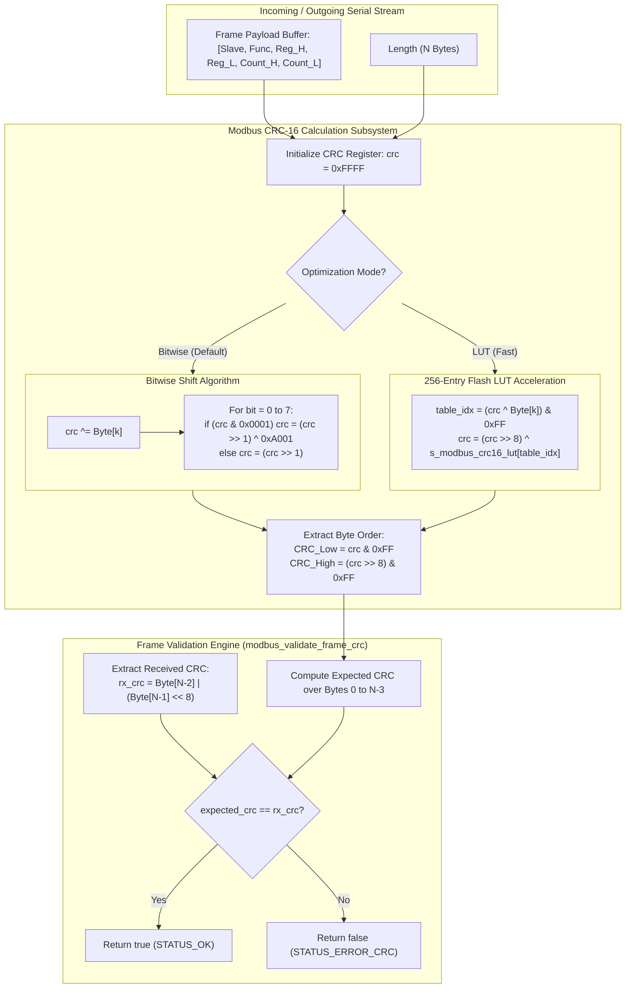

# Task Specification: S4-T4.2 - Modbus RTU CRC-16 Calculation & Frame Validation

## 1. Task Metadata & Overview

| Attribute | Specification Details |
| :--- | :--- |
| **Sprint** | **Sprint 4: Sensor Drivers & Remote Field Bus Interfaces** |
| **Task ID** | `S4-T4.2` |
| **Parent Task** | `S4-T4: Implement RS-485 Modbus RTU Master Protocol Driver` |
| **Task Title** | Implement Modbus RTU Standard CRC-16 Calculation (`0xA001` Polynomial), Lookup Table Optimization & Frame Validation |
| **Status** | **Ready for Implementation** |
| **Target Files** | [`firmware/drivers/inc/modbus_rtu.h`](file:///C:/Users/ENERGY%20SAVER/Documents/Learning/Job%20Projects/rain-predict/firmware/drivers/inc/modbus_rtu.h)<br>[`firmware/drivers/src/modbus_rtu.c`](file:///C:/Users/ENERGY%20SAVER/Documents/Learning/Job%20Projects/rain-predict/firmware/drivers/src/modbus_rtu.c) |
| **Related Documents** | [`docs/sensors/remote-bus-modbus-sdi12.md`](file:///C:/Users/ENERGY%20SAVER/Documents/Learning/Job%20Projects/rain-predict/docs/sensors/remote-bus-modbus-sdi12.md)<br>[`docs/hardware/schematics-and-pinout.md`](file:///C:/Users/ENERGY%20SAVER/Documents/Learning/Job%20Projects/rain-predict/docs/hardware/schematics-and-pinout.md)<br>[`context/specs/s4-t4.1-modbus-frame-generator.md`](file:///C:/Users/ENERGY%20SAVER/Documents/Learning/Job%20Projects/rain-predict/context/specs/s4-t4.1-modbus-frame-generator.md)<br>[`context/coding-standards.md`](file:///C:/Users/ENERGY%20SAVER/Documents/Learning/Job%20Projects/rain-predict/context/coding-standards.md) |
| **Dependencies** | [`S4-T4.1`](file:///C:/Users/ENERGY%20SAVER/Documents/Learning/Job%20Projects/rain-predict/context/specs/s4-t4.1-modbus-frame-generator.md) (Modbus FC03 Generator) |
| **Downstream Tasks** | [`S4-T4.3`](file:///C:/Users/ENERGY%20SAVER/Documents/Learning/Job%20Projects/rain-predict/context/specs/s4-t4.3-rs485-direction-control.md) (RS-485 Direction Toggling), [`S4-T4.4`](file:///C:/Users/ENERGY%20SAVER/Documents/Learning/Job%20Projects/rain-predict/context/specs/s4-t4.4-test-modbus-rtu.md) (Unit Test Suite), `S6-T3` (Application State Machine) |

---

## 2. Executive Summary & Architectural Scope

The primary objective of **`S4-T4.2`** is to specify, optimize, and verify the **Modbus RTU Cyclic Redundancy Check (CRC-16)** engine in [`firmware/drivers/inc/modbus_rtu.h`](file:///C:/Users/ENERGY%20SAVER/Documents/Learning/Job%20Projects/rain-predict/firmware/drivers/inc/modbus_rtu.h) and [`firmware/drivers/src/modbus_rtu.c`](file:///C:/Users/ENERGY%20SAVER/Documents/Learning/Job%20Projects/rain-predict/firmware/drivers/src/modbus_rtu.c) for the **STMicroelectronics STM32WLE5** SoC.

Long-distance differential RS-485 cabling across hillside tea plantations ($10\text{m}–100\text{m}+$) is susceptible to common-mode ground potential shifts, induced lightning surges, and electromagnetic interference (EMI) from nearby estate machinery. To prevent corrupt bytes from being parsed as valid meteorological readings or triggering incorrect operational decisions:
1. Every transmitted request frame must have a valid 16-bit CRC appended in network Little-Endian byte order (Low-byte first).
2. Every received response frame must undergo rigorous, deterministic CRC verification prior to function code inspection or payload extraction.
3. The CRC engine must support both **Bitwise Shift Math** (for memory-constrained microcontrollers) and **Fast 256-Entry Flash Lookup Table (LUT)** acceleration ($\approx 8\times$ CPU cycle reduction).
4. The driver must provide streaming/incremental CRC accumulation (`modbus_crc16_update()`) for incoming UART DMA ring buffers.



---

## 3. Mathematical Derivations & Lookup Table Generation

### 3.1 Mathematical Specification

Modbus RTU uses standard **CRC-16-IBM / CRC-16-ANSI** in reversed (reflected) bit representation:
- **Generator Polynomial**: $G(x) = x^{16} + x^{15} + x^2 + 1$ (Normal: `0x8005`, Reversed: `0xA001`)
- **Initial Value**: `0xFFFF`
- **Reflected Input**: True (LSB processed first)
- **Reflected Output**: True (LSB in lower bits of CRC word)
- **XOR Output**: `0x0000` (No final XOR inversion)
- **Transmission Order**: Low-Order Byte first, then High-Order Byte:
  $$\text{Byte}[N-2] = \text{CRC} \ \& \ \text{0xFF}$$
  $$\text{Byte}[N-1] = (\text{CRC} \gg 8) \ \& \ \text{0xFF}$$

---

### 3.2 256-Entry Flash Lookup Table (LUT)

Pre-computed 512-byte constant table in Flash memory for single-cycle table lookups per byte:

$$T[i] = \text{CRC-16 of single byte } i \text{ with init } 0\text{x0000}$$

```c
static const uint16_t s_modbus_crc16_lut[256] = {
    0x0000U, 0xC0C1U, 0xC181U, 0x0140U, 0xC301U, 0x03C0U, 0x0280U, 0xC241U,
    0xC601U, 0x06C0U, 0x0780U, 0xC741U, 0x0500U, 0xC5C1U, 0xC481U, 0x0440U,
    0xCC01U, 0x0CC0U, 0x0D80U, 0xCD41U, 0x0F00U, 0xCFC1U, 0xCE81U, 0x0E40U,
    0x0A00U, 0xCAC1U, 0xCB81U, 0x0B40U, 0xC901U, 0x09C0U, 0x0880U, 0xC841U,
    0xD801U, 0x18C0U, 0x1980U, 0xD941U, 0x1B00U, 0xDBC1U, 0xDA81U, 0x1A40U,
    0x1E00U, 0xDEC1U, 0xDF81U, 0x1F40U, 0xDD01U, 0x1DC0U, 0x1C80U, 0xDC41U,
    0x1400U, 0xD4C1U, 0xD581U, 0x1540U, 0xD701U, 0x17C0U, 0x1680U, 0xD641U,
    0xD201U, 0x12C0U, 0x1380U, 0xD341U, 0x1100U, 0xD1C1U, 0xD081U, 0x1040U,
    0xF001U, 0x30C0U, 0x3180U, 0xF141U, 0x3300U, 0xF3C1U, 0xF281U, 0x3240U,
    0x3600U, 0xF6C1U, 0xF781U, 0x3740U, 0xF501U, 0x35C0U, 0x3480U, 0xF441U,
    0x3C00U, 0xFCC1U, 0xFD81U, 0x3D40U, 0xFF01U, 0x3FC0U, 0x3E80U, 0xFE41U,
    0xFA01U, 0x3AC0U, 0x3B80U, 0xFB41U, 0x3900U, 0xF9C1U, 0xF881U, 0x3840U,
    0x2800U, 0xE8C1U, 0xE981U, 0x2940U, 0xEB01U, 0x2BC0U, 0x2A80U, 0xEA41U,
    0xEE01U, 0x2EC0U, 0x2F80U, 0xEF41U, 0x2D00U, 0xEDC1U, 0xEC81U, 0x2C40U,
    0xE401U, 0x24C0U, 0x2580U, 0xE541U, 0x2700U, 0xE7C1U, 0xE681U, 0x2640U,
    0x2200U, 0xE2C1U, 0xE381U, 0x2340U, 0xE101U, 0x21C0U, 0x2080U, 0xE041U,
    0xA001U, 0x60C0U, 0x6180U, 0xA141U, 0x6300U, 0xA3C1U, 0xA281U, 0x6240U,
    0x6600U, 0xA6C1U, 0xA781U, 0x6740U, 0xA501U, 0x65C0U, 0x6480U, 0xA441U,
    0x6C00U, 0xACC1U, 0xAD81U, 0x6D40U, 0xAF01U, 0x6FC0U, 0x6E80U, 0xAE41U,
    0xAA01U, 0x6AC0U, 0x6B80U, 0xAB41U, 0x6900U, 0xA9C1U, 0xA881U, 0x6840U,
    0x7800U, 0xB8C1U, 0xB981U, 0x7940U, 0xBB01U, 0x7BC0U, 0x7A80U, 0xBA41U,
    0xBE01U, 0x7EC0U, 0x7F80U, 0xBF41U, 0x7D00U, 0xBDC1U, 0xBC81U, 0x7C40U,
    0xB401U, 0x74C0U, 0x7580U, 0xB541U, 0x7700U, 0xB7C1U, 0xB681U, 0x7640U,
    0x7200U, 0xB2C1U, 0xB381U, 0x7340U, 0xB101U, 0x71C0U, 0x7080U, 0xB041U,
    0x5000U, 0x90C1U, 0x9181U, 0x5140U, 0x9301U, 0x53C0U, 0x5280U, 0x9241U,
    0x9601U, 0x56C0U, 0x5780U, 0x9741U, 0x5500U, 0x95C1U, 0x9481U, 0x5440U,
    0x9C01U, 0x5CC0U, 0x5D80U, 0x9D41U, 0x5F00U, 0x9FC1U, 0x9E81U, 0x5E40U,
    0x5A00U, 0x9AC1U, 0x9B81U, 0x5B40U, 0x9901U, 0x59C0U, 0x5880U, 0x9841U,
    0x8801U, 0x48C0U, 0x4980U, 0x8941U, 0x4B00U, 0x8BC1U, 0x8A81U, 0x4A40U,
    0x4E00U, 0x8EC1U, 0x8F81U, 0x4F40U, 0x8D01U, 0x4DC0U, 0x4C80U, 0x8C41U,
    0x4400U, 0x84C1U, 0x8581U, 0x4540U, 0x8701U, 0x47C0U, 0x4680U, 0x8641U,
    0x8201U, 0x42C0U, 0x4380U, 0x8341U, 0x4100U, 0x81C1U, 0x8081U, 0x4040U
};
```

---

### 3.3 Reference Test Vectors (Official Modbus Standard)

| Frame Description | Payload Bytes (Hex) | Payload Length | Computed CRC-16 (Hex) | Transmitted Frame (Bytes 0 to N-1) |
| :--- | :--- | :---: | :---: | :--- |
| **FC03 Read 3 Regs** | `01 03 00 00 00 03` | 6 | `0xCB05` | `01 03 00 00 00 03 05 CB` |
| **FC03 Read 1 Reg** | `01 03 00 00 00 01` | 6 | `0xCA84` | `01 03 00 00 00 01 84 CA` |
| **FC03 Read 10 Regs** | `02 03 00 10 00 0A` | 6 | `0xFEC5` | `02 03 00 10 00 0A C5 FE` |
| **FC03 Response (THP)**| `01 03 06 09 94 22 92 27 94` | 9 | `0xC841` | `01 03 06 09 94 22 92 27 94 41 C8` |
| **FC03 Exception Frame**| `01 83 02` | 3 | `0xF1C0` | `01 83 02 C0 F1` |
| **FC06 Preset Single Reg**| `01 06 00 01 00 17` | 6 | `0x3998` | `01 06 00 01 00 17 98 39` |

---

## 4. Public API & Header Blueprint (`modbus_rtu.h`)

### 4.1 Function Prototypes

```c
/**
 * @brief  Computes Modbus RTU CRC-16 using bitwise shift method.
 * @param  p_buffer Pointer to byte buffer.
 * @param  length Number of bytes to compute over.
 * @return 16-bit CRC checksum.
 */
uint16_t modbus_crc16_bitwise(const uint8_t *p_buffer, uint16_t length);

/**
 * @brief  Computes Modbus RTU CRC-16 using 256-entry Flash lookup table.
 * @param  p_buffer Pointer to byte buffer.
 * @param  length Number of bytes to compute over.
 * @return 16-bit CRC checksum.
 */
uint16_t modbus_crc16_lut(const uint8_t *p_buffer, uint16_t length);

/**
 * @brief  Incremental/streaming CRC-16 update function.
 * @param  current_crc Running CRC accumulator (initialize to 0xFFFF for first block).
 * @param  p_data Pointer to next chunk of data bytes.
 * @param  length Number of bytes in this chunk.
 * @return Updated 16-bit CRC value.
 */
uint16_t modbus_crc16_update(uint16_t current_crc, const uint8_t *p_data, uint16_t length);

/**
 * @brief  Validates whether the trailing 2 bytes of a Modbus frame match its computed CRC-16.
 * @param  p_frame Pointer to complete Modbus frame (including trailing 2 CRC bytes).
 * @param  frame_len Total frame length (must be >= 3).
 * @return true if CRC matches perfectly, false otherwise.
 */
bool modbus_validate_frame_crc(const uint8_t *p_frame, uint16_t frame_len);

/**
 * @brief  Appends 2-byte CRC-16 (Low-byte first) to the end of a payload buffer.
 * @param[in,out] p_frame Pointer to buffer containing payload.
 * @param  data_len Number of payload bytes currently in buffer.
 * @param  max_buf_len Total allocated capacity of p_frame.
 * @param[out] p_total_len Pointer to store resulting total length (data_len + 2).
 * @return STATUS_OK on success, or STATUS_ERROR_BUFFER_OVERFLOW.
 */
status_t modbus_append_crc16(uint8_t *p_frame,
                             uint16_t data_len,
                             uint16_t max_buf_len,
                             uint16_t *p_total_len);
```

---

## 5. Concrete Source Implementation (`firmware/drivers/src/modbus_rtu.c`)

```c
/**
 * @file    modbus_rtu.c (CRC-16 Module)
 * @brief   Modbus RTU Standard CRC-16 implementation (Bitwise & Flash LUT).
 */

#include "modbus_rtu.h"
#include <string.h>

#define MODBUS_CRC16_INIT_VAL   0xFFFFU
#define MODBUS_CRC16_POLYNOMIAL 0xA001U

/* ========================================================================== */
/* Flash Lookup Table (512 Bytes in .rodata Flash)                            */
/* ========================================================================== */

static const uint16_t s_modbus_crc16_lut[256] = {
    0x0000U, 0xC0C1U, 0xC181U, 0x0140U, 0xC301U, 0x03C0U, 0x0280U, 0xC241U,
    0xC601U, 0x06C0U, 0x0780U, 0xC741U, 0x0500U, 0xC5C1U, 0xC481U, 0x0440U,
    0xCC01U, 0x0CC0U, 0x0D80U, 0xCD41U, 0x0F00U, 0xCFC1U, 0xCE81U, 0x0E40U,
    0x0A00U, 0xCAC1U, 0xCB81U, 0x0B40U, 0xC901U, 0x09C0U, 0x0880U, 0xC841U,
    0xD801U, 0x18C0U, 0x1980U, 0xD941U, 0x1B00U, 0xDBC1U, 0xDA81U, 0x1A40U,
    0x1E00U, 0xDEC1U, 0xDF81U, 0x1F40U, 0xDD01U, 0x1DC0U, 0x1C80U, 0xDC41U,
    0x1400U, 0xD4C1U, 0xD581U, 0x1540U, 0xD701U, 0x17C0U, 0x1680U, 0xD641U,
    0xD201U, 0x12C0U, 0x1380U, 0xD341U, 0x1100U, 0xD1C1U, 0xD081U, 0x1040U,
    0xF001U, 0x30C0U, 0x3180U, 0xF141U, 0x3300U, 0xF3C1U, 0xF281U, 0x3240U,
    0x3600U, 0xF6C1U, 0xF781U, 0x3740U, 0xF501U, 0x35C0U, 0x3480U, 0xF441U,
    0x3C00U, 0xFCC1U, 0xFD81U, 0x3D40U, 0xFF01U, 0x3FC0U, 0x3E80U, 0xFE41U,
    0xFA01U, 0x3AC0U, 0x3B80U, 0xFB41U, 0x3900U, 0xF9C1U, 0xF881U, 0x3840U,
    0x2800U, 0xE8C1U, 0xE981U, 0x2940U, 0xEB01U, 0x2BC0U, 0x2A80U, 0xEA41U,
    0xEE01U, 0x2EC0U, 0x2F80U, 0xEF41U, 0x2D00U, 0xEDC1U, 0xEC81U, 0x2C40U,
    0xE401U, 0x24C0U, 0x2580U, 0xE541U, 0x2700U, 0xE7C1U, 0xE681U, 0x2640U,
    0x2200U, 0xE2C1U, 0xE381U, 0x2340U, 0xE101U, 0x21C0U, 0x2080U, 0xE041U,
    0xA001U, 0x60C0U, 0x6180U, 0xA141U, 0x6300U, 0xA3C1U, 0xA281U, 0x6240U,
    0x6600U, 0xA6C1U, 0xA781U, 0x6740U, 0xA501U, 0x65C0U, 0x6480U, 0xA441U,
    0x6C00U, 0xACC1U, 0xAD81U, 0x6D40U, 0xAF01U, 0x6FC0U, 0x6E80U, 0xAE41U,
    0xAA01U, 0x6AC0U, 0x6B80U, 0xAB41U, 0x6900U, 0xA9C1U, 0xA881U, 0x6840U,
    0x7800U, 0xB8C1U, 0xB981U, 0x7940U, 0xBB01U, 0x7BC0U, 0x7A80U, 0xBA41U,
    0xBE01U, 0x7EC0U, 0x7F80U, 0xBF41U, 0x7D00U, 0xBDC1U, 0xBC81U, 0x7C40U,
    0xB401U, 0x74C0U, 0x7580U, 0xB541U, 0x7700U, 0xB7C1U, 0xB681U, 0x7640U,
    0x7200U, 0xB2C1U, 0xB381U, 0x7340U, 0xB101U, 0x71C0U, 0x7080U, 0xB041U,
    0x5000U, 0x90C1U, 0x9181U, 0x5140U, 0x9301U, 0x53C0U, 0x5280U, 0x9241U,
    0x9601U, 0x56C0U, 0x5780U, 0x9741U, 0x5500U, 0x95C1U, 0x9481U, 0x5440U,
    0x9C01U, 0x5CC0U, 0x5D80U, 0x9D41U, 0x5F00U, 0x9FC1U, 0x9E81U, 0x5E40U,
    0x5A00U, 0x9AC1U, 0x9B81U, 0x5B40U, 0x9901U, 0x59C0U, 0x5880U, 0x9841U,
    0x8801U, 0x48C0U, 0x4980U, 0x8941U, 0x4B00U, 0x8BC1U, 0x8A81U, 0x4A40U,
    0x4E00U, 0x8EC1U, 0x8F81U, 0x4F40U, 0x8D01U, 0x4DC0U, 0x4C80U, 0x8C41U,
    0x4400U, 0x84C1U, 0x8581U, 0x4540U, 0x8701U, 0x47C0U, 0x4680U, 0x8641U,
    0x8201U, 0x42C0U, 0x4380U, 0x8341U, 0x4100U, 0x81C1U, 0x8081U, 0x4040U
};

/* ========================================================================== */
/* Bitwise Calculation                                                        */
/* ========================================================================== */

uint16_t modbus_crc16_bitwise(const uint8_t *p_buffer, uint16_t length)
{
    if (p_buffer == NULL || length == 0U) {
        return 0x0000U;
    }

    uint16_t crc = MODBUS_CRC16_INIT_VAL;

    for (uint16_t pos = 0U; pos < length; pos++) {
        crc ^= (uint16_t)p_buffer[pos];

        for (uint8_t i = 8U; i != 0U; i--) {
            if ((crc & 0x0001U) != 0U) {
                crc >>= 1;
                crc ^= MODBUS_CRC16_POLYNOMIAL;
            } else {
                crc >>= 1;
            }
        }
    }

    return crc;
}

/* ========================================================================== */
/* Table Lookup Calculation (Fast)                                            */
/* ========================================================================== */

uint16_t modbus_crc16_lut(const uint8_t *p_buffer, uint16_t length)
{
    if (p_buffer == NULL || length == 0U) {
        return 0x0000U;
    }

    uint16_t crc = MODBUS_CRC16_INIT_VAL;

    for (uint16_t i = 0U; i < length; i++) {
        uint8_t table_idx = (uint8_t)(crc ^ p_buffer[i]);
        crc = (crc >> 8) ^ s_modbus_crc16_lut[table_idx];
    }

    return crc;
}

/* ========================================================================== */
/* Default Wrapper (Maps to LUT for optimal performance)                       */
/* ========================================================================== */

uint16_t modbus_crc16(const uint8_t *p_buffer, uint16_t length)
{
    return modbus_crc16_lut(p_buffer, length);
}

/* ========================================================================== */
/* Streaming Update                                                           */
/* ========================================================================== */

uint16_t modbus_crc16_update(uint16_t current_crc, const uint8_t *p_data, uint16_t length)
{
    if (p_data == NULL || length == 0U) {
        return current_crc;
    }

    uint16_t crc = current_crc;

    for (uint16_t i = 0U; i < length; i++) {
        uint8_t table_idx = (uint8_t)(crc ^ p_data[i]);
        crc = (crc >> 8) ^ s_modbus_crc16_lut[table_idx];
    }

    return crc;
}

/* ========================================================================== */
/* Frame Validation Engine                                                    */
/* ========================================================================== */

bool modbus_validate_frame_crc(const uint8_t *p_frame, uint16_t frame_len)
{
    if (p_frame == NULL || frame_len < 3U) {
        return false;
    }

    /* Compute expected CRC over payload (excluding last 2 CRC bytes) */
    uint16_t payload_len  = frame_len - 2U;
    uint16_t expected_crc = modbus_crc16(p_frame, payload_len);

    /* Extract received Little-Endian CRC from trailing 2 bytes */
    uint16_t received_crc = (uint16_t)p_frame[payload_len] |
                            ((uint16_t)p_frame[payload_len + 1U] << 8);

    return (expected_crc == received_crc);
}

/* ========================================================================== */
/* Frame CRC Appender                                                         */
/* ========================================================================== */

status_t modbus_append_crc16(uint8_t *p_frame,
                             uint16_t data_len,
                             uint16_t max_buf_len,
                             uint16_t *p_total_len)
{
    if (p_frame == NULL || p_total_len == NULL) {
        return STATUS_ERROR_NULL_POINTER;
    }

    if (data_len == 0U) {
        return STATUS_ERROR_INVALID_PARAM;
    }

    if (max_buf_len < (data_len + 2U)) {
        return STATUS_ERROR_BUFFER_OVERFLOW;
    }

    uint16_t crc = modbus_crc16(p_frame, data_len);

    /* Low-byte first (Little-Endian) */
    p_frame[data_len]      = (uint8_t)(crc & 0xFFU);
    p_frame[data_len + 1U] = (uint8_t)((crc >> 8) & 0xFFU);

    *p_total_len = data_len + 2U;

    return STATUS_OK;
}
```

---

## 6. Defensive Programming, Performance & Safety

1. **Equivalence Invariance**:
   - Both `modbus_crc16_bitwise()` and `modbus_crc16_lut()` must produce mathematically identical checksums for every arbitrary input byte stream.
2. **Buffer Capacity Bounds**:
   - `modbus_append_crc16()` strictly validates `max_buf_len >= data_len + 2` to prevent trailing byte memory corruption.
3. **Minimum Frame Size Check**:
   - `modbus_validate_frame_crc()` checks `frame_len >= 3` (minimum 1 payload byte + 2 CRC bytes), immediately returning `false` for runt fragments.
4. **Const-Correctness**:
   - All calculation functions accept `const uint8_t *`, preventing unintentional modifications to read-only UART buffers.
5. **Zero Dynamic Allocation**:
   - 100% static computation with 512 bytes constant table stored in read-only Flash `.rodata`.

---

## 7. Verification & Test Matrix (10 Points)

| Test ID | Verification Description | Input Vector / Length | Expected Output / Assertion |
| :---: | :--- | :--- | :--- |
| **`TC-CRC-01`** | **FC03 Standard Query Frame** | `[0x01, 0x03, 0x00, 0x00, 0x00, 0x03]` (6B) | CRC $= \mathbf{0xCB05}$ (Low $= \text{0x05}$, High $= \text{0xCB}$). |
| **`TC-CRC-02`** | **FC03 Single-Register Query**| `[0x01, 0x03, 0x00, 0x00, 0x00, 0x01]` (6B) | CRC $= \mathbf{0xCA84}$ (Low $= \text{0x84}$, High $= \text{0xCA}$). |
| **`TC-CRC-03`** | **FC03 Multi-Register Query** | `[0x02, 0x03, 0x00, 0x10, 0x00, 0x0A]` (6B) | CRC $= \mathbf{0xFEC5}$ (Low $= \text{0xC5}$, High $= \text{0xFE}$). |
| **`TC-CRC-04`** | **THP Response Frame Payload**| `[0x01, 0x03, 0x06, 0x09, 0x94, 0x22, 0x92, 0x27, 0x94]` (9B) | CRC $= \mathbf{0xC841}$ (Low $= \text{0x41}$, High $= \text{0xC8}$). |
| **`TC-CRC-05`** | **Exception Frame Payload** | `[0x01, 0x83, 0x02]` (3B) | CRC $= \mathbf{0xF1C0}$ (Low $= \text{0xC0}$, High $= \text{0xF1}$). |
| **`TC-CRC-06`** | **Bitwise vs LUT Equivalence**| Ingest 50 arbitrary pseudorandom frames | `modbus_crc16_bitwise() == modbus_crc16_lut()` for all vectors. |
| **`TC-CRC-07`** | **Incremental Chunk Streaming**| Stream `[0x01, 0x03]` then `[0x00, 0x00, 0x00, 0x03]` via `update()` | Matches single-pass `modbus_crc16()` $= \mathbf{0xCB05}$. |
| **`TC-CRC-08`** | **Valid Frame Validation Pass**| `[0x01, 0x03, 0x00, 0x00, 0x00, 0x03, 0x05, 0xCB]` (8B) | `modbus_validate_frame_crc()` returns `true`. |
| **`TC-CRC-09`** | **Single-Bit Corruption Rejection**| Flip 1 bit in payload of valid frame | `modbus_validate_frame_crc()` returns `false`. |
| **`TC-CRC-10`** | **Buffer Overflow in Append** | `data_len = 6`, `max_buf_len = 7` ($< 8$) | Returns `STATUS_ERROR_BUFFER_OVERFLOW`, buffer untouched. |

---

## 8. Acceptance Criteria & Implementation Checklist

- [ ] **Bitwise Implementation**: Implemented `modbus_crc16_bitwise()` with standard polynomial `0xA001` and `0xFFFF` initialization.
- [ ] **Flash LUT Acceleration**: Implemented 256-entry Flash lookup table `modbus_crc16_lut()` with identical output.
- [ ] **Streaming CRC Accumulation**: Implemented `modbus_crc16_update()` for multi-chunk buffers.
- [ ] **Frame Validation**: Implemented `modbus_validate_frame_crc()` verifying trailing Little-Endian CRC bytes.
- [ ] **Frame CRC Appender**: Implemented `modbus_append_crc16()` with strict buffer capacity checks.
- [ ] **Zero Dynamic Allocation**: 100% static computation, 512 bytes Flash footprint.
