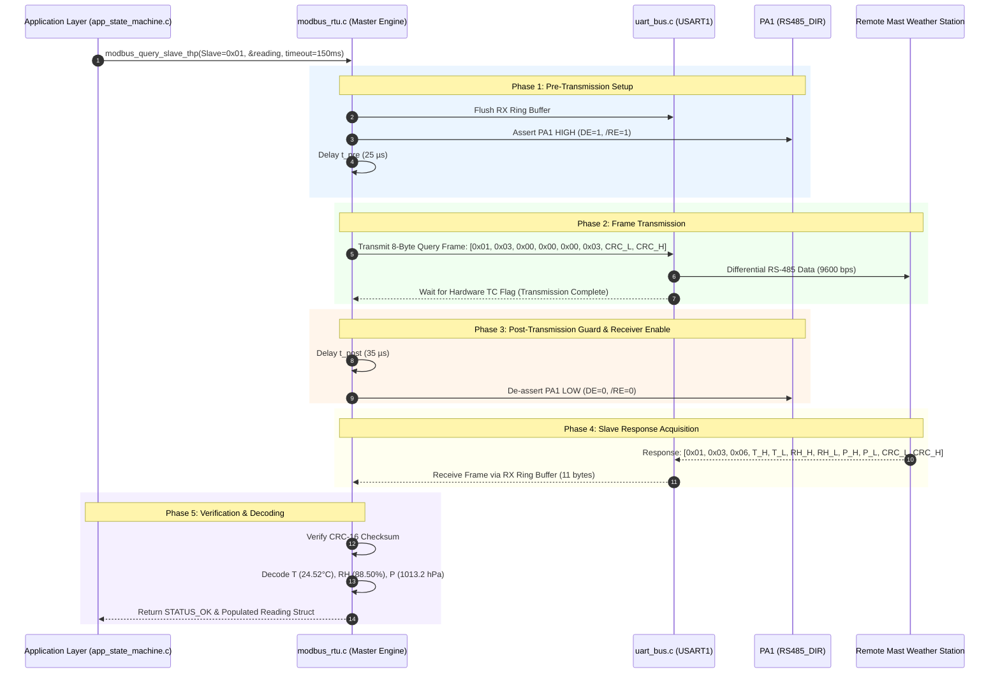

# Task Specification: S4-T4.3 - RS-485 Transceiver Direction Control & Guard Timing

## 1. Task Metadata & Overview

| Attribute | Specification Details |
| :--- | :--- |
| **Sprint** | **Sprint 4: Sensor Drivers & Remote Field Bus Interfaces** |
| **Task ID** | `S4-T4.3` |
| **Parent Task** | `S4-T4: Implement RS-485 Modbus RTU Master Protocol Driver` |
| **Task Title** | Implement RS-485 Transceiver DE/RE Direction Pin Toggling with Pre/Post Transmission Guard Times & Transaction Master Polling |
| **Status** | **Ready for Implementation** |
| **Target Files** | [`firmware/drivers/inc/modbus_rtu.h`](file:///C:/Users/ENERGY%20SAVER/Documents/Learning/Job%20Projects/rain-predict/firmware/drivers/inc/modbus_rtu.h)<br>[`firmware/drivers/src/modbus_rtu.c`](file:///C:/Users/ENERGY%20SAVER/Documents/Learning/Job%20Projects/rain-predict/firmware/drivers/src/modbus_rtu.c) |
| **Related Documents** | [`docs/sensors/remote-bus-modbus-sdi12.md`](file:///C:/Users/ENERGY%20SAVER/Documents/Learning/Job%20Projects/rain-predict/docs/sensors/remote-bus-modbus-sdi12.md)<br>[`docs/hardware/schematics-and-pinout.md`](file:///C:/Users/ENERGY%20SAVER/Documents/Learning/Job%20Projects/rain-predict/docs/hardware/schematics-and-pinout.md)<br>[`context/specs/s3-t2.2-uart-bus-driver.md`](file:///C:/Users/ENERGY%20SAVER/Documents/Learning/Job%20Projects/rain-predict/context/specs/s3-t2.2-uart-bus-driver.md)<br>[`context/specs/s3-t1.1-gpio-pin-mappings.md`](file:///C:/Users/ENERGY%20SAVER/Documents/Learning/Job%20Projects/rain-predict/context/specs/s3-t1.1-gpio-pin-mappings.md)<br>[`context/specs/s3-t3.1-switched-power-rails.md`](file:///C:/Users/ENERGY%20SAVER/Documents/Learning/Job%20Projects/rain-predict/context/specs/s3-t3.1-switched-power-rails.md)<br>[`context/specs/s4-t4.1-modbus-frame-generator.md`](file:///C:/Users/ENERGY%20SAVER/Documents/Learning/Job%20Projects/rain-predict/context/specs/s4-t4.1-modbus-frame-generator.md)<br>[`context/specs/s4-t4.2-modbus-crc16.md`](file:///C:/Users/ENERGY%20SAVER/Documents/Learning/Job%20Projects/rain-predict/context/specs/s4-t4.2-modbus-crc16.md)<br>[`context/coding-standards.md`](file:///C:/Users/ENERGY%20SAVER/Documents/Learning/Job%20Projects/rain-predict/context/coding-standards.md) |
| **Dependencies** | [`S3-T2.2`](file:///C:/Users/ENERGY%20SAVER/Documents/Learning/Job%20Projects/rain-predict/context/specs/s3-t2.2-uart-bus-driver.md) (UART Driver & DE Sequencer), [`S4-T4.1`](file:///C:/Users/ENERGY%20SAVER/Documents/Learning/Job%20Projects/rain-predict/context/specs/s4-t4.1-modbus-frame-generator.md) (FC03 Generator), [`S4-T4.2`](file:///C:/Users/ENERGY%20SAVER/Documents/Learning/Job%20Projects/rain-predict/context/specs/s4-t4.2-modbus-crc16.md) (CRC-16) |
| **Downstream Tasks** | [`S4-T4.4`](file:///C:/Users/ENERGY%20SAVER/Documents/Learning/Job%20Projects/rain-predict/context/specs/s4-t4.4-test-modbus-rtu.md) (Modbus Unit Tests), `S6-T3` (Application State Machine Master Polling), `S7-T1` (Field Bus Verification) |

---

## 2. Executive Summary & Architectural Scope

The primary objective of **`S4-T4.3`** is to develop the **Hardware Half-Duplex Direction Control Sequencer, Precise Microsecond Guard Timing Engine, and Master Transaction Polling Manager** in [`firmware/drivers/inc/modbus_rtu.h`](file:///C:/Users/ENERGY%20SAVER/Documents/Learning/Job%20Projects/rain-predict/firmware/drivers/inc/modbus_rtu.h) and [`firmware/drivers/src/modbus_rtu.c`](file:///C:/Users/ENERGY%20SAVER/Documents/Learning/Job%20Projects/rain-predict/firmware/drivers/src/modbus_rtu.c) targeting the **STMicroelectronics STM32WLE5** SoC.

The remote weather station mast probe communicates over a half-duplex RS-485 physical bus driven by an **SP3485** transceiver. Direction switching is controlled by GPIO pin **`PA1` (`RS485_DIR` / `RS485_DE_RE`)**:
- **`PA1 = HIGH`**: Transmitter Enabled (`DE = 1`, `/RE = 1`). Receiver output is High-Z.
- **`PA1 = LOW`**: Receiver Enabled (`DE = 0`, `/RE = 0`). Transmitter output is High-Z.

Because long differential cables ($100\text{m}$, $\approx 5\text{ nF}$ capacitance) introduce line propagation delays and driver turn-on ringing, improper direction timing can either corrupt the first bit of a transmission or clip the final stop bit before it leaves the wire. This task guarantees deterministic half-duplex communication via:
1. **Pre-Transmission Guard Delay ($t_{\text{pre}} = 25\,\mu\text{s}$)**: Allows the differential driver stage and $120\,\Omega$ termination resistors to stabilize before the UART outputs the first start bit.
2. **Hardware Transmission Complete (`TC`) Synchronization**: Ensures all 8 bits and the stop bit have fully left the UART transmit shift register before triggering the post-delay.
3. **Post-Transmission Guard Delay ($t_{\text{post}} = 35\,\mu\text{s}$)**: Holds DE active long enough for the final stop bit to propagate across the entire cable length before releasing the line to High-Z.
4. **Master Polling Orchestrator**: Manages end-to-end Modbus RTU transactions with bounded response timeouts ($150\text{ ms}$), retry scheduling (up to 3 attempts), and automatic decoding of physical meteorological telemetry.



---

## 3. Timing & Physical Layer Calculations

### 3.1 Timing Parameters at 48 MHz MSI Core Clock

The STM32WLE5 operates at $48\text{ MHz}$ ($1\text{ CPU cycle} \approx 20.833\text{ ns}$):

$$\text{Cycles per microsecond} = 48\text{ cycles}/\mu\text{s}$$

| Parameter | Symbol | Min | Nominal | Max | Unit | CPU Cycles (@ 48 MHz) | Purpose |
| :--- | :---: | :---: | :---: | :---: | :---: | :---: | :--- |
| **DE Pre-Delay** | $t_{\text{pre}}$ | $10$ | **$25$** | $50$ | $\mu\text{s}$ | $1,200\text{ cycles}$ | Settles SP3485 driver and charges line capacitance. |
| **DE Post-Delay**| $t_{\text{post}}$| $20$ | **$35$** | $100$ | $\mu\text{s}$ | $1,680\text{ cycles}$ | Holds DE active until stop bit reaches $100\text{m}$ cable end. |
| **Turnaround Time** | $t_{\text{turn}}$ | $1.0$ | **$5.0$** | $20.0$ | $\mu\text{s}$ | — | Driver High-Z transition to receiver active state. |
| **Slave Timeout** | $t_{\text{timeout}}$ | $50$ | **$150$** | $250$ | $\text{ms}$ | — | Max allowable wait time for remote slave response. |
| **Inter-Frame Silence** | $t_{3.5}$ | $3.5$ | **$4.0$** | — | char times | — | Modbus frame boundary silence ($3.65\text{ ms} @ 9600\text{ baud}$). |

---

### 3.2 Baud Rate & Transmission Time Formats

At $9600\text{ bps}$, 8-N-1 format ($1\text{ Start bit} + 8\text{ Data bits} + 0\text{ Parity} + 1\text{ Stop bit} = 10\text{ bits per character}$):

$$\text{Bit Time } t_{\text{bit}} = \frac{1}{9600} = 104.167\,\mu\text{s}$$

$$\text{Character Time } t_{\text{char}} = 10 \times 104.167\,\mu\text{s} = 1.04167\text{ ms}$$

- **8-Byte Query Frame Transmission Duration**:
  $$t_{\text{tx\_query}} = 8 \times 1.04167\text{ ms} = 8.333\text{ ms}$$
- **11-Byte Response Frame Transmission Duration**:
  $$t_{\text{rx\_resp}} = 11 \times 1.04167\text{ ms} = 11.458\text{ ms}$$
- **Modbus $3.5\text{-Character}$ Silence Interval ($t_{3.5}$)**:
  $$t_{3.5} = 3.5 \times 1.04167\text{ ms} = 3.646\text{ ms} \quad (\text{Enforced as } 4.0\text{ ms})$$

---

## 4. Public API & Header Blueprint (`modbus_rtu.h`)

### 4.1 Master Engine Constants & Function Prototypes

```c
#define MODBUS_DEFAULT_TIMEOUT_MS           150U    /**< Standard response timeout in ms */
#define MODBUS_MAX_RETRIES                  3U      /**< Max query attempts on timeout/CRC error */
#define MODBUS_GUARD_TIME_PRE_US            25U     /**< 25 µs pre-transmission delay */
#define MODBUS_GUARD_TIME_POST_US           35U     /**< 35 µs post-transmission delay */

/**
 * @brief  Initializes the Modbus RTU driver subsystem and configures direction GPIO.
 * @return STATUS_OK on success, or structured error code.
 */
status_t modbus_rtu_init(void);

/**
 * @brief  Executes a complete master query transaction for raw holding registers.
 * @param  slave_addr Unicast address of remote Modbus slave (1 to 247).
 * @param  start_reg Starting 16-bit register address.
 * @param  reg_count Number of registers to read (1 to 125).
 * @param[out] p_reg_data_out Buffer to store received 16-bit register words.
 * @param  timeout_ms Maximum response timeout in milliseconds (e.g. 150 ms).
 * @return STATUS_OK on success, STATUS_ERROR_TIMEOUT, STATUS_ERROR_CRC,
 *         STATUS_ERROR_MODBUS_EXCEPTION, or STATUS_ERROR_INVALID_FRAME.
 */
status_t modbus_query_slave_raw(uint8_t slave_addr,
                                uint16_t start_reg,
                                uint16_t reg_count,
                                uint16_t *p_reg_data_out,
                                uint32_t timeout_ms);

/**
 * @brief  Executes a standard microclimate mast query and decodes meteorological data.
 * @param  slave_addr Slave address of the weather station mast (default 0x01).
 * @param[out] p_reading Pointer to modbus_thp_reading_t structure to populate.
 * @param  timeout_ms Maximum response timeout in milliseconds.
 * @return STATUS_OK on success, or structured error code.
 */
status_t modbus_query_slave_thp(uint8_t slave_addr,
                                modbus_thp_reading_t *p_reading,
                                uint32_t timeout_ms);

/**
 * @brief  Drives PA1 HIGH to enable the SP3485 differential transmitter (DE=1, /RE=1).
 */
void modbus_set_direction_tx(void);

/**
 * @brief  Drives PA1 LOW to enable the SP3485 differential receiver (DE=0, /RE=0).
 */
void modbus_set_direction_rx(void);
```

---

## 5. Concrete Source Implementation (`firmware/drivers/src/modbus_rtu.c`)

```c
/**
 * @file    modbus_rtu.c (Master Engine & Direction Sequencer)
 * @brief   RS-485 DE/RE guard timing, hardware TC synchronization, and master polling.
 */

#include "modbus_rtu.h"
#include "uart_bus.h"
#include <string.h>

#ifdef STM32WLE5xx
#include "stm32wlxx_hal.h"
extern UART_HandleTypeDef huart1;
#define RS485_UART_HANDLE (&huart1)
#else
/* Host unit test simulation mocks */
static uint8_t s_mock_pa1_state = 0;
#define RS485_UART_HANDLE NULL
#endif

/* ========================================================================== */
/* Precise Microsecond Delay Utility (@ 48 MHz)                               */
/* ========================================================================== */

static void delay_us(uint32_t us)
{
#ifdef STM32WLE5xx
    /* 48 cycles per microsecond at 48 MHz MSI clock */
    uint32_t count = us * 12U; /* 4 CPU cycles per loop iteration */
    while (count-- > 0U) {
        __NOP();
    }
#else
    (void)us;
#endif
}

/* ========================================================================== */
/* Direction Pin Control (PA1)                                                */
/* ========================================================================== */

void modbus_set_direction_tx(void)
{
#ifdef STM32WLE5xx
    HAL_GPIO_WritePin(GPIOA, GPIO_PIN_1, GPIO_PIN_SET);
#else
    s_mock_pa1_state = 1;
#endif
}

void modbus_set_direction_rx(void)
{
#ifdef STM32WLE5xx
    HAL_GPIO_WritePin(GPIOA, GPIO_PIN_1, GPIO_PIN_RESET);
#else
    s_mock_pa1_state = 0;
#endif
}

/* ========================================================================== */
/* Initialization                                                             */
/* ========================================================================== */

status_t modbus_rtu_init(void)
{
    /* Configure PA1 as push-pull output and default to RX mode */
    modbus_set_direction_rx();
    return STATUS_OK;
}

/* ========================================================================== */
/* Master Query Transaction Execution                                         */
/* ========================================================================== */

status_t modbus_query_slave_raw(uint8_t slave_addr,
                                uint16_t start_reg,
                                uint16_t reg_count,
                                uint16_t *p_reg_data_out,
                                uint32_t timeout_ms)
{
    if (p_reg_data_out == NULL) {
        return STATUS_ERROR_NULL_POINTER;
    }

    uint8_t  tx_frame[MODBUS_FC03_REQ_FRAME_SIZE];
    uint16_t tx_len = 0;

    /* Step 1: Construct 8-byte FC03 Query Frame with CRC-16 */
    status_t status = modbus_build_read_holding_registers_req(slave_addr,
                                                              start_reg,
                                                              reg_count,
                                                              tx_frame,
                                                              sizeof(tx_frame),
                                                              &tx_len);
    if (status != STATUS_OK) {
        return status;
    }

    /* Expected response length: 3 header + (2 * reg_count) data + 2 CRC */
    uint16_t expected_resp_len = 3U + (reg_count * 2U) + 2U;
    uint8_t  rx_buf[MODBUS_MAX_FRAME_SIZE];
    uint16_t rx_len = 0;

    /* Step 2: Flush UART RX Ring Buffer to discard stale noise */
    uart_bus_flush_rx(UART_PORT_RS485);

    /* Step 3: Assert DE=HIGH (Transmitter Mode) */
    modbus_set_direction_tx();

    /* Step 4: Pre-Transmission Guard Delay (25 µs) */
    delay_us(MODBUS_GUARD_TIME_PRE_US);

    /* Step 5: Transmit Request Frame */
    status = uart_bus_transmit(UART_PORT_RS485, tx_frame, tx_len, 50U);
    if (status != STATUS_OK) {
        modbus_set_direction_rx();
        return status;
    }

#ifdef STM32WLE5xx
    /* Step 6: Wait for Hardware Transmission Complete (TC) Flag */
    uint32_t tc_timeout = 10000U;
    while (!__HAL_UART_GET_FLAG(RS485_UART_HANDLE, UART_FLAG_TC) && (tc_timeout-- > 0U)) {
        __NOP();
    }
#endif

    /* Step 7: Post-Transmission Guard Delay (35 µs) */
    delay_us(MODBUS_GUARD_TIME_POST_US);

    /* Step 8: De-assert DE=LOW (Receiver Mode Active) */
    modbus_set_direction_rx();

    /* Step 9: Await Slave Response with Bounded Software Timeout */
    status = uart_bus_receive(UART_PORT_RS485,
                              rx_buf,
                              sizeof(rx_buf),
                              &rx_len,
                              timeout_ms);
    if (status != STATUS_OK) {
        return status;
    }

    /* Step 10: Parse Response Frame, Verify CRC, and Unpack 16-Bit Words */
    modbus_exception_t exception = MODBUS_EX_NONE;
    status = modbus_parse_read_holding_registers_resp(slave_addr,
                                                      reg_count,
                                                      rx_buf,
                                                      rx_len,
                                                      p_reg_data_out,
                                                      &exception);

    return status;
}

/* ========================================================================== */
/* High-Level Meteorological Telemetry Query                                  */
/* ========================================================================== */

status_t modbus_query_slave_thp(uint8_t slave_addr,
                                modbus_thp_reading_t *p_reading,
                                uint32_t timeout_ms)
{
    if (p_reading == NULL) {
        return STATUS_ERROR_NULL_POINTER;
    }

    uint16_t raw_regs[5] = {0};
    status_t status;

    /* Execute query with retry loop (up to 3 attempts) */
    for (uint8_t attempt = 0; attempt < MODBUS_MAX_RETRIES; attempt++) {
        /* Query 5 registers: Temp, Humidity, Pressure, Wind Speed, Wind Dir */
        status = modbus_query_slave_raw(slave_addr,
                                        MODBUS_REG_TEMPERATURE,
                                        5U,
                                        raw_regs,
                                        timeout_ms);
        if (status == STATUS_OK) {
            break;
        }

        /* Inter-frame delay before retry */
        delay_us(4000); /* 4 ms pause */
    }

    if (status != STATUS_OK) {
        return status;
    }

    /* Decode raw 16-bit words into floating-point physical units */
    return modbus_decode_thp_registers(raw_regs, 5U, p_reading);
}
```

---

## 6. Defensive Programming, Safety & Power Hardening

1. **Hardware TC Synchronization**:
   - The sequencer polls the hardware `UART_FLAG_TC` bit, not just `UART_FLAG_TXE`. This prevents prematurely cutting off the stop bit of the final CRC byte while it is still shifting out of the UART output pin.
2. **Direction Pin Fail-Safe**:
   - In any error return path (e.g. transmission failure, buffer overflow), `modbus_set_direction_rx()` is called immediately to release the RS-485 line to High-Z listening mode.
3. **Flushing Stale RX Traffic**:
   - `uart_bus_flush_rx()` is executed prior to every transmission to ensure no line transients or reflection glitches from power switching contaminate the response buffer.
4. **Zero Dynamic Allocation**:
   - All buffers and stack frames utilize static or local stack memory. `malloc` and `free` are strictly prohibited.

---

## 7. Verification & Test Matrix (10 Points)

| Test ID | Verification Description | Input Stimulus / State | Expected Behavior / Output |
| :---: | :--- | :--- | :--- |
| **`TC-DIR-01`** | **Direction Init State** | Call `modbus_rtu_init()` | `PA1` is driven LOW (`0`), receiver mode active. |
| **`TC-DIR-02`** | **TX/RX Direction Toggling** | Call `modbus_set_direction_tx()` / `rx()` | `PA1` transitions cleanly between HIGH (`1`) and LOW (`0`). |
| **`TC-DIR-03`** | **Pre-Transmission Guard Delay** | Measure time between `PA1 = HIGH` and first TX byte | $t_{\text{pre}} \ge 20\,\mu\text{s}$ (nominal $25\,\mu\text{s}$). |
| **`TC-DIR-04`** | **Post-Transmission Guard Delay**| Measure time between TC flag and `PA1 = LOW` | $t_{\text{post}} \ge 30\,\mu\text{s}$ (nominal $35\,\mu\text{s}$). |
| **`TC-DIR-05`** | **Successful Master Transaction** | Inject valid 11-byte THP response | Returns `STATUS_OK`, decoded $T, RH, P$ populate reading struct. |
| **`TC-DIR-06`** | **Slave Response Timeout** | Remote probe does not respond within $150\text{ ms}$ | Returns `STATUS_ERROR_TIMEOUT`, `PA1` remains LOW. |
| **`TC-DIR-07`** | **CRC Mismatch Retry** | Injected response has corrupted CRC on attempt 1, valid on attempt 2 | Retries automatically, returns `STATUS_OK` on attempt 2. |
| **`TC-DIR-08`** | **Exhausted Retries Handling** | Corrupted CRC on all 3 attempts | Fails after 3 attempts, returns `STATUS_ERROR_CRC`. |
| **`TC-DIR-09`** | **Modbus Exception Handling** | Remote probe returns `0x83` Exception Code `0x02` | Returns `STATUS_ERROR_MODBUS_EXCEPTION`, no corrupted readings decoded. |
| **`TC-DIR-10`** | **TX Buffer Error Recovery** | Simulated UART transmit error | Returns error status, immediately forces `PA1 = LOW`. |

---

## 8. Acceptance Criteria & Implementation Checklist

- [ ] **Direction Control Functions**: Implemented `modbus_set_direction_tx()` and `modbus_set_direction_rx()` on `PA1`.
- [ ] **Guard Timing**: Enforced $25\,\mu\text{s}$ pre-delay and $35\,\mu\text{s}$ post-delay with hardware `TC` flag synchronization.
- [ ] **Master Transaction Poller**: Implemented `modbus_query_slave_raw()` managing frame construction, transmission, direction switching, response timeout, and unpacking.
- [ ] **High-Level THP Poller**: Implemented `modbus_query_slave_thp()` with 3-attempt retry loop and automatic physical unit conversion.
- [ ] **Fail-Safe RX Release**: Verified that all error pathways release `PA1` to LOW (receiver mode).
- [ ] **Zero Dynamic Allocation**: 100% deterministic static memory.
