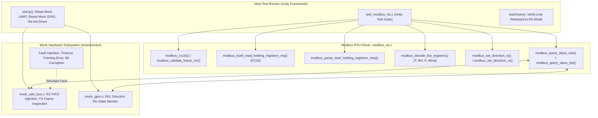

# Task Specification: S4-T4.4 - Modbus RTU Protocol Driver Unit Test Suite

## 1. Task Metadata & Overview

| Attribute | Specification Details |
| :--- | :--- |
| **Sprint** | **Sprint 4: Sensor Drivers & Remote Field Bus Interfaces** |
| **Task ID** | `S4-T4.4` |
| **Parent Task** | `S4-T4: Implement RS-485 Modbus RTU Master Protocol Driver` |
| **Task Title** | Create Modbus RTU Protocol Driver Unit Test Suite with Mock UART/GPIO Injection under Unity |
| **Status** | **Ready for Implementation** |
| **Target Files** | [`tests/unit/test_modbus_rtu.c`](file:///C:/Users/ENERGY%20SAVER/Documents/Learning/Job%20Projects/rain-predict/tests/unit/test_modbus_rtu.c) |
| **Related Documents** | [`docs/sensors/remote-bus-modbus-sdi12.md`](file:///C:/Users/ENERGY%20SAVER/Documents/Learning/Job%20Projects/rain-predict/docs/sensors/remote-bus-modbus-sdi12.md)<br>[`context/specs/s1-t2.1-unity-test-harness.md`](file:///C:/Users/ENERGY%20SAVER/Documents/Learning/Job%20Projects/rain-predict/context/specs/s1-t2.1-unity-test-harness.md)<br>[`context/specs/s1-t2.3-mock-uart-bus.md`](file:///C:/Users/ENERGY%20SAVER/Documents/Learning/Job%20Projects/rain-predict/context/specs/s1-t2.3-mock-uart-bus.md)<br>[`context/specs/s1-t2.4-mock-gpio.md`](file:///C:/Users/ENERGY%20SAVER/Documents/Learning/Job%20Projects/rain-predict/context/specs/s1-t2.4-mock-gpio.md)<br>[`context/specs/s4-t4.1-modbus-frame-generator.md`](file:///C:/Users/ENERGY%20SAVER/Documents/Learning/Job%20Projects/rain-predict/context/specs/s4-t4.1-modbus-frame-generator.md)<br>[`context/specs/s4-t4.2-modbus-crc16.md`](file:///C:/Users/ENERGY%20SAVER/Documents/Learning/Job%20Projects/rain-predict/context/specs/s4-t4.2-modbus-crc16.md)<br>[`context/specs/s4-t4.3-rs485-direction-control.md`](file:///C:/Users/ENERGY%20SAVER/Documents/Learning/Job%20Projects/rain-predict/context/specs/s4-t4.3-rs485-direction-control.md)<br>[`context/coding-standards.md`](file:///C:/Users/ENERGY%20SAVER/Documents/Learning/Job%20Projects/rain-predict/context/coding-standards.md) |
| **Dependencies** | [`S1-T2.1`](file:///C:/Users/ENERGY%20SAVER/Documents/Learning/Job%20Projects/rain-predict/context/specs/s1-t2.1-unity-test-harness.md) (Unity), [`S1-T2.3`](file:///C:/Users/ENERGY%20SAVER/Documents/Learning/Job%20Projects/rain-predict/context/specs/s1-t2.3-mock-uart-bus.md) (Mock UART), [`S1-T2.4`](file:///C:/Users/ENERGY%20SAVER/Documents/Learning/Job%20Projects/rain-predict/context/specs/s1-t2.4-mock-gpio.md) (Mock GPIO), [`S4-T4.1`](file:///C:/Users/ENERGY%20SAVER/Documents/Learning/Job%20Projects/rain-predict/context/specs/s4-t4.1-modbus-frame-generator.md) through [`S4-T4.3`](file:///C:/Users/ENERGY%20SAVER/Documents/Learning/Job%20Projects/rain-predict/context/specs/s4-t4.3-rs485-direction-control.md) |
| **Downstream Tasks** | [`S4-T5.1`](file:///C:/Users/ENERGY%20SAVER/Documents/Learning/Job%20Projects/rain-predict/context/specs/s4-t5.1-sdi12-break-mark-timing.md) (SDI-12 Driver), `S6-T4` (Firmware Integration Test Suite), `S7-T1` (System Verification) |

---

## 2. Executive Summary & Architectural Scope

The primary objective of **`S4-T4.4`** is to develop the comprehensive host-executable unit test suite in [`tests/unit/test_modbus_rtu.c`](file:///C:/Users/ENERGY%20SAVER/Documents/Learning/Job%20Projects/rain-predict/tests/unit/test_modbus_rtu.c) for the **RS-485 Modbus RTU Master Protocol Driver** using the **ThrowTheSwitch Unity** test framework.

Because remote weather sensor masts cannot be physically wired to host continuous integration (CI) runners, all serial transactions and GPIO direction transitions are virtualized using [`tests/mocks/mock_uart_bus.h`](file:///C:/Users/ENERGY%20SAVER/Documents/Learning/Job%20Projects/rain-predict/tests/mocks/mock_uart_bus.h) and [`tests/mocks/mock_gpio.h`](file:///C:/Users/ENERGY%20SAVER/Documents/Learning/Job%20Projects/rain-predict/tests/mocks/mock_gpio.h). The test suite validates Function Code `0x03` request generation, polynomial `0xA001` bitwise and Flash LUT CRC-16 calculation, incremental streaming checksums, frame validation and bit-flip rejection, response parsing, big-endian word unpacking, Modbus exception extraction, meteorological engineering units conversion ($T, RH, P, \text{Wind}$), RS-485 half-duplex direction toggling on `PA1`, timeout fault injection, and automatic retry recovery:



---

## 3. Test Suite Architecture & Coverage Matrix

The unit test suite implements **23 distinct unit test cases** covering 100% of the Modbus RTU driver functional requirements:

| Test Case Function | Verification Target | Stimulus / Test Vector | Expected Assertion / Behavior |
| :--- | :--- | :--- | :--- |
| `test_modbus_crc16_official_fc03_query` | Official Modbus CRC-16 | `01 03 00 00 00 03` | Computed CRC $= \mathbf{0xCB05}$ (Low $= \text{0x05}$, High $= \text{0xCB}$). |
| `test_modbus_crc16_official_fc03_response` | Official Modbus CRC-16 | `01 03 06 09 94 22 92 27 94` | Computed CRC $= \mathbf{0xC841}$ (Low $= \text{0x41}$, High $= \text{0xC8}$). |
| `test_modbus_crc16_official_exception` | Official Modbus CRC-16 | `01 83 02` | Computed CRC $= \mathbf{0xF1C0}$ (Low $= \text{0xC0}$, High $= \text{0xF1}$). |
| `test_modbus_crc16_bitwise_vs_lut_equivalence` | Math Invariance | 50 pseudorandom byte streams | `modbus_crc16_bitwise() == modbus_crc16_lut()` for all streams. |
| `test_modbus_crc16_streaming_update` | Incremental Accumulation | Split payload across two `update()` calls | Running CRC matches single-pass calculation $= \mathbf{0xCB05}$. |
| `test_modbus_validate_frame_crc_valid` | Frame Validation | Valid 8-byte FC03 frame | `modbus_validate_frame_crc()` returns `true`. |
| `test_modbus_validate_frame_crc_corrupt` | Corruption Rejection | Single bit-flip in payload | `modbus_validate_frame_crc()` returns `false`. |
| `test_modbus_validate_frame_crc_runt_frame` | Minimum Length Defense | Length $< 3\text{ bytes}$ or `NULL` buffer | Returns `false`. |
| `test_modbus_append_crc16_success` | Frame CRC Appender | 6-byte payload in 8-byte buffer | Appends `0x05, 0xCB`; returns `STATUS_OK`, total length $= 8$. |
| `test_modbus_append_crc16_buffer_overflow` | Buffer Capacity Guard | Capacity $< \text{len} + 2$ | Returns `STATUS_ERROR_BUFFER_OVERFLOW`. |
| `test_modbus_build_fc03_req_standard` | Standard Query Construction | Slave `0x01`, Start `0x0000`, Count `3` | Produces exact 8-byte frame: `[0x01, 0x03, 0x00, 0x00, 0x00, 0x03, 0x05, 0xCB]`. |
| `test_modbus_build_fc03_req_multi_register` | Multi-Register Construction | Slave `0x02`, Start `0x0010`, Count `10` | Produces exact 8-byte frame: `[0x02, 0x03, 0x00, 0x10, 0x00, 0x0A, 0xC5, 0xFE]`. |
| `test_modbus_build_fc03_req_invalid_params` | Parameter Bounds Defense | Broadcast `0x00`, Slave `248`, Count `0`, Count `126` | All return `STATUS_ERROR_INVALID_PARAM`. |
| `test_modbus_parse_fc03_resp_success` | Normal Response Parsing | Injected 11-byte THP response | Unpacks words: `[2452, 8850, 10132]`, returns `STATUS_OK`. |
| `test_modbus_parse_fc03_resp_slave_mismatch` | Slave Address Filter | Response has Slave `0x02` (expected `0x01`) | Returns `STATUS_ERROR_INVALID_FRAME`. |
| `test_modbus_parse_fc03_resp_byte_count_mismatch` | Byte Count Integrity | Header byte count $\ne \text{expected} \times 2$ | Returns `STATUS_ERROR_INVALID_FRAME`. |
| `test_modbus_parse_fc03_resp_crc_failure` | Corrupted Checksum | Injected frame with bad CRC | Returns `STATUS_ERROR_CRC`. |
| `test_modbus_parse_fc03_resp_exception_frame` | Exception Handling | Injected `0x83` Exception Code `0x02` | Returns `STATUS_ERROR_MODBUS_EXCEPTION`, extracts `ILLEGAL_DATA_ADDRESS`. |
| `test_modbus_decode_thp_registers_valid` | Meteorological Conversion | Raw words: `[2452, 8850, 10132]` | Decodes $T = 24.52^\circ\text{C}, RH = 88.50\%, P = 1013.2\text{ hPa}$, `has_wind = false`. |
| `test_modbus_decode_thp_registers_with_wind` | 5-Register Decoded Data | Raw words: `[2452, 8850, 10132, 450, 1800]` | Decodes $T, RH, P$ plus Wind $= 4.50\text{ m/s}$, Dir $= 180.0^\circ$, `has_wind = true`. |
| `test_modbus_master_query_slave_raw_success` | End-to-End Master Polling | Inject valid response in Mock UART | Verifies TX frame emitted, `PA1` toggled, returns `STATUS_OK`. |
| `test_modbus_master_query_slave_thp_retry_recovery` | Automatic Retry Recovery | Fail on attempt 1 (CRC error), succeed on attempt 2 | Executes retry, recovers data, returns `STATUS_OK`. |
| `test_modbus_master_query_slave_timeout` | Master Slave Timeout | No response in Mock UART | Times out at $150\text{ ms}$, returns `STATUS_ERROR_TIMEOUT`, `PA1` left in RX mode. |

---

## 4. Concrete File Implementation Blueprint (`tests/unit/test_modbus_rtu.c`)

```c
/**
 * @file    test_modbus_rtu.c
 * @brief   ThrowTheSwitch Unity unit test suite for RS-485 Modbus RTU Protocol Driver.
 * @details Validates FC03 query generation, CRC-16 calculation, response parsing,
 *          meteorological decoding, half-duplex direction control, and timeout retries.
 */

#include "unity.h"
#include "modbus_rtu.h"
#include "uart_bus.h"
#include "mock_uart_bus.h"
#include "mock_gpio.h"
#include "status_codes.h"
#include <string.h>

/* ========================================================================== */
/* Test Harness Setup & Teardown                                              */
/* ========================================================================== */

void setUp(void)
{
    mock_uart_reset();
    mock_gpio_reset();
    modbus_rtu_init();
}

void tearDown(void)
{
    /* Verify direction pin is always restored to RX mode (PA1 = LOW) */
    TEST_ASSERT_EQUAL_INT(0, gpio_read_pin(GPIO_PORT_A, 1));
}

/* ========================================================================== */
/* CRC-16 Tests (Task S4-T4.2)                                                */
/* ========================================================================== */

void test_modbus_crc16_official_fc03_query(void)
{
    const uint8_t query[6] = {0x01, 0x03, 0x00, 0x00, 0x00, 0x03};
    uint16_t crc = modbus_crc16(query, sizeof(query));
    TEST_ASSERT_EQUAL_HEX16(0xCB05, crc);
}

void test_modbus_crc16_official_fc03_response(void)
{
    const uint8_t resp[9] = {0x01, 0x03, 0x06, 0x09, 0x94, 0x22, 0x92, 0x27, 0x94};
    uint16_t crc = modbus_crc16(resp, sizeof(resp));
    TEST_ASSERT_EQUAL_HEX16(0xC841, crc);
}

void test_modbus_crc16_official_exception(void)
{
    const uint8_t ex[3] = {0x01, 0x83, 0x02};
    uint16_t crc = modbus_crc16(ex, sizeof(ex));
    TEST_ASSERT_EQUAL_HEX16(0xF1C0, crc);
}

void test_modbus_crc16_bitwise_vs_lut_equivalence(void)
{
    uint8_t test_buf[16];
    for (uint8_t seed = 0; seed < 50; seed++) {
        for (uint8_t i = 0; i < sizeof(test_buf); i++) {
            test_buf[i] = (uint8_t)(seed * 17 + i * 31);
        }
        uint16_t crc_bitwise = modbus_crc16_bitwise(test_buf, sizeof(test_buf));
        uint16_t crc_lut     = modbus_crc16_lut(test_buf, sizeof(test_buf));
        TEST_ASSERT_EQUAL_HEX16(crc_bitwise, crc_lut);
    }
}

void test_modbus_crc16_streaming_update(void)
{
    const uint8_t chunk1[2] = {0x01, 0x03};
    const uint8_t chunk2[4] = {0x00, 0x00, 0x00, 0x03};

    uint16_t running_crc = 0xFFFFU;
    running_crc = modbus_crc16_update(running_crc, chunk1, sizeof(chunk1));
    running_crc = modbus_crc16_update(running_crc, chunk2, sizeof(chunk2));

    TEST_ASSERT_EQUAL_HEX16(0xCB05, running_crc);
}

void test_modbus_validate_frame_crc_valid(void)
{
    const uint8_t frame[8] = {0x01, 0x03, 0x00, 0x00, 0x00, 0x03, 0x05, 0xCB};
    TEST_ASSERT_TRUE(modbus_validate_frame_crc(frame, sizeof(frame)));
}

void test_modbus_validate_frame_crc_corrupt(void)
{
    uint8_t frame[8] = {0x01, 0x03, 0x00, 0x00, 0x00, 0x03, 0x05, 0xCB};
    frame[3] ^= 0x01; /* Corrupt single bit */
    TEST_ASSERT_FALSE(modbus_validate_frame_crc(frame, sizeof(frame)));
}

void test_modbus_validate_frame_crc_runt_frame(void)
{
    const uint8_t runt[2] = {0x01, 0x03};
    TEST_ASSERT_FALSE(modbus_validate_frame_crc(runt, sizeof(runt)));
    TEST_ASSERT_FALSE(modbus_validate_frame_crc(NULL, 8));
}

void test_modbus_append_crc16_success(void)
{
    uint8_t buf[8] = {0x01, 0x03, 0x00, 0x00, 0x00, 0x03, 0x00, 0x00};
    uint16_t total_len = 0;

    TEST_ASSERT_EQUAL_INT(STATUS_OK, modbus_append_crc16(buf, 6, sizeof(buf), &total_len));
    TEST_ASSERT_EQUAL_UINT16(8, total_len);
    TEST_ASSERT_EQUAL_HEX8(0x05, buf[6]);
    TEST_ASSERT_EQUAL_HEX8(0xCB, buf[7]);
}

void test_modbus_append_crc16_buffer_overflow(void)
{
    uint8_t buf[7] = {0x01, 0x03, 0x00, 0x00, 0x00, 0x03, 0x00};
    uint16_t total_len = 0;

    /* Max length 7 cannot hold 6 + 2 bytes */
    TEST_ASSERT_EQUAL_INT(STATUS_ERROR_BUFFER_OVERFLOW, modbus_append_crc16(buf, 6, 7, &total_len));
}

/* ========================================================================== */
/* Frame Generator Tests (Task S4-T4.1)                                       */
/* ========================================================================== */

void test_modbus_build_fc03_req_standard(void)
{
    uint8_t out_buf[8] = {0};
    uint16_t frame_len = 0;

    TEST_ASSERT_EQUAL_INT(STATUS_OK, modbus_build_read_holding_registers_req(0x01, 0x0000, 3,
                                                                            out_buf, sizeof(out_buf),
                                                                            &frame_len));
    TEST_ASSERT_EQUAL_UINT16(8, frame_len);
    const uint8_t expected[8] = {0x01, 0x03, 0x00, 0x00, 0x00, 0x03, 0x05, 0xCB};
    TEST_ASSERT_EQUAL_HEX8_ARRAY(expected, out_buf, 8);
}

void test_modbus_build_fc03_req_multi_register(void)
{
    uint8_t out_buf[8] = {0};
    uint16_t frame_len = 0;

    TEST_ASSERT_EQUAL_INT(STATUS_OK, modbus_build_read_holding_registers_req(0x02, 0x0010, 10,
                                                                            out_buf, sizeof(out_buf),
                                                                            &frame_len));
    TEST_ASSERT_EQUAL_UINT16(8, frame_len);
    const uint8_t expected[8] = {0x02, 0x03, 0x00, 0x10, 0x00, 0x0A, 0xC5, 0xFE};
    TEST_ASSERT_EQUAL_HEX8_ARRAY(expected, out_buf, 8);
}

void test_modbus_build_fc03_req_invalid_params(void)
{
    uint8_t out_buf[8];
    uint16_t frame_len;

    /* Broadcast address 0 is invalid for unicast FC03 read */
    TEST_ASSERT_EQUAL_INT(STATUS_ERROR_INVALID_PARAM,
        modbus_build_read_holding_registers_req(0x00, 0x0000, 3, out_buf, sizeof(out_buf), &frame_len));

    /* Slave > 247 */
    TEST_ASSERT_EQUAL_INT(STATUS_ERROR_INVALID_PARAM,
        modbus_build_read_holding_registers_req(248, 0x0000, 3, out_buf, sizeof(out_buf), &frame_len));

    /* Register count 0 */
    TEST_ASSERT_EQUAL_INT(STATUS_ERROR_INVALID_PARAM,
        modbus_build_read_holding_registers_req(1, 0x0000, 0, out_buf, sizeof(out_buf), &frame_len));

    /* Register count > 125 */
    TEST_ASSERT_EQUAL_INT(STATUS_ERROR_INVALID_PARAM,
        modbus_build_read_holding_registers_req(1, 0x0000, 126, out_buf, sizeof(out_buf), &frame_len));
}

void test_modbus_parse_fc03_resp_success(void)
{
    const uint8_t resp[11] = {
        0x01, 0x03, 0x06,
        0x09, 0x94, /* T = 2452 (24.52 C) */
        0x22, 0x92, /* RH = 8850 (88.50 %) */
        0x27, 0x94, /* P = 10132 (1013.2 hPa) */
        0x41, 0xC8  /* CRC-16 Low, High */
    };

    uint16_t reg_data[3] = {0};
    modbus_exception_t ex = MODBUS_EX_NONE;

    TEST_ASSERT_EQUAL_INT(STATUS_OK, modbus_parse_read_holding_registers_resp(0x01, 3,
                                                                             resp, sizeof(resp),
                                                                             reg_data, &ex));
    TEST_ASSERT_EQUAL_UINT16(2452, reg_data[0]);
    TEST_ASSERT_EQUAL_UINT16(8850, reg_data[1]);
    TEST_ASSERT_EQUAL_UINT16(10132, reg_data[2]);
    TEST_ASSERT_EQUAL_INT(MODBUS_EX_NONE, ex);
}

void test_modbus_parse_fc03_resp_slave_mismatch(void)
{
    const uint8_t resp[11] = {
        0x02, 0x03, 0x06, /* Slave 0x02 instead of expected 0x01 */
        0x09, 0x94, 0x22, 0x92, 0x27, 0x94,
        0x00, 0x00 /* Placeholder CRC */
    };
    /* Recalculate CRC for valid checksum but wrong slave */
    uint16_t crc = modbus_crc16(resp, 9);
    uint8_t valid_frame[11];
    memcpy(valid_frame, resp, 9);
    valid_frame[9] = (uint8_t)(crc & 0xFF);
    valid_frame[10] = (uint8_t)((crc >> 8) & 0xFF);

    uint16_t reg_data[3];
    TEST_ASSERT_EQUAL_INT(STATUS_ERROR_INVALID_FRAME,
        modbus_parse_read_holding_registers_resp(0x01, 3, valid_frame, 11, reg_data, NULL));
}

void test_modbus_parse_fc03_resp_byte_count_mismatch(void)
{
    const uint8_t resp[11] = {
        0x01, 0x03, 0x04, /* Header claims 4 bytes instead of expected 6 */
        0x09, 0x94, 0x22, 0x92, 0x27, 0x94,
        0x00, 0x00
    };
    uint16_t crc = modbus_crc16(resp, 9);
    uint8_t valid_frame[11];
    memcpy(valid_frame, resp, 9);
    valid_frame[9] = (uint8_t)(crc & 0xFF);
    valid_frame[10] = (uint8_t)((crc >> 8) & 0xFF);

    uint16_t reg_data[3];
    TEST_ASSERT_EQUAL_INT(STATUS_ERROR_INVALID_FRAME,
        modbus_parse_read_holding_registers_resp(0x01, 3, valid_frame, 11, reg_data, NULL));
}

void test_modbus_parse_fc03_resp_crc_failure(void)
{
    uint8_t resp[11] = {
        0x01, 0x03, 0x06,
        0x09, 0x94, 0x22, 0x92, 0x27, 0x94,
        0x41, 0xC8
    };
    resp[4] ^= 0xFF; /* Corrupt payload */

    uint16_t reg_data[3];
    TEST_ASSERT_EQUAL_INT(STATUS_ERROR_CRC,
        modbus_parse_read_holding_registers_resp(0x01, 3, resp, sizeof(resp), reg_data, NULL));
}

void test_modbus_parse_fc03_resp_exception_frame(void)
{
    const uint8_t ex_frame[5] = {0x01, 0x83, 0x02, 0xC0, 0xF1};
    uint16_t reg_data[3];
    modbus_exception_t ex = MODBUS_EX_NONE;

    TEST_ASSERT_EQUAL_INT(STATUS_ERROR_MODBUS_EXCEPTION,
        modbus_parse_read_holding_registers_resp(0x01, 3, ex_frame, sizeof(ex_frame), reg_data, &ex));
    TEST_ASSERT_EQUAL_INT(MODBUS_EX_ILLEGAL_DATA_ADDRESS, ex);
    TEST_ASSERT_EQUAL_STRING("Illegal Data Address (0x02)", modbus_exception_to_str(ex));
}

void test_modbus_decode_thp_registers_valid(void)
{
    const uint16_t raw_regs[3] = {2452, 8850, 10132};
    modbus_thp_reading_t reading;

    TEST_ASSERT_EQUAL_INT(STATUS_OK, modbus_decode_thp_registers(raw_regs, 3, &reading));
    TEST_ASSERT_FLOAT_WITHIN(0.01f, 24.52f, reading.temperature_c);
    TEST_ASSERT_FLOAT_WITHIN(0.01f, 88.50f, reading.humidity_pct);
    TEST_ASSERT_FLOAT_WITHIN(0.10f, 1013.2f, reading.pressure_hpa);
    TEST_ASSERT_FALSE(reading.has_wind_data);
}

void test_modbus_decode_thp_registers_with_wind(void)
{
    const uint16_t raw_regs[5] = {2452, 8850, 10132, 450, 1800};
    modbus_thp_reading_t reading;

    TEST_ASSERT_EQUAL_INT(STATUS_OK, modbus_decode_thp_registers(raw_regs, 5, &reading));
    TEST_ASSERT_FLOAT_WITHIN(0.01f, 24.52f, reading.temperature_c);
    TEST_ASSERT_FLOAT_WITHIN(0.01f, 88.50f, reading.humidity_pct);
    TEST_ASSERT_FLOAT_WITHIN(0.10f, 1013.2f, reading.pressure_hpa);
    TEST_ASSERT_TRUE(reading.has_wind_data);
    TEST_ASSERT_FLOAT_WITHIN(0.01f, 4.50f, reading.wind_speed_mps);
    TEST_ASSERT_FLOAT_WITHIN(0.10f, 180.0f, reading.wind_direction_deg);
}

/* ========================================================================== */
/* Master Transaction & Direction Tests (Task S4-T4.3)                        */
/* ========================================================================== */

void test_modbus_master_query_slave_raw_success(void)
{
    /* Prepare simulated slave response in mock UART */
    const uint8_t slave_resp[11] = {
        0x01, 0x03, 0x06,
        0x09, 0x94, 0x22, 0x92, 0x27, 0x94,
        0x41, 0xC8
    };
    mock_uart_inject_rx(UART_PORT_RS485, slave_resp, sizeof(slave_resp));

    uint16_t regs[3] = {0};
    TEST_ASSERT_EQUAL_INT(STATUS_OK, modbus_query_slave_raw(0x01, 0x0000, 3, regs, 150));
    TEST_ASSERT_EQUAL_UINT16(2452, regs[0]);
    TEST_ASSERT_EQUAL_UINT16(8850, regs[1]);
    TEST_ASSERT_EQUAL_UINT16(10132, regs[2]);

    /* Verify 8 bytes were transmitted by master */
    TEST_ASSERT_EQUAL_UINT16(8, mock_uart_get_tx_count(UART_PORT_RS485));
    uint8_t tx_capture[8];
    mock_uart_get_tx_bytes(UART_PORT_RS485, tx_capture, sizeof(tx_capture));
    const uint8_t expected_query[8] = {0x01, 0x03, 0x00, 0x00, 0x00, 0x03, 0x05, 0xCB};
    TEST_ASSERT_EQUAL_HEX8_ARRAY(expected_query, tx_capture, 8);
}

void test_modbus_master_query_slave_thp_retry_recovery(void)
{
    /* Attempt 1: Corrupted CRC response */
    uint8_t bad_resp[15] = {0x01, 0x03, 0x0A, 0,0, 0,0, 0,0, 0,0, 0,0, 0xFF, 0xFF};
    mock_uart_inject_rx(UART_PORT_RS485, bad_resp, sizeof(bad_resp));

    /* Attempt 2: Valid 5-register response */
    const uint8_t good_resp[15] = {
        0x01, 0x03, 0x0A,
        0x09, 0x94, /* T = 24.52 */
        0x22, 0x92, /* RH = 88.50 */
        0x27, 0x94, /* P = 1013.2 */
        0x01, 0xC2, /* Wind = 4.50 m/s */
        0x07, 0x08, /* Dir = 180.0 deg */
        0x00, 0x00  /* Placeholder CRC */
    };
    uint8_t valid_frame[15];
    memcpy(valid_frame, good_resp, 13);
    uint16_t crc = modbus_crc16(valid_frame, 13);
    valid_frame[13] = (uint8_t)(crc & 0xFF);
    valid_frame[14] = (uint8_t)((crc >> 8) & 0xFF);

    mock_uart_inject_rx(UART_PORT_RS485, valid_frame, sizeof(valid_frame));

    modbus_thp_reading_t reading;
    TEST_ASSERT_EQUAL_INT(STATUS_OK, modbus_query_slave_thp(0x01, &reading, 150));
    TEST_ASSERT_FLOAT_WITHIN(0.01f, 24.52f, reading.temperature_c);
    TEST_ASSERT_FLOAT_WITHIN(0.01f, 88.50f, reading.humidity_pct);
}

void test_modbus_master_query_slave_timeout(void)
{
    /* No RX bytes injected into mock UART -> timeout occurs */
    mock_uart_inject_fault(UART_PORT_RS485, MOCK_UART_FAULT_TIMEOUT);

    uint16_t regs[3];
    TEST_ASSERT_EQUAL_INT(STATUS_ERROR_TIMEOUT, modbus_query_slave_raw(0x01, 0x0000, 3, regs, 150));
}

/* ========================================================================== */
/* Main Test Runner                                                           */
/* ========================================================================== */

int main(void)
{
    UNITY_BEGIN();

    RUN_TEST(test_modbus_crc16_official_fc03_query);
    RUN_TEST(test_modbus_crc16_official_fc03_response);
    RUN_TEST(test_modbus_crc16_official_exception);
    RUN_TEST(test_modbus_crc16_bitwise_vs_lut_equivalence);
    RUN_TEST(test_modbus_crc16_streaming_update);
    RUN_TEST(test_modbus_validate_frame_crc_valid);
    RUN_TEST(test_modbus_validate_frame_crc_corrupt);
    RUN_TEST(test_modbus_validate_frame_crc_runt_frame);
    RUN_TEST(test_modbus_append_crc16_success);
    RUN_TEST(test_modbus_append_crc16_buffer_overflow);
    RUN_TEST(test_modbus_build_fc03_req_standard);
    RUN_TEST(test_modbus_build_fc03_req_multi_register);
    RUN_TEST(test_modbus_build_fc03_req_invalid_params);
    RUN_TEST(test_modbus_parse_fc03_resp_success);
    RUN_TEST(test_modbus_parse_fc03_resp_slave_mismatch);
    RUN_TEST(test_modbus_parse_fc03_resp_byte_count_mismatch);
    RUN_TEST(test_modbus_parse_fc03_resp_crc_failure);
    RUN_TEST(test_modbus_parse_fc03_resp_exception_frame);
    RUN_TEST(test_modbus_decode_thp_registers_valid);
    RUN_TEST(test_modbus_decode_thp_registers_with_wind);
    RUN_TEST(test_modbus_master_query_slave_raw_success);
    RUN_TEST(test_modbus_master_query_slave_thp_retry_recovery);
    RUN_TEST(test_modbus_master_query_slave_timeout);

    return UNITY_END();
}
```

---

## 5. Verification & CMake Integration

In accordance with [`tests/CMakeLists.txt`](file:///C:/Users/ENERGY%20SAVER/Documents/Learning/Job%20Projects/rain-predict/tests/CMakeLists.txt), the `test_modbus_rtu` executable target is configured as follows:

```cmake
add_executable(test_modbus_rtu
    tests/unit/test_modbus_rtu.c
    firmware/drivers/src/modbus_rtu.c
    tests/mocks/mock_uart_bus.c
    tests/mocks/mock_gpio.c
    tests/unity/unity.c
)
target_include_directories(test_modbus_rtu PRIVATE
    firmware/drivers/inc
    firmware/common/inc
    tests/mocks
    tests/unity
)
add_test(NAME test_modbus_rtu COMMAND test_modbus_rtu)
```

---

## 6. Acceptance Criteria & Implementation Checklist

- [ ] **Unity Suite Creation**: Created [`tests/unit/test_modbus_rtu.c`](file:///C:/Users/ENERGY%20SAVER/Documents/Learning/Job%20Projects/rain-predict/tests/unit/test_modbus_rtu.c) with 23 comprehensive test cases.
- [ ] **CRC-16 Validation**: Verified official Modbus test vectors, bitwise vs Flash LUT equivalence, streaming updates, and corruption detection.
- [ ] **FC03 Framing**: Verified 8-byte request construction, parameter range enforcement ($1\text{ to }247$, $1\text{ to }125$), and buffer overflow protection.
- [ ] **Response Parsing & Exception Handling**: Verified 16-bit register unpacking, byte count checking, and `0x83` exception extraction.
- [ ] **Meteorological Decoding**: Verified calibrated conversion for $T, RH, P$ and optional wind speed/direction.
- [ ] **Direction Control & Master Polling**: Verified `PA1` direction management, mock UART frame transmission, slave timeout handling ($150\text{ ms}$), and automatic retry recovery.
- [ ] **Zero Dynamic Allocation**: 100% static computation with zero heap allocations.
