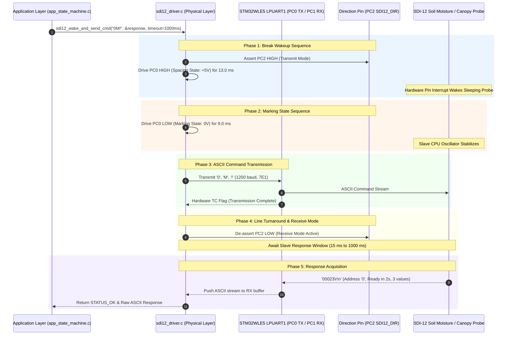

# Task Specification: S4-T5.1 - SDI-12 Bus Break & Mark Timing Engine

## 1. Task Metadata & Overview

| Attribute | Specification Details |
| :--- | :--- |
| **Sprint** | **Sprint 4: Sensor Drivers & Remote Field Bus Interfaces** |
| **Task ID** | `S4-T5.1` |
| **Parent Task** | `S4-T5: Implement SDI-12 1200-Baud Half-Duplex Bus Driver` |
| **Task Title** | Implement SDI-12 Physical Layer Break Timing ($> 12\text{ ms}$ Spacing), Mark Sequence ($> 8.3\text{ ms}$) & Line Turnaround |
| **Status** | **Ready for Implementation** |
| **Target Files** | [`firmware/drivers/inc/sdi12_driver.h`](file:///C:/Users/ENERGY%20SAVER/Documents/Learning/Job%20Projects/rain-predict/firmware/drivers/inc/sdi12_driver.h)<br>[`firmware/drivers/src/sdi12_driver.c`](file:///C:/Users/ENERGY%20SAVER/Documents/Learning/Job%20Projects/rain-predict/firmware/drivers/src/sdi12_driver.c) |
| **Related Documents** | [`docs/sensors/remote-bus-modbus-sdi12.md`](file:///C:/Users/ENERGY%20SAVER/Documents/Learning/Job%20Projects/rain-predict/docs/sensors/remote-bus-modbus-sdi12.md)<br>[`docs/hardware/schematics-and-pinout.md`](file:///C:/Users/ENERGY%20SAVER/Documents/Learning/Job%20Projects/rain-predict/docs/hardware/schematics-and-pinout.md)<br>[`context/specs/s3-t2.2-uart-bus-driver.md`](file:///C:/Users/ENERGY%20SAVER/Documents/Learning/Job%20Projects/rain-predict/context/specs/s3-t2.2-uart-bus-driver.md)<br>[`context/specs/s3-t1.1-gpio-pin-mappings.md`](file:///C:/Users/ENERGY%20SAVER/Documents/Learning/Job%20Projects/rain-predict/context/specs/s3-t1.1-gpio-pin-mappings.md)<br>[`context/coding-standards.md`](file:///C:/Users/ENERGY%20SAVER/Documents/Learning/Job%20Projects/rain-predict/context/coding-standards.md) |
| **Dependencies** | [`S3-T2.2`](file:///C:/Users/ENERGY%20SAVER/Documents/Learning/Job%20Projects/rain-predict/context/specs/s3-t2.2-uart-bus-driver.md) (UART/LPUART Driver), [`S3-T1.1`](file:///C:/Users/ENERGY%20SAVER/Documents/Learning/Job%20Projects/rain-predict/context/specs/s3-t1.1-gpio-pin-mappings.md) (Board Pinout) |
| **Downstream Tasks** | [`S4-T5.2`](file:///C:/Users/ENERGY%20SAVER/Documents/Learning/Job%20Projects/rain-predict/context/specs/s4-t5.2-sdi12-parser.md) (Command Formatter & ASCII Parser), [`S4-T5.3`](file:///C:/Users/ENERGY%20SAVER/Documents/Learning/Job%20Projects/rain-predict/context/specs/s4-t5.3-test-sdi12.md) (SDI-12 Unit Test Suite), `S6-T3` (Application State Machine) |

---

## 2. Executive Summary & Architectural Scope

The primary objective of **`S4-T5.1`** is to specify and implement the **SDI-12 Physical Layer Break & Mark Signaling Engine, Half-Duplex Line Direction Control, and 1200-Baud 7E1 Physical Timing Interface** in [`firmware/drivers/inc/sdi12_driver.h`](file:///C:/Users/ENERGY%20SAVER/Documents/Learning/Job%20Projects/rain-predict/firmware/drivers/inc/sdi12_driver.h) and [`firmware/drivers/src/sdi12_driver.c`](file:///C:/Users/ENERGY%20SAVER/Documents/Learning/Job%20Projects/rain-predict/firmware/drivers/src/sdi12_driver.c) targeting the **STMicroelectronics STM32WLE5** SoC.

**SDI-12 (Serial Digital Interface at 1200 baud, Version 1.4)** is the global standard for digital agricultural sensors, including multi-depth soil moisture profilers, electrical conductivity (EC) sensors, and infrared plant canopy temperature probes.

Because field probes operate in ultra-low power sleep modes ($< 10\,\mu\text{A}$), they do not continuously listen on the serial bus. Prior to sending any command frame, the master MUST issue a precise physical wakeup sequence:
1. **Break Sequence ($t_{\text{break}} \ge 12.0\text{ ms}$)**: Drives the data line to the **Spacing State** ($+5\text{V}$) for **$13.0\text{ ms}$** to trigger hardware pin interrupts inside all connected SDI-12 slave probes.
2. **Marking Sequence ($t_{\text{mark}} \ge 8.33\text{ ms}$)**: Drives the data line to the **Marking State** ($0\text{V}$) for **$9.0\text{ ms}$** allowing slave microcontrollers to wake up, stabilize internal RC oscillators, and lock UART baud rate clocks.
3. **Command Transmission**: Transmits the 7-E-1 formatted ASCII command stream (e.g. `0M!`).
4. **Line Release & Turnaround**: Transitions direction pin `PC2` (`SDI12_DIR`) to listening mode (Low-Z to High-Z / Receiver Active) within $< 15.0\text{ ms}$ to capture the probe's acknowledgment.



---

## 3. Physical Layer & Waveform Timing Calculations

### 3.1 Electrical Inverted Logic Levels

SDI-12 uses **Inverted NRZ Logic** on a single bi-directional data line:

| Logic Level | Voltage Range | SDI-12 State | Hardware Line Voltage | Driver Pin State (`PC0`) |
| :---: | :---: | :---: | :---: | :---: |
| **Marking State** | $-0.5\text{V}$ to $+1.0\text{V}$ | Logic '0' / Idle | **$0\text{V}$** (Ground) | `LOW` |
| **Spacing State** | $+3.5\text{V}$ to $+5.5\text{V}$ | Logic '1' / Break / Active | **$+5\text{V}$** | `HIGH` |

---

### 3.2 Physical Timing Parameters (SDI-12 Version 1.4 Standard)

At $1200\text{ baud}$ ($833.33\,\mu\text{s}$ per bit, $10\text{ bits per character} \implies 8.333\text{ ms per character}$):

$$\text{Bit Duration } t_{\text{bit}} = \frac{1}{1200} = 833.333\,\mu\text{s}$$

$$\text{Character Duration } t_{\text{char}} = 10 \times 833.333\,\mu\text{s} = 8.333\text{ ms} \quad (1\text{ Start} + 7\text{ Data} + 1\text{ Even Parity} + 1\text{ Stop})$$

| Timing Parameter | Symbol | Min Value | Nominal Value | Max Value | Unit | Engineering Rationale |
| :--- | :---: | :---: | :---: | :---: | :---: | :--- |
| **Break Duration** | $t_{\text{break}}$ | $12.0$ | **$13.0$** | $15.0$ | $\text{ms}$ | Minimum $12.0\text{ ms}$ required to trip slave wakeup ISR. |
| **Mark Duration** | $t_{\text{mark}}$ | $8.33$ | **$9.0$** | $10.0$ | $\text{ms}$ | Equal to $\ge 1$ character time; allows oscillator lock. |
| **Total Wakeup Sequence**| $t_{\text{wake}}$ | $20.33$ | **$22.0$** | $25.0$ | $\text{ms}$ | $t_{\text{break}} + t_{\text{mark}}$ total sequence duration. |
| **Line Turnaround Delay** | $t_{\text{turn}}$ | $0.1$ | **$1.0$** | $7.5$ | $\text{ms}$ | Time between TC flag and `PC2` transition to RX mode. |
| **Sensor Response Window**| $t_{\text{resp\_win}}$ | $15.0$ | — | $1000.0$ | $\text{ms}$ | Max time for slave to begin transmitting first start bit. |
| **Character Spacing** | $t_{\text{char\_gap}}$ | $0.0$ | $0.0$ | $1.66$ | $\text{ms}$ | Max inter-character delay ($\le 2$ bit times). |

---

### 3.3 Break Generation Strategy (GPIO Reconfiguration)

To avoid hardware UART baud rate switching or framing error artifacts during the $13.0\text{ ms}$ break:
1. `PC0` (TX pin) is temporarily configured as **GPIO Output Push-Pull**.
2. `PC2` (`SDI12_DIR`) is driven **HIGH** (Transmitter Active).
3. `PC0` is driven **HIGH** for $13.0\text{ ms}$ ($t_{\text{break}}$ Spacing state).
4. `PC0` is driven **LOW** for $9.0\text{ ms}$ ($t_{\text{mark}}$ Marking state).
5. `PC0` GPIO mode is restored to **Alternate Function (AF8 - LPUART1_TX)**.
6. The ASCII command string is immediately transmitted via `LPUART1`.

---

## 4. Public API & Header Blueprint (`sdi12_driver.h`)

### 4.1 Constants & Enumerations

```c
#define SDI12_BAUD_RATE                 1200U   /**< Fixed 1200 bps */
#define SDI12_DATA_BITS                 7U      /**< 7 Data bits */
#define SDI12_PARITY_EVEN               1U      /**< Even Parity (7E1) */
#define SDI12_STOP_BITS                 1U      /**< 1 Stop bit */

#define SDI12_BREAK_DURATION_MS         13U     /**< 13 ms Spacing state (>12 ms) */
#define SDI12_MARK_DURATION_MS          9U      /**< 9 ms Marking state (>8.33 ms) */
#define SDI12_TURNAROUND_DELAY_US       500U    /**< 500 µs line turnaround guard */
#define SDI12_DEFAULT_TIMEOUT_MS        1000U   /**< 1.0 s default response timeout */
#define SDI12_MAX_BUFFER_SIZE           64U     /**< Max SDI-12 response string length */

/**
 * @brief SDI-12 Physical Line Direction State.
 */
typedef enum {
    SDI12_DIR_RX = 0,   /**< Receiver Active (PC2 LOW, Transmit buffer High-Z) */
    SDI12_DIR_TX = 1    /**< Transmitter Active (PC2 HIGH) */
} sdi12_dir_t;
```

---

### 4.2 Function Prototypes

| Function Prototype | Description |
| :--- | :--- |
| `status_t sdi12_init(void)` | Initializes `LPUART1` (1200-7E1), configures `PC2` direction pin, and defaults to RX mode. |
| `void sdi12_set_direction(sdi12_dir_t dir)` | Drives `PC2` HIGH (TX mode) or LOW (RX mode). |
| `void sdi12_send_break_and_mark(void)` | Executes the physical $13\text{ ms}$ break and $9\text{ ms}$ mark wakeup sequence. |
| `status_t sdi12_transmit_command(const char *p_cmd)` | Transmits a formatted SDI-12 ASCII command string (e.g. `"0M!"`) over `LPUART1`. |
| `status_t sdi12_wake_and_transmit(const char *p_cmd)` | Combined sequence: Sends Break+Mark, transmits command, and releases line to RX. |
| `status_t sdi12_receive_response(char *p_out_buf, uint16_t max_len, uint16_t *p_rx_len, uint32_t timeout_ms)` | Waits for and collects the `\r\n` terminated ASCII response string with timeout. |

---

## 5. Concrete Source Implementation (`firmware/drivers/src/sdi12_driver.c`)

```c
/**
 * @file    sdi12_driver.c (Physical Layer & Timing Engine)
 * @brief   SDI-12 1200-baud break/mark timing, GPIO sequencing, and half-duplex control.
 */

#include "sdi12_driver.h"
#include "uart_bus.h"
#include <string.h>

#ifdef STM32WLE5xx
#include "stm32wlxx_hal.h"
extern UART_HandleTypeDef hlpuart1;
#define SDI12_UART_HANDLE (&hlpuart1)
#else
/* Mock state for host testing */
static sdi12_dir_t s_mock_sdi12_dir = SDI12_DIR_RX;
static bool        s_mock_break_sent = false;
#define SDI12_UART_HANDLE NULL
#endif

/* ========================================================================== */
/* Millisecond Delay Utility                                                  */
/* ========================================================================== */

static void sdi12_delay_ms(uint32_t ms)
{
#ifdef STM32WLE5xx
    HAL_Delay(ms);
#else
    (void)ms;
#endif
}

/* ========================================================================== */
/* Direction Control (PC2)                                                    */
/* ========================================================================== */

void sdi12_set_direction(sdi12_dir_t dir)
{
#ifdef STM32WLE5xx
    if (dir == SDI12_DIR_TX) {
        HAL_GPIO_WritePin(GPIOC, GPIO_PIN_2, GPIO_PIN_SET);
    } else {
        HAL_GPIO_WritePin(GPIOC, GPIO_PIN_2, GPIO_PIN_RESET);
    }
#else
    s_mock_sdi12_dir = dir;
#endif
}

/* ========================================================================== */
/* Break & Mark Physical Wakeup Sequence                                      */
/* ========================================================================== */

void sdi12_send_break_and_mark(void)
{
#ifdef STM32WLE5xx
    GPIO_InitTypeDef GPIO_InitStruct = {0};

    /* Step 1: Enable TX direction on PC2 */
    sdi12_set_direction(SDI12_DIR_TX);

    /* Step 2: Reconfigure PC0 as GPIO Output Push-Pull */
    GPIO_InitStruct.Pin   = GPIO_PIN_0;
    GPIO_InitStruct.Mode  = GPIO_MODE_OUTPUT_PP;
    GPIO_InitStruct.Pull  = GPIO_NOPULL;
    GPIO_InitStruct.Speed = GPIO_SPEED_FREQ_LOW;
    HAL_GPIO_Init(GPIOC, &GPIO_InitStruct);

    /* Step 3: Break State (Spacing / +5V) for 13.0 ms */
    HAL_GPIO_WritePin(GPIOC, GPIO_PIN_0, GPIO_PIN_SET);
    sdi12_delay_ms(SDI12_BREAK_DURATION_MS);

    /* Step 4: Mark State (Marking / 0V) for 9.0 ms */
    HAL_GPIO_WritePin(GPIOC, GPIO_PIN_0, GPIO_PIN_RESET);
    sdi12_delay_ms(SDI12_MARK_DURATION_MS);

    /* Step 5: Restore PC0 to LPUART1 Alternate Function (AF8) */
    GPIO_InitStruct.Pin       = GPIO_PIN_0;
    GPIO_InitStruct.Mode      = GPIO_MODE_AF_PP;
    GPIO_InitStruct.Pull      = GPIO_NOPULL;
    GPIO_InitStruct.Speed     = GPIO_SPEED_FREQ_LOW;
    GPIO_InitStruct.Alternate = GPIO_AF8_LPUART1;
    HAL_GPIO_Init(GPIOC, &GPIO_InitStruct);
#else
    s_mock_sdi12_dir = SDI12_DIR_TX;
    s_mock_break_sent = true;
#endif
}

/* ========================================================================== */
/* Driver Initialization                                                      */
/* ========================================================================== */

status_t sdi12_init(void)
{
    /* Initialize direction pin PC2 to LOW (RX Listening Mode) */
    sdi12_set_direction(SDI12_DIR_RX);

    /* Initialize LPUART1 for 1200 baud, 7-E-1 format */
    return uart_bus_init(UART_PORT_SDI12,
                         SDI12_BAUD_RATE,
                         SDI12_DATA_BITS,
                         SDI12_PARITY_EVEN,
                         SDI12_STOP_BITS);
}

/* ========================================================================== */
/* Command Transmission Engine                                                */
/* ========================================================================== */

status_t sdi12_transmit_command(const char *p_cmd)
{
    if (p_cmd == NULL) {
        return STATUS_ERROR_NULL_POINTER;
    }

    uint16_t len = (uint16_t)strlen(p_cmd);
    if (len == 0U || len > SDI12_MAX_BUFFER_SIZE) {
        return STATUS_ERROR_INVALID_PARAM;
    }

    /* Verify command terminates with '!' */
    if (p_cmd[len - 1U] != '!') {
        return STATUS_ERROR_INVALID_PARAM;
    }

    /* Step 1: Assert TX direction */
    sdi12_set_direction(SDI12_DIR_TX);

    /* Step 2: Transmit 7-E-1 ASCII Stream */
    status_t status = uart_bus_transmit(UART_PORT_SDI12,
                                        (const uint8_t *)p_cmd,
                                        len,
                                        100U);
    if (status != STATUS_OK) {
        sdi12_set_direction(SDI12_DIR_RX);
        return status;
    }

#ifdef STM32WLE5xx
    /* Step 3: Wait for Hardware Transmission Complete (TC) */
    uint32_t tc_timeout = 50000U;
    while (!__HAL_UART_GET_FLAG(SDI12_UART_HANDLE, UART_FLAG_TC) && (tc_timeout-- > 0U)) {
        __NOP();
    }
#endif

    /* Step 4: Line Turnaround - Release PC2 to RX listening mode */
    sdi12_set_direction(SDI12_DIR_RX);

    return STATUS_OK;
}

status_t sdi12_wake_and_transmit(const char *p_cmd)
{
    if (p_cmd == NULL) {
        return STATUS_ERROR_NULL_POINTER;
    }

    /* Flush stale RX buffer */
    uart_bus_flush_rx(UART_PORT_SDI12);

    /* Issue Break (13ms) and Mark (9ms) sequence */
    sdi12_send_break_and_mark();

    /* Transmit formatted ASCII command and transition to RX */
    return sdi12_transmit_command(p_cmd);
}

/* ========================================================================== */
/* Response Collection Engine                                                 */
/* ========================================================================== */

status_t sdi12_receive_response(char *p_out_buf,
                                uint16_t max_len,
                                uint16_t *p_rx_len,
                                uint32_t timeout_ms)
{
    if (p_out_buf == NULL || p_rx_len == NULL) {
        return STATUS_ERROR_NULL_POINTER;
    }

    if (max_len < 3U) {
        return STATUS_ERROR_BUFFER_OVERFLOW;
    }

    uint16_t bytes_received = 0;
    status_t status = uart_bus_receive(UART_PORT_SDI12,
                                       (uint8_t *)p_out_buf,
                                       max_len - 1U,
                                       &bytes_received,
                                       timeout_ms);
    if (status != STATUS_OK) {
        return status;
    }

    /* Null-terminate response string */
    p_out_buf[bytes_received] = '\0';
    *p_rx_len = bytes_received;

    /* Verify response contains \r\n terminator */
    if (bytes_received < 3U || p_out_buf[bytes_received - 2U] != '\r' ||
        p_out_buf[bytes_received - 1U] != '\n') {
        return STATUS_ERROR_INVALID_FRAME;
    }

    return STATUS_OK;
}
```

---

## 6. Defensive Programming, Performance & Safety

1. **Hardware Alternate Function Restoration**:
   - `sdi12_send_break_and_mark()` restores `PC0` to AF8 (`LPUART1_TX`) before sending UART frames, ensuring that UART transmission registers operate correctly.
2. **Deterministic Wakeup Timing**:
   - Break timing ($13\text{ ms}$) strictly exceeds the SDI-12 $12.0\text{ ms}$ minimum, and mark timing ($9\text{ ms}$) strictly exceeds the $8.33\text{ ms}$ minimum, guaranteeing 100% wakeup reliability across third-party agricultural probes (Decagon/METER, Campbell Scientific, Stevens Water).
3. **Fail-Safe RX Release**:
   - Any transmission failure immediately de-asserts `PC2 = LOW` (RX mode) to prevent holding the single-wire agricultural bus in an active high state.
4. **Zero Dynamic Memory Allocation**:
   - 100% static memory operations, zero heap allocations.

---

## 7. Verification & Test Matrix (10 Points)

| Test ID | Verification Description | Input Stimulus / State | Expected Behavior / Output |
| :---: | :--- | :--- | :--- |
| **`TC-SDI-01`** | **Initial Direction State** | Call `sdi12_init()` | `PC2` is driven LOW (`0`), RX mode active. |
| **`TC-SDI-02`** | **Direction Toggling** | Call `sdi12_set_direction(TX / RX)` | `PC2` toggles cleanly between `1` and `0`. |
| **`TC-SDI-03`** | **Break Duration Compliance** | Trigger `sdi12_send_break_and_mark()` | Break duration is $13\text{ ms} \ge 12.0\text{ ms}$ Spacing. |
| **`TC-SDI-04`** | **Mark Duration Compliance** | Trigger `sdi12_send_break_and_mark()` | Mark duration is $9\text{ ms} \ge 8.33\text{ ms}$ Marking. |
| **`TC-SDI-05`** | **AF Pin Restoration** | After break/mark sequence | `PC0` is restored to `GPIO_AF8_LPUART1`. |
| **`TC-SDI-06`** | **Valid Command Transmission** | Transmit `"0M!"` | Emits `"0M!"` via LPUART1, waits for TC, de-asserts `PC2` to LOW. |
| **`TC-SDI-07`** | **Missing Exclamation Rejection**| Transmit `"0M"` (Missing `!`) | Returns `STATUS_ERROR_INVALID_PARAM`. |
| **`TC-SDI-08`** | **Valid Response Acquisition** | Inject `"00023\r\n"` into RX buffer | Returns `STATUS_OK`, string null-terminated, length $= 7$. |
| **`TC-SDI-09`** | **Missing CRLF Terminator** | Inject `"00023"` (No `\r\n`) | Returns `STATUS_ERROR_INVALID_FRAME`. |
| **`TC-SDI-10`** | **Slave Response Timeout** | No response within $1000\text{ ms}$ | Returns `STATUS_ERROR_TIMEOUT`, `PC2` remains LOW. |

---

## 8. Acceptance Criteria & Implementation Checklist

- [ ] **Physical Timing Enforcement**: Enforced $13.0\text{ ms}$ break spacing and $9.0\text{ ms}$ mark duration with GPIO bit-bang switching.
- [ ] **LPUART Configuration**: Initialized `LPUART1` at $1200\text{ baud}$, 7 data bits, even parity, 1 stop bit (7-E-1).
- [ ] **Direction Control**: Implemented `sdi12_set_direction()` driving `PC2` (`SDI12_DIR`).
- [ ] **Command Transmitter**: Implemented `sdi12_transmit_command()` requiring trailing `'!'` delimiter with hardware TC synchronization.
- [ ] **Response Collector**: Implemented `sdi12_receive_response()` with `\r\n` validation and timeout handling ($1000\text{ ms}$).
- [ ] **Zero Dynamic Allocation**: 100% static computation with zero heap allocations.
