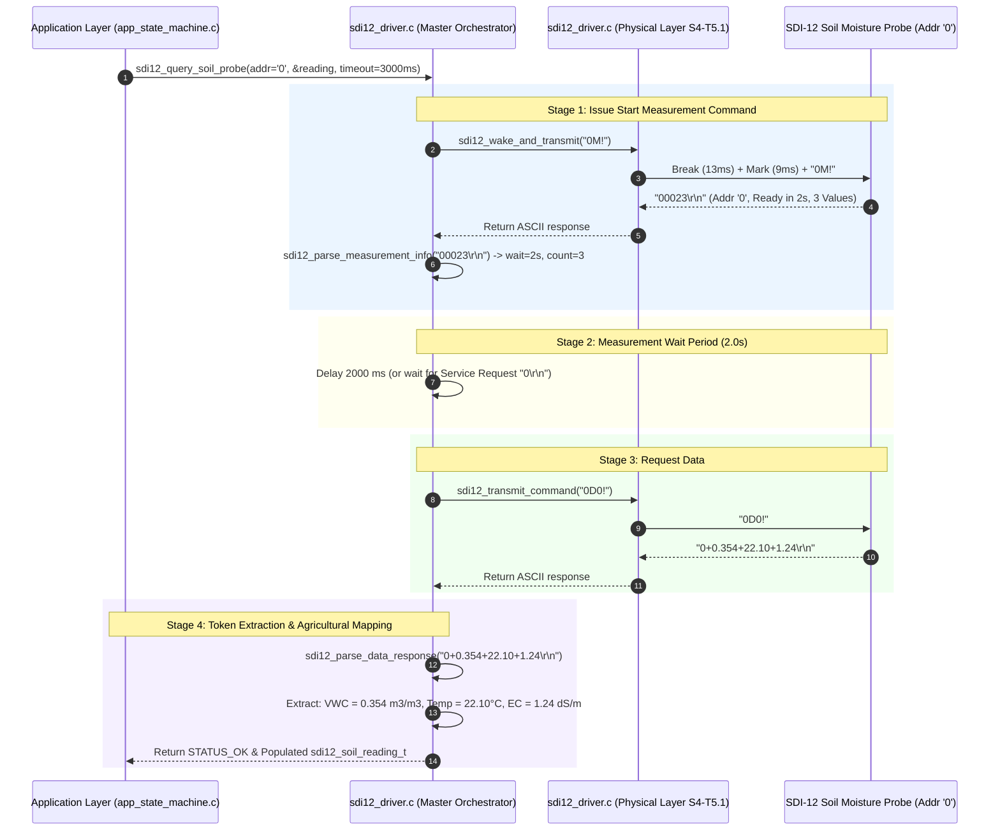

# Task Specification: S4-T5.2 - SDI-12 Command Formatter & ASCII Response Parser

## 1. Task Metadata & Overview

| Attribute | Specification Details |
| :--- | :--- |
| **Sprint** | **Sprint 4: Sensor Drivers & Remote Field Bus Interfaces** |
| **Task ID** | `S4-T5.2` |
| **Parent Task** | `S4-T5: Implement SDI-12 1200-Baud Half-Duplex Bus Driver` |
| **Task Title** | Implement SDI-12 Command Formatter (`?!`, `aM!`, `aD0!`, `aI!`) & Multi-Parameter ASCII Floating-Point Response Parser |
| **Status** | **Ready for Implementation** |
| **Target Files** | [`firmware/drivers/inc/sdi12_driver.h`](file:///C:/Users/ENERGY%20SAVER/Documents/Learning/Job%20Projects/rain-predict/firmware/drivers/inc/sdi12_driver.h)<br>[`firmware/drivers/src/sdi12_driver.c`](file:///C:/Users/ENERGY%20SAVER/Documents/Learning/Job%20Projects/rain-predict/firmware/drivers/src/sdi12_driver.c) |
| **Related Documents** | [`docs/sensors/remote-bus-modbus-sdi12.md`](file:///C:/Users/ENERGY%20SAVER/Documents/Learning/Job%20Projects/rain-predict/docs/sensors/remote-bus-modbus-sdi12.md)<br>[`docs/hardware/schematics-and-pinout.md`](file:///C:/Users/ENERGY%20SAVER/Documents/Learning/Job%20Projects/rain-predict/docs/hardware/schematics-and-pinout.md)<br>[`context/specs/s4-t5.1-sdi12-break-mark-timing.md`](file:///C:/Users/ENERGY%20SAVER/Documents/Learning/Job%20Projects/rain-predict/context/specs/s4-t5.1-sdi12-break-mark-timing.md)<br>[`context/coding-standards.md`](file:///C:/Users/ENERGY%20SAVER/Documents/Learning/Job%20Projects/rain-predict/context/coding-standards.md) |
| **Dependencies** | [`S4-T5.1`](file:///C:/Users/ENERGY%20SAVER/Documents/Learning/Job%20Projects/rain-predict/context/specs/s4-t5.1-sdi12-break-mark-timing.md) (SDI-12 Break & Mark Physical Layer) |
| **Downstream Tasks** | [`S4-T5.3`](file:///C:/Users/ENERGY%20SAVER/Documents/Learning/Job%20Projects/rain-predict/context/specs/s4-t5.3-test-sdi12.md) (SDI-12 Unit Test Suite), `S6-T3` (Application State Machine Sensor Sampling) |

---

## 2. Executive Summary & Architectural Scope

The primary objective of **`S4-T5.2`** is to develop the **SDI-12 Protocol Command Formatting Engine, High-Level Multi-Stage Measurement Orchestrator, and Deterministic ASCII Response Parser** in [`firmware/drivers/inc/sdi12_driver.h`](file:///C:/Users/ENERGY%20SAVER/Documents/Learning/Job%20Projects/rain-predict/firmware/drivers/inc/sdi12_driver.h) and [`firmware/drivers/src/sdi12_driver.c`](file:///C:/Users/ENERGY%20SAVER/Documents/Learning/Job%20Projects/rain-predict/firmware/drivers/src/sdi12_driver.c) targeting the **STMicroelectronics STM32WLE5** SoC.

SDI-12 sensors exchange data using human-readable ASCII text strings over a $1200\text{-baud}$ 7-E-1 serial channel. A standard acquisition cycle for an agricultural multi-depth soil moisture or canopy temperature probe requires a synchronized 2-stage command sequence:
1. **Start Measurement Command (`aM!`)**:
   - Instructs sensor `a` to begin sampling internal transducers.
   - Sensor returns `atttn\r\n`, specifying measurement preparation time `ttt` in seconds ($0\text{--}999\text{ s}$) and number of values `n` ($1\text{--}9$).
2. **Data Collection Command (`aD0!`)**:
   - After elapsed preparation time `ttt` (or immediately upon receiving an asynchronous service request `a\r\n`), the master requests data.
   - Sensor returns `a+val1+val2+val3...\r\n` (e.g. `0+0.354+22.10+1.24\r\n`).
3. **Deterministic Token Parsing**:
   - Parses variable-length signed floats (e.g. `+0.354`, `-12.5`, `+1013.25`, `+1.23E-01`) without allocating dynamic memory on the heap.
4. **Agronomic Unit Conversion**:
   - Maps raw tokens into physical soil metrics: **Volumetric Water Content ($\text{m}^3/\text{m}^3$)**, **Soil/Leaf Temperature ($^\circ\text{C}$)**, and **Bulk Electrical Conductivity ($\text{dS/m}$)**.



---

## 3. SDI-12 Protocol Command & Response Specifications

### 3.1 Standard Command Table (SDI-12 Version 1.4)

| Command | Name | Master Request | Slave Response Format | Example Response | Description |
| :--- | :--- | :---: | :---: | :---: | :--- |
| **`?!`** | **Address Query** | `?!` | `a\r\n` | `0\r\n` | Discovers address of single connected probe. |
| **`a!`** | **Acknowledge Active** | `a!` | `a\r\n` | `0\r\n` | Pings sensor to verify presence and readiness. |
| **`aI!`** | **Send Identification** | `aI!` | `allccccccccmmmmmmvvvxxx\r\n` | `014METER   TEROS121001234\r\n` | Returns 2-digit SDI version, vendor, model, firmware. |
| **`aM!`** | **Start Measurement** | `aM!` | `atttn\r\n` | `00023\r\n` | Triggers measurement; ready in `ttt` sec; `n` values. |
| **`aC!`** | **Concurrent Measure** | `aC!` | `atttnn\r\n` | `000203\r\n` | Concurrent measurement for multi-sensor buses. |
| **`aD0!`**| **Send Data Buffer 0** | `aD0!` | `a+values\r\n` | `0+0.354+22.10+1.24\r\n` | Returns parsed floating-point data values. |
| **`aAb!`**| **Change Address** | `aAb!` | `b\r\n` | `1\r\n` | Re-assigns sensor address from `a` to `b`. |

---

### 3.2 Response String Syntax & Token Delimiters

SDI-12 response strings adhere to strict syntax rules:
1. **Leading Address Character**: The first character is ALWAYS the sensor address (`'0'` to `'9'`, `'a'` to `'z'`, `'A'` to `'Z'`).
2. **Signed Value Delimiters**: Each floating-point number begins with an explicit sign delimiter (`'+'` or `'-'`). No commas or spaces are used.
3. **Scientific Notation Support**: Numbers may optionally include exponent markers (e.g. `+1.23E+02` or `-4.56e-01`).
4. **Mandatory CRLF Terminator**: Every valid response packet concludes with carriage return and line feed (`\r\n` $\implies$ `0x0D, 0x0A`).

#### Example Parsing Breakdown:
$$\text{Raw Stream: } \texttt{"0+0.354+22.10+1.24\textbackslash r\textbackslash n"}$$
- `Address`: `'0'`
- `Token 0`: `"+0.354"` $\implies \mathbf{0.354\text{ m}^3/\text{m}^3}$ (Volumetric Water Content)
- `Token 1`: `"+22.10"` $\implies \mathbf{22.10^\circ\text{C}}$ (Soil Temperature)
- `Token 2`: `"+1.24"` $\implies \mathbf{1.24\text{ dS/m}}$ (Bulk Electrical Conductivity)

---

## 4. Public API & Data Structures (`sdi12_driver.h`)

### 4.1 Data Structures

```c
#define SDI12_MAX_VALUES_PER_CMD        9U      /**< Max values returned in single aD0! */
#define SDI12_MAX_ID_STRING_LEN         36U     /**< Max length of aI! response */

/**
 * @brief Decoded SDI-12 Probe Identification Information (aI!).
 */
typedef struct {
    char        address;                        /**< Probe address character */
    char        sdi_version[3];                 /**< 2-digit version string (e.g. "14" = v1.4) */
    char        vendor_id[9];                   /**< 8-character vendor name */
    char        model_num[7];                   /**< 6-character model code */
    char        fw_version[4];                  /**< 3-character firmware version */
    char        serial_num[14];                 /**< Up to 13-character serial number */
} sdi12_sensor_info_t;

/**
 * @brief Decoded Agricultural Soil Moisture & Canopy Temperature Telemetry.
 */
typedef struct {
    char        sensor_addr;                    /**< Sensor address ('0' to '9') */
    float       vwc_m3_m3;                      /**< Volumetric Water Content (0.0 to 1.0 m^3/m^3) */
    float       temperature_c;                  /**< Soil / Leaf Canopy Temperature in deg C */
    float       bulk_ec_ds_m;                   /**< Bulk Electrical Conductivity in dS/m */
    uint8_t     num_values;                     /**< Number of valid fields populated */
    uint32_t    timestamp_ms;                   /**< System tick timestamp of acquisition */
} sdi12_soil_reading_t;
```

---

### 4.2 Function Prototypes

| Function Prototype | Description |
| :--- | :--- |
| `status_t sdi12_format_command(char addr, const char *cmd_type, char *p_out_buf, uint16_t max_len)` | Constructs formatted SDI-12 command string (e.g. `addr='0'`, `type="M"` $\to$ `"0M!"`). |
| `status_t sdi12_parse_measurement_info(const char *p_resp, char expected_addr, uint16_t *p_wait_sec, uint8_t *p_val_count)` | Parses `atttn\r\n` response from `aM!` / `aC!` commands. |
| `status_t sdi12_parse_data_response(const char *p_resp, char expected_addr, float *p_values_out, uint8_t max_values, uint8_t *p_actual_count)` | Extracts floating-point values from `a+values\r\n` string into array. |
| `status_t sdi12_parse_identification(const char *p_resp, char expected_addr, sdi12_sensor_info_t *p_info)` | Parses `aI!` response into structured vendor/model/version fields. |
| `status_t sdi12_query_soil_probe(char addr, sdi12_soil_reading_t *p_reading, uint32_t timeout_ms)` | Executes complete measurement cycle (`aM!` $\to$ delay $\to$ `aD0!`) and decodes soil telemetry. |
| `status_t sdi12_query_address(char *p_found_addr, uint32_t timeout_ms)` | Issues `?!` query to discover address of single connected probe. |

---

## 5. Concrete Source Implementation (`firmware/drivers/src/sdi12_driver.c`)

```c
/**
 * @file    sdi12_driver.c (Command Formatter & Response Parser Additions)
 * @brief   SDI-12 ASCII command generation, floating-point token parsing, and high-level query.
 */

#include "sdi12_driver.h"
#include <stdio.h>
#include <stdlib.h>
#include <string.h>
#include <ctype.h>

/* ========================================================================== */
/* Command Formatting                                                         */
/* ========================================================================== */

status_t sdi12_format_command(char addr,
                             const char *cmd_type,
                             char *p_out_buf,
                             uint16_t max_len)
{
    if (cmd_type == NULL || p_out_buf == NULL) {
        return STATUS_ERROR_NULL_POINTER;
    }

    /* Valid SDI-12 address range: '0'-'9', 'a'-'z', 'A'-'Z', or '?' */
    if (!isalnum((unsigned char)addr) && (addr != '?')) {
        return STATUS_ERROR_INVALID_PARAM;
    }

    int written = snprintf(p_out_buf, max_len, "%c%s!", addr, cmd_type);
    if (written < 0 || (uint16_t)written >= max_len) {
        return STATUS_ERROR_BUFFER_OVERFLOW;
    }

    return STATUS_OK;
}

/* ========================================================================== */
/* Measurement Info Parser (atttn\r\n)                                        */
/* ========================================================================== */

status_t sdi12_parse_measurement_info(const char *p_resp,
                                      char expected_addr,
                                      uint16_t *p_wait_sec,
                                      uint8_t *p_val_count)
{
    if (p_resp == NULL || p_wait_sec == NULL || p_val_count == NULL) {
        return STATUS_ERROR_NULL_POINTER;
    }

    uint16_t len = (uint16_t)strlen(p_resp);
    /* Minimum length for "atttn\r\n" is 7 characters (e.g. "00023\r\n") */
    if (len < 7U) {
        return STATUS_ERROR_INVALID_FRAME;
    }

    /* Verify address character matches */
    if (p_resp[0] != expected_addr && expected_addr != '?') {
        return STATUS_ERROR_INVALID_FRAME;
    }

    /* Extract 3-digit preparation time 'ttt' */
    char ttt_str[4] = {p_resp[1], p_resp[2], p_resp[3], '\0'};
    for (int i = 0; i < 3; i++) {
        if (!isdigit((unsigned char)ttt_str[i])) {
            return STATUS_ERROR_INVALID_FRAME;
        }
    }
    *p_wait_sec = (uint16_t)atoi(ttt_str);

    /* Extract 1-digit count 'n' */
    char n_char = p_resp[4];
    if (!isdigit((unsigned char)n_char)) {
        return STATUS_ERROR_INVALID_FRAME;
    }
    *p_val_count = (uint8_t)(n_char - '0');

    return STATUS_OK;
}

/* ========================================================================== */
/* Floating-Point Data Token Parser (a+val1+val2...\r\n)                     */
/* ========================================================================== */

status_t sdi12_parse_data_response(const char *p_resp,
                                   char expected_addr,
                                   float *p_values_out,
                                   uint8_t max_values,
                                   uint8_t *p_actual_count)
{
    if (p_resp == NULL || p_values_out == NULL || p_actual_count == NULL) {
        return STATUS_ERROR_NULL_POINTER;
    }

    uint16_t len = (uint16_t)strlen(p_resp);
    /* Minimum length for "a\r\n" is 3 characters */
    if (len < 3U) {
        return STATUS_ERROR_INVALID_FRAME;
    }

    /* Verify address character */
    if (p_resp[0] != expected_addr && expected_addr != '?') {
        return STATUS_ERROR_INVALID_FRAME;
    }

    uint8_t count = 0;
    const char *p_curr = &p_resp[1]; /* Start after address character */

    while (*p_curr != '\0' && *p_curr != '\r' && *p_curr != '\n' && count < max_values) {
        /* Every valid numeric token begins with '+' or '-' */
        if (*p_curr != '+' && *p_curr != '-') {
            p_curr++;
            continue;
        }

        char *p_end = NULL;
        float val = strtof(p_curr, &p_end);

        if (p_end == p_curr) {
            /* Parsing failed to consume any digits */
            break;
        }

        p_values_out[count++] = val;
        p_curr = p_end;
    }

    *p_actual_count = count;

    return (count > 0U) ? STATUS_OK : STATUS_ERROR_INVALID_FRAME;
}

/* ========================================================================== */
/* Identification Parser (aI!)                                                */
/* ========================================================================== */

status_t sdi12_parse_identification(const char *p_resp,
                                    char expected_addr,
                                    sdi12_sensor_info_t *p_info)
{
    if (p_resp == NULL || p_info == NULL) {
        return STATUS_ERROR_NULL_POINTER;
    }

    uint16_t len = (uint16_t)strlen(p_resp);
    /* Standard SDI-12 aI! response length: 1(addr) + 2(ver) + 8(vendor) + 6(model) + 3(fw) + 2(\r\n) = 22 bytes */
    if (len < 22U) {
        return STATUS_ERROR_INVALID_FRAME;
    }

    if (p_resp[0] != expected_addr && expected_addr != '?') {
        return STATUS_ERROR_INVALID_FRAME;
    }

    memset(p_info, 0, sizeof(sdi12_sensor_info_t));
    p_info->address = p_resp[0];

    strncpy(p_info->sdi_version, &p_resp[1], 2);
    strncpy(p_info->vendor_id,   &p_resp[3], 8);
    strncpy(p_info->model_num,   &p_resp[11], 6);
    strncpy(p_info->fw_version,  &p_resp[17], 3);

    /* Optional serial number up to \r */
    if (len > 22U) {
        uint16_t sn_len = len - 22U;
        if (sn_len > 13U) {
            sn_len = 13U;
        }
        strncpy(p_info->serial_num, &p_resp[20], sn_len);
    }

    return STATUS_OK;
}

/* ========================================================================== */
/* High-Level Soil Moisture Query Orchestrator                                */
/* ========================================================================== */

status_t sdi12_query_soil_probe(char addr,
                                sdi12_soil_reading_t *p_reading,
                                uint32_t timeout_ms)
{
    if (p_reading == NULL) {
        return STATUS_ERROR_NULL_POINTER;
    }

    char cmd[16];
    char resp[SDI12_MAX_BUFFER_SIZE];
    uint16_t rx_len = 0;

    /* Step 1: Format and send Start Measurement Command "aM!" */
    status_t status = sdi12_format_command(addr, "M", cmd, sizeof(cmd));
    if (status != STATUS_OK) {
        return status;
    }

    status = sdi12_wake_and_transmit(cmd);
    if (status != STATUS_OK) {
        return status;
    }

    /* Step 2: Receive measurement acknowledgment "atttn\r\n" */
    status = sdi12_receive_response(resp, sizeof(resp), &rx_len, timeout_ms);
    if (status != STATUS_OK) {
        return status;
    }

    uint16_t wait_sec = 0;
    uint8_t  val_count = 0;
    status = sdi12_parse_measurement_info(resp, addr, &wait_sec, &val_count);
    if (status != STATUS_OK || val_count == 0U) {
        return status;
    }

    /* Step 3: Wait for sensor measurement duration */
    if (wait_sec > 0U) {
#ifdef STM32WLE5xx
        HAL_Delay((uint32_t)wait_sec * 1000U);
#endif
    }

    /* Step 4: Format and send Data Request Command "aD0!" */
    status = sdi12_format_command(addr, "D0", cmd, sizeof(cmd));
    if (status != STATUS_OK) {
        return status;
    }

    status = sdi12_transmit_command(cmd);
    if (status != STATUS_OK) {
        return status;
    }

    /* Step 5: Receive data response "a+values\r\n" */
    status = sdi12_receive_response(resp, sizeof(resp), &rx_len, timeout_ms);
    if (status != STATUS_OK) {
        return status;
    }

    /* Step 6: Parse floating-point values */
    float parsed_values[SDI12_MAX_VALUES_PER_CMD] = {0};
    uint8_t actual_count = 0;
    status = sdi12_parse_data_response(resp, addr, parsed_values,
                                       SDI12_MAX_VALUES_PER_CMD, &actual_count);
    if (status != STATUS_OK) {
        return status;
    }

    /* Step 7: Map parsed values into soil reading structure */
    p_reading->sensor_addr   = addr;
    p_reading->num_values    = actual_count;
    p_reading->vwc_m3_m3     = (actual_count >= 1U) ? parsed_values[0] : 0.0f;
    p_reading->temperature_c = (actual_count >= 2U) ? parsed_values[1] : 0.0f;
    p_reading->bulk_ec_ds_m  = (actual_count >= 3U) ? parsed_values[2] : 0.0f;

    /* Agronomic Sanity Clamping */
    if (p_reading->vwc_m3_m3 < 0.0f) {
        p_reading->vwc_m3_m3 = 0.0f;
    } else if (p_reading->vwc_m3_m3 > 1.0f) {
        p_reading->vwc_m3_m3 = 1.0f;
    }

    if (p_reading->bulk_ec_ds_m < 0.0f) {
        p_reading->bulk_ec_ds_m = 0.0f;
    }

    return STATUS_OK;
}

status_t sdi12_query_address(char *p_found_addr, uint32_t timeout_ms)
{
    if (p_found_addr == NULL) {
        return STATUS_ERROR_NULL_POINTER;
    }

    char resp[SDI12_MAX_BUFFER_SIZE];
    uint16_t rx_len = 0;

    status_t status = sdi12_wake_and_transmit("?!");
    if (status != STATUS_OK) {
        return status;
    }

    status = sdi12_receive_response(resp, sizeof(resp), &rx_len, timeout_ms);
    if (status != STATUS_OK) {
        return status;
    }

    if (rx_len < 3U || resp[1] != '\r' || resp[2] != '\n') {
        return STATUS_ERROR_INVALID_FRAME;
    }

    *p_found_addr = resp[0];
    return STATUS_OK;
}
```

---

## 6. Defensive Programming, Performance & Safety

1. **Non-Allocating Floating-Point Parsing**:
   - `sdi12_parse_data_response()` utilizes `strtof()` pointer progression along the immutable stack buffer without dynamic memory allocation (`malloc`/`free`).
2. **Deterministic String Delimiter Enforcement**:
   - Asserts trailing `'!'` on all constructed commands and validates mandatory `\r\n` terminators on every received packet.
3. **Agronomic Parameter Clamping**:
   - Clamps soil volumetric water content to physical bounds $[0.0, 1.0]\text{ m}^3/\text{m}^3$ and non-negative electrical conductivity ($\ge 0.0\text{ dS/m}$).
4. **Buffer Capacity Hardening**:
   - `sdi12_format_command()` checks `snprintf()` return values to prevent string truncation or buffer overflows.

---

## 7. Verification & Test Matrix (10 Points)

| Test ID | Verification Description | Input Stimulus / State | Expected Behavior / Output |
| :---: | :--- | :--- | :--- |
| **`TC-SDI2-01`** | **Standard Command Formatting** | `addr = '0'`, `type = "M"` | Formats `"0M!"`, returns `STATUS_OK`. |
| **`TC-SDI2-02`** | **Data Command Formatting** | `addr = '1'`, `type = "D0"` | Formats `"1D0!"`, returns `STATUS_OK`. |
| **`TC-SDI2-03`** | **Measurement Info Parsing** | `"00023\r\n"`, expected `'0'` | `wait_sec = 2`, `val_count = 3`, returns `STATUS_OK`. |
| **`TC-SDI2-04`** | **Measurement Info Address Mismatch** | `"10023\r\n"`, expected `'0'` | Returns `STATUS_ERROR_INVALID_FRAME`. |
| **`TC-SDI2-05`** | **3-Value Floating Point Parsing** | `"0+0.354+22.10+1.24\r\n"` | `count = 3`, `val[0]=0.354`, `val[1]=22.10`, `val[2]=1.24`. |
| **`TC-SDI2-06`** | **Negative Value Token Parsing** | `"0-12.50+88.20-1.05\r\n"` | `count = 3`, `val[0]=-12.50`, `val[1]=88.20`, `val[2]=-1.05`. |
| **`TC-SDI2-07`** | **Scientific Notation Token Parsing** | `"0+1.23E-01-4.56e+01\r\n"` | `count = 2`, `val[0]=0.123`, `val[1]=-45.60`. |
| **`TC-SDI2-08`** | **Identification String Parsing** | `"014METER   TEROS121001234\r\n"` | `ver="14"`, `vendor="METER   "`, `model="TEROS1"`, `fw="210"`. |
| **`TC-SDI2-09`** | **Full Soil Probe Query Orchestration**| Injected `"00003\r\n"` then `"0+0.354+22.10+1.24\r\n"` | Returns `STATUS_OK`, `VWC = 0.354`, `Temp = 22.10`, `EC = 1.24`. |
| **`TC-SDI2-10`** | **Address Discovery Query** | Inject `"0\r\n"` in response to `"?!"` | `found_addr = '0'`, returns `STATUS_OK`. |

---

## 8. Acceptance Criteria & Implementation Checklist

- [ ] **Command Formatter**: Implemented `sdi12_format_command()` with address validation and trailing `'!'` enforcement.
- [ ] **Measurement Info Parser**: Implemented `sdi12_parse_measurement_info()` extracting preparation seconds `ttt` and value count `n`.
- [ ] **Data Token Parser**: Implemented `sdi12_parse_data_response()` supporting positive, negative, and scientific notation floating-point numbers without heap allocation.
- [ ] **Identification Parser**: Implemented `sdi12_parse_identification()` unpacking vendor, model, and version fields.
- [ ] **Soil Probe Master Orchestrator**: Implemented `sdi12_query_soil_probe()` orchestrating 2-stage `aM!` $\to$ `aD0!` sequences with agricultural unit mapping.
- [ ] **Zero Dynamic Allocation**: 100% static computation, zero heap memory usage.
