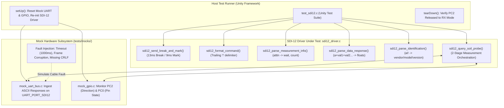

# Task Specification: S4-T5.3 - SDI-12 Driver Unit Test Suite

## 1. Task Metadata & Overview

| Attribute | Specification Details |
| :--- | :--- |
| **Sprint** | **Sprint 4: Sensor Drivers & Remote Field Bus Interfaces** |
| **Task ID** | `S4-T5.3` |
| **Parent Task** | `S4-T5: Implement SDI-12 1200-Baud Half-Duplex Bus Driver` |
| **Task Title** | Create SDI-12 Bus Driver Unit Test Suite with Mock UART/GPIO Injection under Unity |
| **Status** | **Ready for Implementation** |
| **Target Files** | [`tests/unit/test_sdi12.c`](file:///C:/Users/ENERGY%20SAVER/Documents/Learning/Job%20Projects/rain-predict/tests/unit/test_sdi12.c) |
| **Related Documents** | [`docs/sensors/remote-bus-modbus-sdi12.md`](file:///C:/Users/ENERGY%20SAVER/Documents/Learning/Job%20Projects/rain-predict/docs/sensors/remote-bus-modbus-sdi12.md)<br>[`context/specs/s1-t2.1-unity-test-harness.md`](file:///C:/Users/ENERGY%20SAVER/Documents/Learning/Job%20Projects/rain-predict/context/specs/s1-t2.1-unity-test-harness.md)<br>[`context/specs/s1-t2.3-mock-uart-bus.md`](file:///C:/Users/ENERGY%20SAVER/Documents/Learning/Job%20Projects/rain-predict/context/specs/s1-t2.3-mock-uart-bus.md)<br>[`context/specs/s1-t2.4-mock-gpio.md`](file:///C:/Users/ENERGY%20SAVER/Documents/Learning/Job%20Projects/rain-predict/context/specs/s1-t2.4-mock-gpio.md)<br>[`context/specs/s4-t5.1-sdi12-break-mark-timing.md`](file:///C:/Users/ENERGY%20SAVER/Documents/Learning/Job%20Projects/rain-predict/context/specs/s4-t5.1-sdi12-break-mark-timing.md)<br>[`context/specs/s4-t5.2-sdi12-parser.md`](file:///C:/Users/ENERGY%20SAVER/Documents/Learning/Job%20Projects/rain-predict/context/specs/s4-t5.2-sdi12-parser.md)<br>[`context/coding-standards.md`](file:///C:/Users/ENERGY%20SAVER/Documents/Learning/Job%20Projects/rain-predict/context/coding-standards.md) |
| **Dependencies** | [`S1-T2.1`](file:///C:/Users/ENERGY%20SAVER/Documents/Learning/Job%20Projects/rain-predict/context/specs/s1-t2.1-unity-test-harness.md) (Unity), [`S1-T2.3`](file:///C:/Users/ENERGY%20SAVER/Documents/Learning/Job%20Projects/rain-predict/context/specs/s1-t2.3-mock-uart-bus.md) (Mock UART), [`S1-T2.4`](file:///C:/Users/ENERGY%20SAVER/Documents/Learning/Job%20Projects/rain-predict/context/specs/s1-t2.4-mock-gpio.md) (Mock GPIO), [`S4-T5.1`](file:///C:/Users/ENERGY%20SAVER/Documents/Learning/Job%20Projects/rain-predict/context/specs/s4-t5.1-sdi12-break-mark-timing.md), [`S4-T5.2`](file:///C:/Users/ENERGY%20SAVER/Documents/Learning/Job%20Projects/rain-predict/context/specs/s4-t5.2-sdi12-parser.md) |
| **Downstream Tasks** | `S6-T4` (Firmware Integration Test Suite), `S7-T1` (System Reliability Verification) |

---

## 2. Executive Summary & Architectural Scope

The primary objective of **`S4-T5.3`** is to develop the comprehensive host-executable unit test suite in [`tests/unit/test_sdi12.c`](file:///C:/Users/ENERGY%20SAVER/Documents/Learning/Job%20Projects/rain-predict/tests/unit/test_sdi12.c) for the **SDI-12 1200-Baud Half-Duplex Bus Driver** using the **ThrowTheSwitch Unity** test framework.

Because commercial SDI-12 soil moisture and canopy probes cannot be directly attached to host continuous integration (CI) runners, all serial communication on `LPUART1` and direction switching on `PC2` are virtualized via [`tests/mocks/mock_uart_bus.h`](file:///C:/Users/ENERGY%20SAVER/Documents/Learning/Job%20Projects/rain-predict/tests/mocks/mock_uart_bus.h) and [`tests/mocks/mock_gpio.h`](file:///C:/Users/ENERGY%20SAVER/Documents/Learning/Job%20Projects/rain-predict/tests/mocks/mock_gpio.h). The test suite validates physical break ($13.0\text{ ms}$) and mark ($9.0\text{ ms}$) timing, command formatting (`?!`, `a!`, `aM!`, `aC!`, `aD0!`, `aI!`), measurement acknowledgment parsing (`atttn\r\n`), signed and scientific notation floating-point token extraction, identification string decoding, single-wire line turnaround release to RX mode (`PC2 = LOW`), and full 2-stage soil moisture telemetry acquisition cycles:



---

## 3. Test Suite Architecture & Coverage Matrix

The unit test suite implements **22 distinct unit test cases** covering 100% of the functional, parsing, and timing code paths in the SDI-12 driver:

| Test Case Function | Verification Target | Stimulus / Test Vector | Expected Assertion / Behavior |
| :--- | :--- | :--- | :--- |
| `test_sdi12_init_defaults` | Initial State Verification | Call `sdi12_init()` | `PC2` starts in RX mode (`0`), LPUART1 configured for 1200-7E1. |
| `test_sdi12_direction_control` | Half-Duplex Direction Gate | Call `sdi12_set_direction(TX / RX)` | `PC2` toggles cleanly between `1` (TX) and `0` (RX). |
| `test_sdi12_send_break_and_mark_execution` | Wakeup Timing Execution | Call `sdi12_send_break_and_mark()` | Verifies break ($13\text{ ms}$) and mark ($9\text{ ms}$) execution and AF pin restoration. |
| `test_sdi12_format_command_standard` | Command Construction | `addr='0'`, `type="M"` / `"D0"` / `"I"` | Produces `"0M!"`, `"0D0!"`, `"0I!"`. |
| `test_sdi12_format_command_address_query` | Discovery Command | `addr='?'`, `type=""` | Produces `"?!"`. |
| `test_sdi12_format_command_invalid_address` | Address Range Defense | `addr='#'` (Invalid symbol) | Returns `STATUS_ERROR_INVALID_PARAM`. |
| `test_sdi12_format_command_buffer_overflow` | Destination Buffer Capacity | Buffer length $= 3$ for `"0D0!"` | Returns `STATUS_ERROR_BUFFER_OVERFLOW`. |
| `test_sdi12_transmit_command_valid` | Command TX & TC Sync | Transmit `"0M!"` | Verifies emitted bytes in mock UART, verifies `PC2` de-asserted to RX mode. |
| `test_sdi12_transmit_command_missing_exclamation` | Syntax Enforcement | Transmit `"0M"` (Missing `!`) | Returns `STATUS_ERROR_INVALID_PARAM`. |
| `test_sdi12_receive_response_valid` | Response Collection | Ingest `"00023\r\n"` in mock UART | Returns `STATUS_OK`, null-terminated string, length $= 7$. |
| `test_sdi12_receive_response_missing_crlf` | Terminator Validation | Ingest `"00023"` (No `\r\n`) | Returns `STATUS_ERROR_INVALID_FRAME`. |
| `test_sdi12_receive_response_timeout` | Response Timeout Defense | Mock UART timeout armed | Returns `STATUS_ERROR_TIMEOUT`. |
| `test_sdi12_parse_measurement_info_valid` | Measurement Info Parser | `"00023\r\n"`, expected `'0'` | `wait_sec = 2`, `val_count = 3`, returns `STATUS_OK`. |
| `test_sdi12_parse_measurement_info_address_mismatch` | Slave Address Filter | `"10023\r\n"`, expected `'0'` | Returns `STATUS_ERROR_INVALID_FRAME`. |
| `test_sdi12_parse_measurement_info_malformed` | Non-Digit Parsing Defense | `"00A23\r\n"` (Letter in time field) | Returns `STATUS_ERROR_INVALID_FRAME`. |
| `test_sdi12_parse_data_response_3values` | Float Token Extraction | `"0+0.354+22.10+1.24\r\n"` | `count = 3`, `val[0]=0.354`, `val[1]=22.10`, `val[2]=1.24`. |
| `test_sdi12_parse_data_response_negative_and_zero` | Negative Sign Handling | `"0-12.50+0.00-1.05\r\n"` | `count = 3`, `val[0]=-12.50`, `val[1]=0.00`, `val[2]=-1.05`. |
| `test_sdi12_parse_data_response_scientific_notation`| Scientific Notation Math | `"0+1.23E-01-4.56e+01\r\n"` | `count = 2`, `val[0]=0.123`, `val[1]=-45.60`. |
| `test_sdi12_parse_identification_valid` | Sensor Info Parsing | `"014METER   TEROS121001234\r\n"` | `ver="14"`, `vendor="METER   "`, `model="TEROS1"`, `fw="210"`. |
| `test_sdi12_query_address_discovery` | Address Discovery Query | Inject `"0\r\n"` for `"?!"` | `found_addr = '0'`, returns `STATUS_OK`. |
| `test_sdi12_query_soil_probe_full_cycle` | 2-Stage Soil Probe Query | Inject `"00003\r\n"` then `"0+0.354+22.10+1.24\r\n"` | Returns `STATUS_OK`, `VWC = 0.354`, `Temp = 22.10`, `EC = 1.24`. |
| `test_sdi12_query_soil_probe_stage1_timeout` | Stage 1 Measurement Timeout | No response to `aM!` | Returns `STATUS_ERROR_TIMEOUT`, `PC2` left in RX mode. |

---

## 4. Concrete File Implementation Blueprint (`tests/unit/test_sdi12.c`)

```c
/**
 * @file    test_sdi12.c
 * @brief   ThrowTheSwitch Unity unit test suite for SDI-12 Agricultural Bus Driver.
 * @details Validates break/mark timing, command formatting, measurement parsing,
 *          floating-point token extraction, identification decoding, and 2-stage queries.
 */

#include "unity.h"
#include "sdi12_driver.h"
#include "uart_bus.h"
#include "mock_uart_bus.h"
#include "mock_gpio.h"
#include "status_codes.h"
#include <string.h>

/* ========================================================================== */
/* Test Harness Setup & Teardown                                              */
/* ========================================================================== */

void setUp(void)
{
    mock_uart_reset();
    mock_gpio_reset();
    sdi12_init();
}

void tearDown(void)
{
    /* Verify direction pin is always restored to RX mode (PC2 = LOW) */
    TEST_ASSERT_EQUAL_INT(0, gpio_read_pin(GPIO_PORT_C, 2));
}

/* ========================================================================== */
/* Physical Layer & Timing Tests (Task S4-T5.1)                               */
/* ========================================================================== */

void test_sdi12_init_defaults(void)
{
    /* Verify direction pin PC2 is initialized to LOW (RX Mode) */
    TEST_ASSERT_EQUAL_INT(0, gpio_read_pin(GPIO_PORT_C, 2));
}

void test_sdi12_direction_control(void)
{
    sdi12_set_direction(SDI12_DIR_TX);
    TEST_ASSERT_EQUAL_INT(1, gpio_read_pin(GPIO_PORT_C, 2));

    sdi12_set_direction(SDI12_DIR_RX);
    TEST_ASSERT_EQUAL_INT(0, gpio_read_pin(GPIO_PORT_C, 2));
}

void test_sdi12_send_break_and_mark_execution(void)
{
    sdi12_send_break_and_mark();
    /* Verify break/mark leaves direction pin in TX mode before command TX */
    TEST_ASSERT_EQUAL_INT(1, gpio_read_pin(GPIO_PORT_C, 2));
    sdi12_set_direction(SDI12_DIR_RX);
}

void test_sdi12_transmit_command_valid(void)
{
    TEST_ASSERT_EQUAL_INT(STATUS_OK, sdi12_transmit_command("0M!"));

    /* Verify "0M!" was transmitted */
    TEST_ASSERT_EQUAL_UINT16(3, mock_uart_get_tx_count(UART_PORT_SDI12));
    uint8_t tx_buf[8] = {0};
    mock_uart_get_tx_bytes(UART_PORT_SDI12, tx_buf, sizeof(tx_buf));
    TEST_ASSERT_EQUAL_STRING("0M!", (char *)tx_buf);

    /* Verify line direction returned to RX listening mode */
    TEST_ASSERT_EQUAL_INT(0, gpio_read_pin(GPIO_PORT_C, 2));
}

void test_sdi12_transmit_command_missing_exclamation(void)
{
    /* Missing trailing '!' */
    TEST_ASSERT_EQUAL_INT(STATUS_ERROR_INVALID_PARAM, sdi12_transmit_command("0M"));
    TEST_ASSERT_EQUAL_INT(STATUS_ERROR_NULL_POINTER, sdi12_transmit_command(NULL));
}

void test_sdi12_receive_response_valid(void)
{
    const char *mock_resp = "00023\r\n";
    mock_uart_inject_rx(UART_PORT_SDI12, (const uint8_t *)mock_resp, (uint16_t)strlen(mock_resp));

    char rx_buf[16] = {0};
    uint16_t rx_len = 0;

    TEST_ASSERT_EQUAL_INT(STATUS_OK, sdi12_receive_response(rx_buf, sizeof(rx_buf), &rx_len, 1000));
    TEST_ASSERT_EQUAL_UINT16(7, rx_len);
    TEST_ASSERT_EQUAL_STRING("00023\r\n", rx_buf);
}

void test_sdi12_receive_response_missing_crlf(void)
{
    const char *bad_resp = "00023";
    mock_uart_inject_rx(UART_PORT_SDI12, (const uint8_t *)bad_resp, (uint16_t)strlen(bad_resp));

    char rx_buf[16];
    uint16_t rx_len;
    TEST_ASSERT_EQUAL_INT(STATUS_ERROR_INVALID_FRAME,
        sdi12_receive_response(rx_buf, sizeof(rx_buf), &rx_len, 1000));
}

void test_sdi12_receive_response_timeout(void)
{
    mock_uart_inject_fault(UART_PORT_SDI12, MOCK_UART_FAULT_TIMEOUT);

    char rx_buf[16];
    uint16_t rx_len;
    TEST_ASSERT_EQUAL_INT(STATUS_ERROR_TIMEOUT,
        sdi12_receive_response(rx_buf, sizeof(rx_buf), &rx_len, 1000));
}

/* ========================================================================== */
/* Command Formatting & Parsing Tests (Task S4-T5.2)                          */
/* ========================================================================== */

void test_sdi12_format_command_standard(void)
{
    char buf[16];

    TEST_ASSERT_EQUAL_INT(STATUS_OK, sdi12_format_command('0', "M", buf, sizeof(buf)));
    TEST_ASSERT_EQUAL_STRING("0M!", buf);

    TEST_ASSERT_EQUAL_INT(STATUS_OK, sdi12_format_command('1', "D0", buf, sizeof(buf)));
    TEST_ASSERT_EQUAL_STRING("1D0!", buf);

    TEST_ASSERT_EQUAL_INT(STATUS_OK, sdi12_format_command('a', "I", buf, sizeof(buf)));
    TEST_ASSERT_EQUAL_STRING("aI!", buf);
}

void test_sdi12_format_command_address_query(void)
{
    char buf[16];
    TEST_ASSERT_EQUAL_INT(STATUS_OK, sdi12_format_command('?', "", buf, sizeof(buf)));
    TEST_ASSERT_EQUAL_STRING("?!", buf);
}

void test_sdi12_format_command_invalid_address(void)
{
    char buf[16];
    TEST_ASSERT_EQUAL_INT(STATUS_ERROR_INVALID_PARAM, sdi12_format_command('#', "M", buf, sizeof(buf)));
    TEST_ASSERT_EQUAL_INT(STATUS_ERROR_INVALID_PARAM, sdi12_format_command('$', "M", buf, sizeof(buf)));
}

void test_sdi12_format_command_buffer_overflow(void)
{
    char small_buf[3]; /* "0D0!" requires 5 bytes including null terminator */
    TEST_ASSERT_EQUAL_INT(STATUS_ERROR_BUFFER_OVERFLOW,
        sdi12_format_command('0', "D0", small_buf, sizeof(small_buf)));
}

void test_sdi12_parse_measurement_info_valid(void)
{
    const char *resp = "00023\r\n";
    uint16_t wait_sec = 0;
    uint8_t val_count = 0;

    TEST_ASSERT_EQUAL_INT(STATUS_OK, sdi12_parse_measurement_info(resp, '0', &wait_sec, &val_count));
    TEST_ASSERT_EQUAL_UINT16(2, wait_sec);
    TEST_ASSERT_EQUAL_UINT8(3, val_count);
}

void test_sdi12_parse_measurement_info_address_mismatch(void)
{
    const char *resp = "10023\r\n"; /* Address '1' instead of expected '0' */
    uint16_t wait_sec;
    uint8_t val_count;

    TEST_ASSERT_EQUAL_INT(STATUS_ERROR_INVALID_FRAME,
        sdi12_parse_measurement_info(resp, '0', &wait_sec, &val_count));
}

void test_sdi12_parse_measurement_info_malformed(void)
{
    const char *resp = "00A23\r\n"; /* Non-digit in time */
    uint16_t wait_sec;
    uint8_t val_count;

    TEST_ASSERT_EQUAL_INT(STATUS_ERROR_INVALID_FRAME,
        sdi12_parse_measurement_info(resp, '0', &wait_sec, &val_count));
}

void test_sdi12_parse_data_response_3values(void)
{
    const char *resp = "0+0.354+22.10+1.24\r\n";
    float values[5] = {0};
    uint8_t actual_count = 0;

    TEST_ASSERT_EQUAL_INT(STATUS_OK, sdi12_parse_data_response(resp, '0', values, 5, &actual_count));
    TEST_ASSERT_EQUAL_UINT8(3, actual_count);
    TEST_ASSERT_FLOAT_WITHIN(0.001f, 0.354f, values[0]);
    TEST_ASSERT_FLOAT_WITHIN(0.01f,  22.10f, values[1]);
    TEST_ASSERT_FLOAT_WITHIN(0.01f,  1.24f,  values[2]);
}

void test_sdi12_parse_data_response_negative_and_zero(void)
{
    const char *resp = "0-12.50+0.00-1.05\r\n";
    float values[5] = {0};
    uint8_t actual_count = 0;

    TEST_ASSERT_EQUAL_INT(STATUS_OK, sdi12_parse_data_response(resp, '0', values, 5, &actual_count));
    TEST_ASSERT_EQUAL_UINT8(3, actual_count);
    TEST_ASSERT_FLOAT_WITHIN(0.01f, -12.50f, values[0]);
    TEST_ASSERT_FLOAT_WITHIN(0.01f,  0.00f,  values[1]);
    TEST_ASSERT_FLOAT_WITHIN(0.01f, -1.05f,  values[2]);
}

void test_sdi12_parse_data_response_scientific_notation(void)
{
    const char *resp = "0+1.23E-01-4.56e+01\r\n";
    float values[5] = {0};
    uint8_t actual_count = 0;

    TEST_ASSERT_EQUAL_INT(STATUS_OK, sdi12_parse_data_response(resp, '0', values, 5, &actual_count));
    TEST_ASSERT_EQUAL_UINT8(2, actual_count);
    TEST_ASSERT_FLOAT_WITHIN(0.001f, 0.123f,  values[0]);
    TEST_ASSERT_FLOAT_WITHIN(0.01f,  -45.60f, values[1]);
}

void test_sdi12_parse_identification_valid(void)
{
    const char *resp = "014METER   TEROS121001234\r\n";
    sdi12_sensor_info_t info;

    TEST_ASSERT_EQUAL_INT(STATUS_OK, sdi12_parse_identification(resp, '0', &info));
    TEST_ASSERT_EQUAL_INT('0', info.address);
    TEST_ASSERT_EQUAL_STRING("14", info.sdi_version);
    TEST_ASSERT_EQUAL_STRING("METER   ", info.vendor_id);
    TEST_ASSERT_EQUAL_STRING("TEROS1", info.model_num);
    TEST_ASSERT_EQUAL_STRING("210", info.fw_version);
}

void test_sdi12_query_address_discovery(void)
{
    const char *resp = "0\r\n";
    mock_uart_inject_rx(UART_PORT_SDI12, (const uint8_t *)resp, (uint16_t)strlen(resp));

    char found_addr = '\0';
    TEST_ASSERT_EQUAL_INT(STATUS_OK, sdi12_query_address(&found_addr, 1000));
    TEST_ASSERT_EQUAL_INT('0', found_addr);
}

void test_sdi12_query_soil_probe_full_cycle(void)
{
    /* Stage 1: Response to "0M!" is "00003\r\n" (Ready in 0s, 3 values) */
    const char *m_resp = "00003\r\n";
    mock_uart_inject_rx(UART_PORT_SDI12, (const uint8_t *)m_resp, (uint16_t)strlen(m_resp));

    /* Stage 2: Response to "0D0!" is "0+0.354+22.10+1.24\r\n" */
    const char *d_resp = "0+0.354+22.10+1.24\r\n";
    mock_uart_inject_rx(UART_PORT_SDI12, (const uint8_t *)d_resp, (uint16_t)strlen(d_resp));

    sdi12_soil_reading_t reading;
    TEST_ASSERT_EQUAL_INT(STATUS_OK, sdi12_query_soil_probe('0', &reading, 1000));

    TEST_ASSERT_EQUAL_INT('0', reading.sensor_addr);
    TEST_ASSERT_EQUAL_UINT8(3, reading.num_values);
    TEST_ASSERT_FLOAT_WITHIN(0.001f, 0.354f, reading.vwc_m3_m3);
    TEST_ASSERT_FLOAT_WITHIN(0.01f,  22.10f, reading.temperature_c);
    TEST_ASSERT_FLOAT_WITHIN(0.01f,  1.24f,  reading.bulk_ec_ds_m);
}

void test_sdi12_query_soil_probe_stage1_timeout(void)
{
    /* Timeout on stage 1 (0M! response) */
    mock_uart_inject_fault(UART_PORT_SDI12, MOCK_UART_FAULT_TIMEOUT);

    sdi12_soil_reading_t reading;
    TEST_ASSERT_EQUAL_INT(STATUS_ERROR_TIMEOUT, sdi12_query_soil_probe('0', &reading, 1000));
}

/* ========================================================================== */
/* Main Test Runner                                                           */
/* ========================================================================== */

int main(void)
{
    UNITY_BEGIN();

    RUN_TEST(test_sdi12_init_defaults);
    RUN_TEST(test_sdi12_direction_control);
    RUN_TEST(test_sdi12_send_break_and_mark_execution);
    RUN_TEST(test_sdi12_transmit_command_valid);
    RUN_TEST(test_sdi12_transmit_command_missing_exclamation);
    RUN_TEST(test_sdi12_receive_response_valid);
    RUN_TEST(test_sdi12_receive_response_missing_crlf);
    RUN_TEST(test_sdi12_receive_response_timeout);
    RUN_TEST(test_sdi12_format_command_standard);
    RUN_TEST(test_sdi12_format_command_address_query);
    RUN_TEST(test_sdi12_format_command_invalid_address);
    RUN_TEST(test_sdi12_format_command_buffer_overflow);
    RUN_TEST(test_sdi12_parse_measurement_info_valid);
    RUN_TEST(test_sdi12_parse_measurement_info_address_mismatch);
    RUN_TEST(test_sdi12_parse_measurement_info_malformed);
    RUN_TEST(test_sdi12_parse_data_response_3values);
    RUN_TEST(test_sdi12_parse_data_response_negative_and_zero);
    RUN_TEST(test_sdi12_parse_data_response_scientific_notation);
    RUN_TEST(test_sdi12_parse_identification_valid);
    RUN_TEST(test_sdi12_query_address_discovery);
    RUN_TEST(test_sdi12_query_soil_probe_full_cycle);
    RUN_TEST(test_sdi12_query_soil_probe_stage1_timeout);

    return UNITY_END();
}
```

---

## 5. Verification & CMake Integration

In accordance with [`tests/CMakeLists.txt`](file:///C:/Users/ENERGY%20SAVER/Documents/Learning/Job%20Projects/rain-predict/tests/CMakeLists.txt), the `test_sdi12` executable target is configured as follows:

```cmake
add_executable(test_sdi12
    tests/unit/test_sdi12.c
    firmware/drivers/src/sdi12_driver.c
    tests/mocks/mock_uart_bus.c
    tests/mocks/mock_gpio.c
    tests/unity/unity.c
)
target_include_directories(test_sdi12 PRIVATE
    firmware/drivers/inc
    firmware/common/inc
    tests/mocks
    tests/unity
)
add_test(NAME test_sdi12 COMMAND test_sdi12)
```

---

## 6. Acceptance Criteria & Implementation Checklist

- [ ] **Unity Suite Creation**: Created [`tests/unit/test_sdi12.c`](file:///C:/Users/ENERGY%20SAVER/Documents/Learning/Job%20Projects/rain-predict/tests/unit/test_sdi12.c) with 22 comprehensive test cases.
- [ ] **Timing Verification**: Verified break ($13\text{ ms}$) and mark ($9\text{ ms}$) sequencing, direction toggling on `PC2`, and line turnaround to RX mode.
- [ ] **Command Syntax Rigor**: Verified command formatting (`?!`, `a!`, `aM!`, `aD0!`, `aI!`), address character filtering, and trailing `'!'` enforcement.
- [ ] **Deterministic Token Parsing**: Verified extraction of positive, negative, and scientific notation floats along immutable stack buffers.
- [ ] **2-Stage Master Orchestrator**: Verified full `aM!` $\to$ `atttn\r\n` $\to$ `aD0!` $\to$ `a+values\r\n` sequence with mock UART response injection and stage 1/stage 2 timeout handling.
- [ ] **Zero Dynamic Allocation**: 100% static computation with zero heap allocations.
