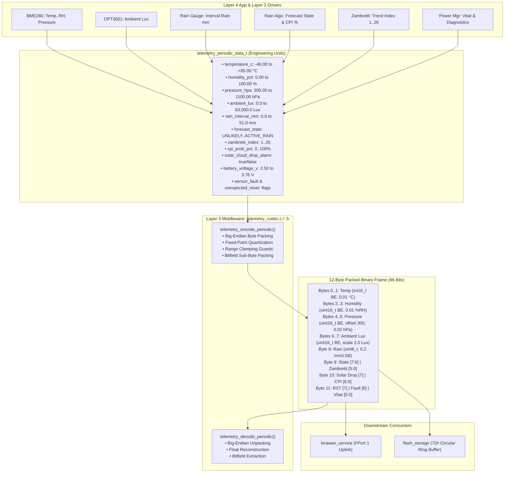

# Task Specification: S5-T1.1 - LoRaWAN 12-Byte Periodic Binary Telemetry Packet Serializer

## 1. Task Metadata & Overview

| Attribute | Specification Details |
| :--- | :--- |
| **Sprint** | **Sprint 5: Telemetry Protocol, LoRaWAN & Flash Storage** |
| **Task ID** | `S5-T1.1` |
| **Parent Task** | `S5-T1: Implement Compact Binary Telemetry Codec` |
| **Task Title** | Implement 12-Byte Periodic Binary Telemetry Packet Serializer & Deserializer (`telemetry_codec`) |
| **Status** | **Ready for Implementation** |
| **Target Files** | [`firmware/middleware/inc/telemetry_codec.h`](file:///C:/Users/ENERGY%20SAVER/Documents/Learning/Job%20Projects/rain-predict/firmware/middleware/inc/telemetry_codec.h)<br>[`firmware/middleware/src/telemetry_codec.c`](file:///C:/Users/ENERGY%20SAVER/Documents/Learning/Job%20Projects/rain-predict/firmware/middleware/src/telemetry_codec.c) |
| **Related Documents** | [`docs/architecture/telemetry-protocol.md`](file:///C:/Users/ENERGY%20SAVER/Documents/Learning/Job%20Projects/rain-predict/docs/architecture/telemetry-protocol.md)<br>[`docs/architecture/firmware-architecture.md`](file:///C:/Users/ENERGY%20SAVER/Documents/Learning/Job%20Projects/rain-predict/docs/architecture/firmware-architecture.md)<br>[`docs/sensors/bme280-integration.md`](file:///C:/Users/ENERGY%20SAVER/Documents/Learning/Job%20Projects/rain-predict/docs/sensors/bme280-integration.md)<br>[`docs/sensors/opt3001-solar-irradiance.md`](file:///C:/Users/ENERGY%20SAVER/Documents/Learning/Job%20Projects/rain-predict/docs/sensors/opt3001-solar-irradiance.md)<br>[`docs/sensors/rain-gauge-pulse.md`](file:///C:/Users/ENERGY%20SAVER/Documents/Learning/Job%20Projects/rain-predict/docs/sensors/rain-gauge-pulse.md)<br>[`docs/algorithms/trend-detection-and-nowcasting.md`](file:///C:/Users/ENERGY%20SAVER/Documents/Learning/Job%20Projects/rain-predict/docs/algorithms/trend-detection-and-nowcasting.md)<br>[`docs/algorithms/zambretti-algorithm.md`](file:///C:/Users/ENERGY%20SAVER/Documents/Learning/Job%20Projects/rain-predict/docs/algorithms/zambretti-algorithm.md)<br>[`docs/hardware/power-supply-and-solar.md`](file:///C:/Users/ENERGY%20SAVER/Documents/Learning/Job%20Projects/rain-predict/docs/hardware/power-supply-and-solar.md)<br>[`context/coding-standards.md`](file:///C:/Users/ENERGY%20SAVER/Documents/Learning/Job%20Projects/rain-predict/context/coding-standards.md) |
| **Dependencies** | [`S1-T1.1`](file:///C:/Users/ENERGY%20SAVER/Documents/Learning/Job%20Projects/rain-predict/context/specs/s1-t1.1-root-cmake.md) (Root CMake & Base Status Codes) |
| **Downstream Tasks** | `S5-T1.2` (Urgent Alert Packet Serializer), `S5-T1.3` (Telemetry Codec Unit Tests), `S5-T2.1` (ChirpStack Codec), `S5-T2.2` (TTN Decoder), `S5-T3.1` (Flash Storage Ring Buffer), `S5-T4.1` (LoRaWAN Uplink Service), `S6-T3.1` (Main App State Machine) |

---

## 2. Executive Summary & Architectural Scope

The primary objective of **`S5-T1.1`** is to develop the **12-Byte Periodic Binary Telemetry Serializer and Deserializer** within Layer 3 Middleware ([`firmware/middleware/inc/telemetry_codec.h`](file:///C:/Users/ENERGY%20SAVER/Documents/Learning/Job%20Projects/rain-predict/firmware/middleware/inc/telemetry_codec.h) and [`firmware/middleware/src/telemetry_codec.c`](file:///C:/Users/ENERGY%20SAVER/Documents/Learning/Job%20Projects/rain-predict/firmware/middleware/src/telemetry_codec.c)) targeting the **STMicroelectronics STM32WLE5** Sub-GHz SoC.

In remote tea estate deployments (e.g., Nilgiris, Assam, Nuwara Eliya, Kericho), power autonomy is paramount. Standard human-readable serialization formats (JSON, CSV, Protobuf, ASCII) generate payloads exceeding $120\text{--}200\text{ bytes}$, which would result in unacceptable Time-on-Air (ToA $> 350\text{ ms}$ at SF7/125kHz), violating regional Sub-GHz ISM duty-cycle restrictions ($< 1\%$) and draining the 2500mAh $\text{LiFePO}_4$ battery pack prematurely.

The `telemetry_codec` module packs 8 distinct physical meteorological readings, nowcast alert states, heuristic indices, solar cloud attenuation alarms, and battery diagnostics into a fixed **12-byte ($96\text{-bit}$)** big-endian binary frame.



### Core Design Principles:

1. **Fixed-Size Deterministic Layout**: Exactly 12 bytes ($96\text{ bits}$). No variable-length fields, ensuring predictable flash page alignment and deterministic LoRaWAN transmission time ($< 45\text{ ms}$ at SF7).
2. **Explicit Fixed-Point Quantization**: Float variables are scaled to integer representation using exact physical steps ($0.01^\circ\text{C}$, $0.01\%$, $0.02\text{ hPa}$, $2.0\text{ Lux}$, $0.2\text{ mm}$, $20\text{ mV}$).
3. **Network Byte Order (Big-Endian)**: All multi-byte integers are explicitly serialized MSB-first (`buf[0] = MSB, buf[1] = LSB`), eliminating host architecture endianness dependencies.
4. **Defensive Range Clamping**: Every input value is clamped to its valid physical bounds before packing to eliminate integer overflow/underflow clipping bugs.
5. **Zero Dynamic Allocation**: 100% stack-allocated structures and buffers (`malloc` / `free` strictly prohibited).
6. **Bidirectional Codec**: Both serialization (`encode`) and deserialization (`decode`) are implemented and tested on-chip to support flash record replay, offline data logging, and diagnostic self-testing.

---

## 3. 12-Byte Uplink Payload Structure & Bitfield Specifications

In accordance with [`docs/architecture/telemetry-protocol.md`](file:///C:/Users/ENERGY%20SAVER/Documents/Learning/Job%20Projects/rain-predict/docs/architecture/telemetry-protocol.md), periodic environmental telemetry is transmitted on **LoRaWAN FPort 1** (and mirrored on **FPort 2** during storm alerts):

### 3.1 Byte Map Overview

```
Byte 0      Byte 1      Byte 2      Byte 3      Byte 4      Byte 5
┌───────────┬───────────┬───────────┬───────────┬───────────┬───────────┐
│ Temperature (int16_t) │  Humidity (uint16_t)  │  Pressure (uint16_t)  │
│  Scale: 0.01 °C       │  Scale: 0.01 %RH      │  Offset: 300, 0.02 hPa│
└───────────┴───────────┴───────────┴───────────┴───────────┴───────────┘

Byte 6      Byte 7      Byte 8      Byte 9      Byte 10     Byte 11
┌───────────┬───────────┬───────────┬───────────┬───────────┬───────────┐
│ Ambient Lux (uint16_t)│ Rain (u8) │State & Zam│ CPI & Drop│Bat & Flags│
│  Scale: 2.0 Lux       │ 0.2 mm/LSB│ Bitfield  │ Bitfield  │ Bitfield  │
└───────────┴───────────┴───────────┴───────────┴───────────┴───────────┘
```

---

### 3.2 Field-by-Field Serialization Rules

| Byte Offset | Field Name | Data Type | Physical Range | Resolution / Step | Offset | Serialization Formula | Clamping Boundaries |
| :---: | :--- | :---: | :---: | :---: | :---: | :--- | :--- |
| **0–1** | **Temperature ($T$)** | Signed 16-bit (`int16_t` BE) | $-40.00^\circ\text{C} \dots +85.00^\circ\text{C}$ | $0.01^\circ\text{C}$ | $0.0^\circ\text{C}$ | $\text{raw} = (\text{int16\_t})\text{round}(T \times 100.0\text{f})$ | $[-4000, +8500]$ |
| **2–3** | **Relative Humidity ($RH$)** | Unsigned 16-bit (`uint16_t` BE) | $0.00\% \dots 100.00\%$ | $0.01\%$ | $0.0\%$ | $\text{raw} = (\text{uint16\_t})\text{round}(RH \times 100.0\text{f})$ | $[0, 10000]$ |
| **4–5** | **Barometric Pressure ($P$)** | Unsigned 16-bit (`uint16_t` BE) | $300.00 \dots 1100.00\text{ hPa}$ | $0.02\text{ hPa}$ | $300.0\text{ hPa}$ | $\text{raw} = (\text{uint16\_t})\text{round}\left(\frac{P - 300.0\text{f}}{0.02\text{f}}\right)$ | $[0, 40000]$ |
| **6–7** | **Ambient Solar Lux ($Lux$)** | Unsigned 16-bit (`uint16_t` BE) | $0.0 \dots 83,000.0\text{ Lux}$ | $2.0\text{ Lux}$ | $0.0\text{ Lux}$ | $\text{raw} = (\text{uint16\_t})\text{round}\left(\frac{Lux}{2.0\text{f}}\right)$ | $[0, 41500]$ |
| **8** | **Interval Rainfall ($R_{\text{int}}$)** | Unsigned 8-bit (`uint8_t`) | $0.0 \dots 51.0\text{ mm}$ | $0.2\text{ mm}$ | $0.0\text{ mm}$ | $\text{raw} = (\text{uint8\_t})\text{round}\left(\frac{R_{\text{int}}}{0.2\text{f}}\right)$ | $[0, 255]$ |
| **9** | **Forecast State & Zambretti** | Bitfield (1 Byte) | See Sec 3.3 | — | — | `((state & 0x03) << 6) | (zambretti & 0x3F)` | State: $[0, 3]$, Zam: $[1, 26]$ |
| **10** | **CPI & Solar Alarm** | Bitfield (1 Byte) | See Sec 3.4 | — | — | `((solar_drop << 7) | (cpi & 0x7F))` | Solar: $[0, 1]$, CPI: $[0, 100]$ |
| **11** | **Battery Voltage & Diagnostics** | Bitfield (1 Byte) | See Sec 3.5 | $20\text{ mV}$ | $2.50\text{ V}$ | `((rst << 7) | (fault << 6) | (vbat_raw & 0x3F))` | $V_{\text{bat\_raw}} \in [0, 63]$ ($2.50\text{--}3.76\text{ V}$) |

---

### 3.3 Sub-Byte Bitfield Layout: Byte 9 (Forecast State & Zambretti)

```
  Bit 7      Bit 6      Bit 5      Bit 4      Bit 3      Bit 2      Bit 1      Bit 0
┌──────────────────────┬────────────────────────────────────────────────────────────┐
│ Forecast State [1:0] │              Zambretti Index [5:0] (1..26)                 │
└──────────────────────┴────────────────────────────────────────────────────────────┘
```

* **Bits [7:6] — Forecast State (`2 bits`)**:
  * `00` (`0`): `RAIN_STATE_UNLIKELY` ($CPI < 30\%$)
  * `01` (`1`): `RAIN_STATE_POSSIBLE` ($30\% \le CPI < 60\%$)
  * `10` (`2`): `RAIN_STATE_IMMINENT` ($CPI \ge 60\%$)
  * `11` (`3`): `RAIN_STATE_ACTIVE_RAIN` (Physical bucket tips detected)
* **Bits [5:0] — Zambretti Index (`6 bits`)**:
  * Range: $1 \dots 26$ (representing forecast letters 'A' through 'Z').
  * Mask: `0x3F`. Clamped to $[1, 26]$.

---

### 3.4 Sub-Byte Bitfield Layout: Byte 10 (CPI & Solar Drop Alarm)

```
  Bit 7      Bit 6      Bit 5      Bit 4      Bit 3      Bit 2      Bit 1      Bit 0
┌──────────┬────────────────────────────────────────────────────────────────────────┐
│Solar Drop│            Composite Precipitation Index (CPI) [6:0] (0..100%)         │
└──────────┴────────────────────────────────────────────────────────────────────────┘
```

* **Bit [7] — Solar Cloud Drop Alarm (`1 bit`)**:
  * `0`: Normal daylight curve or night condition.
  * `1`: Sudden severe convective cloud attenuation ($> 50\%$ drop within $30\text{ min}$ during daylight).
* **Bits [6:0] — Composite Precipitation Index (CPI) (`7 bits`)**:
  * Range: $0 \dots 100\%$ (Integer rain probability percentage).
  * Mask: `0x7F`. Clamped to $[0, 100]$.

---

### 3.5 Sub-Byte Bitfield Layout: Byte 11 (Battery Level & Diagnostics)

```
  Bit 7      Bit 6      Bit 5      Bit 4      Bit 3      Bit 2      Bit 1      Bit 0
┌──────────┬──────────┬─────────────────────────────────────────────────────────────┐
│ RST Flag │Sensor Err│   Battery Voltage V_bat [5:0] (2.50V to 3.76V, Step: 20mV)  │
└──────────┴──────────┴─────────────────────────────────────────────────────────────┘
```

* **Bit [7] — Reset Indicator Flag (`1 bit`)**:
  * `0`: Normal low-power RTC wakeup.
  * `1`: Hardware/Watchdog reset occurred (IWDG, BOR, Software Reset pin).
* **Bit [6] — Sensor Fault Flag (`1 bit`)**:
  * `0`: All sensor buses and CRC checks nominal.
  * `1`: Sensor communication failure (I2C NACK, bus lockup, Modbus timeout).
* **Bits [5:0] — Battery Voltage $V_{\text{bat}}$ (`6 bits`)**:
  * Step: $20\text{ mV}$ ($0.020\text{ V}$) per count. Offset: $2.50\text{ V}$.
  * $V_{\text{bat}} = 2.50\text{ V} + (\text{raw\_code} \times 0.020\text{ V})$
  * Raw range: $0 \dots 63 \implies 2.500\text{ V} \dots 3.760\text{ V}$.
  * Examples:
    * $V_{\text{bat}} = 2.50\text{ V} \implies \text{raw} = 0$
    * $V_{\text{bat}} = 3.20\text{ V} \implies \text{raw} = (3.20 - 2.50) / 0.020 = 35$
    * $V_{\text{bat}} = 3.30\text{ V} \implies \text{raw} = (3.30 - 2.50) / 0.020 = 40$
    * $V_{\text{bat}} \ge 3.76\text{ V} \implies \text{raw} = 63$

---

## 4. Public API & Data Structures (`telemetry_codec.h`)

### 4.1 Header Definitions & Enumerations

```c
/**
 * @file    telemetry_codec.h
 * @brief   LoRaWAN binary telemetry encoder and decoder for STM32WLE5 SoC.
 * @details Packs physical meteorological parameters into a deterministic 12-byte payload.
 */

#ifndef TELEMETRY_CODEC_H
#define TELEMETRY_CODEC_H

#include <stdint.h>
#include <stdbool.h>
#include <stddef.h>
#include "status_codes.h"

#ifdef __cplusplus
extern "C" {
#endif

/* ========================================================================== */
/* Protocol Constants & Port Allocations                                      */
/* ========================================================================== */

/** @brief Fixed length of periodic telemetry payload in bytes */
#define TELEMETRY_PERIODIC_PAYLOAD_SIZE     12U

/** @brief LoRaWAN Application Port for scheduled periodic telemetry */
#define TELEMETRY_FPORT_PERIODIC            1U

/** @brief LoRaWAN Application Port for emergency storm warning uplinks */
#define TELEMETRY_FPORT_ALERT               2U

/** @brief LoRaWAN Application Port for downlink node configuration */
#define TELEMETRY_FPORT_CONFIG              10U

/* ========================================================================== */
/* Physical Scaling, Resolution & Offset Constants                            */
/* ========================================================================== */

#define TELEMETRY_TEMP_SCALE                100.0f      /**< 0.01 °C per LSB */
#define TELEMETRY_TEMP_MIN_C                (-40.0f)    /**< -40.00 °C */
#define TELEMETRY_TEMP_MAX_C                85.0f       /**< +85.00 °C */

#define TELEMETRY_HUM_SCALE                 100.0f      /**< 0.01 %RH per LSB */
#define TELEMETRY_HUM_MIN_PCT               0.0f        /**< 0.00 %RH */
#define TELEMETRY_HUM_MAX_PCT               100.0f      /**< 100.00 %RH */

#define TELEMETRY_PRESS_OFFSET_HPA          300.0f      /**< 300.00 hPa base */
#define TELEMETRY_PRESS_STEP_HPA            0.02f       /**< 0.02 hPa per LSB */
#define TELEMETRY_PRESS_MIN_HPA             300.0f      /**< 300.00 hPa */
#define TELEMETRY_PRESS_MAX_HPA             1100.0f     /**< 1100.00 hPa */

#define TELEMETRY_LUX_STEP                  2.0f        /**< 2.0 Lux per LSB */
#define TELEMETRY_LUX_MIN                   0.0f        /**< 0.0 Lux */
#define TELEMETRY_LUX_MAX                   83000.0f    /**< 83,000.0 Lux */

#define TELEMETRY_RAIN_STEP_MM              0.2f        /**< 0.20 mm per LSB */
#define TELEMETRY_RAIN_MIN_MM               0.0f        /**< 0.0 mm */
#define TELEMETRY_RAIN_MAX_MM               51.0f       /**< 51.0 mm (255 * 0.2) */

#define TELEMETRY_VBAT_OFFSET_V             2.50f       /**< 2.500 V base */
#define TELEMETRY_VBAT_STEP_V               0.020f      /**< 0.020 V (20 mV) per LSB */
#define TELEMETRY_VBAT_MIN_V                2.50f       /**< 2.500 V */
#define TELEMETRY_VBAT_MAX_V                3.76f       /**< 3.760 V (2.50 + 63 * 0.02) */

#define TELEMETRY_ZAMBRETTI_MIN             1U          /**< Zambretti 'A' */
#define TELEMETRY_ZAMBRETTI_MAX             26U         /**< Zambretti 'Z' */

#define TELEMETRY_CPI_MAX_PCT               100U        /**< 100% Probability */

/* ========================================================================== */
/* Data Structures & Typedefs                                                 */
/* ========================================================================== */

/**
 * @brief Nowcast rain alert operational state classification.
 */
typedef enum {
    RAIN_ALERT_UNLIKELY    = 0U,    /**< 00: Rain unlikely (CPI < 30%) */
    RAIN_ALERT_POSSIBLE    = 1U,    /**< 01: Rain possible (30% <= CPI < 60%) */
    RAIN_ALERT_IMMINENT    = 2U,    /**< 10: Rain imminent (CPI >= 60%) */
    RAIN_ALERT_ACTIVE_RAIN = 3U     /**< 11: Physical rainfall in progress */
} telemetry_rain_state_t;

/**
 * @brief Unpacked periodic telemetry structure representing physical engineering units.
 */
typedef struct {
    float                  temperature_c;          /**< Ambient temperature in °C [-40.00 .. +85.00] */
    float                  humidity_pct;           /**< Relative humidity in %RH [0.00 .. 100.00] */
    float                  pressure_hpa;           /**< Barometric pressure in hPa [300.00 .. 1100.00] */
    float                  ambient_lux;            /**< Ambient illuminance in Lux [0.0 .. 83000.0] */
    float                  rain_interval_mm;       /**< Rainfall accumulated in interval in mm [0.0 .. 51.0] */
    telemetry_rain_state_t forecast_state;         /**< Operational nowcast state */
    uint8_t                zambretti_index;        /**< Zambretti heuristic index [1 .. 26] */
    uint8_t                cpi_prob_pct;           /**< Composite Precipitation Index probability [0 .. 100%] */
    bool                   solar_cloud_drop_alarm; /**< Convective cloud attenuation trigger flag */
    float                  battery_voltage_v;      /**< Battery terminal voltage in Volts [2.50 .. 3.76] */
    bool                   sensor_fault;           /**< True if sensor bus communication error detected */
    bool                   unexpected_reset;       /**< True if MCU underwent watchdog/brownout/hardware reset */
} telemetry_periodic_data_t;

/* ========================================================================== */
/* Function Prototypes                                                        */
/* ========================================================================== */

/**
 * @brief  Serializes periodic environmental and diagnostic data into a 12-byte LoRaWAN binary payload.
 * @param[in]  data        Pointer to source telemetry data structure with engineering units.
 * @param[out] buffer      Pointer to destination byte array to store serialized payload.
 * @param[in]  buffer_size Size of destination buffer in bytes (must be >= 12).
 * @param[out] encoded_len Pointer to store exact number of bytes written (will be 12).
 * @return STATUS_OK on success, STATUS_ERROR_NULL_POINTER if any pointer is NULL,
 *         or STATUS_ERROR_BUFFER_TOO_SMALL if buffer_size < 12.
 */
status_t telemetry_encode_periodic(const telemetry_periodic_data_t *data,
                                  uint8_t *buffer,
                                  size_t buffer_size,
                                  size_t *encoded_len);

/**
 * @brief  Deserializes a 12-byte LoRaWAN binary payload into physical engineering units.
 * @param[in]  buffer      Pointer to raw 12-byte binary payload buffer.
 * @param[in]  buffer_size Size of raw payload buffer in bytes (must be >= 12).
 * @param[out] data        Pointer to destination telemetry data structure to populate.
 * @return STATUS_OK on success, STATUS_ERROR_NULL_POINTER if any pointer is NULL,
 *         or STATUS_ERROR_INVALID_PARAM if buffer_size < 12.
 */
status_t telemetry_decode_periodic(const uint8_t *buffer,
                                  size_t buffer_size,
                                  telemetry_periodic_data_t *data);

#ifdef __cplusplus
}
#endif

#endif /* TELEMETRY_CODEC_H */
```

---

## 5. Concrete File Implementation Blueprint

### 5.1 `firmware/middleware/inc/telemetry_codec.h` Blueprint

```c
/**
 * @file    telemetry_codec.h
 * @brief   LoRaWAN binary telemetry encoder and decoder header for STM32WLE5 SoC.
 * @details Fixed-point quantization, bitfield packing, and big-endian network serialization.
 */

#ifndef TELEMETRY_CODEC_H
#define TELEMETRY_CODEC_H

#include <stdint.h>
#include <stdbool.h>
#include <stddef.h>
#include "status_codes.h"

#ifdef __cplusplus
extern "C" {
#endif

#define TELEMETRY_PERIODIC_PAYLOAD_SIZE     12U
#define TELEMETRY_FPORT_PERIODIC            1U
#define TELEMETRY_FPORT_ALERT               2U
#define TELEMETRY_FPORT_CONFIG              10U

#define TELEMETRY_TEMP_SCALE                100.0f
#define TELEMETRY_TEMP_MIN_C                (-40.0f)
#define TELEMETRY_TEMP_MAX_C                85.0f

#define TELEMETRY_HUM_SCALE                 100.0f
#define TELEMETRY_HUM_MIN_PCT               0.0f
#define TELEMETRY_HUM_MAX_PCT               100.0f

#define TELEMETRY_PRESS_OFFSET_HPA          300.0f
#define TELEMETRY_PRESS_STEP_HPA            0.02f
#define TELEMETRY_PRESS_MIN_HPA             300.0f
#define TELEMETRY_PRESS_MAX_HPA             1100.0f

#define TELEMETRY_LUX_STEP                  2.0f
#define TELEMETRY_LUX_MIN                   0.0f
#define TELEMETRY_LUX_MAX                   83000.0f

#define TELEMETRY_RAIN_STEP_MM              0.2f
#define TELEMETRY_RAIN_MIN_MM               0.0f
#define TELEMETRY_RAIN_MAX_MM               51.0f

#define TELEMETRY_VBAT_OFFSET_V             2.50f
#define TELEMETRY_VBAT_STEP_V               0.020f
#define TELEMETRY_VBAT_MIN_V                2.50f
#define TELEMETRY_VBAT_MAX_V                3.76f

#define TELEMETRY_ZAMBRETTI_MIN             1U
#define TELEMETRY_ZAMBRETTI_MAX             26U
#define TELEMETRY_CPI_MAX_PCT               100U

typedef enum {
    RAIN_ALERT_UNLIKELY    = 0U,
    RAIN_ALERT_POSSIBLE    = 1U,
    RAIN_ALERT_IMMINENT    = 2U,
    RAIN_ALERT_ACTIVE_RAIN = 3U
} telemetry_rain_state_t;

typedef struct {
    float                  temperature_c;
    float                  humidity_pct;
    float                  pressure_hpa;
    float                  ambient_lux;
    float                  rain_interval_mm;
    telemetry_rain_state_t forecast_state;
    uint8_t                zambretti_index;
    uint8_t                cpi_prob_pct;
    bool                   solar_cloud_drop_alarm;
    float                  battery_voltage_v;
    bool                   sensor_fault;
    bool                   unexpected_reset;
} telemetry_periodic_data_t;

status_t telemetry_encode_periodic(const telemetry_periodic_data_t *data,
                                  uint8_t *buffer,
                                  size_t buffer_size,
                                  size_t *encoded_len);

status_t telemetry_decode_periodic(const uint8_t *buffer,
                                  size_t buffer_size,
                                  telemetry_periodic_data_t *data);

#ifdef __cplusplus
}
#endif

#endif /* TELEMETRY_CODEC_H */
```

---

### 5.2 `firmware/middleware/src/telemetry_codec.c` Blueprint

```c
/**
 * @file    telemetry_codec.c
 * @brief   LoRaWAN binary telemetry encoder and decoder implementation for STM32WLE5 SoC.
 */

#include "telemetry_codec.h"
#include <math.h>
#include <string.h>

/* ========================================================================== */
/* Static Helper Functions (Defensive Range Clamping)                         */
/* ========================================================================== */

static inline float clamp_float(float val, float min_val, float max_val) {
    if (val < min_val) {
        return min_val;
    }
    if (val > max_val) {
        return max_val;
    }
    return val;
}

static inline uint32_t clamp_u32(uint32_t val, uint32_t min_val, uint32_t max_val) {
    if (val < min_val) {
        return min_val;
    }
    if (val > max_val) {
        return max_val;
    }
    return val;
}

/* ========================================================================== */
/* Public Codec Implementation                                                */
/* ========================================================================== */

status_t telemetry_encode_periodic(const telemetry_periodic_data_t *data,
                                  uint8_t *buffer,
                                  size_t buffer_size,
                                  size_t *encoded_len) {
    if (data == NULL || buffer == NULL || encoded_len == NULL) {
        return STATUS_ERROR_NULL_POINTER;
    }

    if (buffer_size < TELEMETRY_PERIODIC_PAYLOAD_SIZE) {
        return STATUS_ERROR_BUFFER_TOO_SMALL;
    }

    /* Zero destination buffer before serialization */
    memset(buffer, 0, TELEMETRY_PERIODIC_PAYLOAD_SIZE);

    /* ---------------------------------------------------------------------- */
    /* Bytes 0..1: Temperature (Signed 16-bit BE, 0.01 °C)                    */
    /* ---------------------------------------------------------------------- */
    float temp_clamped = clamp_float(data->temperature_c, TELEMETRY_TEMP_MIN_C, TELEMETRY_TEMP_MAX_C);
    int32_t raw_temp_32 = (int32_t)lroundf(temp_clamped * TELEMETRY_TEMP_SCALE);
    int16_t raw_temp = (int16_t)raw_temp_32;

    buffer[0] = (uint8_t)(((uint16_t)raw_temp >> 8) & 0xFFU);
    buffer[1] = (uint8_t)((uint16_t)raw_temp & 0xFFU);

    /* ---------------------------------------------------------------------- */
    /* Bytes 2..3: Relative Humidity (Unsigned 16-bit BE, 0.01 %RH)           */
    /* ---------------------------------------------------------------------- */
    float hum_clamped = clamp_float(data->humidity_pct, TELEMETRY_HUM_MIN_PCT, TELEMETRY_HUM_MAX_PCT);
    uint32_t raw_hum_32 = (uint32_t)lroundf(hum_clamped * TELEMETRY_HUM_SCALE);
    uint16_t raw_hum = (uint16_t)clamp_u32(raw_hum_32, 0U, 10000U);

    buffer[2] = (uint8_t)((raw_hum >> 8) & 0xFFU);
    buffer[3] = (uint8_t)(raw_hum & 0xFFU);

    /* ---------------------------------------------------------------------- */
    /* Bytes 4..5: Barometric Pressure (Unsigned 16-bit BE, Offset 300, 0.02) */
    /* ---------------------------------------------------------------------- */
    float press_clamped = clamp_float(data->pressure_hpa, TELEMETRY_PRESS_MIN_HPA, TELEMETRY_PRESS_MAX_HPA);
    uint32_t raw_press_32 = (uint32_t)lroundf((press_clamped - TELEMETRY_PRESS_OFFSET_HPA) / TELEMETRY_PRESS_STEP_HPA);
    uint16_t raw_press = (uint16_t)clamp_u32(raw_press_32, 0U, 40000U);

    buffer[4] = (uint8_t)((raw_press >> 8) & 0xFFU);
    buffer[5] = (uint8_t)(raw_press & 0xFFU);

    /* ---------------------------------------------------------------------- */
    /* Bytes 6..7: Ambient Lux (Unsigned 16-bit BE, Scale 2.0 Lux)            */
    /* ---------------------------------------------------------------------- */
    float lux_clamped = clamp_float(data->ambient_lux, TELEMETRY_LUX_MIN, TELEMETRY_LUX_MAX);
    uint32_t raw_lux_32 = (uint32_t)lroundf(lux_clamped / TELEMETRY_LUX_STEP);
    uint16_t raw_lux = (uint16_t)clamp_u32(raw_lux_32, 0U, 41500U);

    buffer[6] = (uint8_t)((raw_lux >> 8) & 0xFFU);
    buffer[7] = (uint8_t)(raw_lux & 0xFFU);

    /* ---------------------------------------------------------------------- */
    /* Byte 8: Interval Accumulated Rain (Unsigned 8-bit, Scale 0.2 mm)       */
    /* ---------------------------------------------------------------------- */
    float rain_clamped = clamp_float(data->rain_interval_mm, TELEMETRY_RAIN_MIN_MM, TELEMETRY_RAIN_MAX_MM);
    uint32_t raw_rain_32 = (uint32_t)lroundf(rain_clamped / TELEMETRY_RAIN_STEP_MM);
    uint8_t raw_rain = (uint8_t)clamp_u32(raw_rain_32, 0U, 255U);

    buffer[8] = raw_rain;

    /* ---------------------------------------------------------------------- */
    /* Byte 9: Forecast State [7:6] & Zambretti Index [5:0]                   */
    /* ---------------------------------------------------------------------- */
    uint8_t state_bits = (uint8_t)((uint8_t)data->forecast_state & 0x03U);
    uint8_t zambretti_clamped = (uint8_t)clamp_u32((uint32_t)data->zambretti_index,
                                                   (uint32_t)TELEMETRY_ZAMBRETTI_MIN,
                                                   (uint32_t)TELEMETRY_ZAMBRETTI_MAX);
    buffer[9] = (uint8_t)((state_bits << 6) | (zambretti_clamped & 0x3FU));

    /* ---------------------------------------------------------------------- */
    /* Byte 10: Solar Drop Flag [7] & CPI Probability [6:0]                   */
    /* ---------------------------------------------------------------------- */
    uint8_t solar_flag = data->solar_cloud_drop_alarm ? 0x80U : 0x00U;
    uint8_t cpi_clamped = (uint8_t)clamp_u32((uint32_t)data->cpi_prob_pct, 0U, (uint32_t)TELEMETRY_CPI_MAX_PCT);
    buffer[10] = (uint8_t)(solar_flag | (cpi_clamped & 0x7FU));

    /* ---------------------------------------------------------------------- */
    /* Byte 11: Reset Flag [7], Sensor Fault [6], Battery Vbat [5:0] (20mV)   */
    /* ---------------------------------------------------------------------- */
    uint8_t rst_flag = data->unexpected_reset ? 0x80U : 0x00U;
    uint8_t fault_flag = data->sensor_fault ? 0x40U : 0x00U;

    float vbat_clamped = clamp_float(data->battery_voltage_v, TELEMETRY_VBAT_MIN_V, TELEMETRY_VBAT_MAX_V);
    uint32_t raw_vbat_32 = (uint32_t)lroundf((vbat_clamped - TELEMETRY_VBAT_OFFSET_V) / TELEMETRY_VBAT_STEP_V);
    uint8_t raw_vbat = (uint8_t)clamp_u32(raw_vbat_32, 0U, 63U);

    buffer[11] = (uint8_t)(rst_flag | fault_flag | (raw_vbat & 0x3FU));

    *encoded_len = TELEMETRY_PERIODIC_PAYLOAD_SIZE;
    return STATUS_OK;
}

status_t telemetry_decode_periodic(const uint8_t *buffer,
                                  size_t buffer_size,
                                  telemetry_periodic_data_t *data) {
    if (buffer == NULL || data == NULL) {
        return STATUS_ERROR_NULL_POINTER;
    }

    if (buffer_size < TELEMETRY_PERIODIC_PAYLOAD_SIZE) {
        return STATUS_ERROR_INVALID_PARAM;
    }

    memset(data, 0, sizeof(telemetry_periodic_data_t));

    /* ---------------------------------------------------------------------- */
    /* Bytes 0..1: Temperature (Signed 16-bit BE, 0.01 °C)                    */
    /* ---------------------------------------------------------------------- */
    uint16_t u16_temp = (uint16_t)(((uint16_t)buffer[0] << 8) | (uint16_t)buffer[1]);
    int16_t raw_temp = (int16_t)u16_temp;
    data->temperature_c = (float)raw_temp / TELEMETRY_TEMP_SCALE;

    /* ---------------------------------------------------------------------- */
    /* Bytes 2..3: Relative Humidity (Unsigned 16-bit BE, 0.01 %RH)           */
    /* ---------------------------------------------------------------------- */
    uint16_t raw_hum = (uint16_t)(((uint16_t)buffer[2] << 8) | (uint16_t)buffer[3]);
    data->humidity_pct = (float)raw_hum / TELEMETRY_HUM_SCALE;

    /* ---------------------------------------------------------------------- */
    /* Bytes 4..5: Barometric Pressure (Unsigned 16-bit BE, Offset 300, 0.02) */
    /* ---------------------------------------------------------------------- */
    uint16_t raw_press = (uint16_t)(((uint16_t)buffer[4] << 8) | (uint16_t)buffer[5]);
    data->pressure_hpa = TELEMETRY_PRESS_OFFSET_HPA + ((float)raw_press * TELEMETRY_PRESS_STEP_HPA);

    /* ---------------------------------------------------------------------- */
    /* Bytes 6..7: Ambient Lux (Unsigned 16-bit BE, Scale 2.0 Lux)            */
    /* ---------------------------------------------------------------------- */
    uint16_t raw_lux = (uint16_t)(((uint16_t)buffer[6] << 8) | (uint16_t)buffer[7]);
    data->ambient_lux = (float)raw_lux * TELEMETRY_LUX_STEP;

    /* ---------------------------------------------------------------------- */
    /* Byte 8: Interval Accumulated Rain (Unsigned 8-bit, Scale 0.2 mm)       */
    /* ---------------------------------------------------------------------- */
    uint8_t raw_rain = buffer[8];
    data->rain_interval_mm = (float)raw_rain * TELEMETRY_RAIN_STEP_MM;

    /* ---------------------------------------------------------------------- */
    /* Byte 9: Forecast State [7:6] & Zambretti Index [5:0]                   */
    /* ---------------------------------------------------------------------- */
    uint8_t state_code = (uint8_t)((buffer[9] >> 6) & 0x03U);
    data->forecast_state = (telemetry_rain_state_t)state_code;
    data->zambretti_index = (uint8_t)(buffer[9] & 0x3FU);

    /* ---------------------------------------------------------------------- */
    /* Byte 10: Solar Drop Flag [7] & CPI Probability [6:0]                   */
    /* ---------------------------------------------------------------------- */
    data->solar_cloud_drop_alarm = ((buffer[10] & 0x80U) != 0U);
    data->cpi_prob_pct = (uint8_t)(buffer[10] & 0x7FU);

    /* ---------------------------------------------------------------------- */
    /* Byte 11: Reset Flag [7], Sensor Fault [6], Battery Vbat [5:0] (20mV)   */
    /* ---------------------------------------------------------------------- */
    data->unexpected_reset = ((buffer[11] & 0x80U) != 0U);
    data->sensor_fault = ((buffer[11] & 0x40U) != 0U);
    uint8_t raw_vbat = (uint8_t)(buffer[11] & 0x3FU);
    data->battery_voltage_v = TELEMETRY_VBAT_OFFSET_V + ((float)raw_vbat * TELEMETRY_VBAT_STEP_V);

    return STATUS_OK;
}
