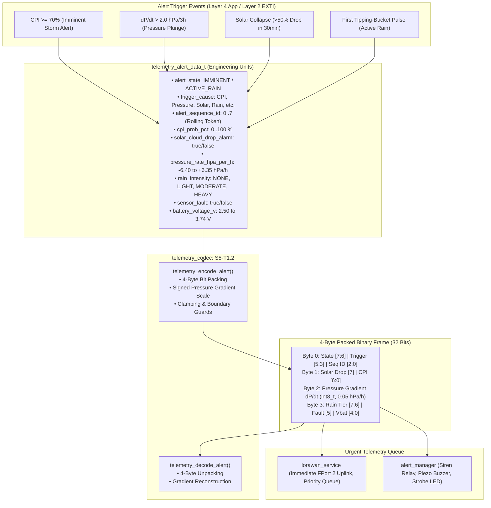

# Task Specification: S5-T1.2 - LoRaWAN 4-Byte Urgent Storm Alert Packet Serializer

## 1. Task Metadata & Overview

| Attribute | Specification Details |
| :--- | :--- |
| **Sprint** | **Sprint 5: Telemetry Protocol, LoRaWAN & Flash Storage** |
| **Task ID** | `S5-T1.2` |
| **Parent Task** | `S5-T1: Implement Compact Binary Telemetry Codec` |
| **Task Title** | Implement 4-Byte Urgent Storm Alert Packet Serializer & Deserializer (`telemetry_encode_alert` / `telemetry_decode_alert`) |
| **Status** | **Ready for Implementation** |
| **Target Files** | [`firmware/middleware/inc/telemetry_codec.h`](file:///C:/Users/ENERGY%20SAVER/Documents/Learning/Job%20Projects/rain-predict/firmware/middleware/inc/telemetry_codec.h)<br>[`firmware/middleware/src/telemetry_codec.c`](file:///C:/Users/ENERGY%20SAVER/Documents/Learning/Job%20Projects/rain-predict/firmware/middleware/src/telemetry_codec.c) |
| **Related Documents** | [`docs/architecture/telemetry-protocol.md`](file:///C:/Users/ENERGY%20SAVER/Documents/Learning/Job%20Projects/rain-predict/docs/architecture/telemetry-protocol.md)<br>[`docs/architecture/firmware-architecture.md`](file:///C:/Users/ENERGY%20SAVER/Documents/Learning/Job%20Projects/rain-predict/docs/architecture/firmware-architecture.md)<br>[`docs/algorithms/trend-detection-and-nowcasting.md`](file:///C:/Users/ENERGY%20SAVER/Documents/Learning/Job%20Projects/rain-predict/docs/algorithms/trend-detection-and-nowcasting.md)<br>[`docs/sensors/rain-gauge-pulse.md`](file:///C:/Users/ENERGY%20SAVER/Documents/Learning/Job%20Projects/rain-predict/docs/sensors/rain-gauge-pulse.md)<br>[`docs/hardware/power-supply-and-solar.md`](file:///C:/Users/ENERGY%20SAVER/Documents/Learning/Job%20Projects/rain-predict/docs/hardware/power-supply-and-solar.md)<br>[`context/specs/s5-t1.1-periodic-telemetry-serializer.md`](file:///C:/Users/ENERGY%20SAVER/Documents/Learning/Job%20Projects/rain-predict/context/specs/s5-t1.1-periodic-telemetry-serializer.md)<br>[`context/coding-standards.md`](file:///C:/Users/ENERGY%20SAVER/Documents/Learning/Job%20Projects/rain-predict/context/coding-standards.md) |
| **Dependencies** | [`S1-T1.1`](file:///C:/Users/ENERGY%20SAVER/Documents/Learning/Job%20Projects/rain-predict/context/specs/s1-t1.1-root-cmake.md) (Root CMake & Base Status Codes), [`S5-T1.1`](file:///C:/Users/ENERGY%20SAVER/Documents/Learning/Job%20Projects/rain-predict/context/specs/s5-t1.1-periodic-telemetry-serializer.md) (Periodic Codec Infrastructure) |
| **Downstream Tasks** | `S5-T1.3` (Telemetry Codec Unit Tests), `S5-T2.1` (ChirpStack Codec), `S5-T2.2` (TTN Decoder), `S5-T4.3` (Urgent LoRa Transmission Queue), `S6-T2.1` (Alert Manager), `S6-T3.1` (App State Machine `STATE_ALERT`) |

---

## 2. Executive Summary & Architectural Scope

The primary objective of **`S5-T1.2`** is to develop the **4-Byte Urgent Storm Alert Serializer and Deserializer** within Layer 3 Middleware ([`firmware/middleware/inc/telemetry_codec.h`](file:///C:/Users/ENERGY%20SAVER/Documents/Learning/Job%20Projects/rain-predict/firmware/middleware/inc/telemetry_codec.h) and [`firmware/middleware/src/telemetry_codec.c`](file:///C:/Users/ENERGY%20SAVER/Documents/Learning/Job%20Projects/rain-predict/firmware/middleware/src/telemetry_codec.c)) targeting the **STMicroelectronics STM32WLE5** SoC.

### Why a Dedicated 4-Byte Urgent Alert Packet Is Required:
When convective storm clouds rapidly form over mountainous tea plantations (e.g. Western Ghats or Kenyan Highlands), barometric pressure drops violently ($> 2.0\text{ hPa}/3\text{h}$) and optical irradiance collapses ($> 50\%$ drop in $< 30\text{ min}$). Waiting for the regular 15-minute periodic telemetry transmission window delays critical worker safety warnings and estate siren triggers.

The **4-Byte Urgent Alert Packet (`MSG_TYPE_ALERT`)** is transmitted immediately on **LoRaWAN FPort 2**:
1. **Ultra-Low Time-on-Air (ToA $< 18\text{ ms}$ at SF7/125kHz)**: Minimizes RF collision probability when multiple nodes simultaneously detect a squall line across adjacent tea divisions.
2. **Immediate Downstream Actuation**: Disseminates the alert trigger cause, probability ($CPI\%$), barometric gradient ($\Delta P_{1\text{h}}$), rain intensity tier, and battery health to estate hubs and sirens with sub-second latency.
3. **Transmission Deduplication**: Encodes a 3-bit rolling sequence token ($0\dots 7$) to allow network servers and local hubs to deduplicate repeated emergency transmissions while acknowledging receipt.



---

## 3. 4-Byte Alert Payload Structure & Bitfield Specifications

In accordance with [`docs/architecture/telemetry-protocol.md`](file:///C:/Users/ENERGY%20SAVER/Documents/Learning/Job%20Projects/rain-predict/docs/architecture/telemetry-protocol.md), urgent storm alerts are transmitted on **LoRaWAN FPort 2**:

### 3.1 Byte Map Overview

```
Byte 0                      Byte 1                      Byte 2                      Byte 3
┌───────────────────────────┬───────────────────────────┬───────────────────────────┬───────────────────────────┐
│ State[7:6]│Trig[5:3]│Seq  │ Solar[7]  │  CPI% [6:0]   │ Pressure Rate dP/dt (int8)│ Rain[7:6] │Flt│ Vbat[4:0] │
│ Alert Mode│ Cause   │[2:0]│ Drop Flag │  0 .. 100 %   │ Scale: 0.05 hPa/hr        │ Intensity │Err│ Step: 40mV│
└───────────────────────────┴───────────────────────────┴───────────────────────────┴───────────────────────────┘
```

---

### 3.2 Detailed Field-by-Field Breakdown

| Byte Offset | Field Name | Data Type | Physical Range | Resolution / Scale | Offset | Bit Layout & Formula | Clamping Boundaries |
| :---: | :--- | :---: | :---: | :---: | :---: | :--- | :--- |
| **0** | **Alert Header & Cause** | Bitfield (1 Byte) | See Sec 3.3 | — | — | `((state & 0x03) << 6) | ((trig & 0x07) << 3) | (seq & 0x07)` | State: $[0, 3]$, Trig: $[0, 7]$, Seq: $[0, 7]$ |
| **1** | **CPI & Solar Drop Alarm** | Bitfield (1 Byte) | See Sec 3.4 | $1.0\%$ | $0\%$ | `((solar_drop << 7) | (cpi & 0x7F))` | Solar: $[0, 1]$, CPI: $[0, 100]$ |
| **2** | **Pressure Rate ($\Delta P_{1\text{h}}$)** | Signed 8-bit (`int8_t`) | $-6.40 \dots +6.35\text{ hPa/hr}$ | $0.05\text{ hPa/hr}$ | $0.0$ | $\text{raw} = (\text{int8\_t})\text{round}\left(\frac{\Delta P_{1\text{h}}}{0.05\text{f}}\right)$ | $[-128, +127]$ |
| **3** | **Rain Intensity & Battery** | Bitfield (1 Byte) | See Sec 3.5 | $40\text{ mV}$ | $2.50\text{ V}$ | `((rain_tier << 6) | (fault << 5) | (vbat_raw & 0x1F))` | Tier: $[0, 3]$, Fault: $[0, 1]$, $V_{\text{bat\_raw}} \in [0, 31]$ |

---

### 3.3 Byte 0 Bitfield: Alert Header & Trigger Event Cause

```
  Bit 7      Bit 6      Bit 5      Bit 4      Bit 3      Bit 2      Bit 1      Bit 0
┌──────────────────────┬─────────────────────────────┬──────────────────────────────┐
│ Alert State [1:0]    │    Trigger Cause [2:0]      │   Alert Sequence ID [2:0]    │
└──────────────────────┴─────────────────────────────┴──────────────────────────────┘
```

* **Bits [7:6] — Alert Operational State (`2 bits`)**:
  * `00` (`0`): `RAIN_ALERT_UNLIKELY` ($CPI < 30\%$)
  * `01` (`1`): `RAIN_ALERT_POSSIBLE` ($30\% \le CPI < 60\%$)
  * `10` (`2`): `RAIN_ALERT_IMMINENT` ($CPI \ge 60\%$)
  * `11` (`3`): `RAIN_ALERT_ACTIVE_RAIN` (Physical tipping bucket activity)
* **Bits [5:3] — Trigger Event Cause (`3 bits`)**:
  * `000` (`0`): `ALERT_TRIGGER_MANUAL` (Manual test / diagnostics)
  * `001` (`1`): `ALERT_TRIGGER_CPI_THRESHOLD` (Composite Precipitation Index $\ge 70\%$)
  * `010` (`2`): `ALERT_TRIGGER_PRESSURE_PLUNGE` (Rapid barometric drop $> 2.0\text{ hPa}/3\text{h}$)
  * `011` (`3`): `ALERT_TRIGGER_SOLAR_COLLAPSE` (Daylight cloud blackout $> 50\%$ in $30\text{ min}$)
  * `100` (`4`): `ALERT_TRIGGER_FIRST_RAIN_TIP` (Tipping-bucket pulse detected)
  * `101` (`5`): `ALERT_TRIGGER_COMBINED_GRADIENT` (Multi-variable simultaneous surge)
  * `110` (`6`): `ALERT_TRIGGER_DEW_CONVERGENCE` (Dew point depression convergence $DPD < 0.5^\circ\text{C}$)
  * `111` (`7`): `ALERT_TRIGGER_LOW_BATTERY` (Critical battery depletion warning $V_{\text{bat}} < 2.80\text{ V}$)
* **Bits [2:0] — Alert Sequence Counter (`3 bits`)**:
  * Rolling counter ($0 \dots 7$) incremented on every new alert trigger to allow gateway deduplication.

---

### 3.4 Byte 1 Bitfield: CPI Probability & Solar Alarm

```
  Bit 7      Bit 6      Bit 5      Bit 4      Bit 3      Bit 2      Bit 1      Bit 0
┌──────────┬────────────────────────────────────────────────────────────────────────┐
│Solar Drop│            Composite Precipitation Index (CPI) [6:0] (0..100%)         │
└──────────┴────────────────────────────────────────────────────────────────────────┘
```

* **Bit [7] — Solar Cloud Drop Alarm (`1 bit`)**:
  * `0`: Normal daylight curve or night.
  * `1`: Sudden severe convective cloud attenuation active.
* **Bits [6:0] — Composite Precipitation Index (CPI) (`7 bits`)**:
  * Range: $0 \dots 100\%$ (Integer percentage probability). Clamped to $[0, 100]$.

---

### 3.5 Byte 2: Barometric Pressure Rate of Change ($\Delta P_{1\text{h}}$)

* **Data Type**: Signed 8-bit two's complement integer (`int8_t`).
* **Scale**: $0.05\text{ hPa/hr}$ per LSB.
* **Range**: $-6.40\text{ hPa/hr}$ to $+6.35\text{ hPa/hr}$ (raw $-128 \dots +127$).
* **Formula**:
  $$\text{raw} = (\text{int8\_t})\text{round}\left(\frac{\Delta P_{1\text{h}}}{0.05\text{f}}\right)$$
  $$\Delta P_{1\text{h}} = (\text{float})\text{raw} \times 0.05\text{f}$$
* **Examples**:
  * $\Delta P_{1\text{h}} = -2.50\text{ hPa/hr} \implies \text{raw} = -50 = \text{0xCE}$
  * $\Delta P_{1\text{h}} = -0.75\text{ hPa/hr} \implies \text{raw} = -15 = \text{0xF1}$
  * $\Delta P_{1\text{h}} = 0.00\text{ hPa/hr} \implies \text{raw} = 0 = \text{0x00}$
  * $\Delta P_{1\text{h}} = +1.20\text{ hPa/hr} \implies \text{raw} = +24 = \text{0x18}$

---

### 3.6 Byte 3 Bitfield: Rain Intensity & Battery Diagnostics

```
  Bit 7      Bit 6      Bit 5      Bit 4      Bit 3      Bit 2      Bit 1      Bit 0
┌──────────────────────┬──────────┬─────────────────────────────────────────────────┐
│ Rain Intensity [1:0] │Sensor Err│   Battery Voltage V_bat [4:0] (2.50V to 3.74V)  │
└──────────────────────┴──────────┴─────────────────────────────────────────────────┘
```

* **Bits [7:6] — Rainfall Rate Intensity Tier (`2 bits`)**:
  * `00` (`0`): `RAIN_INTENSITY_NONE` ($0.0\text{ mm/hr}$)
  * `01` (`1`): `RAIN_INTENSITY_LIGHT` ($0.1 \dots 2.5\text{ mm/hr}$)
  * `10` (`2`): `RAIN_INTENSITY_MODERATE` ($2.5 \dots 10.0\text{ mm/hr}$)
  * `11` (`3`): `RAIN_INTENSITY_HEAVY` ($> 10.0\text{ mm/hr}$)
* **Bit [5] — Sensor Communication Fault Flag (`1 bit`)**:
  * `0`: All sensor ICs responsive.
  * `1`: Sensor bus timeout / I2C NACK / CRC failure during alert cycle.
* **Bits [4:0] — Battery Voltage $V_{\text{bat}}$ (`5 bits`)**:
  * Step: $40\text{ mV}$ ($0.040\text{ V}$) per count. Offset: $2.50\text{ V}$.
  * $V_{\text{bat}} = 2.50\text{ V} + (\text{raw\_code} \times 0.040\text{ V})$
  * Raw range: $0 \dots 31 \implies 2.500\text{ V} \dots 3.740\text{ V}$.
  * Examples:
    * $V_{\text{bat}} = 2.50\text{ V} \implies \text{raw} = 0$
    * $V_{\text{bat}} = 3.30\text{ V} \implies \text{raw} = (3.30 - 2.50) / 0.040 = 20$ (`0x14`)
    * $V_{\text{bat}} = 3.60\text{ V} \implies \text{raw} = (3.60 - 2.50) / 0.040 = 27$ (`0x1B`)
    * $V_{\text{bat}} \ge 3.74\text{ V} \implies \text{raw} = 31$ (`0x1F`)

---

## 4. Public API & Data Structures (`telemetry_codec.h`)

### 4.1 Header Additions

```c
/* ========================================================================== */
/* Urgent Alert Protocol Constants                                            */
/* ========================================================================== */

/** @brief Fixed length of urgent alert payload in bytes */
#define TELEMETRY_ALERT_PAYLOAD_SIZE        4U

#define TELEMETRY_PRESS_RATE_STEP_HPA_H     0.05f       /**< 0.05 hPa/hr per LSB */
#define TELEMETRY_PRESS_RATE_MIN_HPA_H      (-6.40f)    /**< -6.40 hPa/hr */
#define TELEMETRY_PRESS_RATE_MAX_HPA_H      6.35f       /**< +6.35 hPa/hr */

#define TELEMETRY_ALERT_VBAT_OFFSET_V       2.50f       /**< 2.500 V base */
#define TELEMETRY_ALERT_VBAT_STEP_V         0.040f      /**< 0.040 V (40 mV) per LSB */
#define TELEMETRY_ALERT_VBAT_MIN_V          2.50f       /**< 2.500 V */
#define TELEMETRY_ALERT_VBAT_MAX_V          3.74f       /**< 3.740 V (2.50 + 31 * 0.04) */

#define TELEMETRY_ALERT_SEQ_MAX             7U          /**< 3-bit rolling sequence [0..7] */

/* ========================================================================== */
/* Enumerations                                                               */
/* ========================================================================== */

/**
 * @brief Primary trigger cause for urgent storm alert uplink.
 */
typedef enum {
    ALERT_TRIGGER_MANUAL            = 0U,   /**< 000: Manual diagnostic / test trigger */
    ALERT_TRIGGER_CPI_THRESHOLD     = 1U,   /**< 001: CPI score threshold exceeded (CPI >= 70%) */
    ALERT_TRIGGER_PRESSURE_PLUNGE   = 2U,   /**< 010: Rapid barometric drop (> 2.0 hPa / 3h) */
    ALERT_TRIGGER_SOLAR_COLLAPSE    = 3U,   /**< 011: Sudden solar attenuation (> 50% drop in 30min) */
    ALERT_TRIGGER_FIRST_RAIN_TIP    = 4U,   /**< 100: Physical rain gauge bucket tip detected */
    ALERT_TRIGGER_COMBINED_GRADIENT = 5U,   /**< 101: Multi-variable simultaneous surge */
    ALERT_TRIGGER_DEW_CONVERGENCE   = 6U,   /**< 110: Dew point depression convergence (DPD < 0.5 °C) */
    ALERT_TRIGGER_LOW_BATTERY       = 7U    /**< 111: Critical battery depletion warning (Vbat < 2.80 V) */
} telemetry_alert_trigger_t;

/**
 * @brief Rainfall rate intensity classification tier.
 */
typedef enum {
    RAIN_INTENSITY_NONE     = 0U,   /**< 00: No rain (0.0 mm/hr) */
    RAIN_INTENSITY_LIGHT    = 1U,   /**< 01: Light rain (0.1 .. 2.5 mm/hr) */
    RAIN_INTENSITY_MODERATE = 2U,   /**< 10: Moderate rain (2.5 .. 10.0 mm/hr) */
    RAIN_INTENSITY_HEAVY    = 3U    /**< 11: Heavy / torrential rain (> 10.0 mm/hr) */
} telemetry_rain_intensity_t;

/**
 * @brief Unpacked urgent storm alert structure representing engineering units.
 */
typedef struct {
    telemetry_rain_state_t      alert_state;            /**< Alert operational state */
    telemetry_alert_trigger_t   trigger_cause;          /**< Primary trigger cause code */
    uint8_t                     alert_sequence_id;      /**< Rolling sequence token [0 .. 7] */
    uint8_t                     cpi_prob_pct;           /**< Composite Precipitation Index [0 .. 100%] */
    bool                        solar_cloud_drop_alarm; /**< Convective cloud attenuation trigger */
    float                       pressure_rate_hpa_per_h;/**< 1-hour barometric rate in hPa/hr [-6.40 .. +6.35] */
    telemetry_rain_intensity_t  rain_intensity;         /**< Current rain intensity tier */
    bool                        sensor_fault;           /**< True if sensor bus error detected */
    float                       battery_voltage_v;      /**< Battery voltage in Volts [2.50 .. 3.74] */
} telemetry_alert_data_t;

/* ========================================================================== */
/* Function Prototypes                                                        */
/* ========================================================================== */

/**
 * @brief  Serializes urgent storm alert and event data into a compact 4-byte LoRaWAN binary payload.
 * @param[in]  data        Pointer to source alert data structure with engineering units.
 * @param[out] buffer      Pointer to destination byte array to store serialized payload.
 * @param[in]  buffer_size Size of destination buffer in bytes (must be >= 4).
 * @param[out] encoded_len Pointer to store exact number of bytes written (will be 4).
 * @return STATUS_OK on success, STATUS_ERROR_NULL_POINTER if any pointer is NULL,
 *         or STATUS_ERROR_BUFFER_TOO_SMALL if buffer_size < 4.
 */
status_t telemetry_encode_alert(const telemetry_alert_data_t *data,
                               uint8_t *buffer,
                               size_t buffer_size,
                               size_t *encoded_len);

/**
 * @brief  Deserializes a 4-byte LoRaWAN urgent alert binary payload into engineering units.
 * @param[in]  buffer      Pointer to raw 4-byte binary payload buffer.
 * @param[in]  buffer_size Size of raw payload buffer in bytes (must be >= 4).
 * @param[out] data        Pointer to destination alert data structure to populate.
 * @return STATUS_OK on success, STATUS_ERROR_NULL_POINTER if any pointer is NULL,
 *         or STATUS_ERROR_INVALID_PARAM if buffer_size < 4.
 */
status_t telemetry_decode_alert(const uint8_t *buffer,
                               size_t buffer_size,
                               telemetry_alert_data_t *data);
```

---

## 5. Concrete File Implementation Blueprint

### 5.1 Complete `firmware/middleware/inc/telemetry_codec.h` Blueprint

```c
/**
 * @file    telemetry_codec.h
 * @brief   LoRaWAN binary telemetry encoder and decoder header for STM32WLE5 SoC.
 * @details Supports 12-byte periodic environmental telemetry and 4-byte urgent storm alert payloads.
 */

#ifndef TELEMETRY_CODEC_H
#define TELEMETRY_CODEC_H

#include <stdint.h>
#include <stdbool.h>
#include <stddef.h>
#include "status_codes.h"

#ifdef __cplusplus
extern "C" {
#endif

/* ========================================================================== */
/* Protocol Constants & Port Allocations                                      */
/* ========================================================================== */

#define TELEMETRY_PERIODIC_PAYLOAD_SIZE     12U
#define TELEMETRY_ALERT_PAYLOAD_SIZE        4U

#define TELEMETRY_FPORT_PERIODIC            1U
#define TELEMETRY_FPORT_ALERT               2U
#define TELEMETRY_FPORT_CONFIG              10U

/* ========================================================================== */
/* Periodic Payload Physical Scaling & Offset Constants                       */
/* ========================================================================== */

#define TELEMETRY_TEMP_SCALE                100.0f
#define TELEMETRY_TEMP_MIN_C                (-40.0f)
#define TELEMETRY_TEMP_MAX_C                85.0f

#define TELEMETRY_HUM_SCALE                 100.0f
#define TELEMETRY_HUM_MIN_PCT               0.0f
#define TELEMETRY_HUM_MAX_PCT               100.0f

#define TELEMETRY_PRESS_OFFSET_HPA          300.0f
#define TELEMETRY_PRESS_STEP_HPA            0.02f
#define TELEMETRY_PRESS_MIN_HPA             300.0f
#define TELEMETRY_PRESS_MAX_HPA             1100.0f

#define TELEMETRY_LUX_STEP                  2.0f
#define TELEMETRY_LUX_MIN                   0.0f
#define TELEMETRY_LUX_MAX                   83000.0f

#define TELEMETRY_RAIN_STEP_MM              0.2f
#define TELEMETRY_RAIN_MIN_MM               0.0f
#define TELEMETRY_RAIN_MAX_MM               51.0f

#define TELEMETRY_VBAT_OFFSET_V             2.50f
#define TELEMETRY_VBAT_STEP_V               0.020f
#define TELEMETRY_VBAT_MIN_V                2.50f
#define TELEMETRY_VBAT_MAX_V                3.76f

#define TELEMETRY_ZAMBRETTI_MIN             1U
#define TELEMETRY_ZAMBRETTI_MAX             26U
#define TELEMETRY_CPI_MAX_PCT               100U

/* ========================================================================== */
/* Urgent Alert Payload Scaling & Offset Constants                            */
/* ========================================================================== */

#define TELEMETRY_PRESS_RATE_STEP_HPA_H     0.05f
#define TELEMETRY_PRESS_RATE_MIN_HPA_H      (-6.40f)
#define TELEMETRY_PRESS_RATE_MAX_HPA_H      6.35f

#define TELEMETRY_ALERT_VBAT_OFFSET_V       2.50f
#define TELEMETRY_ALERT_VBAT_STEP_V         0.040f
#define TELEMETRY_ALERT_VBAT_MIN_V          2.50f
#define TELEMETRY_ALERT_VBAT_MAX_V          3.74f

#define TELEMETRY_ALERT_SEQ_MAX             7U

/* ========================================================================== */
/* Enumerations & Typedefs                                                    */
/* ========================================================================== */

typedef enum {
    RAIN_ALERT_UNLIKELY    = 0U,
    RAIN_ALERT_POSSIBLE    = 1U,
    RAIN_ALERT_IMMINENT    = 2U,
    RAIN_ALERT_ACTIVE_RAIN = 3U
} telemetry_rain_state_t;

typedef enum {
    ALERT_TRIGGER_MANUAL            = 0U,
    ALERT_TRIGGER_CPI_THRESHOLD     = 1U,
    ALERT_TRIGGER_PRESSURE_PLUNGE   = 2U,
    ALERT_TRIGGER_SOLAR_COLLAPSE    = 3U,
    ALERT_TRIGGER_FIRST_RAIN_TIP    = 4U,
    ALERT_TRIGGER_COMBINED_GRADIENT = 5U,
    ALERT_TRIGGER_DEW_CONVERGENCE   = 6U,
    ALERT_TRIGGER_LOW_BATTERY       = 7U
} telemetry_alert_trigger_t;

typedef enum {
    RAIN_INTENSITY_NONE     = 0U,
    RAIN_INTENSITY_LIGHT    = 1U,
    RAIN_INTENSITY_MODERATE = 2U,
    RAIN_INTENSITY_HEAVY    = 3U
} telemetry_rain_intensity_t;

typedef struct {
    float                  temperature_c;
    float                  humidity_pct;
    float                  pressure_hpa;
    float                  ambient_lux;
    float                  rain_interval_mm;
    telemetry_rain_state_t forecast_state;
    uint8_t                zambretti_index;
    uint8_t                cpi_prob_pct;
    bool                   solar_cloud_drop_alarm;
    float                  battery_voltage_v;
    bool                   sensor_fault;
    bool                   unexpected_reset;
} telemetry_periodic_data_t;

typedef struct {
    telemetry_rain_state_t      alert_state;
    telemetry_alert_trigger_t   trigger_cause;
    uint8_t                     alert_sequence_id;
    uint8_t                     cpi_prob_pct;
    bool                        solar_cloud_drop_alarm;
    float                       pressure_rate_hpa_per_h;
    telemetry_rain_intensity_t  rain_intensity;
    bool                        sensor_fault;
    float                       battery_voltage_v;
} telemetry_alert_data_t;

/* ========================================================================== */
/* Function Prototypes                                                        */
/* ========================================================================== */

status_t telemetry_encode_periodic(const telemetry_periodic_data_t *data,
                                  uint8_t *buffer,
                                  size_t buffer_size,
                                  size_t *encoded_len);

status_t telemetry_decode_periodic(const uint8_t *buffer,
                                  size_t buffer_size,
                                  telemetry_periodic_data_t *data);

status_t telemetry_encode_alert(const telemetry_alert_data_t *data,
                               uint8_t *buffer,
                               size_t buffer_size,
                               size_t *encoded_len);

status_t telemetry_decode_alert(const uint8_t *buffer,
                               size_t buffer_size,
                               telemetry_alert_data_t *data);

#ifdef __cplusplus
}
#endif

#endif /* TELEMETRY_CODEC_H */
```

---

### 5.2 Complete `firmware/middleware/src/telemetry_codec.c` Blueprint

```c
/**
 * @file    telemetry_codec.c
 * @brief   LoRaWAN binary telemetry encoder and decoder implementation for STM32WLE5 SoC.
 */

#include "telemetry_codec.h"
#include <math.h>
#include <string.h>

/* ========================================================================== */
/* Static Helper Functions (Defensive Range Clamping)                         */
/* ========================================================================== */

static inline float clamp_float(float val, float min_val, float max_val) {
    if (val < min_val) {
        return min_val;
    }
    if (val > max_val) {
        return max_val;
    }
    return val;
}

static inline uint32_t clamp_u32(uint32_t val, uint32_t min_val, uint32_t max_val) {
    if (val < min_val) {
        return min_val;
    }
    if (val > max_val) {
        return max_val;
    }
    return val;
}

static inline int32_t clamp_i32(int32_t val, int32_t min_val, int32_t max_val) {
    if (val < min_val) {
        return min_val;
    }
    if (val > max_val) {
        return max_val;
    }
    return val;
}

/* ========================================================================== */
/* Periodic Telemetry Codec (12 Bytes)                                        */
/* ========================================================================== */

status_t telemetry_encode_periodic(const telemetry_periodic_data_t *data,
                                  uint8_t *buffer,
                                  size_t buffer_size,
                                  size_t *encoded_len) {
    if (data == NULL || buffer == NULL || encoded_len == NULL) {
        return STATUS_ERROR_NULL_POINTER;
    }

    if (buffer_size < TELEMETRY_PERIODIC_PAYLOAD_SIZE) {
        return STATUS_ERROR_BUFFER_TOO_SMALL;
    }

    memset(buffer, 0, TELEMETRY_PERIODIC_PAYLOAD_SIZE);

    /* Bytes 0..1: Temperature */
    float temp_clamped = clamp_float(data->temperature_c, TELEMETRY_TEMP_MIN_C, TELEMETRY_TEMP_MAX_C);
    int32_t raw_temp_32 = (int32_t)lroundf(temp_clamped * TELEMETRY_TEMP_SCALE);
    int16_t raw_temp = (int16_t)raw_temp_32;
    buffer[0] = (uint8_t)(((uint16_t)raw_temp >> 8) & 0xFFU);
    buffer[1] = (uint8_t)((uint16_t)raw_temp & 0xFFU);

    /* Bytes 2..3: Humidity */
    float hum_clamped = clamp_float(data->humidity_pct, TELEMETRY_HUM_MIN_PCT, TELEMETRY_HUM_MAX_PCT);
    uint32_t raw_hum_32 = (uint32_t)lroundf(hum_clamped * TELEMETRY_HUM_SCALE);
    uint16_t raw_hum = (uint16_t)clamp_u32(raw_hum_32, 0U, 10000U);
    buffer[2] = (uint8_t)((raw_hum >> 8) & 0xFFU);
    buffer[3] = (uint8_t)(raw_hum & 0xFFU);

    /* Bytes 4..5: Pressure */
    float press_clamped = clamp_float(data->pressure_hpa, TELEMETRY_PRESS_MIN_HPA, TELEMETRY_PRESS_MAX_HPA);
    uint32_t raw_press_32 = (uint32_t)lroundf((press_clamped - TELEMETRY_PRESS_OFFSET_HPA) / TELEMETRY_PRESS_STEP_HPA);
    uint16_t raw_press = (uint16_t)clamp_u32(raw_press_32, 0U, 40000U);
    buffer[4] = (uint8_t)((raw_press >> 8) & 0xFFU);
    buffer[5] = (uint8_t)(raw_press & 0xFFU);

    /* Bytes 6..7: Ambient Lux */
    float lux_clamped = clamp_float(data->ambient_lux, TELEMETRY_LUX_MIN, TELEMETRY_LUX_MAX);
    uint32_t raw_lux_32 = (uint32_t)lroundf(lux_clamped / TELEMETRY_LUX_STEP);
    uint16_t raw_lux = (uint16_t)clamp_u32(raw_lux_32, 0U, 41500U);
    buffer[6] = (uint8_t)((raw_lux >> 8) & 0xFFU);
    buffer[7] = (uint8_t)(raw_lux & 0xFFU);

    /* Byte 8: Interval Rain */
    float rain_clamped = clamp_float(data->rain_interval_mm, TELEMETRY_RAIN_MIN_MM, TELEMETRY_RAIN_MAX_MM);
    uint32_t raw_rain_32 = (uint32_t)lroundf(rain_clamped / TELEMETRY_RAIN_STEP_MM);
    buffer[8] = (uint8_t)clamp_u32(raw_rain_32, 0U, 255U);

    /* Byte 9: State & Zambretti */
    uint8_t state_bits = (uint8_t)((uint8_t)data->forecast_state & 0x03U);
    uint8_t zambretti_clamped = (uint8_t)clamp_u32((uint32_t)data->zambretti_index,
                                                   (uint32_t)TELEMETRY_ZAMBRETTI_MIN,
                                                   (uint32_t)TELEMETRY_ZAMBRETTI_MAX);
    buffer[9] = (uint8_t)((state_bits << 6) | (zambretti_clamped & 0x3FU));

    /* Byte 10: Solar Drop & CPI */
    uint8_t solar_flag = data->solar_cloud_drop_alarm ? 0x80U : 0x00U;
    uint8_t cpi_clamped = (uint8_t)clamp_u32((uint32_t)data->cpi_prob_pct, 0U, (uint32_t)TELEMETRY_CPI_MAX_PCT);
    buffer[10] = (uint8_t)(solar_flag | (cpi_clamped & 0x7FU));

    /* Byte 11: RST, Fault & Vbat */
    uint8_t rst_flag = data->unexpected_reset ? 0x80U : 0x00U;
    uint8_t fault_flag = data->sensor_fault ? 0x40U : 0x00U;
    float vbat_clamped = clamp_float(data->battery_voltage_v, TELEMETRY_VBAT_MIN_V, TELEMETRY_VBAT_MAX_V);
    uint32_t raw_vbat_32 = (uint32_t)lroundf((vbat_clamped - TELEMETRY_VBAT_OFFSET_V) / TELEMETRY_VBAT_STEP_V);
    uint8_t raw_vbat = (uint8_t)clamp_u32(raw_vbat_32, 0U, 63U);
    buffer[11] = (uint8_t)(rst_flag | fault_flag | (raw_vbat & 0x3FU));

    *encoded_len = TELEMETRY_PERIODIC_PAYLOAD_SIZE;
    return STATUS_OK;
}

status_t telemetry_decode_periodic(const uint8_t *buffer,
                                  size_t buffer_size,
                                  telemetry_periodic_data_t *data) {
    if (buffer == NULL || data == NULL) {
        return STATUS_ERROR_NULL_POINTER;
    }

    if (buffer_size < TELEMETRY_PERIODIC_PAYLOAD_SIZE) {
        return STATUS_ERROR_INVALID_PARAM;
    }

    memset(data, 0, sizeof(telemetry_periodic_data_t));

    /* Bytes 0..1: Temperature */
    uint16_t u16_temp = (uint16_t)(((uint16_t)buffer[0] << 8) | (uint16_t)buffer[1]);
    int16_t raw_temp = (int16_t)u16_temp;
    data->temperature_c = (float)raw_temp / TELEMETRY_TEMP_SCALE;

    /* Bytes 2..3: Humidity */
    uint16_t raw_hum = (uint16_t)(((uint16_t)buffer[2] << 8) | (uint16_t)buffer[3]);
    data->humidity_pct = (float)raw_hum / TELEMETRY_HUM_SCALE;

    /* Bytes 4..5: Pressure */
    uint16_t raw_press = (uint16_t)(((uint16_t)buffer[4] << 8) | (uint16_t)buffer[5]);
    data->pressure_hpa = TELEMETRY_PRESS_OFFSET_HPA + ((float)raw_press * TELEMETRY_PRESS_STEP_HPA);

    /* Bytes 6..7: Ambient Lux */
    uint16_t raw_lux = (uint16_t)(((uint16_t)buffer[6] << 8) | (uint16_t)buffer[7]);
    data->ambient_lux = (float)raw_lux * TELEMETRY_LUX_STEP;

    /* Byte 8: Interval Rain */
    data->rain_interval_mm = (float)buffer[8] * TELEMETRY_RAIN_STEP_MM;

    /* Byte 9: State & Zambretti */
    data->forecast_state = (telemetry_rain_state_t)((buffer[9] >> 6) & 0x03U);
    data->zambretti_index = (uint8_t)(buffer[9] & 0x3FU);

    /* Byte 10: Solar Drop & CPI */
    data->solar_cloud_drop_alarm = ((buffer[10] & 0x80U) != 0U);
    data->cpi_prob_pct = (uint8_t)(buffer[10] & 0x7FU);

    /* Byte 11: RST, Fault & Vbat */
    data->unexpected_reset = ((buffer[11] & 0x80U) != 0U);
    data->sensor_fault = ((buffer[11] & 0x40U) != 0U);
    uint8_t raw_vbat = (uint8_t)(buffer[11] & 0x3FU);
    data->battery_voltage_v = TELEMETRY_VBAT_OFFSET_V + ((float)raw_vbat * TELEMETRY_VBAT_STEP_V);

    return STATUS_OK;
}

/* ========================================================================== */
/* Urgent Storm Alert Codec (4 Bytes)                                         */
/* ========================================================================== */

status_t telemetry_encode_alert(const telemetry_alert_data_t *data,
                               uint8_t *buffer,
                               size_t buffer_size,
                               size_t *encoded_len) {
    if (data == NULL || buffer == NULL || encoded_len == NULL) {
        return STATUS_ERROR_NULL_POINTER;
    }

    if (buffer_size < TELEMETRY_ALERT_PAYLOAD_SIZE) {
        return STATUS_ERROR_BUFFER_TOO_SMALL;
    }

    memset(buffer, 0, TELEMETRY_ALERT_PAYLOAD_SIZE);

    /* ---------------------------------------------------------------------- */
    /* Byte 0: State [7:6] | Trigger Cause [5:3] | Sequence ID [2:0]          */
    /* ---------------------------------------------------------------------- */
    uint8_t state_bits = (uint8_t)(((uint8_t)data->alert_state & 0x03U) << 6);
    uint8_t trigger_bits = (uint8_t)(((uint8_t)data->trigger_cause & 0x07U) << 3);
    uint8_t seq_bits = (uint8_t)(data->alert_sequence_id & 0x07U);
    buffer[0] = (uint8_t)(state_bits | trigger_bits | seq_bits);

    /* ---------------------------------------------------------------------- */
    /* Byte 1: Solar Drop Flag [7] | CPI Probability [6:0]                    */
    /* ---------------------------------------------------------------------- */
    uint8_t solar_flag = data->solar_cloud_drop_alarm ? 0x80U : 0x00U;
    uint8_t cpi_clamped = (uint8_t)clamp_u32((uint32_t)data->cpi_prob_pct, 0U, (uint32_t)TELEMETRY_CPI_MAX_PCT);
    buffer[1] = (uint8_t)(solar_flag | (cpi_clamped & 0x7FU));

    /* ---------------------------------------------------------------------- */
    /* Byte 2: Barometric Pressure Rate dP/dt (Signed int8_t, 0.05 hPa/hr)    */
    /* ---------------------------------------------------------------------- */
    float rate_clamped = clamp_float(data->pressure_rate_hpa_per_h,
                                     TELEMETRY_PRESS_RATE_MIN_HPA_H,
                                     TELEMETRY_PRESS_RATE_MAX_HPA_H);
    int32_t raw_rate_32 = (int32_t)lroundf(rate_clamped / TELEMETRY_PRESS_RATE_STEP_HPA_H);
    int8_t raw_rate = (int8_t)clamp_i32(raw_rate_32, -128, 127);
    buffer[2] = (uint8_t)raw_rate;

    /* ---------------------------------------------------------------------- */
    /* Byte 3: Rain Intensity [7:6] | Sensor Fault [5] | Battery Vbat [4:0]   */
    /* ---------------------------------------------------------------------- */
    uint8_t rain_bits = (uint8_t)(((uint8_t)data->rain_intensity & 0x03U) << 6);
    uint8_t fault_bit = data->sensor_fault ? 0x20U : 0x00U;

    float vbat_clamped = clamp_float(data->battery_voltage_v,
                                     TELEMETRY_ALERT_VBAT_MIN_V,
                                     TELEMETRY_ALERT_VBAT_MAX_V);
    uint32_t raw_vbat_32 = (uint32_t)lroundf((vbat_clamped - TELEMETRY_ALERT_VBAT_OFFSET_V) / TELEMETRY_ALERT_VBAT_STEP_V);
    uint8_t raw_vbat = (uint8_t)clamp_u32(raw_vbat_32, 0U, 31U);

    buffer[3] = (uint8_t)(rain_bits | fault_bit | (raw_vbat & 0x1FU));

    *encoded_len = TELEMETRY_ALERT_PAYLOAD_SIZE;
    return STATUS_OK;
}

status_t telemetry_decode_alert(const uint8_t *buffer,
                               size_t buffer_size,
                               telemetry_alert_data_t *data) {
    if (buffer == NULL || data == NULL) {
        return STATUS_ERROR_NULL_POINTER;
    }

    if (buffer_size < TELEMETRY_ALERT_PAYLOAD_SIZE) {
        return STATUS_ERROR_INVALID_PARAM;
    }

    memset(data, 0, sizeof(telemetry_alert_data_t));

    /* Byte 0: State [7:6], Trigger [5:3], Seq ID [2:0] */
    data->alert_state = (telemetry_rain_state_t)((buffer[0] >> 6) & 0x03U);
    data->trigger_cause = (telemetry_alert_trigger_t)((buffer[0] >> 3) & 0x07U);
    data->alert_sequence_id = (uint8_t)(buffer[0] & 0x07U);

    /* Byte 1: Solar Drop Flag [7], CPI Probability [6:0] */
    data->solar_cloud_drop_alarm = ((buffer[1] & 0x80U) != 0U);
    data->cpi_prob_pct = (uint8_t)(buffer[1] & 0x7FU);

    /* Byte 2: Barometric Pressure Rate dP/dt */
    int8_t raw_rate = (int8_t)buffer[2];
    data->pressure_rate_hpa_per_h = (float)raw_rate * TELEMETRY_PRESS_RATE_STEP_HPA_H;

    /* Byte 3: Rain Intensity [7:6], Sensor Fault [5], Battery Vbat [4:0] */
    data->rain_intensity = (telemetry_rain_intensity_t)((buffer[3] >> 6) & 0x03U);
    data->sensor_fault = ((buffer[3] & 0x20U) != 0U);
    uint8_t raw_vbat = (uint8_t)(buffer[3] & 0x1FU);
    data->battery_voltage_v = TELEMETRY_ALERT_VBAT_OFFSET_V + ((float)raw_vbat * TELEMETRY_ALERT_VBAT_STEP_V);

    return STATUS_OK;
}
```

---

## 6. Defensive Programming, Clamping & Boundary Guards

1. **Deterministic Payload Length Guards**:
   - `telemetry_encode_alert()` enforces `buffer_size >= TELEMETRY_ALERT_PAYLOAD_SIZE (4)` returning `STATUS_ERROR_BUFFER_TOO_SMALL`.
   - `telemetry_decode_alert()` enforces `buffer_size >= 4` returning `STATUS_ERROR_INVALID_PARAM`.
2. **Two's-Complement Pressure Rate Handling**:
   - $\Delta P_{1\text{h}}$ can be positive (rapid post-storm anticyclonic recovery) or negative (pre-monsoon squall plunge). Casting `(int8_t)` with `clamp_i32(raw, -128, 127)` guarantees zero arithmetic sign distortion.
3. **Sub-Byte Field Isolation**:
   - All bitfields explicitly mask (`& 0x03`, `& 0x07`, `& 0x7F`, `& 0x1F`) before shifting to prevent multi-bit register overlap or accidental flag contamination.
4. **Floating-Point Rounding**:
   - Uses `lroundf()` for unbiased nearest integer quantization across all continuous analog variables.
5. **Zero Dynamic Allocation**:
   - Completely static, stack-bounded memory execution ($< 48\text{ bytes}$ frame footprint).

---

## 7. Verification & 10-Point Test Matrix

| Test Case ID | Test Category | Execution Steps | Expected Result | Pass/Fail Criteria |
| :--- | :--- | :--- | :--- | :---: |
| **TC-S5-T1.2-01** | Null Pointer Safety Guards | Call `telemetry_encode_alert()` and `telemetry_decode_alert()` with `NULL` pointers. | Returns `STATUS_ERROR_NULL_POINTER` immediately without memory corruption. | Null safety verified |
| **TC-S5-T1.2-02** | Destination Buffer Underflow | Call `telemetry_encode_alert()` with `buffer_size = 3`. | Returns `STATUS_ERROR_BUFFER_TOO_SMALL`, output unchanged. | Short buffer rejected |
| **TC-S5-T1.2-03** | Severe Convective Storm Alert Vector | Encode `state=2` (Imminent), `trigger=1` (CPI Threshold), `seq=3`, `CPI=88%`, `solar=1`, $\Delta P=-3.50\text{ hPa/hr}$, `rain_intensity=1` (Light), `fault=0`, $V_{\text{bat}}=3.30\text{ V}$ (`raw=20`). | Exactly 4 bytes matching `[0x8B, 0xD8, 0xBA, 0x54]`. | Exact bit-match verified |
| **TC-S5-T1.2-04** | Rapid Barometric Plunge Vector | Encode `state=2`, `trigger=2` (Pressure Plunge), `seq=5`, `CPI=92%`, `solar=0`, $\Delta P=-5.20\text{ hPa/hr}$ (`raw=-104 = 0x98`), `rain=0`, `fault=0`, $V_{\text{bat}}=3.26\text{ V}$ (`raw=19`). | Output matches `[0x95, 0x5C, 0x98, 0x13]`. | Hex vector matches |
| **TC-S5-T1.2-05** | First Rain Tip Trigger Vector | Encode `state=3` (Active Rain), `trigger=4` (First Rain Tip), `seq=1`, `CPI=95%`, `solar=1`, $\Delta P=-1.80\text{ hPa/hr}$ (`raw=-36 = 0xDC`), `rain=3` (Heavy), `fault=0`, $V_{\text{bat}}=3.10\text{ V}$ (`raw=15`). | Output matches `[0xE1, 0xDF, 0xDC, 0xCF]`. | First tip packet verified |
| **TC-S5-T1.2-06** | Sensor Fault Flag Propagation | Encode with `sensor_fault = true`, `rain_intensity = 0`, $V_{\text{bat}} = 2.90\text{ V}$ (`raw = 10`). | Byte 3 bit 5 is set: `0x20 \| 10 = 0x2A`. Decoded structure returns `sensor_fault == true`. | Fault bit verified |
| **TC-S5-T1.2-07** | Extreme Negative Pressure Rate Clamping | Encode $\Delta P = -15.0\text{ hPa/hr}$ (exceeds $-6.40\text{ hPa/hr}$ minimum). | Clamped to $-6.40\text{ hPa/hr}$ (`raw = -128 = 0x80`). No integer underflow. | Lower bound clamped |
| **TC-S5-T1.2-08** | Positive Pressure Surge Recovery | Encode $\Delta P = +4.50\text{ hPa/hr}$ (`raw = +90 = 0x5A`), `trigger = 0` (Manual), `state = 0`. | Byte 2 encoded as `0x5A`. Decoded pressure rate equals $+4.50\text{ hPa/hr} \pm 0.025\text{ hPa/hr}$. | Positive rate verified |
| **TC-S5-T1.2-09** | Full Round-Trip Encode/Decode Fidelity | Encode random alert profiles, decode output, verify all 9 fields. | Perfect fidelity across all enum types, flags, and quantized values ($|\Delta (\Delta P)| \le 0.025\text{ hPa/hr}$, $|\Delta V_{\text{bat}}| \le 0.020\text{ V}$). | Round-trip verified |
| **TC-S5-T1.2-10** | C99 Strict Compliance & Memory Footprint | Compile under GCC/Clang with `-Wall -Wextra -Wpedantic -Werror -std=c99`. | Clean warning-free compilation, zero heap allocations, stack usage $< 48\text{ bytes}$. | Strict C99 verified |

---

## 8. Definition of Done Checklist

- [ ] [`firmware/middleware/inc/telemetry_codec.h`](file:///C:/Users/ENERGY%20SAVER/Documents/Learning/Job%20Projects/rain-predict/firmware/middleware/inc/telemetry_codec.h) updated with `telemetry_alert_data_t`, `telemetry_alert_trigger_t`, `telemetry_rain_intensity_t`, and 4-byte alert prototypes.
- [ ] [`firmware/middleware/src/telemetry_codec.c`](file:///C:/Users/ENERGY%20SAVER/Documents/Learning/Job%20Projects/rain-predict/firmware/middleware/src/telemetry_codec.c) updated with `telemetry_encode_alert()` and `telemetry_decode_alert()` implementations.
- [ ] 4-byte packed layout matches LoRaWAN FPort 2 specification with sub-byte field isolation and signed pressure rate encoding.
- [ ] Defensive range clamping guards active on all continuous inputs ($\Delta P_{1\text{h}}$, $CPI\%$, $V_{\text{bat}}$).
- [ ] All 10 verification test cases in Section 7 pass with 100% success on host test runner.
