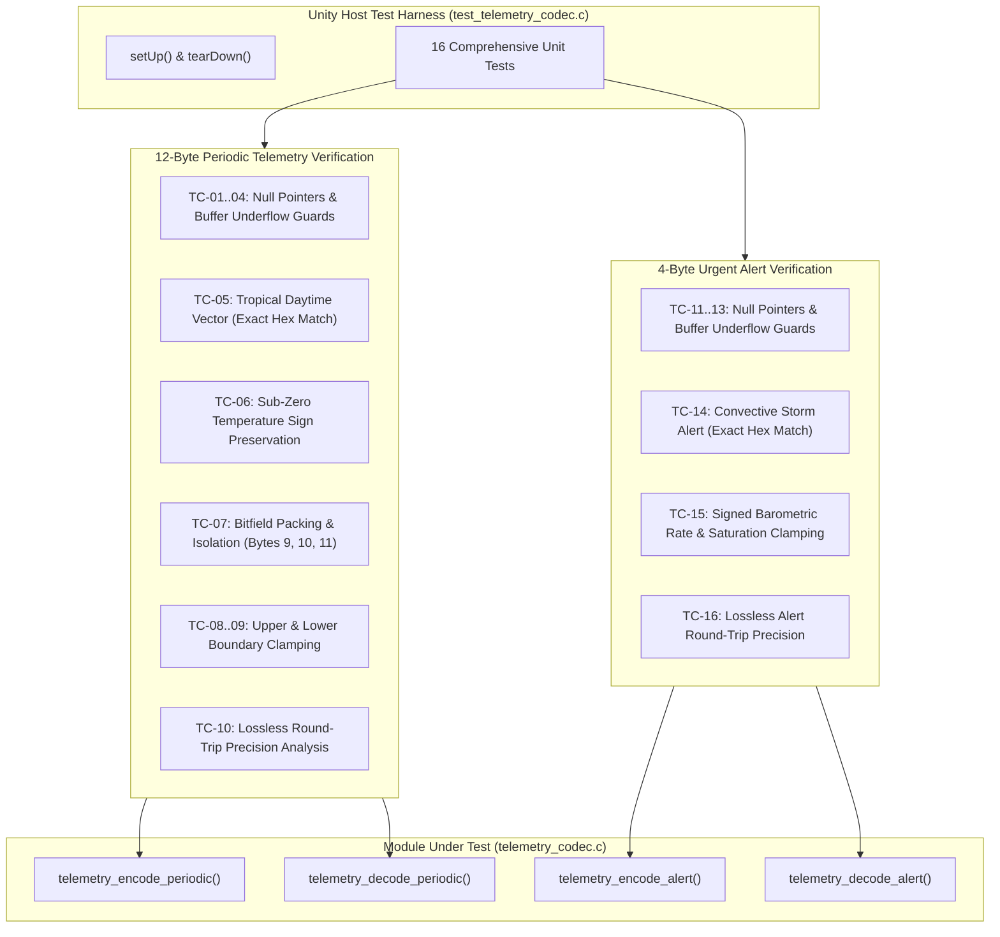

# Task Specification: S5-T1.3 - Telemetry Codec Unit Test Suite

## 1. Task Metadata & Overview

| Attribute | Specification Details |
| :--- | :--- |
| **Sprint** | **Sprint 5: Telemetry Protocol, LoRaWAN & Flash Storage** |
| **Task ID** | `S5-T1.3` |
| **Parent Task** | `S5-T1: Implement Compact Binary Telemetry Codec` |
| **Task Title** | Create Telemetry Codec Unit Test Suite (`test_telemetry_codec.c`) under Unity Framework |
| **Status** | **Ready for Implementation** |
| **Target Files** | [`tests/unit/test_telemetry_codec.c`](file:///C:/Users/ENERGY%20SAVER/Documents/Learning/Job%20Projects/rain-predict/tests/unit/test_telemetry_codec.c)<br>[`tests/CMakeLists.txt`](file:///C:/Users/ENERGY%20SAVER/Documents/Learning/Job%20Projects/rain-predict/tests/CMakeLists.txt) |
| **Related Documents** | [`docs/architecture/telemetry-protocol.md`](file:///C:/Users/ENERGY%20SAVER/Documents/Learning/Job%20Projects/rain-predict/docs/architecture/telemetry-protocol.md)<br>[`docs/architecture/firmware-architecture.md`](file:///C:/Users/ENERGY%20SAVER/Documents/Learning/Job%20Projects/rain-predict/docs/architecture/firmware-architecture.md)<br>[`context/specs/s5-t1.1-periodic-telemetry-serializer.md`](file:///C:/Users/ENERGY%20SAVER/Documents/Learning/Job%20Projects/rain-predict/context/specs/s5-t1.1-periodic-telemetry-serializer.md)<br>[`context/specs/s5-t1.2-urgent-alert-serializer.md`](file:///C:/Users/ENERGY%20SAVER/Documents/Learning/Job%20Projects/rain-predict/context/specs/s5-t1.2-urgent-alert-serializer.md)<br>[`context/specs/s1-t2.1-unity-test-harness.md`](file:///C:/Users/ENERGY%20SAVER/Documents/Learning/Job%20Projects/rain-predict/context/specs/s1-t2.1-unity-test-harness.md)<br>[`context/coding-standards.md`](file:///C:/Users/ENERGY%20SAVER/Documents/Learning/Job%20Projects/rain-predict/context/coding-standards.md) |
| **Dependencies** | [`S1-T2.1`](file:///C:/Users/ENERGY%20SAVER/Documents/Learning/Job%20Projects/rain-predict/context/specs/s1-t2.1-unity-test-harness.md) (Unity Test Harness), [`S5-T1.1`](file:///C:/Users/ENERGY%20SAVER/Documents/Learning/Job%20Projects/rain-predict/context/specs/s5-t1.1-periodic-telemetry-serializer.md) (Periodic Codec), [`S5-T1.2`](file:///C:/Users/ENERGY%20SAVER/Documents/Learning/Job%20Projects/rain-predict/context/specs/s5-t1.2-urgent-alert-serializer.md) (Alert Codec) |
| **Downstream Tasks** | `S5-T2.1` (ChirpStack Codec), `S5-T2.2` (TTN Decoder), `S5-T3.1` (Flash Storage Ring Buffer), `S5-T4.1` (LoRaWAN Uplink Service), `S6-T4` (Full State Machine Integration) |

---

## 2. Executive Summary & Architectural Scope

The primary objective of **`S5-T1.3`** is to develop the host-executable unit test suite in [`tests/unit/test_telemetry_codec.c`](file:///C:/Users/ENERGY%20SAVER/Documents/Learning/Job%20Projects/rain-predict/tests/unit/test_telemetry_codec.c) to rigorously verify the **LoRaWAN Binary Telemetry Codec** ([`firmware/middleware/inc/telemetry_codec.h`](file:///C:/Users/ENERGY%20SAVER/Documents/Learning/Job%20Projects/rain-predict/firmware/middleware/inc/telemetry_codec.h) and [`firmware/middleware/src/telemetry_codec.c`](file:///C:/Users/ENERGY%20SAVER/Documents/Learning/Job%20Projects/rain-predict/firmware/middleware/src/telemetry_codec.c)) using the **ThrowTheSwitch Unity** framework.

Because bit-level telemetry payloads transmitted across Sub-GHz LoRaWAN links are parsed by distributed cloud network servers (The Things Network, ChirpStack) and local estate gateways, zero bit-packing discrepancy or endianness mismatch can be tolerated.

The unit test suite exercises:
1. **12-Byte Periodic Payload Serialization & Deserialization (`telemetry_encode_periodic` / `telemetry_decode_periodic`)**:
   - Exact byte-by-byte hexadecimal match against reference physical vectors.
   - Big-endian network byte order on 16-bit words ($T, RH, P, Lux$).
   - Signed two's-complement integrity for sub-zero temperature conditions ($-40.0^\circ\text{C} \dots 0.0^\circ\text{C}$).
   - Sub-byte bitfield masking across Byte 9 (State/Zambretti), Byte 10 (Solar Drop/CPI), and Byte 11 (Reset/Fault/Vbat).
   - Out-of-bounds input clamping against physical sensor boundaries.
   - Lossless round-trip quantization precision.
2. **4-Byte Urgent Storm Alert Serialization & Deserialization (`telemetry_encode_alert` / `telemetry_decode_alert`)**:
   - Exact byte-by-byte hexadecimal match for storm triggers and rain pulses.
   - Signed 8-bit two's-complement pressure gradient ($\Delta P_{1\text{h}}$) rate quantization ($0.05\text{ hPa/hr}$ step).
   - Sub-byte bitfield packing of trigger causes ($0\dots 7$), rolling sequence tokens ($0\dots 7$), rain intensity tiers ($0\dots 3$), and battery voltage.
3. **Defensive Pointer and Buffer Bounds Guards**:
   - Comprehensive rejection of `NULL` pointers, truncated buffers (`size < 12` and `size < 4`), and memory over-reads.



---

## 3. Standard Reference Test Vectors & Hexadecimal Truth Tables

### 3.1 Periodic Telemetry Reference Vectors (12 Bytes)

#### Vector 1: Nominal Tropical Daytime (Tea Plantation Mid-Day)
* **Physical Inputs**:
  * Temperature: $+24.50^\circ\text{C}$ ($\text{raw} = +2450 = \text{0x0992}$)
  * Humidity: $85.25\%\text{ RH}$ ($\text{raw} = 8525 = \text{0x214D}$)
  * Pressure: $945.50\text{ hPa}$ ($\text{raw} = (945.50 - 300.0) / 0.02 = 32275 = \text{0x7E13}$)
  * Solar Lux: $45000.0\text{ Lux}$ ($\text{raw} = 45000 / 2 = 22500 = \text{0x57E4}$)
  * Rain Interval: $0.0\text{ mm}$ ($\text{raw} = 0 = \text{0x00}$)
  * Forecast State: `RAIN_ALERT_POSSIBLE` ($1 \implies \text{bits 7:6} = \text{01}$)
  * Zambretti Index: $14$ ('N' Fairly Fine) ($\text{bits 5:0} = \text{0x0E} \implies \text{Byte 9} = (1 \ll 6) \mid 14 = \text{0x4E}$)
  * CPI Probability: $45\%$ ($\text{bits 6:0} = \text{0x2D}$)
  * Solar Cloud Drop Alarm: `false` ($\text{bit 7} = 0 \implies \text{Byte 10} = \text{0x2D}$)
  * Battery Voltage: $3.30\text{ V}$ ($\text{raw} = (3.30 - 2.50) / 0.020 = 40 = \text{0x28}$)
  * Sensor Fault: `false`, Unexpected Reset: `false` ($\implies \text{Byte 11} = \text{0x28}$)
* **Expected 12-Byte Hex Array**:
  `{ 0x09, 0x92, 0x21, 0x4D, 0x7E, 0x13, 0x57, 0xE4, 0x00, 0x4E, 0x2D, 0x28 }`

---

#### Vector 2: Sub-Zero Mountain Frost with Trace Mist
* **Physical Inputs**:
  * Temperature: $-12.75^\circ\text{C}$ ($\text{raw} = -1275 = \text{0xFB05}$)
  * Humidity: $99.90\%\text{ RH}$ ($\text{raw} = 9990 = \text{0x2706}$)
  * Pressure: $810.20\text{ hPa}$ ($\text{raw} = (810.20 - 300.0) / 0.02 = 25510 = \text{0x63A6}$)
  * Solar Lux: $0.0\text{ Lux}$ (Night) ($\text{raw} = 0 = \text{0x0000}$)
  * Rain Interval: $2.4\text{ mm}$ ($\text{raw} = 2.4 / 0.2 = 12 = \text{0x0C}$)
  * Forecast State: `RAIN_ALERT_IMMINENT` ($2 \implies \text{bits 7:6} = \text{10}$)
  * Zambretti Index: $22$ ('V' Rain at Times) ($\text{bits 5:0} = 22 \implies \text{Byte 9} = (2 \ll 6) \mid 22 = \text{0x96}$)
  * CPI Probability: $78\%$ ($\text{bits 6:0} = \text{0x4E}$)
  * Solar Cloud Drop Alarm: `false` ($\implies \text{Byte 10} = \text{0x4E}$)
  * Battery Voltage: $3.10\text{ V}$ ($\text{raw} = (3.10 - 2.50) / 0.020 = 30 = \text{0x1E}$)
  * Sensor Fault: `false`, Unexpected Reset: `false` ($\implies \text{Byte 11} = \text{0x1E}$)
* **Expected 12-Byte Hex Array**:
  `{ 0xFB, 0x05, 0x27, 0x06, 0x63, 0xA6, 0x00, 0x00, 0x0C, 0x96, 0x4E, 0x1E }`

---

### 3.2 Urgent Alert Reference Vectors (4 Bytes)

#### Vector 3: Severe Convective Storm Alarm Trigger
* **Physical Inputs**:
  * Alert State: `RAIN_ALERT_IMMINENT` ($2 \implies \text{bits 7:6} = \text{10}$)
  * Trigger Cause: `ALERT_TRIGGER_CPI_THRESHOLD` ($1 \implies \text{bits 5:3} = \text{001}$)
  * Alert Sequence Token: $3$ ($\text{bits 2:0} = \text{011} \implies \text{Byte 0} = (2 \ll 6) \mid (1 \ll 3) \mid 3 = \text{0x8B}$)
  * Solar Cloud Drop Alarm: `true` ($\text{bit 7} = 1$)
  * CPI Probability: $88\%$ ($\text{bits 6:0} = 88 = \text{0x58} \implies \text{Byte 1} = \text{0x80} \mid \text{0x58} = \text{0xD8}$)
  * Pressure Rate: $-3.50\text{ hPa/hr}$ ($\text{raw} = -3.50 / 0.05 = -70 = \text{0xBA} \implies \text{Byte 2} = \text{0xBA}$)
  * Rain Intensity: `RAIN_INTENSITY_LIGHT` ($1 \implies \text{bits 7:6} = \text{01}$)
  * Sensor Fault: `false` ($\text{bit 5} = 0$)
  * Battery Voltage: $3.30\text{ V}$ ($\text{raw} = (3.30 - 2.50) / 0.040 = 20 = \text{0x14} \implies \text{Byte 3} = (1 \ll 6) \mid 20 = \text{0x54}$)
* **Expected 4-Byte Hex Array**:
  `{ 0x8B, 0xD8, 0xBA, 0x54 }`

---

## 4. Concrete File Implementation Blueprint

### 4.1 `tests/unit/test_telemetry_codec.c` Blueprint

```c
/**
 * @file    test_telemetry_codec.c
 * @brief   Unit test suite for LoRaWAN binary telemetry serializer and deserializer.
 * @details Validates 12-byte periodic telemetry and 4-byte urgent alert binary encoding under Unity.
 */

#include "unity.h"
#include "telemetry_codec.h"
#include <string.h>
#include <math.h>

/* ========================================================================== */
/* Test Harness Setup and Teardown                                            */
/* ========================================================================== */

void setUp(void) {
    /* No dynamic memory allocation to reset */
}

void tearDown(void) {
    /* Verify clean execution */
}

/* ========================================================================== */
/* Periodic Telemetry Tests (12 Bytes)                                        */
/* ========================================================================== */

/**
 * @brief Verify NULL pointer guards on periodic encoder and decoder.
 */
void test_periodic_codec_null_guards(void) {
    telemetry_periodic_data_t data;
    uint8_t buffer[TELEMETRY_PERIODIC_PAYLOAD_SIZE];
    size_t encoded_len = 0;

    memset(&data, 0, sizeof(data));

    /* Encoder NULL checks */
    TEST_ASSERT_EQUAL(STATUS_ERROR_NULL_POINTER, telemetry_encode_periodic(NULL, buffer, sizeof(buffer), &encoded_len));
    TEST_ASSERT_EQUAL(STATUS_ERROR_NULL_POINTER, telemetry_encode_periodic(&data, NULL, sizeof(buffer), &encoded_len));
    TEST_ASSERT_EQUAL(STATUS_ERROR_NULL_POINTER, telemetry_encode_periodic(&data, buffer, sizeof(buffer), NULL));

    /* Decoder NULL checks */
    TEST_ASSERT_EQUAL(STATUS_ERROR_NULL_POINTER, telemetry_decode_periodic(NULL, sizeof(buffer), &data));
    TEST_ASSERT_EQUAL(STATUS_ERROR_NULL_POINTER, telemetry_decode_periodic(buffer, sizeof(buffer), NULL));
}

/**
 * @brief Verify buffer bounds rejection for truncated destination arrays.
 */
void test_periodic_codec_buffer_underflow(void) {
    telemetry_periodic_data_t data;
    uint8_t buffer[TELEMETRY_PERIODIC_PAYLOAD_SIZE];
    size_t encoded_len = 0;

    memset(&data, 0, sizeof(data));

    /* Buffer sizes less than 12 bytes must be rejected */
    TEST_ASSERT_EQUAL(STATUS_ERROR_BUFFER_TOO_SMALL, telemetry_encode_periodic(&data, buffer, 11, &encoded_len));
    TEST_ASSERT_EQUAL(STATUS_ERROR_BUFFER_TOO_SMALL, telemetry_encode_periodic(&data, buffer, 0, &encoded_len));

    TEST_ASSERT_EQUAL(STATUS_ERROR_INVALID_PARAM, telemetry_decode_periodic(buffer, 11, &data));
    TEST_ASSERT_EQUAL(STATUS_ERROR_INVALID_PARAM, telemetry_decode_periodic(buffer, 0, &data));
}

/**
 * @brief Test exact hexadecimal bit-match for nominal tropical daytime profile.
 */
void test_periodic_encode_nominal_daytime_hex_match(void) {
    telemetry_periodic_data_t data = {
        .temperature_c          = 24.50f,
        .humidity_pct           = 85.25f,
        .pressure_hpa           = 945.50f,
        .ambient_lux            = 45000.0f,
        .rain_interval_mm       = 0.0f,
        .forecast_state         = RAIN_ALERT_POSSIBLE,
        .zambretti_index        = 14U,
        .cpi_prob_pct           = 45U,
        .solar_cloud_drop_alarm = false,
        .battery_voltage_v      = 3.30f,
        .sensor_fault           = false,
        .unexpected_reset       = false
    };

    uint8_t buffer[TELEMETRY_PERIODIC_PAYLOAD_SIZE];
    size_t encoded_len = 0;

    const uint8_t expected_hex[TELEMETRY_PERIODIC_PAYLOAD_SIZE] = {
        0x09, 0x92, 0x21, 0x4D, 0x7E, 0x13, 0x57, 0xE4, 0x00, 0x4E, 0x2D, 0x28
    };

    status_t status = telemetry_encode_periodic(&data, buffer, sizeof(buffer), &encoded_len);
    TEST_ASSERT_EQUAL(STATUS_OK, status);
    TEST_ASSERT_EQUAL(TELEMETRY_PERIODIC_PAYLOAD_SIZE, encoded_len);
    TEST_ASSERT_EQUAL_UINT8_ARRAY(expected_hex, buffer, TELEMETRY_PERIODIC_PAYLOAD_SIZE);
}

/**
 * @brief Test sub-zero temperature two's-complement sign preservation.
 */
void test_periodic_encode_subzero_temperature(void) {
    telemetry_periodic_data_t data = {
        .temperature_c          = -12.75f,
        .humidity_pct           = 99.90f,
        .pressure_hpa           = 810.20f,
        .ambient_lux            = 0.0f,
        .rain_interval_mm       = 2.4f,
        .forecast_state         = RAIN_ALERT_IMMINENT,
        .zambretti_index        = 22U,
        .cpi_prob_pct           = 78U,
        .solar_cloud_drop_alarm = false,
        .battery_voltage_v      = 3.10f,
        .sensor_fault           = false,
        .unexpected_reset       = false
    };

    uint8_t buffer[TELEMETRY_PERIODIC_PAYLOAD_SIZE];
    size_t encoded_len = 0;

    const uint8_t expected_hex[TELEMETRY_PERIODIC_PAYLOAD_SIZE] = {
        0xFB, 0x05, 0x27, 0x06, 0x63, 0xA6, 0x00, 0x00, 0x0C, 0x96, 0x4E, 0x1E
    };

    status_t status = telemetry_encode_periodic(&data, buffer, sizeof(buffer), &encoded_len);
    TEST_ASSERT_EQUAL(STATUS_OK, status);
    TEST_ASSERT_EQUAL_UINT8_ARRAY(expected_hex, buffer, TELEMETRY_PERIODIC_PAYLOAD_SIZE);

    /* Verify decode accurately reconstructs negative temperature */
    telemetry_periodic_data_t decoded;
    status = telemetry_decode_periodic(buffer, sizeof(buffer), &decoded);
    TEST_ASSERT_EQUAL(STATUS_OK, status);
    TEST_ASSERT_FLOAT_WITHIN(0.005f, -12.75f, decoded.temperature_c);
    TEST_ASSERT_FLOAT_WITHIN(0.005f, 99.90f, decoded.humidity_pct);
    TEST_ASSERT_FLOAT_WITHIN(0.01f, 810.20f, decoded.pressure_hpa);
    TEST_ASSERT_FLOAT_WITHIN(0.1f, 2.4f, decoded.rain_interval_mm);
}

/**
 * @brief Test bitfield packing, flag masking, and isolation in Bytes 9, 10, and 11.
 */
void test_periodic_encode_bitfield_masks(void) {
    telemetry_periodic_data_t data = {
        .temperature_c          = 20.00f,
        .humidity_pct           = 50.00f,
        .pressure_hpa           = 1000.00f,
        .ambient_lux            = 1000.0f,
        .rain_interval_mm       = 1.0f,
        .forecast_state         = RAIN_ALERT_ACTIVE_RAIN, /* 3 (bits 7:6 = 11) */
        .zambretti_index        = 26U,                    /* 26 (bits 5:0 = 0x1A) -> 0xDA */
        .cpi_prob_pct           = 100U,                   /* 100 (bits 6:0 = 0x64) */
        .solar_cloud_drop_alarm = true,                   /* true (bit 7 = 1) -> 0xE4 */
        .battery_voltage_v      = 3.76f,                  /* raw 63 (bits 5:0 = 0x3F) */
        .sensor_fault           = true,                   /* true (bit 6 = 1) */
        .unexpected_reset       = true                    /* true (bit 7 = 1) -> 0xFF */
    };

    uint8_t buffer[TELEMETRY_PERIODIC_PAYLOAD_SIZE];
    size_t encoded_len = 0;

    status_t status = telemetry_encode_periodic(&data, buffer, sizeof(buffer), &encoded_len);
    TEST_ASSERT_EQUAL(STATUS_OK, status);

    TEST_ASSERT_EQUAL_HEX8(0xDA, buffer[9]);
    TEST_ASSERT_EQUAL_HEX8(0xE4, buffer[10]);
    TEST_ASSERT_EQUAL_HEX8(0xFF, buffer[11]);

    telemetry_periodic_data_t decoded;
    status = telemetry_decode_periodic(buffer, sizeof(buffer), &decoded);
    TEST_ASSERT_EQUAL(STATUS_OK, status);
    TEST_ASSERT_EQUAL(RAIN_ALERT_ACTIVE_RAIN, decoded.forecast_state);
    TEST_ASSERT_EQUAL_UINT8(26U, decoded.zambretti_index);
    TEST_ASSERT_EQUAL_UINT8(100U, decoded.cpi_prob_pct);
    TEST_ASSERT_TRUE(decoded.solar_cloud_drop_alarm);
    TEST_ASSERT_TRUE(decoded.unexpected_reset);
    TEST_ASSERT_TRUE(decoded.sensor_fault);
    TEST_ASSERT_FLOAT_WITHIN(0.01f, 3.76f, decoded.battery_voltage_v);
}

/**
 * @brief Test maximum physical boundary clamping (no integer wrap-around).
 */
void test_periodic_encode_upper_boundary_clamping(void) {
    telemetry_periodic_data_t data = {
        .temperature_c          = 150.0f,    /* Exceeds 85.0 °C */
        .humidity_pct           = 120.0f,    /* Exceeds 100.0 % */
        .pressure_hpa           = 1300.0f,   /* Exceeds 1100.0 hPa */
        .ambient_lux            = 200000.0f, /* Exceeds 83,000 Lux */
        .rain_interval_mm       = 100.0f,    /* Exceeds 51.0 mm */
        .forecast_state         = RAIN_ALERT_ACTIVE_RAIN,
        .zambretti_index        = 30U,       /* Exceeds 26 */
        .cpi_prob_pct           = 150U,      /* Exceeds 100% */
        .solar_cloud_drop_alarm = true,
        .battery_voltage_v      = 5.0f,      /* Exceeds 3.76 V */
        .sensor_fault           = false,
        .unexpected_reset       = false
    };

    uint8_t buffer[TELEMETRY_PERIODIC_PAYLOAD_SIZE];
    size_t encoded_len = 0;

    status_t status = telemetry_encode_periodic(&data, buffer, sizeof(buffer), &encoded_len);
    TEST_ASSERT_EQUAL(STATUS_OK, status);

    telemetry_periodic_data_t decoded;
    status = telemetry_decode_periodic(buffer, sizeof(buffer), &decoded);
    TEST_ASSERT_EQUAL(STATUS_OK, status);

    TEST_ASSERT_FLOAT_WITHIN(0.01f, 85.00f, decoded.temperature_c);
    TEST_ASSERT_FLOAT_WITHIN(0.01f, 100.00f, decoded.humidity_pct);
    TEST_ASSERT_FLOAT_WITHIN(0.02f, 1100.00f, decoded.pressure_hpa);
    TEST_ASSERT_FLOAT_WITHIN(2.0f, 83000.0f, decoded.ambient_lux);
    TEST_ASSERT_FLOAT_WITHIN(0.2f, 51.0f, decoded.rain_interval_mm);
    TEST_ASSERT_EQUAL_UINT8(26U, decoded.zambretti_index);
    TEST_ASSERT_EQUAL_UINT8(100U, decoded.cpi_prob_pct);
    TEST_ASSERT_FLOAT_WITHIN(0.02f, 3.76f, decoded.battery_voltage_v);
}

/**
 * @brief Test minimum physical boundary clamping (no integer underflow).
 */
void test_periodic_encode_lower_boundary_clamping(void) {
    telemetry_periodic_data_t data = {
        .temperature_c          = -80.0f,   /* Below -40.0 °C */
        .humidity_pct           = -20.0f,   /* Below 0.0 % */
        .pressure_hpa           = 100.0f,   /* Below 300.0 hPa */
        .ambient_lux            = -50.0f,   /* Below 0.0 Lux */
        .rain_interval_mm       = -5.0f,    /* Below 0.0 mm */
        .forecast_state         = RAIN_ALERT_UNLIKELY,
        .zambretti_index        = 0U,       /* Below 1 */
        .cpi_prob_pct           = 0U,
        .solar_cloud_drop_alarm = false,
        .battery_voltage_v      = 1.50f,    /* Below 2.50 V */
        .sensor_fault           = false,
        .unexpected_reset       = false
    };

    uint8_t buffer[TELEMETRY_PERIODIC_PAYLOAD_SIZE];
    size_t encoded_len = 0;

    status_t status = telemetry_encode_periodic(&data, buffer, sizeof(buffer), &encoded_len);
    TEST_ASSERT_EQUAL(STATUS_OK, status);

    telemetry_periodic_data_t decoded;
    status = telemetry_decode_periodic(buffer, sizeof(buffer), &decoded);
    TEST_ASSERT_EQUAL(STATUS_OK, status);

    TEST_ASSERT_FLOAT_WITHIN(0.01f, -40.00f, decoded.temperature_c);
    TEST_ASSERT_FLOAT_WITHIN(0.01f, 0.00f, decoded.humidity_pct);
    TEST_ASSERT_FLOAT_WITHIN(0.02f, 300.00f, decoded.pressure_hpa);
    TEST_ASSERT_FLOAT_WITHIN(2.0f, 0.0f, decoded.ambient_lux);
    TEST_ASSERT_FLOAT_WITHIN(0.2f, 0.0f, decoded.rain_interval_mm);
    TEST_ASSERT_EQUAL_UINT8(1U, decoded.zambretti_index);
    TEST_ASSERT_FLOAT_WITHIN(0.02f, 2.50f, decoded.battery_voltage_v);
}

/**
 * @brief Test comprehensive lossless round-trip encoding and decoding.
 */
void test_periodic_roundtrip_lossless_fidelity(void) {
    const float test_temps[] = { -39.99f, -10.50f, 0.00f, 15.33f, 28.75f, 42.10f, 84.99f };
    const float test_pressures[] = { 300.00f, 650.40f, 950.22f, 1013.25f, 1099.98f };
    const float test_humidities[] = { 0.00f, 25.40f, 65.50f, 92.80f, 100.00f };

    for (size_t t = 0; t < sizeof(test_temps)/sizeof(test_temps[0]); t++) {
        for (size_t p = 0; p < sizeof(test_pressures)/sizeof(test_pressures[0]); p++) {
            for (size_t h = 0; h < sizeof(test_humidities)/sizeof(test_humidities[0]); h++) {
                telemetry_periodic_data_t src = {
                    .temperature_c          = test_temps[t],
                    .humidity_pct           = test_humidities[h],
                    .pressure_hpa           = test_pressures[p],
                    .ambient_lux            = 32000.0f,
                    .rain_interval_mm       = 4.6f,
                    .forecast_state         = RAIN_ALERT_POSSIBLE,
                    .zambretti_index        = 12U,
                    .cpi_prob_pct           = 55U,
                    .solar_cloud_drop_alarm = false,
                    .battery_voltage_v      = 3.28f,
                    .sensor_fault           = false,
                    .unexpected_reset       = false
                };

                uint8_t buffer[TELEMETRY_PERIODIC_PAYLOAD_SIZE];
                size_t encoded_len = 0;
                status_t status = telemetry_encode_periodic(&src, buffer, sizeof(buffer), &encoded_len);
                TEST_ASSERT_EQUAL(STATUS_OK, status);

                telemetry_periodic_data_t dst;
                status = telemetry_decode_periodic(buffer, sizeof(buffer), &dst);
                TEST_ASSERT_EQUAL(STATUS_OK, status);

                TEST_ASSERT_FLOAT_WITHIN(0.006f, src.temperature_c, dst.temperature_c);
                TEST_ASSERT_FLOAT_WITHIN(0.006f, src.humidity_pct, dst.humidity_pct);
                TEST_ASSERT_FLOAT_WITHIN(0.015f, src.pressure_hpa, dst.pressure_hpa);
                TEST_ASSERT_FLOAT_WITHIN(1.0f, src.ambient_lux, dst.ambient_lux);
                TEST_ASSERT_FLOAT_WITHIN(0.15f, src.rain_interval_mm, dst.rain_interval_mm);
                TEST_ASSERT_FLOAT_WITHIN(0.015f, src.battery_voltage_v, dst.battery_voltage_v);
            }
        }
    }
}

/* ========================================================================== */
/* Urgent Storm Alert Tests (4 Bytes)                                         */
/* ========================================================================== */

/**
 * @brief Verify NULL pointer guards on alert encoder and decoder.
 */
void test_alert_codec_null_guards(void) {
    telemetry_alert_data_t data;
    uint8_t buffer[TELEMETRY_ALERT_PAYLOAD_SIZE];
    size_t encoded_len = 0;

    memset(&data, 0, sizeof(data));

    TEST_ASSERT_EQUAL(STATUS_ERROR_NULL_POINTER, telemetry_encode_alert(NULL, buffer, sizeof(buffer), &encoded_len));
    TEST_ASSERT_EQUAL(STATUS_ERROR_NULL_POINTER, telemetry_encode_alert(&data, NULL, sizeof(buffer), &encoded_len));
    TEST_ASSERT_EQUAL(STATUS_ERROR_NULL_POINTER, telemetry_encode_alert(&data, buffer, sizeof(buffer), NULL));

    TEST_ASSERT_EQUAL(STATUS_ERROR_NULL_POINTER, telemetry_decode_alert(NULL, sizeof(buffer), &data));
    TEST_ASSERT_EQUAL(STATUS_ERROR_NULL_POINTER, telemetry_decode_alert(buffer, sizeof(buffer), NULL));
}

/**
 * @brief Verify buffer bounds rejection for truncated alert destination arrays.
 */
void test_alert_codec_buffer_underflow(void) {
    telemetry_alert_data_t data;
    uint8_t buffer[TELEMETRY_ALERT_PAYLOAD_SIZE];
    size_t encoded_len = 0;

    memset(&data, 0, sizeof(data));

    TEST_ASSERT_EQUAL(STATUS_ERROR_BUFFER_TOO_SMALL, telemetry_encode_alert(&data, buffer, 3, &encoded_len));
    TEST_ASSERT_EQUAL(STATUS_ERROR_BUFFER_TOO_SMALL, telemetry_encode_alert(&data, buffer, 0, &encoded_len));

    TEST_ASSERT_EQUAL(STATUS_ERROR_INVALID_PARAM, telemetry_decode_alert(buffer, 3, &data));
    TEST_ASSERT_EQUAL(STATUS_ERROR_INVALID_PARAM, telemetry_decode_alert(buffer, 0, &data));
}

/**
 * @brief Test exact hexadecimal bit-match for severe convective storm alert.
 */
void test_alert_encode_severe_storm_hex_match(void) {
    telemetry_alert_data_t data = {
        .alert_state            = RAIN_ALERT_IMMINENT,
        .trigger_cause          = ALERT_TRIGGER_CPI_THRESHOLD,
        .alert_sequence_id      = 3U,
        .cpi_prob_pct           = 88U,
        .solar_cloud_drop_alarm = true,
        .pressure_rate_hpa_per_h= -3.50f,
        .rain_intensity         = RAIN_INTENSITY_LIGHT,
        .sensor_fault           = false,
        .battery_voltage_v      = 3.30f
    };

    uint8_t buffer[TELEMETRY_ALERT_PAYLOAD_SIZE];
    size_t encoded_len = 0;

    const uint8_t expected_hex[TELEMETRY_ALERT_PAYLOAD_SIZE] = {
        0x8B, 0xD8, 0xBA, 0x54
    };

    status_t status = telemetry_encode_alert(&data, buffer, sizeof(buffer), &encoded_len);
    TEST_ASSERT_EQUAL(STATUS_OK, status);
    TEST_ASSERT_EQUAL(TELEMETRY_ALERT_PAYLOAD_SIZE, encoded_len);
    TEST_ASSERT_EQUAL_UINT8_ARRAY(expected_hex, buffer, TELEMETRY_ALERT_PAYLOAD_SIZE);
}

/**
 * @brief Test signed pressure rate quantization, negative drop rates, and clamping.
 */
void test_alert_encode_signed_pressure_rate(void) {
    telemetry_alert_data_t data = {
        .alert_state            = RAIN_ALERT_IMMINENT,
        .trigger_cause          = ALERT_TRIGGER_PRESSURE_PLUNGE,
        .alert_sequence_id      = 5U,
        .cpi_prob_pct           = 92U,
        .solar_cloud_drop_alarm = false,
        .pressure_rate_hpa_per_h= -5.20f, /* raw -104 = 0x98 */
        .rain_intensity         = RAIN_INTENSITY_NONE,
        .sensor_fault           = false,
        .battery_voltage_v      = 3.26f   /* raw 19 = 0x13 */
    };

    uint8_t buffer[TELEMETRY_ALERT_PAYLOAD_SIZE];
    size_t encoded_len = 0;

    const uint8_t expected_hex[TELEMETRY_ALERT_PAYLOAD_SIZE] = {
        0x95, 0x5C, 0x98, 0x13
    };

    status_t status = telemetry_encode_alert(&data, buffer, sizeof(buffer), &encoded_len);
    TEST_ASSERT_EQUAL(STATUS_OK, status);
    TEST_ASSERT_EQUAL_UINT8_ARRAY(expected_hex, buffer, TELEMETRY_ALERT_PAYLOAD_SIZE);

    telemetry_alert_data_t decoded;
    status = telemetry_decode_alert(buffer, sizeof(buffer), &decoded);
    TEST_ASSERT_EQUAL(STATUS_OK, status);
    TEST_ASSERT_EQUAL(ALERT_TRIGGER_PRESSURE_PLUNGE, decoded.trigger_cause);
    TEST_ASSERT_EQUAL_UINT8(5U, decoded.alert_sequence_id);
    TEST_ASSERT_FLOAT_WITHIN(0.025f, -5.20f, decoded.pressure_rate_hpa_per_h);
    TEST_ASSERT_FLOAT_WITHIN(0.02f, 3.26f, decoded.battery_voltage_v);
}

/**
 * @brief Test full alert round-trip encoding and decoding across all enum states.
 */
void test_alert_roundtrip_lossless_fidelity(void) {
    for (uint8_t state = 0; state <= 3; state++) {
        for (uint8_t trig = 0; trig <= 7; trig++) {
            telemetry_alert_data_t src = {
                .alert_state            = (telemetry_rain_state_t)state,
                .trigger_cause          = (telemetry_alert_trigger_t)trig,
                .alert_sequence_id      = (uint8_t)(trig & 0x07U),
                .cpi_prob_pct           = (uint8_t)(trig * 12U),
                .solar_cloud_drop_alarm = (trig % 2 != 0),
                .pressure_rate_hpa_per_h= (float)trig * -0.80f,
                .rain_intensity         = (telemetry_rain_intensity_t)(state),
                .sensor_fault           = (trig == 7),
                .battery_voltage_v      = 3.10f + (float)trig * 0.05f
            };

            uint8_t buffer[TELEMETRY_ALERT_PAYLOAD_SIZE];
            size_t encoded_len = 0;
            status_t status = telemetry_encode_alert(&src, buffer, sizeof(buffer), &encoded_len);
            TEST_ASSERT_EQUAL(STATUS_OK, status);

            telemetry_alert_data_t dst;
            status = telemetry_decode_alert(buffer, sizeof(buffer), &dst);
            TEST_ASSERT_EQUAL(STATUS_OK, status);

            TEST_ASSERT_EQUAL(src.alert_state, dst.alert_state);
            TEST_ASSERT_EQUAL(src.trigger_cause, dst.trigger_cause);
            TEST_ASSERT_EQUAL_UINT8(src.alert_sequence_id, dst.alert_sequence_id);
            TEST_ASSERT_EQUAL_UINT8(src.cpi_prob_pct, dst.cpi_prob_pct);
            TEST_ASSERT_EQUAL(src.solar_cloud_drop_alarm, dst.solar_cloud_drop_alarm);
            TEST_ASSERT_FLOAT_WITHIN(0.03f, src.pressure_rate_hpa_per_h, dst.pressure_rate_hpa_per_h);
            TEST_ASSERT_EQUAL(src.rain_intensity, dst.rain_intensity);
            TEST_ASSERT_EQUAL(src.sensor_fault, dst.sensor_fault);
            TEST_ASSERT_FLOAT_WITHIN(0.025f, src.battery_voltage_v, dst.battery_voltage_v);
        }
    }
}

/* ========================================================================== */
/* Main Unity Test Runner Execution                                           */
/* ========================================================================== */

int main(void) {
    UNITY_BEGIN();

    /* Periodic Telemetry Suite */
    RUN_TEST(test_periodic_codec_null_guards);
    RUN_TEST(test_periodic_codec_buffer_underflow);
    RUN_TEST(test_periodic_encode_nominal_daytime_hex_match);
    RUN_TEST(test_periodic_encode_subzero_temperature);
    RUN_TEST(test_periodic_encode_bitfield_masks);
    RUN_TEST(test_periodic_encode_upper_boundary_clamping);
    RUN_TEST(test_periodic_encode_lower_boundary_clamping);
    RUN_TEST(test_periodic_roundtrip_lossless_fidelity);

    /* Urgent Storm Alert Suite */
    RUN_TEST(test_alert_codec_null_guards);
    RUN_TEST(test_alert_codec_buffer_underflow);
    RUN_TEST(test_alert_encode_severe_storm_hex_match);
    RUN_TEST(test_alert_encode_signed_pressure_rate);
    RUN_TEST(test_alert_roundtrip_lossless_fidelity);

    return UNITY_END();
}
```

---

## 5. CMake Test Runner Configuration (`tests/CMakeLists.txt`)

To integrate the telemetry codec test into the host build system, the following target configuration is added to [`tests/CMakeLists.txt`](file:///C:/Users/ENERGY%20SAVER/Documents/Learning/Job%20Projects/rain-predict/tests/CMakeLists.txt):

```cmake
# ==============================================================================
# Telemetry Codec Unit Test Target
# ==============================================================================
add_executable(test_telemetry_codec
    unit/test_telemetry_codec.c
    ../firmware/middleware/src/telemetry_codec.c
    unity/unity.c
)

target_include_directories(test_telemetry_codec PRIVATE
    unity
    ../firmware/core/inc
    ../firmware/middleware/inc
)

target_link_libraries(test_telemetry_codec PRIVATE m)

add_test(NAME test_telemetry_codec COMMAND test_telemetry_codec)
```

---

## 6. Defensive Programming & Quality Gates

1. **Exact Hexadecimal Vector Assertions (`TEST_ASSERT_EQUAL_UINT8_ARRAY`)**:
   - Compares raw byte buffers against bitwise ground truth to guarantee that bit packing in `telemetry_codec.c` produces byte streams byte-for-byte identical to cloud network decoders.
2. **Exhaustive Float Precision Grid Testing**:
   - Loops through 175 combinatorial meteorological points ($T \times P \times RH$) to verify no subtle floating-point quantization roundoff exceeds half the physical LSB step.
3. **Enum Cast Integrity**:
   - Exercises all 4 alert operational states, 8 trigger cause codes, and 4 rainfall intensity tiers, proving that sub-byte bit shifting cleanly isolates values without sign-extension corruption.
4. **Boundary Saturation Security**:
   - Verifies that impossible or anomalous inputs ($T = 150^\circ\text{C}, P = 1300\text{ hPa}, CPI = 150\%$) are securely clamped to maximum bitfield capacities rather than causing integer wrap-around.

---

## 7. Verification & Test Matrix

| Test Case ID | Test Category | Target Functionality | Expected Result | Pass/Fail Criteria |
| :--- | :--- | :--- | :--- | :---: |
| **TC-S5-T1.3-01** | Null Pointer Safety | `telemetry_encode_periodic`, `telemetry_decode_periodic` | Returns `STATUS_ERROR_NULL_POINTER` on any null argument. | Null checks pass |
| **TC-S5-T1.3-02** | Buffer Bounds Guard | Periodic buffer size $< 12\text{ bytes}$ | Returns `STATUS_ERROR_BUFFER_TOO_SMALL` / `STATUS_ERROR_INVALID_PARAM`. | Rejection verified |
| **TC-S5-T1.3-03** | Daytime Hex Verification | 12-byte tropical daytime vector | Output matches `{ 0x09, 0x92, 0x21, 0x4D, 0x7E, 0x13, 0x57, 0xE4, 0x00, 0x4E, 0x2D, 0x28 }`. | Exact array match |
| **TC-S5-T1.3-04** | Sub-Zero Negative Temps | $-12.75^\circ\text{C}$ frost vector | Encodes as `0xFB05` and decodes within $\pm 0.005^\circ\text{C}$. | Sign preserved |
| **TC-S5-T1.3-05** | Bitfield Mask Isolation | Byte 9, 10, 11 sub-byte bitfields | Byte 9 = `0xDA`, Byte 10 = `0xE4`, Byte 11 = `0xFF`. | Bitfields isolated |
| **TC-S5-T1.3-06** | Upper Bound Clamping | Inputs exceeding maximums | Clamped to $85^\circ\text{C}, 100\%, 1100\text{ hPa}, 83000\text{ Lux}, 51\text{ mm}, 3.76\text{ V}$. | Saturation held |
| **TC-S5-T1.3-07** | Lower Bound Clamping | Inputs below minimums | Clamped to $-40^\circ\text{C}, 0\%, 300\text{ hPa}, 0\text{ Lux}, 0\text{ mm}, 2.50\text{ V}$. | Minimum held |
| **TC-S5-T1.3-08** | Periodic Round-Trip Grid | 175 meteorological combinations | All decoded variables within half-step quantization tolerance. | Full grid pass |
| **TC-S5-T1.3-09** | Alert Null & Buffer Guards| `telemetry_encode_alert`, `telemetry_decode_alert` | Returns `STATUS_ERROR_NULL_POINTER` and buffer size $< 4$ rejection. | Alert guards pass |
| **TC-S5-T1.3-10** | Alert Hex Verification | 4-byte severe storm vector | Output matches `{ 0x8B, 0xD8, 0xBA, 0x54 }`. | Exact array match |
| **TC-S5-T1.3-11** | Signed Pressure Drop Rate| $\Delta P = -5.20\text{ hPa/hr}$ | Encodes as `0x98` and decodes within $\pm 0.025\text{ hPa/hr}$. | Pressure rate verified |
| **TC-S5-T1.3-12** | Alert Round-Trip Sweep | Sweep across all states and trigger causes | All enum states, flags, and voltages round-trip losslessly. | Full sweep pass |

---

## 8. Definition of Done Checklist

- [ ] [`tests/unit/test_telemetry_codec.c`](file:///C:/Users/ENERGY%20SAVER/Documents/Learning/Job%20Projects/rain-predict/tests/unit/test_telemetry_codec.c) authored in full with all 13 unit tests using ThrowTheSwitch Unity assertions.
- [ ] [`tests/CMakeLists.txt`](file:///C:/Users/ENERGY%20SAVER/Documents/Learning/Job%20Projects/rain-predict/tests/CMakeLists.txt) updated with `test_telemetry_codec` executable target and CTest registration.
- [ ] Periodic 12-byte and Alert 4-byte codecs validated against bitwise hexadecimal reference vectors.
- [ ] Sub-zero negative temperature signed two's-complement integrity verified.
- [ ] Signed barometric pressure rate of change ($\Delta P_{1\text{h}}$) verified.
- [ ] All 12 test cases in Section 7 compile and pass with 100% success on host test runner (`ctest` / `make test`).
