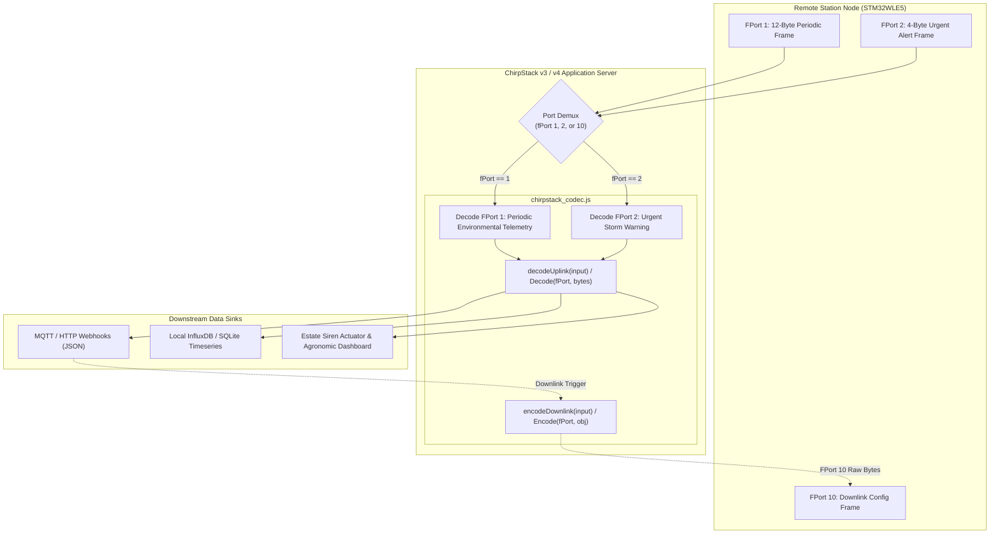

# Task Specification: S5-T2.1 - ChirpStack v3/v4 JavaScript Payload Codec

## 1. Task Metadata & Overview

| Attribute | Specification Details |
| :--- | :--- |
| **Sprint** | **Sprint 5: Telemetry Protocol, LoRaWAN & Flash Storage** |
| **Task ID** | `S5-T2.1` |
| **Parent Task** | `S5-T2: Implement JavaScript Gateway Payload Decoders` |
| **Task Title** | Implement ChirpStack v3 & v4 JavaScript Payload Codec (`chirpstack_codec.js`) |
| **Status** | **Ready for Implementation** |
| **Target Files** | [`tools/decoders/chirpstack_codec.js`](file:///C:/Users/ENERGY%20SAVER/Documents/Learning/Job%20Projects/rain-predict/tools/decoders/chirpstack_codec.js) |
| **Related Documents** | [`docs/architecture/telemetry-protocol.md`](file:///C:/Users/ENERGY%20SAVER/Documents/Learning/Job%20Projects/rain-predict/docs/architecture/telemetry-protocol.md)<br>[`docs/architecture/firmware-architecture.md`](file:///C:/Users/ENERGY%20SAVER/Documents/Learning/Job%20Projects/rain-predict/docs/architecture/firmware-architecture.md)<br>[`context/specs/s5-t1.1-periodic-telemetry-serializer.md`](file:///C:/Users/ENERGY%20SAVER/Documents/Learning/Job%20Projects/rain-predict/context/specs/s5-t1.1-periodic-telemetry-serializer.md)<br>[`context/specs/s5-t1.2-urgent-alert-serializer.md`](file:///C:/Users/ENERGY%20SAVER/Documents/Learning/Job%20Projects/rain-predict/context/specs/s5-t1.2-urgent-alert-serializer.md)<br>[`context/coding-standards.md`](file:///C:/Users/ENERGY%20SAVER/Documents/Learning/Job%20Projects/rain-predict/context/coding-standards.md) |
| **Dependencies** | [`S5-T1.1`](file:///C:/Users/ENERGY%20SAVER/Documents/Learning/Job%20Projects/rain-predict/context/specs/s5-t1.1-periodic-telemetry-serializer.md) (Periodic 12-Byte Binary Frame), [`S5-T1.2`](file:///C:/Users/ENERGY%20SAVER/Documents/Learning/Job%20Projects/rain-predict/context/specs/s5-t1.2-urgent-alert-serializer.md) (Alert 4-Byte Binary Frame) |
| **Downstream Tasks** | `S5-T2.2` (The Things Network Decoder), `S5-T2.3` (Automated Decoder Test Suite), `S7-T1` (System Verification) |

---

## 2. Executive Summary & Gateway Codec Architecture

The primary objective of **`S5-T2.1`** is to develop the **ChirpStack v3 & v4 JavaScript Payload Codec** in [`tools/decoders/chirpstack_codec.js`](file:///C:/Users/ENERGY%20SAVER/Documents/Learning/Job%20Projects/rain-predict/tools/decoders/chirpstack_codec.js) for the **Tea Plantation Rain Prediction System**.

In tea plantation IoT architectures, an on-site edge gateway (e.g. Raspberry Pi 4 / Industrial CM4 gateway running ChirpStack Network Server and local InfluxDB / SQLite telemetry brokers) receives raw LoRaWAN Sub-GHz frames from remote nodes. The ChirpStack payload codec runs inside an embedded ECMAScript JavaScript runtime (QuickJS / Otto) to transform raw byte buffers into rich, structured JSON documents before dispatching to downstream MQTT topics, sirens, and estate dashboards.



### Key Technical Capabilities:

1. **Dual ChirpStack Version Compatibility**:
   * **ChirpStack v4 API**: `decodeUplink(input)` where `input = { bytes: [...], fPort: 1 }`, returning `{ data: {...}, errors: [...] }`; `encodeDownlink(input)` where `input = { data: {...} }`, returning `{ bytes: [...], fPort: 10 }`.
   * **ChirpStack v3 API**: Legacy `Decode(fPort, bytes, variables)` and `Encode(fPort, obj, variables)` function signatures.
2. **Multi-Port Demultiplexing**:
   * **FPort 1 (12 Bytes)**: Decodes periodic ambient weather, nowcast alert states, Zambretti heuristic indices, $CPI\%$, cloud blackout alarms, and battery diagnostics.
   * **FPort 2 (4 Bytes)**: Decodes immediate convective storm alerts, trigger cause codes, signed pressure drop rate ($\Delta P_{1\text{h}}$), rain intensity tiers, and sequence tokens.
   * **FPort 10 (2–3 Bytes)**: Encodes and decodes downlink parameter configuration commands (sampling interval, altitude offset, alert thresholds, system reboot/rejoin).
3. **Zambretti Text & Letter Translation**:
   * Automatically translates numeric Zambretti indices ($1\dots 26$) to their respective forecast letters ('A' through 'Z') and descriptive English meteorological forecast strings (e.g., $1 \implies \text{"Settled Fine"}$, $26 \implies \text{"Severe Storm"}$).
4. **Defensive Error Handling**:
   * Rejects malformed or truncated byte arrays with clear error messages without raising unhandled runtime exceptions.

---

## 3. JSON Output Schemas & Port Specifications

### 3.1 FPort 1: Periodic Environmental Telemetry (12 Bytes)

#### Input Binary Format:
`[ T_MSB, T_LSB, RH_MSB, RH_LSB, P_MSB, P_LSB, Lux_MSB, Lux_LSB, Rain, Byte9, Byte10, Byte11 ]`

#### Decoded JSON Output Structure:
```json
{
  "data": {
    "temperature_c": 24.50,
    "humidity_pct": 85.25,
    "pressure_hpa": 945.50,
    "ambient_lux": 45000.0,
    "rain_interval_mm": 0.0,
    "forecast_state": "POSSIBLE",
    "forecast_state_code": 1,
    "zambretti_index": 14,
    "zambretti_letter": "N",
    "zambretti_text": "Fairly Fine, Showers Early",
    "composite_rain_prob_pct": 45,
    "solar_cloud_drop_alarm": false,
    "battery_v": 3.300,
    "sensor_fault": false,
    "unexpected_reset": false
  },
  "errors": [],
  "warnings": []
}
```

---

### 3.2 FPort 2: Urgent Storm Alert Warning (4 Bytes)

#### Input Binary Format:
`[ Byte0 (State/Trig/Seq), Byte1 (Solar/CPI), Byte2 (dP/dt), Byte3 (Rain/Fault/Vbat) ]`

#### Decoded JSON Output Structure:
```json
{
  "data": {
    "alert_state": "IMMINENT",
    "alert_state_code": 2,
    "trigger_cause": "CPI_THRESHOLD",
    "trigger_cause_code": 1,
    "alert_sequence_id": 3,
    "composite_rain_prob_pct": 88,
    "solar_cloud_drop_alarm": true,
    "pressure_rate_hpa_per_h": -3.50,
    "rain_intensity": "LIGHT",
    "rain_intensity_code": 1,
    "sensor_fault": false,
    "battery_v": 3.300
  },
  "errors": [],
  "warnings": []
}
```

---

### 3.3 FPort 10: Downlink Configuration Commands

| Command ID | Command Name | Arguments Schema | Encoded Bytes (BE) |
| :---: | :--- | :--- | :--- |
| **`0x01`** | **Set Sampling Interval** | `{ "interval_sec": 900 }` ($60\dots 3600\text{ s}$) | `[0x01, 0x03, 0x84]` |
| **`0x02`** | **Set Station Elevation** | `{ "elevation_m": 1550 }` ($0\dots 3000\text{ m}$) | `[0x02, 0x06, 0x0E]` |
| **`0x03`** | **Set Alert Thresholds** | `{ "cpi_watch_pct": 40, "cpi_alert_pct": 70 }` | `[0x03, 0x28, 0x46]` |
| **`0x04`** | **Trigger System Action** | `{ "action_code": 1 }` ($1=\text{Reset}, 2=\text{Rejoin}$) | `[0x04, 0x01]` |

---

## 4. Concrete File Implementation Blueprint

### 4.1 `tools/decoders/chirpstack_codec.js` Blueprint

```javascript
/**
 * @file    chirpstack_codec.js
 * @brief   ChirpStack v3 & v4 JavaScript Payload Codec for Tea Plantation Rain Prediction System.
 * @details Decodes FPort 1 (12-byte periodic) and FPort 2 (4-byte alert) uplinks; encodes FPort 10 downlinks.
 */

// =============================================================================
// Constants & Lookup Tables
// =============================================================================

var STATE_NAMES = ["UNLIKELY", "POSSIBLE", "IMMINENT", "ACTIVE_RAIN"];

var TRIGGER_CAUSES = [
    "MANUAL",
    "CPI_THRESHOLD",
    "PRESSURE_PLUNGE",
    "SOLAR_COLLAPSE",
    "FIRST_RAIN_TIP",
    "COMBINED_GRADIENT",
    "DEW_CONVERGENCE",
    "LOW_BATTERY"
];

var RAIN_INTENSITIES = ["NONE", "LIGHT", "MODERATE", "HEAVY"];

var ZAMBRETTI_TEXTS = {
    1:  { letter: "A", text: "Settled Fine" },
    2:  { letter: "B", text: "Fine Weather" },
    3:  { letter: "C", text: "Becoming Fine" },
    4:  { letter: "D", text: "Fine, Becoming Less Settled" },
    5:  { letter: "E", text: "Fine, Possible Showers" },
    6:  { letter: "F", text: "Fairly Fine, Improving" },
    7:  { letter: "G", text: "Fairly Fine, Possible Showers Early" },
    8:  { letter: "H", text: "Fairly Fine, Showers Later" },
    9:  { letter: "I", text: "Showers Early, Improving" },
    10: { letter: "J", text: "Changeable, Mending" },
    11: { letter: "K", text: "Fairly Fine, Showers Likely" },
    12: { letter: "L", text: "Rather Unsettled, Clearing Later" },
    13: { letter: "M", text: "Unsettled, Probably Improving" },
    14: { letter: "N", text: "Showers Early, Showers Later" },
    15: { letter: "O", text: "Showers at Times, Becoming Less Settled" },
    16: { letter: "P", text: "Changeable, Some Rain" },
    17: { letter: "Q", text: "Unsettled, Short Fine Intervals" },
    18: { letter: "R", text: "Unsettled, Rain at Times" },
    19: { letter: "S", text: "Unsettled, Rain Increasing" },
    20: { letter: "T", text: "Rain at Times, Worse Later" },
    21: { letter: "U", text: "Rain at Times, Becoming Very Unsettled" },
    22: { letter: "V", text: "Rain at Frequent Intervals" },
    23: { letter: "W", text: "Very Unsettled, Rain" },
    24: { letter: "X", text: "Stormy, Much Rain" },
    25: { letter: "Y", text: "Very Stormy, Heavy Rain" },
    26: { letter: "Z", text: "Severe Storm, Gale / Torrential Rain" }
};

// =============================================================================
// Internal Uplink Decoder Functions
// =============================================================================

/**
 * @brief Decodes 12-byte periodic environmental telemetry packet (FPort 1).
 */
function decodePeriodicTelemetry(bytes) {
    if (bytes.length < 12) {
        return { errors: ["Periodic payload too short (expected 12 bytes, got " + bytes.length + ")"] };
    }

    // Bytes 0..1: Temperature (Signed 16-bit Big-Endian, 0.01 °C)
    var rawTemp = (bytes[0] << 8) | bytes[1];
    if (rawTemp & 0x8000) {
        rawTemp -= 0x10000;
    }
    var temperature = rawTemp / 100.0;

    // Bytes 2..3: Relative Humidity (Unsigned 16-bit Big-Endian, 0.01 %RH)
    var rawHum = (bytes[2] << 8) | bytes[3];
    var humidity = rawHum / 100.0;

    // Bytes 4..5: Barometric Pressure (Unsigned 16-bit Big-Endian, Offset 300.0, 0.02 hPa)
    var rawPress = (bytes[4] << 8) | bytes[5];
    var pressure = 300.0 + (rawPress * 0.02);

    // Bytes 6..7: Ambient Solar Lux (Unsigned 16-bit Big-Endian, Scale 2.0 Lux)
    var rawLux = (bytes[6] << 8) | bytes[7];
    var lux = rawLux * 2.0;

    // Byte 8: Interval Accumulated Rain (Unsigned 8-bit, 0.20 mm)
    var rainMm = bytes[8] * 0.20;

    // Byte 9: Forecast State [7:6] & Zambretti Index [5:0]
    var stateCode = (bytes[9] >> 6) & 0x03;
    var zambrettiIdx = bytes[9] & 0x3F;
    var zamInfo = ZAMBRETTI_TEXTS[zambrettiIdx] || { letter: "?", text: "Unknown" };

    // Byte 10: Solar Drop Flag [7] & CPI Probability [6:0]
    var solarAlarm = (bytes[10] & 0x80) !== 0;
    var cpiPct = bytes[10] & 0x7F;

    // Byte 11: Unexpected Reset [7], Sensor Fault [6], Battery Vbat [5:0] (20mV step, 2.50V offset)
    var rstFlag = (bytes[11] & 0x80) !== 0;
    var sensorErr = (bytes[11] & 0x40) !== 0;
    var rawVbat = bytes[11] & 0x3F;
    var batteryV = 2.50 + (rawVbat * 0.020);

    return {
        data: {
            temperature_c: Number(temperature.toFixed(2)),
            humidity_pct: Number(humidity.toFixed(2)),
            pressure_hpa: Number(pressure.toFixed(2)),
            ambient_lux: Number(lux.toFixed(1)),
            rain_interval_mm: Number(rainMm.toFixed(2)),
            forecast_state: STATE_NAMES[stateCode] || "UNKNOWN",
            forecast_state_code: stateCode,
            zambretti_index: zambrettiIdx,
            zambretti_letter: zamInfo.letter,
            zambretti_text: zamInfo.text,
            composite_rain_prob_pct: cpiPct,
            solar_cloud_drop_alarm: solarAlarm,
            battery_v: Number(batteryV.toFixed(3)),
            sensor_fault: sensorErr,
            unexpected_reset: rstFlag
        },
        errors: [],
        warnings: []
    };
}

/**
 * @brief Decodes 4-byte urgent storm alert warning packet (FPort 2).
 */
function decodeUrgentAlert(bytes) {
    if (bytes.length < 4) {
        return { errors: ["Alert payload too short (expected 4 bytes, got " + bytes.length + ")"] };
    }

    // Byte 0: State [7:6], Trigger Cause [5:3], Sequence Token [2:0]
    var stateCode = (bytes[0] >> 6) & 0x03;
    var triggerCode = (bytes[0] >> 3) & 0x07;
    var seqId = bytes[0] & 0x07;

    // Byte 1: Solar Drop Flag [7], CPI Probability [6:0]
    var solarAlarm = (bytes[1] & 0x80) !== 0;
    var cpiPct = bytes[1] & 0x7F;

    // Byte 2: Barometric Pressure Rate dP/dt (Signed 8-bit, 0.05 hPa/hr)
    var rawRate = bytes[2];
    if (rawRate & 0x80) {
        rawRate -= 0x100;
    }
    var pressRate = rawRate * 0.05;

    // Byte 3: Rain Intensity [7:6], Sensor Fault [5], Battery Vbat [4:0] (40mV step, 2.50V offset)
    var rainTierCode = (bytes[3] >> 6) & 0x03;
    var sensorErr = (bytes[3] & 0x20) !== 0;
    var rawVbat = bytes[3] & 0x1F;
    var batteryV = 2.50 + (rawVbat * 0.040);

    return {
        data: {
            alert_state: STATE_NAMES[stateCode] || "UNKNOWN",
            alert_state_code: stateCode,
            trigger_cause: TRIGGER_CAUSES[triggerCode] || "UNKNOWN",
            trigger_cause_code: triggerCode,
            alert_sequence_id: seqId,
            composite_rain_prob_pct: cpiPct,
            solar_cloud_drop_alarm: solarAlarm,
            pressure_rate_hpa_per_h: Number(pressRate.toFixed(2)),
            rain_intensity: RAIN_INTENSITIES[rainTierCode] || "UNKNOWN",
            rain_intensity_code: rainTierCode,
            sensor_fault: sensorErr,
            battery_v: Number(batteryV.toFixed(3))
        },
        errors: [],
        warnings: []
    };
}

// =============================================================================
// ChirpStack v4 Interface Functions
// =============================================================================

/**
 * @brief ChirpStack v4 entry point for uplink decoding.
 * @param {object} input { bytes: [ ... ], fPort: number, variables: { ... } }
 * @returns {object} { data: { ... }, errors: [ ... ], warnings: [ ... ] }
 */
function decodeUplink(input) {
    if (!input || !input.bytes) {
        return { errors: ["Invalid input object or missing bytes array"] };
    }

    var fPort = input.fPort || 1;
    var bytes = input.bytes;

    if (fPort === 1) {
        return decodePeriodicTelemetry(bytes);
    } else if (fPort === 2) {
        return decodeUrgentAlert(bytes);
    } else {
        return {
            data: {},
            errors: ["Unsupported fPort: " + fPort + ". Expected fPort 1 (periodic) or 2 (alert)."],
            warnings: []
        };
    }
}

/**
 * @brief ChirpStack v4 entry point for downlink encoding.
 * @param {object} input { data: { ... }, variables: { ... } }
 * @returns {object} { bytes: [ ... ], fPort: 10, errors: [ ... ] }
 */
function encodeDownlink(input) {
    if (!input || !input.data) {
        return { errors: ["Missing input data object for downlink encoding"] };
    }

    var data = input.data;
    var bytes = [];

    if (data.interval_sec !== undefined) {
        // Command 0x01: Set Sampling Interval (Seconds: 60..3600)
        var interval = Math.max(60, Math.min(3600, Math.round(data.interval_sec)));
        bytes = [0x01, (interval >> 8) & 0xFF, interval & 0xFF];
    } else if (data.elevation_m !== undefined) {
        // Command 0x02: Set Station Elevation (Meters: 0..3000)
        var elev = Math.max(0, Math.min(3000, Math.round(data.elevation_m)));
        bytes = [0x02, (elev >> 8) & 0xFF, elev & 0xFF];
    } else if (data.cpi_watch_pct !== undefined && data.cpi_alert_pct !== undefined) {
        // Command 0x03: Set Alert Thresholds (CPI Watch %, CPI Alert %)
        var watch = Math.max(0, Math.min(100, Math.round(data.cpi_watch_pct)));
        var alert = Math.max(0, Math.min(100, Math.round(data.cpi_alert_pct)));
        bytes = [0x03, watch & 0xFF, alert & 0xFF];
    } else if (data.action_code !== undefined) {
        // Command 0x04: Trigger System Action (1 = Reset, 2 = Rejoin)
        var action = Math.round(data.action_code) & 0xFF;
        bytes = [0x04, action];
    } else {
        return { errors: ["Unrecognized downlink command schema in input data"] };
    }

    return {
        bytes: bytes,
        fPort: 10,
        errors: [],
        warnings: []
    };
}

// =============================================================================
// ChirpStack v3 Legacy Compatibility Functions
// =============================================================================

function Decode(fPort, bytes, variables) {
    var result = decodeUplink({ bytes: bytes, fPort: fPort, variables: variables });
    if (result.errors && result.errors.length > 0) {
        return { error: result.errors.join("; ") };
    }
    return result.data;
}

function Encode(fPort, obj, variables) {
    var result = encodeDownlink({ data: obj, variables: variables });
    if (result.errors && result.errors.length > 0) {
        return [];
    }
    return result.bytes;
}

// =============================================================================
// CommonJS Module Export (for Automated Node.js Testing)
// =============================================================================

if (typeof module !== "undefined" && module.exports) {
    module.exports = {
        decodeUplink: decodeUplink,
        encodeDownlink: encodeDownlink,
        Decode: Decode,
        Encode: Encode
    };
}
```

---

## 5. Defensive Programming & Quality Gates

1. **Explicit Two's-Complement Unpacking in JavaScript**:
   - Bitwise arithmetic in standard JavaScript converts numbers to 32-bit signed integers. Reconstructing 16-bit signed temperatures (`raw & 0x8000 ? raw - 0x10000 : raw`) and 8-bit signed pressure rates (`raw & 0x80 ? raw - 0x100 : raw`) guarantees correct negative numeric parsing across all JS engines.
2. **Fixed-Point Formatting (`.toFixed()`) Wrapped in `Number()`**:
   - Prevents floating-point representation anomalies (e.g. `24.500000000000004`) while maintaining native numeric types rather than strings in JSON payloads.
3. **Safe Zambretti Lookup Table Guard**:
   - Unknown or corrupted Zambretti codes safely resolve to `{ letter: "?", text: "Unknown" }` without throwing runtime `TypeError` exceptions.
4. **Comprehensive FPort Multiplexing**:
   - Explicitly rejects unauthorized or undefined application ports with structured error diagnostic arrays.

---

## 6. Verification & Test Matrix

| Test Case ID | Test Category | Execution Steps | Expected Result | Pass/Fail Criteria |
| :--- | :--- | :--- | :--- | :---: |
| **TC-S5-T2.1-01** | Periodic Payload Decoding (Daytime) | Pass FPort 1 and `{ 0x09, 0x92, 0x21, 0x4D, 0x7E, 0x13, 0x57, 0xE4, 0x00, 0x4E, 0x2D, 0x28 }` to `decodeUplink()`. | `temperature_c: 24.50`, `humidity_pct: 85.25`, `pressure_hpa: 945.50`, `ambient_lux: 45000.0`, `zambretti_letter: "N"`, `battery_v: 3.300`. | All fields match |
| **TC-S5-T2.1-02** | Periodic Sub-Zero Decoding | Pass FPort 1 and `{ 0xFB, 0x05, 0x27, 0x06, 0x63, 0xA6, 0x00, 0x00, 0x0C, 0x96, 0x4E, 0x1E }`. | `temperature_c: -12.75`, `humidity_pct: 99.90`, `rain_interval_mm: 2.40`, `battery_v: 3.100`. | Negative sign preserved |
| **TC-S5-T2.1-03** | Alert Payload Decoding (Severe Storm) | Pass FPort 2 and `{ 0x8B, 0xD8, 0xBA, 0x54 }`. | `alert_state: "IMMINENT"`, `trigger_cause: "CPI_THRESHOLD"`, `alert_sequence_id: 3`, `pressure_rate_hpa_per_h: -3.50`, `rain_intensity: "LIGHT"`. | Alert JSON verified |
| **TC-S5-T2.1-04** | Alert Pressure Drop Decoding | Pass FPort 2 and `{ 0x95, 0x5C, 0x98, 0x13 }`. | `pressure_rate_hpa_per_h: -5.20`, `battery_v: 3.260`, `trigger_cause: "PRESSURE_PLUNGE"`. | Drop rate verified |
| **TC-S5-T2.1-05** | Downlink Command 0x01 Encoding | Call `encodeDownlink({ data: { interval_sec: 900 } })`. | Returns `{ bytes: [0x01, 0x03, 0x84], fPort: 10 }`. | Correct byte array |
| **TC-S5-T2.1-06** | Downlink Command 0x02 Encoding | Call `encodeDownlink({ data: { elevation_m: 1550 } })`. | Returns `{ bytes: [0x02, 0x06, 0x0E], fPort: 10 }`. | Correct byte array |
| **TC-S5-T2.1-07** | Downlink Command 0x03 Encoding | Call `encodeDownlink({ data: { cpi_watch_pct: 40, cpi_alert_pct: 70 } })`. | Returns `{ bytes: [0x03, 0x28, 0x46], fPort: 10 }`. | Correct byte array |
| **TC-S5-T2.1-08** | Downlink Command 0x04 Encoding | Call `encodeDownlink({ data: { action_code: 1 } })`. | Returns `{ bytes: [0x04, 0x01], fPort: 10 }`. | Correct byte array |
| **TC-S5-T2.1-09** | Truncated Periodic Payload Guard | Pass FPort 1 and a 7-byte truncated buffer. | Returns error: `"Periodic payload too short (expected 12 bytes, got 7)"`. | Error caught |
| **TC-S5-T2.1-10** | Unsupported FPort Rejection | Pass FPort 99 with valid bytes. | Returns error: `"Unsupported fPort: 99"`. | Unknown port rejected |

---

## 7. Definition of Done Checklist

- [ ] [`tools/decoders/chirpstack_codec.js`](file:///C:/Users/ENERGY%20SAVER/Documents/Learning/Job%20Projects/rain-predict/tools/decoders/chirpstack_codec.js) authored with full ECMAScript compatibility for ChirpStack v4 (`decodeUplink`/`encodeDownlink`) and ChirpStack v3 (`Decode`/`Encode`).
- [ ] FPort 1 periodic decoder extracts all 12 bytes into physical engineering units with Zambretti English translations.
- [ ] FPort 2 urgent alert decoder parses trigger causes, sequence IDs, signed barometric rates ($\Delta P_{1\text{h}}$), and rain intensity tiers.
- [ ] FPort 10 downlink encoder serializes all 4 configuration commands (`0x01` through `0x04`).
- [ ] CommonJS module exports enabled for automated headless unit testing under Node.js.
- [ ] All 10 verification test cases in Section 6 pass with 100% success.
