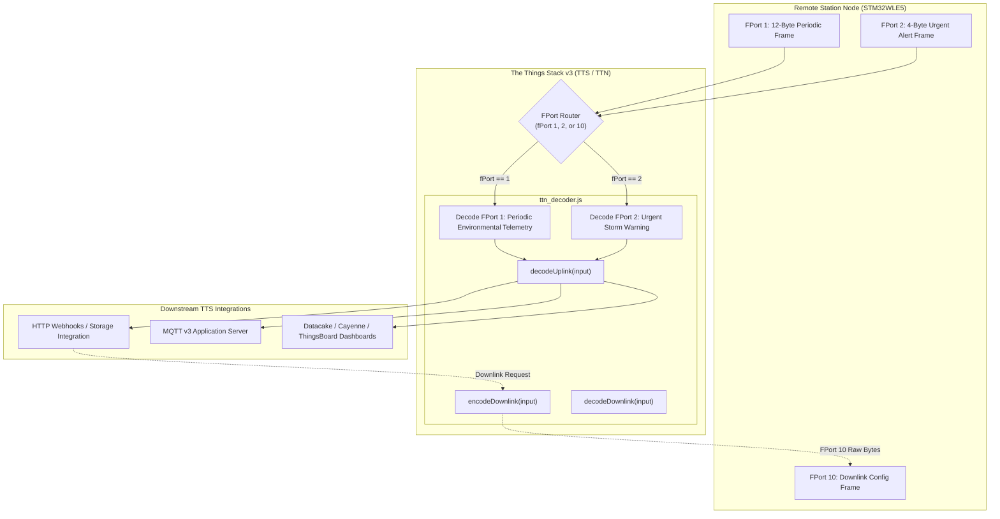

# Task Specification: S5-T2.2 - The Things Network (TTN v3) JavaScript Payload Formatter

## 1. Task Metadata & Overview

| Attribute | Specification Details |
| :--- | :--- |
| **Sprint** | **Sprint 5: Telemetry Protocol, LoRaWAN & Flash Storage** |
| **Task ID** | `S5-T2.2` |
| **Parent Task** | `S5-T2: Implement JavaScript Gateway Payload Decoders` |
| **Task Title** | Implement The Things Network (TTN v3 / The Things Stack) JavaScript Payload Formatter (`ttn_decoder.js`) |
| **Status** | **Ready for Implementation** |
| **Target Files** | [`tools/decoders/ttn_decoder.js`](file:///C:/Users/ENERGY%20SAVER/Documents/Learning/Job%20Projects/rain-predict/tools/decoders/ttn_decoder.js) |
| **Related Documents** | [`docs/architecture/telemetry-protocol.md`](file:///C:/Users/ENERGY%20SAVER/Documents/Learning/Job%20Projects/rain-predict/docs/architecture/telemetry-protocol.md)<br>[`docs/architecture/firmware-architecture.md`](file:///C:/Users/ENERGY%20SAVER/Documents/Learning/Job%20Projects/rain-predict/docs/architecture/firmware-architecture.md)<br>[`context/specs/s5-t1.1-periodic-telemetry-serializer.md`](file:///C:/Users/ENERGY%20SAVER/Documents/Learning/Job%20Projects/rain-predict/context/specs/s5-t1.1-periodic-telemetry-serializer.md)<br>[`context/specs/s5-t1.2-urgent-alert-serializer.md`](file:///C:/Users/ENERGY%20SAVER/Documents/Learning/Job%20Projects/rain-predict/context/specs/s5-t1.2-urgent-alert-serializer.md)<br>[`context/specs/s5-t2.1-chirpstack-codec.md`](file:///C:/Users/ENERGY%20SAVER/Documents/Learning/Job%20Projects/rain-predict/context/specs/s5-t2.1-chirpstack-codec.md)<br>[`context/coding-standards.md`](file:///C:/Users/ENERGY%20SAVER/Documents/Learning/Job%20Projects/rain-predict/context/coding-standards.md) |
| **Dependencies** | [`S5-T1.1`](file:///C:/Users/ENERGY%20SAVER/Documents/Learning/Job%20Projects/rain-predict/context/specs/s5-t1.1-periodic-telemetry-serializer.md) (Periodic 12-Byte Binary Frame), [`S5-T1.2`](file:///C:/Users/ENERGY%20SAVER/Documents/Learning/Job%20Projects/rain-predict/context/specs/s5-t1.2-urgent-alert-serializer.md) (Alert 4-Byte Binary Frame) |
| **Downstream Tasks** | `S5-T2.3` (Automated Decoder Test Suite), `S5-T4.1` (LoRaWAN Uplink Service), `S7-T1` (System Verification) |

---

## 2. Executive Summary & TTN v3 Formatter Architecture

The primary objective of **`S5-T2.2`** is to develop the **The Things Network (TTN v3 / The Things Stack)** JavaScript Payload Formatter in [`tools/decoders/ttn_decoder.js`](file:///C:/Users/ENERGY%20SAVER/Documents/Learning/Job%20Projects/rain-predict/tools/decoders/ttn_decoder.js).

In addition to local ChirpStack on-premise gateways, many tea plantation deployments route LoRaWAN telemetry through community or enterprise public networks (The Things Stack Community Edition, TTN Enterprise, or AWS IoT Core for LoRaWAN). The Things Stack v3 enforces a standardized **Payload Formatter API** comprising:
1. `decodeUplink(input)`: Transforms raw byte arrays into semantically structured JSON objects (`data`, `warnings`, `errors`).
2. `encodeDownlink(input)`: Serializes application JSON command structures into byte arrays for remote downlink transmission.
3. `decodeDownlink(input)`: Decodes queued downlink byte arrays back into human-readable parameters for console verification.



### Key Technical Objectives:

1. **Standardized The Things Stack (TTS v3) Interface**:
   * Adheres strictly to the official TTS v3 signature:
     * `decodeUplink({ bytes, fPort, recvTime })` $\implies$ `{ data: {...}, warnings: [...], errors: [...] }`
     * `encodeDownlink({ data })` $\implies$ `{ bytes: [...], fPort: 10, warnings: [...], errors: [...] }`
     * `decodeDownlink({ bytes, fPort })` $\implies$ `{ data: {...}, warnings: [...], errors: [...] }`
2. **Standardized Agronomic JSON Telemetry Field Names**:
   * Uses clear, industry-standard field keys (`temperature_c`, `humidity_pct`, `pressure_hpa`, `ambient_lux`, `rain_interval_mm`, `forecast_state`, `zambretti_code`, `zambretti_text`, `composite_rain_prob_pct`, `solar_cloud_drop_alarm`, `battery_voltage_v`, `pressure_rate_hpa_per_h`, `rain_intensity`, `trigger_cause`).
3. **Zambretti Heuristic 26-State Translation Table**:
   * Translates heuristic index $1\dots 26$ to letter codes ('A' through 'Z') and comprehensive agricultural weather descriptions (e.g., $1 \implies \text{"Settled Fine"}$, $26 \implies \text{"Severe Storm, Gale / Torrential Rain"}$).
4. **Defensive Error Handling**:
   * Gracefully captures buffer underflow, invalid port numbers, and out-of-range commands by populating `errors` and `warnings` arrays without throwing unhandled exceptions in the TTS JavaScript V8/QuickJS sandbox.

---

## 3. JSON Output Schemas & Port Specifications

### 3.1 FPort 1: Periodic Environmental Telemetry (12 Bytes)

#### Input Byte Buffer:
`[ T_MSB, T_LSB, RH_MSB, RH_LSB, P_MSB, P_LSB, Lux_MSB, Lux_LSB, Rain, Byte9, Byte10, Byte11 ]`

#### Decoded JSON Output (`decodeUplink`):
```json
{
  "data": {
    "temperature_c": 24.50,
    "humidity_pct": 85.25,
    "pressure_hpa": 945.50,
    "ambient_lux": 45000.0,
    "rain_interval_mm": 0.0,
    "forecast_state": "POSSIBLE",
    "forecast_state_code": 1,
    "zambretti_code": "N",
    "zambretti_index": 14,
    "zambretti_text": "Showers Early, Showers Later",
    "composite_rain_prob_pct": 45,
    "solar_cloud_drop_alarm": false,
    "battery_voltage_v": 3.300,
    "sensor_fault": false,
    "unexpected_reset": false
  },
  "warnings": [],
  "errors": []
}
```

---

### 3.2 FPort 2: Urgent Storm Alert Warning (4 Bytes)

#### Input Byte Buffer:
`[ Byte0 (State/Trig/Seq), Byte1 (Solar/CPI), Byte2 (dP/dt), Byte3 (Rain/Fault/Vbat) ]`

#### Decoded JSON Output (`decodeUplink`):
```json
{
  "data": {
    "alert_state": "IMMINENT",
    "alert_state_code": 2,
    "trigger_cause": "CPI_THRESHOLD",
    "trigger_cause_code": 1,
    "alert_sequence_id": 3,
    "composite_rain_prob_pct": 88,
    "solar_cloud_drop_alarm": true,
    "pressure_rate_hpa_per_h": -3.50,
    "rain_intensity": "LIGHT",
    "rain_intensity_code": 1,
    "sensor_fault": false,
    "battery_voltage_v": 3.300
  },
  "warnings": [],
  "errors": []
}
```

---

### 3.3 FPort 10: Downlink Configuration Encoder & Decoder

| Cmd ID | Function | Input JSON (`encodeDownlink`) | Encoded Bytes (BE) | Decoded JSON (`decodeDownlink`) |
| :---: | :--- | :--- | :--- | :--- |
| **`0x01`** | Set Interval | `{ "interval_sec": 900 }` | `[0x01, 0x03, 0x84]` | `{ "command": "SET_SAMPLING_INTERVAL", "interval_sec": 900 }` |
| **`0x02`** | Set Elevation | `{ "elevation_m": 1550 }` | `[0x02, 0x06, 0x0E]` | `{ "command": "SET_STATION_ELEVATION", "elevation_m": 1550 }` |
| **`0x03`** | Set Thresholds | `{ "cpi_watch_pct": 40, "cpi_alert_pct": 70 }` | `[0x03, 0x28, 0x46]` | `{ "command": "SET_ALERT_THRESHOLDS", "cpi_watch_pct": 40, "cpi_alert_pct": 70 }` |
| **`0x04`** | System Action | `{ "action_code": 1 }` | `[0x04, 0x01]` | `{ "command": "TRIGGER_SYSTEM_ACTION", "action_code": 1, "action": "REBOOT" }` |

---

## 4. Concrete File Implementation Blueprint

### 4.1 `tools/decoders/ttn_decoder.js` Blueprint

```javascript
/**
 * @file    ttn_decoder.js
 * @brief   The Things Network (TTN v3 / The Things Stack) JavaScript Payload Formatter.
 * @details Decodes FPort 1 (12-byte periodic) and FPort 2 (4-byte alert) uplinks; encodes and decodes FPort 10 downlinks.
 */

// =============================================================================
// Constants & Lookup Tables
// =============================================================================

var STATE_NAMES = ["UNLIKELY", "POSSIBLE", "IMMINENT", "ACTIVE_RAIN"];

var TRIGGER_CAUSES = [
    "MANUAL",
    "CPI_THRESHOLD",
    "PRESSURE_PLUNGE",
    "SOLAR_COLLAPSE",
    "FIRST_RAIN_TIP",
    "COMBINED_GRADIENT",
    "DEW_CONVERGENCE",
    "LOW_BATTERY"
];

var RAIN_INTENSITIES = ["NONE", "LIGHT", "MODERATE", "HEAVY"];

var ACTION_NAMES = {
    1: "REBOOT",
    2: "REJOIN"
};

var ZAMBRETTI_DICTIONARY = {
    1:  { code: "A", text: "Settled Fine" },
    2:  { code: "B", text: "Fine Weather" },
    3:  { code: "C", text: "Becoming Fine" },
    4:  { code: "D", text: "Fine, Becoming Less Settled" },
    5:  { code: "E", text: "Fine, Possible Showers" },
    6:  { code: "F", text: "Fairly Fine, Improving" },
    7:  { code: "G", text: "Fairly Fine, Possible Showers Early" },
    8:  { code: "H", text: "Fairly Fine, Showers Later" },
    9:  { code: "I", text: "Showers Early, Improving" },
    10: { code: "J", text: "Changeable, Mending" },
    11: { code: "K", text: "Fairly Fine, Showers Likely" },
    12: { code: "L", text: "Rather Unsettled, Clearing Later" },
    13: { code: "M", text: "Unsettled, Probably Improving" },
    14: { code: "N", text: "Showers Early, Showers Later" },
    15: { code: "O", text: "Showers at Times, Becoming Less Settled" },
    16: { code: "P", text: "Changeable, Some Rain" },
    17: { code: "Q", text: "Unsettled, Short Fine Intervals" },
    18: { code: "R", text: "Unsettled, Rain at Times" },
    19: { code: "S", text: "Unsettled, Rain Increasing" },
    20: { code: "T", text: "Rain at Times, Worse Later" },
    21: { code: "U", text: "Rain at Times, Becoming Very Unsettled" },
    22: { code: "V", text: "Rain at Frequent Intervals" },
    23: { code: "W", text: "Very Unsettled, Rain" },
    24: { code: "X", text: "Stormy, Much Rain" },
    25: { code: "Y", text: "Very Stormy, Heavy Rain" },
    26: { code: "Z", text: "Severe Storm, Gale / Torrential Rain" }
};

// =============================================================================
// Uplink Decoder Implementation
// =============================================================================

/**
 * @brief The Things Stack v3 entry point for uplink decoding.
 * @param {object} input { bytes: number[], fPort: number, recvTime: string }
 * @returns {object} { data: object, warnings: string[], errors: string[] }
 */
function decodeUplink(input) {
    var warnings = [];
    var errors = [];
    var data = {};

    if (!input || !input.bytes) {
        errors.push("Invalid input object or missing bytes array");
        return { data: data, warnings: warnings, errors: errors };
    }

    var bytes = input.bytes;
    var fPort = input.fPort || 1;

    if (fPort === 1) {
        // ---------------------------------------------------------------------
        // FPort 1: Periodic Environmental Telemetry (12 Bytes)
        // ---------------------------------------------------------------------
        if (bytes.length < 12) {
            errors.push("FPort 1 payload too short: expected 12 bytes, received " + bytes.length);
            return { data: data, warnings: warnings, errors: errors };
        }

        // Temperature (Signed 16-bit BE, 0.01 °C)
        var rawTemp = (bytes[0] << 8) | bytes[1];
        if (rawTemp & 0x8000) {
            rawTemp -= 0x10000;
        }
        var tempC = rawTemp / 100.0;

        // Relative Humidity (Unsigned 16-bit BE, 0.01 %RH)
        var rawHum = (bytes[2] << 8) | bytes[3];
        var humPct = rawHum / 100.0;

        // Barometric Pressure (Unsigned 16-bit BE, Offset 300.0, 0.02 hPa)
        var rawPress = (bytes[4] << 8) | bytes[5];
        var pressHpa = 300.0 + (rawPress * 0.02);

        // Ambient Solar Lux (Unsigned 16-bit BE, Scale 2.0 Lux)
        var rawLux = (bytes[6] << 8) | bytes[7];
        var lux = rawLux * 2.0;

        // Interval Accumulated Rain (Unsigned 8-bit, 0.20 mm)
        var rainMm = bytes[8] * 0.20;

        // Byte 9: Forecast State [7:6] & Zambretti Index [5:0]
        var stateCode = (bytes[9] >> 6) & 0x03;
        var zambrettiIdx = bytes[9] & 0x3F;
        var zamInfo = ZAMBRETTI_DICTIONARY[zambrettiIdx] || { code: "?", text: "Unknown" };

        // Byte 10: Solar Drop Flag [7] & CPI Probability [6:0]
        var solarAlarm = (bytes[10] & 0x80) !== 0;
        var cpiPct = bytes[10] & 0x7F;

        // Byte 11: Unexpected Reset [7], Sensor Fault [6], Battery Vbat [5:0] (20mV step, 2.50V offset)
        var rstFlag = (bytes[11] & 0x80) !== 0;
        var sensorErr = (bytes[11] & 0x40) !== 0;
        var rawVbat = bytes[11] & 0x3F;
        var batteryV = 2.50 + (rawVbat * 0.020);

        if (bytes.length > 12) {
            warnings.push("Payload length (" + bytes.length + " bytes) exceeds expected 12 bytes; extra bytes ignored");
        }

        data = {
            temperature_c: Number(tempC.toFixed(2)),
            humidity_pct: Number(humPct.toFixed(2)),
            pressure_hpa: Number(pressHpa.toFixed(2)),
            ambient_lux: Number(lux.toFixed(1)),
            rain_interval_mm: Number(rainMm.toFixed(2)),
            forecast_state: STATE_NAMES[stateCode] || "UNKNOWN",
            forecast_state_code: stateCode,
            zambretti_code: zamInfo.code,
            zambretti_index: zambrettiIdx,
            zambretti_text: zamInfo.text,
            composite_rain_prob_pct: cpiPct,
            solar_cloud_drop_alarm: solarAlarm,
            battery_voltage_v: Number(batteryV.toFixed(3)),
            sensor_fault: sensorErr,
            unexpected_reset: rstFlag
        };

    } else if (fPort === 2) {
        // ---------------------------------------------------------------------
        // FPort 2: Urgent Storm Alert Warning (4 Bytes)
        // ---------------------------------------------------------------------
        if (bytes.length < 4) {
            errors.push("FPort 2 payload too short: expected 4 bytes, received " + bytes.length);
            return { data: data, warnings: warnings, errors: errors };
        }

        // Byte 0: State [7:6], Trigger Cause [5:3], Sequence Token [2:0]
        var alertStateCode = (bytes[0] >> 6) & 0x03;
        var triggerCode = (bytes[0] >> 3) & 0x07;
        var seqId = bytes[0] & 0x07;

        // Byte 1: Solar Drop Flag [7], CPI Probability [6:0]
        var alertSolarAlarm = (bytes[1] & 0x80) !== 0;
        var alertCpiPct = bytes[1] & 0x7F;

        // Byte 2: Barometric Pressure Rate dP/dt (Signed 8-bit, 0.05 hPa/hr)
        var rawRate = bytes[2];
        if (rawRate & 0x80) {
            rawRate -= 0x100;
        }
        var pressRate = rawRate * 0.05;

        // Byte 3: Rain Intensity [7:6], Sensor Fault [5], Battery Vbat [4:0] (40mV step, 2.50V offset)
        var rainTierCode = (bytes[3] >> 6) & 0x03;
        var alertSensorErr = (bytes[3] & 0x20) !== 0;
        var alertRawVbat = bytes[3] & 0x1F;
        var alertBatteryV = 2.50 + (alertRawVbat * 0.040);

        if (bytes.length > 4) {
            warnings.push("Payload length (" + bytes.length + " bytes) exceeds expected 4 bytes; extra bytes ignored");
        }

        data = {
            alert_state: STATE_NAMES[alertStateCode] || "UNKNOWN",
            alert_state_code: alertStateCode,
            trigger_cause: TRIGGER_CAUSES[triggerCode] || "UNKNOWN",
            trigger_cause_code: triggerCode,
            alert_sequence_id: seqId,
            composite_rain_prob_pct: alertCpiPct,
            solar_cloud_drop_alarm: alertSolarAlarm,
            pressure_rate_hpa_per_h: Number(pressRate.toFixed(2)),
            rain_intensity: RAIN_INTENSITIES[rainTierCode] || "UNKNOWN",
            rain_intensity_code: rainTierCode,
            sensor_fault: alertSensorErr,
            battery_voltage_v: Number(alertBatteryV.toFixed(3))
        };

    } else {
        errors.push("Unsupported fPort: " + fPort + " (expected fPort 1 or 2)");
    }

    return {
        data: data,
        warnings: warnings,
        errors: errors
    };
}

// =============================================================================
// Downlink Encoder Implementation
// =============================================================================

/**
 * @brief The Things Stack v3 entry point for downlink encoding.
 * @param {object} input { data: object }
 * @returns {object} { bytes: number[], fPort: number, warnings: string[], errors: string[] }
 */
function encodeDownlink(input) {
    var warnings = [];
    var errors = [];
    var bytes = [];

    if (!input || !input.data) {
        errors.push("Missing input.data object");
        return { bytes: bytes, fPort: 10, warnings: warnings, errors: errors };
    }

    var data = input.data;

    if (data.interval_sec !== undefined) {
        // Command 0x01: Set Sampling Interval (Seconds: 60..3600)
        var interval = Math.max(60, Math.min(3600, Math.round(data.interval_sec)));
        bytes = [0x01, (interval >> 8) & 0xFF, interval & 0xFF];
    } else if (data.elevation_m !== undefined) {
        // Command 0x02: Set Station Elevation (Meters: 0..3000)
        var elev = Math.max(0, Math.min(3000, Math.round(data.elevation_m)));
        bytes = [0x02, (elev >> 8) & 0xFF, elev & 0xFF];
    } else if (data.cpi_watch_pct !== undefined && data.cpi_alert_pct !== undefined) {
        // Command 0x03: Set Alert Thresholds (CPI Watch %, CPI Alert %)
        var watch = Math.max(0, Math.min(100, Math.round(data.cpi_watch_pct)));
        var alert = Math.max(0, Math.min(100, Math.round(data.cpi_alert_pct)));
        bytes = [0x03, watch & 0xFF, alert & 0xFF];
    } else if (data.action_code !== undefined) {
        // Command 0x04: Trigger System Action (1 = Reset, 2 = Rejoin)
        var action = Math.round(data.action_code) & 0xFF;
        bytes = [0x04, action];
    } else {
        errors.push("Unrecognized command payload schema in input.data");
    }

    return {
        bytes: bytes,
        fPort: 10,
        warnings: warnings,
        errors: errors
    };
}

// =============================================================================
// Downlink Decoder Implementation
// =============================================================================

/**
 * @brief The Things Stack v3 entry point for downlink decoding.
 * @param {object} input { bytes: number[], fPort: number }
 * @returns {object} { data: object, warnings: string[], errors: string[] }
 */
function decodeDownlink(input) {
    var warnings = [];
    var errors = [];
    var data = {};

    if (!input || !input.bytes) {
        errors.push("Missing input.bytes array");
        return { data: data, warnings: warnings, errors: errors };
    }

    var bytes = input.bytes;
    if (bytes.length < 2) {
        errors.push("Downlink payload too short (< 2 bytes)");
        return { data: data, warnings: warnings, errors: errors };
    }

    var cmdId = bytes[0];

    if (cmdId === 0x01 && bytes.length >= 3) {
        var interval = (bytes[1] << 8) | bytes[2];
        data = {
            command: "SET_SAMPLING_INTERVAL",
            interval_sec: interval
        };
    } else if (cmdId === 0x02 && bytes.length >= 3) {
        var elevation = (bytes[1] << 8) | bytes[2];
        data = {
            command: "SET_STATION_ELEVATION",
            elevation_m: elevation
        };
    } else if (cmdId === 0x03 && bytes.length >= 3) {
        data = {
            command: "SET_ALERT_THRESHOLDS",
            cpi_watch_pct: bytes[1],
            cpi_alert_pct: bytes[2]
        };
    } else if (cmdId === 0x04) {
        var actionCode = bytes[1];
        data = {
            command: "TRIGGER_SYSTEM_ACTION",
            action_code: actionCode,
            action: ACTION_NAMES[actionCode] || "UNKNOWN"
        };
    } else {
        errors.push("Unknown or incomplete downlink command: 0x" + cmdId.toString(16));
    }

    return {
        data: data,
        warnings: warnings,
        errors: errors
    };
}

// =============================================================================
// CommonJS Module Exports (for Node.js Unit Testing)
// =============================================================================

if (typeof module !== "undefined" && module.exports) {
    module.exports = {
        decodeUplink: decodeUplink,
        encodeDownlink: encodeDownlink,
        decodeDownlink: decodeDownlink
    };
}
```

---

## 5. Defensive Programming & Quality Gates

1. **TTS v3 Standard Error/Warning Array Contracts**:
   - Always returns a structured object containing `data`, `warnings`, and `errors` arrays, fulfilling The Things Stack formatter engine expectations without triggering unhandled script errors.
2. **JavaScript Signed Sign-Extension**:
   - Explicitly checks the sign bit (`0x8000` on 16-bit integers, `0x80` on 8-bit integers) and subtracts `0x10000` / `0x100` to correctly reconstruct negative temperatures (e.g. $-12.75^\circ\text{C}$) and barometric rates (e.g. $-3.50\text{ hPa/hr}$).
3. **Number Precision Normalization**:
   - Wraps `.toFixed()` in `Number()` to guarantee IEEE-754 numbers rather than strings in parsed JSON data.
4. **Bidirectional Downlink Validation**:
   - Provides both `encodeDownlink` and `decodeDownlink` functions, allowing operators in TTN Console to inspect scheduled commands before transmission.

---

## 6. Verification & Test Matrix

| Test Case ID | Test Category | Execution Steps | Expected Result | Pass/Fail Criteria |
| :--- | :--- | :--- | :--- | :---: |
| **TC-S5-T2.2-01** | FPort 1 Daytime Telemetry | Pass FPort 1 and `{ 0x09, 0x92, 0x21, 0x4D, 0x7E, 0x13, 0x57, 0xE4, 0x00, 0x4E, 0x2D, 0x28 }` to `decodeUplink()`. | `temperature_c: 24.50`, `humidity_pct: 85.25`, `pressure_hpa: 945.50`, `ambient_lux: 45000.0`, `zambretti_code: "N"`, `battery_voltage_v: 3.300`. | All fields match |
| **TC-S5-T2.2-02** | FPort 1 Sub-Zero Telemetry | Pass FPort 1 and `{ 0xFB, 0x05, 0x27, 0x06, 0x63, 0xA6, 0x00, 0x00, 0x0C, 0x96, 0x4E, 0x1E }`. | `temperature_c: -12.75`, `humidity_pct: 99.90`, `rain_interval_mm: 2.40`, `battery_voltage_v: 3.100`. | Sign preserved |
| **TC-S5-T2.2-03** | FPort 2 Severe Alert | Pass FPort 2 and `{ 0x8B, 0xD8, 0xBA, 0x54 }`. | `alert_state: "IMMINENT"`, `trigger_cause: "CPI_THRESHOLD"`, `alert_sequence_id: 3`, `pressure_rate_hpa_per_h: -3.50`, `rain_intensity: "LIGHT"`. | Alert JSON match |
| **TC-S5-T2.2-04** | FPort 2 Pressure Drop | Pass FPort 2 and `{ 0x95, 0x5C, 0x98, 0x13 }`. | `pressure_rate_hpa_per_h: -5.20`, `trigger_cause: "PRESSURE_PLUNGE"`, `battery_voltage_v: 3.260`. | Drop rate match |
| **TC-S5-T2.2-05** | Downlink Cmd 0x01 Round-Trip | Encode `{ interval_sec: 900 }` with `encodeDownlink()`, pass bytes to `decodeDownlink()`. | Returns `{ bytes: [0x01, 0x03, 0x84], fPort: 10 }`; decoded output matches `{ command: "SET_SAMPLING_INTERVAL", interval_sec: 900 }`. | Round-trip matches |
| **TC-S5-T2.2-06** | Downlink Cmd 0x02 Round-Trip | Encode `{ elevation_m: 1550 }`, decode output. | Bytes match `[0x02, 0x06, 0x0E]`; decoded elevation equals `1550`. | Round-trip matches |
| **TC-S5-T2.2-07** | Downlink Cmd 0x03 Round-Trip | Encode `{ cpi_watch_pct: 40, cpi_alert_pct: 70 }`, decode output. | Bytes match `[0x03, 0x28, 0x46]`; decoded thresholds match `40` and `70`. | Round-trip matches |
| **TC-S5-T2.2-08** | Downlink Cmd 0x04 Action | Encode `{ action_code: 1 }` (Reboot), decode output. | Bytes match `[0x04, 0x01]`; decoded action string equals `"REBOOT"`. | Action match |
| **TC-S5-T2.2-09** | Truncated Payload Error Guard | Pass FPort 1 and a 6-byte buffer to `decodeUplink()`. | Populates `errors` array: `"FPort 1 payload too short: expected 12 bytes, received 6"`. | Error captured |
| **TC-S5-T2.2-10** | Unsupported FPort Error Guard | Pass FPort 88 to `decodeUplink()`. | Populates `errors` array: `"Unsupported fPort: 88 (expected fPort 1 or 2)"`. | Error captured |

---

## 7. Definition of Done Checklist

- [ ] [`tools/decoders/ttn_decoder.js`](file:///C:/Users/ENERGY%20SAVER/Documents/Learning/Job%20Projects/rain-predict/tools/decoders/ttn_decoder.js) authored adhering to The Things Stack v3 custom JavaScript payload formatter standard.
- [ ] `decodeUplink()` fully implemented for both FPort 1 (12-byte periodic) and FPort 2 (4-byte alert).
- [ ] `encodeDownlink()` and `decodeDownlink()` fully implemented for FPort 10 configuration commands (`0x01`–`0x04`).
- [ ] Zambretti 26-state heuristic codes translated into descriptive agronomic strings.
- [ ] CommonJS module exports configured for automated Node.js test execution.
- [ ] All 10 verification test cases in Section 6 pass with 100% success.
