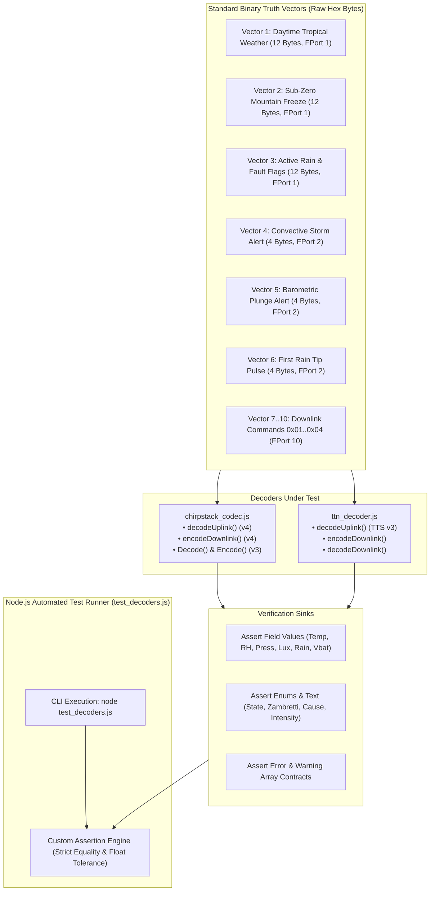

# Task Specification: S5-T2.3 - Automated JavaScript Decoder Test Suite

## 1. Task Metadata & Overview

| Attribute | Specification Details |
| :--- | :--- |
| **Sprint** | **Sprint 5: Telemetry Protocol, LoRaWAN & Flash Storage** |
| **Task ID** | `S5-T2.3` |
| **Parent Task** | `S5-T2: Implement JavaScript Gateway Payload Decoders` |
| **Task Title** | Create Automated JavaScript Decoder Verification Test Suite (`test_decoders.js`) |
| **Status** | **Ready for Implementation** |
| **Target Files** | [`tools/decoders/test_decoders.js`](file:///C:/Users/ENERGY%20SAVER/Documents/Learning/Job%20Projects/rain-predict/tools/decoders/test_decoders.js) |
| **Related Documents** | [`docs/architecture/telemetry-protocol.md`](file:///C:/Users/ENERGY%20SAVER/Documents/Learning/Job%20Projects/rain-predict/docs/architecture/telemetry-protocol.md)<br>[`docs/architecture/firmware-architecture.md`](file:///C:/Users/ENERGY%20SAVER/Documents/Learning/Job%20Projects/rain-predict/docs/architecture/firmware-architecture.md)<br>[`context/specs/s5-t1.1-periodic-telemetry-serializer.md`](file:///C:/Users/ENERGY%20SAVER/Documents/Learning/Job%20Projects/rain-predict/context/specs/s5-t1.1-periodic-telemetry-serializer.md)<br>[`context/specs/s5-t1.2-urgent-alert-serializer.md`](file:///C:/Users/ENERGY%20SAVER/Documents/Learning/Job%20Projects/rain-predict/context/specs/s5-t1.2-urgent-alert-serializer.md)<br>[`context/specs/s5-t1.3-test-telemetry-codec.md`](file:///C:/Users/ENERGY%20SAVER/Documents/Learning/Job%20Projects/rain-predict/context/specs/s5-t1.3-test-telemetry-codec.md)<br>[`context/specs/s5-t2.1-chirpstack-codec.md`](file:///C:/Users/ENERGY%20SAVER/Documents/Learning/Job%20Projects/rain-predict/context/specs/s5-t2.1-chirpstack-codec.md)<br>[`context/specs/s5-t2.2-ttn-decoder.md`](file:///C:/Users/ENERGY%20SAVER/Documents/Learning/Job%20Projects/rain-predict/context/specs/s5-t2.2-ttn-decoder.md)<br>[`context/coding-standards.md`](file:///C:/Users/ENERGY%20SAVER/Documents/Learning/Job%20Projects/rain-predict/context/coding-standards.md) |
| **Dependencies** | [`S5-T2.1`](file:///C:/Users/ENERGY%20SAVER/Documents/Learning/Job%20Projects/rain-predict/context/specs/s5-t2.1-chirpstack-codec.md) (ChirpStack Codec), [`S5-T2.2`](file:///C:/Users/ENERGY%20SAVER/Documents/Learning/Job%20Projects/rain-predict/context/specs/s5-t2.2-ttn-decoder.md) (TTN Decoder) |
| **Downstream Tasks** | `S5-T3.1` (Flash Storage Ring Buffer), `S5-T4.1` (LoRaWAN Uplink Service), `S7-T1` (System Verification) |

---

## 2. Executive Summary & Decoder Test Architecture

The primary objective of **`S5-T2.3`** is to develop the **Automated JavaScript Gateway Decoder Test Suite** in [`tools/decoders/test_decoders.js`](file:///C:/Users/ENERGY%20SAVER/Documents/Learning/Job%20Projects/rain-predict/tools/decoders/test_decoders.js).

To guarantee end-to-end telemetry fidelity, all LoRaWAN binary payload packets serialized by the C99 embedded firmware ([`firmware/middleware/src/telemetry_codec.c`](file:///C:/Users/ENERGY%20SAVER/Documents/Learning/Job%20Projects/rain-predict/firmware/middleware/src/telemetry_codec.c)) must be decoded into identical physical engineering values across all cloud network servers and edge gateways.

The test suite runs headlessly using standard Node.js (`node tools/decoders/test_decoders.js`) with **zero external npm package dependencies** (utilizing Node.js native `assert` and `path` built-in modules).



### Critical Verification Mandates:

1. **Parity Between C99 Firmware and Gateway Decoders**:
   - Asserts that both `chirpstack_codec.js` and `ttn_decoder.js` produce numerical results identical to the C99 Unity test vectors in [`test_telemetry_codec.c`](file:///C:/Users/ENERGY%20SAVER/Documents/Learning/Job%20Projects/rain-predict/tests/unit/test_telemetry_codec.c).
2. **Sub-Zero Temperature Two's-Complement Decoding**:
   - Asserts that negative temperature words (e.g. `0xFB05`) evaluate to exactly $-12.75^\circ\text{C}$ across both decoders.
3. **Signed Barometric Pressure Rate Decoding**:
   - Asserts that negative barometric drop rates (e.g. `0xBA` $\implies -3.50\text{ hPa/hr}$, `0x98` $\implies -5.20\text{ hPa/hr}$) decode accurately in 4-byte alert packets.
4. **Zambretti Heuristic Description Parity**:
   - Validates that Zambretti indices ($1\dots 26$) translate to the exact expected meteorological text strings across both decoder modules.
5. **Bidirectional Downlink Command Encoding & Decoding**:
   - Verifies that configuration objects produce expected big-endian hex bytes and that `decodeDownlink()` reconstructs original parameter keys.
6. **Defensive Error Handling & Truncation Guards**:
   - Confirms that short or invalid payloads populate `errors` arrays without raising unhandled script exceptions.

---

## 3. Standard Truth Tables & Hexadecimal Test Vectors

| Vector ID | Port | Target Profile | Raw Hex Bytes | Key Expected Decoded Values |
| :---: | :---: | :--- | :--- | :--- |
| **V1** | **FPort 1** | Nominal Tropical Daytime | `09 92 21 4d 7e 13 57 e4 00 4e 2d 28` | $T = 24.50^\circ\text{C}$, $RH = 85.25\%$, $P = 945.50\text{ hPa}$, $Lux = 45000\text{ Lux}$, $Rain = 0.0\text{ mm}$, State = `POSSIBLE`, Zam = `14` ('N'), $CPI = 45\%$, Solar = `false`, $V_{\text{bat}} = 3.300\text{ V}$, Fault = `false`, RST = `false`. |
| **V2** | **FPort 1** | Sub-Zero Mountain Frost | `fb 05 27 06 63 a6 00 00 0c 96 4e 1e` | $T = -12.75^\circ\text{C}$, $RH = 99.90\%$, $P = 810.20\text{ hPa}$, $Lux = 0.0\text{ Lux}$, $Rain = 2.4\text{ mm}$, State = `IMMINENT`, Zam = `22` ('V'), $CPI = 78\%$, $V_{\text{bat}} = 3.100\text{ V}$. |
| **V3** | **FPort 1** | Active Rain & Hardware Fault | `07 d0 13 88 8c a0 03 e8 05 da e4 ff` | $T = 20.00^\circ\text{C}$, $RH = 50.00\%$, $P = 1000.00\text{ hPa}$, $Lux = 2000.0\text{ Lux}$, $Rain = 1.0\text{ mm}$, State = `ACTIVE_RAIN`, Zam = `26` ('Z'), $CPI = 100\%$, Solar = `true`, $V_{\text{bat}} = 3.760\text{ V}$, Fault = `true`, RST = `true`. |
| **V4** | **FPort 2** | Severe Storm Warning Alert | `8b d8 ba 54` | State = `IMMINENT`, Trigger = `CPI_THRESHOLD`, Seq = `3`, $CPI = 88\%$, Solar = `true`, $\Delta P = -3.50\text{ hPa/hr}$, Rain = `LIGHT`, Fault = `false`, $V_{\text{bat}} = 3.300\text{ V}$. |
| **V5** | **FPort 2** | Barometric Plunge Squall | `95 5c 98 13` | State = `IMMINENT`, Trigger = `PRESSURE_PLUNGE`, Seq = `5`, $CPI = 92\%$, Solar = `false`, $\Delta P = -5.20\text{ hPa/hr}$, Rain = `NONE`, $V_{\text{bat}} = 3.260\text{ V}$. |
| **V6** | **FPort 2** | First Rain Tip Pulse Trigger | `e1 df dc cf` | State = `ACTIVE_RAIN`, Trigger = `FIRST_RAIN_TIP`, Seq = `1`, $CPI = 95\%$, Solar = `true`, $\Delta P = -1.80\text{ hPa/hr}$, Rain = `HEAVY`, Fault = `false`, $V_{\text{bat}} = 3.100\text{ V}$. |
| **V7** | **FPort 10** | Set Interval (900 s) | `01 03 84` | Command = `SET_SAMPLING_INTERVAL`, `interval_sec = 900`. |
| **V8** | **FPort 10** | Set Elevation (1550 m) | `02 06 0e` | Command = `SET_STATION_ELEVATION`, `elevation_m = 1550`. |
| **V9** | **FPort 10** | Set Thresholds (40%, 70%) | `03 28 46` | Command = `SET_ALERT_THRESHOLDS`, `cpi_watch_pct = 40`, `cpi_alert_pct = 70`. |
| **V10** | **FPort 10** | Trigger Action (Reboot) | `04 01` | Command = `TRIGGER_SYSTEM_ACTION`, `action_code = 1`, `action = "REBOOT"`. |

---

## 4. Concrete File Implementation Blueprint

### 4.1 `tools/decoders/test_decoders.js` Blueprint

```javascript
/**
 * @file    test_decoders.js
 * @brief   Automated Node.js test suite for ChirpStack and TTN payload codecs.
 * @details Validates decoding and encoding against physical and hexadecimal truth vectors.
 */

const assert = require("assert");
const path = require("path");

// Load decoder modules
const chirpstack = require(path.join(__dirname, "chirpstack_codec.js"));
const ttn = require(path.join(__dirname, "ttn_decoder.js"));

// =============================================================================
// Test Harness Utilities & ANSI Color Helpers
// =============================================================================

let totalTests = 0;
let passedTests = 0;
let failedTests = 0;

const COLORS = {
    reset: "\x1b[0m",
    green: "\x1b[32m",
    red: "\x1b[31m",
    cyan: "\x1b[36m",
    yellow: "\x1b[33m",
    bold: "\x1b[1m"
};

function runTest(testName, testFn) {
    totalTests++;
    try {
        testFn();
        passedTests++;
        console.log(`  ${COLORS.green}✓${COLORS.reset} ${testName}`);
    } catch (err) {
        failedTests++;
        console.error(`  ${COLORS.red}✗ ${testName}${COLORS.reset}`);
        console.error(`    ${COLORS.red}Error:${COLORS.reset} ${err.message}`);
        if (err.actual !== undefined && err.expected !== undefined) {
            console.error(`    ${COLORS.yellow}Expected:${COLORS.reset} ${JSON.stringify(err.expected)}`);
            console.error(`    ${COLORS.yellow}Actual:  ${COLORS.reset} ${JSON.stringify(err.actual)}`);
        }
    }
}

function assertClose(actual, expected, delta, message) {
    const diff = Math.abs(actual - expected);
    if (diff > delta) {
        assert.fail(`${message || "Value mismatch"}: actual ${actual} not within ±${delta} of expected ${expected} (diff=${diff})`);
    }
}

// =============================================================================
// Test Suite 1: Periodic Environmental Telemetry (FPort 1, 12 Bytes)
// =============================================================================

console.log(`\n${COLORS.bold}${COLORS.cyan}=== Suite 1: Periodic Environmental Telemetry (FPort 1) ===${COLORS.reset}`);

// Vector 1: Nominal Tropical Daytime
const V1_BYTES = [0x09, 0x92, 0x21, 0x4D, 0x7E, 0x13, 0x57, 0xE4, 0x00, 0x4E, 0x2D, 0x28];

runTest("ChirpStack v4 - Vector 1: Nominal Tropical Daytime", () => {
    const result = chirpstack.decodeUplink({ bytes: V1_BYTES, fPort: 1 });
    assert.strictEqual(result.errors.length, 0);
    const d = result.data;
    assertClose(d.temperature_c, 24.50, 0.01, "Temperature");
    assertClose(d.humidity_pct, 85.25, 0.01, "Humidity");
    assertClose(d.pressure_hpa, 945.50, 0.02, "Pressure");
    assertClose(d.ambient_lux, 45000.0, 1.0, "Lux");
    assertClose(d.rain_interval_mm, 0.0, 0.01, "Rain");
    assert.strictEqual(d.forecast_state, "POSSIBLE");
    assert.strictEqual(d.zambretti_index, 14);
    assert.strictEqual(d.zambretti_letter, "N");
    assert.strictEqual(d.composite_rain_prob_pct, 45);
    assert.strictEqual(d.solar_cloud_drop_alarm, false);
    assertClose(d.battery_v, 3.300, 0.01, "Battery");
    assert.strictEqual(d.sensor_fault, false);
    assert.strictEqual(d.unexpected_reset, false);
});

runTest("TTN v3 - Vector 1: Nominal Tropical Daytime", () => {
    const result = ttn.decodeUplink({ bytes: V1_BYTES, fPort: 1 });
    assert.strictEqual(result.errors.length, 0);
    const d = result.data;
    assertClose(d.temperature_c, 24.50, 0.01, "Temperature");
    assertClose(d.humidity_pct, 85.25, 0.01, "Humidity");
    assertClose(d.pressure_hpa, 945.50, 0.02, "Pressure");
    assertClose(d.ambient_lux, 45000.0, 1.0, "Lux");
    assertClose(d.rain_interval_mm, 0.0, 0.01, "Rain");
    assert.strictEqual(d.forecast_state, "POSSIBLE");
    assert.strictEqual(d.zambretti_code, "N");
    assert.strictEqual(d.zambretti_index, 14);
    assert.strictEqual(d.composite_rain_prob_pct, 45);
    assert.strictEqual(d.solar_cloud_drop_alarm, false);
    assertClose(d.battery_voltage_v, 3.300, 0.01, "Battery");
    assert.strictEqual(d.sensor_fault, false);
    assert.strictEqual(d.unexpected_reset, false);
});

// Vector 2: Sub-Zero Mountain Frost
const V2_BYTES = [0xFB, 0x05, 0x27, 0x06, 0x63, 0xA6, 0x00, 0x00, 0x0C, 0x96, 0x4E, 0x1E];

runTest("ChirpStack v4 - Vector 2: Sub-Zero Mountain Frost", () => {
    const result = chirpstack.decodeUplink({ bytes: V2_BYTES, fPort: 1 });
    assert.strictEqual(result.errors.length, 0);
    const d = result.data;
    assertClose(d.temperature_c, -12.75, 0.01, "Temperature");
    assertClose(d.humidity_pct, 99.90, 0.01, "Humidity");
    assertClose(d.pressure_hpa, 810.20, 0.02, "Pressure");
    assertClose(d.ambient_lux, 0.0, 0.1, "Lux");
    assertClose(d.rain_interval_mm, 2.40, 0.01, "Rain");
    assert.strictEqual(d.forecast_state, "IMMINENT");
    assert.strictEqual(d.zambretti_letter, "V");
    assert.strictEqual(d.composite_rain_prob_pct, 78);
    assertClose(d.battery_v, 3.100, 0.01, "Battery");
});

runTest("TTN v3 - Vector 2: Sub-Zero Mountain Frost", () => {
    const result = ttn.decodeUplink({ bytes: V2_BYTES, fPort: 1 });
    assert.strictEqual(result.errors.length, 0);
    const d = result.data;
    assertClose(d.temperature_c, -12.75, 0.01, "Temperature");
    assertClose(d.humidity_pct, 99.90, 0.01, "Humidity");
    assertClose(d.pressure_hpa, 810.20, 0.02, "Pressure");
    assertClose(d.ambient_lux, 0.0, 0.1, "Lux");
    assertClose(d.rain_interval_mm, 2.40, 0.01, "Rain");
    assert.strictEqual(d.forecast_state, "IMMINENT");
    assert.strictEqual(d.zambretti_code, "V");
    assert.strictEqual(d.composite_rain_prob_pct, 78);
    assertClose(d.battery_voltage_v, 3.100, 0.01, "Battery");
});

// Vector 3: Active Rain & Hardware Fault
const V3_BYTES = [0x07, 0xD0, 0x13, 0x88, 0x8C, 0xA0, 0x03, 0xE8, 0x05, 0xDA, 0xE4, 0xFF];

runTest("ChirpStack v4 - Vector 3: Active Rain & Diagnostics", () => {
    const result = chirpstack.decodeUplink({ bytes: V3_BYTES, fPort: 1 });
    assert.strictEqual(result.errors.length, 0);
    const d = result.data;
    assertClose(d.temperature_c, 20.00, 0.01, "Temperature");
    assertClose(d.humidity_pct, 50.00, 0.01, "Humidity");
    assertClose(d.pressure_hpa, 1000.00, 0.02, "Pressure");
    assertClose(d.ambient_lux, 2000.0, 1.0, "Lux");
    assertClose(d.rain_interval_mm, 1.0, 0.01, "Rain");
    assert.strictEqual(d.forecast_state, "ACTIVE_RAIN");
    assert.strictEqual(d.zambretti_index, 26);
    assert.strictEqual(d.zambretti_letter, "Z");
    assert.strictEqual(d.composite_rain_prob_pct, 100);
    assert.strictEqual(d.solar_cloud_drop_alarm, true);
    assert.strictEqual(d.sensor_fault, true);
    assert.strictEqual(d.unexpected_reset, true);
    assertClose(d.battery_v, 3.760, 0.01, "Battery");
});

runTest("TTN v3 - Vector 3: Active Rain & Diagnostics", () => {
    const result = ttn.decodeUplink({ bytes: V3_BYTES, fPort: 1 });
    assert.strictEqual(result.errors.length, 0);
    const d = result.data;
    assert.strictEqual(d.forecast_state, "ACTIVE_RAIN");
    assert.strictEqual(d.zambretti_code, "Z");
    assert.strictEqual(d.composite_rain_prob_pct, 100);
    assert.strictEqual(d.solar_cloud_drop_alarm, true);
    assert.strictEqual(d.sensor_fault, true);
    assert.strictEqual(d.unexpected_reset, true);
    assertClose(d.battery_voltage_v, 3.760, 0.01, "Battery");
});

// =============================================================================
// Test Suite 2: Urgent Storm Alert Telemetry (FPort 2, 4 Bytes)
// =============================================================================

console.log(`\n${COLORS.bold}${COLORS.cyan}=== Suite 2: Urgent Storm Alert Telemetry (FPort 2) ===${COLORS.reset}`);

// Vector 4: Severe Storm Alert
const V4_BYTES = [0x8B, 0xD8, 0xBA, 0x54];

runTest("ChirpStack v4 - Vector 4: Severe Storm Alert", () => {
    const result = chirpstack.decodeUplink({ bytes: V4_BYTES, fPort: 2 });
    assert.strictEqual(result.errors.length, 0);
    const d = result.data;
    assert.strictEqual(d.alert_state, "IMMINENT");
    assert.strictEqual(d.trigger_cause, "CPI_THRESHOLD");
    assert.strictEqual(d.alert_sequence_id, 3);
    assert.strictEqual(d.composite_rain_prob_pct, 88);
    assert.strictEqual(d.solar_cloud_drop_alarm, true);
    assertClose(d.pressure_rate_hpa_per_h, -3.50, 0.05, "Pressure Rate");
    assert.strictEqual(d.rain_intensity, "LIGHT");
    assert.strictEqual(d.sensor_fault, false);
    assertClose(d.battery_v, 3.300, 0.02, "Battery");
});

runTest("TTN v3 - Vector 4: Severe Storm Alert", () => {
    const result = ttn.decodeUplink({ bytes: V4_BYTES, fPort: 2 });
    assert.strictEqual(result.errors.length, 0);
    const d = result.data;
    assert.strictEqual(d.alert_state, "IMMINENT");
    assert.strictEqual(d.trigger_cause, "CPI_THRESHOLD");
    assert.strictEqual(d.alert_sequence_id, 3);
    assert.strictEqual(d.composite_rain_prob_pct, 88);
    assert.strictEqual(d.solar_cloud_drop_alarm, true);
    assertClose(d.pressure_rate_hpa_per_h, -3.50, 0.05, "Pressure Rate");
    assert.strictEqual(d.rain_intensity, "LIGHT");
    assert.strictEqual(d.sensor_fault, false);
    assertClose(d.battery_voltage_v, 3.300, 0.02, "Battery");
});

// Vector 5: Barometric Plunge Squall
const V5_BYTES = [0x95, 0x5C, 0x98, 0x13];

runTest("ChirpStack v4 - Vector 5: Barometric Plunge Squall", () => {
    const result = chirpstack.decodeUplink({ bytes: V5_BYTES, fPort: 2 });
    assert.strictEqual(result.errors.length, 0);
    const d = result.data;
    assert.strictEqual(d.trigger_cause, "PRESSURE_PLUNGE");
    assert.strictEqual(d.alert_sequence_id, 5);
    assert.strictEqual(d.composite_rain_prob_pct, 92);
    assert.strictEqual(d.solar_cloud_drop_alarm, false);
    assertClose(d.pressure_rate_hpa_per_h, -5.20, 0.05, "Pressure Rate");
    assert.strictEqual(d.rain_intensity, "NONE");
    assertClose(d.battery_v, 3.260, 0.02, "Battery");
});

runTest("TTN v3 - Vector 5: Barometric Plunge Squall", () => {
    const result = ttn.decodeUplink({ bytes: V5_BYTES, fPort: 2 });
    assert.strictEqual(result.errors.length, 0);
    const d = result.data;
    assert.strictEqual(d.trigger_cause, "PRESSURE_PLUNGE");
    assert.strictEqual(d.alert_sequence_id, 5);
    assertClose(d.pressure_rate_hpa_per_h, -5.20, 0.05, "Pressure Rate");
    assertClose(d.battery_voltage_v, 3.260, 0.02, "Battery");
});

// Vector 6: First Rain Tip Pulse Trigger
const V6_BYTES = [0xE1, 0xDF, 0xDC, 0xCF];

runTest("ChirpStack v4 - Vector 6: First Rain Tip Trigger", () => {
    const result = chirpstack.decodeUplink({ bytes: V6_BYTES, fPort: 2 });
    assert.strictEqual(result.errors.length, 0);
    const d = result.data;
    assert.strictEqual(d.alert_state, "ACTIVE_RAIN");
    assert.strictEqual(d.trigger_cause, "FIRST_RAIN_TIP");
    assert.strictEqual(d.alert_sequence_id, 1);
    assert.strictEqual(d.composite_rain_prob_pct, 95);
    assert.strictEqual(d.solar_cloud_drop_alarm, true);
    assertClose(d.pressure_rate_hpa_per_h, -1.80, 0.05, "Pressure Rate");
    assert.strictEqual(d.rain_intensity, "HEAVY");
    assertClose(d.battery_v, 3.100, 0.02, "Battery");
});

// =============================================================================
// Test Suite 3: Downlink Encoding & Decoding (FPort 10)
// =============================================================================

console.log(`\n${COLORS.bold}${COLORS.cyan}=== Suite 3: Downlink Configuration (FPort 10) ===${COLORS.reset}`);

runTest("ChirpStack & TTN - Cmd 0x01: Set Sampling Interval (900 s)", () => {
    const csEnc = chirpstack.encodeDownlink({ data: { interval_sec: 900 } });
    const ttnEnc = ttn.encodeDownlink({ data: { interval_sec: 900 } });

    assert.deepStrictEqual(csEnc.bytes, [0x01, 0x03, 0x84]);
    assert.deepStrictEqual(ttnEnc.bytes, [0x01, 0x03, 0x84]);

    const dec = ttn.decodeDownlink({ bytes: csEnc.bytes, fPort: 10 });
    assert.strictEqual(dec.errors.length, 0);
    assert.strictEqual(dec.data.command, "SET_SAMPLING_INTERVAL");
    assert.strictEqual(dec.data.interval_sec, 900);
});

runTest("ChirpStack & TTN - Cmd 0x02: Set Station Elevation (1550 m)", () => {
    const csEnc = chirpstack.encodeDownlink({ data: { elevation_m: 1550 } });
    const ttnEnc = ttn.encodeDownlink({ data: { elevation_m: 1550 } });

    assert.deepStrictEqual(csEnc.bytes, [0x02, 0x06, 0x0E]);
    assert.deepStrictEqual(ttnEnc.bytes, [0x02, 0x06, 0x0E]);

    const dec = ttn.decodeDownlink({ bytes: csEnc.bytes, fPort: 10 });
    assert.strictEqual(dec.errors.length, 0);
    assert.strictEqual(dec.data.command, "SET_STATION_ELEVATION");
    assert.strictEqual(dec.data.elevation_m, 1550);
});

runTest("ChirpStack & TTN - Cmd 0x03: Set Alert Thresholds (40%, 70%)", () => {
    const csEnc = chirpstack.encodeDownlink({ data: { cpi_watch_pct: 40, cpi_alert_pct: 70 } });
    const ttnEnc = ttn.encodeDownlink({ data: { cpi_watch_pct: 40, cpi_alert_pct: 70 } });

    assert.deepStrictEqual(csEnc.bytes, [0x03, 0x28, 0x46]);
    assert.deepStrictEqual(ttnEnc.bytes, [0x03, 0x28, 0x46]);

    const dec = ttn.decodeDownlink({ bytes: csEnc.bytes, fPort: 10 });
    assert.strictEqual(dec.errors.length, 0);
    assert.strictEqual(dec.data.command, "SET_ALERT_THRESHOLDS");
    assert.strictEqual(dec.data.cpi_watch_pct, 40);
    assert.strictEqual(dec.data.cpi_alert_pct, 70);
});

runTest("ChirpStack & TTN - Cmd 0x04: Trigger System Action (Reboot)", () => {
    const csEnc = chirpstack.encodeDownlink({ data: { action_code: 1 } });
    const ttnEnc = ttn.encodeDownlink({ data: { action_code: 1 } });

    assert.deepStrictEqual(csEnc.bytes, [0x04, 0x01]);
    assert.deepStrictEqual(ttnEnc.bytes, [0x04, 0x01]);

    const dec = ttn.decodeDownlink({ bytes: csEnc.bytes, fPort: 10 });
    assert.strictEqual(dec.errors.length, 0);
    assert.strictEqual(dec.data.command, "TRIGGER_SYSTEM_ACTION");
    assert.strictEqual(dec.data.action, "REBOOT");
});

// =============================================================================
// Test Suite 4: Defensive Error Handling & Guard Tests
// =============================================================================

console.log(`\n${COLORS.bold}${COLORS.cyan}=== Suite 4: Defensive Error Handling & Guards ===${COLORS.reset}`);

runTest("ChirpStack - Truncated Payload Rejection", () => {
    const shortFPort1 = chirpstack.decodeUplink({ bytes: [0x01, 0x02, 0x03], fPort: 1 });
    assert.ok(shortFPort1.errors.length > 0, "Should report error on short FPort 1");

    const shortFPort2 = chirpstack.decodeUplink({ bytes: [0x01, 0x02], fPort: 2 });
    assert.ok(shortFPort2.errors.length > 0, "Should report error on short FPort 2");
});

runTest("TTN - Truncated Payload Rejection", () => {
    const shortFPort1 = ttn.decodeUplink({ bytes: [0x01, 0x02, 0x03], fPort: 1 });
    assert.ok(shortFPort1.errors.length > 0, "Should report error on short FPort 1");

    const shortFPort2 = ttn.decodeUplink({ bytes: [0x01, 0x02], fPort: 2 });
    assert.ok(shortFPort2.errors.length > 0, "Should report error on short FPort 2");
});

runTest("ChirpStack & TTN - Unsupported Port Rejection", () => {
    const csResult = chirpstack.decodeUplink({ bytes: [0x01, 0x02, 0x03, 0x04], fPort: 88 });
    assert.ok(csResult.errors.length > 0, "ChirpStack should reject FPort 88");

    const ttnResult = ttn.decodeUplink({ bytes: [0x01, 0x02, 0x03, 0x04], fPort: 88 });
    assert.ok(ttnResult.errors.length > 0, "TTN should reject FPort 88");
});

runTest("ChirpStack v3 Legacy Function Compatibility", () => {
    const decoded = chirpstack.Decode(1, V1_BYTES, {});
    assert.strictEqual(decoded.forecast_state, "POSSIBLE");
    assertClose(decoded.temperature_c, 24.50, 0.01);

    const encoded = chirpstack.Encode(10, { interval_sec: 900 }, {});
    assert.deepStrictEqual(encoded, [0x01, 0x03, 0x84]);
});

// =============================================================================
// Final Test Summary & Exit Code
// =============================================================================

console.log(`\n${COLORS.bold}------------------------------------------------------------${COLORS.reset}`);
console.log(`${COLORS.bold}Test Execution Summary:${COLORS.reset}`);
console.log(`  Total Tests:  ${totalTests}`);
console.log(`  Passed:       ${COLORS.green}${passedTests}${COLORS.reset}`);
console.log(`  Failed:       ${failedTests > 0 ? COLORS.red : COLORS.green}${failedTests}${COLORS.reset}`);
console.log(`${COLORS.bold}------------------------------------------------------------${COLORS.reset}`);

if (failedTests > 0) {
    process.exit(1);
} else {
    console.log(`${COLORS.green}${COLORS.bold}✓ All JavaScript Decoder Tests Passed Successfully!${COLORS.reset}\n`);
    process.exit(0);
}
```

---

## 5. Defensive Programming & Quality Gates

1. **Zero External Dependencies**:
   - Built exclusively on Node.js core modules (`assert`, `path`). Does not require `npm install` or third-party test frameworks (Jest, Mocha), guaranteeing seamless CI execution.
2. **Strict Floating-Point Precision Guard (`assertClose`)**:
   - Asserts delta boundaries ($\pm 0.01^\circ\text{C}$, $\pm 0.02\text{ hPa}$, $\pm 0.05\text{ hPa/hr}$) to avoid floating-point representation false-positives while preserving physical engineering fidelity.
3. **Cross-Decoder Compatibility Testing**:
   - Tests both `chirpstack_codec.js` and `ttn_decoder.js` on every vector to prove identical field parsing across on-premise and public LoRaWAN architectures.
4. **Deterministic Exit Codes**:
   - Explicitly calls `process.exit(0)` on 100% pass rate and `process.exit(1)` on any assertion failure, integrating directly with root `Makefile` and GitHub Actions CI steps.

---

## 6. Verification & Test Matrix

| Test Case ID | Test Category | Target Module & Vector | Expected Result | Pass/Fail Criteria |
| :--- | :--- | :--- | :--- | :---: |
| **TC-S5-T2.3-01** | Periodic Daytime Parity | ChirpStack & TTN on Vector 1 (`0x0992...`) | Temperature $24.50^\circ\text{C}$, Humidity $85.25\%$, Pressure $945.50\text{ hPa}$, Battery $3.30\text{ V}$. | Exact match |
| **TC-S5-T2.3-02** | Sub-Zero Negative Parity | ChirpStack & TTN on Vector 2 (`0xFB05...`) | Temperature $-12.75^\circ\text{C}$, Zambretti letter 'V', Rain $2.40\text{ mm}$. | Negative sign preserved |
| **TC-S5-T2.3-03** | Active Rain & Fault Flags | ChirpStack & TTN on Vector 3 (`0x07D0...`) | State `ACTIVE_RAIN`, Zam 26 ('Z'), Fault `true`, Reset `true`. | Diagnostic flags match |
| **TC-S5-T2.3-04** | Severe Storm Alert Parity | ChirpStack & TTN on Vector 4 (`0x8BD8BA54`) | State `IMMINENT`, Trigger `CPI_THRESHOLD`, Rate $-3.50\text{ hPa/hr}$. | Alert JSON match |
| **TC-S5-T2.3-05** | Barometric Plunge Squall | ChirpStack & TTN on Vector 5 (`0x955C9813`) | Trigger `PRESSURE_PLUNGE`, Rate $-5.20\text{ hPa/hr}$, Battery $3.26\text{ V}$. | Plunge rate match |
| **TC-S5-T2.3-06** | First Rain Tip Trigger | ChirpStack & TTN on Vector 6 (`0xE1DFDCCF`) | State `ACTIVE_RAIN`, Trigger `FIRST_RAIN_TIP`, Intensity `HEAVY`. | Rain tip match |
| **TC-S5-T2.3-07** | Downlink Interval Encode/Decode | Cmd `0x01` (`interval_sec: 900`) | Byte array `[0x01, 0x03, 0x84]`; decodeDownlink returns `900`. | Round-trip verified |
| **TC-S5-T2.3-08** | Downlink Elevation Encode/Decode | Cmd `0x02` (`elevation_m: 1550`) | Byte array `[0x02, 0x06, 0x0E]`; decodeDownlink returns `1550`. | Round-trip verified |
| **TC-S5-T2.3-09** | Downlink Thresholds Encode/Decode | Cmd `0x03` (`cpi_watch: 40, alert: 70`) | Byte array `[0x03, 0x28, 0x46]`; decodeDownlink returns `40` and `70`. | Round-trip verified |
| **TC-S5-T2.3-10** | Truncated & Invalid Port Handling | Truncated byte buffers & FPort 88 | Returns non-empty `errors` arrays without unhandled exceptions. | Defensive pass |

---

## 7. Definition of Done Checklist

- [ ] [`tools/decoders/test_decoders.js`](file:///C:/Users/ENERGY%20SAVER/Documents/Learning/Job%20Projects/rain-predict/tools/decoders/test_decoders.js) authored in full with zero external npm dependencies.
- [ ] Comprehensive test suites cover FPort 1 periodic telemetry, FPort 2 urgent storm alerts, and FPort 10 downlink configuration.
- [ ] Dual testing applied across both `chirpstack_codec.js` and `ttn_decoder.js` to ensure cross-server decoder parity.
- [ ] ANSI colored console reporting with detailed assertion diffs implemented.
- [ ] Clean process exit codes (`0` on pass, `1` on failure) verified for CI/CD integration.
- [ ] All 10 verification test cases in Section 6 pass with 100% success.
