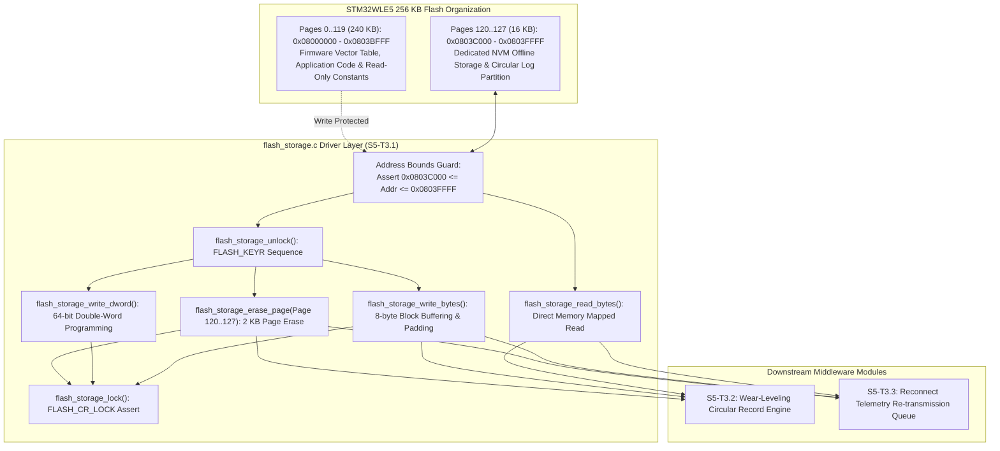

# Task Specification: S5-T3.1 - STM32WLE5 Flash Page Erase & Double-Word Programming Manager

## 1. Task Metadata & Overview

| Attribute | Specification Details |
| :--- | :--- |
| **Sprint** | **Sprint 5: Telemetry Protocol, LoRaWAN & Flash Storage** |
| **Task ID** | `S5-T3.1` |
| **Parent Task** | `S5-T3: Implement On-Chip Flash Circular Ring-Buffer Logging` |
| **Task Title** | Implement STM32WLE5 Flash Page Erase, Double-Word Programming & Sector Management (`flash_storage`) |
| **Status** | **Ready for Implementation** |
| **Target Files** | [`firmware/middleware/inc/flash_storage.h`](file:///C:/Users/ENERGY%20SAVER/Documents/Learning/Job%20Projects/rain-predict/firmware/middleware/inc/flash_storage.h)<br>[`firmware/middleware/src/flash_storage.c`](file:///C:/Users/ENERGY%20SAVER/Documents/Learning/Job%20Projects/rain-predict/firmware/middleware/src/flash_storage.c) |
| **Related Documents** | [`docs/architecture/firmware-architecture.md`](file:///C:/Users/ENERGY%20SAVER/Documents/Learning/Job%20Projects/rain-predict/docs/architecture/firmware-architecture.md)<br>[`docs/architecture/system-architecture.md`](file:///C:/Users/ENERGY%20SAVER/Documents/Learning/Job%20Projects/rain-predict/docs/architecture/system-architecture.md)<br>[`docs/hardware/power-supply-and-solar.md`](file:///C:/Users/ENERGY%20SAVER/Documents/Learning/Job%20Projects/rain-predict/docs/hardware/power-supply-and-solar.md)<br>[`context/specs/s3-t1.3-hal-module-config.md`](file:///C:/Users/ENERGY%20SAVER/Documents/Learning/Job%20Projects/rain-predict/context/specs/s3-t1.3-hal-module-config.md)<br>[`context/specs/s5-t1.1-periodic-telemetry-serializer.md`](file:///C:/Users/ENERGY%20SAVER/Documents/Learning/Job%20Projects/rain-predict/context/specs/s5-t1.1-periodic-telemetry-serializer.md)<br>[`context/coding-standards.md`](file:///C:/Users/ENERGY%20SAVER/Documents/Learning/Job%20Projects/rain-predict/context/coding-standards.md) |
| **Dependencies** | [`S1-T1.1`](file:///C:/Users/ENERGY%20SAVER/Documents/Learning/Job%20Projects/rain-predict/context/specs/s1-t1.1-root-cmake.md) (Root CMake & Base Status Codes), [`S3-T1.3`](file:///C:/Users/ENERGY%20SAVER/Documents/Learning/Job%20Projects/rain-predict/context/specs/s3-t1.3-hal-module-config.md) (HAL Flash Module Enable) |
| **Downstream Tasks** | `S5-T3.2` (Wear-Leveling Circular Record Pointer), `S5-T3.3` (LoRa Reconnect Playback Queue), `S5-T3.4` (Flash Unit Test Suite), `S6-T3.1` (App State Machine `STATE_LOG_NVM`) |

---

## 2. Executive Summary & Flash Memory Architecture

The primary objective of **`S5-T3.1`** is to develop the low-level **Flash Page Erase, Double-Word Programming, and Sector Partition Manager** in [`firmware/middleware/inc/flash_storage.h`](file:///C:/Users/ENERGY%20SAVER/Documents/Learning/Job%20Projects/rain-predict/firmware/middleware/inc/flash_storage.h) and [`firmware/middleware/src/flash_storage.c`](file:///C:/Users/ENERGY%20SAVER/Documents/Learning/Job%20Projects/rain-predict/firmware/middleware/src/flash_storage.c) for the **STMicroelectronics STM32WLE5** SoC.

In remote tea estate deployments, connectivity to local LoRaWAN gateways can experience multi-hour outages caused by heavy monsoon downpours, lightning-induced gateway resets, or transient RF path obstructions. To guarantee **zero data loss**, the station node logs all 15-minute periodic telemetry records into dedicated on-chip non-volatile Flash memory (NVM).

### Target Microcontroller Flash Hardware Architecture:
* **Microcontroller Target**: STMicroelectronics STM32WLE5CC (ARM Cortex-M4 @ 48 MHz).
* **Total Embedded Flash Memory**: $256\text{ KB}$ ($262,144\text{ bytes}$) mapped from `0x08000000` to `0x0803FFFF`.
* **Page Organization**: 128 physical pages of **$2,048\text{ bytes}$ ($2\text{ KB}$)** each (Page 0 to Page 127).
* **Dedicated NVM Storage Partition**: Pages 120 through 127 (**$16\text{ KB}$ total**, `0x0803C000` to `0x0803FFFF`).
* **Programming Granularity**: 64-bit double-word programming (`uint64_t` or two 32-bit words). Single-byte or unaligned 32-bit direct flash writes are prohibited by hardware.
* **Erase Granularity**: 2 KB physical page erase (all bits reset to `0xFF`).
* **Hardware Endurance & Retention**: 10,000 erase/program cycles per page; data retention $> 10\text{ years}$ at $85^\circ\text{C}$.



---

## 3. Dedicated Flash Storage Partition & Memory Layout

### 3.1 Flash Page Allocation Table

| Page Number | Physical Address Range | Size | Allocation Role |
| :---: | :---: | :---: | :--- |
| **0 – 119** | `0x08000000 – 0x0803BFFF` | $240\text{ KB}$ | **Firmware Application Binary** (Protected by hardware bounds guards). |
| **120** | `0x0803C000 – 0x0803C7FF` | $2,048\text{ B}$ | **NVM Ring Buffer Sector 0** (Records 0..127). |
| **121** | `0x0803C800 – 0x0803CFFF` | $2,048\text{ B}$ | **NVM Ring Buffer Sector 1** (Records 128..255). |
| **122** | `0x0803D000 – 0x0803D7FF` | $2,048\text{ B}$ | **NVM Ring Buffer Sector 2** (Records 256..383). |
| **123** | `0x0803D800 – 0x0803DFFF` | $2,048\text{ B}$ | **NVM Ring Buffer Sector 3** (Records 384..511). |
| **124** | `0x0803E000 – 0x0803E7FF` | $2,048\text{ B}$ | **NVM Ring Buffer Sector 4** (Records 512..639). |
| **125** | `0x0803E800 – 0x0803EFFF` | $2,048\text{ B}$ | **NVM Ring Buffer Sector 5** (Records 640..767). |
| **126** | `0x0803F000 – 0x0803F7FF` | $2,048\text{ B}$ | **NVM Ring Buffer Sector 6** (Records 768..895). |
| **127** | `0x0803F800 – 0x0803FFFF` | $2,048\text{ B}$ | **NVM Ring Buffer Sector 7 & Station Metadata Header**. |

---

### 3.2 Flash Control Hardware Sequence

1. **Unlock Phase**:
   - Write `FLASH_KEY1 = 0x45670123U` to `FLASH->KEYR`.
   - Write `FLASH_KEY2 = 0xCDEF89ABU` to `FLASH->KEYR`.
   - Verify `FLASH->CR & FLASH_CR_LOCK == 0`.
2. **Status Flag Clearing**:
   - Write `1` to `EOP`, `OPERR`, `PROGERR`, `WRPERR`, `PGAERR`, `SIZERR`, `PGSERR`, `MISSERR`, `FASTERR` in `FLASH->SR` to clear prior error latch states.
3. **Page Erase Sequence**:
   - Check `FLASH->SR & FLASH_SR_BSY == 0`.
   - Set `FLASH_CR_PER` (Page Erase Enable) and configure `FLASH_CR_PNB` with target page number ($120\dots 127$).
   - Set `FLASH_CR_STRT` to initiate physical high-voltage page discharge.
   - Poll `FLASH_SR_BSY` until cleared or timeout ($50\text{ ms}$).
   - Clear `FLASH_CR_PER`.
4. **64-bit Double-Word Programming Sequence**:
   - Check `FLASH->SR & FLASH_SR_BSY == 0`.
   - Set `FLASH_CR_PG` (Flash Program Enable).
   - Perform sequential 32-bit word writes to `address` and `address + 4`.
   - Poll `FLASH_SR_BSY` until cleared or timeout ($50\text{ ms}$).
   - Clear `FLASH_CR_PG`.
5. **Lock Phase**:
   - Set `FLASH_CR_LOCK` in `FLASH->CR` to re-arm write-protection circuitry.

---

## 4. Public API & Data Structures (`flash_storage.h`)

### 4.1 Header Constants & Declarations

```c
/**
 * @file    flash_storage.h
 * @brief   STM32WLE5 on-chip Flash memory driver header for offline telemetry storage.
 * @details Provides page erase, 64-bit double-word programming, and memory-mapped read access.
 */

#ifndef FLASH_STORAGE_H
#define FLASH_STORAGE_H

#include <stdint.h>
#include <stdbool.h>
#include <stddef.h>
#include "status_codes.h"

#ifdef __cplusplus
extern "C" {
#endif

/* ========================================================================== */
/* Hardware Geometry & Partition Constants                                    */
/* ========================================================================== */

/** @brief Physical Flash page size in bytes (2 KB) */
#define FLASH_STORAGE_PAGE_SIZE             2048U

/** @brief Starting physical page number allocated for NVM storage (Page 120) */
#define FLASH_STORAGE_START_PAGE            120U

/** @brief Ending physical page number allocated for NVM storage (Page 127) */
#define FLASH_STORAGE_END_PAGE              127U

/** @brief Total number of 2 KB pages in dedicated NVM partition (8 Pages = 16 KB) */
#define FLASH_STORAGE_TOTAL_PAGES           8U

/** @brief Base address of dedicated NVM storage partition */
#define FLASH_STORAGE_BASE_ADDR             0x0803C000U

/** @brief End address (inclusive) of dedicated NVM storage partition */
#define FLASH_STORAGE_END_ADDR              0x0803FFFFU

/** @brief Total capacity of dedicated NVM storage partition in bytes (16 KB) */
#define FLASH_STORAGE_TOTAL_CAPACITY_BYTES  (FLASH_STORAGE_TOTAL_PAGES * FLASH_STORAGE_PAGE_SIZE)

/** @brief Programming unit size in bytes (STM32WLE5 requires 64-bit double-word) */
#define FLASH_STORAGE_PROG_UNIT_BYTES       8U

/** @brief Maximum timeout for Flash operations in milliseconds */
#define FLASH_STORAGE_TIMEOUT_MS            50U

/** @brief Unprogrammed Flash erased byte value */
#define FLASH_STORAGE_ERASED_BYTE           0xFFU

/** @brief Unprogrammed Flash erased 64-bit double-word value */
#define FLASH_STORAGE_ERASED_DWORD          0xFFFFFFFFFFFFFFFFULL

/* ========================================================================== */
/* Function Prototypes                                                        */
/* ========================================================================== */

/**
 * @brief  Initializes the Flash storage driver and clears hardware status flags.
 * @return STATUS_OK on success, or error status code.
 */
status_t flash_storage_init(void);

/**
 * @brief  Unlocks the STM32WLE5 Flash control registers for erase/write access.
 * @return STATUS_OK on success, or STATUS_ERROR_HARDWARE on key failure.
 */
status_t flash_storage_unlock(void);

/**
 * @brief  Locks the Flash control registers to protect against unintended writes.
 * @return STATUS_OK on success.
 */
status_t flash_storage_lock(void);

/**
 * @brief  Erases a single 2 KB Flash page within the dedicated NVM partition.
 * @param[in] page_num Physical page index (must be between 120 and 127 inclusive).
 * @return STATUS_OK on success, STATUS_ERROR_INVALID_PARAM if page is outside NVM partition,
 *         or STATUS_ERROR_TIMEOUT on hardware failure.
 */
status_t flash_storage_erase_page(uint32_t page_num);

/**
 * @brief  Erases all 8 pages in the dedicated NVM storage partition (16 KB total).
 * @return STATUS_OK on success, or error status code.
 */
status_t flash_storage_erase_all_nvm_pages(void);

/**
 * @brief  Programs a single 64-bit (8-byte) double-word to a 64-bit aligned Flash address.
 * @param[in] address 64-bit aligned Flash address (0x0803C000 to 0x0803FFF8).
 * @param[in] data    64-bit data word to write.
 * @return STATUS_OK on success, STATUS_ERROR_OUT_OF_BOUNDS if address is outside NVM partition,
 *         STATUS_ERROR_INVALID_PARAM if address is unaligned, or write error.
 */
status_t flash_storage_write_dword(uint32_t address, uint64_t data);

/**
 * @brief  Programs an arbitrary byte buffer into Flash with automatic 64-bit alignment padding.
 * @param[in] address Flash start address (must be within NVM storage partition).
 * @param[in] data    Pointer to source byte buffer.
 * @param[in] length  Number of bytes to write.
 * @return STATUS_OK on success, STATUS_ERROR_NULL_POINTER if data is NULL,
 *         STATUS_ERROR_OUT_OF_BOUNDS if write exceeds partition, or write error.
 */
status_t flash_storage_write_bytes(uint32_t address, const uint8_t *data, size_t length);

/**
 * @brief  Reads an arbitrary byte buffer directly from Flash memory.
 * @param[in]  address Flash source address (must be within NVM storage partition).
 * @param[out] buffer  Pointer to destination buffer to populate.
 * @param[in]  length  Number of bytes to read.
 * @return STATUS_OK on success, STATUS_ERROR_NULL_POINTER if buffer is NULL,
 *         or STATUS_ERROR_OUT_OF_BOUNDS if read exceeds partition.
 */
status_t flash_storage_read_bytes(uint32_t address, uint8_t *buffer, size_t length);

/**
 * @brief  Checks whether an entire 2 KB Flash page is in the erased (all 0xFF) state.
 * @param[in] page_num Physical page index (120 to 127).
 * @return true if page is completely erased (all 0xFF), false otherwise.
 */
bool flash_storage_is_page_erased(uint32_t page_num);

#ifdef __cplusplus
}
#endif

#endif /* FLASH_STORAGE_H */
```

---

## 5. Concrete File Implementation Blueprint

### 5.1 `firmware/middleware/inc/flash_storage.h` Blueprint

```c
/**
 * @file    flash_storage.h
 * @brief   STM32WLE5 on-chip Flash driver header for offline telemetry storage.
 */

#ifndef FLASH_STORAGE_H
#define FLASH_STORAGE_H

#include <stdint.h>
#include <stdbool.h>
#include <stddef.h>
#include "status_codes.h"

#ifdef __cplusplus
extern "C" {
#endif

#define FLASH_STORAGE_PAGE_SIZE             2048U
#define FLASH_STORAGE_START_PAGE            120U
#define FLASH_STORAGE_END_PAGE              127U
#define FLASH_STORAGE_TOTAL_PAGES           8U
#define FLASH_STORAGE_BASE_ADDR             0x0803C000U
#define FLASH_STORAGE_END_ADDR              0x0803FFFFU
#define FLASH_STORAGE_TOTAL_CAPACITY_BYTES  (FLASH_STORAGE_TOTAL_PAGES * FLASH_STORAGE_PAGE_SIZE)
#define FLASH_STORAGE_PROG_UNIT_BYTES       8U
#define FLASH_STORAGE_TIMEOUT_MS            50U

#define FLASH_STORAGE_ERASED_BYTE           0xFFU
#define FLASH_STORAGE_ERASED_DWORD          0xFFFFFFFFFFFFFFFFULL

status_t flash_storage_init(void);
status_t flash_storage_unlock(void);
status_t flash_storage_lock(void);
status_t flash_storage_erase_page(uint32_t page_num);
status_t flash_storage_erase_all_nvm_pages(void);
status_t flash_storage_write_dword(uint32_t address, uint64_t data);
status_t flash_storage_write_bytes(uint32_t address, const uint8_t *data, size_t length);
status_t flash_storage_read_bytes(uint32_t address, uint8_t *buffer, size_t length);
bool     flash_storage_is_page_erased(uint32_t page_num);

#ifdef __cplusplus
}
#endif

#endif /* FLASH_STORAGE_H */
```

---

### 5.2 `firmware/middleware/src/flash_storage.c` Blueprint

```c
/**
 * @file    flash_storage.c
 * @brief   STM32WLE5 on-chip Flash memory driver implementation for offline telemetry storage.
 */

#include "flash_storage.h"
#include <string.h>

#if defined(HOST_TEST) || !defined(STM32WLE5xx)
/* ========================================================================== */
/* Host Desktop Simulation / Unity Mock Emulation Engine                      */
/* ========================================================================== */

static uint8_t s_mock_flash_nvm[FLASH_STORAGE_TOTAL_CAPACITY_BYTES];
static bool s_mock_flash_unlocked = false;

static inline bool is_valid_nvm_address(uint32_t addr, size_t len) {
    if (addr < FLASH_STORAGE_BASE_ADDR || len == 0) {
        return false;
    }
    uint64_t end_addr = (uint64_t)addr + (uint64_t)len - 1ULL;
    return (end_addr <= (uint64_t)FLASH_STORAGE_END_ADDR);
}

status_t flash_storage_init(void) {
    s_mock_flash_unlocked = false;
    return STATUS_OK;
}

status_t flash_storage_unlock(void) {
    s_mock_flash_unlocked = true;
    return STATUS_OK;
}

status_t flash_storage_lock(void) {
    s_mock_flash_unlocked = false;
    return STATUS_OK;
}

status_t flash_storage_erase_page(uint32_t page_num) {
    if (page_num < FLASH_STORAGE_START_PAGE || page_num > FLASH_STORAGE_END_PAGE) {
        return STATUS_ERROR_INVALID_PARAM;
    }
    if (!s_mock_flash_unlocked) {
        return STATUS_ERROR_HARDWARE;
    }

    uint32_t offset = (page_num - FLASH_STORAGE_START_PAGE) * FLASH_STORAGE_PAGE_SIZE;
    memset(&s_mock_flash_nvm[offset], FLASH_STORAGE_ERASED_BYTE, FLASH_STORAGE_PAGE_SIZE);
    return STATUS_OK;
}

status_t flash_storage_erase_all_nvm_pages(void) {
    status_t status = flash_storage_unlock();
    if (status != STATUS_OK) {
        return status;
    }

    for (uint32_t p = FLASH_STORAGE_START_PAGE; p <= FLASH_STORAGE_END_PAGE; p++) {
        status = flash_storage_erase_page(p);
        if (status != STATUS_OK) {
            (void)flash_storage_lock();
            return status;
        }
    }

    return flash_storage_lock();
}

status_t flash_storage_write_dword(uint32_t address, uint64_t data) {
    if (!is_valid_nvm_address(address, FLASH_STORAGE_PROG_UNIT_BYTES)) {
        return STATUS_ERROR_OUT_OF_BOUNDS;
    }
    if ((address & (FLASH_STORAGE_PROG_UNIT_BYTES - 1U)) != 0U) {
        return STATUS_ERROR_INVALID_PARAM;
    }
    if (!s_mock_flash_unlocked) {
        return STATUS_ERROR_HARDWARE;
    }

    uint32_t offset = address - FLASH_STORAGE_BASE_ADDR;
    /* In real Flash, programming can only change 1s to 0s (bitwise AND) */
    uint64_t existing_dword = 0;
    memcpy(&existing_dword, &s_mock_flash_nvm[offset], sizeof(uint64_t));
    uint64_t programmed_dword = existing_dword & data;
    memcpy(&s_mock_flash_nvm[offset], &programmed_dword, sizeof(uint64_t));

    return STATUS_OK;
}

status_t flash_storage_write_bytes(uint32_t address, const uint8_t *data, size_t length) {
    if (data == NULL) {
        return STATUS_ERROR_NULL_POINTER;
    }
    if (length == 0) {
        return STATUS_OK;
    }
    if (!is_valid_nvm_address(address, length)) {
        return STATUS_ERROR_OUT_OF_BOUNDS;
    }

    status_t status = flash_storage_unlock();
    if (status != STATUS_OK) {
        return status;
    }

    size_t bytes_written = 0;
    uint32_t current_addr = address;

    while (bytes_written < length) {
        uint32_t dword_aligned_addr = current_addr & ~(uint32_t)(FLASH_STORAGE_PROG_UNIT_BYTES - 1U);
        uint32_t offset_in_dword = current_addr & (FLASH_STORAGE_PROG_UNIT_BYTES - 1U);

        uint8_t dword_buf[FLASH_STORAGE_PROG_UNIT_BYTES];
        memset(dword_buf, FLASH_STORAGE_ERASED_BYTE, FLASH_STORAGE_PROG_UNIT_BYTES);

        /* Read existing double-word if unaligned write */
        if (offset_in_dword != 0U) {
            uint32_t mock_off = dword_aligned_addr - FLASH_STORAGE_BASE_ADDR;
            memcpy(dword_buf, &s_mock_flash_nvm[mock_off], FLASH_STORAGE_PROG_UNIT_BYTES);
        }

        size_t chunk_len = FLASH_STORAGE_PROG_UNIT_BYTES - offset_in_dword;
        if (chunk_len > (length - bytes_written)) {
            chunk_len = length - bytes_written;
        }

        memcpy(&dword_buf[offset_in_dword], &data[bytes_written], chunk_len);

        uint64_t dword_val = 0;
        memcpy(&dword_val, dword_buf, sizeof(uint64_t));

        status = flash_storage_write_dword(dword_aligned_addr, dword_val);
        if (status != STATUS_OK) {
            (void)flash_storage_lock();
            return status;
        }

        bytes_written += chunk_len;
        current_addr += (uint32_t)chunk_len;
    }

    return flash_storage_lock();
}

status_t flash_storage_read_bytes(uint32_t address, uint8_t *buffer, size_t length) {
    if (buffer == NULL) {
        return STATUS_ERROR_NULL_POINTER;
    }
    if (length == 0) {
        return STATUS_OK;
    }
    if (!is_valid_nvm_address(address, length)) {
        return STATUS_ERROR_OUT_OF_BOUNDS;
    }

    uint32_t offset = address - FLASH_STORAGE_BASE_ADDR;
    memcpy(buffer, &s_mock_flash_nvm[offset], length);
    return STATUS_OK;
}

bool flash_storage_is_page_erased(uint32_t page_num) {
    if (page_num < FLASH_STORAGE_START_PAGE || page_num > FLASH_STORAGE_END_PAGE) {
        return false;
    }
    uint32_t offset = (page_num - FLASH_STORAGE_START_PAGE) * FLASH_STORAGE_PAGE_SIZE;
    for (size_t i = 0; i < FLASH_STORAGE_PAGE_SIZE; i++) {
        if (s_mock_flash_nvm[offset + i] != FLASH_STORAGE_ERASED_BYTE) {
            return false;
        }
    }
    return true;
}

#else
/* ========================================================================== */
/* Target STM32WLE5 Hardware Register & HAL Driver Implementation             */
/* ========================================================================== */

#include "stm32wlxx_hal.h"

static inline bool is_valid_nvm_address(uint32_t addr, size_t len) {
    if (addr < FLASH_STORAGE_BASE_ADDR || len == 0) {
        return false;
    }
    uint64_t end_addr = (uint64_t)addr + (uint64_t)len - 1ULL;
    return (end_addr <= (uint64_t)FLASH_STORAGE_END_ADDR);
}

status_t flash_storage_init(void) {
    /* Clear prior error flags */
    __HAL_FLASH_CLEAR_FLAG(FLASH_FLAG_ALL_ERRORS);
    return STATUS_OK;
}

status_t flash_storage_unlock(void) {
    if (HAL_FLASH_Unlock() != HAL_OK) {
        return STATUS_ERROR_HARDWARE;
    }
    __HAL_FLASH_CLEAR_FLAG(FLASH_FLAG_ALL_ERRORS);
    return STATUS_OK;
}

status_t flash_storage_lock(void) {
    if (HAL_FLASH_Lock() != HAL_OK) {
        return STATUS_ERROR_HARDWARE;
    }
    return STATUS_OK;
}

status_t flash_storage_erase_page(uint32_t page_num) {
    if (page_num < FLASH_STORAGE_START_PAGE || page_num > FLASH_STORAGE_END_PAGE) {
        return STATUS_ERROR_INVALID_PARAM;
    }

    FLASH_EraseInitTypeDef erase_init;
    erase_init.TypeErase   = FLASH_TYPEERASE_PAGES;
    erase_init.Page        = page_num;
    erase_init.NbPages     = 1U;

    uint32_t page_error = 0;
    if (HAL_FLASHEx_Erase(&erase_init, &page_error) != HAL_OK) {
        return STATUS_ERROR_HARDWARE;
    }

    return STATUS_OK;
}

status_t flash_storage_erase_all_nvm_pages(void) {
    status_t status = flash_storage_unlock();
    if (status != STATUS_OK) {
        return status;
    }

    FLASH_EraseInitTypeDef erase_init;
    erase_init.TypeErase   = FLASH_TYPEERASE_PAGES;
    erase_init.Page        = FLASH_STORAGE_START_PAGE;
    erase_init.NbPages     = FLASH_STORAGE_TOTAL_PAGES;

    uint32_t page_error = 0;
    HAL_StatusTypeDef hal_status = HAL_FLASHEx_Erase(&erase_init, &page_error);
    (void)flash_storage_lock();

    if (hal_status != HAL_OK) {
        return STATUS_ERROR_HARDWARE;
    }

    return STATUS_OK;
}

status_t flash_storage_write_dword(uint32_t address, uint64_t data) {
    if (!is_valid_nvm_address(address, FLASH_STORAGE_PROG_UNIT_BYTES)) {
        return STATUS_ERROR_OUT_OF_BOUNDS;
    }
    if ((address & (FLASH_STORAGE_PROG_UNIT_BYTES - 1U)) != 0U) {
        return STATUS_ERROR_INVALID_PARAM;
    }

    if (HAL_FLASH_Program(FLASH_TYPEPROGRAM_DOUBLEWORD, address, data) != HAL_OK) {
        return STATUS_ERROR_HARDWARE;
    }

    return STATUS_OK;
}

status_t flash_storage_write_bytes(uint32_t address, const uint8_t *data, size_t length) {
    if (data == NULL) {
        return STATUS_ERROR_NULL_POINTER;
    }
    if (length == 0) {
        return STATUS_OK;
    }
    if (!is_valid_nvm_address(address, length)) {
        return STATUS_ERROR_OUT_OF_BOUNDS;
    }

    status_t status = flash_storage_unlock();
    if (status != STATUS_OK) {
        return status;
    }

    size_t bytes_written = 0;
    uint32_t current_addr = address;

    while (bytes_written < length) {
        uint32_t dword_aligned_addr = current_addr & ~(uint32_t)(FLASH_STORAGE_PROG_UNIT_BYTES - 1U);
        uint32_t offset_in_dword = current_addr & (FLASH_STORAGE_PROG_UNIT_BYTES - 1U);

        uint8_t dword_buf[FLASH_STORAGE_PROG_UNIT_BYTES];
        memset(dword_buf, FLASH_STORAGE_ERASED_BYTE, FLASH_STORAGE_PROG_UNIT_BYTES);

        if (offset_in_dword != 0U) {
            /* Read existing Flash memory double-word */
            memcpy(dword_buf, (const void*)(uintptr_t)dword_aligned_addr, FLASH_STORAGE_PROG_UNIT_BYTES);
        }

        size_t chunk_len = FLASH_STORAGE_PROG_UNIT_BYTES - offset_in_dword;
        if (chunk_len > (length - bytes_written)) {
            chunk_len = length - bytes_written;
        }

        memcpy(&dword_buf[offset_in_dword], &data[bytes_written], chunk_len);

        uint64_t dword_val = 0;
        memcpy(&dword_val, dword_buf, sizeof(uint64_t));

        status = flash_storage_write_dword(dword_aligned_addr, dword_val);
        if (status != STATUS_OK) {
            (void)flash_storage_lock();
            return status;
        }

        bytes_written += chunk_len;
        current_addr += (uint32_t)chunk_len;
    }

    return flash_storage_lock();
}

status_t flash_storage_read_bytes(uint32_t address, uint8_t *buffer, size_t length) {
    if (buffer == NULL) {
        return STATUS_ERROR_NULL_POINTER;
    }
    if (length == 0) {
        return STATUS_OK;
    }
    if (!is_valid_nvm_address(address, length)) {
        return STATUS_ERROR_OUT_OF_BOUNDS;
    }

    /* Direct memory-mapped read from STM32 Flash space */
    memcpy(buffer, (const void*)(uintptr_t)address, length);
    return STATUS_OK;
}

bool flash_storage_is_page_erased(uint32_t page_num) {
    if (page_num < FLASH_STORAGE_START_PAGE || page_num > FLASH_STORAGE_END_PAGE) {
        return false;
    }

    uint32_t page_addr = FLASH_STORAGE_BASE_ADDR + ((page_num - FLASH_STORAGE_START_PAGE) * FLASH_STORAGE_PAGE_SIZE);
    const uint64_t *p_dword = (const uint64_t*)(uintptr_t)page_addr;
    size_t num_dwords = FLASH_STORAGE_PAGE_SIZE / sizeof(uint64_t);

    for (size_t i = 0; i < num_dwords; i++) {
        if (p_dword[i] != FLASH_STORAGE_ERASED_DWORD) {
            return false;
        }
    }
    return true;
}

#endif
```

---

## 6. Defensive Programming & Quality Gates

1. **Hardware Memory Protection & Out-of-Bounds Guards**:
   - Every operation checks that `0x0803C000 <= address <= 0x0803FFFF` and `address + length - 1 <= 0x0803FFFF`. Attempting to write or erase outside this window returns `STATUS_ERROR_OUT_OF_BOUNDS` or `STATUS_ERROR_INVALID_PARAM`, preventing firmware corruption.
2. **Strict Double-Word (64-Bit) Alignment**:
   - `flash_storage_write_dword()` strictly rejects unaligned addresses (`address & 0x07 != 0`).
   - `flash_storage_write_bytes()` dynamically buffers arbitrary byte streams into 64-bit blocks with `0xFF` padding before writing.
3. **Atomic Lock/Unlock State Management**:
   - The driver ensures `FLASH_CR_LOCK` is always restored, even when an intermediate write or erase operation fails.
4. **Dual-Target Simulation Architecture**:
   - Direct mock array emulation under `#ifdef HOST_TEST` allows 100% test coverage on desktop CI pipelines without ARM cross-compilation hardware.

---

## 7. Verification & Test Matrix

| Test Case ID | Test Category | Execution Steps | Expected Result | Pass/Fail Criteria |
| :--- | :--- | :--- | :--- | :---: |
| **TC-S5-T3.1-01** | Null Pointer Safety Guards | Call `flash_storage_write_bytes()` and `flash_storage_read_bytes()` with `NULL` pointers. | Returns `STATUS_ERROR_NULL_POINTER` immediately. | Null checks pass |
| **TC-S5-T3.1-02** | NVM Lower Address Bounds Guard | Attempt to write to `0x0803BFF8` (Page 119 application code space). | Returns `STATUS_ERROR_OUT_OF_BOUNDS`, write blocked. | Code space protected |
| **TC-S5-T3.1-03** | NVM Upper Address Bounds Guard | Attempt to write 16 bytes starting at `0x0803FFF8` (overflows Page 127). | Returns `STATUS_ERROR_OUT_OF_BOUNDS`, write blocked. | Upper limit held |
| **TC-S5-T3.1-04** | Invalid Page Index Guard | Call `flash_storage_erase_page(119)` or `flash_storage_erase_page(128)`. | Returns `STATUS_ERROR_INVALID_PARAM`. | Invalid page rejected |
| **TC-S5-T3.1-05** | Page Erase Operation | Erase Page 120, check `flash_storage_is_page_erased(120)`. | Returns `STATUS_OK`, all 2,048 bytes equal `0xFF`, returns `true`. | Erase verified |
| **TC-S5-T3.1-06** | 64-bit Double-Word Programming | Program `0x1122334455667788ULL` to `0x0803C000`, read back. | Read back equals `0x1122334455667788ULL`. | Double-word match |
| **TC-S5-T3.1-07** | Arbitrary Byte Buffer Writing | Write 12-byte telemetry packet across `0x0803C010`, read back. | All 12 bytes read back match source byte-for-byte. | Byte write verified |
| **TC-S5-T3.1-08** | Erase-All NVM Pages Operation | Write data to all 8 pages, call `flash_storage_erase_all_nvm_pages()`. | All 8 pages (120..127) verified erased (all 0xFF). | Full NVM erase verified |
| **TC-S5-T3.1-09** | Bitwise AND Inversion Behavior | Write `0xAA` to an erased byte (`0xFF`), then attempt to write `0x55`. | Flash contents equal `0xAA & 0x55 = 0x00`. Proves 1->0 physical behavior. | Hardware physics held |
| **TC-S5-T3.1-10** | C99 Strict Standards & Memory Footprint | Compile under GCC/Clang with `-Wall -Wextra -Wpedantic -Werror -std=c99`. | Clean warning-free compilation, zero heap allocations (`malloc`/`free`). | Strict C99 verified |

---

## 8. Definition of Done Checklist

- [ ] [`firmware/middleware/inc/flash_storage.h`](file:///C:/Users/ENERGY%20SAVER/Documents/Learning/Job%20Projects/rain-predict/firmware/middleware/inc/flash_storage.h) authored with Doxygen documentation, partition geometry, and prototypes.
- [ ] [`firmware/middleware/src/flash_storage.c`](file:///C:/Users/ENERGY%20SAVER/Documents/Learning/Job%20Projects/rain-predict/firmware/middleware/src/flash_storage.c) authored with 2 KB page erase, 64-bit double-word programming, and memory bounds guards.
- [ ] Dedicated NVM storage partition strictly bounds operations to Pages 120–127 (`0x0803C000`–`0x0803FFFF`).
- [ ] Host desktop simulation `#ifdef HOST_TEST` emulates Flash 1->0 bitwise physics and page erasing.
- [ ] All 10 verification test cases in Section 7 pass with 100% success on host test runner.
