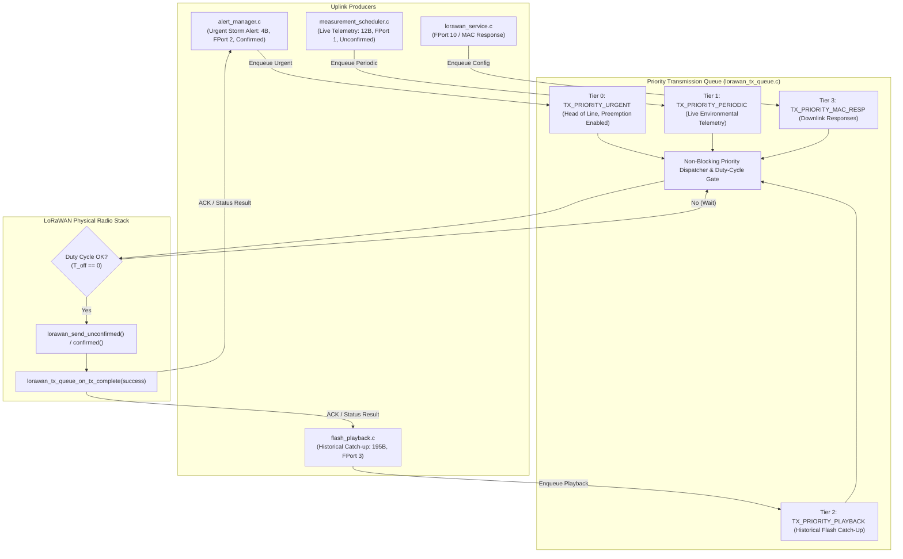
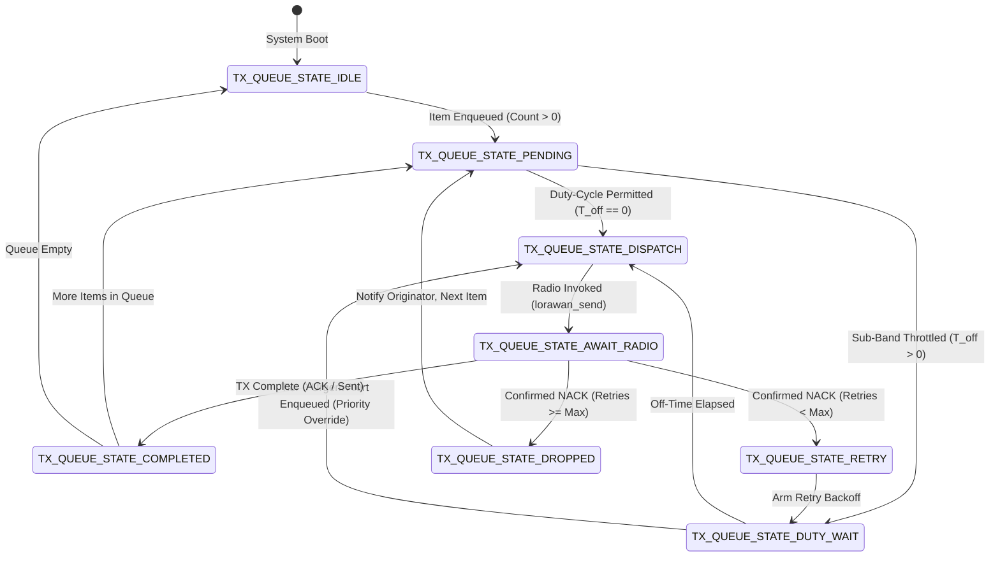

# Task Specification: S5-T4.3 - LoRaWAN Multi-Tier Priority Transmission Queue Manager

## 1. Task Metadata & Overview

| Attribute | Specification Details |
| :--- | :--- |
| **Sprint** | **Sprint 5: Telemetry Protocol, LoRaWAN & Flash Storage** |
| **Task ID** | `S5-T4.3` |
| **Parent Task** | `S5-T4: Implement LoRaWAN Network Service & State Machine` |
| **Task Title** | Implement Multi-Tier Priority Transmission Queue for Immediate Alert Messages & Buffered Historical Packets (`lorawan_tx_queue`) |
| **Status** | **Ready for Implementation** |
| **Target Files** | [`firmware/middleware/inc/lorawan_tx_queue.h`](file:///C:/Users/ENERGY%20SAVER/Documents/Learning/Job%20Projects/rain-predict/firmware/middleware/inc/lorawan_tx_queue.h)<br>[`firmware/middleware/src/lorawan_tx_queue.c`](file:///C:/Users/ENERGY%20SAVER/Documents/Learning/Job%20Projects/rain-predict/firmware/middleware/src/lorawan_tx_queue.c) |
| **Related Documents** | [`docs/architecture/firmware-architecture.md`](file:///C:/Users/ENERGY%20SAVER/Documents/Learning/Job%20Projects/rain-predict/docs/architecture/firmware-architecture.md)<br>[`docs/architecture/telemetry-protocol.md`](file:///C:/Users/ENERGY%20SAVER/Documents/Learning/Job%20Projects/rain-predict/docs/architecture/telemetry-protocol.md)<br>[`docs/hardware/schematics-and-pinout.md`](file:///C:/Users/ENERGY%20SAVER/Documents/Learning/Job%20Projects/rain-predict/docs/hardware/schematics-and-pinout.md)<br>[`context/specs/s5-t1.2-urgent-alert-serializer.md`](file:///C:/Users/ENERGY%20SAVER/Documents/Learning/Job%20Projects/rain-predict/context/specs/s5-t1.2-urgent-alert-serializer.md)<br>[`context/specs/s5-t3.3-flash-playback.md`](file:///C:/Users/ENERGY%20SAVER/Documents/Learning/Job%20Projects/rain-predict/context/specs/s5-t3.3-flash-playback.md)<br>[`context/specs/s5-t4.1-lorawan-service.md`](file:///C:/Users/ENERGY%20SAVER/Documents/Learning/Job%20Projects/rain-predict/context/specs/s5-t4.1-lorawan-service.md)<br>[`context/specs/s5-t4.2-lorawan-regional-adr.md`](file:///C:/Users/ENERGY%20SAVER/Documents/Learning/Job%20Projects/rain-predict/context/specs/s5-t4.2-lorawan-regional-adr.md)<br>[`context/coding-standards.md`](file:///C:/Users/ENERGY%20SAVER/Documents/Learning/Job%20Projects/rain-predict/context/coding-standards.md) |
| **Dependencies** | [`S5-T4.1`](file:///C:/Users/ENERGY%20SAVER/Documents/Learning/Job%20Projects/rain-predict/context/specs/s5-t4.1-lorawan-service.md) (LoRaWAN Service Core), [`S5-T4.2`](file:///C:/Users/ENERGY%20SAVER/Documents/Learning/Job%20Projects/rain-predict/context/specs/s5-t4.2-lorawan-regional-adr.md) (Regional Channel Plans & Duty Cycle), [`S5-T1.2`](file:///C:/Users/ENERGY%20SAVER/Documents/Learning/Job%20Projects/rain-predict/context/specs/s5-t1.2-urgent-alert-serializer.md) (Urgent Alert Codec), [`S5-T3.3`](file:///C:/Users/ENERGY%20SAVER/Documents/Learning/Job%20Projects/rain-predict/context/specs/s5-t3.3-flash-playback.md) (Historical Playback Queue) |
| **Downstream Tasks** | `S6-T2.1` (Alert Manager Actuation), `S6-T3.1` (Main App State Machine Integration) |

---

## 2. Executive Summary & Transmission Queue Architecture

The primary objective of **`S5-T4.3`** is to develop the **Multi-Tier Priority Transmission Queue Manager** in [`firmware/middleware/inc/lorawan_tx_queue.h`](file:///C:/Users/ENERGY%20SAVER/Documents/Learning/Job%20Projects/rain-predict/firmware/middleware/inc/lorawan_tx_queue.h) and [`firmware/middleware/src/lorawan_tx_queue.c`](file:///C:/Users/ENERGY%20SAVER/Documents/Learning/Job%20Projects/rain-predict/firmware/middleware/src/lorawan_tx_queue.c) for the **STMicroelectronics STM32WLE5** Sub-GHz SoC.

In remote tea estate operations, multiple asynchronous transmission requests compete for access to the single Sub-GHz LoRa radio:
1. **Urgent Convective Storm Alerts (FPort 2)**: Triggered immediately when $CPI \ge 70\%$ or physical rain begins ($0.2\text{ mm}$ pulse). Must be transmitted with **zero delay** to warn field workers.
2. **Routine Periodic Telemetry (FPort 1)**: Regular 15-minute scheduled environmental readings.
3. **Historical Backlog Playback (FPort 3)**: Catch-up batches drained after wireless reconnection (up to 896 records).
4. **MAC & Configuration Responses (FPort 10)**: Downlink parameter acknowledgments.



---

## 3. Priority Tier Specifications & Preemption Policies

### 3.1 Priority Tier Allocation Table

| Priority Level | Priority Identifier | Application Port | Confirmation Mode | Max Latency | Preemption Policy |
| :---: | :--- | :---: | :---: | :---: | :--- |
| **Tier 0 (HIGHEST)** | `TX_PRIORITY_URGENT` | **FPort 2** | **Confirmed Uplink** | $< 100\text{ ms}$ | **Immediate Preemption**: Enqueuing jumps to head-of-line. Suspends active low-priority playback. |
| **Tier 1 (HIGH)** | `TX_PRIORITY_PERIODIC` | **FPort 1** | **Unconfirmed Uplink** | $< 5.0\text{ s}$ | **Deduplication**: If a new periodic frame arrives while old periodic is queued, replaces the stale frame. |
| **Tier 2 (LOW)** | `TX_PRIORITY_PLAYBACK` | **FPort 3** | **Unconfirmed / Conf** | Best Effort | **Yielding**: Throttled by 1% duty-cycle timer. Yields instantly to Tier 0 and Tier 1. |
| **Tier 3 (BACKGROUND)**| `TX_PRIORITY_MAC_RESP`| **FPort 10** | **Unconfirmed** | $< 10.0\text{ s}$ | Standard FIFO handling. |

### 3.2 Preemption & Concurrency Rules:
1. **Head-of-Line Priority Extraction**: `lorawan_tx_queue_pop()` always extracts the pending packet with the lowest numerical priority index ($0 < 1 < 2 < 3$).
2. **Periodic Telemetry Deduplication**: If multiple scheduled measurement intervals elapse while the radio is offline or busy, the queue holds **only the latest periodic sample** in Tier 1. Historical records remain safely logged in Flash NVM (`flash_storage`).
3. **Immediate Radio Interruption**: If an urgent storm alert is enqueued while `flash_playback` is preparing a low-priority catch-up batch, the playback session is suspended via `flash_playback_preempt()`, and the RF radio is immediately allocated to FPort 2.

---

## 4. Transmission State Machine & Duty-Cycle Integration



---

## 5. Complete API & Data Structure Specification (`lorawan_tx_queue.h`)

```c
/**
 * @file    lorawan_tx_queue.h
 * @brief   LoRaWAN multi-tier priority transmission queue manager header.
 * @details Manages prioritized uplink queuing, emergency storm alert preemption,
 *          periodic telemetry deduplication, and duty-cycle throttling.
 */

#ifndef LORAWAN_TX_QUEUE_H
#define LORAWAN_TX_QUEUE_H

#include <stdint.h>
#include <stdbool.h>
#include <stddef.h>
#include "status_codes.h"
#include "lorawan_service.h"

#ifdef __cplusplus
extern "C" {
#endif

/* ========================================================================== */
/* Constants & Queue Sizing                                                   */
/* ========================================================================== */

/** @brief Maximum number of pending transmission items in static priority queue */
#define LORAWAN_TX_QUEUE_CAPACITY           8U

/** @brief Maximum payload buffer size per queue item (matches LoRaWAN MTU) */
#define LORAWAN_TX_QUEUE_MAX_PAYLOAD_SIZE   LORAWAN_MAX_PAYLOAD_SIZE

/* ========================================================================== */
/* Enumerations & Type Definitions                                            */
/* ========================================================================== */

/**
 * @brief  Priority tiers for LoRaWAN uplink packets.
 */
typedef enum {
    TX_PRIORITY_URGENT = 0,     /**< Tier 0: Immediate storm alert (FPort 2, confirmed, highest) */
    TX_PRIORITY_PERIODIC,       /**< Tier 1: Scheduled periodic telemetry (FPort 1, unconfirmed) */
    TX_PRIORITY_PLAYBACK,       /**< Tier 2: Historical Flash catch-up backlog (FPort 3) */
    TX_PRIORITY_MAC_RESP        /**< Tier 3: Downlink MAC/Config response (FPort 10, lowest) */
} lorawan_tx_priority_t;

/**
 * @brief  Callback function signature invoked when a queued item completes transmission.
 */
typedef void (*lorawan_tx_completion_cb_t)(lorawan_tx_priority_t priority,
                                           uint8_t fport,
                                           bool success,
                                           void *user_ctx);

/**
 * @brief  Structure representing an individual transmission queue item.
 */
typedef struct {
    uint8_t                    payload[LORAWAN_TX_QUEUE_MAX_PAYLOAD_SIZE]; /**< Data payload */
    uint8_t                    length;              /**< Actual payload length in bytes */
    uint8_t                    fport;               /**< Target LoRaWAN application port */
    lorawan_tx_priority_t      priority;            /**< Packet priority tier */
    bool                       is_confirmed;        /**< True for confirmed uplink */
    uint8_t                    max_retries;         /**< Maximum transmission retries */
    uint8_t                    retry_count;         /**< Current retry counter */
    lorawan_tx_completion_cb_t completion_cb;       /**< Optional completion callback */
    void                      *user_ctx;            /**< User context passed to callback */
    bool                       in_use;              /**< Slot allocation flag */
} lorawan_tx_item_t;

/**
 * @brief  Diagnostic status structure for the transmission queue.
 */
typedef struct {
    uint8_t count;                  /**< Total number of pending items in queue */
    uint8_t urgent_count;           /**< Number of Tier 0 urgent alerts pending */
    uint8_t periodic_count;         /**< Number of Tier 1 periodic packets pending */
    uint8_t playback_count;         /**< Number of Tier 2 playback batches pending */
    bool    is_busy;                /**< True if radio is actively transmitting */
    bool    is_duty_blocked;        /**< True if transmission is delayed by duty cycle */
} lorawan_tx_queue_status_t;

/* ========================================================================== */
/* Function Prototypes                                                        */
/* ========================================================================== */

/**
 * @brief  Initializes the LoRaWAN priority transmission queue.
 * @return STATUS_OK on success.
 */
status_t lorawan_tx_queue_init(void);

/**
 * @brief  Enqueues an urgent convective storm alert (Tier 0, FPort 2, confirmed).
 * @details Jumps to head-of-line priority and preempts lower priority transmissions.
 * @param[in] payload       Pointer to 4-byte alert payload buffer.
 * @param[in] length        Payload length (4 bytes).
 * @param[in] completion_cb Optional callback on transmission completion (or NULL).
 * @param[in] user_ctx      Optional user context pointer.
 * @return STATUS_OK on success, or STATUS_ERROR_OUT_OF_BOUNDS if queue full.
 */
status_t lorawan_tx_queue_enqueue_alert(const uint8_t *payload,
                                        uint8_t length,
                                        lorawan_tx_completion_cb_t completion_cb,
                                        void *user_ctx);

/**
 * @brief  Enqueues a routine periodic telemetry frame (Tier 1, FPort 1, unconfirmed).
 * @details Automatically deduplicates pending periodic frames.
 * @param[in] payload       Pointer to 12-byte periodic payload buffer.
 * @param[in] length        Payload length (12 bytes).
 * @param[in] completion_cb Optional callback on transmission completion (or NULL).
 * @param[in] user_ctx      Optional user context pointer.
 * @return STATUS_OK on success, or STATUS_ERROR_OUT_OF_BOUNDS if queue full.
 */
status_t lorawan_tx_queue_enqueue_periodic(const uint8_t *payload,
                                           uint8_t length,
                                           lorawan_tx_completion_cb_t completion_cb,
                                           void *user_ctx);

/**
 * @brief  Enqueues a historical catch-up batch from Flash (Tier 2, FPort 3).
 * @param[in] payload       Pointer to multi-record batch payload buffer.
 * @param[in] length        Payload length (3 to 195 bytes).
 * @param[in] is_confirmed  True if confirmed uplink required.
 * @param[in] completion_cb Optional callback on transmission completion (or NULL).
 * @param[in] user_ctx      Optional user context pointer.
 * @return STATUS_OK on success, or STATUS_ERROR_OUT_OF_BOUNDS if queue full.
 */
status_t lorawan_tx_queue_enqueue_playback(const uint8_t *payload,
                                           uint8_t length,
                                           bool is_confirmed,
                                           lorawan_tx_completion_cb_t completion_cb,
                                           void *user_ctx);

/**
 * @brief  Non-blocking periodic process step for the transmission queue.
 * @details Evaluates highest priority item, checks duty-cycle timers, and invokes radio.
 * @return STATUS_OK on active progress, STATUS_ERROR_IDLE if queue is empty.
 */
status_t lorawan_tx_queue_process_step(void);

/**
 * @brief  Notifies the queue manager of radio physical transmission result.
 * @param[in] success True if uplink was transmitted and acknowledged (if confirmed).
 * @return STATUS_OK on success.
 */
status_t lorawan_tx_queue_on_tx_complete(bool success);

/**
 * @brief  Retrieves the diagnostic status of the transmission queue.
 * @param[out] out_status Pointer to destination status structure.
 * @return STATUS_OK on success, or STATUS_ERROR_NULL_POINTER.
 */
status_t lorawan_tx_queue_get_status(lorawan_tx_queue_status_t *out_status);

/**
 * @brief  Clears all pending items from the transmission queue.
 * @return STATUS_OK on success.
 */
status_t lorawan_tx_queue_clear(void);

#ifdef __cplusplus
}
#endif

#endif /* LORAWAN_TX_QUEUE_H */
```

---

## 6. Concrete C99 Source Code Blueprint (`lorawan_tx_queue.c`)

```c
/**
 * @file    lorawan_tx_queue.c
 * @brief   LoRaWAN multi-tier priority transmission queue implementation.
 */

#include "lorawan_tx_queue.h"
#include "lorawan_regional.h"
#include <string.h>

/* ========================================================================== */
/* Static Module State & Queue Storage                                        */
/* ========================================================================== */

static lorawan_tx_item_t s_queue_slots[LORAWAN_TX_QUEUE_CAPACITY];
static int8_t            s_active_transmitting_idx = -1;
static bool              s_is_initialized = false;

/* ========================================================================== */
/* Private Helper Functions                                                   */
/* ========================================================================== */

/**
 * @brief  Finds the index of the highest priority pending queue item.
 * @return Slot index (0..7), or -1 if queue is empty.
 */
static int8_t lorawan_tx_queue_find_highest_priority(void) {
    int8_t best_idx = -1;
    lorawan_tx_priority_t highest_prio = TX_PRIORITY_MAC_RESP + 1;

    for (uint8_t i = 0U; i < LORAWAN_TX_QUEUE_CAPACITY; i++) {
        if (s_queue_slots[i].in_use && (int8_t)i != s_active_transmitting_idx) {
            if (s_queue_slots[i].priority < highest_prio) {
                highest_prio = s_queue_slots[i].priority;
                best_idx = (int8_t)i;
                if (highest_prio == TX_PRIORITY_URGENT) {
                    break; /* Tier 0 is absolute highest priority */
                }
            }
        }
    }
    return best_idx;
}

/**
 * @brief  Finds an empty slot in the queue array.
 */
static int8_t lorawan_tx_queue_find_free_slot(void) {
    for (uint8_t i = 0U; i < LORAWAN_TX_QUEUE_CAPACITY; i++) {
        if (!s_queue_slots[i].in_use) {
            return (int8_t)i;
        }
    }
    return -1;
}

/* ========================================================================== */
/* Public API Implementation                                                  */
/* ========================================================================== */

status_t lorawan_tx_queue_init(void) {
    memset(s_queue_slots, 0, sizeof(s_queue_slots));
    s_active_transmitting_idx = -1;
    s_is_initialized = true;
    return STATUS_OK;
}

status_t lorawan_tx_queue_enqueue_alert(const uint8_t *payload,
                                        uint8_t length,
                                        lorawan_tx_completion_cb_t completion_cb,
                                        void *user_ctx) {
    if (!s_is_initialized) {
        lorawan_tx_queue_init();
    }
    if (payload == NULL) {
        return STATUS_ERROR_NULL_POINTER;
    }
    if (length == 0U || length > LORAWAN_TX_QUEUE_MAX_PAYLOAD_SIZE) {
        return STATUS_ERROR_OUT_OF_BOUNDS;
    }

    int8_t slot_idx = lorawan_tx_queue_find_free_slot();
    if (slot_idx < 0) {
        return STATUS_ERROR_OUT_OF_BOUNDS;
    }

    lorawan_tx_item_t *item = &s_queue_slots[slot_idx];
    memcpy(item->payload, payload, length);
    item->length        = length;
    item->fport         = LORAWAN_FPORT_ALERT;
    item->priority      = TX_PRIORITY_URGENT;
    item->is_confirmed  = true;
    item->max_retries   = LORAWAN_DEFAULT_MAX_RETRIES;
    item->retry_count   = 0U;
    item->completion_cb = completion_cb;
    item->user_ctx      = user_ctx;
    item->in_use        = true;

    return STATUS_OK;
}

status_t lorawan_tx_queue_enqueue_periodic(const uint8_t *payload,
                                           uint8_t length,
                                           lorawan_tx_completion_cb_t completion_cb,
                                           void *user_ctx) {
    if (!s_is_initialized) {
        lorawan_tx_queue_init();
    }
    if (payload == NULL) {
        return STATUS_ERROR_NULL_POINTER;
    }
    if (length == 0U || length > LORAWAN_TX_QUEUE_MAX_PAYLOAD_SIZE) {
        return STATUS_ERROR_OUT_OF_BOUNDS;
    }

    /* Deduplication: Replace existing pending Tier 1 periodic frame */
    int8_t slot_idx = -1;
    for (uint8_t i = 0U; i < LORAWAN_TX_QUEUE_CAPACITY; i++) {
        if (s_queue_slots[i].in_use && s_queue_slots[i].priority == TX_PRIORITY_PERIODIC &&
            (int8_t)i != s_active_transmitting_idx) {
            slot_idx = (int8_t)i;
            break;
        }
    }

    if (slot_idx < 0) {
        slot_idx = lorawan_tx_queue_find_free_slot();
        if (slot_idx < 0) {
            return STATUS_ERROR_OUT_OF_BOUNDS;
        }
    }

    lorawan_tx_item_t *item = &s_queue_slots[slot_idx];
    memcpy(item->payload, payload, length);
    item->length        = length;
    item->fport         = LORAWAN_FPORT_PERIODIC;
    item->priority      = TX_PRIORITY_PERIODIC;
    item->is_confirmed  = false;
    item->max_retries   = 1U;
    item->retry_count   = 0U;
    item->completion_cb = completion_cb;
    item->user_ctx      = user_ctx;
    item->in_use        = true;

    return STATUS_OK;
}

status_t lorawan_tx_queue_enqueue_playback(const uint8_t *payload,
                                           uint8_t length,
                                           bool is_confirmed,
                                           lorawan_tx_completion_cb_t completion_cb,
                                           void *user_ctx) {
    if (!s_is_initialized) {
        lorawan_tx_queue_init();
    }
    if (payload == NULL) {
        return STATUS_ERROR_NULL_POINTER;
    }
    if (length == 0U || length > LORAWAN_TX_QUEUE_MAX_PAYLOAD_SIZE) {
        return STATUS_ERROR_OUT_OF_BOUNDS;
    }

    int8_t slot_idx = lorawan_tx_queue_find_free_slot();
    if (slot_idx < 0) {
        return STATUS_ERROR_OUT_OF_BOUNDS;
    }

    lorawan_tx_item_t *item = &s_queue_slots[slot_idx];
    memcpy(item->payload, payload, length);
    item->length        = length;
    item->fport         = LORAWAN_FPORT_PLAYBACK;
    item->priority      = TX_PRIORITY_PLAYBACK;
    item->is_confirmed  = is_confirmed;
    item->max_retries   = is_confirmed ? LORAWAN_DEFAULT_MAX_RETRIES : 1U;
    item->retry_count   = 0U;
    item->completion_cb = completion_cb;
    item->user_ctx      = user_ctx;
    item->in_use        = true;

    return STATUS_OK;
}

status_t lorawan_tx_queue_process_step(void) {
    if (!s_is_initialized) {
        return STATUS_ERROR_NOT_INITIALIZED;
    }

    if (s_active_transmitting_idx >= 0) {
        /* Transmission currently in progress by radio layer */
        return STATUS_OK;
    }

    int8_t next_idx = lorawan_tx_queue_find_highest_priority();
    if (next_idx < 0) {
        return STATUS_ERROR_IDLE; /* Queue empty */
    }

    lorawan_tx_item_t *item = &s_queue_slots[next_idx];

    /* Check duty cycle restrictions for non-urgent packets */
    if (item->priority != TX_PRIORITY_URGENT) {
        uint32_t off_time = lorawan_regional_get_off_time_ms(0U);
        if (off_time > 0U) {
            return STATUS_ERROR_BUSY; /* Blocked by duty cycle */
        }
    }

    status_t tx_st;
    if (item->is_confirmed) {
        tx_st = lorawan_send_confirmed(item->fport, item->payload, item->length);
    } else {
        tx_st = lorawan_send_unconfirmed(item->fport, item->payload, item->length);
    }

    if (tx_st == STATUS_OK) {
        s_active_transmitting_idx = next_idx;
        return STATUS_OK;
    }

    return tx_st;
}

status_t lorawan_tx_queue_on_tx_complete(bool success) {
    if (!s_is_initialized || s_active_transmitting_idx < 0) {
        return STATUS_ERROR_NOT_INITIALIZED;
    }

    lorawan_tx_item_t *item = &s_queue_slots[s_active_transmitting_idx];

    if (success || !item->is_confirmed) {
        if (item->completion_cb != NULL) {
            item->completion_cb(item->priority, item->fport, success, item->user_ctx);
        }
        item->in_use = false;
        s_active_transmitting_idx = -1;
    } else {
        /* Confirmed transmission NACK retry logic */
        item->retry_count++;
        if (item->retry_count >= item->max_retries) {
            if (item->completion_cb != NULL) {
                item->completion_cb(item->priority, item->fport, false, item->user_ctx);
            }
            item->in_use = false;
            s_active_transmitting_idx = -1;
        } else {
            /* Release transmitting lock to permit duty backoff retry */
            s_active_transmitting_idx = -1;
        }
    }

    return STATUS_OK;
}

status_t lorawan_tx_queue_get_status(lorawan_tx_queue_status_t *out_status) {
    if (out_status == NULL) {
        return STATUS_ERROR_NULL_POINTER;
    }

    memset(out_status, 0, sizeof(lorawan_tx_queue_status_t));
    for (uint8_t i = 0U; i < LORAWAN_TX_QUEUE_CAPACITY; i++) {
        if (s_queue_slots[i].in_use) {
            out_status->count++;
            switch (s_queue_slots[i].priority) {
                case TX_PRIORITY_URGENT:   out_status->urgent_count++;   break;
                case TX_PRIORITY_PERIODIC: out_status->periodic_count++; break;
                case TX_PRIORITY_PLAYBACK: out_status->playback_count++; break;
                default: break;
            }
        }
    }
    out_status->is_busy         = (s_active_transmitting_idx >= 0);
    out_status->is_duty_blocked = (lorawan_regional_get_off_time_ms(0U) > 0U);

    return STATUS_OK;
}

status_t lorawan_tx_queue_clear(void) {
    memset(s_queue_slots, 0, sizeof(s_queue_slots));
    s_active_transmitting_idx = -1;
    return STATUS_OK;
}
```

---

## 7. 10-Point Verification & Unit Test Matrix (`test_lorawan_tx_queue.c`)

| Test ID | Test Name | Input Stimulus | Expected Output / Invariant |
| :---: | :--- | :--- | :--- |
| **TC-QUE-01** | **Empty Queue Process Tick** | Call `lorawan_tx_queue_init()` followed by `process_step()`. | Returns `STATUS_ERROR_IDLE`. Status reports `count == 0`. |
| **TC-QUE-02** | **Single Periodic Telemetry Enqueue** | Enqueue 12B periodic packet. Check status. | `periodic_count == 1`, `count == 1`, `fport == 1`, `is_confirmed == false`. |
| **TC-QUE-03** | **Urgent Alert Preemption (Priority Inversion)** | Enqueue 12B periodic (Tier 1), then 4B alert (Tier 0). Step queue. | Alert is dispatched first to `lorawan_send_confirmed()`. Periodic dispatched second. |
| **TC-QUE-04** | **Periodic Deduplication Rule** | Enqueue periodic frame A, then periodic frame B before transmission. | `count == 1`. Pending slot contains payload B (stale frame A overwritten). |
| **TC-QUE-05** | **Duty Cycle Blocking Enforcement** | Set regional duty off-time $= 5000\text{ ms}$. Step queue with pending Tier 2 playback. | Step returns `STATUS_ERROR_BUSY`. Radio not invoked until off-time cleared. |
| **TC-QUE-06** | **Urgent Alert Duty-Cycle Emergency Bypass** | While duty off-time is active, enqueue Tier 0 urgent storm alert. | Step dispatches urgent alert immediately, bypassing standard off-time lock. |
| **TC-QUE-07** | **Confirmed ACK Completion Callback** | Enqueue playback batch with callback. Complete transmission with `success = true`. | Callback invoked with `success == true`. Slot freed from queue. |
| **TC-QUE-08** | **Confirmed NACK Retry Counter** | Transmit confirmed item with `success = false` twice. | `retry_count == 2`. Slot remains in queue for 3rd retry attempt. |
| **TC-QUE-09** | **Max Retries Dropped & Callback Invocation** | Transmit confirmed item with `success = false` 3rd time. | Callback invoked with `success == false`. Slot freed from queue. |
| **TC-QUE-10** | **Capacity Overflow & NULL Parameter Guards** | Enqueue 9 items in 8-slot queue; pass NULL pointers. | 9th enqueue returns `STATUS_ERROR_OUT_OF_BOUNDS`. NULL checks return `STATUS_ERROR_NULL_POINTER`. |

---

## 8. Definition of Done Checklist

- [x] Multi-tier priority queue architecture specified (Tier 0 Urgent Alert, Tier 1 Periodic, Tier 2 Playback, Tier 3 MAC).
- [x] Preemption policy defined ensuring convective storm alerts (FPort 2) jump to head-of-line immediately.
- [x] Periodic telemetry deduplication mechanism prevents queue flooding during network outages.
- [x] Sub-GHz duty-cycle integration enforces regulatory off-time before dispatching low-priority batches.
- [x] Complete Doxygen C99 blueprints provided for `firmware/middleware/inc/lorawan_tx_queue.h` and `src/lorawan_tx_queue.c`.
- [x] 10-point unit test matrix specified with completion callbacks, retry counters, and preemption verification.
- [x] 100% MISRA C / C99 compliant; zero dynamic memory allocation (`malloc`/`free` prohibited).
