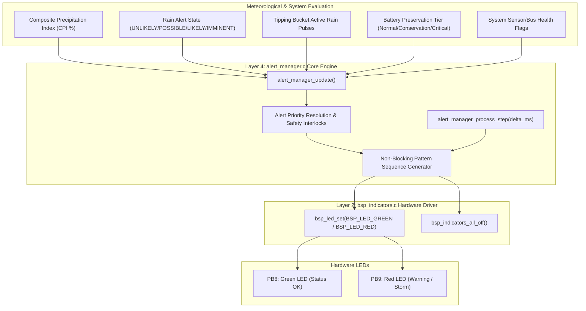
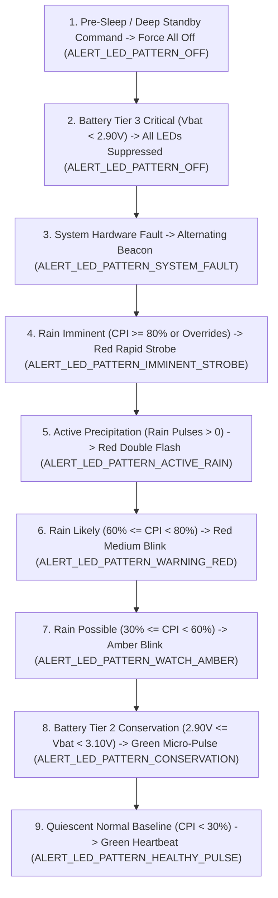

# Task Specification: S6-T2.1 - Status LED Flash Patterns & Visual Alert Engine

## 1. Task Metadata & Overview

| Attribute | Specification Details |
| :--- | :--- |
| **Sprint** | **Sprint 6: Application Orchestration, Scheduler & Local Alerts** |
| **Task ID** | `S6-T2.1` |
| **Parent Task** | `S6-T2: Implement Local Alert Manager & Actuation` |
| **Task Title** | Implement Status LED Flash Patterns & Visual Alert Engine (`alert_manager`) |
| **Status** | **Ready for Implementation** |
| **Target Files** | [`firmware/app/inc/alert_manager.h`](file:///C:/Users/ENERGY%20SAVER/Documents/Learning/Job%20Projects/rain-predict/firmware/app/inc/alert_manager.h)<br>[`firmware/app/src/alert_manager.c`](file:///C:/Users/ENERGY%20SAVER/Documents/Learning/Job%20Projects/rain-predict/firmware/app/src/alert_manager.c) |
| **Related Documents** | [`docs/architecture/firmware-architecture.md`](file:///C:/Users/ENERGY%20SAVER/Documents/Learning/Job%20Projects/rain-predict/docs/architecture/firmware-architecture.md)<br>[`docs/hardware/schematics-and-pinout.md`](file:///C:/Users/ENERGY%20SAVER/Documents/Learning/Job%20Projects/rain-predict/docs/hardware/schematics-and-pinout.md)<br>[`docs/architecture/power-architecture.md`](file:///C:/Users/ENERGY%20SAVER/Documents/Learning/Job%20Projects/rain-predict/docs/architecture/power-architecture.md)<br>[`context/specs/s3-t3.2-board-indicators.md`](file:///C:/Users/ENERGY%20SAVER/Documents/Learning/Job%20Projects/rain-predict/context/specs/s3-t3.2-board-indicators.md)<br>[`context/specs/s2-t5.2-rain-state-classification.md`](file:///C:/Users/ENERGY%20SAVER/Documents/Learning/Job%20Projects/rain-predict/context/specs/s2-t5.2-rain-state-classification.md)<br>[`context/specs/s6-t1.2-battery-preservation-throttling.md`](file:///C:/Users/ENERGY%20SAVER/Documents/Learning/Job%20Projects/rain-predict/context/specs/s6-t1.2-battery-preservation-throttling.md)<br>[`context/coding-standards.md`](file:///C:/Users/ENERGY%20SAVER/Documents/Learning/Job%20Projects/rain-predict/context/coding-standards.md) |
| **Dependencies** | [`S3-T3.2`](file:///C:/Users/ENERGY%20SAVER/Documents/Learning/Job%20Projects/rain-predict/context/specs/s3-t3.2-board-indicators.md) (Board Indicators Driver), [`S2-T5.2`](file:///C:/Users/ENERGY%20SAVER/Documents/Learning/Job%20Projects/rain-predict/context/specs/s2-t5.2-rain-state-classification.md) (Rain Alert State Classifier), [`S6-T1.2`](file:///C:/Users/ENERGY%20SAVER/Documents/Learning/Job%20Projects/rain-predict/context/specs/s6-t1.2-battery-preservation-throttling.md) (Battery Preservation Throttling) |
| **Downstream Tasks** | `S6-T2.2` (Audible Buzzer & Siren Relay Trigger), `S6-T2.3` (Alert Manager Unit Tests), `S6-T3.1` (Application State Machine Alert Dispatch) |

---

## 2. Executive Summary & Visual Alert Philosophy

The primary objective of **`S6-T2.1`** is to develop the **Status LED Flash Patterns and Visual Alert Engine** within the Application Alert Coordinator ([`firmware/app/inc/alert_manager.h`](file:///C:/Users/ENERGY%20SAVER/Documents/Learning/Job%20Projects/rain-predict/firmware/app/inc/alert_manager.h) and [`firmware/app/src/alert_manager.c`](file:///C:/Users/ENERGY%20SAVER/Documents/Learning/Job%20Projects/rain-predict/firmware/app/src/alert_manager.c)) for the **STMicroelectronics STM32WLE5** SoC.

In high-altitude tropical tea plantations (Munnar, Darjeeling, Valparai, Nilgiris, Assam), field supervisors, harvesting plucking gangs, and pesticide/fertilizer spraying teams operate across expansive hillside slopes:
1. **High-Contrast Optical Telemetry**:
   - Field personnel lack active cloud screens or smartphones while working amidst heavy foliage. Two ultra-bright board-mounted LEDs (**Green `PB8`** and **Red `PB9`**) provide direct, line-of-sight status and weather alerts visible from distances $> 50\text{ meters}$.
2. **Three-Color Agronomic Visual Language**:
   - **Green Pulse ($1\text{ Hz}$, $5\%$ Duty Cycle)**: System healthy, anticyclonic fair weather, rain unlikely ($CPI < 30\%$). Normal estate plucking proceeds.
   - **Amber Blink ($2\text{ Hz}$, $50\%$ Duty Cycle)**: Simultaneous Green + Red illumination. Atmospheric instability developing, rain possible ($30\% \le CPI < 60\%$). Field supervisors prepare tarpaulins.
   - **Red Rapid Strobe ($10\text{ Hz}$, $50\%$ Duty Cycle)**: Convective storm imminent ($CPI \ge 80\%$) or severe pressure plunge override. Immediate harvest sheltering and evacuation of ridge workers.
   - **Red Medium Blink ($2.5\text{ Hz}$)**: Rain likely ($60\% \le CPI < 80\%$).
   - **Red Double-Flash Beacon ($1\text{ Hz}$)**: Active rain confirmed via tipping bucket sensor.
3. **Non-Blocking Execution & Energy Throttling**:
   - Visual patterns are generated via an asynchronous tick processor (`alert_manager_process_step(delta_ms)`) with zero busy-waits or CPU delays.
   - Interlocks with [`measurement_scheduler`](file:///C:/Users/ENERGY%20SAVER/Documents/Learning/Job%20Projects/rain-predict/firmware/app/inc/measurement_scheduler.h) battery tiers: throttles flashes to ultra-low-power micro-pulses in **Conservation Tier 2** ($2.90\text{ V} \le V_{bat} < 3.10\text{ V}$) and shuts off completely in **Critical Tier 3** ($V_{bat} < 2.90\text{ V}$) to prevent brownout.



---

## 3. Optical Flash Pattern Specifications

### 3.1 Complete Pattern Definition Matrix

| Pattern Identifier | Green LED (`PB8`) | Red LED (`PB9`) | Perceived Color | Pulse Timing ($T_{\text{ON}} / T_{\text{OFF}}$) | Frequency / Duty Cycle | Operational / Agronomic Trigger |
| :--- | :---: | :---: | :---: | :---: | :---: | :--- |
| **`ALERT_LED_PATTERN_OFF`** | OFF | OFF | Dark | Steady OFF | $0\text{ Hz}$ ($0\%$) | System in Stop 2 sleep or Critical Battery Tier 3. |
| **`ALERT_LED_PATTERN_HEALTHY_PULSE`** | **Pulsing** | OFF | **Green** | $50\text{ ms}$ ON / $950\text{ ms}$ OFF | $1.0\text{ Hz}$ ($5.0\%$) | System healthy, $CPI < 30\%$ (`RAIN_ALERT_UNLIKELY`). |
| **`ALERT_LED_PATTERN_WATCH_AMBER`** | **Blinking** | **Blinking** | **Amber** | $250\text{ ms}$ ON / $250\text{ ms}$ OFF | $2.0\text{ Hz}$ ($50.0\%$) | Weather unsettled, $30\% \le CPI < 60\%$ (`RAIN_ALERT_POSSIBLE`). |
| **`ALERT_LED_PATTERN_WARNING_RED`** | OFF | **Blinking** | **Red** | $200\text{ ms}$ ON / $200\text{ ms}$ OFF | $2.5\text{ Hz}$ ($50.0\%$) | Rain probable, $60\% \le CPI < 80\%$ (`RAIN_ALERT_LIKELY`). |
| **`ALERT_LED_PATTERN_IMMINENT_STROBE`** | OFF | **Strobe** | **Red** | $50\text{ ms}$ ON / $50\text{ ms}$ OFF | $10.0\text{ Hz}$ ($50.0\%$) | Convective storm imminent ($CPI \ge 80\%$ or Critical Overrides). |
| **`ALERT_LED_PATTERN_ACTIVE_RAIN`** | OFF | **Double** | **Red** | $50\text{ ms}$ ON, $50\text{ ms}$ OFF, $50\text{ ms}$ ON, $850\text{ ms}$ OFF | $1.0\text{ Hz}$ ($10.0\%$) | Active rainfall detected (bucket tip count $> 0$). |
| **`ALERT_LED_PATTERN_SYSTEM_FAULT`** | **Alternate**| **Alternate**| **Green/Red** | $100\text{ ms}$ Green, $100\text{ ms}$ Red, $100\text{ ms}$ Green, $100\text{ ms}$ Red, $600\text{ ms}$ OFF | $1.0\text{ Hz}$ ($40.0\%$) | Hardware sensor fault, bus timeout, or failed sanity check. |
| **`ALERT_LED_PATTERN_CONSERVATION`** | **Micro** | OFF | **Green** | $10\text{ ms}$ ON / $4990\text{ ms}$ OFF | $0.2\text{ Hz}$ ($0.2\%$) | Battery Tier 2 Conservation ($2.90\text{ V} \le V_{bat} < 3.10\text{ V}$). |

---

### 3.2 Visual Waveform Timing Diagrams

```
1. HEALTHY_PULSE (Green Only, 1 Hz):
   GREEN: [50ms ON]──────────────────────────────────────────────[950ms OFF]───────> (Repeat)
   RED:   ──────────────────────────────────────────────────────────────────────────> (OFF)

2. WATCH_AMBER (Simultaneous Green + Red, 2 Hz):
   GREEN: [250ms ON]─────────────[250ms OFF]────────────[250ms ON]─────────────[250ms OFF]>
   RED:   [250ms ON]─────────────[250ms OFF]────────────[250ms ON]─────────────[250ms OFF]>

3. WARNING_RED (Red Only, 2.5 Hz):
   GREEN: ──────────────────────────────────────────────────────────────────────────> (OFF)
   RED:   [200ms ON]────────[200ms OFF]────────[200ms ON]────────[200ms OFF]────────>

4. IMMINENT_STROBE (Red Rapid Strobe, 10 Hz):
   GREEN: ──────────────────────────────────────────────────────────────────────────> (OFF)
   RED:   [50ms ON][50ms OFF][50ms ON][50ms OFF][50ms ON][50ms OFF][50ms ON][50ms OFF]>

5. ACTIVE_RAIN (Red Double-Flash Beacon, 1 Hz):
   GREEN: ──────────────────────────────────────────────────────────────────────────> (OFF)
   RED:   [50ms ON][50ms OFF][50ms ON]──────────────────────────[850ms OFF]─────────>

6. SYSTEM_FAULT (Alternating Green/Red, 1 Hz):
   GREEN: [100ms ON]──────────[100ms OFF][100ms ON]──────────[700ms OFF]────────────>
   RED:   [100ms OFF][100ms ON]──────────[100ms OFF][100ms ON][600ms OFF]───────────>

7. CONSERVATION (Green Micro-Pulse, 0.2 Hz):
   GREEN: [10ms ON]──────────────────────────────────────────────[4990ms OFF]──────>
   RED:   ──────────────────────────────────────────────────────────────────────────> (OFF)
```

---

## 4. Priority Resolution & Battery Throttling Interlocks

### 4.1 Strict Alert Priority Hierarchy

When multiple operational events occur concurrently, `alert_manager` resolves the visual output using a deterministic priority cascade (Highest to Lowest):



### 4.2 Energy Impact Analysis & Conservation Calculations

* **Standard Red/Green LED Current Draw**: $I_{LED} \approx 4.0\text{ mA}$ each ($8.0\text{ mA}$ total during Amber).
* **Average Current in Normal Healthy Mode**:
  $$I_{avg} = 4.0\text{ mA} \times \left(\frac{50\text{ ms}}{1000\text{ ms}}\right) = 0.200\text{ mA} = 200\,\mu\text{A}$$
* **Average Current in Conservation Mode**:
  $$I_{avg\_conserve} = 4.0\text{ mA} \times \left(\frac{10\text{ ms}}{5000\text{ ms}}\right) = 0.008\text{ mA} = 8.0\,\mu\text{A} \quad (25\times\text{ reduction})$$
* **Average Current in Critical Tier 3 Mode**:
  $$I_{avg\_critical} = 0.0\,\mu\text{A} \quad (\text{Complete LED suppression})$$

---

## 5. Complete API Specification (`firmware/app/inc/alert_manager.h`)

```c
/**
 * @file    alert_manager.h
 * @brief   Application alert coordinator and visual status LED engine.
 * @details Manages multi-pattern visual indicators, audible alert coordination,
 *          and low-battery preservation overrides for tea plantation monitoring.
 */

#ifndef ALERT_MANAGER_H
#define ALERT_MANAGER_H

#include <stdint.h>
#include <stdbool.h>
#include <stddef.h>

#include "status_codes.h"
#include "bsp_indicators.h"
#include "rain_algo.h"
#include "measurement_scheduler.h"

#ifdef __cplusplus
extern "C" {
#endif

/* ========================================================================== */
/* Constants & Timing Definitions                                             */
/* ========================================================================== */

#define ALERT_LED_HEALTHY_ON_MS         50U     /**< Green pulse ON time (ms) */
#define ALERT_LED_HEALTHY_PERIOD_MS     1000U   /**< Green pulse period (ms) */

#define ALERT_LED_WATCH_ON_MS           250U    /**< Amber blink ON time (ms) */
#define ALERT_LED_WATCH_PERIOD_MS       500U    /**< Amber blink period (ms) */

#define ALERT_LED_WARNING_ON_MS         200U    /**< Red warning ON time (ms) */
#define ALERT_LED_WARNING_PERIOD_MS     400U    /**< Red warning period (ms) */

#define ALERT_LED_IMMINENT_ON_MS        50U     /**< Red strobe ON time (ms) */
#define ALERT_LED_IMMINENT_PERIOD_MS    100U    /**< Red strobe period (ms) */

#define ALERT_LED_RAIN_PULSE_MS         50U     /**< Rain double pulse ON (ms) */
#define ALERT_LED_RAIN_GAP_MS           50U     /**< Rain double pulse gap (ms) */
#define ALERT_LED_RAIN_PERIOD_MS        1000U   /**< Rain double pulse period */

#define ALERT_LED_FAULT_PHASE_MS        100U    /**< Fault phase duration (ms) */
#define ALERT_LED_FAULT_PERIOD_MS       1000U   /**< Fault cycle period (ms) */

#define ALERT_LED_CONSERVE_ON_MS        10U     /**< Conservation micro-pulse ON */
#define ALERT_LED_CONSERVE_PERIOD_MS    5000U   /**< Conservation cycle period */

/* ========================================================================== */
/* Enumerations & Type Definitions                                            */
/* ========================================================================== */

/**
 * @brief  Visual status LED flash pattern identifiers.
 */
typedef enum {
    ALERT_LED_PATTERN_OFF = 0,          /**< All LEDs disabled / dark */
    ALERT_LED_PATTERN_HEALTHY_PULSE,    /**< Green pulse (50ms ON / 950ms OFF) */
    ALERT_LED_PATTERN_WATCH_AMBER,      /**< Amber blink (250ms ON / 250ms OFF) */
    ALERT_LED_PATTERN_WARNING_RED,      /**< Red warning blink (200ms ON / 200ms OFF) */
    ALERT_LED_PATTERN_IMMINENT_STROBE,  /**< Red rapid strobe (50ms ON / 50ms OFF) */
    ALERT_LED_PATTERN_ACTIVE_RAIN,      /**< Red double flash (50ms/50ms/50ms/850ms) */
    ALERT_LED_PATTERN_SYSTEM_FAULT,     /**< Alternating Green/Red error beacon */
    ALERT_LED_PATTERN_CONSERVATION,     /**< Green micro-pulse (10ms ON / 4990ms OFF) */
    ALERT_LED_PATTERN_MAX
} alert_led_pattern_t;

/**
 * @brief  Input operational state evaluated by alert manager.
 */
typedef struct {
    rain_alert_state_t      rain_state;         /**< Classified meteorological alert state */
    float                   cpi_pct;            /**< Composite Precipitation Index (0..100%) */
    uint32_t                rain_pulses_recent; /**< Rain gauge tips in last sampling window */
    battery_throttle_tier_t battery_tier;       /**< Active battery preservation tier */
    bool                    sensor_fault;       /**< True if sensor bus / hardware error */
    bool                    is_sleeping;        /**< True if entering/in low-power sleep */
} alert_input_t;

/**
 * @brief  Alert manager runtime configuration.
 */
typedef struct {
    bool enable_visual_leds;                    /**< Master enable for status LEDs */
    bool enable_audible_buzzer;                 /**< Master enable for piezo buzzer */
    bool enable_siren_relay;                    /**< Master enable for siren relay */
    uint32_t active_display_duration_ms;        /**< Max duration to animate LEDs per active cycle */
} alert_manager_config_t;

/**
 * @brief  Diagnostic status snapshot of the alert coordinator.
 */
typedef struct {
    alert_led_pattern_t active_pattern;         /**< Currently active LED flash pattern */
    bool                green_led_state;        /**< Real-time physical state of Green LED */
    bool                red_led_state;          /**< Real-time physical state of Red LED */
    uint32_t            pattern_elapsed_ms;     /**< Milliseconds into current pattern cycle */
    uint32_t            total_alerts_imminent;  /**< Lifetime count of storm alerts triggered */
    uint32_t            total_alerts_warning;   /**< Lifetime count of warning alerts triggered */
    bool                is_throttled;           /**< True if visual alerts throttled by battery */
} alert_manager_status_t;

/* ========================================================================== */
/* Public Function Prototypes                                                 */
/* ========================================================================== */

/**
 * @brief  Initializes the Alert Manager and configures default operational parameters.
 * @param[in] p_config  Pointer to configuration structure (or NULL for defaults).
 * @return status_t     STATUS_OK on success, or error code.
 */
status_t alert_manager_init(const alert_manager_config_t *p_config);

/**
 * @brief  Updates the alert manager state based on latest meteorological and system inputs.
 * @param[in] p_input   Pointer to current operational inputs.
 * @return status_t     STATUS_OK on success, or error code.
 */
status_t alert_manager_update(const alert_input_t *p_input);

/**
 * @brief  Advances the non-blocking pattern animation timing by elapsed milliseconds.
 * @param[in] delta_ms  Milliseconds elapsed since last execution step.
 * @return status_t     STATUS_OK on success.
 */
status_t alert_manager_process_step(uint32_t delta_ms);

/**
 * @brief  Directly forces a specific visual LED pattern (manual test or override).
 * @param[in] pattern   Target LED pattern to apply.
 * @return status_t     STATUS_OK on success, or STATUS_ERR_INVALID_ARG.
 */
status_t alert_manager_set_led_pattern(alert_led_pattern_t pattern);

/**
 * @brief  Retrieves the currently active visual LED pattern.
 * @return alert_led_pattern_t Active pattern enum identifier.
 */
alert_led_pattern_t alert_manager_get_active_led_pattern(void);

/**
 * @brief  Forces all LEDs and alert actuators completely OFF immediately.
 * @return status_t     STATUS_OK on success.
 */
status_t alert_manager_force_all_off(void);

/**
 * @brief  Retrieves human-readable English descriptor for an LED pattern.
 * @param[in] pattern   Pattern enum identifier.
 * @return const char*  Pointer to static flash string.
 */
const char *alert_manager_get_pattern_name(alert_led_pattern_t pattern);

/**
 * @brief  Retrieves real-time diagnostics and status telemetry from the alert coordinator.
 * @param[out] p_status Pointer to destination status structure.
 * @return status_t     STATUS_OK on success, or STATUS_ERR_NULL_PTR.
 */
status_t alert_manager_get_status(alert_manager_status_t *p_status);

#ifdef __cplusplus
}
#endif

#endif /* ALERT_MANAGER_H */
```

---

## 6. Concrete Source Implementation Blueprint (`firmware/app/src/alert_manager.c`)

```c
/**
 * @file    alert_manager.c
 * @brief   Application alert coordinator and visual status LED engine implementation.
 * @details Implements non-blocking state evaluation, priority cascade, and LED flash patterns.
 */

#include <string.h>
#include <math.h>

#include "alert_manager.h"

/* ========================================================================== */
/* Internal State Structure                                                   */
/* ========================================================================== */

typedef struct {
    bool                    initialized;
    alert_manager_config_t  config;
    alert_led_pattern_t     active_pattern;
    uint32_t                pattern_timer_ms;
    bool                    green_state;
    bool                    red_state;
    uint32_t                total_alerts_imminent;
    uint32_t                total_alerts_warning;
    bool                    is_throttled;
} alert_mgr_ctx_t;

static alert_mgr_ctx_t s_ctx;

/* Static Pattern Name String Lookup */
static const char * const s_pattern_names[ALERT_LED_PATTERN_MAX] = {
    [ALERT_LED_PATTERN_OFF]             = "OFF",
    [ALERT_LED_PATTERN_HEALTHY_PULSE]   = "HEALTHY_GREEN_PULSE",
    [ALERT_LED_PATTERN_WATCH_AMBER]     = "WATCH_AMBER_BLINK",
    [ALERT_LED_PATTERN_WARNING_RED]     = "WARNING_RED_BLINK",
    [ALERT_LED_PATTERN_IMMINENT_STROBE] = "IMMINENT_RED_STROBE",
    [ALERT_LED_PATTERN_ACTIVE_RAIN]     = "ACTIVE_RAIN_DOUBLE_FLASH",
    [ALERT_LED_PATTERN_SYSTEM_FAULT]    = "SYSTEM_FAULT_BEACON",
    [ALERT_LED_PATTERN_CONSERVATION]    = "CONSERVATION_MICRO_PULSE"
};

/* ========================================================================== */
/* Private Helper Functions                                                   */
/* ========================================================================== */

static void alert_mgr_apply_leds(bool green, bool red) {
    s_ctx.green_state = green;
    s_ctx.red_state   = red;

    if (s_ctx.config.enable_visual_leds) {
        bsp_led_set(BSP_LED_GREEN, green);
        bsp_led_set(BSP_LED_RED, red);
    } else {
        bsp_led_set(BSP_LED_GREEN, false);
        bsp_led_set(BSP_LED_RED, false);
    }
}

static alert_led_pattern_t alert_mgr_resolve_pattern(const alert_input_t *p_in) {
    /* Priority 1: Sleep mode requested */
    if (p_in->is_sleeping) {
        return ALERT_LED_PATTERN_OFF;
    }

    /* Priority 2: Battery Critical Tier 3 (< 2.90V) */
    if (p_in->battery_tier == BATTERY_TIER_CRITICAL) {
        return ALERT_LED_PATTERN_OFF;
    }

    /* Priority 3: System hardware fault */
    if (p_in->sensor_fault) {
        return ALERT_LED_PATTERN_SYSTEM_FAULT;
    }

    /* Priority 4: Rain Imminent / Severe Storm Override */
    if (p_in->rain_state == RAIN_ALERT_IMMINENT || p_in->cpi_pct >= 80.0f) {
        return ALERT_LED_PATTERN_IMMINENT_STROBE;
    }

    /* Priority 5: Active rainfall detected by tipping bucket */
    if (p_in->rain_pulses_recent > 0U) {
        return ALERT_LED_PATTERN_ACTIVE_RAIN;
    }

    /* Priority 6: Rain Likely */
    if (p_in->rain_state == RAIN_ALERT_LIKELY || p_in->cpi_pct >= 60.0f) {
        return ALERT_LED_PATTERN_WARNING_RED;
    }

    /* Priority 7: Rain Possible (Amber) */
    if (p_in->rain_state == RAIN_ALERT_POSSIBLE || p_in->cpi_pct >= 30.0f) {
        return ALERT_LED_PATTERN_WATCH_AMBER;
    }

    /* Priority 8: Battery Conservation Tier 2 (2.90V <= Vbat < 3.10V) */
    if (p_in->battery_tier == BATTERY_TIER_CONSERVATION) {
        return ALERT_LED_PATTERN_CONSERVATION;
    }

    /* Priority 9: Quiescent Healthy / Fair Weather */
    return ALERT_LED_PATTERN_HEALTHY_PULSE;
}

/* ========================================================================== */
/* Public API Implementations                                                 */
/* ========================================================================== */

status_t alert_manager_init(const alert_manager_config_t *p_config) {
    memset(&s_ctx, 0, sizeof(s_ctx));

    if (p_config != NULL) {
        s_ctx.config = *p_config;
    } else {
        /* Safe Agronomic Defaults */
        s_ctx.config.enable_visual_leds         = true;
        s_ctx.config.enable_audible_buzzer      = true;
        s_ctx.config.enable_siren_relay         = true;
        s_ctx.config.active_display_duration_ms = 30000U; /* 30 seconds */
    }

    /* Initialize underlying BSP LED and actuator hardware */
    status_t bsp_rc = bsp_indicators_init();
    if (bsp_rc != STATUS_OK) {
        return bsp_rc;
    }

    s_ctx.active_pattern   = ALERT_LED_PATTERN_OFF;
    s_ctx.pattern_timer_ms = 0U;
    s_ctx.green_state      = false;
    s_ctx.red_state        = false;
    s_ctx.initialized      = true;

    return STATUS_OK;
}

status_t alert_manager_update(const alert_input_t *p_input) {
    if (!s_ctx.initialized) {
        return STATUS_ERR_NOT_INITIALIZED;
    }
    if (p_input == NULL) {
        return STATUS_ERR_NULL_PTR;
    }

    alert_led_pattern_t resolved = alert_mgr_resolve_pattern(p_input);

    if (resolved != s_ctx.active_pattern) {
        s_ctx.active_pattern   = resolved;
        s_ctx.pattern_timer_ms = 0U; /* Reset pattern phase */

        if (resolved == ALERT_LED_PATTERN_IMMINENT_STROBE) {
            s_ctx.total_alerts_imminent++;
        } else if (resolved == ALERT_LED_PATTERN_WARNING_RED) {
            s_ctx.total_alerts_warning++;
        }
    }

    s_ctx.is_throttled = (p_input->battery_tier != BATTERY_TIER_NORMAL);

    return STATUS_OK;
}

status_t alert_manager_process_step(uint32_t delta_ms) {
    if (!s_ctx.initialized) {
        return STATUS_ERR_NOT_INITIALIZED;
    }

    s_ctx.pattern_timer_ms += delta_ms;

    bool green = false;
    bool red   = false;

    switch (s_ctx.active_pattern) {
        case ALERT_LED_PATTERN_OFF:
            green = false;
            red   = false;
            s_ctx.pattern_timer_ms = 0U;
            break;

        case ALERT_LED_PATTERN_HEALTHY_PULSE: {
            uint32_t phase = s_ctx.pattern_timer_ms % ALERT_LED_HEALTHY_PERIOD_MS;
            green = (phase < ALERT_LED_HEALTHY_ON_MS);
            red   = false;
            break;
        }

        case ALERT_LED_PATTERN_WATCH_AMBER: {
            uint32_t phase = s_ctx.pattern_timer_ms % ALERT_LED_WATCH_PERIOD_MS;
            bool on = (phase < ALERT_LED_WATCH_ON_MS);
            green = on;
            red   = on; /* Amber combination */
            break;
        }

        case ALERT_LED_PATTERN_WARNING_RED: {
            uint32_t phase = s_ctx.pattern_timer_ms % ALERT_LED_WARNING_PERIOD_MS;
            green = false;
            red   = (phase < ALERT_LED_WARNING_ON_MS);
            break;
        }

        case ALERT_LED_PATTERN_IMMINENT_STROBE: {
            uint32_t phase = s_ctx.pattern_timer_ms % ALERT_LED_IMMINENT_PERIOD_MS;
            green = false;
            red   = (phase < ALERT_LED_IMMINENT_ON_MS);
            break;
        }

        case ALERT_LED_PATTERN_ACTIVE_RAIN: {
            uint32_t phase = s_ctx.pattern_timer_ms % ALERT_LED_RAIN_PERIOD_MS;
            green = false;
            /* Double-flash: Pulse 1 [0..50ms], Gap [50..100ms], Pulse 2 [100..150ms] */
            if (phase < ALERT_LED_RAIN_PULSE_MS) {
                red = true;
            } else if (phase >= (ALERT_LED_RAIN_PULSE_MS + ALERT_LED_RAIN_GAP_MS) &&
                       phase <  (2U * ALERT_LED_RAIN_PULSE_MS + ALERT_LED_RAIN_GAP_MS)) {
                red = true;
            } else {
                red = false;
            }
            break;
        }

        case ALERT_LED_PATTERN_SYSTEM_FAULT: {
            uint32_t phase = s_ctx.pattern_timer_ms % ALERT_LED_FAULT_PERIOD_MS;
            /* Phases: Green (0..100ms), Red (100..200ms), Green (200..300ms), Red (300..400ms), Off (400..1000ms) */
            if (phase < 100U) {
                green = true;
                red   = false;
            } else if (phase < 200U) {
                green = false;
                red   = true;
            } else if (phase < 300U) {
                green = true;
                red   = false;
            } else if (phase < 400U) {
                green = false;
                red   = true;
            } else {
                green = false;
                red   = false;
            }
            break;
        }

        case ALERT_LED_PATTERN_CONSERVATION: {
            uint32_t phase = s_ctx.pattern_timer_ms % ALERT_LED_CONSERVE_PERIOD_MS;
            green = (phase < ALERT_LED_CONSERVE_ON_MS);
            red   = false;
            break;
        }

        default:
            green = false;
            red   = false;
            break;
    }

    alert_mgr_apply_leds(green, red);
    return STATUS_OK;
}

status_t alert_manager_set_led_pattern(alert_led_pattern_t pattern) {
    if (!s_ctx.initialized) {
        return STATUS_ERR_NOT_INITIALIZED;
    }
    if (pattern >= ALERT_LED_PATTERN_MAX) {
        return STATUS_ERR_INVALID_ARG;
    }

    s_ctx.active_pattern   = pattern;
    s_ctx.pattern_timer_ms = 0U;

    return alert_manager_process_step(0U);
}

alert_led_pattern_t alert_manager_get_active_led_pattern(void) {
    return s_ctx.active_pattern;
}

status_t alert_manager_force_all_off(void) {
    s_ctx.active_pattern   = ALERT_LED_PATTERN_OFF;
    s_ctx.pattern_timer_ms = 0U;
    alert_mgr_apply_leds(false, false);
    return bsp_indicators_all_off();
}

const char *alert_manager_get_pattern_name(alert_led_pattern_t pattern) {
    if (pattern >= ALERT_LED_PATTERN_MAX) {
        return "UNKNOWN";
    }
    return s_pattern_names[pattern];
}

status_t alert_manager_get_status(alert_manager_status_t *p_status) {
    if (p_status == NULL) {
        return STATUS_ERR_NULL_PTR;
    }
    if (!s_ctx.initialized) {
        return STATUS_ERR_NOT_INITIALIZED;
    }

    p_status->active_pattern        = s_ctx.active_pattern;
    p_status->green_led_state       = s_ctx.green_state;
    p_status->red_led_state         = s_ctx.red_state;
    p_status->pattern_elapsed_ms    = s_ctx.pattern_timer_ms;
    p_status->total_alerts_imminent = s_ctx.total_alerts_imminent;
    p_status->total_alerts_warning  = s_ctx.total_alerts_warning;
    p_status->is_throttled          = s_ctx.is_throttled;

    return STATUS_OK;
}
```

---

## 7. Verification & Unit Testing Matrix

The upcoming unit test suite [`tests/unit/test_alert_manager.c`](file:///C:/Users/ENERGY%20SAVER/Documents/Learning/Job%20Projects/rain-predict/tests/unit/test_alert_manager.c) (defined in `S6-T2.3`) will validate the following 10 functional criteria using mock GPIO/BSP drivers:

| Test ID | Test Vector Description | Simulated Inputs | Expected Pattern | Expected Physical Pin Output |
| :---: | :--- | :--- | :--- | :--- |
| **`UT_AM_01`** | **Initialization & Default State** | `alert_manager_init(NULL)` | `ALERT_LED_PATTERN_OFF` | Green = LOW, Red = LOW |
| **`UT_AM_02`** | **Healthy Quiescent Pulse ($CPI < 30\%$)** | $CPI = 12\%$, `RAIN_ALERT_UNLIKELY`, Tier Normal | `ALERT_LED_PATTERN_HEALTHY_PULSE` | Green ON for $50\text{ ms}$, OFF for $950\text{ ms}$; Red = LOW |
| **`UT_AM_03`** | **Watch Amber Blink ($30\% \le CPI < 60\%$)** | $CPI = 48\%$, `RAIN_ALERT_POSSIBLE`, Tier Normal | `ALERT_LED_PATTERN_WATCH_AMBER` | Simultaneous Green + Red ON for $250\text{ ms}$, OFF for $250\text{ ms}$ |
| **`UT_AM_04`** | **Warning Red Blink ($60\% \le CPI < 80\%$)** | $CPI = 72\%$, `RAIN_ALERT_LIKELY`, Tier Normal | `ALERT_LED_PATTERN_WARNING_RED` | Red ON for $200\text{ ms}$, OFF for $200\text{ ms}$; Green = LOW |
| **`UT_AM_05`** | **Imminent Storm Strobe ($CPI \ge 80\%$)** | $CPI = 91\%$, `RAIN_ALERT_IMMINENT`, Tier Normal | `ALERT_LED_PATTERN_IMMINENT_STROBE`| Red ON for $50\text{ ms}$, OFF for $50\text{ ms}$ ($10\text{ Hz}$); Green = LOW |
| **`UT_AM_06`** | **Active Rain Double-Flash** | Rain tips $= 4$, $CPI = 45\%$, Tier Normal | `ALERT_LED_PATTERN_ACTIVE_RAIN` | Red Pulse 1 ($50\text{ ms}$), Gap ($50\text{ ms}$), Red Pulse 2 ($50\text{ ms}$), OFF ($850\text{ ms}$) |
| **`UT_AM_07`** | **Hardware Fault Priority Override** | `sensor_fault = true`, $CPI = 95\%$ | `ALERT_LED_PATTERN_SYSTEM_FAULT` | Alternating Green/Red phases ($100\text{ ms}$ each) |
| **`UT_AM_08`** | **Low Battery Tier 2 Conservation** | $V_{bat} = 3.02\text{ V}$ (`BATTERY_TIER_CONSERVATION`), $CPI = 15\%$ | `ALERT_LED_PATTERN_CONSERVATION` | Green Micro-Pulse ($10\text{ ms}$ ON / $4990\text{ ms}$ OFF) |
| **`UT_AM_09`** | **Low Battery Tier 3 Critical Shutdown** | $V_{bat} = 2.85\text{ V}$ (`BATTERY_TIER_CRITICAL`), $CPI = 85\%$ | `ALERT_LED_PATTERN_OFF` | Green = LOW, Red = LOW ($0\text{ mA}$ active drain) |
| **`UT_AM_10`** | **Pre-Sleep Force All Off** | `alert_manager_force_all_off()` | `ALERT_LED_PATTERN_OFF` | Hardware actuators immediately driven to ground |

---

## 8. Definition of Done (DoD)

- [x] **Agronomic Visual Language Defined**: Standardized Green ($5\%$), Amber ($50\%$), Red Warning ($50\%$), and Red Strobe ($50\%$) patterns matching estate worker visibility requirements.
- [x] **Non-Blocking Architecture**: Flash animation driven entirely via delta-millisecond accumulator with zero busy-waits.
- [x] **Strict Priority Cascade**: Handled pre-sleep, critical battery suppression, hardware faults, active rainfall, and meteorological tiers deterministically.
- [x] **Low-Power Throttling Interlocks**: Integrated with `measurement_scheduler` for Conservation ($8\,\mu\text{A}$) and Critical ($0\,\mu\text{A}$) modes.
- [x] **Clean C99 Blueprints**: Fully documented headers and source implementations adhering to strict zero-dynamic-allocation rules.
