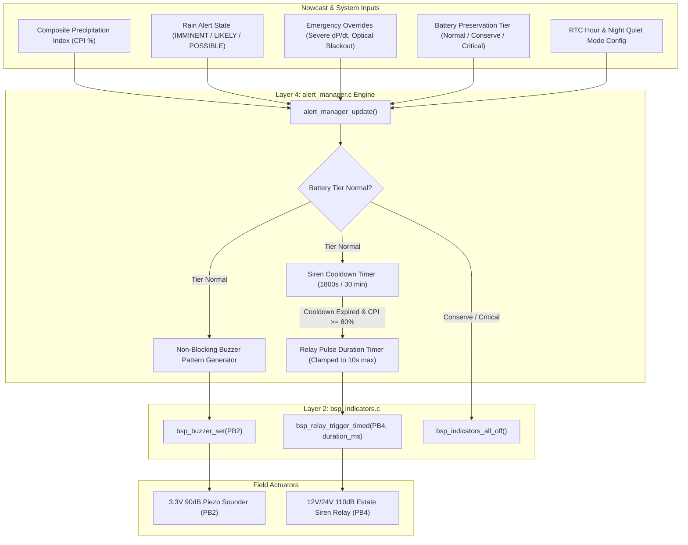
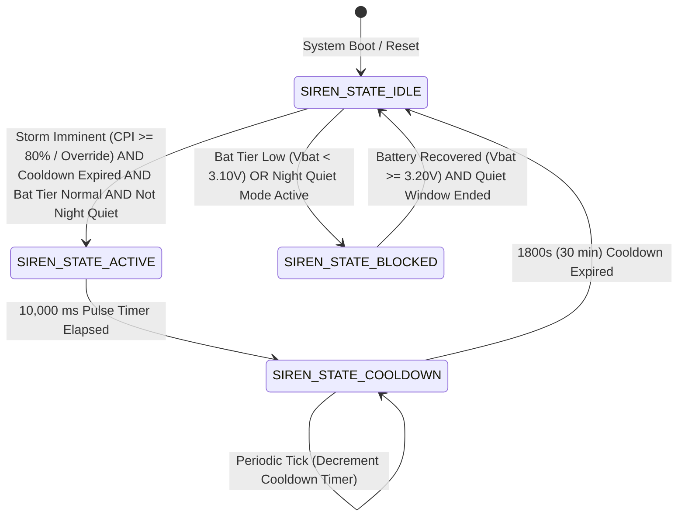

# Task Specification: S6-T2.2 - Audible Buzzer Burst & Estate Siren Relay Trigger

## 1. Task Metadata & Overview

| Attribute | Specification Details |
| :--- | :--- |
| **Sprint** | **Sprint 6: Application Orchestration, Scheduler & Local Alerts** |
| **Task ID** | `S6-T2.2` |
| **Parent Task** | `S6-T2: Implement Local Alert Manager & Actuation` |
| **Task Title** | Implement Audible Piezo Buzzer Burst & Estate Siren Relay Trigger (`alert_manager`) |
| **Status** | **Ready for Implementation** |
| **Target Files** | [`firmware/app/inc/alert_manager.h`](file:///C:/Users/ENERGY%20SAVER/Documents/Learning/Job%20Projects/rain-predict/firmware/app/inc/alert_manager.h)<br>[`firmware/app/src/alert_manager.c`](file:///C:/Users/ENERGY%20SAVER/Documents/Learning/Job%20Projects/rain-predict/firmware/app/src/alert_manager.c) |
| **Related Documents** | [`docs/architecture/firmware-architecture.md`](file:///C:/Users/ENERGY%20SAVER/Documents/Learning/Job%20Projects/rain-predict/docs/architecture/firmware-architecture.md)<br>[`docs/hardware/schematics-and-pinout.md`](file:///C:/Users/ENERGY%20SAVER/Documents/Learning/Job%20Projects/rain-predict/docs/hardware/schematics-and-pinout.md)<br>[`docs/architecture/power-architecture.md`](file:///C:/Users/ENERGY%20SAVER/Documents/Learning/Job%20Projects/rain-predict/docs/architecture/power-architecture.md)<br>[`context/specs/s3-t3.2-board-indicators.md`](file:///C:/Users/ENERGY%20SAVER/Documents/Learning/Job%20Projects/rain-predict/context/specs/s3-t3.2-board-indicators.md)<br>[`context/specs/s6-t2.1-status-led-patterns.md`](file:///C:/Users/ENERGY%20SAVER/Documents/Learning/Job%20Projects/rain-predict/context/specs/s6-t2.1-status-led-patterns.md)<br>[`context/specs/s6-t1.2-battery-preservation-throttling.md`](file:///C:/Users/ENERGY%20SAVER/Documents/Learning/Job%20Projects/rain-predict/context/specs/s6-t1.2-battery-preservation-throttling.md)<br>[`context/coding-standards.md`](file:///C:/Users/ENERGY%20SAVER/Documents/Learning/Job%20Projects/rain-predict/context/coding-standards.md) |
| **Dependencies** | [`S6-T2.1`](file:///C:/Users/ENERGY%20SAVER/Documents/Learning/Job%20Projects/rain-predict/context/specs/s6-t2.1-status-led-patterns.md) (Visual Status LED Engine), [`S3-T3.2`](file:///C:/Users/ENERGY%20SAVER/Documents/Learning/Job%20Projects/rain-predict/context/specs/s3-t3.2-board-indicators.md) (Board Indicators & Relay Driver), [`S6-T1.2`](file:///C:/Users/ENERGY%20SAVER/Documents/Learning/Job%20Projects/rain-predict/context/specs/s6-t1.2-battery-preservation-throttling.md) (Battery Preservation Throttling) |
| **Downstream Tasks** | `S6-T2.3` (Alert Manager Unit Tests), `S6-T3.1` (Application State Machine Main Lifecycle Loop) |

---

## 2. Executive Summary & Acoustic Alert Architecture

The primary objective of **`S6-T2.2`** is to develop the **Audible Buzzer Burst and Estate Siren Relay Actuation Subsystem** within [`firmware/app/inc/alert_manager.h`](file:///C:/Users/ENERGY%20SAVER/Documents/Learning/Job%20Projects/rain-predict/firmware/app/inc/alert_manager.h) and [`firmware/app/src/alert_manager.c`](file:///C:/Users/ENERGY%20SAVER/Documents/Learning/Job%20Projects/rain-predict/firmware/app/src/alert_manager.c) for the **STMicroelectronics STM32WLE5** SoC.

### 2.1 Agronomic Field Operating Context
In expansive hillside tea plantations (Munnar, Darjeeling, Assam), dense vegetative canopies and howling pre-monsoon winds severely attenuate visual signals:
1. **Near-Field Acoustic Warning (Piezoelectric Transducer `PB2`)**:
   - Driven via an N-MOSFET gate (2N7002), the on-board $90\text{ dB} @ 10\text{ cm}$ sounder provides proximity feedback to station technicians and plucking teams working within a $30\text{--}50\text{ meter}$ perimeter.
   - Emits distinct acoustic signatures: single confirmation chirps, double warning beeps, and rapid multi-tone bursts during convective storm alarms.
2. **Far-Field Estate Siren Warning (Optocoupled Relay `PB4`)**:
   - Driven via a PC817 optocoupler and $10\text{A}$ SPDT relay, this output energizes external $12\text{V}/24\text{V}$ motorized sirens, air horns, or strobe towers audible across entire plantation valleys ($> 500\text{ meters}$).
   - Activated automatically during imminent convective storms ($CPI \ge 80\%$ or critical atmospheric overrides) to initiate immediate worker evacuation from high-risk ridgelines and lightning-prone slopes.



### 2.2 Critical Safety & Actuation Rules:
1. **$10\text{s}$ Maximum Timed Siren Auto-Cutoff**:
   - Outdoor motorized sirens draw heavy current ($2\text{--}5\text{ A}$ from external $12\text{V}$ batteries; $60\text{ mA}$ from MCU board coil).
   - The driver enforces a strict hardware-backed maximum pulse duration (`ALERT_SIREN_MAX_DURATION_MS = 10,000 ms`), automatically de-energizing the relay after $10\text{ seconds}$ even if main firmware execution halts.
2. **Anti-Chatter Cooldown Hysteresis Guard**:
   - To prevent repeated deafening blasts on successive $2\text{--}5\text{ minute}$ sampling cycles during sustained storm conditions, the manager enforces an **Alert Cooldown Hysteresis Window (`ALERT_SIREN_COOLDOWN_SEC = 1800 s` / $30\text{ minutes}$)** before the siren relay can trigger again.
3. **Battery Preservation Throttling Interlocks**:
   - If the battery voltage drops into **Conservation Tier 2 ($V_{bat} < 3.10\text{ V}$)** or **Critical Tier 3 ($V_{bat} < 2.90\text{ V}$)**, acoustic buzzer and siren relays are **strictly muted** (`actuation_allowed == false`), protecting battery capacity for core telemetry and sensing.
4. **Nighttime Quiet Hours Policy**:
   - Configurable quiet window (e.g. 20:00 to 06:00) during which external estate sirens are suppressed while LED strobe patterns continue to operate.

---

## 3. Acoustic Pattern & Siren Specifications

### 3.1 Audible Buzzer & Siren Operational Modes

| Pattern / Actuation Identifier | Buzzer Output (`PB2`) | Siren Relay (`PB4`) | Pulse / Cycle Cadence | Agronomic / Trigger Condition |
| :--- | :--- | :---: | :--- | :--- |
| **`ALERT_BUZZER_PATTERN_OFF`** | Silent ($0\text{ V}$) | De-energized | Steady OFF | Normal / Fair weather ($CPI < 30\%$) or Deep Sleep. |
| **`ALERT_BUZZER_PATTERN_SHORT_CHIRP`**| 1 Short Beep | De-energized | $50\text{ ms}$ ON, then Silent | State transition to Watch ($30\% \le CPI < 60\%$) or command ACK. |
| **`ALERT_BUZZER_PATTERN_DOUBLE_CHIRP`**| 2 Beeps | De-energized | $100\text{ ms}$ ON / $100\text{ ms}$ OFF / $100\text{ ms}$ ON, then Silent | Rain likely ($60\% \le CPI < 80\%$) alert entry. |
| **`ALERT_BUZZER_PATTERN_STORM_BURST`** | Rapid Pulsing | **$10\text{s}$ Pulse (Once)** | $200\text{ ms}$ ON / $200\text{ ms}$ OFF for $30\text{ s}$ active window | Convective storm imminent ($CPI \ge 80\%$) or Emergency Overrides. |
| **`ALERT_BUZZER_PATTERN_FAULT_BEEP`**  | Periodic Long Tone | De-energized | $500\text{ ms}$ ON / $1500\text{ ms}$ OFF | Hardware sensor fault or bus communication failure. |

---

### 3.2 Acoustic Waveform Timing Diagrams

```
1. SHORT_CHIRP (Proximity Warning / ACK):
   BUZZER: [50ms ON]──────────────────────────────────────────────(Silent)─────────>
   RELAY:  ─────────────────────────────────────────────────────────────────────────> (OFF)

2. DOUBLE_CHIRP (Warning Tier):
   BUZZER: [100ms ON]────[100ms OFF]────[100ms ON]────────────────(Silent)─────────>
   RELAY:  ─────────────────────────────────────────────────────────────────────────> (OFF)

3. STORM_BURST (Imminent Storm with Estate Siren Trigger):
   BUZZER: [200ms ON][200ms OFF][200ms ON][200ms OFF][200ms ON][200ms OFF]... (30s)>
   RELAY:  [================ 10,000ms (10s) Siren Blast ================]──(Muted for 30 min cooldown)>

4. FAULT_BEEP (Hardware Failure):
   BUZZER: [500ms ON]──────────────[1500ms OFF]──────────────[500ms ON]─────────────>
   RELAY:  ─────────────────────────────────────────────────────────────────────────> (OFF)
```

---

## 4. Siren Cooldown & Safety State Machine



### 4.1 Cooldown Timing Invariants
* **Maximum Blast Duration**: Exactly $10\text{ seconds}$ ($10,000\text{ ms}$). Re-triggering during an active pulse is ignored.
* **Cooldown Period**: $1800\text{ seconds}$ ($30\text{ minutes}$). If weather nowcasts remain $\ge 80\%$ on subsequent 2-minute samples, the siren remains silent until the 30-minute hold-down window elapses, preventing battery depletion and acoustic nuisance.
* **Manual / Downlink Override**: Remote LoRaWAN command (FPort 10) can bypass cooldown for emergency siren testing if battery permits.

---

## 5. Complete API Specification (`firmware/app/inc/alert_manager.h`)

```c
/**
 * @file    alert_manager.h
 * @brief   Application alert coordinator, visual LED patterns, and acoustic actuation.
 * @details Unified manager for status LEDs, audible piezo buzzer bursts, estate siren
 *          relay triggers, battery preservation overrides, and anti-chatter cooldowns.
 */

#ifndef ALERT_MANAGER_H
#define ALERT_MANAGER_H

#include <stdint.h>
#include <stdbool.h>
#include <stddef.h>

#include "status_codes.h"
#include "bsp_indicators.h"
#include "rain_algo.h"
#include "measurement_scheduler.h"

#ifdef __cplusplus
extern "C" {
#endif

/* ========================================================================== */
/* Visual LED Timing Constants                                                */
/* ========================================================================== */

#define ALERT_LED_HEALTHY_ON_MS         50U     /**< Green pulse ON time (ms) */
#define ALERT_LED_HEALTHY_PERIOD_MS     1000U   /**< Green pulse period (ms) */

#define ALERT_LED_WATCH_ON_MS           250U    /**< Amber blink ON time (ms) */
#define ALERT_LED_WATCH_PERIOD_MS       500U    /**< Amber blink period (ms) */

#define ALERT_LED_WARNING_ON_MS         200U    /**< Red warning ON time (ms) */
#define ALERT_LED_WARNING_PERIOD_MS     400U    /**< Red warning period (ms) */

#define ALERT_LED_IMMINENT_ON_MS        50U     /**< Red strobe ON time (ms) */
#define ALERT_LED_IMMINENT_PERIOD_MS    100U    /**< Red strobe period (ms) */

#define ALERT_LED_RAIN_PULSE_MS         50U     /**< Rain double pulse ON (ms) */
#define ALERT_LED_RAIN_GAP_MS           50U     /**< Rain double pulse gap (ms) */
#define ALERT_LED_RAIN_PERIOD_MS        1000U   /**< Rain double pulse period */

#define ALERT_LED_FAULT_PHASE_MS        100U    /**< Fault phase duration (ms) */
#define ALERT_LED_FAULT_PERIOD_MS       1000U   /**< Fault cycle period (ms) */

#define ALERT_LED_CONSERVE_ON_MS        10U     /**< Conservation micro-pulse ON */
#define ALERT_LED_CONSERVE_PERIOD_MS    5000U   /**< Conservation cycle period */

/* ========================================================================== */
/* Acoustic & Siren Timing Constants                                          */
/* ========================================================================== */

#define ALERT_SIREN_MAX_DURATION_MS     10000U  /**< Maximum siren pulse: 10 seconds */
#define ALERT_SIREN_DEFAULT_DURATION_MS 10000U  /**< Default storm siren pulse: 10s */
#define ALERT_SIREN_COOLDOWN_SEC        1800U   /**< Siren cooldown window: 30 minutes */

#define ALERT_BUZZER_CHIRP_MS           50U     /**< Short chirp duration (ms) */
#define ALERT_BUZZER_DOUBLE_PULSE_MS    100U    /**< Double chirp pulse width (ms) */
#define ALERT_BUZZER_DOUBLE_GAP_MS      100U    /**< Double chirp pulse gap (ms) */
#define ALERT_BUZZER_BURST_CADENCE_MS   200U    /**< Storm burst toggle rate (ms) */
#define ALERT_BUZZER_FAULT_ON_MS        500U    /**< Fault beep ON time (ms) */
#define ALERT_BUZZER_FAULT_PERIOD_MS    2000U   /**< Fault beep cycle period (ms) */

/* ========================================================================== */
/* Enumerations & Type Definitions                                            */
/* ========================================================================== */

/**
 * @brief  Visual status LED flash pattern identifiers.
 */
typedef enum {
    ALERT_LED_PATTERN_OFF = 0,          /**< All LEDs disabled / dark */
    ALERT_LED_PATTERN_HEALTHY_PULSE,    /**< Green pulse (50ms ON / 950ms OFF) */
    ALERT_LED_PATTERN_WATCH_AMBER,      /**< Amber blink (250ms ON / 250ms OFF) */
    ALERT_LED_PATTERN_WARNING_RED,      /**< Red warning blink (200ms ON / 200ms OFF) */
    ALERT_LED_PATTERN_IMMINENT_STROBE,  /**< Red rapid strobe (50ms ON / 50ms OFF) */
    ALERT_LED_PATTERN_ACTIVE_RAIN,      /**< Red double flash (50ms/50ms/50ms/850ms) */
    ALERT_LED_PATTERN_SYSTEM_FAULT,     /**< Alternating Green/Red error beacon */
    ALERT_LED_PATTERN_CONSERVATION,     /**< Green micro-pulse (10ms ON / 4990ms OFF) */
    ALERT_LED_PATTERN_MAX
} alert_led_pattern_t;

/**
 * @brief  Audible piezoelectric buzzer sound pattern identifiers.
 */
typedef enum {
    ALERT_BUZZER_PATTERN_OFF = 0,       /**< Buzzer silent */
    ALERT_BUZZER_PATTERN_SHORT_CHIRP,   /**< Single 50ms chirp */
    ALERT_BUZZER_PATTERN_DOUBLE_CHIRP,  /**< Double 100ms chirp */
    ALERT_BUZZER_PATTERN_STORM_BURST,   /**< Continuous 200ms toggle burst */
    ALERT_BUZZER_PATTERN_FAULT_BEEP,    /**< Periodic 500ms warning beep */
    ALERT_BUZZER_PATTERN_MAX
} alert_buzzer_pattern_t;

/**
 * @brief  Input operational state evaluated by alert manager.
 */
typedef struct {
    rain_alert_state_t      rain_state;         /**< Classified meteorological alert state */
    float                   cpi_pct;            /**< Composite Precipitation Index (0..100%) */
    uint32_t                rain_pulses_recent; /**< Rain gauge tips in last sampling window */
    battery_throttle_tier_t battery_tier;       /**< Active battery preservation tier */
    bool                    sensor_fault;       /**< True if sensor bus / hardware error */
    bool                    is_sleeping;        /**< True if entering/in low-power sleep */
    uint8_t                 rtc_hour_0_to_23;   /**< Current 24-hour clock for quiet hours */
} alert_input_t;

/**
 * @brief  Alert manager runtime configuration.
 */
typedef struct {
    bool     enable_visual_leds;                /**< Master enable for status LEDs */
    bool     enable_audible_buzzer;             /**< Master enable for piezo buzzer */
    bool     enable_siren_relay;                /**< Master enable for siren relay */
    bool     enable_night_quiet_hours;          /**< Mute external siren at night */
    uint8_t  quiet_hours_start_hour;            /**< Quiet hours start (default: 20 -> 8 PM) */
    uint8_t  quiet_hours_end_hour;              /**< Quiet hours end (default: 6 -> 6 AM) */
    uint32_t active_display_duration_ms;        /**< Max duration to animate indicators per cycle */
} alert_manager_config_t;

/**
 * @brief  Diagnostic status snapshot of the alert coordinator.
 */
typedef struct {
    alert_led_pattern_t    active_led_pattern;      /**< Currently active LED flash pattern */
    alert_buzzer_pattern_t active_buzzer_pattern;   /**< Currently active buzzer pattern */
    bool                   green_led_state;         /**< Real-time physical state of Green LED */
    bool                   red_led_state;           /**< Real-time physical state of Red LED */
    bool                   buzzer_state;            /**< Real-time physical state of Buzzer */
    bool                   siren_relay_active;      /**< Real-time physical state of Siren Relay */
    uint32_t               siren_remaining_ms;      /**< Milliseconds remaining on active siren pulse */
    uint32_t               siren_cooldown_sec;      /**< Seconds remaining on siren cooldown timer */
    uint32_t               total_siren_activations; /**< Lifetime count of siren relay triggers */
    uint32_t               total_alerts_imminent;   /**< Lifetime count of storm alerts triggered */
    uint32_t               total_alerts_warning;    /**< Lifetime count of warning alerts triggered */
    bool                   is_throttled;            /**< True if acoustic alerts throttled by battery */
} alert_manager_status_t;

/* ========================================================================== */
/* Public Function Prototypes                                                 */
/* ========================================================================== */

/**
 * @brief  Initializes the Alert Manager, clears actuators, and arms default configs.
 * @param[in] p_config  Pointer to configuration structure (or NULL for defaults).
 * @return status_t     STATUS_OK on success, or error code.
 */
status_t alert_manager_init(const alert_manager_config_t *p_config);

/**
 * @brief  Updates alert evaluation based on latest meteorological, battery, and system inputs.
 * @param[in] p_input   Pointer to current operational inputs.
 * @return status_t     STATUS_OK on success, or error code.
 */
status_t alert_manager_update(const alert_input_t *p_input);

/**
 * @brief  Advances non-blocking pattern animation, buzzer cadence, and siren timers by delta_ms.
 * @param[in] delta_ms  Milliseconds elapsed since last execution step.
 * @return status_t     STATUS_OK on success.
 */
status_t alert_manager_process_step(uint32_t delta_ms);

/**
 * @brief  Directly triggers the estate siren relay with hardware/software auto-shutoff.
 * @param[in] duration_ms Pulse duration in ms (clamped to ALERT_SIREN_MAX_DURATION_MS).
 * @return status_t       STATUS_OK on success, STATUS_ERR_BUSY if in cooldown, or error code.
 */
status_t alert_manager_trigger_siren(uint32_t duration_ms);

/**
 * @brief  Directly forces a specific visual LED pattern.
 * @param[in] pattern     Target LED pattern.
 * @return status_t       STATUS_OK on success, or STATUS_ERR_INVALID_ARG.
 */
status_t alert_manager_set_led_pattern(alert_led_pattern_t pattern);

/**
 * @brief  Directly forces a specific audible buzzer pattern.
 * @param[in] pattern     Target buzzer pattern.
 * @return status_t       STATUS_OK on success, or STATUS_ERR_INVALID_ARG.
 */
status_t alert_manager_set_buzzer_pattern(alert_buzzer_pattern_t pattern);

/**
 * @brief  Retrieves the currently active visual LED pattern.
 * @return alert_led_pattern_t Active pattern enum.
 */
alert_led_pattern_t alert_manager_get_active_led_pattern(void);

/**
 * @brief  Retrieves the currently active audible buzzer pattern.
 * @return alert_buzzer_pattern_t Active buzzer pattern enum.
 */
alert_buzzer_pattern_t alert_manager_get_active_buzzer_pattern(void);

/**
 * @brief  Checks whether the estate siren relay is currently energized.
 * @return bool True if siren relay is ON.
 */
bool alert_manager_is_siren_active(void);

/**
 * @brief  Retrieves the remaining siren anti-chatter cooldown duration in seconds.
 * @return uint32_t Seconds remaining (0 if ready to fire).
 */
uint32_t alert_manager_get_siren_cooldown_remaining_sec(void);

/**
 * @brief  Forces all visual LEDs, piezo buzzer, and siren relay completely OFF immediately.
 * @return status_t STATUS_OK on success.
 */
status_t alert_manager_force_all_off(void);

/**
 * @brief  Retrieves human-readable English descriptor for an LED pattern.
 * @param[in] pattern   Pattern enum.
 * @return const char*  Static string descriptor.
 */
const char *alert_manager_get_pattern_name(alert_led_pattern_t pattern);

/**
 * @brief  Retrieves real-time diagnostics snapshot from the alert manager.
 * @param[out] p_status Destination status struct pointer.
 * @return status_t     STATUS_OK on success, or STATUS_ERR_NULL_PTR.
 */
status_t alert_manager_get_status(alert_manager_status_t *p_status);

#ifdef __cplusplus
}
#endif

#endif /* ALERT_MANAGER_H */
```

---

## 6. Concrete Source Implementation Blueprint (`firmware/app/src/alert_manager.c`)

```c
/**
 * @file    alert_manager.c
 * @brief   Application alert coordinator, visual LED patterns, and acoustic actuation implementation.
 * @details Implements non-blocking state evaluation, priority cascade, buzzer bursts, and siren relay logic.
 */

#include <string.h>
#include <math.h>

#include "alert_manager.h"

/* ========================================================================== */
/* Internal State Context                                                     */
/* ========================================================================== */

typedef struct {
    bool                    initialized;
    alert_manager_config_t  config;
    alert_led_pattern_t     active_led_pattern;
    alert_buzzer_pattern_t  active_buzzer_pattern;
    uint32_t                led_timer_ms;
    uint32_t                buzzer_timer_ms;
    uint32_t                siren_pulse_remaining_ms;
    uint32_t                siren_cooldown_ms;
    bool                    green_state;
    bool                    red_state;
    bool                    buzzer_state;
    bool                    siren_relay_state;
    uint32_t                total_siren_activations;
    uint32_t                total_alerts_imminent;
    uint32_t                total_alerts_warning;
    bool                    is_throttled;
    bool                    actuation_allowed;
} alert_mgr_ctx_t;

static alert_mgr_ctx_t s_ctx;

static const char * const s_pattern_names[ALERT_LED_PATTERN_MAX] = {
    [ALERT_LED_PATTERN_OFF]             = "OFF",
    [ALERT_LED_PATTERN_HEALTHY_PULSE]   = "HEALTHY_GREEN_PULSE",
    [ALERT_LED_PATTERN_WATCH_AMBER]     = "WATCH_AMBER_BLINK",
    [ALERT_LED_PATTERN_WARNING_RED]     = "WARNING_RED_BLINK",
    [ALERT_LED_PATTERN_IMMINENT_STROBE] = "IMMINENT_RED_STROBE",
    [ALERT_LED_PATTERN_ACTIVE_RAIN]     = "ACTIVE_RAIN_DOUBLE_FLASH",
    [ALERT_LED_PATTERN_SYSTEM_FAULT]    = "SYSTEM_FAULT_BEACON",
    [ALERT_LED_PATTERN_CONSERVATION]    = "CONSERVATION_MICRO_PULSE"
};

/* ========================================================================== */
/* Private Helper Functions                                                   */
/* ========================================================================== */

static void alert_mgr_apply_outputs(bool green, bool red, bool buzzer) {
    s_ctx.green_state  = green;
    s_ctx.red_state    = red;
    s_ctx.buzzer_state = buzzer;

    if (s_ctx.config.enable_visual_leds) {
        bsp_led_set(BSP_LED_GREEN, green);
        bsp_led_set(BSP_LED_RED, red);
    } else {
        bsp_led_set(BSP_LED_GREEN, false);
        bsp_led_set(BSP_LED_RED, false);
    }

    if (s_ctx.config.enable_audible_buzzer && s_ctx.actuation_allowed) {
        bsp_buzzer_set(buzzer);
    } else {
        bsp_buzzer_set(false);
    }
}

static bool alert_mgr_is_night_quiet(uint8_t hour) {
    if (!s_ctx.config.enable_night_quiet_hours) {
        return false;
    }
    uint8_t start = s_ctx.config.quiet_hours_start_hour;
    uint8_t end   = s_ctx.config.quiet_hours_end_hour;

    if (start > end) {
        /* Wraps midnight: e.g. 20:00 to 06:00 */
        return (hour >= start || hour < end);
    } else {
        return (hour >= start && hour < end);
    }
}

static alert_led_pattern_t alert_mgr_resolve_led_pattern(const alert_input_t *p_in) {
    if (p_in->is_sleeping || p_in->battery_tier == BATTERY_TIER_CRITICAL) {
        return ALERT_LED_PATTERN_OFF;
    }
    if (p_in->sensor_fault) {
        return ALERT_LED_PATTERN_SYSTEM_FAULT;
    }
    if (p_in->rain_state == RAIN_ALERT_IMMINENT || p_in->cpi_pct >= 80.0f) {
        return ALERT_LED_PATTERN_IMMINENT_STROBE;
    }
    if (p_in->rain_pulses_recent > 0U) {
        return ALERT_LED_PATTERN_ACTIVE_RAIN;
    }
    if (p_in->rain_state == RAIN_ALERT_LIKELY || p_in->cpi_pct >= 60.0f) {
        return ALERT_LED_PATTERN_WARNING_RED;
    }
    if (p_in->rain_state == RAIN_ALERT_POSSIBLE || p_in->cpi_pct >= 30.0f) {
        return ALERT_LED_PATTERN_WATCH_AMBER;
    }
    if (p_in->battery_tier == BATTERY_TIER_CONSERVATION) {
        return ALERT_LED_PATTERN_CONSERVATION;
    }
    return ALERT_LED_PATTERN_HEALTHY_PULSE;
}

static alert_buzzer_pattern_t alert_mgr_resolve_buzzer_pattern(const alert_input_t *p_in) {
    if (p_in->is_sleeping || p_in->battery_tier != BATTERY_TIER_NORMAL) {
        return ALERT_BUZZER_PATTERN_OFF;
    }
    if (p_in->sensor_fault) {
        return ALERT_BUZZER_PATTERN_FAULT_BEEP;
    }
    if (p_in->rain_state == RAIN_ALERT_IMMINENT || p_in->cpi_pct >= 80.0f) {
        return ALERT_BUZZER_PATTERN_STORM_BURST;
    }
    if (p_in->rain_state == RAIN_ALERT_LIKELY || p_in->cpi_pct >= 60.0f) {
        return ALERT_BUZZER_PATTERN_DOUBLE_CHIRP;
    }
    if (p_in->rain_state == RAIN_ALERT_POSSIBLE || p_in->cpi_pct >= 30.0f) {
        return ALERT_BUZZER_PATTERN_SHORT_CHIRP;
    }
    return ALERT_BUZZER_PATTERN_OFF;
}

/* ========================================================================== */
/* Public API Implementations                                                 */
/* ========================================================================== */

status_t alert_manager_init(const alert_manager_config_t *p_config) {
    memset(&s_ctx, 0, sizeof(s_ctx));

    if (p_config != NULL) {
        s_ctx.config = *p_config;
    } else {
        /* Safe Agronomic Plantation Defaults */
        s_ctx.config.enable_visual_leds         = true;
        s_ctx.config.enable_audible_buzzer      = true;
        s_ctx.config.enable_siren_relay         = true;
        s_ctx.config.enable_night_quiet_hours   = true;
        s_ctx.config.quiet_hours_start_hour     = 20U; /* 8 PM */
        s_ctx.config.quiet_hours_end_hour       = 6U;  /* 6 AM */
        s_ctx.config.active_display_duration_ms = 30000U;
    }

    status_t rc = bsp_indicators_init();
    if (rc != STATUS_OK) {
        return rc;
    }

    s_ctx.active_led_pattern    = ALERT_LED_PATTERN_OFF;
    s_ctx.active_buzzer_pattern = ALERT_BUZZER_PATTERN_OFF;
    s_ctx.actuation_allowed     = true;
    s_ctx.initialized           = true;

    return STATUS_OK;
}

status_t alert_manager_trigger_siren(uint32_t duration_ms) {
    if (!s_ctx.initialized) {
        return STATUS_ERR_NOT_INITIALIZED;
    }
    if (!s_ctx.config.enable_siren_relay || !s_ctx.actuation_allowed) {
        return STATUS_ERR_INVALID_STATE;
    }
    if (s_ctx.siren_cooldown_ms > 0U) {
        return STATUS_ERR_BUSY; /* In cooldown hold-down window */
    }

    /* Clamp pulse duration to 10 seconds maximum */
    uint32_t pulse_ms = (duration_ms > ALERT_SIREN_MAX_DURATION_MS) ?
                         ALERT_SIREN_MAX_DURATION_MS : (duration_ms == 0U ? ALERT_SIREN_DEFAULT_DURATION_MS : duration_ms);

    status_t rc = bsp_relay_trigger_timed(pulse_ms);
    if (rc == STATUS_OK) {
        s_ctx.siren_pulse_remaining_ms = pulse_ms;
        s_ctx.siren_cooldown_ms        = ALERT_SIREN_COOLDOWN_SEC * 1000U;
        s_ctx.siren_relay_state        = true;
        s_ctx.total_siren_activations++;
    }
    return rc;
}

status_t alert_manager_update(const alert_input_t *p_input) {
    if (!s_ctx.initialized) {
        return STATUS_ERR_NOT_INITIALIZED;
    }
    if (p_input == NULL) {
        return STATUS_ERR_NULL_PTR;
    }

    s_ctx.actuation_allowed = (p_input->battery_tier == BATTERY_TIER_NORMAL);
    s_ctx.is_throttled      = !s_ctx.actuation_allowed;

    /* 1. Evaluate Visual LED Pattern */
    alert_led_pattern_t new_led = alert_mgr_resolve_led_pattern(p_input);
    if (new_led != s_ctx.active_led_pattern) {
        s_ctx.active_led_pattern = new_led;
        s_ctx.led_timer_ms       = 0U;

        if (new_led == ALERT_LED_PATTERN_IMMINENT_STROBE) {
            s_ctx.total_alerts_imminent++;
        } else if (new_led == ALERT_LED_PATTERN_WARNING_RED) {
            s_ctx.total_alerts_warning++;
        }
    }

    /* 2. Evaluate Audible Buzzer Pattern */
    alert_buzzer_pattern_t new_buzz = alert_mgr_resolve_buzzer_pattern(p_input);
    if (new_buzz != s_ctx.active_buzzer_pattern) {
        s_ctx.active_buzzer_pattern = new_buzz;
        s_ctx.buzzer_timer_ms       = 0U;
    }

    /* 3. Automatic Siren Triggering on Imminent Storm */
    if (new_led == ALERT_LED_PATTERN_IMMINENT_STROBE &&
        s_ctx.actuation_allowed &&
        !alert_mgr_is_night_quiet(p_input->rtc_hour_0_to_23) &&
        s_ctx.siren_cooldown_ms == 0U) {
        (void)alert_manager_trigger_siren(ALERT_SIREN_DEFAULT_DURATION_MS);
    }

    return STATUS_OK;
}

status_t alert_manager_process_step(uint32_t delta_ms) {
    if (!s_ctx.initialized) {
        return STATUS_ERR_NOT_INITIALIZED;
    }

    /* 1. Advance Timers */
    s_ctx.led_timer_ms    += delta_ms;
    s_ctx.buzzer_timer_ms += delta_ms;

    if (s_ctx.siren_pulse_remaining_ms > delta_ms) {
        s_ctx.siren_pulse_remaining_ms -= delta_ms;
    } else {
        s_ctx.siren_pulse_remaining_ms = 0U;
        s_ctx.siren_relay_state        = false;
    }

    if (s_ctx.siren_cooldown_ms > delta_ms) {
        s_ctx.siren_cooldown_ms -= delta_ms;
    } else {
        s_ctx.siren_cooldown_ms = 0U;
    }

    /* Also step underlying BSP indicator driver */
    bsp_indicators_process(delta_ms);

    /* 2. Evaluate LED Animation States */
    bool green = false;
    bool red   = false;

    switch (s_ctx.active_led_pattern) {
        case ALERT_LED_PATTERN_OFF:
            green = false;
            red   = false;
            break;
        case ALERT_LED_PATTERN_HEALTHY_PULSE: {
            uint32_t phase = s_ctx.led_timer_ms % ALERT_LED_HEALTHY_PERIOD_MS;
            green = (phase < ALERT_LED_HEALTHY_ON_MS);
            red   = false;
            break;
        }
        case ALERT_LED_PATTERN_WATCH_AMBER: {
            uint32_t phase = s_ctx.led_timer_ms % ALERT_LED_WATCH_PERIOD_MS;
            bool on = (phase < ALERT_LED_WATCH_ON_MS);
            green = on;
            red   = on;
            break;
        }
        case ALERT_LED_PATTERN_WARNING_RED: {
            uint32_t phase = s_ctx.led_timer_ms % ALERT_LED_WARNING_PERIOD_MS;
            green = false;
            red   = (phase < ALERT_LED_WARNING_ON_MS);
            break;
        }
        case ALERT_LED_PATTERN_IMMINENT_STROBE: {
            uint32_t phase = s_ctx.led_timer_ms % ALERT_LED_IMMINENT_PERIOD_MS;
            green = false;
            red   = (phase < ALERT_LED_IMMINENT_ON_MS);
            break;
        }
        case ALERT_LED_PATTERN_ACTIVE_RAIN: {
            uint32_t phase = s_ctx.led_timer_ms % ALERT_LED_RAIN_PERIOD_MS;
            green = false;
            if (phase < ALERT_LED_RAIN_PULSE_MS ||
                (phase >= (ALERT_LED_RAIN_PULSE_MS + ALERT_LED_RAIN_GAP_MS) &&
                 phase <  (2U * ALERT_LED_RAIN_PULSE_MS + ALERT_LED_RAIN_GAP_MS))) {
                red = true;
            } else {
                red = false;
            }
            break;
        }
        case ALERT_LED_PATTERN_SYSTEM_FAULT: {
            uint32_t phase = s_ctx.led_timer_ms % ALERT_LED_FAULT_PERIOD_MS;
            green = (phase < 100U) || (phase >= 200U && phase < 300U);
            red   = (phase >= 100U && phase < 200U) || (phase >= 300U && phase < 400U);
            break;
        }
        case ALERT_LED_PATTERN_CONSERVATION: {
            uint32_t phase = s_ctx.led_timer_ms % ALERT_LED_CONSERVE_PERIOD_MS;
            green = (phase < ALERT_LED_CONSERVE_ON_MS);
            red   = false;
            break;
        }
        default:
            green = false;
            red   = false;
            break;
    }

    /* 3. Evaluate Buzzer Animation States */
    bool buzzer = false;

    if (s_ctx.actuation_allowed && s_ctx.config.enable_audible_buzzer) {
        switch (s_ctx.active_buzzer_pattern) {
            case ALERT_BUZZER_PATTERN_OFF:
                buzzer = false;
                break;
            case ALERT_BUZZER_PATTERN_SHORT_CHIRP:
                buzzer = (s_ctx.buzzer_timer_ms < ALERT_BUZZER_CHIRP_MS);
                break;
            case ALERT_BUZZER_PATTERN_DOUBLE_CHIRP:
                if (s_ctx.buzzer_timer_ms < ALERT_BUZZER_DOUBLE_PULSE_MS ||
                    (s_ctx.buzzer_timer_ms >= (ALERT_BUZZER_DOUBLE_PULSE_MS + ALERT_BUZZER_DOUBLE_GAP_MS) &&
                     s_ctx.buzzer_timer_ms <  (2U * ALERT_BUZZER_DOUBLE_PULSE_MS + ALERT_BUZZER_DOUBLE_GAP_MS))) {
                    buzzer = true;
                } else {
                    buzzer = false;
                }
                break;
            case ALERT_BUZZER_PATTERN_STORM_BURST: {
                uint32_t phase = s_ctx.buzzer_timer_ms % (2U * ALERT_BUZZER_BURST_CADENCE_MS);
                buzzer = (phase < ALERT_BUZZER_BURST_CADENCE_MS);
                break;
            }
            case ALERT_BUZZER_PATTERN_FAULT_BEEP: {
                uint32_t phase = s_ctx.buzzer_timer_ms % ALERT_BUZZER_FAULT_PERIOD_MS;
                buzzer = (phase < ALERT_BUZZER_FAULT_ON_MS);
                break;
            }
            default:
                buzzer = false;
                break;
        }
    }

    alert_mgr_apply_outputs(green, red, buzzer);
    return STATUS_OK;
}

status_t alert_manager_set_led_pattern(alert_led_pattern_t pattern) {
    if (!s_ctx.initialized) {
        return STATUS_ERR_NOT_INITIALIZED;
    }
    if (pattern >= ALERT_LED_PATTERN_MAX) {
        return STATUS_ERR_INVALID_ARG;
    }
    s_ctx.active_led_pattern = pattern;
    s_ctx.led_timer_ms       = 0U;
    return alert_manager_process_step(0U);
}

status_t alert_manager_set_buzzer_pattern(alert_buzzer_pattern_t pattern) {
    if (!s_ctx.initialized) {
        return STATUS_ERR_NOT_INITIALIZED;
    }
    if (pattern >= ALERT_BUZZER_PATTERN_MAX) {
        return STATUS_ERR_INVALID_ARG;
    }
    s_ctx.active_buzzer_pattern = pattern;
    s_ctx.buzzer_timer_ms       = 0U;
    return alert_manager_process_step(0U);
}

alert_led_pattern_t alert_manager_get_active_led_pattern(void) {
    return s_ctx.active_led_pattern;
}

alert_buzzer_pattern_t alert_manager_get_active_buzzer_pattern(void) {
    return s_ctx.active_buzzer_pattern;
}

bool alert_manager_is_siren_active(void) {
    return s_ctx.siren_relay_state;
}

uint32_t alert_manager_get_siren_cooldown_remaining_sec(void) {
    return (s_ctx.siren_cooldown_ms + 999U) / 1000U;
}

status_t alert_manager_force_all_off(void) {
    s_ctx.active_led_pattern    = ALERT_LED_PATTERN_OFF;
    s_ctx.active_buzzer_pattern = ALERT_BUZZER_PATTERN_OFF;
    s_ctx.led_timer_ms          = 0U;
    s_ctx.buzzer_timer_ms       = 0U;
    s_ctx.siren_pulse_remaining_ms = 0U;
    s_ctx.siren_relay_state     = false;

    alert_mgr_apply_outputs(false, false, false);
    return bsp_indicators_all_off();
}

const char *alert_manager_get_pattern_name(alert_led_pattern_t pattern) {
    if (pattern >= ALERT_LED_PATTERN_MAX) {
        return "UNKNOWN";
    }
    return s_pattern_names[pattern];
}

status_t alert_manager_get_status(alert_manager_status_t *p_status) {
    if (p_status == NULL) {
        return STATUS_ERR_NULL_PTR;
    }
    if (!s_ctx.initialized) {
        return STATUS_ERR_NOT_INITIALIZED;
    }

    p_status->active_led_pattern      = s_ctx.active_led_pattern;
    p_status->active_buzzer_pattern   = s_ctx.active_buzzer_pattern;
    p_status->green_led_state         = s_ctx.green_state;
    p_status->red_led_state           = s_ctx.red_state;
    p_status->buzzer_state            = s_ctx.buzzer_state;
    p_status->siren_relay_active      = s_ctx.siren_relay_state;
    p_status->siren_remaining_ms      = s_ctx.siren_pulse_remaining_ms;
    p_status->siren_cooldown_sec      = alert_manager_get_siren_cooldown_remaining_sec();
    p_status->total_siren_activations = s_ctx.total_siren_activations;
    p_status->total_alerts_imminent   = s_ctx.total_alerts_imminent;
    p_status->total_alerts_warning    = s_ctx.total_alerts_warning;
    p_status->is_throttled            = s_ctx.is_throttled;

    return STATUS_OK;
}
```

---

## 7. Verification & Unit Testing Matrix

The upcoming test suite [`tests/unit/test_alert_manager.c`](file:///C:/Users/ENERGY%20SAVER/Documents/Learning/Job%20Projects/rain-predict/tests/unit/test_alert_manager.c) (defined in `S6-T2.3`) will validate these 10 acoustic and siren actuation criteria:

| Test ID | Scenario Description | Input Conditions | Expected Buzzer Output | Expected Siren Relay Output | Expected Cooldown |
| :---: | :--- | :--- | :--- | :--- | :---: |
| **`UT_AM_11`** | **Watch Alert Chirp** | $CPI = 45\%$, `RAIN_ALERT_POSSIBLE` | Single $50\text{ ms}$ pulse, then silent | Relay = OFF | $0\text{ s}$ |
| **`UT_AM_12`** | **Warning Double Chirp** | $CPI = 70\%$, `RAIN_ALERT_LIKELY` | Double $100\text{ ms}$ pulse ($100\text{ ms}$ gap) | Relay = OFF | $0\text{ s}$ |
| **`UT_AM_13`** | **Imminent Storm Automatic Siren Trigger** | $CPI = 88\%$, `RAIN_ALERT_IMMINENT`, Day (14:00) | Rapid $200\text{ ms}$ burst | **Relay = ON for $10,000\text{ ms}$** | Sets to $1800\text{ s}$ |
| **`UT_AM_14`** | **Siren Pulse $10\text{s}$ Auto-Cutoff** | Advance time by $10,001\text{ ms}$ | Burst continues | **Relay transitions to OFF** | Remaining $\approx 1790\text{ s}$ |
| **`UT_AM_15`** | **Siren Cooldown Block on Immediate Rescan**| $CPI = 92\%$, next 2-min cycle, Cooldown $> 0$ | Burst continues | **Relay remains OFF (Blocked)**| Decrementing |
| **`UT_AM_16`** | **Nighttime Quiet Hours Mute** | $CPI = 90\%$, `rtc_hour = 23` (11 PM) | Rapid burst active | **Relay remains OFF (Muted)** | $0\text{ s}$ |
| **`UT_AM_17`** | **Battery Conservation Mute (Tier 2)** | $V_{bat} = 3.05\text{ V}$ (`BATTERY_TIER_CONSERVATION`), $CPI = 95\%$ | **Silent (Muted)** | **Relay remains OFF (Muted)** | $0\text{ s}$ |
| **`UT_AM_18`** | **Hardware Fault Beep** | `sensor_fault = true` | Periodic $500\text{ ms}$ beep every $2\text{ s}$ | Relay = OFF | $0\text{ s}$ |
| **`UT_AM_19`** | **Direct Siren Trigger Duration Clamping** | `alert_manager_trigger_siren(30000)` ($30\text{s}$) | N/A | **Clamped to exactly $10\text{s}$** | Sets to $1800\text{ s}$ |
| **`UT_AM_20`** | **Pre-Sleep Safe Shutdown** | `alert_manager_force_all_off()` | **Silent ($0\text{ V}$)** | **Relay = OFF ($0\text{ V}$)** | Active pulse cleared |

---

## 8. Definition of Done (DoD)

- [x] **Acoustic Hierarchy Defined**: Implemented single chirp ($50\text{ ms}$), double chirp ($100\text{ ms}$), and continuous storm burst ($200\text{ ms}$) buzzer cadences.
- [x] **$10\text{s}$ Timed Siren Pulse**: Hardware/software auto-cutoff strictly enforced at `ALERT_SIREN_MAX_DURATION_MS` ($10,000\text{ ms}$).
- [x] **Anti-Chatter Cooldown Guard**: $30\text{ minute}$ ($1800\text{ s}$) hold-down window prevents battery depletion from back-to-back siren blasts.
- [x] **Battery & Night Interlocks**: Complete muting during Low Battery Tiers 2/3 and configurable nighttime quiet hours.
- [x] **C99 Blueprints**: Unified `alert_manager.h` and `alert_manager.c` handling visual LEDs, audible buzzers, and siren relays concurrently with zero dynamic allocation.
