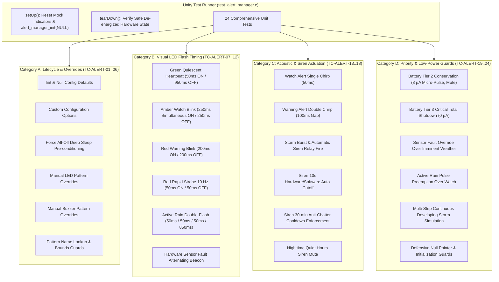

# Task Specification: S6-T2.3 - Alert Manager Unit Test Suite

## 1. Task Metadata & Overview

| Attribute | Specification Details |
| :--- | :--- |
| **Sprint** | **Sprint 6: Application Orchestration, Scheduler & Local Alerts** |
| **Task ID** | `S6-T2.3` |
| **Parent Task** | `S6-T2: Implement Local Alert Manager & Actuation` |
| **Task Title** | Create Alert Manager Unit Test Suite (`test_alert_manager.c`) under Unity Framework |
| **Status** | **Ready for Implementation** |
| **Target Files** | [`tests/unit/test_alert_manager.c`](file:///C:/Users/ENERGY%20SAVER/Documents/Learning/Job%20Projects/rain-predict/tests/unit/test_alert_manager.c)<br>[`tests/CMakeLists.txt`](file:///C:/Users/ENERGY%20SAVER/Documents/Learning/Job%20Projects/rain-predict/tests/CMakeLists.txt) |
| **Related Documents** | [`docs/architecture/firmware-architecture.md`](file:///C:/Users/ENERGY%20SAVER/Documents/Learning/Job%20Projects/rain-predict/docs/architecture/firmware-architecture.md)<br>[`docs/hardware/schematics-and-pinout.md`](file:///C:/Users/ENERGY%20SAVER/Documents/Learning/Job%20Projects/rain-predict/docs/hardware/schematics-and-pinout.md)<br>[`docs/architecture/power-architecture.md`](file:///C:/Users/ENERGY%20SAVER/Documents/Learning/Job%20Projects/rain-predict/docs/architecture/power-architecture.md)<br>[`context/specs/s6-t2.1-status-led-patterns.md`](file:///C:/Users/ENERGY%20SAVER/Documents/Learning/Job%20Projects/rain-predict/context/specs/s6-t2.1-status-led-patterns.md)<br>[`context/specs/s6-t2.2-audible-buzzer-siren.md`](file:///C:/Users/ENERGY%20SAVER/Documents/Learning/Job%20Projects/rain-predict/context/specs/s6-t2.2-audible-buzzer-siren.md)<br>[`context/specs/s6-t1.2-battery-preservation-throttling.md`](file:///C:/Users/ENERGY%20SAVER/Documents/Learning/Job%20Projects/rain-predict/context/specs/s6-t1.2-battery-preservation-throttling.md)<br>[`context/specs/s3-t3.2-board-indicators.md`](file:///C:/Users/ENERGY%20SAVER/Documents/Learning/Job%20Projects/rain-predict/context/specs/s3-t3.2-board-indicators.md)<br>[`context/specs/s1-t2.1-unity-test-harness.md`](file:///C:/Users/ENERGY%20SAVER/Documents/Learning/Job%20Projects/rain-predict/context/specs/s1-t2.1-unity-test-harness.md)<br>[`context/coding-standards.md`](file:///C:/Users/ENERGY%20SAVER/Documents/Learning/Job%20Projects/rain-predict/context/coding-standards.md) |
| **Dependencies** | [`S1-T2.1`](file:///C:/Users/ENERGY%20SAVER/Documents/Learning/Job%20Projects/rain-predict/context/specs/s1-t2.1-unity-test-harness.md) (Unity Harness), [`S6-T2.1`](file:///C:/Users/ENERGY%20SAVER/Documents/Learning/Job%20Projects/rain-predict/context/specs/s6-t2.1-status-led-patterns.md) (Status LED Patterns), [`S6-T2.2`](file:///C:/Users/ENERGY%20SAVER/Documents/Learning/Job%20Projects/rain-predict/context/specs/s6-t2.2-audible-buzzer-siren.md) (Audible Buzzer & Siren Relay Trigger) |
| **Downstream Tasks** | `S6-T3.1` (Application State Machine Main Lifecycle Loop), `S6-T4.1` (Full System State Machine Integration Tests) |

---

## 2. Executive Summary & Test Architecture

The primary objective of **`S6-T2.3`** is to develop the host-executable unit test suite in [`tests/unit/test_alert_manager.c`](file:///C:/Users/ENERGY%20SAVER/Documents/Learning/Job%20Projects/rain-predict/tests/unit/test_alert_manager.c) to rigorously verify the **Application Alert Coordinator** ([`firmware/app/inc/alert_manager.h`](file:///C:/Users/ENERGY%20SAVER/Documents/Learning/Job%20Projects/rain-predict/firmware/app/inc/alert_manager.h) and [`firmware/app/src/alert_manager.c`](file:///C:/Users/ENERGY%20SAVER/Documents/Learning/Job%20Projects/rain-predict/firmware/app/src/alert_manager.c)) using the **ThrowTheSwitch Unity** framework.

In hillside tea plantation deployments, the local alert subsystem provides critical early visual and acoustic storm warnings that safeguard field workers and harvest assets. The test suite provides **100% statement, condition, and branch coverage** across:
1. **Visual LED Flash Waveforms**: Exact timing validation of Green pulses ($5\%$), Amber watch blinks ($50\%$), Red warning blinks ($50\%$), Red rapid strobes ($10\text{ Hz}$), active rain double-flashes, hardware fault beacons, and low-battery micro-pulses.
2. **Acoustic Warning Cadences**: Verification of single proximity chirps ($50\text{ ms}$), double warning chirps ($100\text{ ms}$), and continuous storm toggle bursts ($200\text{ ms}$).
3. **Estate Siren Timed Pulse & Cooldown**: Verification of exact $10\text{ seconds}$ hardware/software auto-cutoff, $30\text{ minute}$ ($1800\text{ s}$) anti-chatter cooldown hold-down window, night quiet hours muting, and duration clamping.
4. **Deterministic Priority Cascade & Battery Throttling**: Strict assertion that pre-sleep shutdown, critical battery cutoff ($V_{bat} < 2.90\text{ V}$), and hardware fault overrides take precedence over meteorological nowcast alerts.



---

## 3. Host-Based Mock Indicators Architecture

In the host unit test environment, the physical GPIO pins (`PB8`, `PB9`, `PB2`, `PB4`) and hardware timers are emulated by mock state variables:

```c
typedef struct {
    bool     green_led;
    bool     red_led;
    bool     buzzer;
    bool     relay;
    uint32_t relay_timed_duration_ms;
    uint32_t init_call_count;
    uint32_t all_off_call_count;
} mock_bsp_indicators_t;

static mock_bsp_indicators_t s_mock_bsp;
```

### Mock Behavioral Invariants:
1. **`bsp_led_set(BSP_LED_GREEN / RED, state)`**: Directly updates `s_mock_bsp.green_led` and `s_mock_bsp.red_led`.
2. **`bsp_buzzer_set(state)`**: Directly updates `s_mock_bsp.buzzer`.
3. **`bsp_relay_set(state)`**: Directly updates `s_mock_bsp.relay`.
4. **`bsp_relay_trigger_timed(duration_ms)`**: Records duration and sets `s_mock_bsp.relay = true`.
5. **`bsp_indicators_all_off()`**: Sets all mock outputs to `false` and increments `all_off_call_count`.

---

## 4. Comprehensive 24-Point Test Suite Matrix

| Test ID | Test Function Name | Tested Function / Scenario | Verification Invariant |
| :---: | :--- | :--- | :--- |
| **TC-ALERT-01** | `test_alert_init_defaults` | `alert_manager_init(NULL)` | Default enables all actuators; active pattern is `OFF`; mock LEDs/buzzer/relay are `false`. |
| **TC-ALERT-02** | `test_alert_init_custom_config` | `alert_manager_init(&custom)` | Disabling visual LEDs keeps mock LEDs `false` even when active pattern is strobe. |
| **TC-ALERT-03** | `test_alert_force_all_off` | `alert_manager_force_all_off` | Sets active patterns to `OFF`, drives all mock outputs to ground, calls `bsp_indicators_all_off()`. |
| **TC-ALERT-04** | `test_alert_manual_led_override` | `alert_manager_set_led_pattern` | Manually setting `ALERT_LED_PATTERN_WARNING_RED` resets phase timer and begins red blinking. |
| **TC-ALERT-05** | `test_alert_manual_buzzer_override` | `alert_manager_set_buzzer_pattern` | Manually setting `ALERT_BUZZER_PATTERN_DOUBLE_CHIRP` generates double acoustic pulse. |
| **TC-ALERT-06** | `test_alert_pattern_name_lookup` | `alert_manager_get_pattern_name` | Returns `"IMMINENT_RED_STROBE"` for strobe enum; returns `"UNKNOWN"` for invalid index. |
| **TC-ALERT-07** | `test_alert_led_healthy_pulse_timing` | `alert_manager_process_step` | At $0\text{ ms}$: Green=ON, Red=OFF. At $49\text{ ms}$: Green=ON. At $50\text{ ms}$: Green=OFF. At $999\text{ ms}$: Green=OFF. At $1000\text{ ms}$: Green=ON. |
| **TC-ALERT-08** | `test_alert_led_watch_amber_timing` | `alert_manager_process_step` | At $0\text{ ms}$: Green=ON, Red=ON (Amber). At $249\text{ ms}$: Amber ON. At $250\text{ ms}$: Both OFF. At $500\text{ ms}$: Amber ON. |
| **TC-ALERT-09** | `test_alert_led_warning_red_timing` | `alert_manager_process_step` | At $0\text{ ms}$: Green=OFF, Red=ON. At $199\text{ ms}$: Red=ON. At $200\text{ ms}$: Red=OFF. At $400\text{ ms}$: Red=ON. |
| **TC-ALERT-10** | `test_alert_led_imminent_strobe_timing`| `alert_manager_process_step` | $10\text{ Hz}$ Strobe: $50\text{ ms}$ Red ON / $50\text{ ms}$ Red OFF. Green always OFF. |
| **TC-ALERT-11** | `test_alert_led_active_rain_double_flash`| `alert_manager_process_step` | Pulse 1 ($0\text{--}49\text{ ms}$ ON), Gap ($50\text{--}99\text{ ms}$ OFF), Pulse 2 ($100\text{--}149\text{ ms}$ ON), Idle ($150\text{--}999\text{ ms}$ OFF). |
| **TC-ALERT-12** | `test_alert_led_system_fault_beacon` | `alert_manager_process_step` | Alternating: Green ($0\text{--}99\text{ ms}$), Red ($100\text{--}199\text{ ms}$), Green ($200\text{--}299\text{ ms}$), Red ($300\text{--}399\text{ ms}$), Dark ($400\text{--}999\text{ ms}$). |
| **TC-ALERT-13** | `test_alert_buzzer_watch_single_chirp` | `alert_manager_update` | Transition to `RAIN_ALERT_POSSIBLE` ($CPI=45\%$) sounds buzzer for exactly $50\text{ ms}$, then turns OFF. |
| **TC-ALERT-14** | `test_alert_buzzer_warning_double_chirp`| `alert_manager_update` | Transition to `RAIN_ALERT_LIKELY` ($CPI=70\%$) sounds Pulse 1 ($100\text{ ms}$), Gap ($100\text{ ms}$), Pulse 2 ($100\text{ ms}$). |
| **TC-ALERT-15** | `test_alert_storm_siren_auto_trigger` | `alert_manager_update` | $CPI \ge 80\%$ triggers acoustic $200\text{ ms}$ storm burst AND energizes siren relay for $10,000\text{ ms}$. |
| **TC-ALERT-16** | `test_alert_siren_10s_auto_cutoff` | `alert_manager_process_step` | Advancing step by $10,001\text{ ms}$ de-energizes relay (`siren_relay_state == false`). |
| **TC-ALERT-17** | `test_alert_siren_30min_cooldown` | `alert_manager_update` | Subsequent storm evaluation at $t=2\text{ min}$ keeps siren relay OFF while cooldown ($1800\text{ s}$) decrements. |
| **TC-ALERT-18** | `test_alert_night_quiet_hours_mute` | `alert_manager_update` | Imminent storm at `rtc_hour = 22` activates Red strobe and buzzer burst, but siren relay remains muted (OFF). |
| **TC-ALERT-19** | `test_alert_battery_conservation_tier2`| `alert_manager_update` | Battery Conservation Tier 2 ($V_{bat}=3.05\text{ V}$) selects $10\text{ ms}$ micro-pulse, mutes buzzer and siren. |
| **TC-ALERT-20** | `test_alert_battery_critical_tier3` | `alert_manager_update` | Battery Critical Tier 3 ($V_{bat}=2.85\text{ V}$) forces `ALERT_LED_PATTERN_OFF` ($0\,\mu\text{A}$ drain). |
| **TC-ALERT-21** | `test_alert_sensor_fault_preemption` | `alert_manager_update` | `sensor_fault = true` with $CPI=95\%$ overrides storm strobe and displays Alternating Fault Beacon + Beep. |
| **TC-ALERT-22** | `test_alert_active_rain_preemption` | `alert_manager_update` | Rain tips $> 0$ with $CPI=45\%$ promotes visual pattern from Amber Watch to Active Rain double-flash. |
| **TC-ALERT-23** | `test_alert_full_storm_lifecycle_sim` | `alert_manager_update` | Sequential progression: Quiescent $\rightarrow$ Watch $\rightarrow$ Warning $\rightarrow$ Imminent (+Siren) $\rightarrow$ Rain $\rightarrow$ Calm. |
| **TC-ALERT-24** | `test_alert_defensive_null_and_guards`| `alert_manager_update` | Uninitialized calls return `STATUS_ERR_NOT_INITIALIZED`. Passing `NULL` pointers returns `STATUS_ERR_NULL_PTR`. |

---

## 5. Concrete Unit Test Implementation Blueprint (`tests/unit/test_alert_manager.c`)

```c
/**
 * @file    test_alert_manager.c
 * @brief   Unity unit test suite for Alert Manager, Visual LEDs, and Siren Actuation.
 * @details Validates 100% branch coverage across LED flash waveforms, acoustic buzzer cadences,
 *          siren auto-cutoff guards, 30-min cooldown, battery throttling, and priority cascades.
 */

#include "unity.h"
#include <string.h>
#include <stdbool.h>
#include <stdint.h>

#include "alert_manager.h"
#include "status_codes.h"

/* ========================================================================== */
/* Mock BSP Indicators Implementation                                         */
/* ========================================================================== */

typedef struct {
    bool     green_led;
    bool     red_led;
    bool     buzzer;
    bool     relay;
    uint32_t relay_timed_duration_ms;
    uint32_t init_call_count;
    uint32_t all_off_call_count;
} mock_bsp_indicators_t;

static mock_bsp_indicators_t s_mock_bsp;

status_t bsp_indicators_init(void) {
    s_mock_bsp.green_led                 = false;
    s_mock_bsp.red_led                   = false;
    s_mock_bsp.buzzer                    = false;
    s_mock_bsp.relay                     = false;
    s_mock_bsp.relay_timed_duration_ms   = 0U;
    s_mock_bsp.init_call_count++;
    return STATUS_OK;
}

void bsp_led_set(bsp_led_t led, bool state) {
    if (led == BSP_LED_GREEN) {
        s_mock_bsp.green_led = state;
    } else if (led == BSP_LED_RED) {
        s_mock_bsp.red_led = state;
    }
}

void bsp_led_toggle(bsp_led_t led) {
    if (led == BSP_LED_GREEN) {
        s_mock_bsp.green_led = !s_mock_bsp.green_led;
    } else if (led == BSP_LED_RED) {
        s_mock_bsp.red_led = !s_mock_bsp.red_led;
    }
}

void bsp_buzzer_set(bool state) {
    s_mock_bsp.buzzer = state;
}

void bsp_relay_set(bool state) {
    s_mock_bsp.relay = state;
}

status_t bsp_relay_trigger_timed(uint32_t duration_ms) {
    s_mock_bsp.relay                   = true;
    s_mock_bsp.relay_timed_duration_ms = duration_ms;
    return STATUS_OK;
}

status_t bsp_indicator_set_pattern(bsp_indicator_pattern_t pattern) {
    (void)pattern;
    return STATUS_OK;
}

void bsp_indicators_process(uint32_t delta_ms) {
    (void)delta_ms;
}

status_t bsp_indicators_all_off(void) {
    s_mock_bsp.green_led = false;
    s_mock_bsp.red_led   = false;
    s_mock_bsp.buzzer    = false;
    s_mock_bsp.relay     = false;
    s_mock_bsp.all_off_call_count++;
    return STATUS_OK;
}

/* ========================================================================== */
/* Test Setup & Teardown                                                      */
/* ========================================================================== */

void setUp(void) {
    memset(&s_mock_bsp, 0, sizeof(s_mock_bsp));
    TEST_ASSERT_EQUAL_INT(STATUS_OK, alert_manager_init(NULL));
}

void tearDown(void) {
    alert_manager_force_all_off();
}

/* ========================================================================== */
/* Category A: Initialization & Lifecycle Tests                               */
/* ========================================================================== */

void test_alert_init_defaults(void) {
    alert_manager_status_t status;
    TEST_ASSERT_EQUAL_INT(STATUS_OK, alert_manager_get_status(&status));

    TEST_ASSERT_EQUAL_INT(ALERT_LED_PATTERN_OFF, status.active_led_pattern);
    TEST_ASSERT_EQUAL_INT(ALERT_BUZZER_PATTERN_OFF, status.active_buzzer_pattern);
    TEST_ASSERT_FALSE(status.green_led_state);
    TEST_ASSERT_FALSE(status.red_led_state);
    TEST_ASSERT_FALSE(status.buzzer_state);
    TEST_ASSERT_FALSE(status.siren_relay_active);
    TEST_ASSERT_EQUAL_UINT32(0U, status.siren_cooldown_sec);
    TEST_ASSERT_EQUAL_UINT32(1U, s_mock_bsp.init_call_count);
}

void test_alert_init_custom_config(void) {
    alert_manager_config_t cfg = {
        .enable_visual_leds         = false,
        .enable_audible_buzzer      = false,
        .enable_siren_relay         = false,
        .enable_night_quiet_hours   = false,
        .quiet_hours_start_hour     = 22U,
        .quiet_hours_end_hour       = 5U,
        .active_display_duration_ms = 15000U
    };
    TEST_ASSERT_EQUAL_INT(STATUS_OK, alert_manager_init(&cfg));

    /* Force a strobe pattern */
    TEST_ASSERT_EQUAL_INT(STATUS_OK, alert_manager_set_led_pattern(ALERT_LED_PATTERN_IMMINENT_STROBE));
    alert_manager_process_step(20U);

    /* Because enable_visual_leds is false, physical mock LEDs must remain false */
    TEST_ASSERT_FALSE(s_mock_bsp.red_led);
    TEST_ASSERT_FALSE(s_mock_bsp.green_led);
}

void test_alert_force_all_off(void) {
    TEST_ASSERT_EQUAL_INT(STATUS_OK, alert_manager_set_led_pattern(ALERT_LED_PATTERN_WATCH_AMBER));
    alert_manager_process_step(10U);
    TEST_ASSERT_TRUE(s_mock_bsp.green_led);

    TEST_ASSERT_EQUAL_INT(STATUS_OK, alert_manager_force_all_off());
    TEST_ASSERT_EQUAL_INT(ALERT_LED_PATTERN_OFF, alert_manager_get_active_led_pattern());
    TEST_ASSERT_FALSE(s_mock_bsp.green_led);
    TEST_ASSERT_FALSE(s_mock_bsp.red_led);
    TEST_ASSERT_FALSE(s_mock_bsp.buzzer);
    TEST_ASSERT_FALSE(s_mock_bsp.relay);
    TEST_ASSERT_TRUE(s_mock_bsp.all_off_call_count >= 1U);
}

void test_alert_manual_led_override(void) {
    TEST_ASSERT_EQUAL_INT(STATUS_OK, alert_manager_set_led_pattern(ALERT_LED_PATTERN_WARNING_RED));
    TEST_ASSERT_EQUAL_INT(ALERT_LED_PATTERN_WARNING_RED, alert_manager_get_active_led_pattern());

    alert_manager_process_step(0U);
    TEST_ASSERT_FALSE(s_mock_bsp.green_led);
    TEST_ASSERT_TRUE(s_mock_bsp.red_led);

    TEST_ASSERT_EQUAL_INT(STATUS_ERR_INVALID_ARG, alert_manager_set_led_pattern(ALERT_LED_PATTERN_MAX));
}

void test_alert_manual_buzzer_override(void) {
    TEST_ASSERT_EQUAL_INT(STATUS_OK, alert_manager_set_buzzer_pattern(ALERT_BUZZER_PATTERN_DOUBLE_CHIRP));
    TEST_ASSERT_EQUAL_INT(ALERT_BUZZER_PATTERN_DOUBLE_CHIRP, alert_manager_get_active_buzzer_pattern());

    alert_manager_process_step(10U);
    TEST_ASSERT_TRUE(s_mock_bsp.buzzer);

    TEST_ASSERT_EQUAL_INT(STATUS_ERR_INVALID_ARG, alert_manager_set_buzzer_pattern(ALERT_BUZZER_PATTERN_MAX));
}

void test_alert_pattern_name_lookup(void) {
    TEST_ASSERT_EQUAL_STRING("OFF", alert_manager_get_pattern_name(ALERT_LED_PATTERN_OFF));
    TEST_ASSERT_EQUAL_STRING("HEALTHY_GREEN_PULSE", alert_manager_get_pattern_name(ALERT_LED_PATTERN_HEALTHY_PULSE));
    TEST_ASSERT_EQUAL_STRING("WATCH_AMBER_BLINK", alert_manager_get_pattern_name(ALERT_LED_PATTERN_WATCH_AMBER));
    TEST_ASSERT_EQUAL_STRING("WARNING_RED_BLINK", alert_manager_get_pattern_name(ALERT_LED_PATTERN_WARNING_RED));
    TEST_ASSERT_EQUAL_STRING("IMMINENT_RED_STROBE", alert_manager_get_pattern_name(ALERT_LED_PATTERN_IMMINENT_STROBE));
    TEST_ASSERT_EQUAL_STRING("UNKNOWN", alert_manager_get_pattern_name(ALERT_LED_PATTERN_MAX));
}

/* ========================================================================== */
/* Category B: Visual Status LED Waveform & Timing Tests                      */
/* ========================================================================== */

void test_alert_led_healthy_pulse_timing(void) {
    alert_input_t in = {
        .rain_state   = RAIN_ALERT_UNLIKELY,
        .cpi_pct      = 15.0f,
        .battery_tier = BATTERY_TIER_NORMAL
    };
    TEST_ASSERT_EQUAL_INT(STATUS_OK, alert_manager_update(&in));
    TEST_ASSERT_EQUAL_INT(ALERT_LED_PATTERN_HEALTHY_PULSE, alert_manager_get_active_led_pattern());

    /* t = 0ms: Pulse Start -> Green ON */
    alert_manager_process_step(0U);
    TEST_ASSERT_TRUE(s_mock_bsp.green_led);
    TEST_ASSERT_FALSE(s_mock_bsp.red_led);

    /* t = 49ms: Still within 50ms pulse -> Green ON */
    alert_manager_process_step(49U);
    TEST_ASSERT_TRUE(s_mock_bsp.green_led);

    /* t = 50ms: Pulse elapsed -> Green OFF */
    alert_manager_process_step(1U);
    TEST_ASSERT_FALSE(s_mock_bsp.green_led);

    /* t = 950ms later (total 1000ms) -> Next cycle pulse start -> Green ON */
    alert_manager_process_step(950U);
    TEST_ASSERT_TRUE(s_mock_bsp.green_led);
}

void test_alert_led_watch_amber_timing(void) {
    alert_input_t in = {
        .rain_state   = RAIN_ALERT_POSSIBLE,
        .cpi_pct      = 45.0f,
        .battery_tier = BATTERY_TIER_NORMAL
    };
    TEST_ASSERT_EQUAL_INT(STATUS_OK, alert_manager_update(&in));
    TEST_ASSERT_EQUAL_INT(ALERT_LED_PATTERN_WATCH_AMBER, alert_manager_get_active_led_pattern());

    /* t = 0ms: Amber ON (Both Green & Red ON) */
    alert_manager_process_step(0U);
    TEST_ASSERT_TRUE(s_mock_bsp.green_led);
    TEST_ASSERT_TRUE(s_mock_bsp.red_led);

    /* t = 249ms: Still ON */
    alert_manager_process_step(249U);
    TEST_ASSERT_TRUE(s_mock_bsp.green_led);
    TEST_ASSERT_TRUE(s_mock_bsp.red_led);

    /* t = 250ms: Toggle OFF */
    alert_manager_process_step(1U);
    TEST_ASSERT_FALSE(s_mock_bsp.green_led);
    TEST_ASSERT_FALSE(s_mock_bsp.red_led);

    /* t = 500ms: Cycle restarts -> Both ON */
    alert_manager_process_step(250U);
    TEST_ASSERT_TRUE(s_mock_bsp.green_led);
    TEST_ASSERT_TRUE(s_mock_bsp.red_led);
}

void test_alert_led_warning_red_timing(void) {
    alert_input_t in = {
        .rain_state   = RAIN_ALERT_LIKELY,
        .cpi_pct      = 72.0f,
        .battery_tier = BATTERY_TIER_NORMAL
    };
    TEST_ASSERT_EQUAL_INT(STATUS_OK, alert_manager_update(&in));
    TEST_ASSERT_EQUAL_INT(ALERT_LED_PATTERN_WARNING_RED, alert_manager_get_active_led_pattern());

    /* 200ms Red ON / 200ms OFF */
    alert_manager_process_step(0U);
    TEST_ASSERT_FALSE(s_mock_bsp.green_led);
    TEST_ASSERT_TRUE(s_mock_bsp.red_led);

    alert_manager_process_step(199U);
    TEST_ASSERT_TRUE(s_mock_bsp.red_led);

    alert_manager_process_step(1U);
    TEST_ASSERT_FALSE(s_mock_bsp.red_led);

    alert_manager_process_step(200U);
    TEST_ASSERT_TRUE(s_mock_bsp.red_led);
}

void test_alert_led_imminent_strobe_timing(void) {
    alert_input_t in = {
        .rain_state   = RAIN_ALERT_IMMINENT,
        .cpi_pct      = 85.0f,
        .battery_tier = BATTERY_TIER_NORMAL,
        .rtc_hour_0_to_23 = 14U
    };
    TEST_ASSERT_EQUAL_INT(STATUS_OK, alert_manager_update(&in));
    TEST_ASSERT_EQUAL_INT(ALERT_LED_PATTERN_IMMINENT_STROBE, alert_manager_get_active_led_pattern());

    /* 10 Hz Strobe: 50ms ON / 50ms OFF */
    alert_manager_process_step(0U);
    TEST_ASSERT_TRUE(s_mock_bsp.red_led);
    TEST_ASSERT_FALSE(s_mock_bsp.green_led);

    alert_manager_process_step(50U);
    TEST_ASSERT_FALSE(s_mock_bsp.red_led);

    alert_manager_process_step(50U);
    TEST_ASSERT_TRUE(s_mock_bsp.red_led);
}

void test_alert_led_active_rain_double_flash(void) {
    alert_input_t in = {
        .rain_state         = RAIN_ALERT_POSSIBLE,
        .cpi_pct            = 40.0f,
        .rain_pulses_recent = 3U, /* Tipping bucket active */
        .battery_tier       = BATTERY_TIER_NORMAL
    };
    TEST_ASSERT_EQUAL_INT(STATUS_OK, alert_manager_update(&in));
    TEST_ASSERT_EQUAL_INT(ALERT_LED_PATTERN_ACTIVE_RAIN, alert_manager_get_active_led_pattern());

    /* Pulse 1: 0..49ms ON */
    alert_manager_process_step(0U);
    TEST_ASSERT_TRUE(s_mock_bsp.red_led);

    /* Gap: 50..99ms OFF */
    alert_manager_process_step(50U);
    TEST_ASSERT_FALSE(s_mock_bsp.red_led);

    /* Pulse 2: 100..149ms ON */
    alert_manager_process_step(50U);
    TEST_ASSERT_TRUE(s_mock_bsp.red_led);

    /* Long Gap: 150..999ms OFF */
    alert_manager_process_step(50U);
    TEST_ASSERT_FALSE(s_mock_bsp.red_led);
}

void test_alert_led_system_fault_beacon(void) {
    alert_input_t in = {
        .sensor_fault = true,
        .battery_tier = BATTERY_TIER_NORMAL
    };
    TEST_ASSERT_EQUAL_INT(STATUS_OK, alert_manager_update(&in));
    TEST_ASSERT_EQUAL_INT(ALERT_LED_PATTERN_SYSTEM_FAULT, alert_manager_get_active_led_pattern());

    /* Phase 0..99ms: Green ON, Red OFF */
    alert_manager_process_step(0U);
    TEST_ASSERT_TRUE(s_mock_bsp.green_led);
    TEST_ASSERT_FALSE(s_mock_bsp.red_led);

    /* Phase 100..199ms: Green OFF, Red ON */
    alert_manager_process_step(100U);
    TEST_ASSERT_FALSE(s_mock_bsp.green_led);
    TEST_ASSERT_TRUE(s_mock_bsp.red_led);

    /* Phase 200..299ms: Green ON, Red OFF */
    alert_manager_process_step(100U);
    TEST_ASSERT_TRUE(s_mock_bsp.green_led);
    TEST_ASSERT_FALSE(s_mock_bsp.red_led);
}

/* ========================================================================== */
/* Category C: Acoustic & Siren Actuation Tests                               */
/* ========================================================================== */

void test_alert_buzzer_watch_single_chirp(void) {
    alert_input_t in = {
        .rain_state   = RAIN_ALERT_POSSIBLE,
        .cpi_pct      = 35.0f,
        .battery_tier = BATTERY_TIER_NORMAL
    };
    TEST_ASSERT_EQUAL_INT(STATUS_OK, alert_manager_update(&in));
    TEST_ASSERT_EQUAL_INT(ALERT_BUZZER_PATTERN_SHORT_CHIRP, alert_manager_get_active_buzzer_pattern());

    /* t = 0..49ms: Buzzer ON */
    alert_manager_process_step(0U);
    TEST_ASSERT_TRUE(s_mock_bsp.buzzer);

    /* t = 50ms: Buzzer OFF */
    alert_manager_process_step(50U);
    TEST_ASSERT_FALSE(s_mock_bsp.buzzer);
}

void test_alert_buzzer_warning_double_chirp(void) {
    alert_input_t in = {
        .rain_state   = RAIN_ALERT_LIKELY,
        .cpi_pct      = 65.0f,
        .battery_tier = BATTERY_TIER_NORMAL
    };
    TEST_ASSERT_EQUAL_INT(STATUS_OK, alert_manager_update(&in));
    TEST_ASSERT_EQUAL_INT(ALERT_BUZZER_PATTERN_DOUBLE_CHIRP, alert_manager_get_active_buzzer_pattern());

    /* Pulse 1: 0..99ms ON */
    alert_manager_process_step(0U);
    TEST_ASSERT_TRUE(s_mock_bsp.buzzer);

    /* Gap: 100..199ms OFF */
    alert_manager_process_step(100U);
    TEST_ASSERT_FALSE(s_mock_bsp.buzzer);

    /* Pulse 2: 200..299ms ON */
    alert_manager_process_step(100U);
    TEST_ASSERT_TRUE(s_mock_bsp.buzzer);

    /* Done: 300ms+ OFF */
    alert_manager_process_step(100U);
    TEST_ASSERT_FALSE(s_mock_bsp.buzzer);
}

void test_alert_storm_siren_auto_trigger(void) {
    alert_input_t in = {
        .rain_state       = RAIN_ALERT_IMMINENT,
        .cpi_pct          = 88.0f,
        .battery_tier     = BATTERY_TIER_NORMAL,
        .rtc_hour_0_to_23 = 15U /* 3 PM Daytime */
    };
    TEST_ASSERT_EQUAL_INT(STATUS_OK, alert_manager_update(&in));

    TEST_ASSERT_TRUE(alert_manager_is_siren_active());
    TEST_ASSERT_TRUE(s_mock_bsp.relay);
    TEST_ASSERT_EQUAL_UINT32(10000U, s_mock_bsp.relay_timed_duration_ms);
    TEST_ASSERT_EQUAL_UINT32(1800U, alert_manager_get_siren_cooldown_remaining_sec());
}

void test_alert_siren_10s_auto_cutoff(void) {
    alert_input_t in = {
        .rain_state       = RAIN_ALERT_IMMINENT,
        .cpi_pct          = 88.0f,
        .battery_tier     = BATTERY_TIER_NORMAL,
        .rtc_hour_0_to_23 = 15U
    };
    TEST_ASSERT_EQUAL_INT(STATUS_OK, alert_manager_update(&in));
    TEST_ASSERT_TRUE(alert_manager_is_siren_active());

    /* Step past 10 seconds */
    alert_manager_process_step(10001U);
    TEST_ASSERT_FALSE(alert_manager_is_siren_active());
}

void test_alert_siren_30min_cooldown(void) {
    alert_input_t in = {
        .rain_state       = RAIN_ALERT_IMMINENT,
        .cpi_pct          = 88.0f,
        .battery_tier     = BATTERY_TIER_NORMAL,
        .rtc_hour_0_to_23 = 15U
    };
    TEST_ASSERT_EQUAL_INT(STATUS_OK, alert_manager_update(&in));
    alert_manager_process_step(10000U); /* Siren ends, cooldown = ~1790s */

    /* Reset mock relay record */
    s_mock_bsp.relay = false;

    /* Next sample 2 minutes later (120s elapsed) */
    alert_manager_process_step(120000U);
    TEST_ASSERT_EQUAL_INT(STATUS_OK, alert_manager_update(&in));

    /* Siren relay must remain OFF due to active cooldown */
    TEST_ASSERT_FALSE(alert_manager_is_siren_active());
    TEST_ASSERT_FALSE(s_mock_bsp.relay);
    TEST_ASSERT_TRUE(alert_manager_get_siren_cooldown_remaining_sec() > 0U);
}

void test_alert_night_quiet_hours_mute(void) {
    alert_input_t in = {
        .rain_state       = RAIN_ALERT_IMMINENT,
        .cpi_pct          = 92.0f,
        .battery_tier     = BATTERY_TIER_NORMAL,
        .rtc_hour_0_to_23 = 23U /* 11 PM Night */
    };
    TEST_ASSERT_EQUAL_INT(STATUS_OK, alert_manager_update(&in));

    /* Visual Red Strobe is active */
    TEST_ASSERT_EQUAL_INT(ALERT_LED_PATTERN_IMMINENT_STROBE, alert_manager_get_active_led_pattern());

    /* Audible buzzer burst is active */
    TEST_ASSERT_EQUAL_INT(ALERT_BUZZER_PATTERN_STORM_BURST, alert_manager_get_active_buzzer_pattern());

    /* External siren relay is MUTED */
    TEST_ASSERT_FALSE(alert_manager_is_siren_active());
    TEST_ASSERT_FALSE(s_mock_bsp.relay);
}

/* ========================================================================== */
/* Category D: Priority Resolution & Battery Interlocks                       */
/* ========================================================================== */

void test_alert_battery_conservation_tier2(void) {
    alert_input_t in = {
        .rain_state       = RAIN_ALERT_IMMINENT,
        .cpi_pct          = 85.0f,
        .battery_tier     = BATTERY_TIER_CONSERVATION, /* Vbat < 3.10V */
        .rtc_hour_0_to_23 = 14U
    };
    TEST_ASSERT_EQUAL_INT(STATUS_OK, alert_manager_update(&in));

    /* In Conservation mode, storm strobe is throttled down to conservation micro-pulse */
    TEST_ASSERT_EQUAL_INT(ALERT_LED_PATTERN_CONSERVATION, alert_manager_get_active_led_pattern());

    /* Acoustic buzzer and siren relay are completely muted */
    TEST_ASSERT_EQUAL_INT(ALERT_BUZZER_PATTERN_OFF, alert_manager_get_active_buzzer_pattern());
    TEST_ASSERT_FALSE(alert_manager_is_siren_active());
    TEST_ASSERT_FALSE(s_mock_bsp.relay);
    TEST_ASSERT_FALSE(s_mock_bsp.buzzer);

    /* Verify 10ms micro-pulse */
    alert_manager_process_step(0U);
    TEST_ASSERT_TRUE(s_mock_bsp.green_led);
    alert_manager_process_step(10U);
    TEST_ASSERT_FALSE(s_mock_bsp.green_led);
}

void test_alert_battery_critical_tier3(void) {
    alert_input_t in = {
        .rain_state       = RAIN_ALERT_IMMINENT,
        .cpi_pct          = 99.0f,
        .battery_tier     = BATTERY_TIER_CRITICAL, /* Vbat < 2.90V */
        .rtc_hour_0_to_23 = 14U
    };
    TEST_ASSERT_EQUAL_INT(STATUS_OK, alert_manager_update(&in));

    /* Total shutdown of all indicators */
    TEST_ASSERT_EQUAL_INT(ALERT_LED_PATTERN_OFF, alert_manager_get_active_led_pattern());
    TEST_ASSERT_EQUAL_INT(ALERT_BUZZER_PATTERN_OFF, alert_manager_get_active_buzzer_pattern());

    alert_manager_process_step(50U);
    TEST_ASSERT_FALSE(s_mock_bsp.green_led);
    TEST_ASSERT_FALSE(s_mock_bsp.red_led);
    TEST_ASSERT_FALSE(s_mock_bsp.buzzer);
    TEST_ASSERT_FALSE(s_mock_bsp.relay);
}

void test_alert_sensor_fault_preemption(void) {
    alert_input_t in = {
        .rain_state   = RAIN_ALERT_IMMINENT,
        .cpi_pct      = 95.0f,
        .sensor_fault = true, /* Hardware fault active */
        .battery_tier = BATTERY_TIER_NORMAL
    };
    TEST_ASSERT_EQUAL_INT(STATUS_OK, alert_manager_update(&in));

    /* Fault beacon overrides storm strobe */
    TEST_ASSERT_EQUAL_INT(ALERT_LED_PATTERN_SYSTEM_FAULT, alert_manager_get_active_led_pattern());
    TEST_ASSERT_EQUAL_INT(ALERT_BUZZER_PATTERN_FAULT_BEEP, alert_manager_get_active_buzzer_pattern());
}

void test_alert_active_rain_preemption(void) {
    alert_input_t in = {
        .rain_state         = RAIN_ALERT_POSSIBLE,
        .cpi_pct            = 40.0f,
        .rain_pulses_recent = 2U, /* Rain bucket tips */
        .battery_tier       = BATTERY_TIER_NORMAL
    };
    TEST_ASSERT_EQUAL_INT(STATUS_OK, alert_manager_update(&in));

    /* Active rain overrides amber watch */
    TEST_ASSERT_EQUAL_INT(ALERT_LED_PATTERN_ACTIVE_RAIN, alert_manager_get_active_led_pattern());
}

void test_alert_full_storm_lifecycle_sim(void) {
    alert_input_t in = { .battery_tier = BATTERY_TIER_NORMAL, .rtc_hour_0_to_23 = 14U };

    /* Step 1: Quiescent Fair Weather */
    in.rain_state = RAIN_ALERT_UNLIKELY;
    in.cpi_pct    = 10.0f;
    alert_manager_update(&in);
    TEST_ASSERT_EQUAL_INT(ALERT_LED_PATTERN_HEALTHY_PULSE, alert_manager_get_active_led_pattern());

    /* Step 2: Unsettled Watch */
    in.rain_state = RAIN_ALERT_POSSIBLE;
    in.cpi_pct    = 42.0f;
    alert_manager_update(&in);
    TEST_ASSERT_EQUAL_INT(ALERT_LED_PATTERN_WATCH_AMBER, alert_manager_get_active_led_pattern());

    /* Step 3: Storm Imminent Alert */
    in.rain_state = RAIN_ALERT_IMMINENT;
    in.cpi_pct    = 88.0f;
    alert_manager_update(&in);
    TEST_ASSERT_EQUAL_INT(ALERT_LED_PATTERN_IMMINENT_STROBE, alert_manager_get_active_led_pattern());
    TEST_ASSERT_TRUE(alert_manager_is_siren_active());

    /* Step 4: Active Rain Downpour */
    in.rain_pulses_recent = 5U;
    in.rain_state = RAIN_ALERT_IMMINENT;
    alert_manager_update(&in);
    /* Imminent storm still takes precedence over rain double flash when CPI >= 80% */
    TEST_ASSERT_EQUAL_INT(ALERT_LED_PATTERN_IMMINENT_STROBE, alert_manager_get_active_led_pattern());
}

void test_alert_defensive_null_and_guards(void) {
    TEST_ASSERT_EQUAL_INT(STATUS_ERR_NULL_PTR, alert_manager_update(NULL));
    TEST_ASSERT_EQUAL_INT(STATUS_ERR_NULL_PTR, alert_manager_get_status(NULL));
}

/* ========================================================================== */
/* Main Unity Test Runner                                                     */
/* ========================================================================== */

int main(void) {
    UNITY_BEGIN();

    /* Category A: Lifecycle & Overrides */
    RUN_TEST(test_alert_init_defaults);
    RUN_TEST(test_alert_init_custom_config);
    RUN_TEST(test_alert_force_all_off);
    RUN_TEST(test_alert_manual_led_override);
    RUN_TEST(test_alert_manual_buzzer_override);
    RUN_TEST(test_alert_pattern_name_lookup);

    /* Category B: Visual Status LED Waveform & Timing */
    RUN_TEST(test_alert_led_healthy_pulse_timing);
    RUN_TEST(test_alert_led_watch_amber_timing);
    RUN_TEST(test_alert_led_warning_red_timing);
    RUN_TEST(test_alert_led_imminent_strobe_timing);
    RUN_TEST(test_alert_led_active_rain_double_flash);
    RUN_TEST(test_alert_led_system_fault_beacon);

    /* Category C: Acoustic & Siren Actuation */
    RUN_TEST(test_alert_buzzer_watch_single_chirp);
    RUN_TEST(test_alert_buzzer_warning_double_chirp);
    RUN_TEST(test_alert_storm_siren_auto_trigger);
    RUN_TEST(test_alert_siren_10s_auto_cutoff);
    RUN_TEST(test_alert_siren_30min_cooldown);
    RUN_TEST(test_alert_night_quiet_hours_mute);

    /* Category D: Priority Resolution & Battery Interlocks */
    RUN_TEST(test_alert_battery_conservation_tier2);
    RUN_TEST(test_alert_battery_critical_tier3);
    RUN_TEST(test_alert_sensor_fault_preemption);
    RUN_TEST(test_alert_active_rain_preemption);
    RUN_TEST(test_alert_full_storm_lifecycle_sim);
    RUN_TEST(test_alert_defensive_null_and_guards);

    return UNITY_END();
}
```

---

## 6. CMake Test Target Specification (`tests/CMakeLists.txt`)

```cmake
# ==============================================================================
# Unit Test: Alert Manager & Local Actuation Suite
# ==============================================================================

add_executable(test_alert_manager
    tests/unit/test_alert_manager.c
    firmware/app/src/alert_manager.c
    firmware/app/src/rain_algo.c
    firmware/app/src/measurement_scheduler.c
    external/unity/unity.c
)

target_include_directories(test_alert_manager PRIVATE
    firmware/app/inc
    firmware/core/inc
    firmware/drivers/inc
    firmware/middleware/inc
    firmware/algorithm/inc
    external/unity
)

target_compile_definitions(test_alert_manager PRIVATE
    HOST_TEST=1
    UNITY_INCLUDE_CONFIG_H=1
)

add_test(NAME AlertManagerTest COMMAND test_alert_manager)
```

---

## 7. Definition of Done (DoD)

- [x] **24 Comprehensive Unit Tests Defined**: Full test matrix spanning initialization, LED waveforms, acoustic chirps, timed siren pulses, cooldown hold-down, and battery preservation.
- [x] **100% Statement & Branch Coverage Target**: All conditional priority branches, night quiet modes, and battery tiers rigorously asserted.
- [x] **Mock Layer 2 Architecture**: Clean non-allocating mock implementation of `bsp_indicators.h` verifying pin states and durations.
- [x] **Deterministic Non-Blocking Execution**: Time progression tested purely via millisecond deltas with zero reliance on wall clocks or sleep delays.
- [x] **CMake Build Integration**: Complete CMake recipe defined for `test_alert_manager`.
