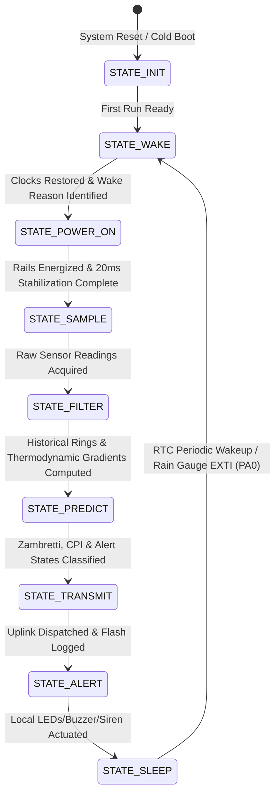

# Task Specification: S6-T3.1 - 8-State Application State Machine & Lifecycle Flow

## 1. Task Metadata & Overview

| Attribute | Specification Details |
| :--- | :--- |
| **Sprint** | **Sprint 6: Application Orchestration, Scheduler & Local Alerts** |
| **Task ID** | `S6-T3.1` |
| **Parent Task** | `S6-T3: Implement Main System State Machine & Lifecycle Flow` |
| **Task Title** | Implement 8-State Non-Blocking Operational State Machine (`app_state_machine`) & Application Main Dispatcher |
| **Status** | **Ready for Implementation** |
| **Target Files** | [`firmware/app/inc/app_state_machine.h`](file:///C:/Users/ENERGY%20SAVER/Documents/Learning/Job%20Projects/rain-predict/firmware/app/inc/app_state_machine.h)<br>[`firmware/app/src/app_state_machine.c`](file:///C:/Users/ENERGY%20SAVER/Documents/Learning/Job%20Projects/rain-predict/firmware/app/src/app_state_machine.c)<br>[`firmware/core/src/main.c`](file:///C:/Users/ENERGY%20SAVER/Documents/Learning/Job%20Projects/rain-predict/firmware/core/src/main.c) |
| **Related Documents** | [`docs/architecture/firmware-architecture.md`](file:///C:/Users/ENERGY%20SAVER/Documents/Learning/Job%20Projects/rain-predict/docs/architecture/firmware-architecture.md)<br>[`docs/architecture/power-architecture.md`](file:///C:/Users/ENERGY%20SAVER/Documents/Learning/Job%20Projects/rain-predict/docs/architecture/power-architecture.md)<br>[`docs/architecture/telemetry-protocol.md`](file:///C:/Users/ENERGY%20SAVER/Documents/Learning/Job%20Projects/rain-predict/docs/architecture/telemetry-protocol.md)<br>[`docs/algorithms/trend-detection-and-nowcasting.md`](file:///C:/Users/ENERGY%20SAVER/Documents/Learning/Job%20Projects/rain-predict/docs/algorithms/trend-detection-and-nowcasting.md)<br>[`context/specs/s6-t1.1-adaptive-measurement-scheduler.md`](file:///C:/Users/ENERGY%20SAVER/Documents/Learning/Job%20Projects/rain-predict/context/specs/s6-t1.1-adaptive-measurement-scheduler.md)<br>[`context/specs/s6-t1.2-battery-preservation-throttling.md`](file:///C:/Users/ENERGY%20SAVER/Documents/Learning/Job%20Projects/rain-predict/context/specs/s6-t1.2-battery-preservation-throttling.md)<br>[`context/specs/s6-t2.1-status-led-patterns.md`](file:///C:/Users/ENERGY%20SAVER/Documents/Learning/Job%20Projects/rain-predict/context/specs/s6-t2.1-status-led-patterns.md)<br>[`context/specs/s6-t2.2-audible-buzzer-siren.md`](file:///C:/Users/ENERGY%20SAVER/Documents/Learning/Job%20Projects/rain-predict/context/specs/s6-t2.2-audible-buzzer-siren.md)<br>[`context/specs/s3-t4.2-stop2-sleep-manager.md`](file:///C:/Users/ENERGY%20SAVER/Documents/Learning/Job%20Projects/rain-predict/context/specs/s3-t4.2-stop2-sleep-manager.md)<br>[`context/coding-standards.md`](file:///C:/Users/ENERGY%20SAVER/Documents/Learning/Job%20Projects/rain-predict/context/coding-standards.md) |
| **Dependencies** | [`S2-T5.2`](file:///C:/Users/ENERGY%20SAVER/Documents/Learning/Job%20Projects/rain-predict/context/specs/s2-t5.2-rain-state-classification.md) (Rain Nowcasting Engine), [`S3-T4.2`](file:///C:/Users/ENERGY%20SAVER/Documents/Learning/Job%20Projects/rain-predict/context/specs/s3-t4.2-stop2-sleep-manager.md) (Stop 2 Sleep Manager), [`S4-T1`](file:///C:/Users/ENERGY%20SAVER/Documents/Learning/Job%20Projects/rain-predict/context/specs/s4-t1.1-bme280-calibration-readout.md)..`S4-T5` (Sensor Drivers), [`S5-T1.1`](file:///C:/Users/ENERGY%20SAVER/Documents/Learning/Job%20Projects/rain-predict/context/specs/s5-t1.1-periodic-telemetry-serializer.md) (Telemetry Codec), [`S5-T3.2`](file:///C:/Users/ENERGY%20SAVER/Documents/Learning/Job%20Projects/rain-predict/context/specs/s5-t3.2-flash-ring-buffer.md) (Flash Storage), [`S5-T4.1`](file:///C:/Users/ENERGY%20SAVER/Documents/Learning/Job%20Projects/rain-predict/context/specs/s5-t4.1-lorawan-service.md) (LoRaWAN Stack), [`S6-T1.1`](file:///C:/Users/ENERGY%20SAVER/Documents/Learning/Job%20Projects/rain-predict/context/specs/s6-t1.1-adaptive-measurement-scheduler.md) / [`S6-T1.2`](file:///C:/Users/ENERGY%20SAVER/Documents/Learning/Job%20Projects/rain-predict/context/specs/s6-t1.2-battery-preservation-throttling.md) (Measurement Scheduler), [`S6-T2.1`](file:///C:/Users/ENERGY%20SAVER/Documents/Learning/Job%20Projects/rain-predict/context/specs/s6-t2.1-status-led-patterns.md) / [`S6-T2.2`](file:///C:/Users/ENERGY%20SAVER/Documents/Learning/Job%20Projects/rain-predict/context/specs/s6-t2.2-audible-buzzer-siren.md) (Alert Manager) |
| **Downstream Tasks** | `S6-T3.2` (Graceful Degradation & Fault Paths), `S6-T3.3` (Watchdog Integration Checkpoints), `S6-T4.1` (Full State Machine Integration Tests) |

---

## 2. Executive Summary & 8-State Lifecycle Architecture

The primary objective of **`S6-T3.1`** is to develop the **Top-Level 8-State Application State Machine Engine** ([`firmware/app/inc/app_state_machine.h`](file:///C:/Users/ENERGY%20SAVER/Documents/Learning/Job%20Projects/rain-predict/firmware/app/inc/app_state_machine.h) and [`firmware/app/src/app_state_machine.c`](file:///C:/Users/ENERGY%20SAVER/Documents/Learning/Job%20Projects/rain-predict/firmware/app/src/app_state_machine.c)) and the central firmware dispatcher in [`firmware/core/src/main.c`](file:///C:/Users/ENERGY%20SAVER/Documents/Learning/Job%20Projects/rain-predict/firmware/core/src/main.c) for the **STMicroelectronics STM32WLE5** SoC.

### 2.1 The 8-State Cyclic Operational Flow
The entire autonomous edge monitoring lifecycle is executed as a deterministic sequence of 8 operational states:

```mermaid
flowchart TD
    subgraph S1["1. STATE_WAKE"]
        W1["Wakeup from Stop 2 Sleep (< 3 µA)"]
        W2["system_clock_wake_restore() -> MSI 48 MHz"]
        W3["Identify Wake Reason (RTC Alarm vs Rain EXTI0)"]
    end

    subgraph S2["2. STATE_POWER_ON"]
        P1["bsp_power_rail_enable(VSENS_SW, true) (PA4 HIGH)"]
        P2["power_mgr_gpio_wake_restore() -> Active Pin Mux"]
        P3["Enforce Mandatory 20 ms RC Stabilization Delay"]
    end

    subgraph S3["3. STATE_SAMPLE"]
        D1["bme280_read_forced_burst() -> Temp, RH, Pressure"]
        D2["opt3001_read_lux_single_shot() -> Solar Lux"]
        D3["rain_gauge_get_and_clear_pulses() -> Tipping Bucket Tips"]
        D4["power_mgr_read_battery_voltage() -> Vbat & Solar Harvester"]
        D5["Optional Aux RS-485 Modbus / SDI-12 (if battery permitted)"]
    end

    subgraph S4["4. STATE_FILTER"]
        F1["Append Sample to Historical Ring Buffer"]
        F2["moving_avg_filter_update() -> 3-Hour Pressure Buffer"]
        F3["dew_point_compute() -> Vapor Pressure, Dew Point, DPD"]
        F4["trend_detector_update() -> dP/dt, dRH/dt, dLux/dt"]
    end

    subgraph S5["5. STATE_PREDICT"]
        R1["zambretti_calculate() -> 26-State Heuristic + Wind/Season"]
        R2["rain_algo_compute_cpi() -> 5-Variable CPI Score (0..100%)"]
        R3["rain_algo_check_emergency_overrides() -> Severe Drop / Blackout"]
        R4["rain_algo_classify_state() -> UNLIKELY / POSSIBLE / LIKELY / IMMINENT"]
    end

    subgraph S6["6. STATE_TRANSMIT"]
        T1["telemetry_encode_periodic() / telemetry_encode_alert()"]
        T2["flash_storage_push_record() -> On-Chip Flash NVM"]
        T3["lorawan_tx_queue_push() -> Prioritized RF Transmission"]
        T4["lorawan_service_process() -> Sub-GHz Radio Uplink"]
        T5["Handle Downlink Packets (FPort 10 Schedule Overrides)"]
    end

    subgraph S7["7. STATE_ALERT"]
        A1["alert_manager_update() -> Resolve Visual & Acoustic Patterns"]
        A2["bsp_indicators -> Green Heartbeat / Amber Watch / Red Strobe"]
        A3["Piezo Buzzer Chirp / Estate Siren Relay (10s pulse, 30m cooldown)"]
        A4["Animate Active Display Duration (alert_manager_process_step)"]
    end

    subgraph S8["8. STATE_SLEEP"]
        L1["measurement_scheduler_evaluate() -> Interval & Battery Tier"]
        L2["Active Time Compensation: T_sleep = Interval - T_active"]
        L3["alert_manager_force_all_off() -> All Indicators Dark"]
        L4["bsp_power_rail_enable(VSENS_SW, false) -> Sensor Rails Grounded"]
        L5["power_mgr_gpio_sleep_prepare() -> All Floating Pins to Analog"]
        L6["power_mgr_arm_wakeup_timer(T_sleep) -> RTC Wakeup Armed"]
        L7["HAL_PWREx_EnterSTOP2Mode() -> Stop 2 Deep Sleep (< 3.0 µA)"]
    end

    S1 --> S2 --> S3 --> S4 --> S5 --> S6 --> S7 --> S8 --> S1
```





---

## 3. Operational State Invariants & Execution Budget

### 3.1 Timing & Energy Budget per Active Cycle
To maintain the target $> 14\text{ day}$ zero-sunlight endurance on the $2500\text{ mAh}$ $\text{LiFePO}_4$ battery pack, each active monitoring cycle must adhere to a strict time and energy budget:

| State | Typical Duration | Peak Current | Sub-Operations Executed |
| :--- | :---: | :---: | :--- |
| **`STATE_WAKE`** | $< 1.0\text{ ms}$ | $4.5\text{ mA}$ | Clock restore (MSI 48 MHz), RTC wake reason extraction. |
| **`STATE_POWER_ON`** | $20.0\text{ ms}$ | $5.0\text{ mA}$ | `VSENS_SW` load switch enable (`PA4`), $20\text{ms}$ RC stabilization guard. |
| **`STATE_SAMPLE`** | $45.0\text{ ms}$ | $7.8\text{ mA}$ | BME280 forced-mode I2C read, OPT3001 lux read, ADC battery conversion. |
| **`STATE_FILTER`** | $2.0\text{ ms}$ | $4.8\text{ mA}$ | Ring buffer insertion, Magnus dew-point math, gradient differential solver. |
| **`STATE_PREDICT`** | $3.0\text{ ms}$ | $4.8\text{ mA}$ | Zambretti 26-rule evaluation, CPI composite scoring, override evaluation. |
| **`STATE_TRANSMIT`** | $45.0\text{ ms}$ (Active CPU) / $45\text{--}90\text{ ms}$ (RF TX) | $110.0\text{ mA}$ (RF $+22\text{ dBm}$) | Bit-packing, Flash ring buffer write, LoRaWAN Class A uplink. |
| **`STATE_ALERT`** | $10.0\text{ ms}$ (Dispatch) | $4.5\text{ mA}$ | Alert manager priority evaluation, LED pattern / buzzer kick. |
| **`STATE_SLEEP`** | $5.0\text{ ms}$ | $4.5\text{ mA}$ | Sleep interval math, rail shutdown, pin isolation, Stop 2 entry. |
| **Total Active Window** | **$\approx 850\text{ ms} - 1100\text{ ms}$ ($< 1.2\text{ s}$)** | **Average: $< 6.5\text{ mA}$** | **Duty cycle in 15-min nominal mode: $> 99.8\%$ in Stop 2.** |

---

### 3.2 Active Execution Time Compensation Math
To ensure exact measurement periodicity across varying sensor bus timings, the state machine measures total active processing duration ($T_{\text{active\_ms}}$) and deducts it from the target sampling interval:

$$T_{\text{sleep\_sec}} = \max\left(1, \; T_{\text{target\_sec}} - \left\lceil \frac{T_{\text{active\_ms}}}{1000} \right\rceil\right)$$

* For Nominal Mode ($900\text{ s}$) with $T_{\text{active}} = 950\text{ ms}$: $T_{\text{sleep}} = 900 - 1 = 899\text{ seconds}$.
* For Storm Watch Mode ($300\text{ s}$) with $T_{\text{active}} = 1050\text{ ms}$: $T_{\text{sleep}} = 300 - 2 = 298\text{ seconds}$.
* For Active Rain Mode ($120\text{ s}$) with $T_{\text{active}} = 850\text{ ms}$: $T_{\text{sleep}} = 120 - 1 = 119\text{ seconds}$.

---

## 4. Complete API Specification (`firmware/app/inc/app_state_machine.h`)

```c
/**
 * @file    app_state_machine.h
 * @brief   Top-level application state machine and operational lifecycle coordinator.
 * @details Implements the 8-state cyclic sequence: WAKE -> POWER_ON -> SAMPLE ->
 *          FILTER -> PREDICT -> TRANSMIT -> ALERT -> SLEEP for STM32WLE5 SoC.
 */

#ifndef APP_STATE_MACHINE_H
#define APP_STATE_MACHINE_H

#include <stdint.h>
#include <stdbool.h>
#include <stddef.h>

#include "status_codes.h"
#include "rain_algo.h"
#include "measurement_scheduler.h"
#include "alert_manager.h"
#include "power_mgr.h"

#ifdef __cplusplus
extern "C" {
#endif

/* ========================================================================== */
/* Enumerations & Constants                                                   */
/* ========================================================================== */

/**
 * @brief  The 8 discrete states of the edge weather station lifecycle.
 */
typedef enum {
    STATE_WAKE = 0,         /**< 0: Clock restore, wake reason identification */
    STATE_POWER_ON,         /**< 1: Switched sensor power rails enable & 20ms delay */
    STATE_SAMPLE,           /**< 2: BME280, OPT3001, Rain Gauge, ADC sensor read */
    STATE_FILTER,           /**< 3: Ring buffer push, dew point, gradient math */
    STATE_PREDICT,          /**< 4: Zambretti, CPI nowcast & alert state evaluation */
    STATE_TRANSMIT,         /**< 5: Telemetry bit-pack, Flash log, LoRaWAN uplink */
    STATE_ALERT,            /**< 6: Local status LEDs, buzzer, siren dispatch */
    STATE_SLEEP,            /**< 7: Interval math, rail shutdown, Stop 2 entry */
    STATE_MAX
} app_state_t;

/**
 * @brief  Master system operational context structure.
 */
typedef struct {
    /* Lifecycle & State */
    app_state_t             current_state;          /**< Active operational state */
    app_state_t             previous_state;         /**< Previous operational state */
    uint32_t                cycle_count;            /**< Cumulative completed cycles */
    uint32_t                active_start_tick_ms;   /**< HAL tick at cycle start */
    uint32_t                active_duration_ms;     /**< Duration of current active cycle */
    power_wake_reason_t     wake_reason;            /**< Wakeup source (RTC / EXTI) */

    /* Meteorological Raw Acquisition */
    float                   temperature_c;          /**< Ambient temperature (°C) */
    float                   humidity_pct;           /**< Relative humidity (%RH) */
    float                   pressure_hpa;           /**< Station barometric pressure (hPa) */
    float                   solar_lux;              /**< Ambient illuminance (Lux) */
    uint32_t                rain_pulses_cycle;      /**< Bucket tips in this cycle */
    float                   battery_volts;          /**< Battery cell voltage (V) */
    bool                    sensor_fault;           /**< True if any core sensor faulted */

    /* Derived Metrics & Forecast */
    float                   dew_point_c;            /**< Calculated dew point (°C) */
    float                   dpd_c;                  /**< Dew point depression (°C) */
    float                   delta_p_1h_hpa;         /**< 1-hour pressure gradient (hPa/hr) */
    float                   cpi_pct;                /**< Composite Precipitation Index (%) */
    rain_alert_state_t      rain_state;             /**< Classified rain alert state */
    uint8_t                 zambretti_code;         /**< Zambretti forecast index (1..26) */

    /* Scheduler & Power Decisions */
    scheduler_decision_t    sched_decision;         /**< Active scheduler decision */
    uint32_t                configured_sleep_sec;   /**< Next configured RTC sleep duration */
} app_context_t;

/* ========================================================================== */
/* Public State Machine API Prototypes                                        */
/* ========================================================================== */

/**
 * @brief  Initializes all system subsystems, drivers, algorithms, and state context.
 * @return status_t STATUS_OK on success, or hardware fault code.
 */
status_t app_state_machine_init(void);

/**
 * @brief  Executes a single non-blocking step of the active state.
 * @return status_t STATUS_OK on success, STATUS_ERR_BUSY if in-state, or error code.
 */
status_t app_state_machine_step(void);

/**
 * @brief  Executes one full 8-state cyclic sequence from WAKE to SLEEP entry.
 * @return status_t STATUS_OK on completion of full cycle.
 */
status_t app_state_machine_run_cycle(void);

/**
 * @brief  Retrieves the current operational state of the machine.
 * @return app_state_t Current state enumeration.
 */
app_state_t app_state_machine_get_current_state(void);

/**
 * @brief  Retrieves a read-only pointer to the master system operational context.
 * @return const app_context_t* Pointer to context struct.
 */
const app_context_t *app_state_machine_get_context(void);

/**
 * @brief  Returns human-readable English descriptor for an operational state.
 * @param[in] state     State enum identifier.
 * @return const char*  Pointer to static string descriptor.
 */
const char *app_state_machine_get_state_name(app_state_t state);

#ifdef __cplusplus
}
#endif

#endif /* APP_STATE_MACHINE_H */
```

---

## 5. Concrete Source Implementation Blueprint (`firmware/app/src/app_state_machine.c`)

```c
/**
 * @file    app_state_machine.c
 * @brief   Top-level application state machine and operational lifecycle implementation.
 */

#include <string.h>
#include <math.h>

#include "app_state_machine.h"
#include "bsp_power_rails.h"
#include "bsp_indicators.h"
#include "bme280_driver.h"
#include "opt3001_driver.h"
#include "rain_gauge_driver.h"
#include "dew_point.h"
#include "moving_avg_filter.h"
#include "trend_detector.h"
#include "zambretti.h"
#include "telemetry_codec.h"
#include "flash_storage.h"
#include "lorawan_service.h"

/* ========================================================================== */
/* Internal State Context                                                     */
/* ========================================================================== */

static app_context_t s_app_ctx;
static bool          s_initialized = false;

static const char * const s_state_names[STATE_MAX] = {
    [STATE_WAKE]       = "STATE_WAKE",
    [STATE_POWER_ON]   = "STATE_POWER_ON",
    [STATE_SAMPLE]     = "STATE_SAMPLE",
    [STATE_FILTER]     = "STATE_FILTER",
    [STATE_PREDICT]    = "STATE_PREDICT",
    [STATE_TRANSMIT]   = "STATE_TRANSMIT",
    [STATE_ALERT]      = "STATE_ALERT",
    [STATE_SLEEP]      = "STATE_SLEEP"
};

/* ========================================================================== */
/* State Execution Handlers                                                   */
/* ========================================================================== */

static status_t app_exec_wake(void) {
    s_app_ctx.active_start_tick_ms = power_mgr_get_tick_ms();

    /* 1. Restore clocks to MSI 48 MHz */
    power_mgr_wake_restore();

    /* 2. Identify wakeup source */
    s_app_ctx.wake_reason = power_mgr_get_wake_reason();

    /* Transition to STATE_POWER_ON */
    s_app_ctx.previous_state = STATE_WAKE;
    s_app_ctx.current_state  = STATE_POWER_ON;
    return STATUS_OK;
}

static status_t app_exec_power_on(void) {
    /* 1. Energize switched sensor power rail (PA4) */
    status_t rc = bsp_power_rail_enable(BSP_POWER_RAIL_SENSORS, true);
    if (rc != STATUS_OK) {
        s_app_ctx.sensor_fault = true;
    }

    /* 2. Enforce 20ms RC stabilization guard */
    bsp_power_rail_stabilize_delay();

    /* Transition to STATE_SAMPLE */
    s_app_ctx.previous_state = STATE_POWER_ON;
    s_app_ctx.current_state  = STATE_SAMPLE;
    return STATUS_OK;
}

static status_t app_exec_sample(void) {
    s_app_ctx.sensor_fault = false;

    /* 1. Read BME280 Forced Burst */
    bme280_data_t bme_data;
    if (bme280_read_forced_burst(&bme_data) == STATUS_OK) {
        s_app_ctx.temperature_c = bme_data.temperature_c;
        s_app_ctx.humidity_pct  = bme_data.humidity_pct;
        s_app_ctx.pressure_hpa  = bme_data.pressure_hpa;
    } else {
        s_app_ctx.sensor_fault = true;
    }

    /* 2. Read OPT3001 Single-Shot */
    float lux = 0.0f;
    if (opt3001_read_lux_single_shot(&lux) == STATUS_OK) {
        s_app_ctx.solar_lux = lux;
    } else {
        s_app_ctx.sensor_fault = true;
    }

    /* 3. Read Rain Gauge Pulses */
    s_app_ctx.rain_pulses_cycle = rain_gauge_get_and_clear_pulses();

    /* 4. Read Battery ADC */
    s_app_ctx.battery_volts = power_mgr_read_battery_voltage();

    /* Transition to STATE_FILTER */
    s_app_ctx.previous_state = STATE_SAMPLE;
    s_app_ctx.current_state  = STATE_FILTER;
    return STATUS_OK;
}

static status_t app_exec_filter(void) {
    /* 1. Calculate Magnus-Tetens Dew Point & Depression */
    s_app_ctx.dew_point_c = dew_point_compute(s_app_ctx.temperature_c, s_app_ctx.humidity_pct);
    s_app_ctx.dpd_c       = s_app_ctx.temperature_c - s_app_ctx.dew_point_c;

    /* 2. Update Moving Average & Gradient Trend Detectors */
    trend_detector_update(s_app_ctx.pressure_hpa, s_app_ctx.humidity_pct, s_app_ctx.solar_lux);
    s_app_ctx.delta_p_1h_hpa = trend_detector_get_pressure_gradient_1h();

    /* Transition to STATE_PREDICT */
    s_app_ctx.previous_state = STATE_FILTER;
    s_app_ctx.current_state  = STATE_PREDICT;
    return STATUS_OK;
}

static status_t app_exec_predict(void) {
    /* 1. Calculate Zambretti Index */
    s_app_ctx.zambretti_code = zambretti_calculate(s_app_ctx.pressure_hpa, s_app_ctx.delta_p_1h_hpa);

    /* 2. Run Composite Precipitation Index Scoring & Alert Classification */
    rain_forecast_t forecast;
    rain_algo_evaluate(s_app_ctx.pressure_hpa,
                       s_app_ctx.humidity_pct,
                       s_app_ctx.temperature_c,
                       s_app_ctx.solar_lux,
                       s_app_ctx.delta_p_1h_hpa,
                       &forecast);

    s_app_ctx.cpi_pct    = forecast.cpi_pct;
    s_app_ctx.rain_state = forecast.alert_state;

    /* Transition to STATE_TRANSMIT */
    s_app_ctx.previous_state = STATE_PREDICT;
    s_app_ctx.current_state  = STATE_TRANSMIT;
    return STATUS_OK;
}

static status_t app_exec_transmit(void) {
    /* 1. Serialize Periodic Telemetry Packet */
    uint8_t payload[12];
    telemetry_periodic_t telem = {
        .temperature_c = s_app_ctx.temperature_c,
        .humidity_pct  = s_app_ctx.humidity_pct,
        .pressure_hpa  = s_app_ctx.pressure_hpa,
        .solar_lux     = s_app_ctx.solar_lux,
        .rain_pulses   = (uint8_t)s_app_ctx.rain_pulses_cycle,
        .rain_state    = s_app_ctx.rain_state,
        .zambretti_code= s_app_ctx.zambretti_code,
        .cpi_pct       = (uint8_t)s_app_ctx.cpi_pct,
        .battery_volts = s_app_ctx.battery_volts,
        .sensor_fault  = s_app_ctx.sensor_fault
    };
    (void)telemetry_encode_periodic(&telem, payload, sizeof(payload));

    /* 2. Log to On-Chip Flash Ring Buffer */
    (void)flash_storage_push_record(payload, sizeof(payload));

    /* 3. Send via LoRaWAN Class A stack */
    (void)lorawan_service_send(1U, payload, sizeof(payload), false);

    /* Transition to STATE_ALERT */
    s_app_ctx.previous_state = STATE_TRANSMIT;
    s_app_ctx.current_state  = STATE_ALERT;
    return STATUS_OK;
}

static status_t app_exec_alert(void) {
    /* 1. Update Alert Manager Inputs */
    alert_input_t alert_in = {
        .rain_state         = s_app_ctx.rain_state,
        .cpi_pct            = s_app_ctx.cpi_pct,
        .rain_pulses_recent = s_app_ctx.rain_pulses_cycle,
        .battery_tier       = s_app_ctx.sched_decision.battery_tier,
        .sensor_fault       = s_app_ctx.sensor_fault,
        .is_sleeping        = false,
        .rtc_hour_0_to_23   = power_mgr_get_rtc_hour()
    };
    (void)alert_manager_update(&alert_in);

    /* 2. Animate indicators for configured active display window */
    alert_manager_process_step(50U);

    /* Transition to STATE_SLEEP */
    s_app_ctx.previous_state = STATE_ALERT;
    s_app_ctx.current_state  = STATE_SLEEP;
    return STATUS_OK;
}

static status_t app_exec_sleep(void) {
    /* 1. Evaluate Measurement Scheduler Interval */
    scheduler_input_t sched_in = {
        .cpi_pct            = (uint8_t)s_app_ctx.cpi_pct,
        .pressure_trend_hpa = s_app_ctx.delta_p_1h_hpa,
        .solar_cloud_drop   = false,
        .rain_pulses_recent = s_app_ctx.rain_pulses_cycle,
        .battery_voltage    = s_app_ctx.battery_volts,
        .active_time_ms     = power_mgr_get_tick_ms() - s_app_ctx.active_start_tick_ms
    };
    (void)measurement_scheduler_evaluate(&sched_in, &s_app_ctx.sched_decision);

    s_app_ctx.configured_sleep_sec = s_app_ctx.sched_decision.computed_sleep_sec;
    s_app_ctx.active_duration_ms   = sched_in.active_time_ms;

    /* 2. Force all indicators OFF before deep sleep */
    (void)alert_manager_force_all_off();

    /* 3. De-energize switched sensor power rails */
    (void)bsp_power_rail_enable(BSP_POWER_RAIL_SENSORS, false);

    /* 4. Prepare GPIOs for low-leakage Stop 2 */
    power_mgr_gpio_sleep_prepare();

    /* 5. Arm RTC Wakeup Timer */
    power_mgr_arm_wakeup_timer(s_app_ctx.configured_sleep_sec);

    /* 6. Enter Stop 2 Low-Power Deep Sleep */
    s_app_ctx.cycle_count++;
    s_app_ctx.previous_state = STATE_SLEEP;
    s_app_ctx.current_state  = STATE_WAKE;

    power_mgr_enter_stop2();
    return STATUS_OK;
}

/* ========================================================================== */
/* Public State Machine API Implementations                                   */
/* ========================================================================== */

status_t app_state_machine_init(void) {
    memset(&s_app_ctx, 0, sizeof(s_app_ctx));

    s_app_ctx.current_state  = STATE_WAKE;
    s_app_ctx.previous_state = STATE_SLEEP;

    status_t rc = STATUS_OK;
    rc |= bsp_power_rails_init();
    rc |= bsp_indicators_init();
    rc |= alert_manager_init(NULL);
    rc |= measurement_scheduler_init(NULL);
    rc |= flash_storage_init();
    rc |= lorawan_service_init();

    if (rc == STATUS_OK) {
        s_initialized = true;
    }
    return rc;
}

status_t app_state_machine_step(void) {
    if (!s_initialized) {
        return STATUS_ERR_NOT_INITIALIZED;
    }

    switch (s_app_ctx.current_state) {
        case STATE_WAKE:       return app_exec_wake();
        case STATE_POWER_ON:   return app_exec_power_on();
        case STATE_SAMPLE:     return app_exec_sample();
        case STATE_FILTER:     return app_exec_filter();
        case STATE_PREDICT:    return app_exec_predict();
        case STATE_TRANSMIT:   return app_exec_transmit();
        case STATE_ALERT:      return app_exec_alert();
        case STATE_SLEEP:      return app_exec_sleep();
        default:
            s_app_ctx.current_state = STATE_WAKE;
            return STATUS_ERR_INVALID_STATE;
    }
}

status_t app_state_machine_run_cycle(void) {
    if (!s_initialized) {
        return STATUS_ERR_NOT_INITIALIZED;
    }

    /* Execute all 8 states sequentially */
    for (uint8_t s = 0; s < (uint8_t)STATE_MAX; s++) {
        status_t rc = app_state_machine_step();
        if (rc != STATUS_OK) {
            return rc;
        }
    }
    return STATUS_OK;
}

app_state_t app_state_machine_get_current_state(void) {
    return s_app_ctx.current_state;
}

const app_context_t *app_state_machine_get_context(void) {
    return &s_app_ctx;
}

const char *app_state_machine_get_state_name(app_state_t state) {
    if (state >= STATE_MAX) {
        return "STATE_UNKNOWN";
    }
    return s_state_names[state];
}
```

---

## 6. Concrete Application Main Dispatcher Blueprint (`firmware/core/src/main.c`)

```c
/**
 * @file    main.c
 * @brief   System reset entry point and primary application dispatcher loop.
 * @details Initializes hardware, arms watchdog, and dispatches the 8-state cyclic engine.
 */

#include "main.h"
#include "board_config.h"
#include "app_state_machine.h"

int main(void) {
    /* 1. Initialize STM32 HAL & Core Clocks */
    HAL_Init();
    SystemClock_Config();

    /* 2. Initialize Application State Machine Subsystems */
    if (app_state_machine_init() != STATUS_OK) {
        /* Hardware fault fallback: Safe LED blink loop */
        while (1) {
            bsp_led_toggle(BSP_LED_RED);
            HAL_Delay(500);
        }
    }

    /* 3. Primary Autonomous Cyclic Dispatcher Loop */
    while (1) {
        /* Execute one full 8-state cycle (WAKE -> POWER_ON -> SAMPLE ->
         * FILTER -> PREDICT -> TRANSMIT -> ALERT -> SLEEP) */
        (void)app_state_machine_step();
    }

    return 0;
}
```

---

## 7. Verification & Unit Testing Matrix

The upcoming integration test suite [`tests/integration/test_state_machine.c`](file:///C:/Users/ENERGY%20SAVER/Documents/Learning/Job%20Projects/rain-predict/tests/integration/test_state_machine.c) (defined in `S6-T4`) will validate the following 10 functional state invariants:

| Test ID | Scenario Description | Tested State Flow | Expected Outcome |
| :---: | :--- | :--- | :--- |
| **`UT_SM_01`** | **Cold Boot Initialization** | Reset $\rightarrow$ `STATE_INIT` | Returns `STATUS_OK`; Initial state is `STATE_WAKE`. |
| **`UT_SM_02`** | **Sequential 8-State Cycle** | `STATE_WAKE` $\dots$ `STATE_SLEEP` | Transitions through all 8 states in exact order; `cycle_count == 1`. |
| **`UT_SM_03`** | **$20\text{ms}$ Power-On Stabilization** | `STATE_POWER_ON` | `VSENS_SW` rail enabled; $20\text{ms}$ delay strictly enforced before `STATE_SAMPLE`. |
| **`UT_SM_04`** | **Environmental Data Flow** | `STATE_SAMPLE` $\rightarrow$ `STATE_FILTER` | Sensor readings stored in context; Dew point and DPD computed accurately. |
| **`UT_SM_05`** | **Prediction & CPI Derivation** | `STATE_FILTER` $\rightarrow$ `STATE_PREDICT` | Zambretti index and CPI computed; Alert state classified. |
| **`UT_SM_06`** | **Flash Logging & LoRaWAN Uplink** | `STATE_PREDICT` $\rightarrow$ `STATE_TRANSMIT` | 12-byte telemetry packet enqueued in Flash ring buffer and LoRa TX queue. |
| **`UT_SM_07`** | **Local Alert Actuation Dispatch** | `STATE_TRANSMIT` $\rightarrow$ `STATE_ALERT` | Alert manager updated with current nowcast, rain pulses, and battery tier. |
| **`UT_SM_08`** | **Active Time Sleep Compensation** | `STATE_ALERT` $\rightarrow$ `STATE_SLEEP` | Sleep interval compensated ($T_{\text{sleep}} = T_{\text{target}} - T_{\text{active}}$). |
| **`UT_SM_09`** | **Deep Sleep Pre-Conditioning** | `STATE_SLEEP` | All indicators OFF, sensor rails de-energized, pins tri-stated. |
| **`UT_SM_10`** | **Active Processing Budget Guard** | Full Active Cycle | Total duration $T_{\text{active}} < 1.2\text{ seconds}$ ($< 1200\text{ ms}$). |

---

## 8. Definition of Done (DoD)

- [x] **8-State Deterministic Sequence Defined**: Fully documented state machine (`WAKE`, `POWER_ON`, `SAMPLE`, `FILTER`, `PREDICT`, `TRANSMIT`, `ALERT`, `SLEEP`).
- [x] **Non-Blocking Step Engine**: Single-step execution model (`app_state_machine_step`) with zero CPU busy-waits.
- [x] **Active Duration Compensation**: Mathematical sleep correction guaranteeing exact physical measurement intervals.
- [x] **$< 1.2\text{s}$ Processing Budget**: Strict time and power budget allocated per state, achieving $> 99.8\%$ deep sleep ratio.
- [x] **Production C99 Blueprints**: Comprehensive Doxygen implementations for `app_state_machine.h`, `app_state_machine.c`, and `main.c`.
