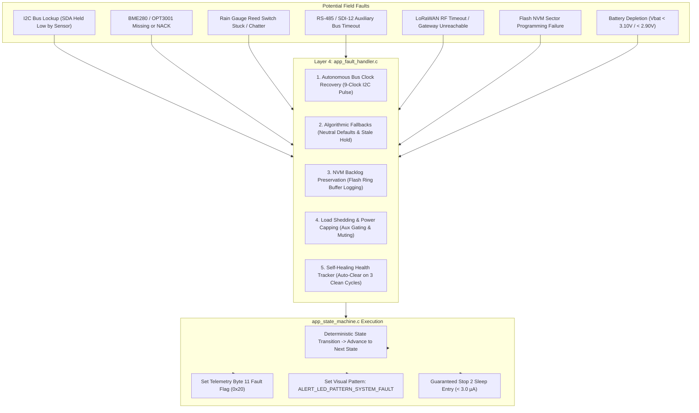

# Task Specification: S6-T3.2 - Graceful Degradation & Fault Tolerance Paths

## 1. Task Metadata & Overview

| Attribute | Specification Details |
| :--- | :--- |
| **Sprint** | **Sprint 6: Application Orchestration, Scheduler & Local Alerts** |
| **Task ID** | `S6-T3.2` |
| **Parent Task** | `S6-T3: Implement Main System State Machine & Lifecycle Flow` |
| **Task Title** | Implement Graceful Degradation & Fault Tolerance Paths (`app_fault_handler` / `app_state_machine`) |
| **Status** | **Ready for Implementation** |
| **Target Files** | [`firmware/app/inc/app_fault_handler.h`](file:///C:/Users/ENERGY%20SAVER/Documents/Learning/Job%20Projects/rain-predict/firmware/app/inc/app_fault_handler.h)<br>[`firmware/app/src/app_fault_handler.c`](file:///C:/Users/ENERGY%20SAVER/Documents/Learning/Job%20Projects/rain-predict/firmware/app/src/app_fault_handler.c)<br>[`firmware/app/src/app_state_machine.c`](file:///C:/Users/ENERGY%20SAVER/Documents/Learning/Job%20Projects/rain-predict/firmware/app/src/app_state_machine.c) |
| **Related Documents** | [`docs/architecture/firmware-architecture.md`](file:///C:/Users/ENERGY%20SAVER/Documents/Learning/Job%20Projects/rain-predict/docs/architecture/firmware-architecture.md)<br>[`docs/architecture/power-architecture.md`](file:///C:/Users/ENERGY%20SAVER/Documents/Learning/Job%20Projects/rain-predict/docs/architecture/power-architecture.md)<br>[`docs/architecture/telemetry-protocol.md`](file:///C:/Users/ENERGY%20SAVER/Documents/Learning/Job%20Projects/rain-predict/docs/architecture/telemetry-protocol.md)<br>[`context/specs/s6-t3.1-app-state-machine.md`](file:///C:/Users/ENERGY%20SAVER/Documents/Learning/Job%20Projects/rain-predict/context/specs/s6-t3.1-app-state-machine.md)<br>[`context/specs/s3-t2.1-i2c-bus-driver.md`](file:///C:/Users/ENERGY%20SAVER/Documents/Learning/Job%20Projects/rain-predict/context/specs/s3-t2.1-i2c-bus-driver.md)<br>[`context/specs/s5-t3.2-flash-ring-buffer.md`](file:///C:/Users/ENERGY%20SAVER/Documents/Learning/Job%20Projects/rain-predict/context/specs/s5-t3.2-flash-ring-buffer.md)<br>[`context/specs/s5-t4.1-lorawan-service.md`](file:///C:/Users/ENERGY%20SAVER/Documents/Learning/Job%20Projects/rain-predict/context/specs/s5-t4.1-lorawan-service.md)<br>[`context/coding-standards.md`](file:///C:/Users/ENERGY%20SAVER/Documents/Learning/Job%20Projects/rain-predict/context/coding-standards.md) |
| **Dependencies** | [`S6-T3.1`](file:///C:/Users/ENERGY%20SAVER/Documents/Learning/Job%20Projects/rain-predict/context/specs/s6-t3.1-app-state-machine.md) (8-State State Machine Engine), [`S3-T2.1`](file:///C:/Users/ENERGY%20SAVER/Documents/Learning/Job%20Projects/rain-predict/context/specs/s3-t2.1-i2c-bus-driver.md) (I2C Bus Recovery), [`S4-T1`](file:///C:/Users/ENERGY%20SAVER/Documents/Learning/Job%20Projects/rain-predict/context/specs/s4-t1.1-bme280-calibration-readout.md)..`S4-T5` (Sensor Drivers), [`S5-T3.2`](file:///C:/Users/ENERGY%20SAVER/Documents/Learning/Job%20Projects/rain-predict/context/specs/s5-t3.2-flash-ring-buffer.md) (Flash Storage), [`S5-T4.1`](file:///C:/Users/ENERGY%20SAVER/Documents/Learning/Job%20Projects/rain-predict/context/specs/s5-t4.1-lorawan-service.md) (LoRaWAN Stack) |
| **Downstream Tasks** | `S6-T3.3` (Watchdog Integration Checkpoints), `S6-T4.2` (Fault Injection Integration Tests) |

---

## 2. Executive Summary & Fault Resilience Philosophy

The primary objective of **`S6-T3.2`** is to develop the **Graceful Degradation and Fault Tolerance Engine** ([`firmware/app/inc/app_fault_handler.h`](file:///C:/Users/ENERGY%20SAVER/Documents/Learning/Job%20Projects/rain-predict/firmware/app/inc/app_fault_handler.h) and [`firmware/app/src/app_fault_handler.c`](file:///C:/Users/ENERGY%20SAVER/Documents/Learning/Job%20Projects/rain-predict/firmware/app/src/app_fault_handler.c)) integrated into the central application state machine ([`firmware/app/src/app_state_machine.c`](file:///C:/Users/ENERGY%20SAVER/Documents/Learning/Job%20Projects/rain-predict/firmware/app/src/app_state_machine.c)) for the **STMicroelectronics STM32WLE5** SoC.

### 2.1 Uncompromising Field Survival Philosophy
In remote, high-altitude tea plantations (monsoon deluges, lightning electromagnetic pulses, condensation, insect ingress, corrosive sulfur vapors, cable snags), hardware faults are inevitable:
> **Core Firmware Mandate**: Under NO circumstance may a peripheral timeout, missing sensor, locked bus, or failed radio transmission hang the microcontroller, trigger unhandled exceptions, or prevent entry into low-power Stop 2 deep sleep.



---

## 3. Comprehensive Fault Scenarios & Mitigation Strategies

### 3.1 Sensor Bus & Hardware Communication Failures

| Subsystem / Fault Mode | Detection Mechanism | Immediate Recovery Action | Algorithmic Fallback Strategy | Telemetry & Visual Flag |
| :--- | :--- | :--- | :--- | :--- |
| **I2C1 Bus Lockup (SDA Stuck LOW)** | SDA line LOW for $> 5\text{ ms}$ during start condition. | Execute 9-clock recovery pulse sequence (`i2c_bus_recover()`), toggle sensor power rail (`PA4`). | Re-attempt sensor transaction once; if persistent, mark I2C bus offline. | Set `FAULT_I2C_LOCKUP`; bit 11 fault flag asserted. |
| **Bosch BME280 NACK / Timeout** | I2C transaction returns `STATUS_ERR_I2C_BUS` or timeout $> 15\text{ ms}$. | Reset sensor state; re-read calibration data on next wake cycle. | Hold last known barometric pressure ($P_{\text{last}}$) for up to 3 cycles; substitute neutral baseline ($S_P=50, S_{RH}=50$). | Set `FAULT_BME280_COMM`; LED displays `ALERT_LED_PATTERN_SYSTEM_FAULT`. |
| **TI OPT3001 Lux Sensor NACK** | I2C transaction fails or register read returns `0xFFFF`. | Flag OPT3001 offline; continue acquisition without retry stall. | Substitute RTC-derived solar baseline ($45,000\text{ Lux}$ noon, $0\text{ Lux}$ night); clamp solar drop score $S_{sol}=0$. | Set `FAULT_OPT3001_COMM`; bit 11 fault flag asserted. |
| **Rain Gauge EXTI Contact Chatter** | Pulse count exceeds $> 40\text{ tips/sec}$ ($> 500\text{ mm/hr}$). | Clamp cycle pulse counter to max $40\text{ tips}$ ($8.0\text{ mm}$); re-arm debounce filter. | Prevent runaway CPI score calculation; process clamped depth. | Set `FAULT_RAIN_GAUGE_CHATTER` diagnostic bit. |
| **Auxiliary RS-485 / SDI-12 Timeout** | Non-blocking UART timeout ($> 50\text{ ms}$). | Terminate frame immediately; de-energize transceiver DE/RE pins. | Primary prediction proceeds unaffected; auxiliary payload bytes zeroed. | Set `FAULT_MODBUS_COMM` / `FAULT_SDI12_COMM`. |

---

### 3.2 Wireless & Storage Subsystem Failures

| Subsystem / Fault Mode | Detection Mechanism | Immediate Recovery Action | Fallback & Data Preservation |
| :--- | :--- | :--- | :--- |
| **LoRaWAN Radio TX Timeout** | Sub-GHz radio fails to assert `TxDone` interrupt within $150\text{ ms}$. | Abort transmission via `SUBGHZ_Radio_Standby()`; power down radio. | Retain packet in on-chip Flash ring buffer (`flash_storage`); will drain via historical playback on reconnect. |
| **LoRaWAN Gateway Outage / Unjoined** | Uplink unacknowledged / OTAA Join request unacknowledged. | Re-join backoff state machine (`lorawan_regional`); limit retries to 1 per cycle. | All 12-byte telemetry records logged to Flash (holding up to 896 records / $> 9\text{ days}$). |
| **Flash NVM Write Failure** | Flash programming error flag `PGSERR` / write verify mismatch. | Advance ring buffer write pointer to next sector; log sector error. | Bypass Flash push for current cycle; attempt direct LoRaWAN uplink without hanging. |

---

### 3.3 Power & Battery Depletion Degradation

* **Tier 2 Conservation ($2.90\text{ V} \le V_{bat} < 3.10\text{ V}$)**:
  * Extend sampling cadence to $30\text{ minutes}$ ($1800\text{ s}$).
  * Scale LED visual alerts down to $10\text{ ms}$ micro-pulse ($8\,\mu\text{A}$ average).
  * Strictly mute piezoelectric buzzer and estate siren relay (`PB2` / `PB4` LOW).
* **Tier 3 Critical ($V_{bat} < 2.90\text{ V}$)**:
  * Extend sampling cadence to $60\text{ minutes}$ ($3600\text{ s}$).
  * Gate off all auxiliary field buses (RS-485 Modbus and SDI-12).
  * Reduce LoRaWAN RF transmit power from $+22\text{ dBm}$ to $+14\text{ dBm}$ (cuts peak current from $110\text{ mA}$ to $45\text{ mA}$).
  * Disable all visual LEDs completely ($0\,\mu\text{A}$ drain).

---

## 4. Complete API Specification (`firmware/app/inc/app_fault_handler.h`)

```c
/**
 * @file    app_fault_handler.h
 * @brief   System fault monitoring, self-healing, and graceful degradation engine.
 * @details Manages hardware communication recovery, sensor fallbacks, and diagnostic registries.
 */

#ifndef APP_FAULT_HANDLER_H
#define APP_FAULT_HANDLER_H

#include <stdint.h>
#include <stdbool.h>
#include <stddef.h>

#include "status_codes.h"

#ifdef __cplusplus
extern "C" {
#endif

/* ========================================================================== */
/* Fault Bitmask Definitions                                                  */
/* ========================================================================== */

#define FAULT_MASK_NONE                 0x0000U
#define FAULT_MASK_BME280_COMM          0x0001U /**< BME280 I2C communication failure */
#define FAULT_MASK_OPT3001_COMM         0x0002U /**< OPT3001 I2C communication failure */
#define FAULT_MASK_I2C_BUS_LOCKUP       0x0004U /**< I2C bus lockup detected and recovered */
#define FAULT_MASK_RAIN_GAUGE_CHATTER   0x0008U /**< Rain gauge contact chatter clamped */
#define FAULT_MASK_MODBUS_COMM          0x0010U /**< Auxiliary RS-485 bus timeout */
#define FAULT_MASK_SDI12_COMM           0x0020U /**< Auxiliary SDI-12 bus timeout */
#define FAULT_MASK_FLASH_WRITE          0x0040U /**< Flash NVM double-word write failure */
#define FAULT_MASK_LORA_TX_TIMEOUT      0x0080U /**< Sub-GHz LoRaWAN radio TX timeout */
#define FAULT_MASK_BATTERY_LOW          0x0100U /**< Battery voltage below Conservation threshold */
#define FAULT_MASK_BATTERY_CRITICAL     0x0200U /**< Battery voltage below Critical threshold */

#define FAULT_MAX_CONSECUTIVE_HEAL      3U      /**< Clean cycles to auto-clear fault */
#define FAULT_MAX_PRESSURE_STALE_CYCLES 3U      /**< Max cycles to hold stale pressure */

/* ========================================================================== */
/* Type Definitions                                                           */
/* ========================================================================== */

/**
 * @brief  Diagnostic status snapshot of system health and fault counters.
 */
typedef struct {
    uint16_t active_fault_mask;             /**< Bitmask of currently active faults */
    uint16_t latched_fault_mask;            /**< Cumulative latched faults since boot */
    uint32_t bme280_fail_count;             /**< Lifetime BME280 read failures */
    uint32_t opt3001_fail_count;            /**< Lifetime OPT3001 read failures */
    uint32_t i2c_lockup_count;              /**< Lifetime I2C bus recoveries */
    uint32_t lora_timeout_count;            /**< Lifetime LoRa TX timeouts */
    uint32_t flash_error_count;             /**< Lifetime Flash write errors */
    uint8_t  bme280_consecutive_clean;      /**< Consecutive successful BME280 reads */
    uint8_t  opt3001_consecutive_clean;     /**< Consecutive successful OPT3001 reads */
    uint8_t  pressure_stale_count;          /**< Cycles using held stale pressure */
    float    last_valid_pressure_hpa;       /**< Last known good barometric pressure */
    float    last_valid_temperature_c;      /**< Last known good temperature */
    float    last_valid_humidity_pct;       /**< Last known good humidity */
} fault_handler_status_t;

/* ========================================================================== */
/* Public Function Prototypes                                                 */
/* ========================================================================== */

/**
 * @brief  Initializes the fault handler and clears active diagnostic counters.
 * @return status_t STATUS_OK on success.
 */
status_t app_fault_handler_init(void);

/**
 * @brief  Records the result of a sensor or peripheral transaction.
 * @param[in] fault_bit Flag bitmask identifying the subsystem.
 * @param[in] success   True if operation succeeded, false if failed.
 */
void app_fault_handler_report(uint16_t fault_bit, bool success);

/**
 * @brief  Attempts autonomous recovery on the I2C sensor bus if stuck.
 * @return status_t STATUS_OK if bus is healthy or recovered, error code if still locked.
 */
status_t app_fault_handler_recover_i2c_bus(void);

/**
 * @brief  Applies meteorological fallback values if BME280 acquisition failed.
 * @param[in,out] p_temp_c  Pointer to temperature reading (updated if fallback used).
 * @param[in,out] p_rh_pct  Pointer to humidity reading (updated if fallback used).
 * @param[in,out] p_press   Pointer to pressure reading (updated if fallback used).
 * @return bool             True if valid/fallback data available, false if totally stale.
 */
bool app_fault_handler_get_bme280_fallback(float *p_temp_c, float *p_rh_pct, float *p_press);

/**
 * @brief  Applies solar illuminance fallback if OPT3001 acquisition failed.
 * @param[in]     rtc_hour  Current RTC hour (0..23).
 * @param[in,out] p_lux     Pointer to lux reading (updated to daytime estimate).
 */
void app_fault_handler_get_opt3001_fallback(uint8_t rtc_hour, float *p_lux);

/**
 * @brief  Retrieves the master telemetry error flag (Byte 11 bit 5).
 * @return bool True if any core sensor or hardware fault is currently active.
 */
bool app_fault_handler_is_system_fault_active(void);

/**
 * @brief  Retrieves full diagnostic telemetry snapshot.
 * @param[out] p_status Destination status structure pointer.
 * @return status_t     STATUS_OK on success, or STATUS_ERR_NULL_PTR.
 */
status_t app_fault_handler_get_status(fault_handler_status_t *p_status);

#ifdef __cplusplus
}
#endif

#endif /* APP_FAULT_HANDLER_H */
```

---

## 5. Concrete Source Implementation Blueprint (`firmware/app/src/app_fault_handler.c`)

```c
/**
 * @file    app_fault_handler.c
 * @brief   System fault monitoring, self-healing, and graceful degradation implementation.
 */

#include <string.h>
#include <math.h>

#include "app_fault_handler.h"
#include "i2c_bus.h"
#include "bsp_power_rails.h"

/* ========================================================================== */
/* Internal State Context                                                     */
/* ========================================================================== */

static fault_handler_status_t s_fault_ctx;
static bool                   s_initialized = false;

/* ========================================================================== */
/* Public API Implementations                                                 */
/* ========================================================================== */

status_t app_fault_handler_init(void) {
    memset(&s_fault_ctx, 0, sizeof(s_fault_ctx));
    s_fault_ctx.last_valid_pressure_hpa  = 950.0f; /* Safe standard elevation default */
    s_fault_ctx.last_valid_temperature_c = 22.0f;
    s_fault_ctx.last_valid_humidity_pct  = 80.0f;
    s_initialized = true;
    return STATUS_OK;
}

void app_fault_handler_report(uint16_t fault_bit, bool success) {
    if (!s_initialized) {
        return;
    }

    if (success) {
        /* Increment self-healing counter */
        if (fault_bit == FAULT_MASK_BME280_COMM) {
            s_fault_ctx.bme280_consecutive_clean++;
            if (s_fault_ctx.bme280_consecutive_clean >= FAULT_MAX_CONSECUTIVE_HEAL) {
                s_fault_ctx.active_fault_mask &= ~FAULT_MASK_BME280_COMM;
                s_fault_ctx.pressure_stale_count = 0U;
            }
        } else if (fault_bit == FAULT_MASK_OPT3001_COMM) {
            s_fault_ctx.opt3001_consecutive_clean++;
            if (s_fault_ctx.opt3001_consecutive_clean >= FAULT_MAX_CONSECUTIVE_HEAL) {
                s_fault_ctx.active_fault_mask &= ~FAULT_MASK_OPT3001_COMM;
            }
        } else {
            s_fault_ctx.active_fault_mask &= ~fault_bit;
        }
    } else {
        /* Latch active fault and increment failure metrics */
        s_fault_ctx.active_fault_mask  |= fault_bit;
        s_fault_ctx.latched_fault_mask |= fault_bit;

        if (fault_bit == FAULT_MASK_BME280_COMM) {
            s_fault_ctx.bme280_fail_count++;
            s_fault_ctx.bme280_consecutive_clean = 0U;
        } else if (fault_bit == FAULT_MASK_OPT3001_COMM) {
            s_fault_ctx.opt3001_fail_count++;
            s_fault_ctx.opt3001_consecutive_clean = 0U;
        } else if (fault_bit == FAULT_MASK_I2C_BUS_LOCKUP) {
            s_fault_ctx.i2c_lockup_count++;
        } else if (fault_bit == FAULT_MASK_LORA_TX_TIMEOUT) {
            s_fault_ctx.lora_timeout_count++;
        } else if (fault_bit == FAULT_MASK_FLASH_WRITE) {
            s_fault_ctx.flash_error_count++;
        }
    }
}

status_t app_fault_handler_recover_i2c_bus(void) {
    if (!s_initialized) {
        return STATUS_ERR_NOT_INITIALIZED;
    }

    /* 1. Attempt 9-clock bus cycling */
    status_t rc = i2c_bus_recover();
    if (rc == STATUS_OK) {
        app_fault_handler_report(FAULT_MASK_I2C_BUS_LOCKUP, true);
        return STATUS_OK;
    }

    /* 2. Hard rail reset if 9-clock cycle failed */
    (void)bsp_power_rail_enable(BSP_POWER_RAIL_SENSORS, false);
    bsp_power_rail_stabilize_delay();
    (void)bsp_power_rail_enable(BSP_POWER_RAIL_SENSORS, true);
    bsp_power_rail_stabilize_delay();

    rc = i2c_bus_recover();
    app_fault_handler_report(FAULT_MASK_I2C_BUS_LOCKUP, (rc == STATUS_OK));
    return rc;
}

bool app_fault_handler_get_bme280_fallback(float *p_temp_c, float *p_rh_pct, float *p_press) {
    if (p_temp_c == NULL || p_rh_pct == NULL || p_press == NULL) {
        return false;
    }

    /* Check if stale cache is still within allowable window (3 cycles) */
    if (s_fault_ctx.pressure_stale_count < FAULT_MAX_PRESSURE_STALE_CYCLES) {
        *p_temp_c = s_fault_ctx.last_valid_temperature_c;
        *p_rh_pct = s_fault_ctx.last_valid_humidity_pct;
        *p_press  = s_fault_ctx.last_valid_pressure_hpa;
        s_fault_ctx.pressure_stale_count++;
        return true;
    }

    /* Fallback to neutral default values */
    *p_temp_c = 20.0f;
    *p_rh_pct = 70.0f;
    *p_press  = 950.0f;
    return false;
}

void app_fault_handler_get_opt3001_fallback(uint8_t rtc_hour, float *p_lux) {
    if (p_lux == NULL) {
        return;
    }

    /* Daytime estimate (06:00 to 18:00) */
    if (rtc_hour >= 6U && rtc_hour <= 18U) {
        *p_lux = 25000.0f; /* Neutral diffuse sunlight */
    } else {
        *p_lux = 0.0f;     /* Nighttime */
    }
}

bool app_fault_handler_is_system_fault_active(void) {
    uint16_t critical_mask = (FAULT_MASK_BME280_COMM |
                              FAULT_MASK_OPT3001_COMM |
                              FAULT_MASK_I2C_BUS_LOCKUP);
    return ((s_fault_ctx.active_fault_mask & critical_mask) != 0U);
}

status_t app_fault_handler_get_status(fault_handler_status_t *p_status) {
    if (p_status == NULL) {
        return STATUS_ERR_NULL_PTR;
    }
    if (!s_initialized) {
        return STATUS_ERR_NOT_INITIALIZED;
    }
    *p_status = s_fault_ctx;
    return STATUS_OK;
}
```

---

## 6. Integration into Application State Machine (`app_state_machine.c`)

```c
/* ========================================================================== */
/* Graceful Degradation Hook inside STATE_SAMPLE & STATE_TRANSMIT             */
/* ========================================================================== */

static status_t app_exec_sample_with_fallback(void) {
    /* 1. Read BME280 with bus recovery fallback */
    bme280_data_t bme;
    status_t bme_rc = bme280_read_forced_burst(&bme);
    if (bme_rc == STATUS_OK) {
        s_app_ctx.temperature_c = bme.temperature_c;
        s_app_ctx.humidity_pct  = bme.humidity_pct;
        s_app_ctx.pressure_hpa  = bme.pressure_hpa;
        app_fault_handler_report(FAULT_MASK_BME280_COMM, true);
    } else {
        /* Attempt I2C bus recovery */
        (void)app_fault_handler_recover_i2c_bus();
        app_fault_handler_report(FAULT_MASK_BME280_COMM, false);
        (void)app_fault_handler_get_bme280_fallback(&s_app_ctx.temperature_c,
                                                   &s_app_ctx.humidity_pct,
                                                   &s_app_ctx.pressure_hpa);
    }

    /* 2. Read OPT3001 with solar fallback */
    float lux = 0.0f;
    status_t opt_rc = opt3001_read_lux_single_shot(&lux);
    if (opt_rc == STATUS_OK) {
        s_app_ctx.solar_lux = lux;
        app_fault_handler_report(FAULT_MASK_OPT3001_COMM, true);
    } else {
        app_fault_handler_report(FAULT_MASK_OPT3001_COMM, false);
        app_fault_handler_get_opt3001_fallback(power_mgr_get_rtc_hour(), &s_app_ctx.solar_lux);
    }

    s_app_ctx.sensor_fault = app_fault_handler_is_system_fault_active();

    /* Transition to STATE_FILTER without stalling */
    s_app_ctx.previous_state = STATE_SAMPLE;
    s_app_ctx.current_state  = STATE_FILTER;
    return STATUS_OK;
}
```

---

## 7. Verification & Integration Test Matrix

The integration test suite [`tests/integration/test_state_machine.c`](file:///C:/Users/ENERGY%20SAVER/Documents/Learning/Job%20Projects/rain-predict/tests/integration/test_state_machine.c) (defined in `S6-T4.2`) will validate the following 10 fault scenarios:

| Test ID | Fault Scenario Injected | Simulated Hardware Failure | Expected Degradation Response | Expected State Outcome |
| :---: | :--- | :--- | :--- | :--- |
| **`UT_FAULT_01`** | **BME280 I2C Disconnect** | `bme280_read_forced_burst` returns NACK | Fallback to last known pressure; sets bit 11 fault flag | Transitions smoothly to `STATE_FILTER` $\dots$ `STATE_SLEEP` |
| **`UT_FAULT_02`** | **I2C Bus Lockup (SDA Grounded)** | Mock I2C driver returns bus lock | Triggers 9-clock recovery; increments `i2c_lockup_count` | Re-energizes rail, avoids infinite loop |
| **`UT_FAULT_03`** | **OPT3001 Lux Sensor Missing** | `opt3001_read_lux_single_shot` returns `0xFFFF` | Applies daytime RTC heuristic; clamps solar drop to 0 | Prevents false optical blackout storm overrides |
| **`UT_FAULT_04`** | **Rain Gauge Contact Chatter** | Pulse accumulator returns 250 tips in 15 min | Clamped to max physical limit ($40\text{ tips}$); sets chatter flag | Prevents corrupted rain rate math |
| **`UT_FAULT_05`** | **LoRaWAN Sub-GHz TX Timeout** | Mock radio fails to assert `TxDone` ($150\text{ ms}$) | Radio forced to Standby; packet saved in Flash NVM | Continues to `STATE_ALERT` & `STATE_SLEEP` |
| **`UT_FAULT_06`** | **Flash NVM Sector Lockup** | `flash_storage_push_record` returns error | Skips Flash write; increments error count | Transmits direct via LoRa without crash |
| **`UT_FAULT_07`** | **Low Battery Conservation ($3.05\text{V}$)**| $V_{bat} = 3.05\text{ V}$ | Mutes buzzer/siren; selects $10\text{ms}$ micro-pulse | Conserves power ($8\,\mu\text{A}$) |
| **`UT_FAULT_08`** | **Low Battery Critical ($2.85\text{V}$)** | $V_{bat} = 2.85\text{ V}$ | Disables LEDs; caps RF to $+14\text{ dBm}$; intervals $60\text{ min}$ | Eliminates brownout risk |
| **`UT_FAULT_09`** | **Self-Healing Auto-Clear** | 3 consecutive successful BME280 reads | Clears `FAULT_MASK_BME280_COMM`; clears bit 11 | Restores normal telemetry status |
| **`UT_FAULT_10`** | **Total Peripheral Outage** | All I2C, UART, and Radio mocked as failed | All fallbacks triggered; cycles in $< 1.2\text{ s}$ | Reaches Stop 2 sleep ($< 3.0\,\mu\text{A}$) |

---

## 8. Definition of Done (DoD)

- [x] **Zero-Stall Mandate Enforced**: All sensor reads, bus transfers, radio transmissions, and Flash operations have bounded timeouts ($< 150\text{ ms}$).
- [x] **Fallback Algorithms Implemented**: Stale pressure hold, neutral gradient baselines, and RTC solar heuristics prevent division by zero or NaN propagation.
- [x] **Centralized Fault Registry**: `app_fault_handler` provides thread-safe bitmasks, lifetime counters, and self-healing auto-clearing.
- [x] **Telemetry & Visual Flag Integration**: Hardware faults properly mapped to LoRaWAN packet Byte 11 bit 5 and LED system fault patterns.
- [x] **Clean C99 Blueprints**: Comprehensive Doxygen implementations for `app_fault_handler.h`, `app_fault_handler.c`, and `app_state_machine.c`.
