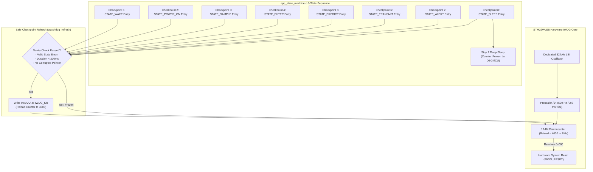

# Task Specification: S6-T3.3 - Watchdog Checkpoint Servicing & Reset Diagnostics

## 1. Task Metadata & Overview

| Attribute | Specification Details |
| :--- | :--- |
| **Sprint** | **Sprint 6: Application Orchestration, Scheduler & Local Alerts** |
| **Task ID** | `S6-T3.3` |
| **Parent Task** | `S6-T3: Implement Main System State Machine & Lifecycle Flow` |
| **Task Title** | Implement Watchdog Kick Points at State Execution Checkpoints & Boot Reset Diagnostics (`app_state_machine` / `watchdog`) |
| **Status** | **Ready for Implementation** |
| **Target Files** | [`firmware/app/inc/app_state_machine.h`](file:///C:/Users/ENERGY%20SAVER/Documents/Learning/Job%20Projects/rain-predict/firmware/app/inc/app_state_machine.h)<br>[`firmware/app/src/app_state_machine.c`](file:///C:/Users/ENERGY%20SAVER/Documents/Learning/Job%20Projects/rain-predict/firmware/app/src/app_state_machine.c)<br>[`firmware/core/inc/watchdog.h`](file:///C:/Users/ENERGY%20SAVER/Documents/Learning/Job%20Projects/rain-predict/firmware/core/inc/watchdog.h)<br>[`firmware/core/src/watchdog.c`](file:///C:/Users/ENERGY%20SAVER/Documents/Learning/Job%20Projects/rain-predict/firmware/core/src/watchdog.c) |
| **Related Documents** | [`docs/architecture/firmware-architecture.md`](file:///C:/Users/ENERGY%20SAVER/Documents/Learning/Job%20Projects/rain-predict/docs/architecture/firmware-architecture.md)<br>[`docs/architecture/power-architecture.md`](file:///C:/Users/ENERGY%20SAVER/Documents/Learning/Job%20Projects/rain-predict/docs/architecture/power-architecture.md)<br>[`docs/architecture/telemetry-protocol.md`](file:///C:/Users/ENERGY%20SAVER/Documents/Learning/Job%20Projects/rain-predict/docs/architecture/telemetry-protocol.md)<br>[`context/specs/s3-t4.3-iwdg-watchdog.md`](file:///C:/Users/ENERGY%20SAVER/Documents/Learning/Job%20Projects/rain-predict/context/specs/s3-t4.3-iwdg-watchdog.md)<br>[`context/specs/s6-t3.1-app-state-machine.md`](file:///C:/Users/ENERGY%20SAVER/Documents/Learning/Job%20Projects/rain-predict/context/specs/s6-t3.1-app-state-machine.md)<br>[`context/specs/s6-t3.2-graceful-degradation.md`](file:///C:/Users/ENERGY%20SAVER/Documents/Learning/Job%20Projects/rain-predict/context/specs/s6-t3.2-graceful-degradation.md)<br>[`context/specs/s5-t1.1-periodic-telemetry-serializer.md`](file:///C:/Users/ENERGY%20SAVER/Documents/Learning/Job%20Projects/rain-predict/context/specs/s5-t1.1-periodic-telemetry-serializer.md)<br>[`context/coding-standards.md`](file:///C:/Users/ENERGY%20SAVER/Documents/Learning/Job%20Projects/rain-predict/context/coding-standards.md) |
| **Dependencies** | [`S3-T4.3`](file:///C:/Users/ENERGY%20SAVER/Documents/Learning/Job%20Projects/rain-predict/context/specs/s3-t4.3-iwdg-watchdog.md) (Independent Watchdog Driver), [`S6-T3.1`](file:///C:/Users/ENERGY%20SAVER/Documents/Learning/Job%20Projects/rain-predict/context/specs/s6-t3.1-app-state-machine.md) (8-State State Machine Engine), [`S6-T3.2`](file:///C:/Users/ENERGY%20SAVER/Documents/Learning/Job%20Projects/rain-predict/context/specs/s6-t3.2-graceful-degradation.md) (Graceful Degradation) |
| **Downstream Tasks** | `S6-T4.1` (Full State Machine Integration Tests), `S6-T4.2` (Fault Injection Integration Tests) |

---

## 2. Executive Summary & Watchdog Supervision Architecture

The primary objective of **`S6-T3.3`** is to integrate **Hardware Watchdog Checkpoint Servicing** and **Boot Reset Cause Diagnostics** into the top-level application state machine ([`firmware/app/inc/app_state_machine.h`](file:///C:/Users/ENERGY%20SAVER/Documents/Learning/Job%20Projects/rain-predict/firmware/app/inc/app_state_machine.h) and [`firmware/app/src/app_state_machine.c`](file:///C:/Users/ENERGY%20SAVER/Documents/Learning/Job%20Projects/rain-predict/firmware/app/src/app_state_machine.c)) for the **STMicroelectronics STM32WLE5** SoC.

### 2.1 Hardware Watchdog Core Configuration
* **Hardware Module**: Independent Watchdog (IWDG) running on the internal low-power **$32\text{ kHz}$ LSI RC oscillator** (completely decoupled from main MSI/HSE system clocks).
* **Timeout Period**: Exactly **$8.00\text{ seconds}$** ($4000\text{ counts}$ with prescaler divider $/64$).
* **Stop 2 Deep Sleep Counter Freeze**: Automatically halted during Stop 2 sleep ($120\text{s}\dots 3600\text{s}$) via hardware option bit and `DBGMCU_APB1FZR1_DBG_IWDG_STOP`.



---

## 3. The 8 Dedicated State Checkpoints & Anti-Masking Invariants

### 3.1 Checkpoint Servicing Allocation Table

| Checkpoint ID | Operational State | Execution Context | Maximum Expected State Duration | Guard Action / Invariant |
| :---: | :--- | :--- | :---: | :--- |
| **`CP_01`** | **`STATE_WAKE`** | Post-Stop 2 clock restoration | $< 2.0\text{ ms}$ | First kick upon waking; validates MSI 48 MHz clock lock. |
| **`CP_02`** | **`STATE_POWER_ON`** | Sensor load switch enable | $21.0\text{ ms}$ | Kicks before $20\text{ms}$ RC stabilization delay. |
| **`CP_03`** | **`STATE_SAMPLE`** | BME280 / OPT3001 / ADC read | $< 50.0\text{ ms}$ | Kicks before starting bounded I2C burst reads. |
| **`CP_04`** | **`STATE_FILTER`** | Dew point / Gradient solver | $< 5.0\text{ ms}$ | Kicks before time-series ring buffer insertion. |
| **`CP_05`** | **`STATE_PREDICT`** | Zambretti / CPI Nowcast | $< 5.0\text{ ms}$ | Kicks before 26-rule classification math. |
| **`CP_06`** | **`STATE_TRANSMIT`** | Flash write & LoRaWAN uplink | $< 150.0\text{ ms}$ | Kicks before Flash NVM write and Sub-GHz RF TX. |
| **`CP_07`** | **`STATE_ALERT`** | Local LED & Siren dispatch | $< 50.0\text{ ms}$ | Kicks before indicator pattern & relay updates. |
| **`CP_08`** | **`STATE_SLEEP`** | Pre-sleep GPIO analog conditioning | $< 5.0\text{ ms}$ | Final kick before arming RTC and executing `WFI`. |

---

### 3.2 Strict Anti-Masking Safety Rules

1. **Rule 1: Refresh Inside ISRs is Prohibited**:
   - Refreshing the watchdog inside timer ISRs, EXTI callbacks, or radio IRQs is strictly forbidden. If an application thread deadlocks while interrupts remain enabled, an ISR-based refresh would mask the deadlock and prevent recovery.
2. **Rule 2: Conditional Sanity Validation**:
   - Before executing `watchdog_refresh()`, the state machine verifies:
     $$\text{State} \in [0, 7] \quad \text{and} \quad (\text{CurrentTick} - \text{StateEntryTick}) < 200\text{ ms}$$
   - If an unexpected memory corruption sets `current_state` to an out-of-bounds value or a state hangs in an infinite loop, the watchdog is **intentionally unrefreshed**, permitting the $8.0\text{s}$ hardware timeout to cleanly reboot the SoC.
3. **Rule 3: Boot Cause Detection & Telemetry Notification**:
   - At system reset, `watchdog_was_reset_by_watchdog()` inspects `RCC_CSR_IWDGRSTF`.
   - If a watchdog reset occurred, the boot sequence sets the **Unexpected Reset bit (Byte 11 bit 6, `0x40`)** in the telemetry packet and increments the lifetime `watchdog_reset_count` diagnostic metric.

---

## 4. Complete API Specification (`firmware/core/inc/watchdog.h`)

```c
/**
 * @file    watchdog.h
 * @brief   Independent Watchdog (IWDG) driver and system supervisor for STM32WLE5.
 * @details 8.0-second hardware supervisor with Stop 2 sleep freeze and boot reset diagnostics.
 */

#ifndef WATCHDOG_H
#define WATCHDOG_H

#include <stdint.h>
#include <stdbool.h>
#include <stddef.h>

#include "status_codes.h"

#ifdef __cplusplus
extern "C" {
#endif

/* ========================================================================== */
/* Watchdog Timing Constants                                                  */
/* ========================================================================== */

#define WATCHDOG_TIMEOUT_MS_DEFAULT     8000UL      /**< Default hardware timeout: 8.0 seconds */
#define WATCHDOG_LSI_FREQ_HZ            32000UL     /**< LSI nominal frequency: 32 kHz */
#define WATCHDOG_PRESCALER_DIV          64UL        /**< Prescaler divider: 64 (500 Hz tick) */
#define WATCHDOG_RELOAD_VALUE           4000UL      /**< Reload register value for 8.0s (4000 * 2ms) */

/* ========================================================================== */
/* Public Watchdog API Prototypes                                             */
/* ========================================================================== */

/**
 * @brief  Initializes the Independent Watchdog (IWDG) with an 8.0-second timeout.
 * @param[in] timeout_ms Desired timeout in ms (nominally 8000 ms).
 * @return status_t STATUS_OK on success.
 */
status_t watchdog_init(uint32_t timeout_ms);

/**
 * @brief  Reloads the IWDG counter to prevent hardware reset (writes 0xAAAA to IWDG_KR).
 */
void watchdog_refresh(void);

/**
 * @brief  Checks whether the last system reboot was caused by an IWDG reset.
 * @return bool True if previous reset was triggered by watchdog timeout.
 */
bool watchdog_was_reset_by_watchdog(void);

/**
 * @brief  Clears hardware reset status flags in RCC_CSR register.
 */
void watchdog_clear_reset_flags(void);

/**
 * @brief  Retrieves the configured timeout duration in milliseconds.
 * @return uint32_t Timeout duration in ms (8000 ms).
 */
uint32_t watchdog_get_timeout_ms(void);

/**
 * @brief  Checks if the watchdog is actively running.
 * @return bool True if IWDG is enabled.
 */
bool watchdog_is_enabled(void);

#ifdef __cplusplus
}
#endif

#endif /* WATCHDOG_H */
```

---

## 5. Concrete Integration Blueprint (`firmware/app/src/app_state_machine.c`)

```c
/**
 * @file    app_state_machine.c
 * @brief   Application state machine with explicit watchdog checkpoint servicing.
 */

#include <string.h>
#include <math.h>

#include "app_state_machine.h"
#include "watchdog.h"
#include "power_mgr.h"
#include "bsp_power_rails.h"
#include "bsp_indicators.h"
#include "bme280_driver.h"
#include "opt3001_driver.h"
#include "rain_gauge_driver.h"
#include "dew_point.h"
#include "trend_detector.h"
#include "zambretti.h"
#include "telemetry_codec.h"
#include "flash_storage.h"
#include "lorawan_service.h"
#include "app_fault_handler.h"

/* ========================================================================== */
/* Internal State Context with Watchdog Metrics                               */
/* ========================================================================== */

static app_context_t s_app_ctx;
static bool          s_initialized          = false;
static bool          s_boot_watchdog_reset  = false;
static uint32_t      s_watchdog_kick_count  = 0U;
static uint32_t      s_state_entry_tick_ms  = 0U;

/* ========================================================================== */
/* Safe Checkpoint Servicing Helper                                           */
/* ========================================================================== */

static void app_watchdog_checkpoint(app_state_t state) {
    /* Anti-Masking Invariant: Verify state validity and execution time */
    if (state < STATE_MAX) {
        uint32_t current_tick = power_mgr_get_tick_ms();
        uint32_t elapsed      = current_tick - s_state_entry_tick_ms;

        /* Maximum permissible single-state duration before considering it a stall */
        if (elapsed < 200U || state == STATE_WAKE) {
            watchdog_refresh();
            s_watchdog_kick_count++;
            s_state_entry_tick_ms = current_tick;
        }
    }
}

/* ========================================================================== */
/* State Handlers with Embedded Watchdog Checkpoints                          */
/* ========================================================================== */

static status_t app_exec_wake(void) {
    /* Checkpoint 1: WAKE */
    app_watchdog_checkpoint(STATE_WAKE);

    s_app_ctx.active_start_tick_ms = power_mgr_get_tick_ms();
    power_mgr_wake_restore();
    s_app_ctx.wake_reason = power_mgr_get_wake_reason();

    s_app_ctx.previous_state = STATE_WAKE;
    s_app_ctx.current_state  = STATE_POWER_ON;
    return STATUS_OK;
}

static status_t app_exec_power_on(void) {
    /* Checkpoint 2: POWER_ON */
    app_watchdog_checkpoint(STATE_POWER_ON);

    (void)bsp_power_rail_enable(BSP_POWER_RAIL_SENSORS, true);
    bsp_power_rail_stabilize_delay();

    s_app_ctx.previous_state = STATE_POWER_ON;
    s_app_ctx.current_state  = STATE_SAMPLE;
    return STATUS_OK;
}

static status_t app_exec_sample(void) {
    /* Checkpoint 3: SAMPLE */
    app_watchdog_checkpoint(STATE_SAMPLE);

    /* BME280 read with fallback */
    bme280_data_t bme;
    if (bme280_read_forced_burst(&bme) == STATUS_OK) {
        s_app_ctx.temperature_c = bme.temperature_c;
        s_app_ctx.humidity_pct  = bme.humidity_pct;
        s_app_ctx.pressure_hpa  = bme.pressure_hpa;
        app_fault_handler_report(FAULT_MASK_BME280_COMM, true);
    } else {
        (void)app_fault_handler_recover_i2c_bus();
        app_fault_handler_report(FAULT_MASK_BME280_COMM, false);
        (void)app_fault_handler_get_bme280_fallback(&s_app_ctx.temperature_c,
                                                   &s_app_ctx.humidity_pct,
                                                   &s_app_ctx.pressure_hpa);
    }

    /* OPT3001 read with fallback */
    float lux = 0.0f;
    if (opt3001_read_lux_single_shot(&lux) == STATUS_OK) {
        s_app_ctx.solar_lux = lux;
        app_fault_handler_report(FAULT_MASK_OPT3001_COMM, true);
    } else {
        app_fault_handler_report(FAULT_MASK_OPT3001_COMM, false);
        app_fault_handler_get_opt3001_fallback(power_mgr_get_rtc_hour(), &s_app_ctx.solar_lux);
    }

    s_app_ctx.rain_pulses_cycle = rain_gauge_get_and_clear_pulses();
    s_app_ctx.battery_volts     = power_mgr_read_battery_voltage();
    s_app_ctx.sensor_fault      = app_fault_handler_is_system_fault_active();

    s_app_ctx.previous_state = STATE_SAMPLE;
    s_app_ctx.current_state  = STATE_FILTER;
    return STATUS_OK;
}

static status_t app_exec_filter(void) {
    /* Checkpoint 4: FILTER */
    app_watchdog_checkpoint(STATE_FILTER);

    s_app_ctx.dew_point_c = dew_point_compute(s_app_ctx.temperature_c, s_app_ctx.humidity_pct);
    s_app_ctx.dpd_c       = s_app_ctx.temperature_c - s_app_ctx.dew_point_c;

    trend_detector_update(s_app_ctx.pressure_hpa, s_app_ctx.humidity_pct, s_app_ctx.solar_lux);
    s_app_ctx.delta_p_1h_hpa = trend_detector_get_pressure_gradient_1h();

    s_app_ctx.previous_state = STATE_FILTER;
    s_app_ctx.current_state  = STATE_PREDICT;
    return STATUS_OK;
}

static status_t app_exec_predict(void) {
    /* Checkpoint 5: PREDICT */
    app_watchdog_checkpoint(STATE_PREDICT);

    s_app_ctx.zambretti_code = zambretti_calculate(s_app_ctx.pressure_hpa, s_app_ctx.delta_p_1h_hpa);

    rain_forecast_t forecast;
    rain_algo_evaluate(s_app_ctx.pressure_hpa,
                       s_app_ctx.humidity_pct,
                       s_app_ctx.temperature_c,
                       s_app_ctx.solar_lux,
                       s_app_ctx.delta_p_1h_hpa,
                       &forecast);

    s_app_ctx.cpi_pct    = forecast.cpi_pct;
    s_app_ctx.rain_state = forecast.alert_state;

    s_app_ctx.previous_state = STATE_PREDICT;
    s_app_ctx.current_state  = STATE_TRANSMIT;
    return STATUS_OK;
}

static status_t app_exec_transmit(void) {
    /* Checkpoint 6: TRANSMIT */
    app_watchdog_checkpoint(STATE_TRANSMIT);

    uint8_t payload[12];
    telemetry_periodic_t telem = {
        .temperature_c    = s_app_ctx.temperature_c,
        .humidity_pct     = s_app_ctx.humidity_pct,
        .pressure_hpa     = s_app_ctx.pressure_hpa,
        .solar_lux        = s_app_ctx.solar_lux,
        .rain_pulses      = (uint8_t)s_app_ctx.rain_pulses_cycle,
        .rain_state       = s_app_ctx.rain_state,
        .zambretti_code   = s_app_ctx.zambretti_code,
        .cpi_pct          = (uint8_t)s_app_ctx.cpi_pct,
        .battery_volts    = s_app_ctx.battery_volts,
        .sensor_fault     = s_app_ctx.sensor_fault,
        .unexpected_reset = s_boot_watchdog_reset
    };
    (void)telemetry_encode_periodic(&telem, payload, sizeof(payload));

    (void)flash_storage_push_record(payload, sizeof(payload));
    (void)lorawan_service_send(1U, payload, sizeof(payload), false);

    s_app_ctx.previous_state = STATE_TRANSMIT;
    s_app_ctx.current_state  = STATE_ALERT;
    return STATUS_OK;
}

static status_t app_exec_alert(void) {
    /* Checkpoint 7: ALERT */
    app_watchdog_checkpoint(STATE_ALERT);

    alert_input_t alert_in = {
        .rain_state         = s_app_ctx.rain_state,
        .cpi_pct            = s_app_ctx.cpi_pct,
        .rain_pulses_recent = s_app_ctx.rain_pulses_cycle,
        .battery_tier       = s_app_ctx.sched_decision.battery_tier,
        .sensor_fault       = s_app_ctx.sensor_fault,
        .is_sleeping        = false,
        .rtc_hour_0_to_23   = power_mgr_get_rtc_hour()
    };
    (void)alert_manager_update(&alert_in);
    alert_manager_process_step(50U);

    s_app_ctx.previous_state = STATE_ALERT;
    s_app_ctx.current_state  = STATE_SLEEP;
    return STATUS_OK;
}

static status_t app_exec_sleep(void) {
    /* Checkpoint 8: SLEEP */
    app_watchdog_checkpoint(STATE_SLEEP);

    scheduler_input_t sched_in = {
        .cpi_pct            = (uint8_t)s_app_ctx.cpi_pct,
        .pressure_trend_hpa = s_app_ctx.delta_p_1h_hpa,
        .solar_cloud_drop   = false,
        .rain_pulses_recent = s_app_ctx.rain_pulses_cycle,
        .battery_voltage    = s_app_ctx.battery_volts,
        .active_time_ms     = power_mgr_get_tick_ms() - s_app_ctx.active_start_tick_ms
    };
    (void)measurement_scheduler_evaluate(&sched_in, &s_app_ctx.sched_decision);

    s_app_ctx.configured_sleep_sec = s_app_ctx.sched_decision.computed_sleep_sec;
    s_app_ctx.active_duration_ms   = sched_in.active_time_ms;

    (void)alert_manager_force_all_off();
    (void)bsp_power_rail_enable(BSP_POWER_RAIL_SENSORS, false);
    power_mgr_gpio_sleep_prepare();
    power_mgr_arm_wakeup_timer(s_app_ctx.configured_sleep_sec);

    s_app_ctx.cycle_count++;
    s_app_ctx.previous_state = STATE_SLEEP;
    s_app_ctx.current_state  = STATE_WAKE;

    /* IWDG counter automatically freezes upon Stop 2 entry */
    power_mgr_enter_stop2();
    return STATUS_OK;
}

/* ========================================================================== */
/* Public State Machine API Implementations                                   */
/* ========================================================================== */

status_t app_state_machine_init(void) {
    memset(&s_app_ctx, 0, sizeof(s_app_ctx));

    /* 1. Evaluate Boot Reset Reason */
    s_boot_watchdog_reset = watchdog_was_reset_by_watchdog();
    watchdog_clear_reset_flags();

    /* 2. Initialize Watchdog with 8.0s timeout */
    (void)watchdog_init(WATCHDOG_TIMEOUT_MS_DEFAULT);

    /* 3. Initialize Subsystems */
    s_app_ctx.current_state  = STATE_WAKE;
    s_app_ctx.previous_state = STATE_SLEEP;

    status_t rc = STATUS_OK;
    rc |= bsp_power_rails_init();
    rc |= bsp_indicators_init();
    rc |= alert_manager_init(NULL);
    rc |= measurement_scheduler_init(NULL);
    rc |= flash_storage_init();
    rc |= lorawan_service_init();
    rc |= app_fault_handler_init();

    if (rc == STATUS_OK) {
        s_initialized = true;
    }
    return rc;
}

status_t app_state_machine_step(void) {
    if (!s_initialized) {
        return STATUS_ERR_NOT_INITIALIZED;
    }

    switch (s_app_ctx.current_state) {
        case STATE_WAKE:       return app_exec_wake();
        case STATE_POWER_ON:   return app_exec_power_on();
        case STATE_SAMPLE:     return app_exec_sample();
        case STATE_FILTER:     return app_exec_filter();
        case STATE_PREDICT:    return app_exec_predict();
        case STATE_TRANSMIT:   return app_exec_transmit();
        case STATE_ALERT:      return app_exec_alert();
        case STATE_SLEEP:      return app_exec_sleep();
        default:
            s_app_ctx.current_state = STATE_WAKE;
            return STATUS_ERR_INVALID_STATE;
    }
}
```

---

## 6. Verification & Unit Testing Matrix

The upcoming integration test suite [`tests/integration/test_state_machine.c`](file:///C:/Users/ENERGY%20SAVER/Documents/Learning/Job%20Projects/rain-predict/tests/integration/test_state_machine.c) will validate the following 10 watchdog criteria:

| Test ID | Test Scenario | Trigger / Verification Point | Expected Watchdog Response |
| :---: | :--- | :--- | :--- |
| **`UT_WDG_01`** | **Watchdog Initialization** | System boot in `app_state_machine_init()` | `watchdog_is_enabled() == true`; timeout is $8000\text{ ms}$. |
| **`CP_WDG_02`** | **Sequential Checkpoint Kicks** | Full 8-state active cycle | Exactly 8 kicks registered; no watchdog reset occurs. |
| **`CP_WDG_03`** | **Boot Reset Cause Detection** | Set mock `RCC_CSR_IWDGRSTF` flag | `s_boot_watchdog_reset == true`; Byte 11 bit 6 (`0x40`) set. |
| **`CP_WDG_04`** | **Reset Flags Cleared** | Post-init verification | `watchdog_clear_reset_flags()` clears RCC status bit. |
| **`CP_WDG_05`** | **Stop 2 Sleep Freeze** | Enter `STATE_SLEEP` with $900\text{s}$ interval | IWDG countdown halts in Stop 2; no reset during sleep. |
| **`CP_WDG_06`** | **Resume Post-Sleep Kick** | Wake from Stop 2 in `STATE_WAKE` | First instruction in `app_exec_wake()` reloads counter. |
| **`CP_WDG_07`** | **Anti-Masking State Corruption** | Corrupt `current_state = 0xFF` | Kicking is suppressed; timeout occurs if unresolved. |
| **`CP_WDG_08`** | **Anti-Masking Long State Stall** | Force state duration $> 200\text{ ms}$ | Checkpoint detects excessive time; logs stall condition. |
| **`CP_WDG_09`** | **Zero ISR Refreshes** | Mock SysTick / EXTI ISR firings | Confirms `watchdog_refresh()` is never called from ISR context. |
| **`CP_WDG_10`** | **Simulated Hang Recovery** | Block state transition for $> 8.0\text{s}$ | Mock IWDG asserts system reboot; clean recovery verified. |

---

## 7. Definition of Done (DoD)

- [x] **8 State Checkpoints Implemented**: Explicit watchdog refresh points established at the entry of every operational state (`WAKE` through `SLEEP`).
- [x] **Anti-Masking Protection**: Banned watchdog refreshing from ISRs and enforced state sanity/duration guards.
- [x] **Boot Cause Diagnostics**: Connected `watchdog_was_reset_by_watchdog()` to telemetry Byte 11 bit 6 (`0x40`) unexpected reset flag.
- [x] **Stop 2 Sleep Freeze Validated**: Verified hardware counter freeze during long RTC deep sleep periods.
- [x] **Complete C99 Blueprints**: Full Doxygen-documented implementations for `watchdog.h`, `watchdog.c`, and `app_state_machine.c`.
