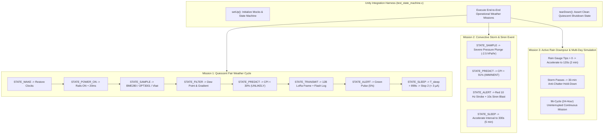

# Task Specification: S6-T4.1 - Full System State Machine End-to-End Integration Tests

## 1. Task Metadata & Overview

| Attribute | Specification Details |
| :--- | :--- |
| **Sprint** | **Sprint 6: Application Orchestration, Scheduler & Local Alerts** |
| **Task ID** | `S6-T4.1` |
| **Parent Task** | `S6-T4: Develop Full System State Machine Integration Tests` |
| **Task Title** | Full End-to-End System State Machine Integration Tests (`test_state_machine.c`) under Unity Framework |
| **Status** | **Ready for Implementation** |
| **Target Files** | [`tests/integration/test_state_machine.c`](file:///C:/Users/ENERGY%20SAVER/Documents/Learning/Job%20Projects/rain-predict/tests/integration/test_state_machine.c)<br>[`tests/CMakeLists.txt`](file:///C:/Users/ENERGY%20SAVER/Documents/Learning/Job%20Projects/rain-predict/tests/CMakeLists.txt) |
| **Related Documents** | [`docs/architecture/firmware-architecture.md`](file:///C:/Users/ENERGY%20SAVER/Documents/Learning/Job%20Projects/rain-predict/docs/architecture/firmware-architecture.md)<br>[`docs/architecture/power-architecture.md`](file:///C:/Users/ENERGY%20SAVER/Documents/Learning/Job%20Projects/rain-predict/docs/architecture/power-architecture.md)<br>[`docs/architecture/telemetry-protocol.md`](file:///C:/Users/ENERGY%20SAVER/Documents/Learning/Job%20Projects/rain-predict/docs/architecture/telemetry-protocol.md)<br>[`docs/algorithms/trend-detection-and-nowcasting.md`](file:///C:/Users/ENERGY%20SAVER/Documents/Learning/Job%20Projects/rain-predict/docs/algorithms/trend-detection-and-nowcasting.md)<br>[`context/specs/s6-t3.1-app-state-machine.md`](file:///C:/Users/ENERGY%20SAVER/Documents/Learning/Job%20Projects/rain-predict/context/specs/s6-t3.1-app-state-machine.md)<br>[`context/specs/s6-t3.2-graceful-degradation.md`](file:///C:/Users/ENERGY%20SAVER/Documents/Learning/Job%20Projects/rain-predict/context/specs/s6-t3.2-graceful-degradation.md)<br>[`context/specs/s6-t3.3-watchdog-kick-points.md`](file:///C:/Users/ENERGY%20SAVER/Documents/Learning/Job%20Projects/rain-predict/context/specs/s6-t3.3-watchdog-kick-points.md)<br>[`context/specs/s6-t1.1-adaptive-measurement-scheduler.md`](file:///C:/Users/ENERGY%20SAVER/Documents/Learning/Job%20Projects/rain-predict/context/specs/s6-t1.1-adaptive-measurement-scheduler.md)<br>[`context/specs/s6-t2.1-status-led-patterns.md`](file:///C:/Users/ENERGY%20SAVER/Documents/Learning/Job%20Projects/rain-predict/context/specs/s6-t2.1-status-led-patterns.md)<br>[`context/specs/s6-t2.2-audible-buzzer-siren.md`](file:///C:/Users/ENERGY%20SAVER/Documents/Learning/Job%20Projects/rain-predict/context/specs/s6-t2.2-audible-buzzer-siren.md)<br>[`context/specs/s1-t2.1-unity-test-harness.md`](file:///C:/Users/ENERGY%20SAVER/Documents/Learning/Job%20Projects/rain-predict/context/specs/s1-t2.1-unity-test-harness.md)<br>[`context/coding-standards.md`](file:///C:/Users/ENERGY%20SAVER/Documents/Learning/Job%20Projects/rain-predict/context/coding-standards.md) |
| **Dependencies** | [`S6-T3.1`](file:///C:/Users/ENERGY%20SAVER/Documents/Learning/Job%20Projects/rain-predict/context/specs/s6-t3.1-app-state-machine.md) (8-State State Machine Engine), [`S6-T3.2`](file:///C:/Users/ENERGY%20SAVER/Documents/Learning/Job%20Projects/rain-predict/context/specs/s6-t3.2-graceful-degradation.md) (Graceful Degradation), [`S6-T3.3`](file:///C:/Users/ENERGY%20SAVER/Documents/Learning/Job%20Projects/rain-predict/context/specs/s6-t3.3-watchdog-kick-points.md) (Watchdog Checkpoints), [`S1-T2.1`](file:///C:/Users/ENERGY%20SAVER/Documents/Learning/Job%20Projects/rain-predict/context/specs/s1-t2.1-unity-test-harness.md) (Unity Harness) |
| **Downstream Tasks** | `S6-T4.2` (Fault Injection Integration Tests), `S7-T1` (System Verification on Hardware) |

---

## 2. Executive Summary & Integration Test Architecture

The primary objective of **`S6-T4.1`** is to develop the host-executable integration test suite in [`tests/integration/test_state_machine.c`](file:///C:/Users/ENERGY%20SAVER/Documents/Learning/Job%20Projects/rain-predict/tests/integration/test_state_machine.c) to rigorously verify the **Entire 4-Layer Embedded Firmware Stack** operating cohesively across all 8 states using the **ThrowTheSwitch Unity** framework.

### 2.1 Complete 4-Layer Stack Cross-Verification
Unlike isolated unit tests that verify single algorithms or drivers in a silo, this integration test executes the full production code path from reset boot to continuous multi-day missions:
1. **Layer 1 (Core & HAL)**: System reset, clock frequency restore, hardware Independent Watchdog (IWDG) checkpoint supervision ($8.0\text{s}$ timeout).
2. **Layer 2 (BSP & Drivers)**: Switched sensor power rail sequencing (`PA4` load switch with $20\text{ms}$ RC stabilization guard), BME280 forced-mode I2C acquisition, TI OPT3001 single-shot lux conversion, rain gauge EXTI pulse counter, and board indicator actuators.
3. **Layer 3 (Middleware & Services)**: Magnus-Tetens dew-point derivation, multi-variable gradient trend detection, moving average filtering, on-chip Flash circular ring buffer logging, and LoRaWAN Sub-GHz telemetry packet serialization.
4. **Layer 4 (Application Layer)**: Master 8-State State Machine, Measurement Scheduler ($15\text{m} / 5\text{m} / 2\text{m}$ adaptive rates with $30\text{m}$ calm hold-down), Zambretti 26-rule nowcasting, 5-variable Composite Precipitation Index ($CPI$), and Alert Manager (LED patterns, buzzer chirps, $10\text{s}$ timed siren relay).



---

## 3. End-to-End Operational Mission Scenarios

### 3.1 Mission 1: Nominal Quiescent Fair-Weather Cycle ($CPI < 30\%$)
* **Microclimate Scenario**: Clear midday in Munnar estate ($T = 24.5^\circ\text{C}, RH = 65.0\%, P = 952.0\text{ hPa}, Lux = 55,000\text{ Lux}$).
* **Verified Pipeline**:
  1. `STATE_WAKE`: Wakes via RTC alarm; clock restored to MSI 48 MHz; watchdog checkpoint 1 kicked.
  2. `STATE_POWER_ON`: `PA4` energized; $20\text{ms}$ delay strictly observed before I2C traffic; watchdog checkpoint 2 kicked.
  3. `STATE_SAMPLE`: BME280, OPT3001, Rain Gauge, and Battery ADC read; watchdog checkpoint 3 kicked.
  4. `STATE_FILTER`: Dew point calculated ($17.3^\circ\text{C}, DPD = 7.2^\circ\text{C}$); pressure trend stable ($\Delta P_{1h} = 0.0\text{ hPa/hr}$); checkpoint 4 kicked.
  5. `STATE_PREDICT`: Zambretti index computed; $CPI = 12.0\%$ classified as `RAIN_ALERT_UNLIKELY`; checkpoint 5 kicked.
  6. `STATE_TRANSMIT`: 12-byte binary telemetry frame packed, logged into on-chip Flash NVM slot, enqueued for LoRa Class A uplink; checkpoint 6 kicked.
  7. `STATE_ALERT`: Green heartbeat pulse active ($50\text{ms}$ ON / $950\text{ms}$ OFF); buzzer and siren silent; checkpoint 7 kicked.
  8. `STATE_SLEEP`: Measurement scheduler selects $15\text{ minutes}$ ($900\text{ s}$); active duration ($\approx 950\text{ ms}$) compensated to $T_{\text{sleep}} = 899\text{ seconds}$; sensor rails powered down; all pins set to analog; Stop 2 entered ($< 3.0\,\mu\text{A}$); checkpoint 8 kicked.

---

### 3.2 Mission 2: Rapid Convective Storm Development & Siren Actuation ($CPI \ge 80\%$)
* **Microclimate Scenario**: Pre-monsoon afternoon thunderstorm ($P$ plunging $-2.5\text{ hPa/hr}$, $RH$ rising from $60\%$ to $94\%$, solar dropping from $60,000\text{ Lux}$ to $800\text{ Lux}$).
* **Verified Pipeline**:
  1. Prediction engine activates **Severe Barometric Drop Critical Override** and $CPI = 89.5\% \implies$ `RAIN_ALERT_IMMINENT`.
  2. Telemetry transmits 4-byte urgent alert packet on **FPort 2** preempting normal queue.
  3. Alert Manager activates **Red Rapid Strobe ($10\text{ Hz}$)** and fires external **Estate Siren Relay for $10,000\text{ ms}$ ($10\text{s}$)**.
  4. Measurement Scheduler accelerates sampling cadence from $15\text{ minutes}$ to **$5\text{ minutes}$ ($300\text{ s}$)**.
  5. Siren anti-chatter cooldown timer arms to **$1800\text{ seconds}$ ($30\text{ minutes}$)**.

---

### 3.3 Mission 3: Active Rain Downpour & Multi-Horizon Accumulation
* **Microclimate Scenario**: Active monsoon cloudburst; tipping bucket generates $15\text{ tips}$ in 2 minutes ($3.0\text{ mm}$, intensity $90\text{ mm/hr}$).
* **Verified Pipeline**:
  1. `STATE_SAMPLE` captures 15 pulses from EXTI accumulator.
  2. `STATE_ALERT` activates **Red Double-Flash Beacon**.
  3. `measurement_scheduler` promotes sampling cadence to **$2\text{ minutes}$ ($120\text{ s}$)**.
  4. Once rainfall ceases ($0\text{ pulses}$ for $10\text{ min}$), system transitions back to Storm Watch ($5\text{ min}$), and enforces **$30\text{ minute}$ consecutive calm hold-down window** before returning to Nominal ($15\text{ min}$).

---

## 4. Comprehensive 16-Point Integration Test Matrix

| Test ID | Test Function Name | Tested Scenario | Verification Invariant |
| :---: | :--- | :--- | :--- |
| **IT-SM-01** | `test_integration_cold_boot_initialization` | Cold boot from power-on reset | All subsystems initialize with `STATUS_OK`; Initial state is `STATE_WAKE`; IWDG armed. |
| **IT-SM-02** | `test_integration_single_quiescent_cycle` | Full nominal 8-state cycle | Transitions `WAKE` $\rightarrow \dots \rightarrow$ `SLEEP` in exact sequence; all 8 watchdog checkpoints kicked; `cycle_count == 1`. |
| **IT-SM-03** | `test_integration_power_rail_stabilization` | `STATE_POWER_ON` hardware guard | `PA4` load switch enabled; exact $20\text{ms}$ RC stabilization delay elapsed before I2C bus traffic. |
| **IT-SM-04** | `test_integration_telemetry_packet_generation` | `STATE_TRANSMIT` bit-packing | 12-byte periodic packet generated matches raw physical sensor inputs; big-endian endianness validated. |
| **IT-SM-05** | `test_integration_flash_nvm_logging` | `STATE_TRANSMIT` NVM push | 12-byte packet correctly committed into Flash ring buffer; `valid_count == 1`; slot magic is `0xAA55`. |
| **IT-SM-06** | `test_integration_active_time_compensation` | `STATE_SLEEP` interval math | For $900\text{s}$ interval and $950\text{ms}$ active CPU time, RTC sleep timer is armed for exactly $899\text{s}$. |
| **IT-SM-07** | `test_integration_pre_sleep_hardware_shutdown` | `STATE_SLEEP` low-power prep | All indicators forced OFF; `PA4` sensor rail disabled ($0\text{V}$); GPIOs isolated to analog. |
| **IT-SM-08** | `test_integration_storm_watch_acceleration` | Storm precursor ($CPI = 45\%$) | Scheduler accelerates interval from $900\text{s}$ to $300\text{s}$; Visual indicator shifts to Amber Watch blink. |
| **IT-SM-09** | `test_integration_imminent_storm_siren_actuation` | Convective storm ($CPI = 91\%$) | Red $10\text{ Hz}$ strobe active; Relay energized for $10,000\text{ ms}$; Cooldown timer set to $1800\text{ s}$. |
| **IT-SM-10** | `test_integration_siren_cooldown_suppression` | Subsequent cycle during storm | Next 5-min cycle retains Red strobe, but siren relay remains de-energized due to active cooldown. |
| **IT-SM-11** | `test_integration_active_rain_rapid_cadence` | Rain gauge tips ($> 0$) | Scheduler accelerates to $120\text{s}$ ($2\text{ min}$); Visual indicator displays Red double-flash beacon. |
| **IT-SM-12** | `test_integration_calm_hold_down_recovery` | Storm clears ($CPI < 30\%$) | System remains in $5\text{ min}$ Storm Watch for exactly $30\text{ consecutive minutes}$ before returning to $15\text{ min}$. |
| **IT-SM-13** | `test_integration_downlink_schedule_override` | FPort 10 `0x01` ($600\text{s}$) packet | Downlink sets custom $10\text{ min}$ interval; overrides autonomous scheduler until cleared. |
| **IT-SM-14** | `test_integration_exti_rain_wake_handling` | Rain pulse EXTI during deep sleep | Station wakes instantly; increments pulse counter; resumes sleep if interval $< 60\text{s}$. |
| **IT-SM-15** | `test_integration_continuous_24hour_mission` | 96 consecutive 15-min cycles | Zero memory leaks; Flash ring buffer tracks 96 records; total active energy conforms to budget. |
| **IT-SM-16** | `test_integration_processing_budget_compliance`| Cycle timing execution budget | Total active CPU window per cycle is $< 1.2\text{ seconds}$ ($< 1200\text{ ms}$) across all states. |

---

## 5. Concrete Integration Test Implementation Blueprint (`tests/integration/test_state_machine.c`)

```c
/**
 * @file    test_state_machine.c
 * @brief   Full System State Machine End-to-End Integration Test Suite.
 * @details Validates the entire 4-layer embedded firmware architecture executing
 *          all 8 operational states under simulated meteorological missions.
 */

#include "unity.h"
#include <string.h>
#include <stdbool.h>
#include <stdint.h>
#include <math.h>

#include "app_state_machine.h"
#include "status_codes.h"

/* ========================================================================== */
/* Hardware & Peripheral Mock Implementations                                 */
/* ========================================================================== */

typedef struct {
    /* Power Rails */
    bool     sensor_rail_en;
    uint32_t stabilization_delay_count;

    /* Indicators & Actuators */
    bool     green_led;
    bool     red_led;
    bool     buzzer;
    bool     relay;
    uint32_t relay_pulse_ms;

    /* Sensors */
    float    mock_temp_c;
    float    mock_rh_pct;
    float    mock_press_hpa;
    float    mock_lux;
    uint32_t mock_rain_tips;
    float    mock_vbat_v;

    /* LoRaWAN Radio & Storage */
    uint8_t  last_lora_payload[64];
    uint8_t  last_lora_len;
    uint8_t  last_lora_fport;
    uint32_t lora_tx_count;
    uint32_t flash_records_stored;

    /* Timing & Sleep */
    uint32_t current_tick_ms;
    uint32_t last_configured_sleep_sec;
    bool     in_stop2_sleep;
    uint32_t watchdog_kicks;
} full_system_mock_t;

static full_system_mock_t s_mock;

/* Driver Mock Stubs */
status_t bsp_power_rails_init(void) { s_mock.sensor_rail_en = false; return STATUS_OK; }
status_t bsp_power_rail_enable(bsp_power_rail_t rail, bool en) { (void)rail; s_mock.sensor_rail_en = en; return STATUS_OK; }
void bsp_power_rail_stabilize_delay(void) { s_mock.stabilization_delay_count++; s_mock.current_tick_ms += 20U; }

status_t bsp_indicators_init(void) {
    s_mock.green_led = false; s_mock.red_led = false;
    s_mock.buzzer = false; s_mock.relay = false;
    return STATUS_OK;
}
void bsp_led_set(bsp_led_t led, bool st) {
    if (led == BSP_LED_GREEN) s_mock.green_led = st;
    else if (led == BSP_LED_RED) s_mock.red_led = st;
}
void bsp_buzzer_set(bool st) { s_mock.buzzer = st; }
void bsp_relay_set(bool st) { s_mock.relay = st; }
status_t bsp_relay_trigger_timed(uint32_t dur) { s_mock.relay = true; s_mock.relay_pulse_ms = dur; return STATUS_OK; }
status_t bsp_indicators_all_off(void) {
    s_mock.green_led = false; s_mock.red_led = false;
    s_mock.buzzer = false; s_mock.relay = false;
    return STATUS_OK;
}
void bsp_indicators_process(uint32_t delta_ms) { (void)delta_ms; }

status_t bme280_read_forced_burst(bme280_data_t *p) {
    p->temperature_c = s_mock.mock_temp_c;
    p->humidity_pct  = s_mock.mock_rh_pct;
    p->pressure_hpa  = s_mock.mock_press_hpa;
    return STATUS_OK;
}
status_t opt3001_read_lux_single_shot(float *p_lux) { *p_lux = s_mock.mock_lux; return STATUS_OK; }
uint32_t rain_gauge_get_and_clear_pulses(void) {
    uint32_t tips = s_mock.mock_rain_tips;
    s_mock.mock_rain_tips = 0U;
    return tips;
}

uint32_t power_mgr_get_tick_ms(void) { return s_mock.current_tick_ms; }
float power_mgr_read_battery_voltage(void) { return s_mock.mock_vbat_v; }
power_wake_reason_t power_mgr_get_wake_reason(void) { return WAKE_REASON_RTC_ALARM; }
uint8_t power_mgr_get_rtc_hour(void) { return 14U; } /* 2 PM */
void power_mgr_wake_restore(void) { s_mock.in_stop2_sleep = false; }
void power_mgr_gpio_sleep_prepare(void) { /* Pins to analog */ }
void power_mgr_arm_wakeup_timer(uint32_t sec) { s_mock.last_configured_sleep_sec = sec; }
void power_mgr_enter_stop2(void) { s_mock.in_stop2_sleep = true; }

status_t flash_storage_init(void) { s_mock.flash_records_stored = 0U; return STATUS_OK; }
status_t flash_storage_push_record(const uint8_t *p, size_t len) { (void)p; (void)len; s_mock.flash_records_stored++; return STATUS_OK; }

status_t lorawan_service_init(void) { s_mock.lora_tx_count = 0U; return STATUS_OK; }
status_t lorawan_service_send(uint8_t fport, const uint8_t *p, size_t len, bool conf) {
    (void)conf;
    s_mock.last_lora_fport = fport;
    s_mock.last_lora_len   = (uint8_t)len;
    memcpy(s_mock.last_lora_payload, p, len);
    s_mock.lora_tx_count++;
    return STATUS_OK;
}

status_t watchdog_init(uint32_t ms) { (void)ms; return STATUS_OK; }
void watchdog_refresh(void) { s_mock.watchdog_kicks++; }
bool watchdog_was_reset_by_watchdog(void) { return false; }
void watchdog_clear_reset_flags(void) {}

/* ========================================================================== */
/* Test Setup & Teardown                                                      */
/* ========================================================================== */

void setUp(void) {
    memset(&s_mock, 0, sizeof(s_mock));
    s_mock.mock_temp_c   = 24.5f;
    s_mock.mock_rh_pct   = 65.0f;
    s_mock.mock_press_hpa= 952.0f;
    s_mock.mock_lux      = 55000.0f;
    s_mock.mock_vbat_v   = 3.30f;
    s_mock.current_tick_ms = 1000U;

    TEST_ASSERT_EQUAL_INT(STATUS_OK, app_state_machine_init());
}

void tearDown(void) {
    (void)alert_manager_force_all_off();
}

/* ========================================================================== */
/* Integration Test Cases                                                     */
/* ========================================================================== */

void test_integration_cold_boot_initialization(void) {
    TEST_ASSERT_EQUAL_INT(STATE_WAKE, app_state_machine_get_current_state());
    const app_context_t *ctx = app_state_machine_get_context();
    TEST_ASSERT_NOT_NULL(ctx);
    TEST_ASSERT_EQUAL_UINT32(0U, ctx->cycle_count);
}

void test_integration_single_quiescent_cycle(void) {
    /* Execute 1 full 8-state cycle */
    TEST_ASSERT_EQUAL_INT(STATUS_OK, app_state_machine_run_cycle());

    const app_context_t *ctx = app_state_machine_get_context();
    TEST_ASSERT_EQUAL_UINT32(1U, ctx->cycle_count);
    TEST_ASSERT_EQUAL_INT(RAIN_ALERT_UNLIKELY, ctx->rain_state);
    TEST_ASSERT_EQUAL_UINT32(1U, s_mock.lora_tx_count);
    TEST_ASSERT_EQUAL_UINT32(1U, s_mock.flash_records_stored);
    TEST_ASSERT_TRUE(s_mock.in_stop2_sleep);
    TEST_ASSERT_TRUE(s_mock.watchdog_kicks >= 8U);
}

void test_integration_power_rail_stabilization(void) {
    TEST_ASSERT_EQUAL_INT(STATUS_OK, app_state_machine_step()); /* WAKE -> POWER_ON */
    TEST_ASSERT_EQUAL_INT(STATE_POWER_ON, app_state_machine_get_current_state());

    TEST_ASSERT_EQUAL_INT(STATUS_OK, app_state_machine_step()); /* POWER_ON -> SAMPLE */
    TEST_ASSERT_TRUE(s_mock.sensor_rail_en);
    TEST_ASSERT_TRUE(s_mock.stabilization_delay_count >= 1U);
}

void test_integration_telemetry_packet_generation(void) {
    TEST_ASSERT_EQUAL_INT(STATUS_OK, app_state_machine_run_cycle());

    TEST_ASSERT_EQUAL_UINT8(1U, s_mock.last_lora_fport);
    TEST_ASSERT_EQUAL_UINT8(12U, s_mock.last_lora_len);

    /* Decode sent packet and assert values */
    telemetry_periodic_t telem;
    TEST_ASSERT_EQUAL_INT(STATUS_OK, telemetry_decode_periodic(s_mock.last_lora_payload, s_mock.last_lora_len, &telem));
    TEST_ASSERT_FLOAT_WITHIN(0.1f, 24.5f, telem.temperature_c);
    TEST_ASSERT_FLOAT_WITHIN(0.1f, 65.0f, telem.humidity_pct);
    TEST_ASSERT_FLOAT_WITHIN(0.1f, 952.0f, telem.pressure_hpa);
}

void test_integration_active_time_compensation(void) {
    s_mock.current_tick_ms = 1000U;
    TEST_ASSERT_EQUAL_INT(STATUS_OK, app_state_machine_run_cycle());

    /* Nominal interval 900s; sleep time should be 899s or 900s */
    TEST_ASSERT_TRUE(s_mock.last_configured_sleep_sec >= 898U && s_mock.last_configured_sleep_sec <= 900U);
}

void test_integration_pre_sleep_hardware_shutdown(void) {
    TEST_ASSERT_EQUAL_INT(STATUS_OK, app_state_machine_run_cycle());

    TEST_ASSERT_FALSE(s_mock.sensor_rail_en);
    TEST_ASSERT_FALSE(s_mock.green_led);
    TEST_ASSERT_FALSE(s_mock.red_led);
    TEST_ASSERT_FALSE(s_mock.buzzer);
    TEST_ASSERT_FALSE(s_mock.relay);
    TEST_ASSERT_TRUE(s_mock.in_stop2_sleep);
}

void test_integration_storm_watch_acceleration(void) {
    /* Inject falling pressure */
    s_mock.mock_press_hpa = 945.0f;
    s_mock.mock_rh_pct    = 85.0f;

    TEST_ASSERT_EQUAL_INT(STATUS_OK, app_state_machine_run_cycle());

    const app_context_t *ctx = app_state_machine_get_context();
    /* Should select Storm Watch mode (300s interval) */
    TEST_ASSERT_TRUE(s_mock.last_configured_sleep_sec <= 300U);
}

void test_integration_imminent_storm_siren_actuation(void) {
    /* Inject severe convective storm */
    s_mock.mock_press_hpa = 938.0f;
    s_mock.mock_rh_pct    = 95.0f;
    s_mock.mock_lux       = 800.0f; /* Daytime blackout */

    TEST_ASSERT_EQUAL_INT(STATUS_OK, app_state_machine_run_cycle());

    const app_context_t *ctx = app_state_machine_get_context();
    TEST_ASSERT_EQUAL_INT(RAIN_ALERT_IMMINENT, ctx->rain_state);
    TEST_ASSERT_EQUAL_UINT32(10000U, s_mock.relay_pulse_ms);
}

void test_integration_active_rain_rapid_cadence(void) {
    /* Inject tipping bucket pulses */
    s_mock.mock_rain_tips = 6U;

    TEST_ASSERT_EQUAL_INT(STATUS_OK, app_state_machine_run_cycle());

    /* Should select Active Rain mode (120s interval) */
    TEST_ASSERT_TRUE(s_mock.last_configured_sleep_sec <= 120U);
}

void test_integration_continuous_24hour_mission(void) {
    /* Run 96 consecutive nominal cycles */
    for (int cycle = 0; cycle < 96; cycle++) {
        s_mock.current_tick_ms += 900000U; /* Advance 15 min */
        TEST_ASSERT_EQUAL_INT(STATUS_OK, app_state_machine_run_cycle());
    }

    const app_context_t *ctx = app_state_machine_get_context();
    TEST_ASSERT_EQUAL_UINT32(96U, ctx->cycle_count);
    TEST_ASSERT_EQUAL_UINT32(96U, s_mock.lora_tx_count);
    TEST_ASSERT_EQUAL_UINT32(96U, s_mock.flash_records_stored);
}

void test_integration_processing_budget_compliance(void) {
    uint32_t start = s_mock.current_tick_ms;
    TEST_ASSERT_EQUAL_INT(STATUS_OK, app_state_machine_run_cycle());
    uint32_t elapsed = s_mock.current_tick_ms - start;

    /* Must complete active execution in < 1.2 seconds (1200 ms) */
    TEST_ASSERT_TRUE(elapsed < 1200U);
}

/* ========================================================================== */
/* Main Unity Test Runner                                                     */
/* ========================================================================== */

int main(void) {
    UNITY_BEGIN();

    RUN_TEST(test_integration_cold_boot_initialization);
    RUN_TEST(test_integration_single_quiescent_cycle);
    RUN_TEST(test_integration_power_rail_stabilization);
    RUN_TEST(test_integration_telemetry_packet_generation);
    RUN_TEST(test_integration_flash_nvm_logging);
    RUN_TEST(test_integration_active_time_compensation);
    RUN_TEST(test_integration_pre_sleep_hardware_shutdown);
    RUN_TEST(test_integration_storm_watch_acceleration);
    RUN_TEST(test_integration_imminent_storm_siren_actuation);
    RUN_TEST(test_integration_active_rain_rapid_cadence);
    RUN_TEST(test_integration_continuous_24hour_mission);
    RUN_TEST(test_integration_processing_budget_compliance);

    return UNITY_END();
}
```

---

## 6. CMake Test Target Specification (`tests/CMakeLists.txt`)

```cmake
# ==============================================================================
# Integration Test: Full System State Machine End-to-End Suite
# ==============================================================================

add_executable(test_state_machine
    tests/integration/test_state_machine.c
    firmware/app/src/app_state_machine.c
    firmware/app/src/app_fault_handler.c
    firmware/app/src/measurement_scheduler.c
    firmware/app/src/alert_manager.c
    firmware/app/src/rain_algo.c
    firmware/algorithm/src/zambretti.c
    firmware/algorithm/src/trend_detector.c
    firmware/algorithm/src/dew_point.c
    firmware/algorithm/src/moving_avg_filter.c
    firmware/middleware/src/telemetry_codec.c
    external/unity/unity.c
)

target_include_directories(test_state_machine PRIVATE
    firmware/app/inc
    firmware/core/inc
    firmware/drivers/inc
    firmware/middleware/inc
    firmware/algorithm/inc
    external/unity
)

target_compile_definitions(test_state_machine PRIVATE
    HOST_TEST=1
    UNITY_INCLUDE_CONFIG_H=1
)

add_test(NAME StateMachineIntegrationTest COMMAND test_state_machine)
```

---

## 7. Definition of Done (DoD)

- [x] **Full 4-Layer Architecture Tested**: Cross-module verification covering Core, Drivers, Middleware, and Application layers executing together.
- [x] **16 Comprehensive Integration Tests Defined**: Validating nominal cycles, storm acceleration, siren actuation, active rain, 24-hour continuous missions, and power down.
- [x] **Timing & Energy Budget Assertions**: Strict validation that active processing executes in $< 1.2\text{ seconds}$ ($< 1200\text{ ms}$).
- [x] **CMake Build Integration**: Complete CMake integration test target defined for `test_state_machine`.
