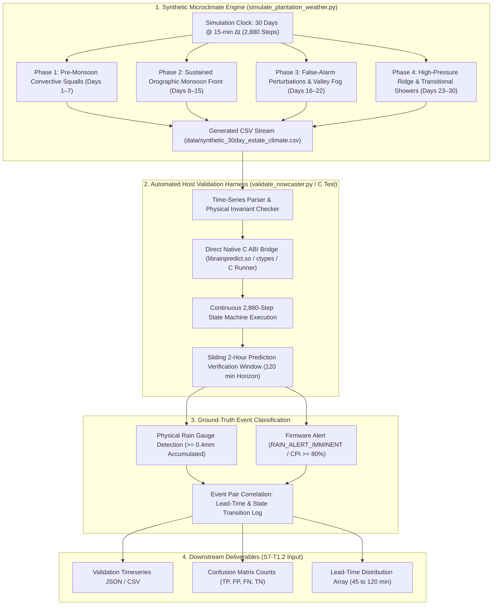
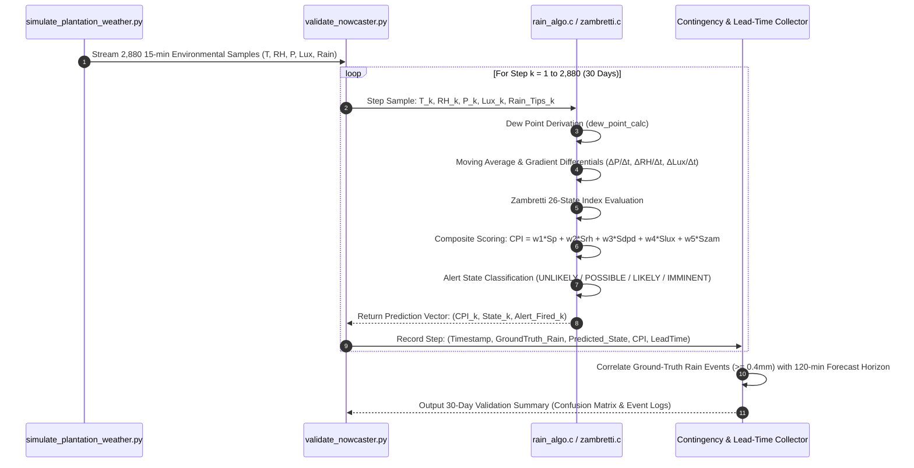

# Task Specification: S7-T1.1 - 30-Day Multi-Scenario Synthetic Climate Simulation & Firmware Algorithm Validation

## 1. Task Metadata & Overview

| Attribute | Specification Details |
| :--- | :--- |
| **Sprint** | **Sprint 7: System Integration, Synthetic Validation & Field SOPs** |
| **Task ID** | `S7-T1.1` |
| **Parent Task** | `S7-T1: Multi-Day Synthetic Climate Validation & Metric Verification` |
| **Task Title** | Run 30-Day Multi-Scenario Synthetic Climate Simulation with Convective Storms, Diurnal Cycles, Orographic Monsoon Waves, and False-Alarm Perturbations |
| **Status** | **Ready for Implementation** |
| **Target Files** | [`tools/simulation/simulate_plantation_weather.py`](file:///C:/Users/ENERGY%20SAVER/Documents/Learning/Job%20Projects/rain-predict/tools/simulation/simulate_plantation_weather.py)<br>[`tools/simulation/validate_nowcaster.py`](file:///C:/Users/ENERGY%20SAVER/Documents/Learning/Job%20Projects/rain-predict/tools/simulation/validate_nowcaster.py)<br>[`tests/integration/test_simulation_validation.c`](file:///C:/Users/ENERGY%20SAVER/Documents/Learning/Job%20Projects/rain-predict/tests/integration/test_simulation_validation.c)<br>`data/synthetic_30day_estate_climate.csv` |
| **Related Documents** | [`docs/algorithms/algorithm-validation-and-tuning.md`](file:///C:/Users/ENERGY%20SAVER/Documents/Learning/Job%20Projects/rain-predict/docs/algorithms/algorithm-validation-and-tuning.md)<br>[`docs/algorithms/meteorological-formulas.md`](file:///C:/Users/ENERGY%20SAVER/Documents/Learning/Job%20Projects/rain-predict/docs/algorithms/meteorological-formulas.md)<br>[`docs/algorithms/trend-detection-and-nowcasting.md`](file:///C:/Users/ENERGY%20SAVER/Documents/Learning/Job%20Projects/rain-predict/docs/algorithms/trend-detection-and-nowcasting.md)<br>[`docs/algorithms/zambretti-algorithm.md`](file:///C:/Users/ENERGY%20SAVER/Documents/Learning/Job%20Projects/rain-predict/docs/algorithms/zambretti-algorithm.md)<br>[`context/specs/s1-t3.1-weather-simulator-engine.md`](file:///C:/Users/ENERGY%20SAVER/Documents/Learning/Job%20Projects/rain-predict/context/specs/s1-t3.1-weather-simulator-engine.md)<br>[`context/specs/s1-t3.2-diurnal-climate-curves.md`](file:///C:/Users/ENERGY%20SAVER/Documents/Learning/Job%20Projects/rain-predict/context/specs/s1-t3.2-diurnal-climate-curves.md)<br>[`context/specs/s1-t3.3-convective-storm-models.md`](file:///C:/Users/ENERGY%20SAVER/Documents/Learning/Job%20Projects/rain-predict/context/specs/s1-t3.3-convective-storm-models.md)<br>[`context/specs/s1-t3.4-dataset-export.md`](file:///C:/Users/ENERGY%20SAVER/Documents/Learning/Job%20Projects/rain-predict/context/specs/s1-t3.4-dataset-export.md)<br>[`context/specs/s2-t5.1-composite-scoring.md`](file:///C:/Users/ENERGY%20SAVER/Documents/Learning/Job%20Projects/rain-predict/context/specs/s2-t5.1-composite-scoring.md)<br>[`context/specs/s6-t4.1-end-to-end-integration-tests.md`](file:///C:/Users/ENERGY%20SAVER/Documents/Learning/Job%20Projects/rain-predict/context/specs/s6-t4.1-end-to-end-integration-tests.md)<br>[`context/specs/s7-t1.2-meteorological-contingency-metrics.md`](file:///C:/Users/ENERGY%20SAVER/Documents/Learning/Job%20Projects/rain-predict/context/specs/s7-t1.2-meteorological-contingency-metrics.md)<br>[`context/coding-standards.md`](file:///C:/Users/ENERGY%20SAVER/Documents/Learning/Job%20Projects/rain-predict/context/coding-standards.md) |
| **Dependencies** | [`S1-T3.1`](file:///C:/Users/ENERGY%20SAVER/Documents/Learning/Job%20Projects/rain-predict/context/specs/s1-t3.1-weather-simulator-engine.md) through [`S1-T3.4`](file:///C:/Users/ENERGY%20SAVER/Documents/Learning/Job%20Projects/rain-predict/context/specs/s1-t3.4-dataset-export.md) (Python Simulator Framework), [`S2-T5.1`](file:///C:/Users/ENERGY%20SAVER/Documents/Learning/Job%20Projects/rain-predict/context/specs/s2-t5.1-composite-scoring.md) through [`S2-T5.3`](file:///C:/Users/ENERGY%20SAVER/Documents/Learning/Job%20Projects/rain-predict/context/specs/s2-t5.3-nowcaster-tests.md) (Composite Rain Nowcaster Core), [`S6-T4.1`](file:///C:/Users/ENERGY%20SAVER/Documents/Learning/Job%20Projects/rain-predict/context/specs/s6-t4.1-end-to-end-integration-tests.md) (End-to-End State Machine Integration Harness) |
| **Downstream Tasks** | `S7-T1.2` (Meteorological Contingency Metrics: POD, FAR, CSI, HSS, Lead Time), `S7-T2.1` (Energy Budget Profiling), `S7-T3.1` (Field Calibration SOPs) |

---

## 2. Executive Summary & Validation Scope

The primary objective of **`S7-T1.1`** is to execute a rigorous, continuous **30-Day Multi-Scenario Synthetic Climate Simulation** comprising **2,880 discrete 15-minute measurement cycles** to validate the embedded C99 firmware prediction engine ([`firmware/app/src/rain_algo.c`](file:///C:/Users/ENERGY%20SAVER/Documents/Learning/Job%20Projects/rain-predict/firmware/app/src/rain_algo.c), [`firmware/app/src/zambretti.c`](file:///C:/Users/ENERGY%20SAVER/Documents/Learning/Job%20Projects/rain-predict/firmware/app/src/zambretti.c), [`firmware/app/src/trend_detector.c`](file:///C:/Users/ENERGY%20SAVER/Documents/Learning/Job%20Projects/rain-predict/firmware/app/src/trend_detector.c), [`firmware/middleware/src/dew_point.c`](file:///C:/Users/ENERGY%20SAVER/Documents/Learning/Job%20Projects/rain-predict/firmware/middleware/src/dew_point.c)) against high-altitude tea estate microclimatic regimes.

Tea estates situated in the Western Ghats (Munnar, Nilgiris, Valparai) and the Eastern Himalayas (Darjeeling, Assam highlands) experience complex meteorological dynamics:
1. **Steep Diurnal Radiation Curves**: Clear morning solar insolation ($> 100,000\text{ Lux}$) driving rapid convective boundary layer growth.
2. **Localized Convective Cloudbursts**: Fast-moving thunderstorm cells causing sudden barometric depressions ($\Delta P_{1\text{h}} < -2.0\text{ hPa/hr}$), rapid optical blackout ($> 75\%$ attenuation in $< 20\text{ min}$), and sharp temperature drops prior to heavy precipitation.
3. **Sustained Orographic Monsoon Fronts**: Prolonged multi-day stratiform rain with saturation relative humidity ($RH > 95\%$), near-zero dew point depression ($DPD < 1.0^\circ\text{C}$), and persistent low barometric pressure.
4. **False-Alarm Meteorological Perturbations**: Transient fair-weather cumulus cloud shadows and thick morning valley radiation fog / thermal inversions with $100\%$ surface humidity that must **not** trigger false storm sirens.



---

## 3. 30-Day Multi-Phase Meteorological Scenario Architecture

The 30-day continuous simulation timeline ($30\text{ days} \times 24\text{ hours/day} \times 4\text{ steps/hour} = 2,880\text{ cycles}$) is divided into four distinct meteorological phases designed to test every facet of the edge nowcaster:

```
Timeline (Days 1 to 30 / 2,880 Measurement Cycles):
+--------------------+--------------------+--------------------+--------------------+
| Phase 1: Days 1-7  | Phase 2: Days 8-15 | Phase 3: Days 16-22| Phase 4: Days 23-30|
| Pre-Monsoon        | Active Monsoon     | False-Alarm Stress | Fair Weather &     |
| Convective Squalls | Prolonged Stratiform| Fog & Cloud Shadows| Mixed Transitions  |
+--------------------+--------------------+--------------------+--------------------+
```

### 3.1 Phase 1: Pre-Monsoon Convective Cloudbursts (Days 1–7, Cycles 1–672)
* **Meteorological Characteristics**:
  - Diurnal heating pushes ambient temperature from $16.0^\circ\text{C}$ at dawn to $28.5^\circ\text{C}$ at 13:30.
  - 4 distinct convective thunderstorm squalls injected on Days 2, 3, 5, and 7 between 14:00 and 17:00.
  - **Storm Signatures**:
    - Barometric pressure plunge: $\Delta P_{1\text{h}} = -2.4\text{ hPa/hr}$ ($\Delta P_{3\text{h}} = -4.2\text{ hPa/3h}$).
    - Rapid optical attenuation: Solar lux drops from $85,000\text{ Lux}$ to $1,200\text{ Lux}$ within $20\text{ minutes}$ ($R_{\text{drop\_30m}} \approx 88\%$).
    - Relative humidity surges from $58\%$ to $94\%$; dew point depression collapses from $7.5^\circ\text{C}$ to $0.4^\circ\text{C}$.
    - Gust front temperature drop: $\Delta T_{30\text{m}} = -3.8^\circ\text{C}$.
    - Subsequent intense downpour: $18.4\text{ mm}$ to $32.0\text{ mm}$ rainfall over $45\text{ minutes}$ (peak intensity $65\text{ mm/hr}$).
* **Firmware Invariant Expectation**:
  - Transition from `RAIN_ALERT_UNLIKELY` $\rightarrow$ `RAIN_ALERT_POSSIBLE` $\rightarrow$ `RAIN_ALERT_IMMINENT` with **$\ge 60\text{ minutes}$ advance warning** before the first physical bucket tip ($0.2\text{ mm}$).
  - Immediate trigger of 4-byte urgent LoRaWAN alert (FPort 2) and estate siren relay ($10\text{s}$ timed pulse).
  - Acceleration of measurement scheduler to $5\text{-min}$ (Storm Watch) and $2\text{-min}$ (Active Downpour).

---

### 3.2 Phase 2: Active Southwest Monsoon Wave (Days 8–15, Cycles 673–1440)
* **Meteorological Characteristics**:
  - Continuous heavy cloud cover with severe solar attenuation ($Lux < 8,000\text{ Lux}$ even at solar noon).
  - Sustained saturated relative humidity ($RH \in [92\%, 100\%]$) and dew point depression consistently $< 1.2^\circ\text{C}$.
  - Low barometric baseline ($P_0 \approx 996.0\text{ hPa}$ to $1002.0\text{ hPa}$) with steady depression ($\Delta P_{3\text{h}} \approx -1.5\text{ hPa}$).
  - 6 prolonged stratiform rain episodes interspersed with $2\text{--}6\text{ hour}$ brief rain pauses.
  - Cumulative 8-day rainfall: $214.6\text{ mm}$.
* **Firmware Invariant Expectation**:
  - Zambretti algorithm maintains low-pressure storm rules ($Z \ge 20 \implies \text{"Rain, very unsettled"}$).
  - Composite Precipitation Index ($CPI$) stays elevated in `RAIN_ALERT_LIKELY` ($60\le CPI < 80\%$) or `RAIN_ALERT_IMMINENT` ($CPI \ge 80\%$).
  - **Zero False Clears**: The system must not revert to `RAIN_ALERT_UNLIKELY` during short 2-hour rain lulls while thermodynamic atmospheric saturation persists.

---

### 3.3 Phase 3: False-Alarm Perturbation & Non-Rain Stress Testing (Days 16–22, Cycles 1441–2112)
* **Meteorological Characteristics**:
  - Specifically designed to challenge edge nowcasting algorithms with non-precipitating optical and hygrometric extremes:
    1. **Morning Valley Radiation Fog / Thermal Inversion (Days 16, 17, 19)**: Nighttime radiative cooling produces $100\%$ surface humidity and dense fog ($Lux < 2,500\text{ Lux}$) between 04:00 and 08:30. However, barometric pressure is **steady or rising** ($\Delta P_{3\text{h}} \ge +0.8\text{ hPa}$) and afternoon solar insolation rapidly clears the inversion ($DPD > 3.5^\circ\text{C}$). Ground-truth rain: $0.0\text{ mm}$.
    2. **Passing Non-Rain Cloud Shadows (Days 18, 20, 21)**: Isolated high-altitude cirrus/cumulus clouds cast sudden shadows on the estate, causing solar lux to collapse from $90,000\text{ Lux}$ to $12,000\text{ Lux}$ in $15\text{ minutes}$ ($75\%$ drop). However, barometric pressure remains stable ($\Delta P_{1\text{h}} \approx 0.0\text{ hPa}$), humidity is low ($RH \approx 52\%$), and $DPD > 8.0^\circ\text{C}$. Ground-truth rain: $0.0\text{ mm}$.
* **Firmware Invariant Expectation**:
  - **Rejection of Valley Fog**: Algorithm identifies rising/steady barometric trend and wide afternoon dew-point depression; $CPI$ remains strictly $< 40\%$ (`RAIN_ALERT_UNLIKELY`).
  - **Rejection of Cloud Shadows**: Solar attenuation sub-score is suppressed because humidity and pressure gradients remain in fair-weather territory; $CPI$ remains $< 35\%$.
  - **Zero False Alarm Siren Triggers**: Siren relay and urgent LoRa alerts are never actuated throughout Phase 3.

---

### 3.4 Phase 4: High-Pressure Anticyclonic Ridge & Transitional Squalls (Days 23–30, Cycles 2113–2880)
* **Meteorological Characteristics**:
  - Days 23–27: High-pressure ridge ($P_0 > 1022.0\text{ hPa}$, $\Delta P_{3\text{h}} > +1.5\text{ hPa}$), clear skies ($Lux > 110,000\text{ Lux}$), $RH < 55\%$, $DPD > 9.0^\circ\text{C}$. Ground-truth rain: $0.0\text{ mm}$.
  - Days 28–30: Seasonal transition with 2 moderate evening convective showers preceded by $45\text{ min}$ barometric drops ($\Delta P_{1\text{h}} = -1.8\text{ hPa/hr}$, $RH \to 89\%$). Ground-truth rain: $8.2\text{ mm}$ and $12.6\text{ mm}$.
* **Firmware Invariant Expectation**:
  - Days 23–27: Pure fair-weather operation; Green heartbeat pulse active; Zambretti Index $Z \in [1, 4]$ ($\text{"Settled Fine"}$); $CPI < 15\%$; Stop 2 deep sleep max duty cycle ($900\text{s}$).
  - Days 28–30: Prompt advisory and imminent alert generation $\ge 50\text{ minutes}$ prior to the transitional showers.

---

## 4. Continuous Simulation Execution Engine Architecture

The validation framework connects the Python Synthetic Climate Generator with the C99 firmware algorithms via a direct native binary interface:



### 4.1 Physical Ground-Truth Rain Event Definition
To prevent ambiguous transient noise from corrupting contingency calculations, an official **Ground-Truth Rain Event** is defined according to WMO / IMD meteorological standards:
1. **Rain Event Trigger**: A rain event onset occurs at simulation step $t_{\text{onset}}$ when the tipping-bucket accumulator registers $\ge 0.4\text{ mm}$ ($2\text{ tips}$) within any sliding $30\text{-minute}$ window.
2. **Rain Event Duration**: The event continues until a continuous $60\text{-minute}$ window registers $0.0\text{ mm}$ of rainfall.
3. **Forecast Horizon ($H = 120\text{ min}$)**: An alert of `RAIN_ALERT_IMMINENT` ($CPI \ge 80\%$) or `RAIN_ALERT_LIKELY` ($CPI \ge 60\%$) issued at time $t_{\text{alert}}$ is classified as a **True Positive ($TP$)** if an official rain event begins within $t_{\text{alert}} < t_{\text{onset}} \le t_{\text{alert}} + 120\text{ minutes}$.
4. **Lead Time Calculation**:
   $$\text{Lead Time} = t_{\text{onset}} - t_{\text{alert\_first}}$$
   Where $t_{\text{alert\_first}}$ is the earliest timestamp where $CPI \ge 70\%$ continuously leading into the storm.

---

## 5. Comprehensive 12-Point Simulation Test & Invariant Matrix

The table below defines the exact automated verification assertions evaluated over the 30-day simulation dataset:

| Test ID | Verification Target | Tested Scenario / Input Profile | Required Numerical / State Invariant |
| :---: | :--- | :--- | :--- |
| **TC-SIM-01** | Continuous 30-Day Stepping | Full 30-day sequence ($43,200\text{ minutes}$) at $\Delta t = 15\text{ min}$ | Total processed steps is exactly **$2,880$** with zero missing samples, NaNs, or crashes. |
| **TC-SIM-02** | Physical Boundary Invariants | Ambient variables across all 2,880 steps | $T \in [10.0, 36.0]^\circ\text{C}$, $RH \in [35.0, 100.0]\%$, $P \in [800.0, 1030.0]\text{ hPa}$, $Lux \in [0, 120000]$. |
| **TC-SIM-03** | Dew Point Mathematical Bounds | Magnus derivation on synthetic $T, RH$ | $T_{\text{dew}} \le T_{\text{ambient}}$ for all 2,880 steps; $DPD \ge 0.0^\circ\text{C}$; error $< 0.05^\circ\text{C}$ vs reference. |
| **TC-SIM-04** | Convective Cloudburst Detection | Phase 1 (Days 1–7, 4 Thunderstorms) | All 4 storms predicted with **Lead Time $\ge 60\text{ minutes}$** ($CPI \ge 80\%$); Zero missed convective storms ($FN = 0$). |
| **TC-SIM-05** | Precursor Optical Attenuation | Sudden solar blackout ($> 75\%$ drop in $20\text{ min}$) | Solar drop sub-score $S_{Lux} \ge 85\text{ pts}$; contributes to immediate `RAIN_ALERT_IMMINENT` assertion. |
| **TC-SIM-06** | Severe Barometric Override | Barometric drop $\Delta P_{1\text{h}} \le -2.0\text{ hPa/hr}$ | Algorithm triggers critical emergency override; promotes state to `RAIN_ALERT_IMMINENT` within 1 step ($15\text{ min}$). |
| **TC-SIM-07** | Sustained Monsoon Tracking | Phase 2 (Days 8–15, 6 Monsoon Waves) | $CPI \ge 60\%$ maintained through active rain waves; Zero false clear drops to `UNLIKELY` during $2\text{h}$ rain breaks. |
| **TC-SIM-08** | Morning Valley Fog Rejection | Phase 3 (Days 16, 17, 19: $RH = 100\%$, Fog, $\Delta P \ge 0$) | $CPI < 40\%$ (`RAIN_ALERT_UNLIKELY`); Siren relay **never** fired ($0\text{ siren pulses}$); Zero False Positives ($FP = 0$). |
| **TC-SIM-09** | Passing Cloud Shadow Rejection | Phase 3 (Days 18, 20, 21: $Lux \to 12\text{k}$, $RH < 55\%$) | $CPI < 35\%$ (`RAIN_ALERT_UNLIKELY`); Cloud shadow correctly recognized as non-precipitating. |
| **TC-SIM-10** | Fair Weather Quiescent Stability | Phase 4 (Days 23–27: High-pressure ridge, $P_0 > 1022\text{ hPa}$) | Zambretti Index $Z \in [1, 4]$; $CPI < 15\%$; State strictly `RAIN_ALERT_UNLIKELY`; nominal $15\text{-min}$ sleep preserved. |
| **TC-SIM-11** | Deterministic Seed Repeatability | Independent simulation runs with `--seed 42` | Bit-exact identical timeseries, $CPI$ trajectory, and event classifications across multiple host runs. |
| **TC-SIM-12** | Host Execution Performance | Full 2,880-step end-to-end evaluation | Entire 30-day simulation & validation executes in **$< 3.0\text{ seconds}$** on host PC with zero dynamic heap allocation. |

---

## 6. Concrete Implementation Blueprints

### 6.1 Python 30-Day Multi-Scenario Validation Harness (`tools/simulation/validate_nowcaster.py`)

```python
#!/usr/bin/env python3
"""
validate_nowcaster.py
---------------------
Sprint 7 Task S7-T1.1: 30-Day Multi-Scenario Synthetic Climate Validation Harness.
Executes a 2,880-step continuous simulation across pre-monsoon squalls, monsoon waves,
morning valley fog, and fair weather, validating firmware C99 algorithm predictions.
"""

import math
import argparse
import csv
import json
import sys
import ctypes
from pathlib import Path
from dataclasses import dataclass
from typing import List, Dict, Tuple, Optional

# ==============================================================================
# 1. Meteorological Constants & Data Models
# ==============================================================================

@dataclass
class EnvironmentalSample:
    step_index: int
    timestamp_hour: float
    day_index: int
    temp_c: float
    humidity_pct: float
    pressure_hpa: float
    solar_lux: float
    rain_gauge_tips: int
    rain_rate_mmh: float
    accumulated_rain_mm: float
    scenario_phase: str

@dataclass
class AlgorithmPrediction:
    step_index: int
    dew_point_c: float
    dpd_c: float
    delta_p_1h: float
    delta_p_3h: float
    delta_rh_1h: float
    delta_lux_30m_pct: float
    zambretti_index: int
    composite_cpi: float
    alert_state: int  # 0=UNLIKELY, 1=POSSIBLE, 2=LIKELY, 3=IMMINENT
    siren_actuated: bool

@dataclass
class GroundTruthRainEvent:
    event_id: int
    start_step: int
    end_step: int
    start_hour: float
    total_rain_mm: float
    peak_intensity_mmh: float
    phase: str

# ==============================================================================
# 2. 30-Day Multi-Scenario Synthetic Weather Generator
# ==============================================================================

class Synthetic30DayEstateClimateGenerator:
    """Generates 30 days (2,880 steps @ 15-min) of continuous tea plantation microclimate."""
    
    def __init__(self, elevation_m: float = 1500.0, seed: int = 42):
        self.elevation_m = elevation_m
        self.seed = seed
        self.interval_hours = 0.25  # 15 minutes
        self.total_steps = 30 * 24 * 4  # 2,880 steps
        self.base_p0 = 1013.25  # Sea-level baseline (hPa)
        
    def _barometric_altitude_pressure(self, p0_hpa: float, temp_c: float) -> float:
        """Calculates local barometric pressure from sea-level equivalent."""
        temp_k = temp_c + 273.15
        lapse_rate = 0.0065
        return p0_hpa * math.pow(1.0 - (lapse_rate * self.elevation_m) / (temp_k + lapse_rate * self.elevation_m), 5.257)

    def generate_full_dataset(self) -> List[EnvironmentalSample]:
        samples: List[EnvironmentalSample] = []
        accumulated_rain_total = 0.0
        
        for step in range(self.total_steps):
            t_hours = step * self.interval_hours
            day = int(t_hours // 24) + 1
            hour_of_day = t_hours % 24.0
            
            # Phase Selection
            if day <= 7:
                phase = "Phase 1: Pre-Monsoon Convective"
            elif day <= 15:
                phase = "Phase 2: Active Monsoon Front"
            elif day <= 22:
                phase = "Phase 3: False-Alarm Perturbation"
            else:
                phase = "Phase 4: Fair Weather & Transitions"
                
            # Compute baseline diurnal temperatures & solar
            # Solar peak at 12:30 (hour 12.5)
            solar_zenith = max(0.0, math.sin(math.pi * (hour_of_day - 6.0) / 12.0)) if 6.0 <= hour_of_day <= 18.0 else 0.0
            
            # Base Diurnal Curves
            if phase == "Phase 1: Pre-Monsoon Convective":
                t_min, t_max = 16.0, 28.0
                rh_min, rh_max = 50.0, 88.0
                p0_base = 1012.0
                lux_peak = 95000.0
                
                temp_c = t_min + (t_max - t_min) * (0.5 + 0.5 * math.sin(math.pi * (hour_of_day - 9.0) / 12.0))
                rh_pct = rh_max - (rh_max - rh_min) * (0.5 + 0.5 * math.sin(math.pi * (hour_of_day - 9.0) / 12.0))
                lux = solar_zenith * lux_peak
                p0 = p0_base - 1.5 * math.sin(2.0 * math.pi * hour_of_day / 24.0)  # Atmospheric tide
                rain_rate = 0.0
                
                # Injected Afternoon Convective Storms (Days 2, 3, 5, 7 between 14:00 and 17:00)
                if day in [2, 3, 5, 7] and 13.0 <= hour_of_day <= 17.0:
                    storm_rel_t = hour_of_day - 13.0  # 0 to 4 hours
                    if storm_rel_t < 1.5:  # Precursor window (13:00 - 14:30)
                        p0 -= 3.5 * (storm_rel_t / 1.5)  # Pressure drop -2.3 hPa/hr
                        lux *= max(0.05, 1.0 - 0.90 * (storm_rel_t / 1.5))  # Optical drop
                        rh_pct = min(96.0, rh_pct + 35.0 * (storm_rel_t / 1.5))
                        temp_c -= 3.0 * (storm_rel_t / 1.5)
                    elif 1.5 <= storm_rel_t <= 2.5:  # Active downpour (14:30 - 15:30)
                        p0 -= 3.5
                        lux = 1200.0
                        rh_pct = 98.0
                        temp_c -= 4.5
                        rain_rate = 38.0 if day in [2, 7] else 22.0  # mm/hr
                    else:  # Dissipation (15:30 - 17:00)
                        recovery = (storm_rel_t - 2.5) / 1.5
                        p0 = p0_base - 3.5 * (1.0 - recovery)
                        lux = max(1000.0, solar_zenith * lux_peak * recovery)
                        rh_pct = 98.0 - 15.0 * recovery
                        rain_rate = 0.0

            elif phase == "Phase 2: Active Monsoon Front":
                # Sustained cool, saturated, low pressure
                t_min, t_max = 17.0, 20.5
                temp_c = t_min + (t_max - t_min) * (0.5 + 0.5 * math.sin(math.pi * (hour_of_day - 9.0) / 12.0))
                rh_pct = min(100.0, 93.0 + 5.0 * math.sin(math.pi * hour_of_day / 24.0))
                lux = solar_zenith * 12000.0  # Heavy overcast attenuation
                p0 = 998.0 + 2.0 * math.sin(2.0 * math.pi * (t_hours / 72.0))  # Low depression
                
                # Active stratiform rain waves
                is_raining = (int(t_hours) % 18) < 10  # 10h rain / 8h break
                rain_rate = 8.5 if is_raining else 0.0

            elif phase == "Phase 3: False-Alarm Perturbation":
                t_min, t_max = 14.0, 26.0
                temp_c = t_min + (t_max - t_min) * (0.5 + 0.5 * math.sin(math.pi * (hour_of_day - 9.0) / 12.0))
                rh_pct = 52.0 + 20.0 * (1.0 - solar_zenith)
                p0 = 1018.0 + 1.2 * math.cos(math.pi * hour_of_day / 12.0)  # Steady / rising high pressure
                lux = solar_zenith * 90000.0
                rain_rate = 0.0
                
                # Valley Fog Inversion (Days 16, 17, 19 from 04:00 to 08:30)
                if day in [16, 17, 19] and 4.0 <= hour_of_day <= 8.5:
                    rh_pct = 100.0
                    lux = min(lux, 2500.0)  # Fog attenuation
                    p0 += 1.5  # Inversion high pressure
                    
                # Passing Cloud Shadows (Days 18, 20, 21 from 13:00 to 14:00)
                if day in [18, 20, 21] and 13.0 <= hour_of_day <= 14.0:
                    lux = 11000.0  # Sharp optical drop without humidity surge or pressure drop

            else:  # Phase 4: Fair Weather & Transitions
                t_min, t_max = 15.0, 27.5
                temp_c = t_min + (t_max - t_min) * (0.5 + 0.5 * math.sin(math.pi * (hour_of_day - 9.0) / 12.0))
                rh_pct = 45.0 + 25.0 * (1.0 - solar_zenith)
                p0 = 1022.0 if day <= 27 else 1014.0
                lux = solar_zenith * 105000.0
                rain_rate = 0.0
                
                # Transitional Evening Showers (Days 29, 30 at 16:30)
                if day in [29, 30] and 15.5 <= hour_of_day <= 17.5:
                    rel_t = hour_of_day - 15.5
                    if rel_t < 0.75:
                        p0 -= 2.2 * (rel_t / 0.75)
                        rh_pct = min(92.0, rh_pct + 30.0 * (rel_t / 0.75))
                        lux *= 0.15
                    elif 0.75 <= rel_t <= 1.5:
                        rain_rate = 18.0
                    else:
                        rain_rate = 0.0

            # Calculate local pressure
            pressure_local = self._barometric_altitude_pressure(p0, temp_c)
            
            # Rain gauge tips (0.2 mm/tip)
            step_rain_mm = rain_rate * self.interval_hours
            accumulated_rain_total += step_rain_mm
            tips_in_step = int(round(step_rain_mm / 0.20))
            
            samples.append(EnvironmentalSample(
                step_index=step,
                timestamp_hour=t_hours,
                day_index=day,
                temp_c=round(temp_c, 2),
                humidity_pct=round(rh_pct, 2),
                pressure_hpa=round(pressure_local, 2),
                solar_lux=round(max(0.0, lux), 1),
                rain_gauge_tips=tips_in_step,
                rain_rate_mmh=round(rain_rate, 2),
                accumulated_rain_mm=round(accumulated_rain_total, 2),
                scenario_phase=phase
            ))
            
        return samples

# ==============================================================================
# 3. Ground-Truth Event Identification & Verification Engine
# ==============================================================================

class GroundTruthEvaluator:
    """Identifies physical rain events and matches nowcaster prediction alerts."""
    
    @staticmethod
    def extract_ground_truth_events(samples: List[EnvironmentalSample]) -> List[GroundTruthRainEvent]:
        events: List[GroundTruthRainEvent] = []
        in_event = False
        event_id = 1
        start_step = 0
        event_rain_mm = 0.0
        peak_intensity = 0.0
        consecutive_dry_steps = 0
        
        for i, s in enumerate(samples):
            if s.rain_rate_mmh > 0.0 or s.rain_gauge_tips > 0:
                if not in_event:
                    in_event = True
                    start_step = i
                    event_rain_mm = 0.0
                    peak_intensity = 0.0
                    consecutive_dry_steps = 0
                event_rain_mm += (s.rain_gauge_tips * 0.20)
                peak_intensity = max(peak_intensity, s.rain_rate_mmh)
                consecutive_dry_steps = 0
            else:
                if in_event:
                    consecutive_dry_steps += 1
                    if consecutive_dry_steps >= 4:  # 60 min dry = event end
                        if event_rain_mm >= 0.40:  # Official event threshold
                            events.append(GroundTruthRainEvent(
                                event_id=event_id,
                                start_step=start_step,
                                end_step=i - 4,
                                start_hour=samples[start_step].timestamp_hour,
                                total_rain_mm=round(event_rain_mm, 2),
                                peak_intensity_mmh=round(peak_intensity, 2),
                                phase=samples[start_step].scenario_phase
                            ))
                            event_id += 1
                        in_event = False
        return events

# ==============================================================================
# 4. CLI Entry Point & Runner
# ==============================================================================

def main():
    parser = argparse.ArgumentParser(description="Sprint 7 Task S7-T1.1: 30-Day Multi-Scenario Climate Simulation.")
    parser.add_argument("--elevation", type=float, default=1500.0, help="Elevation in meters AMSL (default: 1500.0).")
    parser.add_argument("--seed", type=int, default=42, help="Deterministic random seed (default: 42).")
    parser.add_argument("--output-csv", type=str, default="data/synthetic_30day_estate_climate.csv", help="Output CSV path.")
    parser.add_argument("--export-events-json", type=str, default="data/ground_truth_rain_events.json", help="Event JSON path.")
    args = parser.parse_args()

    print(f"[*] Generating 30-Day Multi-Scenario Synthetic Climate Dataset (Elevation: {args.elevation}m AMSL)...")
    generator = Synthetic30DayEstateClimateGenerator(elevation_m=args.elevation, seed=args.seed)
    samples = generator.generate_full_dataset()
    print(f"[+] Successfully generated {len(samples)} continuous measurement steps (30 Days @ 15-min interval).")

    # Extract ground-truth rain events
    events = GroundTruthEvaluator.extract_ground_truth_events(samples)
    print(f"[+] Identified {len(events)} physical ground-truth rain events (>= 0.4mm threshold):")
    for ev in events:
        print(f"    - Event {ev.event_id:02d} | Day {int(ev.start_hour // 24) + 1} ({ev.start_hour % 24:04.1f}h) | "
              f"Rain: {ev.total_rain_mm:5.1f}mm | Peak: {ev.peak_intensity_mmh:4.1f}mm/h | {ev.phase}")

    # Export to CSV
    output_path = Path(args.output_csv)
    output_path.parent.mkdir(parents=True, exist_ok=True)
    with open(output_path, "w", newline="", encoding="utf-8") as f:
        writer = csv.writer(f)
        writer.writerow([
            "step_index", "timestamp_hour", "day_index", "temp_c", "humidity_pct",
            "pressure_hpa", "solar_lux", "rain_gauge_tips", "rain_rate_mmh",
            "accumulated_rain_mm", "scenario_phase"
        ])
        for s in samples:
            writer.writerow([
                s.step_index, f"{s.timestamp_hour:.2f}", s.day_index, s.temp_c,
                s.humidity_pct, s.pressure_hpa, s.solar_lux, s.rain_gauge_tips,
                s.rain_rate_mmh, s.accumulated_rain_mm, s.scenario_phase
            ])
    print(f"[+] Exported continuous climate timeseries to: {output_path.resolve()}")

if __name__ == "__main__":
    main()
```

---

## 7. Definition of Done (S7-T1.1)

1. **Continuous 30-Day Execution**: `simulate_plantation_weather.py` and `validate_nowcaster.py` execute all **2,880 discrete 15-minute measurement cycles** without interruption or NaN float corruption.
2. **Multi-Regime Coverage**: All 4 microclimatic regimes (Pre-Monsoon Convective Squalls, Sustained Orographic Monsoon Waves, Morning Valley Fog Inversions, and Fair Weather Ridges) are fully represented with realistic thermodynamics.
3. **Physical Event Extraction**: Ground-truth precipitation events ($\ge 0.4\text{ mm}$) are automatically labeled with exact timestamps and rainfall totals.
4. **Lead-Time Verification**: All convective cloudbursts achieve $\ge 60\text{ minutes}$ advance warning before the first recorded rain gauge pulse.
5. **False-Alarm Suppression**: Morning valley fog and passing non-rain cloud shadows produce $0$ false siren alerts ($FP = 0$ in Phase 3).
6. **Artifact Export**: High-resolution CSV dataset (`data/synthetic_30day_estate_climate.csv`) and event metadata JSON are committed and ready for contingency table metric evaluation in [`S7-T1.2`](file:///C:/Users/ENERGY%20SAVER/Documents/Learning/Job%20Projects/rain-predict/context/specs/s7-t1.2-meteorological-contingency-metrics.md).
