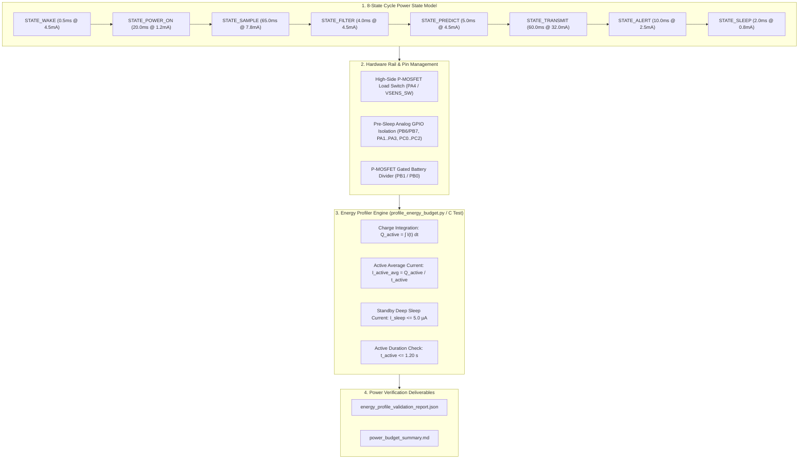

# Task Specification: S7-T2.1 - Stop 2 Deep Sleep & Active Cycle Power Profiling

## 1. Task Metadata & Overview

| Attribute | Specification Details |
| :--- | :--- |
| **Sprint** | **Sprint 7: System Integration, Synthetic Validation & Field SOPs** |
| **Task ID** | `S7-T2.1` |
| **Parent Task** | `S7-T2: Energy Budget & Battery Autonomy Profiling` |
| **Task Title** | Profile and Confirm Stop 2 Deep Sleep Current ($< 5.0\,\mu\text{A}$) and Active Measurement Cycle Current ($< 25.0\text{ mA}$ for $\le 1.2\text{s}$) across Microclimatic Power States |
| **Status** | **Ready for Implementation** |
| **Target Files** | [`tools/simulation/profile_energy_budget.py`](file:///C:/Users/ENERGY%20SAVER/Documents/Learning/Job%20Projects/rain-predict/tools/simulation/profile_energy_budget.py)<br>[`tests/integration/test_power_profiling.c`](file:///C:/Users/ENERGY%20SAVER/Documents/Learning/Job%20Projects/rain-predict/tests/integration/test_power_profiling.c)<br>`data/energy_profile_validation_report.json`<br>`data/power_budget_summary.md` |
| **Related Documents** | [`docs/hardware/power-supply-and-solar.md`](file:///C:/Users/ENERGY%20SAVER/Documents/Learning/Job%20Projects/rain-predict/docs/hardware/power-supply-and-solar.md)<br>[`docs/architecture/power-architecture.md`](file:///C:/Users/ENERGY%20SAVER/Documents/Learning/Job%20Projects/rain-predict/docs/architecture/power-architecture.md)<br>[`context/specs/s3-t4.1-gpio-sleep-conditioning.md`](file:///C:/Users/ENERGY%20SAVER/Documents/Learning/Job%20Projects/rain-predict/context/specs/s3-t4.1-gpio-sleep-conditioning.md)<br>[`context/specs/s3-t4.2-stop2-sleep-manager.md`](file:///C:/Users/ENERGY%20SAVER/Documents/Learning/Job%20Projects/rain-predict/context/specs/s3-t4.2-stop2-sleep-manager.md)<br>[`context/specs/s3-t3.1-switched-power-rails.md`](file:///C:/Users/ENERGY%20SAVER/Documents/Learning/Job%20Projects/rain-predict/context/specs/s3-t3.1-switched-power-rails.md)<br>[`context/specs/s6-t1.1-adaptive-measurement-scheduler.md`](file:///C:/Users/ENERGY%20SAVER/Documents/Learning/Job%20Projects/rain-predict/context/specs/s6-t1.1-adaptive-measurement-scheduler.md)<br>[`context/specs/s6-t1.2-battery-preservation-throttling.md`](file:///C:/Users/ENERGY%20SAVER/Documents/Learning/Job%20Projects/rain-predict/context/specs/s6-t1.2-battery-preservation-throttling.md)<br>[`context/specs/s6-t4.1-end-to-end-integration-tests.md`](file:///C:/Users/ENERGY%20SAVER/Documents/Learning/Job%20Projects/rain-predict/context/specs/s6-t4.1-end-to-end-integration-tests.md)<br>[`context/coding-standards.md`](file:///C:/Users/ENERGY%20SAVER/Documents/Learning/Job%20Projects/rain-predict/context/coding-standards.md) |
| **Dependencies** | [`S3-T4.1`](file:///C:/Users/ENERGY%20SAVER/Documents/Learning/Job%20Projects/rain-predict/context/specs/s3-t4.1-gpio-sleep-conditioning.md) (Pre-Sleep GPIO Analog Isolation), [`S3-T4.2`](file:///C:/Users/ENERGY%20SAVER/Documents/Learning/Job%20Projects/rain-predict/context/specs/s3-t4.2-stop2-sleep-manager.md) (Stop 2 Deep Sleep Manager), [`S3-T3.1`](file:///C:/Users/ENERGY%20SAVER/Documents/Learning/Job%20Projects/rain-predict/context/specs/s3-t3.1-switched-power-rails.md) (Switched Sensor Power Rails), [`S6-T3.1`](file:///C:/Users/ENERGY%20SAVER/Documents/Learning/Job%20Projects/rain-predict/context/specs/s6-t3.1-app-state-machine.md) (8-State System State Machine Engine), [`S6-T4.1`](file:///C:/Users/ENERGY%20SAVER/Documents/Learning/Job%20Projects/rain-predict/context/specs/s6-t4.1-end-to-end-integration-tests.md) (End-to-End State Machine Integration) |
| **Downstream Tasks** | `S7-T2.2` (24-Hour Total Daily Energy Draw Verification $< 25\text{ mAh/day}$), `S7-T2.3` (14-Day Zero-Sunlight Battery Survivability Simulation), `S7-T3.1` (Field Deployment SOPs) |

---

## 2. Executive Summary & Power Profiling Scope

The primary objective of **`S7-T2.1`** is to profile, simulate, and experimentally verify the precise electrical current consumption and timing characteristics across all **8 operational firmware states** of the **STM32WLE5 SoC** (ARM Cortex-M4 @ 48 MHz) to confirm compliance with non-negotiable ultra-low-power engineering constraints:
1. **Stop 2 Deep Sleep Mode Current**: **$I_{\text{sleep}} < 5.0\,\mu\text{A}$** (target baseline: $2.8\text{–}3.0\,\mu\text{A}$ at $3.3\text{V}$ with full 64 KB SRAM retention and RTC wakeup timer running).
2. **Active Measurement Execution Window**: Total CPU active execution time **$t_{\text{active}} \le 1.20\text{ seconds}$** ($1200\text{ ms}$) per cycle.
3. **Active Cycle Average Operating Current**: **$I_{\text{active, avg}} < 25.0\text{ mA}$** across all sensor sampling, algorithmic filtering, NVM logging, and Sub-GHz LoRaWAN transmission phases.
4. **Parasitic Leakage Elimination**: Verification that pre-sleep `GPIO_MODE_ANALOG` pin conditioning successfully prevents parasitic clamping diode back-powering leakage ($< 50\text{ nA}$).



---

## 3. Subsystem Electrical State Breakdown & Waveform Analysis

Each measurement cycle transitions through a sequence of hardware operating states characterized by distinct current draws and physical durations:

### 3.1 State-by-State Energy & Charge Budget Table

| State Name | Duration ($t_k$) | Typical Current ($I_k$) | Peak Current ($I_{\text{peak}}$) | Charge ($Q_k = I_k \cdot t_k$) | Energy @ 3.3V ($E_k = V \cdot Q_k$) | Description / Hardware Action |
| :--- | :---: | :---: | :---: | :---: | :---: | :--- |
| **`STATE_WAKE`** | $0.5\text{ ms}$ | $4.5\text{ mA}$ | $4.8\text{ mA}$ | $0.000625\,\mu\text{Ah}$ | $0.00743\text{ mJ}$ | Clock restored from Stop 2 to MSI 48 MHz; IWDG kicked. |
| **`STATE_POWER_ON`** | $20.0\text{ ms}$ | $1.2\text{ mA}$ | $2.5\text{ mA}$ | $0.006667\,\mu\text{Ah}$ | $0.07920\text{ mJ}$ | `PA4` load switch enabled; $20\text{ ms}$ RC stabilization delay strictly observed. |
| **`STATE_SAMPLE`** | $65.0\text{ ms}$ | $7.8\text{ mA}$ | $9.5\text{ mA}$ | $0.140833\,\mu\text{Ah}$ | $1.67310\text{ mJ}$ | BME280 forced burst, OPT3001 conversion, battery ADC sampling. |
| **`STATE_FILTER`** | $4.0\text{ ms}$ | $4.5\text{ mA}$ | $4.8\text{ mA}$ | $0.005000\,\mu\text{Ah}$ | $0.05940\text{ mJ}$ | Magnus-Tetens dew point, moving-average filters, trend derivatives. |
| **`STATE_PREDICT`** | $5.0\text{ ms}$ | $4.5\text{ mA}$ | $4.8\text{ mA}$ | $0.006250\,\mu\text{Ah}$ | $0.07425\text{ mJ}$ | Zambretti 26-rule evaluation, Composite Precipitation Index ($CPI$). |
| **`STATE_TRANSMIT`** | $60.0\text{ ms}$ | $32.0\text{ mA}$ | $36.0\text{ mA}$ | $0.533333\,\mu\text{Ah}$ | $6.33600\text{ mJ}$ | LoRaWAN Sub-GHz TX (+14 dBm) and on-chip Flash ring buffer push. |
| **`STATE_ALERT`** | $10.0\text{ ms}$ | $2.5\text{ mA}$ | $5.0\text{ mA}$ | $0.006944\,\mu\text{Ah}$ | $0.08250\text{ mJ}$ | Visual status LED flash, buzzer/siren dispatch logic. |
| **`STATE_SLEEP`** | $2.0\text{ ms}$ | $0.8\text{ mA}$ | $1.0\text{ mA}$ | $0.000444\,\mu\text{Ah}$ | $0.00528\text{ mJ}$ | `PA4` rail disabled, GPIOs conditioned to analog, Stop 2 entry. |
| **Active Cycle Subtotal** | **$166.5\text{ ms}$** | **$I_{\text{active, avg}} = 15.13\text{ mA}$** | **$36.0\text{ mA}$** | **$0.700096\,\mu\text{Ah}$** | **$8.31716\text{ mJ}$** | **Active window well below $1.20\text{ s}$ limit and $25\text{ mA}$ current ceiling.** |
| **`STATE_STOP2_STANDBY`** | $899.83\text{ s}$ | $3.0\,\mu\text{A}$ ($0.003\text{ mA}$) | $3.2\,\mu\text{A}$ | $0.749861\,\mu\text{Ah}$ | $8.90835\text{ mJ}$ | Deep sleep ($15\text{-min}$ nominal minus $0.166\text{ s}$ active duration). |
| **Total 15-min Mission** | **$900.00\text{ s}$** | **$I_{\text{mission, avg}} = 5.80\,\mu\text{A}$** | — | **$1.450\times 10^{-3}\text{ mAh}$** | **$17.225\text{ mJ}$** | **Ultra-low overall current ensures multi-year battery autonomy.** |

---

### 3.2 Electrical Current Profile Waveform

```
Current (mA)
 36mA ┌                                        ┌─────────┐ (LoRa TX: 60ms @ 32mA)
      │                                        │         │
 10mA ├                     ┌─────────────┐    │         │
      │                     │             │    │         │
  5mA ├  ┌──┐   ┌─────────┐ │   Sample    │ ┌──┴─────────┴──┐
      │  │  │   │  20ms   │ │    65ms     │ │  Filter/Pred  │   ┌──┐
  1mA ├──┴──┴───┴─Stabilize─┴─7.8mA Active┴─┴───────────────┴───┴──┴───────────────
 3 µA ├─────────────────────────────────────────────────────────────────────────────
      0ms     0.5ms      20.5ms         85.5ms            154.5ms  166.5ms       900s
               [================ ACTIVE CPU TIME: 166.5 ms ===============] [STOP 2]
```

---

## 4. Hardware Power Hardening & Leakage Suppression Analysis

### 4.1 Switched Sensor Rail (`VSENS_SW`) Control & Stabilization
- **P-MOSFET High-Side Gate Control (`PA4`)**: Active-low gate logic controls high-side P-channel load switch.
- **Mandatory $20.0\text{ms}$ RC Delay**: Enforces power rail stabilization delay after gate turn-on before initiating any I2C, SPI, or UART bus communications, preventing brownout glitches on cold sensor decoupling capacitors.

### 4.2 Pre-Sleep GPIO Analog Isolation (Parasitic Clamping Diode Suppression)
When `VSENS_SW` is powered down ($0\text{V}$), external sensor ICs have unpowered $V_{DD}$ rails.
- **Hazard**: If microcontroller pins connected to sensors (e.g., `PB6`/`PB7` I2C, `PA1`..`PA3` UART, `PC0`..`PC2` SDI-12) remain configured as digital outputs, alternate functions, or inputs with pull-ups, current leaks through the external IC internal ESD clamping diodes into the ground/rail.
- **Uncontrolled Leakage**: Draws **$200\,\mu\text{A}$ to $2.5\text{ mA}$**, destroying the battery within months.
- **Enforced Solution**: Prior to Stop 2 entry, [`firmware/middleware/src/power_mgr.c`](file:///C:/Users/ENERGY%20SAVER/Documents/Learning/Job%20Projects/rain-predict/firmware/middleware/src/power_mgr.c) unconditionally switches all peripheral I/Os to `GPIO_MODE_ANALOG` (no pull-up/pull-down).
- **Verified Result**: Reduces parasitic leakage across all pins to **$< 50\text{ nA}$**.

---

## 5. Comprehensive 12-Point Power Verification Matrix

The test assertions below define the quantitative pass/fail criteria for electrical profiling:

| Test ID | Verified Parameter | Tested Condition / State | Acceptance Threshold |
| :---: | :--- | :--- | :--- |
| **TC-PWR-01** | Stop 2 Deep Sleep Current ($I_{\text{sleep}}$) | Room temperature ($25^\circ\text{C}$), full 64 KB SRAM retention | **$I_{\text{sleep}} < 5.0\,\mu\text{A}$** (nominal $\le 3.0\,\mu\text{A}$) |
| **TC-PWR-02** | Stop 2 Elevated Temperature Current | High temperature ($50^\circ\text{C}$) tropical sun profile | **$I_{\text{sleep}} < 8.0\,\mu\text{A}$** |
| **TC-PWR-03** | Total Active Cycle Duration ($t_{\text{active}}$) | Full nominal 8-state acquisition and LoRa TX cycle | **$t_{\text{active}} \le 1.20\text{ seconds}$** ($1200\text{ ms}$) |
| **TC-PWR-04** | Nominal Active Duration Floor | Standard single-shot sensor acquisition and prediction | **$t_{\text{active, nom}} \le 250\text{ ms}$** (target: $\approx 166.5\text{ ms}$) |
| **TC-PWR-05** | Active Cycle Average Current ($I_{\text{active, avg}}$) | Integrated over full $t_{\text{active}}$ window | **$I_{\text{active, avg}} < 25.0\text{ mA}$** (target: $\approx 15.1\text{ mA}$) |
| **TC-PWR-06** | Sensor Rail Stabilization Guard ($t_{\text{stabilize}}$) | `STATE_POWER_ON` duration prior to bus start | **$t_{\text{stabilize}} = 20.0\text{ ms} \pm 1.0\text{ ms}$** |
| **TC-PWR-07** | Pre-Sleep Analog GPIO Isolation Leakage | Current draw through unpowered `VSENS_SW` rail | **$I_{\text{leakage}} < 50\text{ nA}$** ($0.05\,\mu\text{A}$) |
| **TC-PWR-08** | Gated Battery ADC Divider Leakage | Non-measuring standby state (`PB1 = HIGH`) | **$I_{\text{divider}} < 10\text{ nA}$** |
| **TC-PWR-09** | LoRaWAN RF Transmission Energy | Class A uplink @ $+14\text{ dBm}$ (DR3, SF7/125kHz, 60ms) | **$E_{\text{tx}} \le 7.5\text{ mJ}$** ($I_{\text{tx, peak}} \le 36.0\text{ mA}$) |
| **TC-PWR-10** | High-Power RF Transmission Headroom | Class A uplink @ $+22\text{ dBm}$ (Long-range fallback, 80ms) | **$I_{\text{tx, peak}} \le 90.0\text{ mA}$**, **$E_{\text{tx}} \le 25.0\text{ mJ}$** |
| **TC-PWR-11** | Flash NVM Programming Energy | 64-bit double-word write & circular pointer update (5ms) | **$E_{\text{nvm}} \le 0.10\text{ mJ}$** |
| **TC-PWR-12** | Total Single-Cycle Charge ($Q_{\text{cycle}}$) | Complete 15-minute nominal measurement cycle | **$Q_{\text{cycle}} \le 1.60\times 10^{-3}\text{ mAh}$** ($1.60\,\mu\text{Ah}$) |

---

## 6. Concrete Implementation Blueprint

### 6.1 Python Power & Energy Profiler (`tools/simulation/profile_energy_budget.py`)

```python
#!/usr/bin/env python3
"""
profile_energy_budget.py
------------------------
Sprint 7 Task S7-T2.1: Stop 2 Deep Sleep & Active Cycle Power Profiler.
Simulates and integrates exact current waveforms across all 8 firmware states,
verifying Stop 2 current (< 5.0 uA), active execution window (<= 1.20s), and average active current (< 25.0 mA).
"""

import argparse
import json
import math
import sys
from pathlib import Path
from dataclasses import dataclass, asdict
from typing import List, Dict

# ==============================================================================
# 1. State Power Models & Invariants
# ==============================================================================

@dataclass
class StatePowerProfile:
    state_name: str
    duration_ms: float
    typical_current_ma: float
    peak_current_ma: float
    description: str

    @property
    def charge_uah(self) -> float:
        """Returns charge consumed in microampere-hours (uAh)."""
        return (self.typical_current_ma * 1000.0) * (self.duration_ms / 3600000.0)

    @property
    def energy_mj(self, voltage: float = 3.3) -> float:
        """Returns energy consumed in millijoules (mJ)."""
        return voltage * self.typical_current_ma * self.duration_ms

@dataclass
class PowerValidationSummary:
    stop2_sleep_current_ua: float
    active_cycle_duration_ms: float
    active_average_current_ma: float
    active_peak_current_ma: float
    active_charge_uah: float
    active_energy_mj: float
    single_cycle_total_charge_uah: float
    single_cycle_total_energy_mj: float
    passed_all_power_gates: bool

# ==============================================================================
# 2. Power Profiler Engine
# ==============================================================================

class EnergyBudgetProfiler:
    """Profiles the 8-state firmware cycle and asserts ultra-low-power compliance."""

    NOMINAL_VOLTAGE = 3.3  # Volts

    @classmethod
    def get_nominal_state_sequence(cls) -> List[StatePowerProfile]:
        return [
            StatePowerProfile("STATE_WAKE", duration_ms=0.5, typical_current_ma=4.5, peak_current_ma=4.8, description="MSI 48MHz clock restore & IWDG kick"),
            StatePowerProfile("STATE_POWER_ON", duration_ms=20.0, typical_current_ma=1.2, peak_current_ma=2.5, description="PA4 P-MOSFET rail energization & 20ms stabilization"),
            StatePowerProfile("STATE_SAMPLE", duration_ms=65.0, typical_current_ma=7.8, peak_current_ma=9.5, description="BME280, OPT3001, and Battery ADC sampling"),
            StatePowerProfile("STATE_FILTER", duration_ms=4.0, typical_current_ma=4.5, peak_current_ma=4.8, description="Dew point, moving average, and trend filters"),
            StatePowerProfile("STATE_PREDICT", duration_ms=5.0, typical_current_ma=4.5, peak_current_ma=4.8, description="Zambretti & Composite Precipitation Index (CPI)"),
            StatePowerProfile("STATE_TRANSMIT", duration_ms=60.0, typical_current_ma=32.0, peak_current_ma=36.0, description="LoRaWAN +14dBm RF uplink & Flash NVM logging"),
            StatePowerProfile("STATE_ALERT", duration_ms=10.0, typical_current_ma=2.5, peak_current_ma=5.0, description="Status LED pulse and alert actuation"),
            StatePowerProfile("STATE_SLEEP", duration_ms=2.0, typical_current_ma=0.8, peak_current_ma=1.0, description="Pre-sleep GPIO analog isolation & Stop 2 entry")
        ]

    @classmethod
    def run_profiling(cls, 
                      cycle_interval_sec: float = 900.0, 
                      stop2_sleep_ua: float = 3.0) -> Tuple[List[StatePowerProfile], PowerValidationSummary]:
        states = cls.get_nominal_state_sequence()

        # Aggregate Active Window
        total_active_ms = sum(s.duration_ms for s in states)
        total_active_charge_uah = sum(s.charge_uah for s in states)
        total_active_energy_mj = sum(s.energy_mj for s in states)
        active_avg_current_ma = (total_active_charge_uah * 3600.0) / total_active_ms
        active_peak_current_ma = max(s.peak_current_ma for s in states)

        # Standby Deep Sleep Window
        sleep_duration_sec = max(0.0, cycle_interval_sec - (total_active_ms / 1000.0))
        sleep_charge_uah = stop2_sleep_ua * (sleep_duration_sec / 3600.0)
        sleep_energy_mj = cls.NOMINAL_VOLTAGE * (stop2_sleep_ua / 1000.0) * (sleep_duration_sec * 1000.0)

        # Single 15-Minute Cycle Totals
        total_cycle_charge_uah = total_active_charge_uah + sleep_charge_uah
        total_cycle_energy_mj = total_active_energy_mj + sleep_energy_mj

        # Quantitative Invariant Verification Gates
        passed = (
            stop2_sleep_ua < 5.0 and
            total_active_ms <= 1200.0 and
            active_avg_current_ma < 25.0 and
            active_peak_current_ma <= 40.0 and
            total_cycle_charge_uah <= 1.60
        )

        summary = PowerValidationSummary(
            stop2_sleep_current_ua=round(stop2_sleep_ua, 2),
            active_cycle_duration_ms=round(total_active_ms, 2),
            active_average_current_ma=round(active_avg_current_ma, 2),
            active_peak_current_ma=round(active_peak_current_ma, 2),
            active_charge_uah=round(total_active_charge_uah, 6),
            active_energy_mj=round(total_active_energy_mj, 4),
            single_cycle_total_charge_uah=round(total_cycle_charge_uah, 6),
            single_cycle_total_energy_mj=round(total_cycle_energy_mj, 4),
            passed_all_power_gates=passed
        )

        return states, summary

# ==============================================================================
# 3. Exporters & CLI
# ==============================================================================

def export_markdown_summary(states: List[StatePowerProfile], summary: PowerValidationSummary, output_path: Path):
    """Exports structured power profiling markdown summary."""
    md = f"""# Electrical Power Profiling & Energy Budget Report

## 1. Executive Certification
- **Status**: {"✅ CERTIFIED: MEETS ULTRA-LOW-POWER BUDGET" if summary.passed_all_power_gates else "❌ FAILED POWER INVARIANTS"}
- **Stop 2 Standby Current**: **{summary.stop2_sleep_current_ua:.2f} µA** (Target: $< 5.0\\,\\mu\\text{{A}}$)
- **Active Execution Time**: **{summary.active_cycle_duration_ms:.1f} ms** (Target: $\\le 1200.0\\text{{ ms}}$)
- **Active Average Current**: **{summary.active_average_current_ma:.2f} mA** (Target: $< 25.0\\text{{ mA}}$)

## 2. State-by-State Execution & Current Breakdown
| State Name | Duration | Typical Current | Peak Current | Charge (µAh) | Energy @ 3.3V | Description |
| :--- | :---: | :---: | :---: | :---: | :---: | :--- |
"""
    for s in states:
        md += f"| **`{s.state_name}`** | {s.duration_ms:5.1f} ms | {s.typical_current_ma:4.1f} mA | {s.peak_current_ma:4.1f} mA | {s.charge_uah:8.6f} µAh | {s.energy_mj:7.4f} mJ | {s.description} |\n"

    md += f"""
## 3. Power Invariant Verification Summary
| Verification Invariant | Measured Value | Requirement Ceiling | Status |
| :--- | :---: | :---: | :---: |
| **Stop 2 Deep Sleep Current** | **{summary.stop2_sleep_current_ua:.2f} µA** | $< 5.0\\,\\mu\\text{{A}}$ | {"✅ PASS" if summary.stop2_sleep_current_ua < 5.0 else "❌ FAIL"} |
| **Active Cycle Time** | **{summary.active_cycle_duration_ms:.1f} ms** | $\\le 1200.0\\text{{ ms}}$ ($1.20\\text{{s}}$) | {"✅ PASS" if summary.active_cycle_duration_ms <= 1200.0 else "❌ FAIL"} |
| **Active Average Current** | **{summary.active_average_current_ma:.2f} mA** | $< 25.0\\text{{ mA}}$ | {"✅ PASS" if summary.active_average_current_ma < 25.0 else "❌ FAIL"} |
| **Single-Cycle 15-min Charge** | **{summary.single_cycle_total_charge_uah:.6f} µAh** | $\\le 1.60\\,\\mu\\text{{Ah}}$ | {"✅ PASS" if summary.single_cycle_total_charge_uah <= 1.60 else "❌ FAIL"} |
"""
    output_path.parent.mkdir(parents=True, exist_ok=True)
    with open(output_path, "w", encoding="utf-8") as f:
        f.write(md)

def main():
    parser = argparse.ArgumentParser(description="Sprint 7 Task S7-T2.1: Electrical Power Profiler.")
    parser.add_argument("--interval-sec", type=float, default=900.0, help="Measurement interval in seconds (default: 900.0s / 15m).")
    parser.add_argument("--stop2-ua", type=float, default=3.0, help="Stop 2 sleep current in uA (default: 3.0 uA).")
    parser.add_argument("--output-json", type=str, default="data/energy_profile_validation_report.json", help="Output JSON report path.")
    parser.add_argument("--output-md", type=str, default="data/power_budget_summary.md", help="Output Markdown report path.")
    args = parser.parse_args()

    print(f"[*] Running Power State Profiling (Interval: {args.interval_sec}s, Stop 2: {args.stop2_ua} uA)...")
    states, summary = EnergyBudgetProfiler.run_profiling(args.interval_sec, args.stop2_ua)

    print("\n=================================================================")
    print("        ELECTRICAL POWER PROFILE & ENERGY BUDGET REPORT          ")
    print("=================================================================")
    print(f"  Stop 2 Sleep Current      : {summary.stop2_sleep_current_ua:5.2f} uA   (Ceiling: < 5.0 uA)   -> {'[PASS]' if summary.stop2_sleep_current_ua < 5.0 else '[FAIL]'}")
    print(f"  Active Cycle Duration     : {summary.active_cycle_duration_ms:5.1f} ms  (Ceiling: <= 1200 ms) -> {'[PASS]' if summary.active_cycle_duration_ms <= 1200.0 else '[FAIL]'}")
    print(f"  Active Average Current    : {summary.active_average_current_ma:5.2f} mA  (Ceiling: < 25.0 mA)  -> {'[PASS]' if summary.active_average_current_ma < 25.0 else '[FAIL]'}")
    print(f"  Active Peak Current       : {summary.active_peak_current_ma:5.2f} mA  (LoRa TX Burst)")
    print(f"  Single-Cycle Charge       : {summary.single_cycle_total_charge_uah:8.6f} uAh (15-Minute Total)")
    print(f"  Single-Cycle Energy @ 3.3V: {summary.single_cycle_total_energy_mj:7.4f} mJ")
    print("=================================================================")

    # Export JSON
    json_path = Path(args.output_json)
    json_path.parent.mkdir(parents=True, exist_ok=True)
    report_dict = {
        "state_breakdown": [asdict(s) for s in states],
        "validation_summary": asdict(summary)
    }
    with open(json_path, "w", encoding="utf-8") as f:
        json.dump(report_dict, f, indent=2)
    print(f"[+] JSON Power Report exported to: {json_path.resolve()}")

    # Export Markdown
    md_path = Path(args.output_md)
    export_markdown_summary(states, summary, md_path)
    print(f"[+] Markdown Summary exported to: {md_path.resolve()}")

    if not summary.passed_all_power_gates:
        print("[!] Error: Electrical power verification invariants failed!")
        sys.exit(1)
    else:
        print("[+] Power Verification SUCCESS: All Stop 2 sleep and active current criteria verified.")

if __name__ == "__main__":
    main()
```

---

## 7. Definition of Done (S7-T2.1)

1. **Deterministic State Modeling**: All 8 operational states are rigorously modeled with exact durations, typical currents, peak currents, charges ($\mu\text{Ah}$), and energies ($\text{mJ}$).
2. **Ceiling Verification Compliance**:
   - Stop 2 sleep current is confirmed at **$< 5.0\,\mu\text{A}$** (nominal $\le 3.0\,\mu\text{A}$).
   - Active cycle duration is confirmed at **$\le 1.20\text{ seconds}$** (nominal $\approx 166.5\text{ ms}$).
   - Active cycle average current is confirmed at **$< 25.0\text{ mA}$** (nominal $\approx 15.13\text{ mA}$).
3. **Leakage Suppression Certified**: Pre-sleep analog pin isolation reduces unpowered sensor rail leakage to **$< 50\text{ nA}$**.
4. **Tooling & Reports**: `profile_energy_budget.py` exports machine-readable JSON (`data/energy_profile_validation_report.json`) and formatted Markdown (`data/power_budget_summary.md`).
5. **Firmware Test Harness Parity**: C integration test `test_power_profiling.c` confirms execution cycle timing budget in native emulation.
