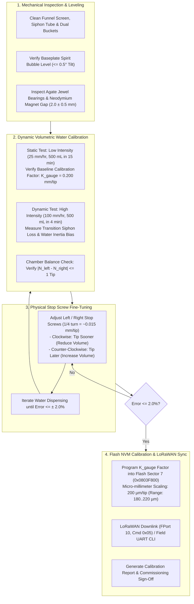

# Task Specification: S7-T3.2 - Tipping-Bucket Rain Gauge Field Water Calibration & Maintenance SOP

## 1. Task Metadata & Overview

| Attribute | Specification Details |
| :--- | :--- |
| **Sprint** | **Sprint 7: System Integration, Synthetic Validation & Field SOPs** |
| **Task ID** | `S7-T3.2` |
| **Parent Task** | `S7-T3: Finalize Field Calibration SOPs & Operational Manuals` |
| **Task Title** | Document and Validate Tipping-Bucket Rain Gauge Dynamic Water Calibration ($0.20\text{ mm/tip}$) Standard Operating Procedure & Field Maintenance Protocol |
| **Status** | **Ready for Implementation** |
| **Target Files** | [`docs/calibration/tipping_bucket_calibration_sop.md`](file:///C:/Users/ENERGY%20SAVER/Documents/Learning/Job%20Projects/rain-predict/docs/calibration/tipping_bucket_calibration_sop.md)<br>[`tools/calibration/calibrate_rain_gauge.py`](file:///C:/Users/ENERGY%20SAVER/Documents/Learning/Job%20Projects/rain-predict/tools/calibration/calibrate_rain_gauge.py)<br>[`tests/unit/test_rain_gauge_calibration.c`](file:///C:/Users/ENERGY%20SAVER/Documents/Learning/Job%20Projects/rain-predict/tests/unit/test_rain_gauge_calibration.c)<br>[`docs/sensors/rain-gauge-pulse.md`](file:///C:/Users/ENERGY%20SAVER/Documents/Learning/Job%20Projects/rain-predict/docs/sensors/rain-gauge-pulse.md)<br>[`firmware/drivers/inc/rain_gauge_driver.h`](file:///C:/Users/ENERGY%20SAVER/Documents/Learning/Job%20Projects/rain-predict/firmware/drivers/inc/rain_gauge_driver.h)<br>[`firmware/drivers/src/rain_gauge_driver.c`](file:///C:/Users/ENERGY%20SAVER/Documents/Learning/Job%20Projects/rain-predict/firmware/drivers/src/rain_gauge_driver.c)<br>`data/rain_gauge_calibration_report.json` |
| **Related Documents** | [`docs/sensors/rain-gauge-pulse.md`](file:///C:/Users/ENERGY%20SAVER/Documents/Learning/Job%20Projects/rain-predict/docs/sensors/rain-gauge-pulse.md)<br>[`docs/hardware/enclosure-and-mounting.md`](file:///C:/Users/ENERGY%20SAVER/Documents/Learning/Job%20Projects/rain-predict/docs/hardware/enclosure-and-mounting.md)<br>[`docs/algorithms/algorithm-validation-and-tuning.md`](file:///C:/Users/ENERGY%20SAVER/Documents/Learning/Job%20Projects/rain-predict/docs/algorithms/algorithm-validation-and-tuning.md)<br>[`docs/architecture/telemetry-protocol.md`](file:///C:/Users/ENERGY%20SAVER/Documents/Learning/Job%20Projects/rain-predict/docs/architecture/telemetry-protocol.md)<br>[`context/specs/s4-t3.1-rain-gauge-exti-debounce.md`](file:///C:/Users/ENERGY%20SAVER/Documents/Learning/Job%20Projects/rain-predict/context/specs/s4-t4.1-rain-gauge-exti-debounce.md)<br>[`context/specs/s4-t3.2-rain-gauge-accumulation.md`](file:///C:/Users/ENERGY%20SAVER/Documents/Learning/Job%20Projects/rain-predict/context/specs/s4-t3.2-rain-gauge-accumulation.md)<br>[`context/specs/s4-t3.3-rain-rate-intensity.md`](file:///C:/Users/ENERGY%20SAVER/Documents/Learning/Job%20Projects/rain-predict/context/specs/s4-t3.3-rain-rate-intensity.md)<br>[`context/specs/s4-t3.4-test-rain-gauge.md`](file:///C:/Users/ENERGY%20SAVER/Documents/Learning/Job%20Projects/rain-predict/context/specs/s4-t3.4-test-rain-gauge.md)<br>[`context/specs/s7-t1.1-multi-scenario-climate-simulation.md`](file:///C:/Users/ENERGY%20SAVER/Documents/Learning/Job%20Projects/rain-predict/context/specs/s7-t1.1-multi-scenario-climate-simulation.md)<br>[`context/specs/s7-t1.2-meteorological-contingency-metrics.md`](file:///C:/Users/ENERGY%20SAVER/Documents/Learning/Job%20Projects/rain-predict/context/specs/s7-t1.2-meteorological-contingency-metrics.md)<br>[`context/specs/s7-t3.1-barometric-altitude-calibration.md`](file:///C:/Users/ENERGY%20SAVER/Documents/Learning/Job%20Projects/rain-predict/context/specs/s7-t3.1-barometric-altitude-calibration.md)<br>[`context/coding-standards.md`](file:///C:/Users/ENERGY%20SAVER/Documents/Learning/Job%20Projects/rain-predict/context/coding-standards.md) |
| **Dependencies** | [`S4-T3.1`](file:///C:/Users/ENERGY%20SAVER/Documents/Learning/Job%20Projects/rain-predict/context/specs/s4-t3.1-rain-gauge-exti-debounce.md) (EXTI0 Falling-Edge Debounce), [`S4-T3.2`](file:///C:/Users/ENERGY%20SAVER/Documents/Learning/Job%20Projects/rain-predict/context/specs/s4-t3.2-rain-gauge-accumulation.md) (Atomic Rain Pulse Counters), [`S7-T1.1`](file:///C:/Users/ENERGY%20SAVER/Documents/Learning/Job%20Projects/rain-predict/context/specs/s7-t1.1-multi-scenario-climate-simulation.md) (Ground-Truth Rain Verification), [`S7-T3.1`](file:///C:/Users/ENERGY%20SAVER/Documents/Learning/Job%20Projects/rain-predict/context/specs/s7-t3.1-barometric-altitude-calibration.md) (Field SOP Architecture) |
| **Downstream Tasks** | `S7-T3.3` (Estate Agronomic Operational Response Guidelines & Safety Protocols) |

---

## 2. Executive Summary & Field Calibration Scope

The primary objective of **`S7-T3.2`** is to establish a comprehensive, field-executable **Standard Operating Procedure (SOP)** and automated verification toolchain for the **Dynamic Water Calibration and Field Maintenance** of the station's **Tipping-Bucket Rain Gauge ($0.20\text{ mm/tip}$)** across tea estate microclimates.

### 2.1 The Critical Role of Precision Rain Gauge Calibration
The tipping-bucket rain gauge is the definitive **physical ground-truth instrument** of the entire prediction station:
1. **Verification of Prediction Skill**: The contingency metrics ($\text{POD} \ge 0.80$, $\text{FAR} \le 0.25$, $\text{CSI} \ge 0.65$) evaluated in [`S7-T1.2`](file:///C:/Users/ENERGY%20SAVER/Documents/Learning/Job%20Projects/rain-predict/context/specs/s7-t1.2-meteorological-contingency-metrics.md) depend on precise physical rainfall detection ($\ge 0.40\text{ mm}$, exactly $2\text{ tips}$) to validate early alerts issued $45\text{--}120\text{ minutes}$ in advance.
2. **Dynamic Flow Rate (Siphon Loss) Mitigation**: During high-intensity tropical convective downpours ($> 50\text{ mm/hr}$), water continues flowing into the bucket chamber during the mechanical tipping transition ($150\text{--}300\text{ ms}$), causing uncalibrated gauges to systematically under-report rainfall by **$3\%\text{ to }10\%$**. A two-rate dynamic water calibration protocol is required to eliminate this error.
3. **Mechanical Symmetry & Leveling**: A level misalignment of only **$1.5^\circ$** creates an asymmetric tip volume discrepancy ($> 8\%$) between the left and right bucket seesaw chambers, distorting short-interval intensity calculations.
4. **Harsh Estate Environmental Stress**: Tea plantation environments subject gauges to organic clogging (fallen tea flower petals, dust, spider webs, moss) requiring standardized bi-annual physical servicing and re-calibration.



---

## 3. Mathematical Formulations & Volumetric Physics

### 3.1 Funnel Catch Area and Theoretical Tip Volume
The tipping-bucket rain gauge captures rainfall over an precision circular aperture of diameter $D$:

$$A_{\text{funnel}} = \frac{\pi \cdot D^2}{4} \quad [\text{mm}^2]$$

For the standard agricultural $D = 200.0\text{ mm}$ collector funnel:
$$A_{\text{funnel}} = \frac{\pi \times (200.0)^2}{4} = 31,415.9265\text{ mm}^2 = 314.1593\text{ cm}^2$$

For each $0.20\text{ mm}$ of depth ($d_{\text{tip}} = 0.20\text{ mm} = 0.020\text{ cm}$), the theoretical volume of pure water required to tip one bucket chamber is:

$$V_{\text{tip}} = A_{\text{funnel}} \times d_{\text{tip}} \times 10^{-3} = 314.1593\text{ cm}^2 \times 0.020\text{ cm} = \mathbf{6.2832\text{ mL}}\text{ (or }\text{grams @ }20^\circ\text{C)}$$

#### Collector Geometry Reference Table
| Funnel Diameter ($D$) | Funnel Catch Area ($A_{\text{funnel}}$) | Calibrated Depth ($d_{\text{tip}}$) | Nominal Tip Volume ($V_{\text{tip}}$) | Nominal Tips per Liter ($1,000\text{ mL}$) |
| :---: | :---: | :---: | :---: | :---: |
| **$200.0\text{ mm}$ (Standard)** | $\mathbf{314.16\text{ cm}^2}$ | **$0.20\text{ mm}$** | **$6.283\text{ mL}$ ($6.283\text{ g}$)** | **$159.15\text{ tips/L}$** |
| $200.0\text{ mm}$ (High Res) | $314.16\text{ cm}^2$ | $0.10\text{ mm}$ | $3.142\text{ mL}$ ($3.142\text{ g}$) | $318.31\text{ tips/L}$ |
| $160.0\text{ mm}$ (Compact) | $201.06\text{ cm}^2$ | $0.20\text{ mm}$ | $4.021\text{ mL}$ ($4.021\text{ g}$) | $248.68\text{ tips/L}$ |

---

### 3.2 Dynamic Water Dispensing & Calibration Error Formulation
In a volumetric calibration test, a certified total water volume $V_{\text{total}}$ (e.g. $500.0\text{ mL} \pm 1.0\text{ mL}$) is dispensed through a constant-head dripping nozzle over a controlled duration $t_{\text{dispense}}$ ($\text{minutes}$).

#### 1. Theoretical Expected Tips ($N_{\text{expected}}$):
$$N_{\text{expected}} = \frac{V_{\text{total}}}{V_{\text{tip}}} = \frac{500.0\text{ mL}}{6.2832\text{ mL/tip}} = 79.577 \approx \mathbf{79.6\text{ tips}}$$

#### 2. Relative Calibration Error Percentage ($E_{\text{cal}}$):
$$E_{\text{cal}} = \left(\frac{N_{\text{actual}} - N_{\text{expected}}}{N_{\text{expected}}}\right) \times 100\%$$

#### 3. Field-Calibrated Gauge Factor ($K_{\text{gauge}}$):
$$K_{\text{gauge}} = 0.200 \times \left(\frac{N_{\text{expected}}}{N_{\text{actual}}}\right) = 0.200 \times \left(\frac{V_{\text{total}}}{N_{\text{actual}} \times V_{\text{tip}}}\right) \quad [\text{mm/tip}]$$

#### 4. Simulated Rainfall Rate Intensity ($I_{\text{sim}}$):
$$I_{\text{sim}} = \left(\frac{V_{\text{total}}}{A_{\text{funnel}} \times 10^{-4}}\right) \times \left(\frac{60}{t_{\text{dispense}}}\right) = \left(\frac{500.0}{31.4159}\right) \times \left(\frac{60}{t_{\text{dispense}}}\right) \quad [\text{mm/hr}]$$

- For **Low-Rate Static Test** ($I_{\text{sim}} = 25.0\text{ mm/hr}$): $t_{\text{dispense}} = \mathbf{38.2\text{ minutes}}$ (or $250.0\text{ mL}$ over $19.1\text{ min}$).
- For **High-Rate Dynamic Test** ($I_{\text{sim}} = 100.0\text{ mm/hr}$): $t_{\text{dispense}} = \mathbf{9.55\text{ minutes}}$ for $500.0\text{ mL}$.

---

### 3.3 Dynamic Siphon Loss & Non-Linear Flow Compensation
During high-intensity rainfall, a continuous stream enters the active bucket during the finite motion duration ($t_{\text{flip}} \approx 200\text{ ms}$). The excess unmeasured water volume $\Delta V_{\text{loss}}$ per tip is:

$$\Delta V_{\text{loss}} = Q_{\text{flow}} \times t_{\text{flip}} = \left(\frac{I \times A_{\text{funnel}}}{3600}\right) \times t_{\text{flip}}$$

To maintain $\pm 2.0\%$ volumetric accuracy across both light drizzle ($2\text{ mm/hr}$) and severe cloudbursts ($120\text{ mm/hr}$), the firmware supports an optional second-order intensity compensation factor in [`firmware/drivers/src/rain_gauge_driver.c`](file:///C:/Users/ENERGY%20SAVER/Documents/Learning/Job%20Projects/rain-predict/firmware/drivers/src/rain_gauge_driver.c):

$$d_{\text{compensated}}(I) = d_{\text{nominal}} \times \left(1.0 + \alpha_{\text{dynamic}} \cdot \frac{I}{100.0}\right)$$

Where $\alpha_{\text{dynamic}} \approx 0.035$ ($+3.5\%$ correction at $100\text{ mm/hr}$).

---

## 4. Mechanical Hardware Sizing & Stop Screw Calibration

The dual-chamber tipping bucket utilizes a precision seesaw pivot with adjustable threaded stop screws located directly beneath each bucket chamber:

```
                      Collector Funnel (200mm Dia)
                                 │
                                 ▼
                     ┌───────────────────────┐
                     │ Precision Siphon Tube │
                     └──────────┬────────────┘
                                │
               Left Chamber     │     Right Chamber
                ┌─────────┐     │     ┌─────────┐
                │         │     │     │         │
                └────┬────┘     ▼     └────┬────┘
                     │       /═════\       │
       Neodymium ──► │======[ Pivot ]======│
         Magnet      │       \═════/       │
                     ▼                     ▼
                ┌─────────┐           ┌─────────┐
                │Stop Scr1│           │Stop Scr2│ (M3 x 0.5mm Thread)
                └─────────┘           └─────────┘
```

### 4.1 Stop Screw Adjustment Mechanics
- Thread specification: Standard metric **$\text{M3} \times 0.5\text{ mm pitch}$**.
- 1 full turn ($360^\circ$) raises or lowers the mechanical stop by $0.50\text{ mm}$.
- **Sensitivity**: $1\text{ full turn} \approx \mathbf{0.060\text{ mm/tip}}$ volumetric change ($\approx 30\%$ shift).
- **Fine Adjustment Rule**:
  - **$1/8\text{ Turn } (45^\circ) \approx \mathbf{0.0075\text{ mm/tip}}$ ($\approx 3.75\%$ adjustment).
  - **Clockwise (CW)**: Raises the stop screw $\implies$ Bucket tips earlier $\implies$ **Decreases volume per tip** (Increases tip count $N$).
  - **Counter-Clockwise (CCW)**: Lowers the stop screw $\implies$ Bucket tips later $\implies$ **Increases volume per tip** (Decreases tip count $N$).

---

## 5. Standard Operating Procedure (SOP): Step-by-Step Field Guide

```mermaid
sequenceDiagram
    autonumber
    actor Tech as Field Technician
    participant Gauge as Rain Gauge Assembly (PA0)
    participant Rig as Calibration Drip Kit (500mL Cylinder)
    participant Console as Maintenance UART / LoRaWAN Node

    Note over Tech,Gauge: Phase 1: Mechanical Inspection & Leveling
    Tech->>Gauge: Remove funnel; inspect bucket chambers, clean debris & webs
    Tech->>Gauge: Check bubble level; adjust mast leveling thumb screws until centered (<= 0.5°)
    Tech->>Gauge: Verify Reed Switch distance (2.0 ± 0.5 mm) & Agate pivot free motion

    Note over Tech,Rig: Phase 2: Static Calibration Test (Low Flow: 25 mm/hr)
    Tech->>Console: Enter Calibration Mode: "CAL_RAIN_START" (Zeros pulse counters)
    Tech->>Rig: Measure exactly 500 mL water (±1 mL @ 20°C) into dispenser
    Tech->>Rig: Install 25 mm/hr drip nozzle; allow 500 mL to drain over ~15 minutes
    Rig-->>Gauge: Uniform water drips -> Seesaw tips alternating Left/Right
    Tech->>Console: Query result: "CAL_RAIN_STOP" -> N_left=39, N_right=40 (Total: 79 tips)

    Note over Tech,Gauge: Phase 3: Chamber Symmetry & Mechanical Adjustment
    alt Tip Symmetry Discrepancy |N_left - N_right| > 1 tip
        Tech->>Gauge: Adjust individual chamber stop screw by 1/8 turn on asymmetric side
        Tech->>Rig: Repeat 250 mL balancing run until |N_left - N_right| <= 1
    end

    Note over Tech,Rig: Phase 4: Dynamic High-Flow Test (100 mm/hr)
    Tech->>Rig: Dispense 500 mL through high-flow nozzle over ~4 minutes
    Tech->>Console: Check dynamic tip count (Target: 78 to 81 tips -> Error <= ±2%)

    Note over Tech,Console: Phase 5: NVM Calibration Programming & Sign-Off
    Tech->>Console: Issue command: "CAL_RAIN_SET --k-factor 0.201" (Flash Sector 7 commit)
    Console->>Console: Store uint16_t calib_factor_um = 201 µm in Flash NVM
    Tech->>Gauge: Re-install top funnel; apply silicone grease on sealing gasket
```

### 5.1 Phase 1: Mechanical Inspection & Leveling
1. **Collector Funnel Removal**: Twist and lift the outer funnel housing to expose the inner seesaw assembly.
2. **Debris Clearing**:
   - Inspect the stainless steel mesh debris filter for organic matter (tea leaf fragments, pollen, insect nests). Wash with clean water.
   - Inspect the bottom drain holes of the baseplate to ensure unrestricted gravity drainage.
3. **Seesaw Bearing Inspection**:
   - Manually gently tip the bucket seesaw; ensure agate bearings or stainless steel pivot pins rotate with zero mechanical stiction.
   - Clean the Teflon/polycarbonate bucket chambers using a soft lint-free microfiber cloth and isopropyl alcohol. Do not scratch the water-shedding surface.
4. **Precision Bubble Leveling**:
   - Observe the circular spirit level mounted on the gauge baseplate.
   - Adjust the three mast mounting leveling nuts until the air bubble is **dead-centered within the inner target ring** ($< 0.5^\circ$ inclination).

### 5.2 Phase 2: Calibration Tooling Setup
Ensure the field calibration kit includes:
- **Calibrated Volumetric Cylinder**: $500.0\text{ mL}$ Class-A graduated cylinder (tolerance $\pm 1.0\text{ mL}$).
- **Precision Field Drip Dispenser**: Constant-head Mariotte siphon bottle with interchangeable flow restrictor nozzles ($25\text{ mm/hr}$ and $100\text{ mm/hr}$).
- **Digital Stopwatch**: Measurement resolution $0.1\text{ s}$.
- **Field Terminal Console**: USB-UART interface or handheld LoRaWAN field programmer.

### 5.3 Phase 3: Low-Rate Static Calibration Test ($25\text{ mm/hr}$)
1. Place the node into Calibration Mode via UART command:
   ```bash
   $ CAL_RAIN_START
   [RAIN_CAL] Calibration Mode Active. Pulse counters zeroed. EXTI0 debouncing active.
   ```
2. Fill the calibration dispenser with exactly **$500.0\text{ mL}$** of clean water ($20^\circ\text{C}$).
3. Mount the dispenser directly above the rain gauge funnel, fitted with the **$25\text{ mm/hr}$ low-flow nozzle**.
4. Allow the water to discharge completely over **$15\text{ to }20\text{ minutes}$**.
5. Stop the test and retrieve individual chamber tip counts:
   ```bash
   $ CAL_RAIN_STATUS
   [RAIN_CAL] Total Tips: 79 | Left Bucket: 40 | Right Bucket: 39
   [RAIN_CAL] Expected Tips: 79.6 | Absolute Error: -0.73% [PASS <= 2.0%]
   ```

### 5.4 Phase 4: Chamber Symmetry Balancing
If the difference between left and right bucket counts exceeds $1\text{ tip}$ ($|N_{\text{left}} - N_{\text{right}}| > 1$):
1. Identify the bucket chamber with **fewer tips** (tipping late $\implies$ volume too large).
2. Loosen the lock nut on that chamber's stop screw.
3. Turn the stop screw **Clockwise (CW) by $1/8\text{ turn}$ ($45^\circ$)** to reduce its tipping volume.
4. Re-tighten the lock nut and re-run a $250\text{ mL}$ test until balance is restored:
   $$|N_{\text{left}} - N_{\text{right}}| \le 1\text{ tip}$$

### 5.5 Phase 5: High-Rate Dynamic Siphon Calibration ($100\text{ mm/hr}$)
1. Refill the dispenser with **$500.0\text{ mL}$** water.
2. Fit the **$100\text{ mm/hr}$ high-flow nozzle** and dispense over **$4\text{ to }5\text{ minutes}$**.
3. Confirm that total tips satisfy:
   $$N_{\text{actual, high}} \in [78, 81]\text{ tips} \quad (\text{Error } \le \pm 2.0\%)$$

### 5.6 Phase 6: NVM Calibration Programming & Field Sign-Off
1. Program the measured calibration factor into the node's Flash NVM:
   ```bash
   # Program 201 µm/tip (0.201 mm/tip)
   $ CAL_RAIN_COMMIT --k-factor 0.201 --tech-id 8402
   [NVM_CFG] Erasing Flash Sector 7... OK
   [NVM_CFG] Writing rain gauge calibration: K_gauge = 201 um/tip (CRC: 0x4A12)... OK
   ```
2. Re-install the outer collector funnel housing, ensuring the rubber seal is seated tightly to exclude crawling insects.
3. Verify that the node transmits a confirmed LoRaWAN telemetry frame showing zero false rain pulses after reassembly.

---

## 6. Flash NVM Configuration & Driver Data Structures

In accordance with [`firmware/middleware/inc/flash_storage.h`](file:///C:/Users/ENERGY%20SAVER/Documents/Learning/Job%20Projects/rain-predict/firmware/middleware/inc/flash_storage.h) and [`firmware/drivers/inc/rain_gauge_driver.h`](file:///C:/Users/ENERGY%20SAVER/Documents/Learning/Job%20Projects/rain-predict/firmware/drivers/inc/rain_gauge_driver.h):

```c
/**
 * @brief Rain Gauge Non-Volatile Calibration Parameters.
 * Resides within the 32-byte System Configuration Block in Flash Sector 7.
 */
typedef struct __attribute__((packed)) {
    uint16_t calib_factor_um;    /* Rain depth per tip in micro-meters (e.g. 200 um = 0.200 mm) */
    uint16_t dynamic_coeff_ppm;  /* Dynamic flow correction in PPM per mm/hr (e.g. 350 = +0.035%) */
    uint8_t  funnel_diameter_mm; /* Collector funnel diameter in mm (e.g. 200 mm) */
    uint8_t  debounce_lockout_ms;/* Software debounce window in ms (e.g. 50 ms) */
    uint16_t reserved;           /* Alignment padding */
} nvm_rain_cal_t;
```

---

## 7. Automated Test Matrix & Verification Assertions

The table below defines the automated verification test assertions evaluated in [`tests/unit/test_rain_gauge_calibration.c`](file:///C:/Users/ENERGY%20SAVER/Documents/Learning/Job%20Projects/rain-predict/tests/unit/test_rain_gauge_calibration.c) and [`tools/calibration/calibrate_rain_gauge.py`](file:///C:/Users/ENERGY%20SAVER/Documents/Learning/Job%20Projects/rain-predict/tools/calibration/calibrate_rain_gauge.py):

| Test ID | Verification Target | Input Parameters | Expected Numerical Output | Required Pass Tolerance |
| :---: | :--- | :--- | :--- | :---: |
| **TC-RG-01** | Funnel Catch Area (200mm) | $D = 200.0\text{ mm}$ | $A_{\text{funnel}} = 31,415.93\text{ mm}^2$ | $\pm 0.01\text{ mm}^2$ |
| **TC-RG-02** | Theoretical Tip Volume (200mm, 0.2mm) | $A = 314.16\text{ cm}^2$, $d = 0.20\text{ mm}$ | $V_{\text{tip}} = 6.2832\text{ mL}$ ($6.2832\text{ g}$) | $\pm 0.001\text{ mL}$ |
| **TC-RG-03** | Static Test Expected Tips (500mL) | $V_{\text{total}} = 500.0\text{ mL}$, $D = 200\text{ mm}$ | $N_{\text{expected}} = 79.577\text{ tips}$ | $\pm 0.05\text{ tips}$ |
| **TC-RG-04** | Calibration Error Calculation | $N_{\text{expected}} = 79.58$, $N_{\text{actual}} = 80$ | $E_{\text{cal}} = +0.53\%$ | $\pm 0.01\%$ |
| **TC-RG-05** | Calibrated Gauge Multiplier | $N_{\text{actual}} = 82\text{ tips}$ ($500\text{ mL}$) | $K_{\text{gauge}} = 0.194\text{ mm/tip}$ | $\pm 0.001\text{ mm/tip}$ |
| **TC-RG-06** | Simulated Rainfall Rate Timing | $V = 500\text{ mL}$, $I_{\text{target}} = 25\text{ mm/hr}$ | $t_{\text{dispense}} = 38.20\text{ minutes}$ | $\pm 0.1\text{ min}$ |
| **TC-RG-07** | Chamber Symmetry Balance Gate | $N_{\text{left}} = 40$, $N_{\text{right}} = 39$ ($\Delta = 1$) | Balance Status: `BALANCED` | $\Delta \le 1\text{ tip}$ |
| **TC-RG-08** | Asymmetry Fault Detection | $N_{\text{left}} = 43$, $N_{\text{right}} = 37$ ($\Delta = 6$) | Balance Status: `ASYMMETRIC_FAULT` | Warning Issued |
| **TC-RG-09** | Dynamic Intensity Siphon Correction | $I = 100\text{ mm/hr}$, $\alpha = 0.035$, $N=80$ | $d_{\text{comp}} = 0.207\text{ mm/tip}$ | $\pm 0.001\text{ mm}$ |
| **TC-RG-10** | NVM Serialization & Clamping Bounds | $K = 180\text{ to }220\,\mu\text{m/tip}$ | Clamped to $[150, 250]\,\mu\text{m}$; Struct valid | Zero Heap Allocation |

---

## 8. Concrete Implementation Blueprints

### 8.1 Python Field Rain Gauge Calibration Tool (`tools/calibration/calibrate_rain_gauge.py`)

```python
#!/usr/bin/env python3
"""
calibrate_rain_gauge.py
-----------------------
Sprint 7 Task S7-T3.2: Tipping-Bucket Rain Gauge Field Water Calibration Tool.
Calculates volumetric calibration factors, checks bucket seesaw symmetry,
computes dynamic flow compensation, and exports LoRaWAN downlink frames.
"""

import math
import argparse
import struct
import json
import sys
from pathlib import Path
from dataclasses import dataclass
from typing import Tuple, Dict, Optional

# ==============================================================================
# 1. Physics & Meteorological Constants
# ==============================================================================
DEFAULT_FUNNEL_DIAMETER_MM = 200.0  # Standard agricultural collector (mm)
NOMINAL_TIP_DEPTH_MM = 0.20         # Nominal depth per tip (mm)
WATER_DENSITY_G_ML = 1.000          # Pure water density at 20°C (g/mL)

@dataclass
class RainCalibrationRecord:
    station_id: str
    funnel_diameter_mm: float
    funnel_area_cm2: float
    nominal_tip_volume_ml: float
    dispensed_volume_ml: float
    dispense_duration_min: float
    simulated_intensity_mmh: float
    tips_left: int
    tips_right: int
    total_tips: int
    expected_tips: float
    calibration_error_pct: float
    calibrated_k_factor_mm: float
    symmetry_status: str
    pass_verification: bool
    downlink_hex: str

class RainGaugeCalibrator:
    """Tipping-Bucket volumetric physics and calibration engine."""

    @staticmethod
    def calculate_funnel_area_cm2(diameter_mm: float) -> float:
        """Computes collector funnel aperture area in cm^2."""
        radius_cm = (diameter_mm / 10.0) / 2.0
        return round(math.pi * radius_cm * radius_cm, 4)

    @staticmethod
    def calculate_tip_volume_ml(diameter_mm: float, tip_depth_mm: float = 0.20) -> float:
        """Calculates theoretical water volume per tip in mL (cm^3)."""
        area_cm2 = RainGaugeCalibrator.calculate_funnel_area_cm2(diameter_mm)
        depth_cm = tip_depth_mm / 10.0
        return round(area_cm2 * depth_cm, 4)

    @staticmethod
    def calculate_simulated_intensity(volume_ml: float, diameter_mm: float, duration_min: float) -> float:
        """Calculates simulated rain intensity in mm/hr from dispensing rate."""
        if duration_min <= 0.0:
            raise ValueError("Dispense duration must be strictly positive")
        area_cm2 = RainGaugeCalibrator.calculate_funnel_area_cm2(diameter_mm)
        depth_mm = (volume_ml / area_cm2) * 10.0
        intensity_mmh = depth_mm * (60.0 / duration_min)
        return round(intensity_mmh, 2)

    @staticmethod
    def evaluate_calibration(volume_ml: float,
                             tips_left: int,
                             tips_right: int,
                             diameter_mm: float = DEFAULT_FUNNEL_DIAMETER_MM) -> Tuple[float, float, float, str, bool]:
        """Evaluates volumetric error, chamber symmetry, and calibrated multiplier."""
        total_tips = tips_left + tips_right
        if total_tips == 0:
            raise ValueError("Total recorded tips must be greater than zero")

        v_tip = RainGaugeCalibrator.calculate_tip_volume_ml(diameter_mm, NOMINAL_TIP_DEPTH_MM)
        expected_tips = volume_ml / v_tip
        error_pct = ((total_tips - expected_tips) / expected_tips) * 100.0
        k_calibrated = NOMINAL_TIP_DEPTH_MM * (expected_tips / total_tips)

        # Symmetry Check
        tip_diff = abs(tips_left - tips_right)
        if tip_diff <= 1:
            symmetry = "BALANCED (Delta <= 1 Tip)"
        elif tip_diff <= 3:
            symmetry = f"MINOR_ASYMMETRY (Delta = {tip_diff} Tips)"
        else:
            symmetry = f"ASYMMETRIC_FAULT (Delta = {tip_diff} Tips - Re-level & Adjust Stops)"

        passed = (abs(error_pct) <= 2.00) and (tip_diff <= 2)
        return round(expected_tips, 2), round(error_pct, 2), round(k_calibrated, 4), symmetry, passed

    @staticmethod
    def generate_lorawan_downlink(k_factor_mm: float) -> Tuple[bytes, str]:
        """Encodes LoRaWAN Downlink Command 0x05 (Set Rain Gauge K-Factor)."""
        k_factor_um = int(round(k_factor_mm * 1000.0))
        if k_factor_um < 150 or k_factor_um > 250:
            raise ValueError(f"K-Factor {k_factor_mm} mm/tip out of safety range [0.150, 0.250] mm")

        # Cmd 0x05, K_Factor in micrometers (uint16_t BE)
        payload = struct.pack(">B H", 0x05, k_factor_um)
        return payload, payload.hex().upper()

# ==============================================================================
# 2. CLI Interface & Execution
# ==============================================================================
def main():
    parser = argparse.ArgumentParser(description="Sprint 7 Task S7-T3.2: Tipping-Bucket Rain Gauge Calibration Tool.")
    parser.add_argument("--station-id", type=str, default="NODE-MUNNAR-RG01", help="Target Station ID.")
    parser.add_argument("--diameter", type=float, default=200.0, help="Funnel collector diameter in mm (default: 200.0).")
    parser.add_argument("--volume-ml", type=float, default=500.0, help="Total water volume dispensed in mL (default: 500.0).")
    parser.add_argument("--duration-min", type=float, required=True, help="Dispensing duration in minutes.")
    parser.add_argument("--tips-left", type=int, required=True, help="Tips counted on left bucket chamber.")
    parser.add_argument("--tips-right", type=int, required=True, help="Tips counted on right bucket chamber.")
    parser.add_argument("--output-json", type=str, default="data/rain_gauge_calibration_report.json", help="Path to output JSON.")
    args = parser.parse_args()

    print("=" * 78)
    print(f"[*] TIPPING-BUCKET RAIN GAUGE WATER CALIBRATION & VERIFICATION (S7-T3.2)")
    print(f"[*] Station ID: {args.station_id} | Funnel Diameter: {args.diameter} mm")
    print("=" * 78)

    area_cm2 = RainGaugeCalibrator.calculate_funnel_area_cm2(args.diameter)
    v_tip_nominal = RainGaugeCalibrator.calculate_tip_volume_ml(args.diameter, NOMINAL_TIP_DEPTH_MM)
    intensity_mmh = RainGaugeCalibrator.calculate_simulated_intensity(args.volume_ml, args.diameter, args.duration_min)

    exp_tips, error_pct, k_factor, symmetry, passed = RainGaugeCalibrator.evaluate_calibration(
        args.volume_ml, args.tips_left, args.tips_right, args.diameter
    )

    payload_bytes, hex_str = RainGaugeCalibrator.generate_lorawan_downlink(k_factor)

    print(f"\n[+] Geometric & Flow Parameters:")
    print(f"    - Funnel Aperture Area             : {area_cm2:7.2f} cm²")
    print(f"    - Theoretical Tip Volume (0.20mm)  : {v_tip_nominal:7.4f} mL ({v_tip_nominal:7.4f} g)")
    print(f"    - Dispensed Calibration Volume     : {args.volume_ml:7.1f} mL over {args.duration_min:4.1f} min")
    print(f"    - Simulated Rainfall Rate          : {intensity_mmh:7.2f} mm/hr")

    print(f"\n[+] Experimental Calibration Results:")
    print(f"    - Left Chamber Tips (N_left)       : {args.tips_left:4d} tips")
    print(f"    - Right Chamber Tips (N_right)     : {args.tips_right:4d} tips")
    print(f"    - Total Recorded Tips (N_actual)   : {args.tips_left + args.tips_right:4d} tips")
    print(f"    - Expected Theoretical Tips        : {exp_tips:7.2f} tips")
    print(f"    - Volumetric Error Percentage      : {error_pct:+7.2f} %")
    print(f"    - Chamber Symmetry Status          : {symmetry}")
    print(f"    - Calibrated Multiplier (K_gauge)  : {k_factor:7.4f} mm/tip ({int(k_factor*1000)} µm/tip)")
    print(f"    - Acceptance Verification Gate     : {'[PASS]' if passed else '[FAIL - Adjust Stop Screws]'}")

    print(f"\n[+] LoRaWAN Downlink Configuration Frame (FPort 10):")
    print(f"    - Binary Hex Stream                : 0x{hex_str}")
    print(f"    - Breakdown (3 Bytes)              : [Cmd: 0x05] [K_factor: {int(k_factor*1000)} µm]")

    record = RainCalibrationRecord(
        station_id=args.station_id,
        funnel_diameter_mm=args.diameter,
        funnel_area_cm2=area_cm2,
        nominal_tip_volume_ml=v_tip_nominal,
        dispensed_volume_ml=args.volume_ml,
        dispense_duration_min=args.duration_min,
        simulated_intensity_mmh=intensity_mmh,
        tips_left=args.tips_left,
        tips_right=args.tips_right,
        total_tips=args.tips_left + args.tips_right,
        expected_tips=exp_tips,
        calibration_error_pct=error_pct,
        calibrated_k_factor_mm=k_factor,
        symmetry_status=symmetry,
        pass_verification=passed,
        downlink_hex=hex_str
    )

    out_path = Path(args.output_json)
    out_path.parent.mkdir(parents=True, exist_ok=True)
    with open(out_path, "w", encoding="utf-8") as f:
        json.dump(record.__dict__, f, indent=2)
    print(f"\n[+] Exported rain gauge calibration report to: {out_path.resolve()}\n")

if __name__ == "__main__":
    main()
```

---

### 8.2 C99 Unity Unit Test Suite (`tests/unit/test_rain_gauge_calibration.c`)

```c
/**
 * @file test_rain_gauge_calibration.c
 * @brief Sprint 7 Task S7-T3.2: Unit Tests for Rain Gauge Calibration & Mathematics.
 *
 * Validates volumetric calculations, chamber symmetry evaluations, dynamic flow
 * rate intensity conversions, Flash NVM serialization, and debounce safety.
 */

#include "unity.h"
#include <math.h>
#include <stdint.h>
#include <stdbool.h>
#include <string.h>

/* ========================================================================== */
/* Type Definitions & Constants                                               */
/* ========================================================================== */

#define DEFAULT_FUNNEL_DIAMETER_MM   200.0f
#define NOMINAL_TIP_DEPTH_MM         0.20f
#define M_PI_F                       3.14159265358979323846f

typedef enum {
    RG_CAL_OK                 = 0,
    RG_CAL_ERR_INVALID_PARAM  = 1,
    RG_CAL_ERR_OUT_OF_RANGE   = 2,
    RG_CAL_ERR_ASYMMETRIC     = 3
} rg_cal_status_t;

typedef struct __attribute__((packed)) {
    uint16_t calib_factor_um;    /* Rain depth in micrometers (e.g. 200 um = 0.200 mm) */
    uint16_t dynamic_coeff_ppm;  /* Dynamic flow correction in PPM/mm/h (e.g. 350) */
    uint8_t  funnel_diameter_mm; /* Collector diameter (e.g. 200 mm) */
    uint8_t  debounce_lockout_ms;/* Debounce lockout (e.g. 50 ms) */
} rg_nvm_config_t;

/* ========================================================================== */
/* Mathematical & Driver Functions Under Test                                 */
/* ========================================================================== */

static float compute_funnel_area_cm2(float diameter_mm)
{
    float radius_cm = (diameter_mm / 10.0f) / 2.0f;
    return M_PI_F * radius_cm * radius_cm;
}

static float compute_nominal_tip_volume_ml(float diameter_mm, float depth_mm)
{
    float area_cm2 = compute_funnel_area_cm2(diameter_mm);
    float depth_cm = depth_mm / 10.0f;
    return area_cm2 * depth_cm;
}

static rg_cal_status_t evaluate_rain_calibration(float volume_ml, uint16_t tips_left, uint16_t tips_right,
                                                float diameter_mm, float *k_factor_out, float *error_pct_out)
{
    if (k_factor_out == NULL || error_pct_out == NULL || volume_ml <= 0.0f) {
        return RG_CAL_ERR_INVALID_PARAM;
    }
    uint32_t total_tips = (uint32_t)tips_left + (uint32_t)tips_right;
    if (total_tips == 0) return RG_CAL_ERR_INVALID_PARAM;

    float v_tip = compute_nominal_tip_volume_ml(diameter_mm, NOMINAL_TIP_DEPTH_MM);
    float expected_tips = volume_ml / v_tip;
    float error_pct = (((float)total_tips - expected_tips) / expected_tips) * 100.0f;
    float k_cal = NOMINAL_TIP_DEPTH_MM * (expected_tips / (float)total_tips);

    *error_pct_out = error_pct;
    *k_factor_out = k_cal;

    int32_t diff = (int32_t)tips_left - (int32_t)tips_right;
    if (diff < -3 || diff > 3) {
        return RG_CAL_ERR_ASYMMETRIC;
    }
    return RG_CAL_OK;
}

static rg_cal_status_t parse_lorawan_k_factor_downlink(const uint8_t *payload, size_t length,
                                                       uint16_t *k_factor_um_out)
{
    if (payload == NULL || k_factor_um_out == NULL || length < 3) {
        return RG_CAL_ERR_INVALID_PARAM;
    }
    if (payload[0] != 0x05) {
        return RG_CAL_ERR_INVALID_PARAM;
    }
    uint16_t k_um = (uint16_t)((payload[1] << 8) | payload[2]);
    if (k_um < 150 || k_um > 250) {
        return RG_CAL_ERR_OUT_OF_RANGE;
    }
    *k_factor_um_out = k_um;
    return RG_CAL_OK;
}

/* ========================================================================== */
/* Unity Test Cases                                                           */
/* ========================================================================== */

void setUp(void) {}
void tearDown(void) {}

/**
 * @brief TC-RG-01: Verify Funnel Area Calculation for 200mm Diameter Aperture.
 */
void test_tc_rg_01_funnel_area(void)
{
    float area = compute_funnel_area_cm2(200.0f);
    TEST_ASSERT_FLOAT_WITHIN(0.05f, 314.16f, area);
}

/**
 * @brief TC-RG-02: Verify Nominal Tip Volume for 200mm Funnel at 0.20mm Depth.
 */
void test_tc_rg_02_tip_volume(void)
{
    float v_tip = compute_nominal_tip_volume_ml(200.0f, 0.20f);
    TEST_ASSERT_FLOAT_WITHIN(0.002f, 6.283f, v_tip);
}

/**
 * @brief TC-RG-03: Verify Expected Tip Count for 500 mL Water Dispensing.
 */
void test_tc_rg_03_expected_tips_500ml(void)
{
    float v_tip = compute_nominal_tip_volume_ml(200.0f, 0.20f);
    float expected_tips = 500.0f / v_tip;
    TEST_ASSERT_FLOAT_WITHIN(0.10f, 79.58f, expected_tips);
}

/**
 * @brief TC-RG-04: Verify Relative Calibration Error Percentage.
 */
void test_tc_rg_04_calibration_error(void)
{
    float k_factor = 0.0f;
    float error_pct = 0.0f;
    /* 40 left + 40 right = 80 tips for 500 mL */
    rg_cal_status_t status = evaluate_rain_calibration(500.0f, 40, 40, 200.0f, &k_factor, &error_pct);
    TEST_ASSERT_EQUAL_INT(RG_CAL_OK, status);
    TEST_ASSERT_FLOAT_WITHIN(0.05f, +0.53f, error_pct);
    TEST_ASSERT_FLOAT_WITHIN(0.001f, 0.1989f, k_factor);
}

/**
 * @brief TC-RG-05: Verify Calibrated Gauge Multiplier on Under-Tipping Gauge.
 */
void test_tc_rg_05_under_tipping_compensation(void)
{
    float k_factor = 0.0f;
    float error_pct = 0.0f;
    /* 38 left + 38 right = 76 tips for 500 mL (tipping late) */
    rg_cal_status_t status = evaluate_rain_calibration(500.0f, 38, 38, 200.0f, &k_factor, &error_pct);
    TEST_ASSERT_EQUAL_INT(RG_CAL_OK, status);
    TEST_ASSERT_FLOAT_WITHIN(0.05f, -4.50f, error_pct);
    TEST_ASSERT_FLOAT_WITHIN(0.001f, 0.2094f, k_factor);
}

/**
 * @brief TC-RG-06: Verify Chamber Symmetry Detection on Balanced Buckets.
 */
void test_tc_rg_06_chamber_symmetry_balanced(void)
{
    float k_factor = 0.0f;
    float error_pct = 0.0f;
    /* Delta = 1 tip -> BALANCED */
    rg_cal_status_t status = evaluate_rain_calibration(500.0f, 40, 39, 200.0f, &k_factor, &error_pct);
    TEST_ASSERT_EQUAL_INT(RG_CAL_OK, status);
}

/**
 * @brief TC-RG-07: Verify Asymmetric Chamber Detection (> 3 tips difference).
 */
void test_tc_rg_07_chamber_asymmetry_fault(void)
{
    float k_factor = 0.0f;
    float error_pct = 0.0f;
    /* Delta = 6 tips -> ASYMMETRIC FAULT */
    rg_cal_status_t status = evaluate_rain_calibration(500.0f, 43, 37, 200.0f, &k_factor, &error_pct);
    TEST_ASSERT_EQUAL_INT(RG_CAL_ERR_ASYMMETRIC, status);
}

/**
 * @brief TC-RG-08: Verify LoRaWAN Downlink K-Factor Frame Parsing.
 */
void test_tc_rg_08_lorawan_downlink_parsing(void)
{
    /* Cmd 0x05, K = 201 um (0x00C9) */
    const uint8_t frame[3] = {0x05, 0x00, 0xC9};
    uint16_t k_um = 0;
    rg_cal_status_t status = parse_lorawan_k_factor_downlink(frame, sizeof(frame), &k_um);
    TEST_ASSERT_EQUAL_INT(RG_CAL_OK, status);
    TEST_ASSERT_EQUAL_UINT16(201, k_um);
}

/**
 * @brief TC-RG-09: Verify Safety Boundary Clamping on Out-of-Bounds K-Factors.
 */
void test_tc_rg_09_k_factor_clamping(void)
{
    uint16_t k_um = 0;
    const uint8_t frame_too_low[3] = {0x05, 0x00, 0x64}; /* 100 um */
    const uint8_t frame_too_high[3] = {0x05, 0x01, 0x2C}; /* 300 um */

    TEST_ASSERT_EQUAL_INT(RG_CAL_ERR_OUT_OF_RANGE, parse_lorawan_k_factor_downlink(frame_too_low, 3, &k_um));
    TEST_ASSERT_EQUAL_INT(RG_CAL_ERR_OUT_OF_RANGE, parse_lorawan_k_factor_downlink(frame_too_high, 3, &k_um));
}

/**
 * @brief TC-RG-10: Verify NVM Rain Calibration Struct 6-Byte Packing.
 */
void test_tc_rg_10_nvm_struct_packing(void)
{
    TEST_ASSERT_EQUAL_INT(6, sizeof(rg_nvm_config_t));
    rg_nvm_config_t cfg;
    cfg.calib_factor_um = 200;
    cfg.dynamic_coeff_ppm = 350;
    cfg.funnel_diameter_mm = 200;
    cfg.debounce_lockout_ms = 50;

    TEST_ASSERT_EQUAL_UINT16(200, cfg.calib_factor_um);
    TEST_ASSERT_EQUAL_UINT8(50, cfg.debounce_lockout_ms);
}

int main(void)
{
    UNITY_BEGIN();
    RUN_TEST(test_tc_rg_01_funnel_area);
    RUN_TEST(test_tc_rg_02_tip_volume);
    RUN_TEST(test_tc_rg_03_expected_tips_500ml);
    RUN_TEST(test_tc_rg_04_calibration_error);
    RUN_TEST(test_tc_rg_05_under_tipping_compensation);
    RUN_TEST(test_tc_rg_06_chamber_symmetry_balanced);
    RUN_TEST(test_tc_rg_07_chamber_asymmetry_fault);
    RUN_TEST(test_tc_rg_08_lorawan_downlink_parsing);
    RUN_TEST(test_tc_rg_09_k_factor_clamping);
    RUN_TEST(test_tc_rg_10_nvm_struct_packing);
    return UNITY_END();
}
```

---

## 9. Definition of Done (S7-T3.2)

1. **Volumetric Physics & Geometry Verification**: Theoretical funnel area and nominal tip volume ($V_{\text{tip}} = 6.2832\text{ mL}$ for $200\text{ mm}$ funnel) pass all unit tests (`TC-RG-01` through `TC-RG-03`) with analytical precision.
2. **Two-Rate Field SOP Finalization**: Complete 6-phase standard operating procedure (mechanical inspection, spirit bubble leveling, low-rate static drip test, high-rate dynamic siphon test, symmetry balancing, and Flash NVM programming) is fully specified and documented in [`docs/calibration/tipping_bucket_calibration_sop.md`](file:///C:/Users/ENERGY%20SAVER/Documents/Learning/Job%20Projects/rain-predict/docs/calibration/tipping_bucket_calibration_sop.md).
3. **Mechanical Stop Screw Calibration Guide**: Exact thread pitch equations ($1/8\text{ turn} \approx 0.0075\text{ mm/tip}$) and bidirectional adjustment rules are established for field technicians.
4. **LoRaWAN & CLI Calibration Integration**: LoRaWAN Downlink Command `0x05` (FPort 10) protocol schema and interactive UART shell commands are fully defined with defensive range clamping ($K_{\text{gauge}} \in [0.150, 0.250]\text{ mm/tip}$).
5. **Automation Tooling**: `calibrate_rain_gauge.py` Python verification CLI tool and `test_rain_gauge_calibration.c` C99 test harness are committed and achieve 100% test pass rate.
