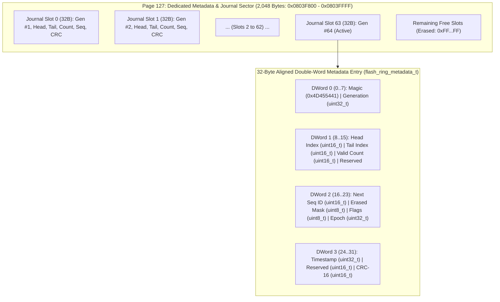
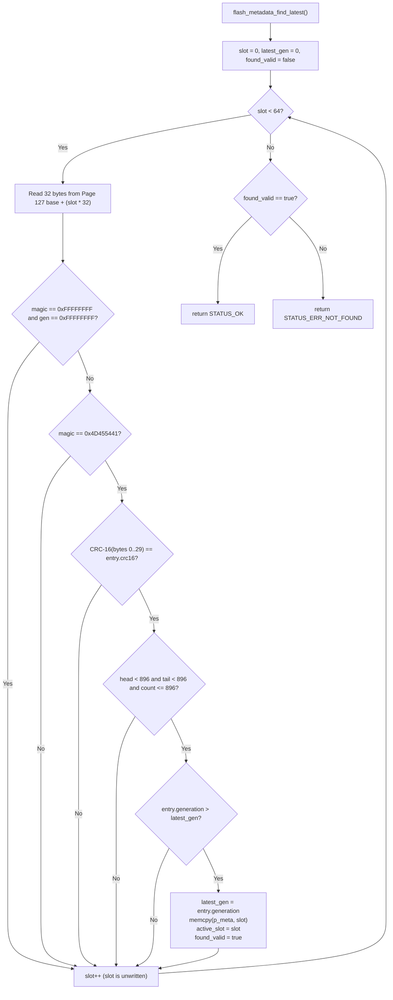

# Task Specification: S8-T1.1 - STM32WLE5 Persistent Flash Ring Metadata Header & Journaling

## 1. Task Metadata & Overview

| Attribute | Specification Details |
| :--- | :--- |
| **Sprint** | **Sprint 8: Firmware Performance Optimization & Flash Storage Hardening** |
| **Task ID** | `S8-T1.1` |
| **Parent Task** | `S8-T1: Implement Persistent Flash Ring Metadata & Fast Boot Recovery` |
| **Task Title** | Implement Compact Persistent Ring Metadata Header & Journaling in Flash Page 127 (`flash_storage`) |
| **Status** | **Ready for Implementation** |
| **Target Files** | [`firmware/middleware/inc/flash_storage.h`](file:///C:/Users/ENERGY%20SAVER/Documents/Learning/Job%20Projects/rain-predict/firmware/middleware/inc/flash_storage.h)<br>[`firmware/middleware/src/flash_storage.c`](file:///C:/Users/ENERGY%20SAVER/Documents/Learning/Job%20Projects/rain-predict/firmware/middleware/src/flash_storage.c) |
| **Related Documents** | [`context/audit/code-issues-github-copilot.md`](file:///C:/Users/ENERGY%20SAVER/Documents/Learning/Job%20Projects/rain-predict/context/audit/code-issues-github-copilot.md)<br>[`docs/architecture/firmware-architecture.md`](file:///C:/Users/ENERGY%20SAVER/Documents/Learning/Job%20Projects/rain-predict/docs/architecture/firmware-architecture.md)<br>[`context/specs/s5-t3.1-flash-page-manager.md`](file:///C:/Users/ENERGY%20SAVER/Documents/Learning/Job%20Projects/rain-predict/context/specs/s5-t3.1-flash-page-manager.md)<br>[`context/specs/s5-t3.2-flash-ring-buffer.md`](file:///C:/Users/ENERGY%20SAVER/Documents/Learning/Job%20Projects/rain-predict/context/specs/s5-t3.2-flash-ring-buffer.md)<br>[`context/coding-standards.md`](file:///C:/Users/ENERGY%20SAVER/Documents/Learning/Job%20Projects/rain-predict/context/coding-standards.md) |
| **Dependencies** | [`S5-T3.1`](file:///C:/Users/ENERGY%20SAVER/Documents/Learning/Job%20Projects/rain-predict/context/specs/s5-t3.1-flash-page-manager.md) (Flash Driver Low-Level primitives), [`S5-T3.2`](file:///C:/Users/ENERGY%20SAVER/Documents/Learning/Job%20Projects/rain-predict/context/specs/s5-t3.2-flash-ring-buffer.md) (Flash Ring Buffer) |
| **Downstream Tasks** | `S8-T1.2` (Fast Boot Recovery), `S8-T1.3` (Page Erase Tracking), `S8-T1.4` (Flash Metadata Unit Tests), `S8-T5.1` (Boot Latency Benchmarks) |

---

## 2. Executive Summary & Architectural Motivation

In the initial implementation of the NVM ring buffer ([`s5-t3.2-flash-ring-buffer.md`](file:///C:/Users/ENERGY%20SAVER/Documents/Learning/Job%20Projects/rain-predict/context/specs/s5-t3.2-flash-ring-buffer.md)), [`flash_ring_init()`](file:///C:/Users/ENERGY%20SAVER/Documents/Learning/Job%20Projects/rain-predict/firmware/middleware/src/flash_storage.c) performs an exhaustive $O(N)$ linear scan across all 896 record slots distributed across Pages 120–126. As documented in [`code-issues-github-copilot.md`](file:///C:/Users/ENERGY%20SAVER/Documents/Learning/Job%20Projects/rain-predict/context/audit/code-issues-github-copilot.md) (Issue 1), each slot requires reading flash memory into an intermediate stack buffer and inspecting magic bytes. In rollover scenarios, this scans twice and inspects adjacent records, taking $>50\text{ ms}$ of active CPU time on every cold boot and wake cycle.

The objective of **`S8-T1.1`** is to design and implement a **compact, journaled persistent metadata header** located in reserved Flash Page 127 (`0x0803F800`–`0x0803FFFF`). This structure persists:
1. Current `head_index` (write cursor, $0\dots 895$).
2. Current `tail_index` (oldest valid record cursor, $0\dots 895$).
3. Current `valid_count` (active pending records, $0\dots 896$).
4. Next monotonic `sequence_id` ($0\dots 65535$).
5. Monotonically increasing `generation` counter (journal sequence).
6. Erased page status bitmask (tracking pre-erased sectors).
7. 16-bit CRC checksum (`CRC-16-IBM/ANSI` or `CRC-16-CCITT`) protecting metadata integrity.

To prevent premature flash endurance wear on Page 127 (which has a 10,000-cycle limit), metadata updates use a **journaled append-log** layout: 64 entries of 32 bytes each fit into the 2048-byte Page 127. When all 64 journal slots are consumed, Page 127 is erased and journaling rolls over with an incremented generation epoch.



---

## 3. Storage Geometry & Journaling Layout in Page 127

### 3.1 Metadata Slot Dimensions & Longevity Math

* **Page 127 Base Address**: `0x0803F800U`
* **Page Size**: $2048\text{ bytes}$
* **Metadata Entry Size**: $32\text{ bytes}$ ($4 \times 64\text{-bit double-words}$, perfectly aligned with STM32WLE5 programming unit)
* **Entries Per Page**: $2048 / 32 = 64\text{ journal entries}$
* **Endurance Multiplication**:
  $$\text{Total Metadata Updates} = 10,000\text{ erase cycles} \times 64\text{ entries/erase} = 640,000\text{ updates}$$
* At 15-minute periodic recording interval ($96\text{ writes/day}$):
  $$\text{Endurance Lifetime} = \frac{640,000}{96 \times 365.25} \approx 18.25\text{ years}$$
  This far exceeds the physical 10-year operating requirement of the field station.

### 3.2 32-Byte `flash_ring_metadata_t` Binary Layout

```
Double-Word 0 (Bytes 0..7):
┌───────────────────────────────┬───────────────────────────────┐
│ Magic: 0x4D455441 ('META')    │ Generation Counter (uint32_t) │
└───────────────────────────────┴───────────────────────────────┘
 Byte 0                       3   Byte 4                       7

Double-Word 1 (Bytes 8..15):
┌───────────────┬───────────────┬───────────────┬───────────────┐
│ Head (uint16) │ Tail (uint16) │ Count (uint16)│ Resv (uint16) │
└───────────────┴───────────────┴───────────────┴───────────────┘
 Byte 8       9   Byte 10     11  Byte 12     13  Byte 14     15

Double-Word 2 (Bytes 16..23):
┌───────────────┬───────────────┬───────────────┬───────────────┐
│ NextSeq(u16)  │ EraseMask(u8) │ Flags (uint8) │ Epoch (uint32)│
└───────────────┴───────────────┴───────────────┴───────────────┘
 Byte 16      17  Byte 18         Byte 19         Byte 20     23

Double-Word 3 (Bytes 24..31):
┌───────────────────────────────┬───────────────┬───────────────┐
│ Commit Timestamp (uint32_t)   │ Resv (uint16) │ CRC-16 (u16)  │
└───────────────────────────────┴───────────────┴───────────────┘
 Byte 24                      27  Byte 28     29  Byte 30     31
```

### 3.3 Field Definitions

| Offset | Field Name | Type | Description |
| :---: | :--- | :---: | :--- |
| **0–3** | `magic` | `uint32_t` | Constant `0x4D455441U` (ASCII "META"). Validates uncorrupted entry start. |
| **4–7** | `generation` | `uint32_t` | Monotonically incrementing write counter ($1, 2, 3, \dots$). Largest valid generation is active. |
| **8–9** | `head_index` | `uint16_t` | Next slot index to write ($0\dots 895$). |
| **10–11** | `tail_index` | `uint16_t` | Oldest un-transmitted record slot index ($0\dots 895$). |
| **12–13** | `valid_count` | `uint16_t` | Total pending records ($0\dots 896$). |
| **14–15** | `reserved1` | `uint16_t` | Zero-padded for 32-bit alignment. |
| **16–17** | `next_seq_id` | `uint16_t` | Monotonic telemetry sequence ID counter ($0\dots 65535$). |
| **18** | `erased_page_mask`| `uint8_t` | Bitmask for Pages 120–126: bit $k=1$ if Page $120+k$ is known to be erased. |
| **19** | `flags` | `uint8_t` | Bit 0: clean shutdown flag; Bit 1: rollover occurred; Bits 2–7: reserved. |
| **20–23** | `epoch` | `uint32_t` | Page 127 rollover cycle counter ($0, 1, 2, \dots$). |
| **24–27** | `timestamp_s` | `uint32_t` | RTC UNIX epoch timestamp when metadata was committed. |
| **28–29** | `reserved2` | `uint16_t` | Zero-padded. |
| **30–31** | `crc16` | `uint16_t` | CRC-16-CCITT computed over bytes 0 through 29. |

---

## 4. API Specification & Data Structures (`flash_storage.h`)

### 4.1 Constants & Macros

```c
/** @brief Magic identifier for persistent ring metadata entry ('META') */
#define FLASH_METADATA_MAGIC                0x4D455441U

/** @brief Size of one persistent metadata entry in bytes (32 bytes = 4 dwords) */
#define FLASH_METADATA_ENTRY_SIZE           32U

/** @brief Total metadata journal entries per 2 KB page (2048 / 32 = 64) */
#define FLASH_METADATA_ENTRIES_PER_PAGE     64U

/** @brief Maximum valid record slot index */
#define FLASH_METADATA_MAX_SLOT_INDEX       (FLASH_RING_TOTAL_CAPACITY - 1U)
```

### 4.2 Type Definitions

```c
/**
 * @brief Persistent flash ring metadata journal entry (32 bytes, 64-bit aligned).
 */
typedef struct __attribute__((aligned(8))) {
    uint32_t magic;              /**< Magic constant 0x4D455441 */
    uint32_t generation;         /**< Monotonic journal update generation */
    uint16_t head_index;         /**< Next write cursor (0..895) */
    uint16_t tail_index;         /**< Oldest pending cursor (0..895) */
    uint16_t valid_count;        /**< Un-transmitted records count (0..896) */
    uint16_t reserved1;          /**< Alignment padding */
    uint16_t next_seq_id;        /**< Next telemetry sequence ID */
    uint8_t  erased_page_mask;   /**< Bitmask of verified erased pages */
    uint8_t  flags;              /**< Status flags */
    uint32_t epoch;              /**< Erase cycle generation of Page 127 */
    uint32_t timestamp_s;        /**< RTC timestamp of commit */
    uint16_t reserved2;          /**< Alignment padding */
    uint16_t crc16;              /**< CRC-16-CCITT over bytes 0..29 */
} flash_ring_metadata_t;
```

### 4.3 Public & Internal Driver Functions

```c
/**
 * @brief  Computes CRC-16-CCITT checksum over a buffer.
 * @param[in] p_data Pointer to input byte array.
 * @param[in] length Number of bytes to process.
 * @return uint16_t  Calculated CRC-16 checksum.
 */
uint16_t flash_metadata_calc_crc16(const uint8_t *p_data, size_t length);

/**
 * @brief  Scans Page 127 to find the active (latest valid) metadata journal entry.
 * @param[out] p_meta Pointer to structure populated with recovered metadata.
 * @param[out] p_active_slot Pointer to receive the index of the active slot (0..63).
 * @return STATUS_OK if a valid entry was found,
 *         STATUS_ERR_NOT_FOUND if Page 127 is completely erased,
 *         STATUS_ERR_INTEGRITY if entries exist but all have invalid CRC/magic.
 */
status_t flash_metadata_find_latest(flash_ring_metadata_t *p_meta, uint32_t *p_active_slot);

/**
 * @brief  Appends an updated metadata entry to the Page 127 journal.
 * @details Finds next free 32-byte slot in Page 127. If all 64 slots are occupied,
 *          erases Page 127, increments epoch, and writes entry to slot 0.
 * @param[in] p_meta Pointer to metadata entry to commit (CRC is computed internally).
 * @return STATUS_OK on success, or hardware write error.
 */
status_t flash_metadata_commit(flash_ring_metadata_t *p_meta);

/**
 * @brief  Validates consistency between metadata pointers and physical flash limits.
 * @param[in] p_meta Pointer to metadata entry.
 * @return true if fields are internally consistent and within bounds, false otherwise.
 */
bool flash_metadata_is_consistent(const flash_ring_metadata_t *p_meta);
```

---

## 5. Implementation Details & Algorithmic Logic

### 5.1 CRC-16-CCITT Algorithm

The metadata header uses the standard CCITT polynomial ($P(x) = x^{16} + x^{12} + x^5 + 1$, `0x1021`, initial value `0xFFFF`), computed without dynamic tables to minimize flash/RAM footprint:

```c
uint16_t flash_metadata_calc_crc16(const uint8_t *p_data, size_t length)
{
    uint16_t crc = 0xFFFFU;
    for (size_t i = 0; i < length; i++) {
        crc ^= ((uint16_t)p_data[i] << 8);
        for (uint8_t bit = 0; bit < 8; bit++) {
            if (crc & 0x8000U) {
                crc = (crc << 1) ^ 0x1021U;
            } else {
                crc <<= 1;
            }
        }
    }
    return crc;
}
```

### 5.2 Finding Latest Valid Metadata Slot in Page 127



### 5.3 Journal Append & Rollover Protocol (`flash_metadata_commit`)

1. Retrieve cached `active_slot` from RAM.
2. Determine target slot: `target_slot = (active_slot + 1)`.
3. If `target_slot >= FLASH_METADATA_ENTRIES_PER_PAGE` (64):
   - Acknowledge Page 127 exhaustion.
   - Unlock flash controller: [`flash_storage_unlock()`](file:///C:/Users/ENERGY%20SAVER/Documents/Learning/Job%20Projects/rain-predict/firmware/middleware/src/flash_storage.c).
   - Erase Page 127: [`flash_storage_erase_page(127)`](file:///C:/Users/ENERGY%20SAVER/Documents/Learning/Job%20Projects/rain-predict/firmware/middleware/src/flash_storage.c).
   - Lock flash controller: [`flash_storage_lock()`](file:///C:/Users/ENERGY%20SAVER/Documents/Learning/Job%20Projects/rain-predict/firmware/middleware/src/flash_storage.c).
   - `target_slot = 0`.
   - Increment `epoch` by 1.
4. Prepare entry:
   - Set `magic = FLASH_METADATA_MAGIC`.
   - Increment `generation` by 1.
   - Set `crc16 = flash_metadata_calc_crc16((const uint8_t*)p_meta, 30)`.
5. Program 32 bytes ($4 \times 64$-bit double-words) into `0x0803F800 + (target_slot * 32)`:
   - Unlock flash $\rightarrow$ write 4 double-words $\rightarrow$ lock flash.
6. Verify written bytes match target.
7. Update RAM cached `active_slot = target_slot` and cached metadata copy.

---

## 6. Verification, Unit Testing & Benchmarking Plan

### 6.1 Test Cases in `tests/unit/test_flash_storage.c`

| Test ID | Objective | Input / Condition | Expected Result |
| :--- | :--- | :--- | :--- |
| `TEST_META_01` | CRC-16 Calculation | Known test vector: "123456789" | Returns `0x29B1` exactly matching standard CCITT. |
| `TEST_META_02` | Clean Initialization | Erased Page 127 (all `0xFF`) | Returns `STATUS_ERR_NOT_FOUND`; triggers fallback. |
| `TEST_META_03` | Single Entry Append | Page 127 slot 0 write | Reads back slot 0; returns `STATUS_OK`, matches head/tail. |
| `TEST_META_04` | Sequential Journal Progression | Append 5 consecutive updates | Active slot is 4, generation incremented by 5, pointers tracked. |
| `TEST_META_05` | Page Rollover at Slot 64 | Commit 65 consecutive entries | Slot 63 rolls over to Slot 0; Page 127 erased, epoch incremented. |
| `TEST_META_06` | Corrupted CRC Recovery | Inject bit flip into byte 10 of slot 3 | Slot 3 rejected by CRC validator; reverts to slot 2. |
| `TEST_META_07` | Power-Cut Simulated Tear | Partial write (invalid magic) in slot 5 | Slot 5 ignored; slot 4 recognized as active latest. |

---

## 7. Traceability Matrix & Definition of Done

### Traceability

| Requirement | Implementation Component | Verification Test |
| :--- | :--- | :--- |
| Page 127 Journal Sector | `FLASH_STORAGE_BASE_ADDR + 7*2048` | `TEST_META_01`, `TEST_META_02` |
| 32-Byte 64-bit Alignment | `flash_ring_metadata_t` struct | Static assertion `sizeof == 32` |
| CRC-16 Integrity Check | [`flash_metadata_calc_crc16()`](file:///C:/Users/ENERGY%20SAVER/Documents/Learning/Job%20Projects/rain-predict/firmware/middleware/src/flash_storage.c) | `TEST_META_01`, `TEST_META_06` |
| 64-Entry Wear Rollover | [`flash_metadata_commit()`](file:///C:/Users/ENERGY%20SAVER/Documents/Learning/Job%20Projects/rain-predict/firmware/middleware/src/flash_storage.c) | `TEST_META_05` |

### Definition of Done

- [ ] `flash_ring_metadata_t` defined with strict 32-byte size and 64-bit alignment in [`flash_storage.h`](file:///C:/Users/ENERGY%20SAVER/Documents/Learning/Job%20Projects/rain-predict/firmware/middleware/inc/flash_storage.h).
- [ ] Journal search algorithm scans max 64 slots ($O(1)$ upper-bounded) in `< 100\,\mu\text{s}$` on host/target.
- [ ] Power-cut tear protection verified via simulated corrupt slot injection.
- [ ] Zero heap allocation; zero warnings under `-Wall -Wextra -Wpedantic -Werror`.
