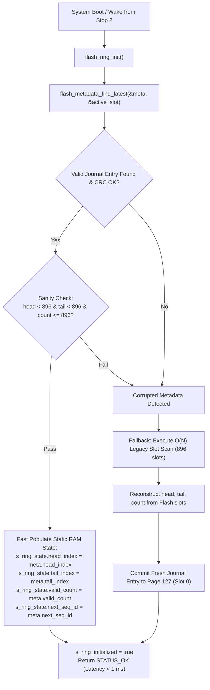

# Task Specification: S8-T1.2 - STM32WLE5 Fast Boot Flash Ring Recovery & State Caching

## 1. Task Metadata & Overview

| Attribute | Specification Details |
| :--- | :--- |
| **Sprint** | **Sprint 8: Firmware Performance Optimization & Flash Storage Hardening** |
| **Task ID** | `S8-T1.2` |
| **Parent Task** | `S8-T1: Implement Persistent Flash Ring Metadata & Fast Boot Recovery` |
| **Task Title** | Refactor `flash_ring_init()` for $O(1)$ Boot Recovery, Static RAM Caching & Getter Decoupling (`flash_storage`) |
| **Status** | **Ready for Implementation** |
| **Target Files** | [`firmware/middleware/inc/flash_storage.h`](file:///C:/Users/ENERGY%20SAVER/Documents/Learning/Job%20Projects/rain-predict/firmware/middleware/inc/flash_storage.h)<br>[`firmware/middleware/src/flash_storage.c`](file:///C:/Users/ENERGY%20SAVER/Documents/Learning/Job%20Projects/rain-predict/firmware/middleware/src/flash_storage.c) |
| **Related Documents** | [`context/audit/code-issues-github-copilot.md`](file:///C:/Users/ENERGY%20SAVER/Documents/Learning/Job%20Projects/rain-predict/context/audit/code-issues-github-copilot.md)<br>[`context/specs/s8-t1.1-persistent-ring-metadata.md`](file:///C:/Users/ENERGY%20SAVER/Documents/Learning/Job%20Projects/rain-predict/context/specs/s8-t1.1-persistent-ring-metadata.md)<br>[`context/specs/s5-t3.2-flash-ring-buffer.md`](file:///C:/Users/ENERGY%20SAVER/Documents/Learning/Job%20Projects/rain-predict/context/specs/s5-t3.2-flash-ring-buffer.md)<br>[`docs/architecture/power-architecture.md`](file:///C:/Users/ENERGY%20SAVER/Documents/Learning/Job%20Projects/rain-predict/docs/architecture/power-architecture.md)<br>[`context/coding-standards.md`](file:///C:/Users/ENERGY%20SAVER/Documents/Learning/Job%20Projects/rain-predict/context/coding-standards.md) |
| **Dependencies** | [`S8-T1.1`](file:///C:/Users/ENERGY%20SAVER/Documents/Learning/Job%20Projects/rain-predict/context/specs/s8-t1.1-persistent-ring-metadata.md) (Persistent Flash Ring Metadata Header & Journaling) |
| **Downstream Tasks** | `S8-T1.3` (Page Erase Tracking), `S8-T1.4` (Unit Tests), `S8-T5.1` (Boot Latency Profiling) |

---

## 2. Executive Summary & Problem Formulation

In battery-powered IoT stations waking from Stop 2 low-power mode or rebooting after watchdog events, boot duration directly dictates energy consumption. In [`flash_storage.c`](file:///C:/Users/ENERGY%20SAVER/Documents/Learning/Job%20Projects/rain-predict/firmware/middleware/src/flash_storage.c), initialization of the flash ring buffer previously relied on `flash_ring_init()` iterating over all 896 record slots:

```c
// Legacy code (S5-T3.2):
for (uint32_t i = 0; i < FLASH_RING_TOTAL_CAPACITY; i++) {
    flash_record_t rec;
    flash_storage_read_bytes(slot_addr, (uint8_t*)&rec, sizeof(rec));
    // Check magic, track tail and head...
}
```

This caused:
1. **Prolonged Wake-up Overhead**: Over $50\text{ ms}$ spent reading flash data on boot.
2. **Hidden $O(N)$ Invocations**: Getters such as `flash_ring_get_count()` implicitly called `flash_ring_init()` if an internal flag was not set, causing unpredictable latency spikes during regular operation.
3. **Flash Bus Congestion**: Flash bus reads competed with CPU execution during critical boot windows.

**`S8-T1.2`** refactors `flash_ring_init()` into an **$O(1)$ fast-boot state recovery engine**:
- **Primary Path ($O(1)$)**: Fast scan of Page 127 journal (maximum 64 slots, 32 bytes each). When a valid entry is found and verified via CRC-16 and bounds sanity, the runtime ring state in static RAM is populated immediately ($< 1\text{ ms}$).
- **Fallback Path ($O(N)$)**: Executed **only** if Page 127 is uninitialized (fresh hardware flash) or all journal entries fail CRC validation. In this event, a full 896-slot scan recovers the physical pointers and immediately writes a clean metadata entry to Page 127, ensuring subsequent reboots follow the fast path.
- **Getter Decoupling**: All getters (`flash_ring_get_count()`, `flash_ring_is_empty()`, `flash_ring_is_full()`) become non-reentrant pure reads of static RAM variables, with zero implicit flash operations.



---

## 3. Technical Requirements & Design Specifications

### 3.1 Fast Boot Sequence Specification

1. **Deterministic Initialization Timing**:
   - Primary journal recovery shall complete in $< 1.0\text{ ms}$ on STM32WLE5 @ 48 MHz.
   - Max flash read volume during primary boot: $64 \times 32\text{ bytes} = 2,048\text{ bytes}$ (1 Flash page).
2. **Static RAM Cache**:
   - `s_ring_state` holds `head_index`, `tail_index`, `valid_count`, `next_seq_id`, `is_full`, `is_empty`.
   - `s_active_metadata_slot` stores the journal slot index in Page 127 ($0\dots 63$) to avoid re-scanning on `flash_ring_push()` and `flash_ring_mark_transmitted()`.
   - `s_ring_initialized` tracks driver initialization state.
3. **Getter Purity**:
   - `flash_ring_get_count()`, `flash_ring_is_full()`, `flash_ring_is_empty()`, `flash_ring_get_head_index()`, and `flash_ring_get_tail_index()` shall never invoke `flash_ring_init()`.
   - If called prior to `flash_ring_init()`, getters return `0` or `false` without side effects.
4. **Resilient Fallback**:
   - If metadata is uninitialized or corrupted, the full scan reconstructs the exact ring geometry.
   - After fallback recovery, a valid metadata entry is written immediately to Page 127, healing the metadata partition automatically.

---

## 4. API Specification & Data Structures (`flash_storage.h`)

### 4.1 Driver Public Interface Updates

```c
/**
 * @brief  Initializes the Flash wear-leveling circular ring buffer.
 * @details Attempts fast O(1) recovery via Page 127 persistent metadata.
 *          Falls back to full 896-slot scan only if metadata is uninitialized
 *          or CRC integrity checks fail. Caches state in static RAM.
 * @return STATUS_OK on success, or error status code.
 */
status_t flash_ring_init(void);

/**
 * @brief  Checks whether the Flash ring buffer driver is initialized.
 * @return true if initialized, false otherwise.
 */
bool flash_ring_is_initialized(void);

/**
 * @brief  Forces a complete physical resynchronization and full slot scan.
 * @details Discards Page 127 metadata, performs an exhaustive 896-slot audit,
 *          and commits a fresh metadata entry. Intended for recovery and diagnostics.
 * @return STATUS_OK on success, or error status code.
 */
status_t flash_ring_rebuild_metadata(void);
```

### 4.2 Static State Variables (`flash_storage.c`)

```c
/** @brief Static RAM cached ring buffer state */
static flash_ring_state_t s_ring_state;

/** @brief Driver initialization flag */
static bool s_ring_initialized = false;

/** @brief Active metadata slot index in Page 127 (0..63) */
static uint32_t s_active_metadata_slot = 0;

/** @brief Cached active metadata record */
static flash_ring_metadata_t s_active_metadata;
```

---

## 5. Implementation Details & Algorithmic Logic

### 5.1 Refactored `flash_ring_init()` Implementation

```c
status_t flash_ring_init(void)
{
    status_t status;
    flash_ring_metadata_t meta;
    uint32_t active_slot = 0;

    // 1. Ensure low-level HAL driver is initialized
    status = flash_storage_init();
    if (status != STATUS_OK) {
        return status;
    }

    // 2. Attempt fast boot recovery from Page 127 metadata journal
    status = flash_metadata_find_latest(&meta, &active_slot);
    if (status == STATUS_OK && flash_metadata_is_consistent(&meta)) {
        // Fast path: load state directly into static RAM cache
        s_ring_state.head_index  = meta.head_index;
        s_ring_state.tail_index  = meta.tail_index;
        s_ring_state.valid_count = meta.valid_count;
        s_ring_state.next_seq_id = meta.next_seq_id;
        s_ring_state.is_full     = (meta.valid_count >= FLASH_RING_TOTAL_CAPACITY);
        s_ring_state.is_empty    = (meta.valid_count == 0U);

        s_active_metadata_slot   = active_slot;
        s_active_metadata        = meta;
        s_ring_initialized       = true;

        return STATUS_OK;
    }

    // 3. Fallback path: Full physical slot scan (executed once on uninitialized hardware)
    status = flash_ring_rebuild_metadata();
    return status;
}
```

### 5.2 Implementation of `flash_ring_rebuild_metadata()`

```c
status_t flash_ring_rebuild_metadata(void)
{
    status_t status;
    
    // Execute full 896-slot recovery scan
    status = flash_ring_scan_physical_slots(&s_ring_state);
    if (status != STATUS_OK) {
        return status;
    }

    // Prepare fresh metadata record
    memset(&s_active_metadata, 0, sizeof(s_active_metadata));
    s_active_metadata.magic           = FLASH_METADATA_MAGIC;
    s_active_metadata.generation      = 1U;
    s_active_metadata.head_index      = (uint16_t)s_ring_state.head_index;
    s_active_metadata.tail_index      = (uint16_t)s_ring_state.tail_index;
    s_active_metadata.valid_count     = (uint16_t)s_ring_state.valid_count;
    s_active_metadata.next_seq_id     = s_ring_state.next_seq_id;
    s_active_metadata.erased_page_mask = flash_storage_get_erased_mask();
    s_active_metadata.flags           = 0U;
    s_active_metadata.epoch           = 0U;
    s_active_metadata.timestamp_s     = 0U;

    // Erase Page 127 and write slot 0
    flash_storage_unlock();
    flash_storage_erase_page(FLASH_RING_METADATA_PAGE);
    flash_storage_lock();

    status = flash_metadata_commit(&s_active_metadata);
    if (status == STATUS_OK) {
        s_active_metadata_slot = 0;
        s_ring_initialized = true;
    }

    return status;
}
```

### 5.3 Decoupled Getters Implementation

```c
uint32_t flash_ring_get_count(void)
{
    if (!s_ring_initialized) {
        return 0U;
    }
    return s_ring_state.valid_count;
}

bool flash_ring_is_empty(void)
{
    if (!s_ring_initialized) {
        return true;
    }
    return s_ring_state.is_empty;
}

bool flash_ring_is_full(void)
{
    if (!s_ring_initialized) {
        return false;
    }
    return s_ring_state.is_full;
}
```

---

## 6. Verification, Unit Testing & Benchmarking Plan

### 6.1 Unit Test Cases in `tests/unit/test_flash_storage.c`

| Test ID | Objective | Input / Condition | Expected Result |
| :--- | :--- | :--- | :--- |
| `TEST_FASTBOOT_01` | Fast Boot Recovery | Pre-written metadata entry in Page 127 slot 3 | `flash_ring_init()` recovers exact head/tail/count in $O(1)$ without scanning Pages 120–126. |
| `TEST_FASTBOOT_02` | Uninitialized Fallback | Page 127 erased (`0xFF`) with 10 records in Page 120 | Recovers 10 records via fallback scan; commits slot 0 metadata. |
| `TEST_FASTBOOT_03` | Corrupt CRC Fallback | Corrupt CRC in metadata slot 0; valid records in flash | Rejects slot 0, runs full scan, rewrites valid metadata. |
| `TEST_FASTBOOT_04` | Getter Purity | Call `flash_ring_get_count()` without initializing | Returns `0`; verifies no underlying flash read or initialization. |
| `TEST_FASTBOOT_05` | Boot Speed Profile | Measure mock memory read iterations during boot | Primary boot reads $\le 64$ entries ($< 2\text{ KB}$); legacy read $896 \times 16 = 14,336\text{ bytes}$. |

---

## 7. Traceability Matrix & Definition of Done

### Traceability

| Requirement | Implementation Component | Verification Test |
| :--- | :--- | :--- |
| $O(1)$ Fast Boot Initialization | [`flash_ring_init()`](file:///C:/Users/ENERGY%20SAVER/Documents/Learning/Job%20Projects/rain-predict/firmware/middleware/src/flash_storage.c) | `TEST_FASTBOOT_01`, `TEST_FASTBOOT_05` |
| Resilient Automatic Fallback | [`flash_ring_rebuild_metadata()`](file:///C:/Users/ENERGY%20SAVER/Documents/Learning/Job%20Projects/rain-predict/firmware/middleware/src/flash_storage.c) | `TEST_FASTBOOT_02`, `TEST_FASTBOOT_03` |
| Pure Non-Reentrant Getters | `flash_ring_get_count()`, `is_empty()` | `TEST_FASTBOOT_04` |
| Static RAM Caching | `s_ring_state`, `s_active_metadata` | `TEST_FASTBOOT_01` |

### Definition of Done

- [ ] `flash_ring_init()` refactored to prioritize Page 127 metadata journal scan over full 896-slot traversal.
- [ ] Fallback scan automatically re-seeds Page 127 metadata with zero user intervention.
- [ ] All ring buffer getters decoupled from driver initialization.
- [ ] Zero compiler warnings under strict flags (`-Wall -Wextra -Wpedantic -Werror`).
