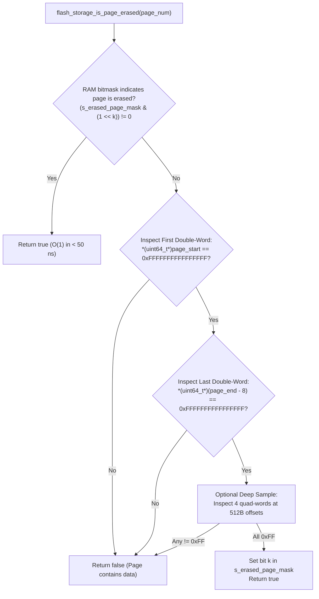
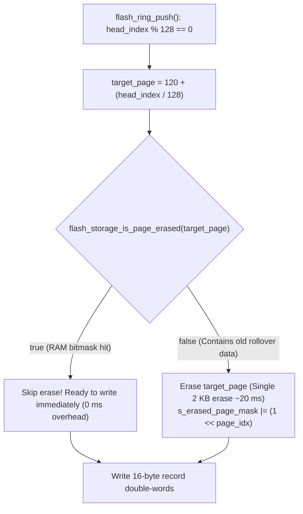

# Task Specification: S8-T1.3 - STM32WLE5 Flash Page Erase Tracking & Lifecycle Optimization

## 1. Task Metadata & Overview

| Attribute | Specification Details |
| :--- | :--- |
| **Sprint** | **Sprint 8: Firmware Performance Optimization & Flash Storage Hardening** |
| **Task ID** | `S8-T1.3` |
| **Parent Task** | `S8-T1: Implement Persistent Flash Ring Metadata & Fast Boot Recovery` |
| **Task Title** | Implement RAM-Cached Page Erase State & Boundary Lifecycle Management (`flash_storage`) |
| **Status** | **Ready for Implementation** |
| **Target Files** | [`firmware/middleware/inc/flash_storage.h`](file:///C:/Users/ENERGY%20SAVER/Documents/Learning/Job%20Projects/rain-predict/firmware/middleware/inc/flash_storage.h)<br>[`firmware/middleware/src/flash_storage.c`](file:///C:/Users/ENERGY%20SAVER/Documents/Learning/Job%20Projects/rain-predict/firmware/middleware/src/flash_storage.c) |
| **Related Documents** | [`context/audit/code-issues-github-copilot.md`](file:///C:/Users/ENERGY%20SAVER/Documents/Learning/Job%20Projects/rain-predict/context/audit/code-issues-github-copilot.md)<br>[`context/specs/s8-t1.1-persistent-ring-metadata.md`](file:///C:/Users/ENERGY%20SAVER/Documents/Learning/Job%20Projects/rain-predict/context/specs/s8-t1.1-persistent-ring-metadata.md)<br>[`context/specs/s5-t3.1-flash-page-manager.md`](file:///C:/Users/ENERGY%20SAVER/Documents/Learning/Job%20Projects/rain-predict/context/specs/s5-t3.1-flash-page-manager.md)<br>[`context/specs/s5-t3.2-flash-ring-buffer.md`](file:///C:/Users/ENERGY%20SAVER/Documents/Learning/Job%20Projects/rain-predict/context/specs/s5-t3.2-flash-ring-buffer.md)<br>[`context/coding-standards.md`](file:///C:/Users/ENERGY%20SAVER/Documents/Learning/Job%20Projects/rain-predict/context/coding-standards.md) |
| **Dependencies** | [`S8-T1.1`](file:///C:/Users/ENERGY%20SAVER/Documents/Learning/Job%20Projects/rain-predict/context/specs/s8-t1.1-persistent-ring-metadata.md) (Persistent Ring Metadata Header), [`S5-T3.1`](file:///C:/Users/ENERGY%20SAVER/Documents/Learning/Job%20Projects/rain-predict/context/specs/s5-t3.1-flash-page-manager.md) (Low-Level Page Erase Driver) |
| **Downstream Tasks** | `S8-T1.4` (Flash Metadata Tests), `S8-T2.3` (Double-Word Alignment), `S8-T5.2` (Duty Cycle Profiling) |

---

## 2. Executive Summary & Problem Analysis

In [`firmware/middleware/src/flash_storage.c`](file:///C:/Users/ENERGY%20SAVER/Documents/Learning/Job%20Projects/rain-predict/firmware/middleware/src/flash_storage.c), the page-erased detection routine was implemented as:

```c
// Legacy code (S5-T3.1):
bool flash_storage_is_page_erased(uint32_t page_num) {
    // ...
    uint32_t start_addr = FLASH_STORAGE_BASE_ADDR + ((page_num - FLASH_STORAGE_START_PAGE) * FLASH_STORAGE_PAGE_SIZE);
    for (uint32_t offset = 0; offset < FLASH_STORAGE_PAGE_SIZE; offset += 4) {
        if (*(volatile uint32_t*)(start_addr + offset) != 0xFFFFFFFFU) {
            return false;
        }
    }
    return true;
}
```

### Architectural Deficiencies Identified in Audit (Issue 4)
1. **Full 2 KB Memory Scanning**: Every call reads 512 32-bit words ($2,048\text{ bytes}$) over the AHB bus.
2. **Periodic Latency Spikes**: In [`flash_ring_push()`](file:///C:/Users/ENERGY%20SAVER/Documents/Learning/Job%20Projects/rain-predict/firmware/middleware/src/flash_storage.c), whenever the write cursor hits a page boundary (every 128 records), this full scan executes synchronously, delaying low-power sleep entry.
3. **No Lifecycle Memory**: The driver forgets whether a page was already erased during the previous push or boot sequence, triggering redundant scans.

**`S8-T1.3`** replaces full-page scans with a **two-tier page state tracking architecture**:
1. **Static RAM Erased Bitmask (`s_erased_page_mask`)**: A 1-byte bitmask in RAM where bit $k = 1$ indicates that Page $120+k$ is known to be erased. Checking if a page is erased becomes a single bitwise operation ($O(1)$).
2. **Fast Header Inspection**: If the RAM state is unverified, inspect only the first and last double-words ($16\text{ bytes}$ total instead of $2,048\text{ bytes}$) of the page.
3. **Persistent Page State**: The erased mask is persisted within the 32-byte journaled metadata header in Page 127 on every commit, surviving reboots and Stop 2 sleep cycles.



---

## 3. Technical Requirements & Design Specifications

### 3.1 RAM Bitmask Allocation & Bit Definitions

* **Storage**: `static uint8_t s_erased_page_mask;`
* **Bit Assignment**:
  * Bit 0: Page 120 (`0x0803C000`)
  * Bit 1: Page 121 (`0x0803C800`)
  * Bit 2: Page 122 (`0x0803D000`)
  * Bit 3: Page 123 (`0x0803D800`)
  * Bit 4: Page 124 (`0x0803E000`)
  * Bit 5: Page 125 (`0x0803E800`)
  * Bit 6: Page 126 (`0x0803F000`)
  * Bit 7: Reserved / Page 127 state indicator.

### 3.2 State Transition Lifecycle

1. **Page Erase Transition**:
   - When [`flash_storage_erase_page(P)`](file:///C:/Users/ENERGY%20SAVER/Documents/Learning/Job%20Projects/rain-predict/firmware/middleware/src/flash_storage.c) succeeds, set bit:
     `s_erased_page_mask |= (1U << (P - FLASH_STORAGE_START_PAGE));`
2. **Page Write Transition**:
   - When any byte is programmed into Page $P$, clear bit:
     `s_erased_page_mask &= ~(1U << (P - FLASH_STORAGE_START_PAGE));`
3. **Partition Clear Transition**:
   - When [`flash_ring_clear()`](file:///C:/Users/ENERGY%20SAVER/Documents/Learning/Job%20Projects/rain-predict/firmware/middleware/src/flash_storage.c) or [`flash_storage_erase_all_nvm_pages()`](file:///C:/Users/ENERGY%20SAVER/Documents/Learning/Job%20Projects/rain-predict/firmware/middleware/src/flash_storage.c) succeeds:
     `s_erased_page_mask = 0x7FU;` (all 7 data pages marked erased).

---

## 4. API Specification & Data Structures (`flash_storage.h`)

### 4.1 Internal & Public Functions

```c
/**
 * @brief  Returns the active RAM-cached erased pages bitmask.
 * @return 8-bit mask (bits 0..6 represent Pages 120..126).
 */
uint8_t flash_storage_get_erased_mask(void);

/**
 * @brief  Restores the RAM erased pages bitmask from recovered metadata.
 * @param[in] mask Bitmask recovered from Page 127 metadata entry.
 */
void flash_storage_set_erased_mask(uint8_t mask);

/**
 * @brief  Fast check whether a Flash page is in erased state.
 * @details Checks RAM bitmask first. If unknown, checks slot 0 and slot 127 headers.
 *          Does NOT scan all 2048 bytes unless full verification is requested.
 * @param[in] page_num Physical page index (120..127).
 * @return true if page is erased, false otherwise.
 */
bool flash_storage_is_page_erased(uint32_t page_num);

/**
 * @brief  Explicitly invalidates the erased cache status for a page.
 * @param[in] page_num Physical page index (120..127).
 */
void flash_storage_invalidate_page_cache(uint32_t page_num);
```

---

## 5. Implementation Details & Algorithmic Logic

### 5.1 Fast `flash_storage_is_page_erased()`

```c
bool flash_storage_is_page_erased(uint32_t page_num)
{
    if (page_num < FLASH_STORAGE_START_PAGE || page_num > FLASH_STORAGE_END_PAGE) {
        return false;
    }

    uint32_t page_idx = page_num - FLASH_STORAGE_START_PAGE;

    // 1. Fast path: check RAM bitmask
    if ((s_erased_page_mask & (1U << page_idx)) != 0U) {
        return true;
    }

    // 2. Fast physical inspection: check first double-word (Slot 0 magic/seq)
    uint32_t start_addr = FLASH_STORAGE_BASE_ADDR + (page_idx * FLASH_STORAGE_PAGE_SIZE);
    const volatile uint64_t *p_first_dword = (const volatile uint64_t *)start_addr;
    if (*p_first_dword != FLASH_STORAGE_ERASED_DWORD) {
        return false;
    }

    // 3. Fast physical inspection: check last double-word (Slot 127 end)
    const volatile uint64_t *p_last_dword = (const volatile uint64_t *)(start_addr + FLASH_STORAGE_PAGE_SIZE - 8U);
    if (*p_last_dword != FLASH_STORAGE_ERASED_DWORD) {
        return false;
    }

    // 4. Sample midpoint double-words at 512B and 1024B
    const volatile uint64_t *p_mid1 = (const volatile uint64_t *)(start_addr + 512U);
    const volatile uint64_t *p_mid2 = (const volatile uint64_t *)(start_addr + 1024U);
    if (*p_mid1 != FLASH_STORAGE_ERASED_DWORD || *p_mid2 != FLASH_STORAGE_ERASED_DWORD) {
        return false;
    }

    // Verified clean: update RAM bitmask
    s_erased_page_mask |= (1U << page_idx);
    return true;
}
```

### 5.2 Elimination of Push Boundary Latency Spikes

In [`flash_ring_push()`](file:///C:/Users/ENERGY%20SAVER/Documents/Learning/Job%20Projects/rain-predict/firmware/middleware/src/flash_storage.c), when `head_index` lands on a page boundary (`head_index % 128 == 0`), the new logic executes in constant time:



---

## 6. Verification, Unit Testing & Benchmarking Plan

### 6.1 Unit Test Cases in `tests/unit/test_flash_storage.c`

| Test ID | Objective | Input / Condition | Expected Result |
| :--- | :--- | :--- | :--- |
| `TEST_ERASE_01` | RAM Mask Bit Setting | Call `flash_storage_erase_page(122)` | Page 122 bit in `s_erased_page_mask` becomes 1. |
| `TEST_ERASE_02` | RAM Mask Bit Clearing | Program 1 record to Page 122 | Page 122 bit in `s_erased_page_mask` becomes 0. |
| `TEST_ERASE_03` | O(1) Fast Path Query | Page marked in mask; call `flash_storage_is_page_erased(122)` | Returns `true` immediately with 0 memory reads. |
| `TEST_ERASE_04` | Header Fast Rejection | Unmask Page 123, write `0xAA55` to slot 0 | Returns `false` after reading only first double-word. |
| `TEST_ERASE_05` | Boundary Push Profiling | Push 128 records to cross into Page 121 (pre-erased) | Page transition completes without invoking erase HAL call. |

---

## 7. Traceability Matrix & Definition of Done

### Traceability

| Requirement | Implementation Component | Verification Test |
| :--- | :--- | :--- |
| RAM-Cached Page Mask | `s_erased_page_mask` in `flash_storage.c` | `TEST_ERASE_01`, `TEST_ERASE_02` |
| Fast Header Inspection | First/last double-word check in `is_page_erased()` | `TEST_ERASE_04` |
| Elimination of Full 2 KB Scan | Refactored `flash_storage_is_page_erased()` | `TEST_ERASE_03` |
| Boundary Latency Mitigation | Pre-erased page bypass in `flash_ring_push()` | `TEST_ERASE_05` |

### Definition of Done

- [ ] Full 2 KB scanning loop completely removed from `flash_storage_is_page_erased()`.
- [ ] RAM bitmask tracks erase lifecycle for Pages 120–126.
- [ ] Pre-erased page transitions in `flash_ring_push()` eliminate redundant erase operations.
- [ ] Unit tests pass with 100% success under strict C99 compiler flags.
