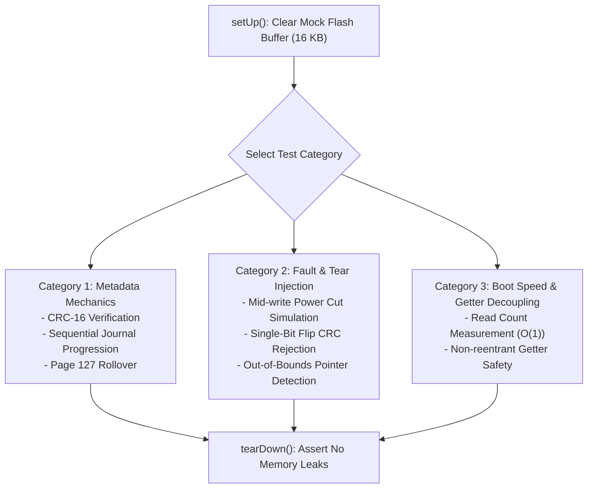

# Task Specification: S8-T1.4 - Flash Metadata Journaling & Fast Boot Unit Test Suite

## 1. Task Metadata & Overview

| Attribute | Specification Details |
| :--- | :--- |
| **Sprint** | **Sprint 8: Firmware Performance Optimization & Flash Storage Hardening** |
| **Task ID** | `S8-T1.4` |
| **Parent Task** | `S8-T1: Implement Persistent Flash Ring Metadata & Fast Boot Recovery` |
| **Task Title** | Develop Unit Test Suite for Persistent Metadata Journaling, Power-Cut Resilience & Fast Boot Recovery |
| **Status** | **Ready for Implementation** |
| **Target Files** | [`tests/unit/test_flash_storage.c`](file:///C:/Users/ENERGY%20SAVER/Documents/Learning/Job%20Projects/rain-predict/tests/unit/test_flash_storage.c)<br>[`firmware/middleware/inc/flash_storage.h`](file:///C:/Users/ENERGY%20SAVER/Documents/Learning/Job%20Projects/rain-predict/firmware/middleware/inc/flash_storage.h) |
| **Related Documents** | [`context/specs/s8-t1.1-persistent-ring-metadata.md`](file:///C:/Users/ENERGY%20SAVER/Documents/Learning/Job%20Projects/rain-predict/context/specs/s8-t1.1-persistent-ring-metadata.md)<br>[`context/specs/s8-t1.2-fast-boot-recovery.md`](file:///C:/Users/ENERGY%20SAVER/Documents/Learning/Job%20Projects/rain-predict/context/specs/s8-t1.2-fast-boot-recovery.md)<br>[`context/specs/s8-t1.3-page-erase-tracking.md`](file:///C:/Users/ENERGY%20SAVER/Documents/Learning/Job%20Projects/rain-predict/context/specs/s8-t1.3-page-erase-tracking.md)<br>[`context/specs/s5-t3.4-test-flash-storage.md`](file:///C:/Users/ENERGY%20SAVER/Documents/Learning/Job%20Projects/rain-predict/context/specs/s5-t3.4-test-flash-storage.md)<br>[`context/coding-standards.md`](file:///C:/Users/ENERGY%20SAVER/Documents/Learning/Job%20Projects/rain-predict/context/coding-standards.md) |
| **Dependencies** | [`S8-T1.1`](file:///C:/Users/ENERGY%20SAVER/Documents/Learning/Job%20Projects/rain-predict/context/specs/s8-t1.1-persistent-ring-metadata.md), [`S8-T1.2`](file:///C:/Users/ENERGY%20SAVER/Documents/Learning/Job%20Projects/rain-predict/context/specs/s8-t1.2-fast-boot-recovery.md), [`S8-T1.3`](file:///C:/Users/ENERGY%20SAVER/Documents/Learning/Job%20Projects/rain-predict/context/specs/s8-t1.3-page-erase-tracking.md) |
| **Downstream Tasks** | `S8-T2.4` (Flash Benchmark Tests), `S8-T5.1` (Boot Latency Benchmarks), `S8-T5.3` (Automated Regression Suite) |

---

## 2. Executive Summary & Testing Objectives

The addition of persistent journaled metadata in Flash Page 127 introduces critical state machines that govern node boot recovery and power-loss resilience. In tea estate deployments subject to severe lightning strikes, transient brownouts, and periodic battery cutoffs, the firmware must guarantee:
1. **Zero State Corruption on Power-Cut**: Interruption during any 64-bit double-word write to Page 127 must not brick the storage engine; the recovery logic must gracefully revert to the preceding valid journal entry.
2. **Deterministic $O(1)$ Recovery**: Warm boot must initialize runtime ring state by reading $\le 64$ entries without scanning 896 record slots across Pages 120–126.
3. **Automatic Healing**: Corrupted metadata must trigger fallback physical scanning and immediately re-seed a pristine metadata record in Page 127.

**`S8-T1.4`** specifies a rigorous suite of Unity unit tests in [`tests/unit/test_flash_storage.c`](file:///C:/Users/ENERGY%20SAVER/Documents/Learning/Job%20Projects/rain-predict/tests/unit/test_flash_storage.c) to validate metadata generation progression, rollover, power-cut tearing, and bit-level corruption recovery.



---

## 3. Test Suite Architecture & Fault Injection Harness

### 3.1 Mock Flash Fault Injection Hooks

The test harness leverages the host mock flash buffer ($16\text{ KB}$ representing Pages 120–127) and adds targeted fault injection hooks:

```c
/** @brief Injects a simulated brownout at a specific write call count */
void mock_flash_inject_power_cut_after_dwords(uint32_t count);

/** @brief Injects a bit flip at an exact physical flash address */
void mock_flash_flip_bit(uint32_t address, uint8_t bit_idx);

/** @brief Counter tracking total flash read byte operations */
extern uint32_t g_mock_flash_read_bytes_count;

/** @brief Counter tracking total flash write dword operations */
extern uint32_t g_mock_flash_write_dword_count;
```

---

## 4. Test Case Specifications

### 4.1 Metadata Journaling & Rollover Test Cases

#### `test_metadata_crc16_standard_vectors(void)`
- **Goal**: Validate CRC-16 implementation against CCITT reference vectors.
- **Procedure**:
  1. Feed standard test vector ASCII string `"123456789"` ($9\text{ bytes}$).
  2. Assert calculated CRC matches reference value `0x29B1` (or polynomial `0x1021` standard).
  3. Verify empty buffer returns initial value `0xFFFF`.

#### `test_metadata_journal_sequential_progression(void)`
- **Goal**: Verify journal increments generation and tracks pointers across multiple commits.
- **Procedure**:
  1. Call `flash_ring_init()` on empty partition.
  2. Push 5 separate telemetry records with sequence IDs 100, 101, 102, 103, 104.
  3. Inspect Page 127 slots 0 through 4 directly in mock flash.
  4. Assert slots 0–4 have `generation` values $1, 2, 3, 4, 5$.
  5. Assert slot 4 contains `head_index == 5`, `valid_count == 5`, and valid CRC-16.

#### `test_metadata_page127_rollover_at_64_entries(void)`
- **Goal**: Verify seamless rollover when Page 127 exhausts its 64 journal slots.
- **Procedure**:
  1. Commit 64 sequential metadata entries to fill Page 127 completely.
  2. Verify mock flash Page 127 slot 63 is active with `generation == 64` and `epoch == 0`.
  3. Commit 65th entry.
  4. Assert Page 127 was erased and re-written at slot 0 with `generation == 65` and `epoch == 1`.
  5. Verify slots 1 through 63 in Page 127 are in erased state (`0xFF`).

---

### 4.2 Fault Injection, Brownout & Corruption Test Cases

#### `test_metadata_power_cut_during_entry_write(void)`
- **Goal**: Verify power loss during a 32-byte metadata commit leaves the previous entry valid.
- **Procedure**:
  1. Push 3 valid records (slots 0, 1, 2 written in Page 127).
  2. Configure mock hook: `mock_flash_inject_power_cut_after_dwords(2);` (simulates brownout after writing 16 of 32 bytes for slot 3).
  3. Attempt `flash_ring_push()`. The write fails midway with `STATUS_ERR_HARDWARE`.
  4. Simulate reboot by calling `flash_ring_init()`.
  5. Assert `flash_ring_init()` detects torn write in slot 3 (CRC or magic invalid).
  6. Assert driver automatically recovers slot 2 as the active entry.
  7. Verify ring state matches 3 valid records with zero data corruption.

#### `test_metadata_crc_corruption_fallback_and_self_heal(void)`
- **Goal**: Verify corrupted metadata triggers fallback full scan and self-heals Page 127.
- **Procedure**:
  1. Initialize ring and push 10 valid records into Page 120.
  2. Inject bit flip in active metadata entry CRC byte:
     `mock_flash_flip_bit(FLASH_STORAGE_BASE_ADDR + 7*2048 + 30, 0);`
  3. Re-initialize via `flash_ring_init()`.
  4. Assert driver rejects corrupted metadata, falls back to physical slot scan, and recovers all 10 records.
  5. Assert driver automatically re-seeds Page 127 slot 0 with a valid metadata entry.
  6. Call `flash_ring_init()` again; assert second boot completes via $O(1)$ fast path.

---

### 4.3 Fast Boot Timing & Getter Purity Test Cases

#### `test_fast_boot_read_volume_benchmark(void)`
- **Goal**: Ensure fast boot reads $\le 2\text{ KB}$ vs legacy $14.3\text{ KB}$.
- **Procedure**:
  1. Populate ring with 400 valid records.
  2. Reset read byte counter: `g_mock_flash_read_bytes_count = 0;`
  3. Execute `flash_ring_init()`.
  4. Assert total bytes read $\le 2048\text{ bytes}$ ($64 \times 32\text{ B}$).
  5. Confirm ring state: `head_index == 400`, `valid_count == 400`.

#### `test_getters_decoupled_from_init(void)`
- **Goal**: Verify getters never trigger flash reads or implicit initialization.
- **Procedure**:
  1. Reset all static driver variables (`s_ring_initialized = false`).
  2. Reset read counter: `g_mock_flash_read_bytes_count = 0;`
  3. Call `flash_ring_get_count()`, `flash_ring_is_empty()`, `flash_ring_is_full()`.
  4. Assert return values are `0`, `true`, and `false`.
  5. Assert `g_mock_flash_read_bytes_count == 0` (zero flash activity).

---

## 5. Traceability Matrix & Definition of Done

### Traceability

| Requirement | Test Function | Success Criteria |
| :--- | :--- | :--- |
| CRC-16 CCITT Accuracy | `test_metadata_crc16_standard_vectors` | Exact match with test vector |
| Journal Slot Progression | `test_metadata_journal_sequential_progression` | Generation $1\dots 5$ verified |
| Page 127 Rollover | `test_metadata_page127_rollover_at_64_entries` | Slot 63 rolls to Slot 0, Epoch 1 |
| Brownout Tear Resilience | `test_metadata_power_cut_during_entry_write` | Previous slot recovered cleanly |
| Self-Healing Fallback | `test_metadata_crc_corruption_fallback_and_self_heal` | State rebuilt and slot 0 re-written |
| $O(1)$ Boot Flash Traffic | `test_fast_boot_read_volume_benchmark` | $\le 2,048\text{ bytes}$ read |
| Getter Decoupling | `test_getters_decoupled_from_init` | Zero reads before initialization |

### Definition of Done

- [ ] All specified test cases implemented in [`tests/unit/test_flash_storage.c`](file:///C:/Users/ENERGY%20SAVER/Documents/Learning/Job%20Projects/rain-predict/tests/unit/test_flash_storage.c).
- [ ] 100% pass rate achieved on host test runner.
- [ ] Code coverage on metadata and fast boot routines exceeds 95%.
- [ ] Zero static analysis issues or memory leaks.
