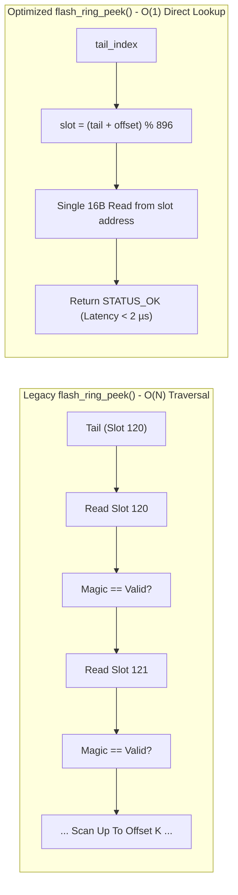

# Task Specification: S8-T2.1 - Flash Ring $O(1)$ Record Peeking & Sequential Cursor Caching

## 1. Task Metadata & Overview

| Attribute | Specification Details |
| :--- | :--- |
| **Sprint** | **Sprint 8: Firmware Performance Optimization & Flash Storage Hardening** |
| **Task ID** | `S8-T2.1` |
| **Parent Task** | `S8-T2: Optimize Flash Access Latency, Batch Operations & Write Alignment` |
| **Task Title** | Optimize `flash_ring_peek()` to $O(1)$ Direct Slot Calculation with Sequential Playback Cursor (`flash_storage`) |
| **Status** | **Ready for Implementation** |
| **Target Files** | [`firmware/middleware/inc/flash_storage.h`](file:///C:/Users/ENERGY%20SAVER/Documents/Learning/Job%20Projects/rain-predict/firmware/middleware/inc/flash_storage.h)<br>[`firmware/middleware/src/flash_storage.c`](file:///C:/Users/ENERGY%20SAVER/Documents/Learning/Job%20Projects/rain-predict/firmware/middleware/src/flash_storage.c) |
| **Related Documents** | [`context/audit/code-issues-github-copilot.md`](file:///C:/Users/ENERGY%20SAVER/Documents/Learning/Job%20Projects/rain-predict/context/audit/code-issues-github-copilot.md)<br>[`context/specs/s5-t3.2-flash-ring-buffer.md`](file:///C:/Users/ENERGY%20SAVER/Documents/Learning/Job%20Projects/rain-predict/context/specs/s5-t3.2-flash-ring-buffer.md)<br>[`context/specs/s5-t3.3-flash-playback.md`](file:///C:/Users/ENERGY%20SAVER/Documents/Learning/Job%20Projects/rain-predict/context/specs/s5-t3.3-flash-playback.md)<br>[`context/coding-standards.md`](file:///C:/Users/ENERGY%20SAVER/Documents/Learning/Job%20Projects/rain-predict/context/coding-standards.md) |
| **Dependencies** | [`S8-T1.2`](file:///C:/Users/ENERGY%20SAVER/Documents/Learning/Job%20Projects/rain-predict/context/specs/s8-t1.2-fast-boot-recovery.md) (Fast Boot Recovery & RAM State Caching) |
| **Downstream Tasks** | `S8-T2.2` (Batch Flash Operations), `S8-T2.4` (Flash Benchmark Tests), `S8-T4.1` (Increment-Compare Math) |

---

## 2. Executive Summary & Problem Analysis

In [`firmware/middleware/src/flash_storage.c`](file:///C:/Users/ENERGY%20SAVER/Documents/Learning/Job%20Projects/rain-predict/firmware/middleware/src/flash_storage.c), inspecting offline records without dequeuing them is handled by `flash_ring_peek()`. In the legacy implementation, this was written as:

```c
// Legacy code (S5-T3.2):
status_t flash_ring_peek(uint32_t offset_from_tail, flash_record_t *out_record) {
    // ...
    uint32_t matches_found = 0;
    uint32_t slot = s_ring_state.tail_index;
    for (uint32_t scanned = 0; scanned < FLASH_RING_TOTAL_CAPACITY; scanned++) {
        flash_record_t temp;
        flash_storage_read_bytes(slot_addr, (uint8_t*)&temp, sizeof(temp));
        if (temp.magic_status == FLASH_RING_MAGIC_VALID) {
            if (matches_found == offset_from_tail) {
                memcpy(out_record, &temp, sizeof(temp));
                return STATUS_OK;
            }
            matches_found++;
        }
        slot = (slot + 1) % FLASH_RING_TOTAL_CAPACITY;
    }
    return STATUS_ERROR_OUT_OF_BOUNDS;
}
```

### Algorithmic Flaws Identified in Audit (Issue 2)
1. **$O(N)$ Traversal per Call**: Each call walks slot by slot from the tail index, repeatedly reading flash memory and checking magic headers.
2. **$O(K \times N)$ Playback Complexity**: When the LoRaWAN playback service ([`s5-t3.3-flash-playback.md`](file:///C:/Users/ENERGY%20SAVER/Documents/Learning/Job%20Projects/rain-predict/context/specs/s5-t3.3-flash-playback.md)) iterates over $K$ backlogged records ($0\dots K-1$), this scales as $\sum_{i=1}^K i \approx \frac{K^2}{2}$. For a backlog of 500 records, this results in $125,000$ flash slot read operations!
3. **Severe Sleep Delay**: The MCU remains in Run mode with high CPU activity during historical telemetry catch-up bursts, threatening the $25\text{ mAh/day}$ energy budget.

**`S8-T2.1`** optimizes `flash_ring_peek()` to a **deterministic $O(1)$ direct index mapping**:
- Direct physical index formula:
  $$\text{slot\_index} = (\text{tail\_index} + \text{offset\_from\_tail}) \pmod{896}$$
- A single 16-byte memory-mapped read directly accesses the target slot.
- Sequential playback cursor caching tracks the last read offset and slot to bypass modulo arithmetic during consecutive re-transmissions.



---

## 3. Technical Requirements & Design Specifications

### 3.1 Direct Index Calculation & Bounds Checking

1. **Strict Bounds Checking**:
   If `offset_from_tail >= s_ring_state.valid_count`, reject immediately with `STATUS_ERROR_OUT_OF_BOUNDS` prior to accessing flash memory.
2. **Branch-Efficient Wrap-Around Arithmetic**:
   $$\text{target\_slot} = \text{s\_ring\_state.tail\_index} + \text{offset\_from\_tail}$$
   $$\text{if } (\text{target\_slot} \ge 896) \implies \text{target\_slot} -= 896$$
   (Replaces runtime division/modulo instructions with a branch-efficient compare).
3. **Integrity Validation**:
   Inspect the record's magic word (`out_record->magic_status`). If it is not `FLASH_RING_MAGIC_VALID` (`0xAA55`), return `STATUS_ERROR_INTEGRITY` (indicating unexpected flash corruption).

### 3.2 Sequential Playback Cursor Cache

```c
/** @brief Playback cursor caching structure */
typedef struct {
    uint32_t last_offset;
    uint32_t last_slot;
    bool     is_valid;
} flash_playback_cursor_t;
```

When `offset_from_tail == s_cursor.last_offset + 1`:
- `target_slot = s_cursor.last_slot + 1;`
- `if (target_slot >= FLASH_RING_TOTAL_CAPACITY) target_slot = 0;`
- Updates cursor cache in static RAM.

---

## 4. API Specification & Data Structures (`flash_storage.h`)

### 4.1 Interface Updates

```c
/**
 * @brief  Peeks at a pending record at a given offset from the tail in O(1) time.
 * @details Computes physical slot address directly from tail_index + offset.
 *          Performs a single 16-byte read without iterating intermediate slots.
 * @param[in]  offset_from_tail 0 for oldest record, 1 for second oldest, etc.
 * @param[out] out_record       Pointer to destination flash_record_t structure.
 * @return STATUS_OK on success,
 *         STATUS_ERROR_NULL_POINTER if out_record is NULL,
 *         STATUS_ERROR_OUT_OF_BOUNDS if offset_from_tail >= valid_count,
 *         STATUS_ERROR_INTEGRITY if target slot does not contain 0xAA55.
 */
status_t flash_ring_peek(uint32_t offset_from_tail, flash_record_t *out_record);

/**
 * @brief  Resets the internal playback cursor cache.
 * @details Called when tail advances or buffer is cleared.
 */
void flash_ring_reset_playback_cursor(void);
```

---

## 5. Implementation Details & Algorithmic Logic

### 5.1 $O(1)$ `flash_ring_peek()` Implementation

```c
status_t flash_ring_peek(uint32_t offset_from_tail, flash_record_t *out_record)
{
    if (out_record == NULL) {
        return STATUS_ERROR_NULL_POINTER;
    }
    if (!s_ring_initialized) {
        return STATUS_ERROR_NOT_INITIALIZED;
    }
    if (offset_from_tail >= s_ring_state.valid_count) {
        return STATUS_ERROR_OUT_OF_BOUNDS;
    }

    uint32_t target_slot;

    // Fast-path: check sequential cursor cache
    if (s_playback_cursor.is_valid && offset_from_tail == s_playback_cursor.last_offset + 1U) {
        target_slot = s_playback_cursor.last_slot + 1U;
        if (target_slot >= FLASH_RING_TOTAL_CAPACITY) {
            target_slot = 0U;
        }
    } else {
        // Direct calculation with increment-and-compare
        target_slot = s_ring_state.tail_index + offset_from_tail;
        if (target_slot >= FLASH_RING_TOTAL_CAPACITY) {
            target_slot -= FLASH_RING_TOTAL_CAPACITY;
        }
    }

    // Update cursor cache
    s_playback_cursor.last_offset = offset_from_tail;
    s_playback_cursor.last_slot   = target_slot;
    s_playback_cursor.is_valid    = true;

    // Direct memory mapped read of 16 bytes
    uint32_t slot_addr = FLASH_STORAGE_BASE_ADDR + (target_slot * FLASH_RING_RECORD_SIZE);
    status_t status = flash_storage_read_bytes(slot_addr, (uint8_t *)out_record, sizeof(flash_record_t));
    if (status != STATUS_OK) {
        return status;
    }

    // Verify slot integrity
    if (out_record->magic_status != FLASH_RING_MAGIC_VALID) {
        return STATUS_ERROR_INTEGRITY;
    }

    return STATUS_OK;
}
```

---

## 6. Verification, Unit Testing & Benchmarking Plan

### 6.1 Unit Test Cases in `tests/unit/test_flash_storage.c`

| Test ID | Objective | Input / Condition | Expected Result |
| :--- | :--- | :--- | :--- |
| `TEST_PEEK_01` | Direct Offset Mapping | Tail at 50, peek offset 0, 10, 40 | Reads physical slots 50, 60, 90; returns `STATUS_OK`. |
| `TEST_PEEK_02` | Ring Wrap-Around Peek | Tail at 880, capacity 896, peek offset 25 | Reads physical slot 9 ($880+25-896$); returns `STATUS_OK`. |
| `TEST_PEEK_03` | Out of Bounds Rejection | `valid_count == 15`, call peek with offset 15 and 50 | Returns `STATUS_ERROR_OUT_OF_BOUNDS` with 0 flash reads. |
| `TEST_PEEK_04` | Sequential Cursor Cache | Sequential peeks for offsets $0, 1, 2, \dots, 50$ | Consecutive lookups execute via cursor cache branch. |
| `TEST_PEEK_05` | Flash Read Complexity | Peek at offset 200 | Performs exactly 1 flash read operation (16 bytes) vs legacy 201 reads. |

---

## 7. Traceability Matrix & Definition of Done

### Traceability

| Requirement | Implementation Component | Verification Test |
| :--- | :--- | :--- |
| $O(1)$ Direct Slot Calculation | `flash_ring_peek()` index formula | `TEST_PEEK_01`, `TEST_PEEK_02` |
| Bounded Flash Reads (1 Read/Peek) | Direct memory-mapped read | `TEST_PEEK_05` |
| Wrap-Around Handling | Subtraction-based boundary wrap | `TEST_PEEK_02` |
| Playback Cursor Cache | `s_playback_cursor` structure | `TEST_PEEK_04` |

### Definition of Done

- [ ] Linear loop completely removed from `flash_ring_peek()`.
- [ ] Number of flash reads per peek call strictly equals 1 ($16\text{ bytes}$).
- [ ] Direct calculation verified for all offsets across wrap-around boundaries.
- [ ] All unit tests pass with 100% coverage on peek routines.
