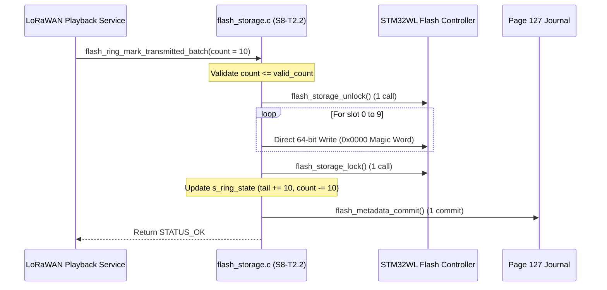

# Task Specification: S8-T2.2 - Batch Flash Operations & Single Unlock/Lock Lifecycle

## 1. Task Metadata & Overview

| Attribute | Specification Details |
| :--- | :--- |
| **Sprint** | **Sprint 8: Firmware Performance Optimization & Flash Storage Hardening** |
| **Task ID** | `S8-T2.2` |
| **Parent Task** | `S8-T2: Optimize Flash Access Latency, Batch Operations & Write Alignment` |
| **Task Title** | Implement `flash_ring_mark_transmitted_batch()` with Single Unlock/Lock Cycle (`flash_storage`) |
| **Status** | **Ready for Implementation** |
| **Target Files** | [`firmware/middleware/inc/flash_storage.h`](file:///C:/Users/ENERGY%20SAVER/Documents/Learning/Job%20Projects/rain-predict/firmware/middleware/inc/flash_storage.h)<br>[`firmware/middleware/src/flash_storage.c`](file:///C:/Users/ENERGY%20SAVER/Documents/Learning/Job%20Projects/rain-predict/firmware/middleware/src/flash_storage.c) |
| **Related Documents** | [`context/audit/code-issues-github-copilot.md`](file:///C:/Users/ENERGY%20SAVER/Documents/Learning/Job%20Projects/rain-predict/context/audit/code-issues-github-copilot.md)<br>[`context/specs/s8-t1.1-persistent-ring-metadata.md`](file:///C:/Users/ENERGY%20SAVER/Documents/Learning/Job%20Projects/rain-predict/context/specs/s8-t1.1-persistent-ring-metadata.md)<br>[`context/specs/s5-t3.2-flash-ring-buffer.md`](file:///C:/Users/ENERGY%20SAVER/Documents/Learning/Job%20Projects/rain-predict/context/specs/s5-t3.2-flash-ring-buffer.md)<br>[`context/specs/s5-t3.3-flash-playback.md`](file:///C:/Users/ENERGY%20SAVER/Documents/Learning/Job%20Projects/rain-predict/context/specs/s5-t3.3-flash-playback.md)<br>[`context/coding-standards.md`](file:///C:/Users/ENERGY%20SAVER/Documents/Learning/Job%20Projects/rain-predict/context/coding-standards.md) |
| **Dependencies** | [`S8-T1.1`](file:///C:/Users/ENERGY%20SAVER/Documents/Learning/Job%20Projects/rain-predict/context/specs/s8-t1.1-persistent-ring-metadata.md) (Persistent Ring Metadata), [`S8-T2.1`](file:///C:/Users/ENERGY%20SAVER/Documents/Learning/Job%20Projects/rain-predict/context/specs/s8-t2.1-o1-record-peeking.md) ($O(1)$ Record Peeking) |
| **Downstream Tasks** | `S8-T2.3` (Double-Word Write Alignment), `S8-T2.4` (Flash Benchmark Tests) |

---

## 2. Executive Summary & Problem Analysis

When a remote station reconnects to a field LoRaWAN gateway after a storm outage, it flushes backlogged records in multi-packet bursts ([`s5-t3.3-flash-playback.md`](file:///C:/Users/ENERGY%20SAVER/Documents/Learning/Job%20Projects/rain-predict/context/specs/s5-t3.3-flash-playback.md)). When downlink acknowledgements are received, the station marks these records as transmitted.

In the legacy code, [`flash_ring_mark_transmitted(count)`](file:///C:/Users/ENERGY%20SAVER/Documents/Learning/Job%20Projects/rain-predict/firmware/middleware/src/flash_storage.c) called [`flash_storage_write_bytes()`](file:///C:/Users/ENERGY%20SAVER/Documents/Learning/Job%20Projects/rain-predict/firmware/middleware/src/flash_storage.c) once for each individual record.

```c
// Legacy code (S5-T3.2):
for (uint32_t i = 0; i < count; i++) {
    uint16_t transmitted_magic = FLASH_RING_MAGIC_TRANSMITTED; // 0x0000
    uint32_t slot_addr = FLASH_STORAGE_BASE_ADDR + (curr_slot * FLASH_RING_RECORD_SIZE);
    flash_storage_write_bytes(slot_addr, (uint8_t*)&transmitted_magic, sizeof(uint16_t));
    // Each write_bytes() invokes flash_storage_unlock() and flash_storage_lock()!
}
```

### Architectural Deficiencies Identified in Audit (Issue 3)
1. **$2 \times K$ Redundant HAL Register Invocations**: For a burst acknowledgement of $K = 20$ records, the MCU executed 20 unlock sequences (writing key sequences to `FLASH->KEYR`) and 20 lock sequences (`FLASH_CR_LOCK`).
2. **Prolonged Interrupt-Disabling Critical Sections**: Flash control register unlocks disrupt RTOS ticks and radio interrupt handlers.
3. **Repeated Journal Commits**: If metadata were committed per record, Page 127 would consume 20 journal entries for a single batch acknowledgement!

**`S8-T2.2`** introduces `flash_ring_mark_transmitted_batch(uint32_t count)`:
- **Single Unlock/Lock Scope**: The flash controller is unlocked **once** before marking begins, and re-locked **once** after all $K$ records are marked.
- **Direct 64-bit In-Place Invalidation**: Magic status bits are cleared via 64-bit double-word operations, eliminating intermediate byte copying.
- **Atomic Single Metadata Commit**: Advances `tail_index` and decrements `valid_count` across all $K$ records, writing **one** journal entry to Page 127.



---

## 3. Technical Requirements & Design Specifications

### 3.1 Batch Processing Constraints & Validation

1. **Parameter Validation**:
   - If `count == 0`, return `STATUS_ERROR_INVALID_PARAM`.
   - If `count > s_ring_state.valid_count`, return `STATUS_ERROR_OUT_OF_BOUNDS`.
2. **Flash Controller Cycle Budget**:
   - Marking $K$ records shall execute exactly **1** `flash_storage_unlock()` and **1** `flash_storage_lock()`.
   - Halts processing immediately if any hardware write returns an error, locking flash safely before returning.
3. **Cursor Synchronization**:
   - Resets the sequential playback cursor (`flash_ring_reset_playback_cursor()`) to ensure subsequent peeks recalculate target slots correctly from the new tail.
4. **Metadata Atomicity**:
   - The persistent metadata entry is committed only after all $K$ records have been written in flash, ensuring no unsaved pointer states in the event of an early abort.

---

## 4. API Specification & Data Structures (`flash_storage.h`)

### 4.1 Interface Definitions

```c
/**
 * @brief  Marks a batch of oldest valid records as transmitted (0x0000).
 * @details Unlocks Flash once, iterates across 'count' records starting from
 *          tail_index to clear their magic status, and locks Flash once.
 *          Updates RAM state and commits a single journal entry to Page 127.
 * @param[in] count Number of records to invalidate (1 to valid_count).
 * @return STATUS_OK on success,
 *         STATUS_ERROR_INVALID_PARAM if count == 0,
 *         STATUS_ERROR_OUT_OF_BOUNDS if count > valid_count,
 *         or hardware write error code.
 */
status_t flash_ring_mark_transmitted_batch(uint32_t count);

/**
 * @brief  Alias maintaining backward compatibility with single/batch callers.
 */
#define flash_ring_mark_transmitted(count) flash_ring_mark_transmitted_batch(count)
```

---

## 5. Implementation Details & Algorithmic Logic

### 5.1 Implementation of `flash_ring_mark_transmitted_batch()`

```c
status_t flash_ring_mark_transmitted_batch(uint32_t count)
{
    if (!s_ring_initialized) {
        return STATUS_ERROR_NOT_INITIALIZED;
    }
    if (count == 0U) {
        return STATUS_ERROR_INVALID_PARAM;
    }
    if (count > s_ring_state.valid_count) {
        return STATUS_ERROR_OUT_OF_BOUNDS;
    }

    status_t status = STATUS_OK;

    // 1. Unlock Flash once for the entire batch
    status = flash_storage_unlock();
    if (status != STATUS_OK) {
        return status;
    }

    uint32_t curr_slot = s_ring_state.tail_index;

    // 2. Iterate and clear magic headers
    for (uint32_t i = 0; i < count; i++) {
        uint32_t slot_addr = FLASH_STORAGE_BASE_ADDR + (curr_slot * FLASH_RING_RECORD_SIZE);

        // Invalidate magic: program 0x0000 to first 16 bits
        // Using optimized dword write routine (S8-T2.3)
        status = flash_storage_invalidate_slot_magic(slot_addr);
        if (status != STATUS_OK) {
            break;
        }

        // Advance slot with branch-efficient wrap
        curr_slot++;
        if (curr_slot >= FLASH_RING_TOTAL_CAPACITY) {
            curr_slot = 0U;
        }
    }

    // 3. Lock Flash once after all updates
    flash_storage_lock();

    if (status != STATUS_OK) {
        return status;
    }

    // 4. Update static RAM state
    s_ring_state.tail_index  = curr_slot;
    s_ring_state.valid_count -= count;
    s_ring_state.is_full     = false;
    s_ring_state.is_empty    = (s_ring_state.valid_count == 0U);

    // 5. Invalidate sequential playback cursor
    flash_ring_reset_playback_cursor();

    // 6. Commit single persistent metadata journal update
    s_active_metadata.tail_index  = (uint16_t)s_ring_state.tail_index;
    s_active_metadata.valid_count = (uint16_t)s_ring_state.valid_count;
    status = flash_metadata_commit(&s_active_metadata);

    return status;
}
```

---

## 6. Verification, Unit Testing & Benchmarking Plan

### 6.1 Unit Test Cases in `tests/unit/test_flash_storage.c`

| Test ID | Objective | Input / Condition | Expected Result |
| :--- | :--- | :--- | :--- |
| `TEST_BATCH_01` | Batch Parameter Validation | `count == 0` or `count > valid_count` | Returns `STATUS_ERROR_INVALID_PARAM` or `OUT_OF_BOUNDS`. |
| `TEST_BATCH_02` | Single Unlock/Lock Count | Mark batch of 15 records | Mock unlock and lock counters increment by exactly 1. |
| `TEST_BATCH_03` | Slot Invalidation Integrity | Mark batch of 5 records | Magic bytes of slots $0\dots 4$ are `0x0000`; slot 5 remains `0xAA55`. |
| `TEST_BATCH_04` | Tail & Count Tracking | Tail at 100, count 10 | Tail advances to 110; valid count decrements by 10. |
| `TEST_BATCH_05` | Boundary Wrap Batch | Tail at 890, batch count 10 | Records 890–895 and 0–3 invalidated; tail becomes 4. |
| `TEST_BATCH_06` | Single Journal Commit | Mark batch of 20 records | Page 127 metadata journal increments generation by only 1. |

---

## 7. Traceability Matrix & Definition of Done

### Traceability

| Requirement | Implementation Component | Verification Test |
| :--- | :--- | :--- |
| Single Unlock/Lock Scope | Outer loop unlock/lock in `mark_transmitted_batch` | `TEST_BATCH_02` |
| Direct 64-bit Magic Invalidation | [`flash_storage_invalidate_slot_magic()`](file:///C:/Users/ENERGY%20SAVER/Documents/Learning/Job%20Projects/rain-predict/firmware/middleware/src/flash_storage.c) | `TEST_BATCH_03` |
| Single Journal Commit | Metadata commit invoked once per batch | `TEST_BATCH_06` |
| Wrap-Around Safety | Ring rollover arithmetic | `TEST_BATCH_05` |

### Definition of Done

- [ ] `flash_ring_mark_transmitted_batch()` implemented with strict single unlock/lock scope.
- [ ] Mock unlock/lock counters verify zero redundant HAL calls during batch marking.
- [ ] Only one persistent metadata commit generated per batch operation.
- [ ] 100% test pass rate with zero warnings.
