# Task Specification: S8-T2.3 - Double-Word Flash Write Alignment & Dedicated Invalidation

## 1. Task Metadata & Overview

| Attribute | Specification Details |
| :--- | :--- |
| **Sprint** | **Sprint 8: Firmware Performance Optimization & Flash Storage Hardening** |
| **Task ID** | `S8-T2.3` |
| **Parent Task** | `S8-T2: Optimize Flash Access Latency, Batch Operations & Write Alignment` |
| **Task Title** | Align Record Flash Writes to 64-Bit Units & Implement Dedicated Magic Invalidation (`flash_storage`) |
| **Status** | **Ready for Implementation** |
| **Target Files** | [`firmware/middleware/inc/flash_storage.h`](file:///C:/Users/ENERGY%20SAVER/Documents/Learning/Job%20Projects/rain-predict/firmware/middleware/inc/flash_storage.h)<br>[`firmware/middleware/src/flash_storage.c`](file:///C:/Users/ENERGY%20SAVER/Documents/Learning/Job%20Projects/rain-predict/firmware/middleware/src/flash_storage.c) |
| **Related Documents** | [`context/audit/code-issues-github-copilot.md`](file:///C:/Users/ENERGY%20SAVER/Documents/Learning/Job%20Projects/rain-predict/context/audit/code-issues-github-copilot.md)<br>[`context/specs/s5-t3.1-flash-page-manager.md`](file:///C:/Users/ENERGY%20SAVER/Documents/Learning/Job%20Projects/rain-predict/context/specs/s5-t3.1-flash-page-manager.md)<br>[`context/specs/s5-t3.2-flash-ring-buffer.md`](file:///C:/Users/ENERGY%20SAVER/Documents/Learning/Job%20Projects/rain-predict/context/specs/s5-t3.2-flash-ring-buffer.md)<br>[`context/coding-standards.md`](file:///C:/Users/ENERGY%20SAVER/Documents/Learning/Job%20Projects/rain-predict/context/coding-standards.md) |
| **Dependencies** | [`S5-T3.1`](file:///C:/Users/ENERGY%20SAVER/Documents/Learning/Job%20Projects/rain-predict/context/specs/s5-t3.1-flash-page-manager.md) (Double-Word Programming Primitives), [`S8-T2.2`](file:///C:/Users/ENERGY%20SAVER/Documents/Learning/Job%20Projects/rain-predict/context/specs/s8-t2.2-batch-flash-operations.md) (Batch Flash Operations) |
| **Downstream Tasks** | `S8-T2.4` (Flash Benchmark Tests), `S8-T5.2` (Duty Cycle Profiling) |

---

## 2. Executive Summary & Problem Analysis

The **STM32WLE5 Flash Controller** enforces a mandatory **64-bit (8-byte) double-word programming unit**. Writing a single byte or 16-bit half-word directly is unsupported in hardware and triggers a `PGAERR` (Programming Alignment Error) in `FLASH->SR`.

In [`flash_storage.c`](file:///C:/Users/ENERGY%20SAVER/Documents/Learning/Job%20Projects/rain-predict/firmware/middleware/src/flash_storage.c), unaligned writes in the generic [`flash_storage_write_bytes()`](file:///C:/Users/ENERGY%20SAVER/Documents/Learning/Job%20Projects/rain-predict/firmware/middleware/src/flash_storage.c) function were handled by staging data into an intermediate 8-byte stack array:

```c
// Legacy code (S5-T3.1 lines 316-366):
uint8_t staging[8];
while (remaining > 0) {
    memset(staging, 0xFF, sizeof(staging));
    // ... complex unaligned head/tail offset math ...
    memcpy(staging + offset, data + written, chunk_len);
    uint64_t dword;
    memcpy(&dword, staging, sizeof(uint64_t));
    flash_storage_write_dword(aligned_addr, dword);
}
```

### Inefficiencies Identified in Audit (Issue 8)
1. **Redundant Stack Buffering & `memcpy`**: When invalidating the 2-byte magic word (`0xAA55` $\rightarrow$ `0x0000`), the code executed `memset()`, two separate `memcpy()` calls, and staging logic.
2. **Intermediate Stack Allocation**: Staging buffers increase stack footprint in low-power interrupt routines.
3. **Record Push Overhead**: When pushing a 16-byte record, the generic `write_bytes()` function performed 2 chunking loops, multiple stack copies, and repeated address alignments, even though a 16-byte record is already composed of exactly two 64-bit aligned double-words!

**`S8-T2.3`** implements a **direct double-word write architecture**:
- **Direct 2-DWord Record Push**: `flash_ring_push()` formats and writes two 64-bit double-words directly using [`flash_storage_write_dword()`](file:///C:/Users/ENERGY%20SAVER/Documents/Learning/Job%20Projects/rain-predict/firmware/middleware/src/flash_storage.c), bypassing `write_bytes()`, intermediate staging arrays, and `memcpy()`.
- **Dedicated Magic Invalidation Routine**: Implements `flash_storage_invalidate_slot_magic(slot_addr)`, which reads the existing first double-word, zeroes only the lower 16 bits (`magic_status = 0x0000`), and writes back the double-word in one hardware cycle.

```mermaid
flowchart TD
    subgraph LegacyWrite["Legacy Unaligned Path (write_bytes)"]
        InBytes["uint8_t payload[12]"] --> StagingBuf["uint8_t staging[8]"]
        StagingBuf --> Memset["memset(staging, 0xFF)"]
        Memset --> Memcpy1["memcpy(staging, payload)"]
        Memcpy1 --> Memcpy2["memcpy(&dword, staging)"]
        Memcpy2 --> ProgHAL1["flash_storage_write_dword()"]
    end

    subgraph OptimizedWrite["Optimized Direct Double-Word Path (S8-T2.3)"]
        InDirect["flash_ring_push(payload, seq_id)"] --> FormDWord["Form DWord 0: (magic | seq << 16 | payload[0..3] << 32)<br/>Form DWord 1: (payload[4..11])"]
        FormDWord --> DirectProg1["flash_storage_write_dword(slot_addr, dword0)"]
        DirectProg1 --> DirectProg2["flash_storage_write_dword(slot_addr + 8, dword1)"]
    end
```



---

## 3. Technical Requirements & Design Specifications

### 3.1 16-Byte Record Geometry & Double-Word Decomposition

A 16-byte offline record layout:

$$\text{Slot Address} = \text{FLASH\_STORAGE\_BASE\_ADDR} + (\text{slot} \times 16)$$

* **Double-Word 0 (`address + 0`)**:
  * Bytes 0..1: `magic_status` (`0xAA55` Valid / `0x0000` Transmitted)
  * Bytes 2..3: `sequence_id` (uint16_t)
  * Bytes 4..7: Telemetry Payload Bytes 0..3
  $$D_0 = \text{magic} \mid (\text{seq} \ll 16) \mid (\text{payload}[0..3] \ll 32)$$
* **Double-Word 1 (`address + 8`)**:
  * Bytes 8..15: Telemetry Payload Bytes 4..11
  $$D_1 = \text{payload}[4..11]$$

### 3.2 In-Place Invalidation Mechanics in NOR Flash

In NOR flash, programmed bits transition $1 \rightarrow 0$. Re-programming without erase is strictly valid if and only if existing 0 bits remain 0 and 1 bits are driven to 0.

To transition a slot from `Valid` (`0xAA55` = `1010 1010 0101 0101_2`) to `Transmitted` (`0x0000` = `0000 0000 0000 0000_2`):
1. Read existing Double-Word 0: `uint64_t curr_dword = *(const volatile uint64_t *)slot_addr;`
2. Clear magic status bits: `uint64_t new_dword = curr_dword & 0xFFFFFFFFFFFF0000ULL;`
3. All other bits (`sequence_id` and `payload[0..3]`) remain unchanged ($1 \rightarrow 1$ and $0 \rightarrow 0$, which the hardware flash programmer safely retains).
4. Program `new_dword` via `flash_storage_write_dword(slot_addr, new_dword)`.

---

## 4. API Specification & Data Structures (`flash_storage.h`)

### 4.1 Function Prototypes

```c
/**
 * @brief  Directly invalidates the 16-bit magic status header of a record slot in-place.
 * @details Reads the first 64-bit double-word of the slot, zeroes the lower 16 bits,
 *          and programs the updated double-word back to Flash.
 *          Does not use intermediate stack buffers or generic write_bytes().
 * @param[in] slot_addr 64-bit aligned Flash base address of the record slot.
 * @return STATUS_OK on success, STATUS_ERROR_INVALID_PARAM if unaligned,
 *         or hardware programming error.
 */
status_t flash_storage_invalidate_slot_magic(uint32_t slot_addr);

/**
 * @brief  Directly writes a complete 16-byte record using two 64-bit double-word writes.
 * @param[in] slot_addr 64-bit aligned Flash base address of the record slot.
 * @param[in] magic     16-bit magic identifier (e.g. 0xAA55).
 * @param[in] seq_id    16-bit monotonic sequence counter.
 * @param[in] payload   Pointer to 12-byte telemetry binary frame.
 * @return STATUS_OK on success, or error status code.
 */
status_t flash_storage_write_record_direct(uint32_t slot_addr,
                                           uint16_t magic,
                                           uint16_t seq_id,
                                           const uint8_t *payload);
```

---

## 5. Implementation Details & Algorithmic Logic

### 5.1 Implementation of `flash_storage_invalidate_slot_magic()`

```c
status_t flash_storage_invalidate_slot_magic(uint32_t slot_addr)
{
    // 1. Verify 64-bit alignment and partition bounds
    if ((slot_addr & 0x07U) != 0U) {
        return STATUS_ERROR_INVALID_PARAM;
    }
    if (slot_addr < FLASH_STORAGE_BASE_ADDR || 
        slot_addr + FLASH_RING_RECORD_SIZE > FLASH_STORAGE_END_ADDR) {
        return STATUS_ERROR_OUT_OF_BOUNDS;
    }

    // 2. Read existing first 64-bit double-word directly from memory map
    uint64_t current_dword = *(const volatile uint64_t *)slot_addr;

    // 3. Clear the lower 16 bits (magic status)
    uint64_t updated_dword = current_dword & 0xFFFFFFFFFFFF0000ULL;

    // 4. Program updated double-word directly via low-level HAL
    return flash_storage_write_dword(slot_addr, updated_dword);
}
```

### 5.2 Implementation of `flash_storage_write_record_direct()`

```c
status_t flash_storage_write_record_direct(uint32_t slot_addr,
                                           uint16_t magic,
                                           uint16_t seq_id,
                                           const uint8_t *payload)
{
    if (payload == NULL) {
        return STATUS_ERROR_NULL_POINTER;
    }
    if ((slot_addr & 0x07U) != 0U) {
        return STATUS_ERROR_INVALID_PARAM;
    }

    // Assemble Double-Word 0 (Magic[15:0] | SeqID[31:16] | Payload[0..3][63:32])
    uint32_t p0_32;
    memcpy(&p0_32, &payload[0], sizeof(uint32_t));
    uint64_t dword0 = ((uint64_t)magic) |
                      (((uint64_t)seq_id) << 16) |
                      (((uint64_t)p0_32) << 32);

    // Assemble Double-Word 1 (Payload[4..11][63:0])
    uint64_t dword1;
    memcpy(&dword1, &payload[4], sizeof(uint64_t));

    // Program Double-Word 0
    status_t status = flash_storage_write_dword(slot_addr, dword0);
    if (status != STATUS_OK) {
        return status;
    }

    // Program Double-Word 1
    return flash_storage_write_dword(slot_addr + 8U, dword1);
}
```

---

## 6. Verification, Unit Testing & Benchmarking Plan

### 6.1 Unit Test Cases in `tests/unit/test_flash_storage.c`

| Test ID | Objective | Input / Condition | Expected Result |
| :--- | :--- | :--- | :--- |
| `TEST_ALIGN_01` | Direct Record Write | Write record with magic `0xAA55`, seq `0x1234`, payload | Reads back exact 16 bytes; 2 dword write calls made. |
| `TEST_ALIGN_02` | Unaligned Address Rejection | Call `write_record_direct` with address `0x0803C004` (4-byte aligned) | Returns `STATUS_ERROR_INVALID_PARAM`; 0 flash writes. |
| `TEST_ALIGN_03` | Magic Invalidation Bitmask | Slot contains `0xAA55` + seq `0x0042`; call `invalidate_slot_magic` | Magic becomes `0x0000`; seq `0x0042` and payload are 100% intact. |
| `TEST_ALIGN_04` | Zero Stack Staging Overhead | Profile stack usage of `write_record_direct` | Uses $\le 32\text{ bytes}$ of stack frame; zero dynamic buffers. |

---

## 7. Traceability Matrix & Definition of Done

### Traceability

| Requirement | Implementation Component | Verification Test |
| :--- | :--- | :--- |
| 64-Bit Direct Record Write | `flash_storage_write_record_direct()` | `TEST_ALIGN_01` |
| Alignment Bounds Enforcement | 8-byte address check (`addr & 7`) | `TEST_ALIGN_02` |
| Dedicated In-Place Invalidation | `flash_storage_invalidate_slot_magic()` | `TEST_ALIGN_03` |
| Elimination of Intermediate `memcpy` | Direct 64-bit integer construction | `TEST_ALIGN_04` |

### Definition of Done

- [ ] Direct double-word programming routines replace intermediate stack staging buffers.
- [ ] Dedicated in-place magic invalidator clears `0xAA55` $\rightarrow$ `0x0000` in a single double-word write.
- [ ] Record integrity confirmed via unit testing on mock hardware layer.
- [ ] Zero compiler warnings under `-Wall -Wextra -Wpedantic -Werror`.
