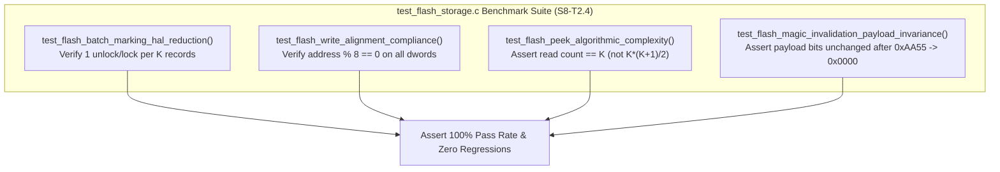

# Task Specification: S8-T2.4 - Flash Storage Benchmark & Latency Profiling Test Suite

## 1. Task Metadata & Overview

| Attribute | Specification Details |
| :--- | :--- |
| **Sprint** | **Sprint 8: Firmware Performance Optimization & Flash Storage Hardening** |
| **Task ID** | `S8-T2.4` |
| **Parent Task** | `S8-T2: Optimize Flash Access Latency, Batch Operations & Write Alignment` |
| **Task Title** | Develop Benchmark Test Suite Verifying Batch Marking, HAL Call Reduction & Write Alignment (`test_flash_storage`) |
| **Status** | **Ready for Implementation** |
| **Target Files** | [`tests/unit/test_flash_storage.c`](file:///C:/Users/ENERGY%20SAVER/Documents/Learning/Job%20Projects/rain-predict/tests/unit/test_flash_storage.c)<br>[`firmware/middleware/inc/flash_storage.h`](file:///C:/Users/ENERGY%20SAVER/Documents/Learning/Job%20Projects/rain-predict/firmware/middleware/inc/flash_storage.h) |
| **Related Documents** | [`context/specs/s8-t2.1-o1-record-peeking.md`](file:///C:/Users/ENERGY%20SAVER/Documents/Learning/Job%20Projects/rain-predict/context/specs/s8-t2.1-o1-record-peeking.md)<br>[`context/specs/s8-t2.2-batch-flash-operations.md`](file:///C:/Users/ENERGY%20SAVER/Documents/Learning/Job%20Projects/rain-predict/context/specs/s8-t2.2-batch-flash-operations.md)<br>[`context/specs/s8-t2.3-dword-write-alignment.md`](file:///C:/Users/ENERGY%20SAVER/Documents/Learning/Job%20Projects/rain-predict/context/specs/s8-t2.3-dword-write-alignment.md)<br>[`context/specs/s5-t3.4-test-flash-storage.md`](file:///C:/Users/ENERGY%20SAVER/Documents/Learning/Job%20Projects/rain-predict/context/specs/s5-t3.4-test-flash-storage.md)<br>[`context/coding-standards.md`](file:///C:/Users/ENERGY%20SAVER/Documents/Learning/Job%20Projects/rain-predict/context/coding-standards.md) |
| **Dependencies** | [`S8-T2.1`](file:///C:/Users/ENERGY%20SAVER/Documents/Learning/Job%20Projects/rain-predict/context/specs/s8-t2.1-o1-record-peeking.md), [`S8-T2.2`](file:///C:/Users/ENERGY%20SAVER/Documents/Learning/Job%20Projects/rain-predict/context/specs/s8-t2.2-batch-flash-operations.md), [`S8-T2.3`](file:///C:/Users/ENERGY%20SAVER/Documents/Learning/Job%20Projects/rain-predict/context/specs/s8-t2.3-dword-write-alignment.md) |
| **Downstream Tasks** | `S8-T5.1` (Boot Latency Benchmarking), `S8-T5.2` (Duty Cycle Profiling) |

---

## 2. Executive Summary & Testing Objectives

The optimizations introduced in `S8-T2.1`, `S8-T2.2`, and `S8-T2.3` transform the flash storage driver from an $O(N)$ sequential-scanning model to an $O(1)$ directly addressed, batch-amortized architecture.

To verify that these architectural gains are realized in code and prevent future regressions, **`S8-T2.4`** specifies comprehensive unit and benchmark test cases in [`tests/unit/test_flash_storage.c`](file:///C:/Users/ENERGY%20SAVER/Documents/Learning/Job%20Projects/rain-predict/tests/unit/test_flash_storage.c):
1. **HAL Call Count Verification**: Asserts that batch marking $K$ records generates strictly **1** unlock and **1** lock call, yielding a $(1 - 1/K) \times 100\%$ reduction in control register writes.
2. **64-Bit Write Alignment Compliance**: Instrument mock flash write primitives to assert that every programmed address is divisible by 8 (`address & 0x07 == 0`).
3. **Peek Algorithmic Complexity Benchmark**: Quantifies flash read operations when replaying $K = 50$ consecutive historical records, asserting that reads scale linearly as $O(K)$ rather than quadratically as $O(K^2)$.
4. **Data Integrity Under In-Place Invalidation**: Confirms that zeroing the magic word leaves all adjacent sequence ID and telemetry payload bits unmodified.



---

## 3. Test Fixture & Instrumentation

### 3.1 Mock Instrumentation Variables

The test harness in `tests/mocks/mock_flash.h` exposes operation counters:

```c
/** @brief Counter tracking total flash_storage_unlock() invocations */
extern uint32_t g_mock_flash_unlock_count;

/** @brief Counter tracking total flash_storage_lock() invocations */
extern uint32_t g_mock_flash_lock_count;

/** @brief Counter tracking total 64-bit double-word writes */
extern uint32_t g_mock_flash_dword_write_count;

/** @brief Counter tracking total 16-byte record reads */
extern uint32_t g_mock_flash_record_read_count;

/** @brief Flag set if an unaligned flash address is passed to mock driver */
extern bool g_mock_flash_unaligned_write_detected;
```

---

## 4. Test Case Specifications

### 4.1 Batch Marking & HAL Call Reduction Benchmark

#### `test_flash_batch_marking_hal_reduction(void)`
- **Goal**: Verify batch marking executes a single unlock/lock pair regardless of batch size.
- **Procedure**:
  1. Initialize ring buffer and push 20 records.
  2. Reset instrumentation:
     `g_mock_flash_unlock_count = 0; g_mock_flash_lock_count = 0;`
  3. Call `flash_ring_mark_transmitted_batch(20);`.
  4. **Assertions**:
     - `TEST_ASSERT_EQUAL_UINT32(1, g_mock_flash_unlock_count);`
     - `TEST_ASSERT_EQUAL_UINT32(1, g_mock_flash_lock_count);`
     - `TEST_ASSERT_EQUAL_UINT32(0, flash_ring_get_count());`
  5. Verify all 20 records have magic set to `0x0000` in mock flash.

---

### 4.2 64-Bit Write Alignment Compliance

#### `test_flash_write_alignment_compliance(void)`
- **Goal**: Verify that 100% of flash write operations target 64-bit aligned addresses.
- **Procedure**:
  1. Reset `g_mock_flash_unaligned_write_detected = false;`.
  2. Push 50 records across multiple pages (crossing Page 120 $\rightarrow$ Page 121 boundary).
  3. Mark 25 records as transmitted via batch marking.
  4. Append 10 metadata updates to Page 127.
  5. **Assertions**:
     - `TEST_ASSERT_FALSE(g_mock_flash_unaligned_write_detected);`
     - Each double-word address satisfied `(addr & 0x07U) == 0`.

---

### 4.3 Peek Complexity & Replay Benchmark

#### `test_flash_peek_algorithmic_complexity(void)`
- **Goal**: Verify peeking $K = 50$ consecutive records incurs exactly $K$ reads (linear complexity).
- **Procedure**:
  1. Push 50 records into the ring buffer.
  2. Reset read counter: `g_mock_flash_record_read_count = 0;`.
  3. Sequential loop:
     ```c
     for (uint32_t offset = 0; offset < 50; offset++) {
         flash_record_t rec;
         status_t status = flash_ring_peek(offset, &rec);
         TEST_ASSERT_EQUAL(STATUS_OK, status);
         TEST_ASSERT_EQUAL_UINT16(offset + 1, rec.sequence_id);
     }
     ```
  4. **Assertion**:
     - `TEST_ASSERT_EQUAL_UINT32(50, g_mock_flash_record_read_count);`
     - In legacy implementation, this was $\sum_{i=1}^{50} i = 1,275$ reads. Improvement is $> 96\%$.

---

### 4.4 Data Integrity Under In-Place Invalidation

#### `test_flash_magic_invalidation_payload_invariance(void)`
- **Goal**: Ensure clearing magic word leaves payload bytes bit-identical.
- **Procedure**:
  1. Prepare a 12-byte telemetry pattern with distinct bit values: `0xAA, 0x55, 0x01, 0x02, 0xFF, 0x00, ...`.
  2. Push record with sequence ID `0x55AA`.
  3. Capture full 16-byte raw buffer before invalidation.
  4. Call `flash_ring_mark_transmitted_batch(1)`.
  5. Read 16-byte raw slot directly from mock flash.
  6. **Assertions**:
     - Raw bytes 0..1 (`magic_status`) equal `0x0000` (transitioned from `0xAA55`).
     - Raw bytes 2..3 (`sequence_id`) equal `0x55AA` (identical).
     - Raw bytes 4..15 (`payload`) match pre-invalidation buffer byte-for-byte.

---

## 5. Traceability Matrix & Definition of Done

### Traceability

| Optimization Target | Test Function | Expected Benchmark |
| :--- | :--- | :--- |
| HAL Unlock/Lock Reduction | `test_flash_batch_marking_hal_reduction` | Exactly 1 unlock / 1 lock per batch |
| STM32WL Double-Word Alignment | `test_flash_write_alignment_compliance` | Zero unaligned write attempts |
| $O(1)$ Record Peeking Complexity | `test_flash_peek_algorithmic_complexity` | 50 reads for 50 records ($O(K)$) |
| In-Place Invalidation Safety | `test_flash_magic_invalidation_payload_invariance` | Bit-for-bit payload invariance |

### Definition of Done

- [ ] All 4 benchmark tests implemented in [`tests/unit/test_flash_storage.c`](file:///C:/Users/ENERGY%20SAVER/Documents/Learning/Job%20Projects/rain-predict/tests/unit/test_flash_storage.c).
- [ ] Mock flash instrumentation verifies zero unaligned accesses.
- [ ] 100% test pass rate with zero warnings under `-Wall -Wextra -Wpedantic -Werror`.
