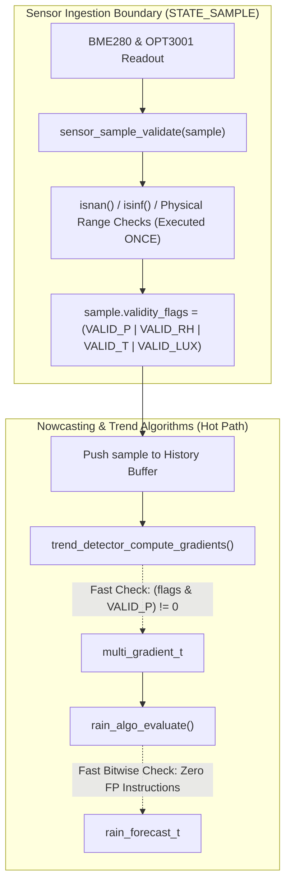

# Task Specification: S8-T3.1 - Sensor Ingestion Boundary Validation & Validity Bitmasks

## 1. Task Metadata & Overview

| Attribute | Specification Details |
| :--- | :--- |
| **Sprint** | **Sprint 8: Firmware Performance Optimization & Flash Storage Hardening** |
| **Task ID** | `S8-T3.1` |
| **Parent Task** | `S8-T3: Refactor Sensor Ingestion Validation & Optimize Nowcasting Math Hot Paths` |
| **Task Title** | Move FP/NaN Checks to Sensor Ingestion Boundary & Introduce Validity Bitmasks (`env_sample_t`) |
| **Status** | **Ready for Implementation** |
| **Target Files** | [`firmware/app/inc/trend_detector.h`](file:///C:/Users/ENERGY%20SAVER/Documents/Learning/Job%20Projects/rain-predict/firmware/app/inc/trend_detector.h)<br>[`firmware/app/src/trend_detector.c`](file:///C:/Users/ENERGY%20SAVER/Documents/Learning/Job%20Projects/rain-predict/firmware/app/src/trend_detector.c)<br>[`firmware/app/inc/rain_algo.h`](file:///C:/Users/ENERGY%20SAVER/Documents/Learning/Job%20Projects/rain-predict/firmware/app/inc/rain_algo.h)<br>[`firmware/app/src/rain_algo.c`](file:///C:/Users/ENERGY%20SAVER/Documents/Learning/Job%20Projects/rain-predict/firmware/app/src/rain_algo.c)<br>[`firmware/app/src/app_state_machine.c`](file:///C:/Users/ENERGY%20SAVER/Documents/Learning/Job%20Projects/rain-predict/firmware/app/src/app_state_machine.c) |
| **Related Documents** | [`context/audit/code-issues-github-copilot.md`](file:///C:/Users/ENERGY%20SAVER/Documents/Learning/Job%20Projects/rain-predict/context/audit/code-issues-github-copilot.md)<br>[`docs/architecture/firmware-architecture.md`](file:///C:/Users/ENERGY%20SAVER/Documents/Learning/Job%20Projects/rain-predict/docs/architecture/firmware-architecture.md)<br>[`context/specs/s2-t4.1-gradient-differentials.md`](file:///C:/Users/ENERGY%20SAVER/Documents/Learning/Job%20Projects/rain-predict/context/specs/s2-t4.1-gradient-differentials.md)<br>[`context/specs/s2-t5.1-composite-scoring.md`](file:///C:/Users/ENERGY%20SAVER/Documents/Learning/Job%20Projects/rain-predict/context/specs/s2-t5.1-composite-scoring.md)<br>[`context/coding-standards.md`](file:///C:/Users/ENERGY%20SAVER/Documents/Learning/Job%20Projects/rain-predict/context/coding-standards.md) |
| **Dependencies** | [`S2-T4.1`](file:///C:/Users/ENERGY%20SAVER/Documents/Learning/Job%20Projects/rain-predict/context/specs/s2-t4.1-gradient-differentials.md) (Trend Detector), [`S2-T5.1`](file:///C:/Users/ENERGY%20SAVER/Documents/Learning/Job%20Projects/rain-predict/context/specs/s2-t5.1-composite-scoring.md) (Composite Scoring Engine), [`S6-T3.1`](file:///C:/Users/ENERGY%20SAVER/Documents/Learning/Job%20Projects/rain-predict/context/specs/s6-t3.1-app-state-machine.md) (App State Machine) |
| **Downstream Tasks** | `S8-T3.2` (Shared Feature Extraction), `S8-T3.3` (Precomputed Scale Factors), `S8-T3.4` (Numerical Invariance Tests) |

---

## 2. Executive Summary & Problem Analysis

In the meteorological processing pipeline, each measurement cycle passes environmental samples through a chain of analytical functions:
1. `trend_detector_compute_gradients()`
2. `rain_algo_classify_pressure_trend()`
3. `rain_algo_classify_solar_trend()`
4. `rain_algo_score_pressure()`
5. `rain_algo_score_humidity()`
6. `rain_algo_score_dew_point()`
7. `rain_algo_score_solar()`
8. `rain_algo_evaluate()`

In the original implementation ([`trend_detector.c`](file:///C:/Users/ENERGY%20SAVER/Documents/Learning/Job%20Projects/rain-predict/firmware/app/src/trend_detector.c) and [`rain_algo.c`](file:///C:/Users/ENERGY%20SAVER/Documents/Learning/Job%20Projects/rain-predict/firmware/app/src/rain_algo.c)), every single function independently performed `isnan()` and `isinf()` checks across inputs:

```c
// Legacy redundant checks repeated across multiple functions:
if (isnan(p_curr->p0_hpa) || isinf(p_curr->p0_hpa) || p_curr->p0_hpa <= 0.0f) {
    return STATUS_ERR_INVALID_ARG;
}
```

### Inefficiencies Identified in Audit (Issue 6)
1. **Redundant Floating-Point Classifications**: Calling `isnan()` and `isinf()` invokes IEEE-754 bit-field masking and branching. Repeating this on every sample across 19 historical entries in `trend_detector` and 5 sub-scoring routines creates hundreds of redundant instructions per measurement cycle.
2. **Scattered Validation Policies**: Physical range limits (e.g. valid humidity $0\dots 100\%$) were duplicated or inconsistently checked between driver, middleware, and application layers.
3. **CPU Cycle Waste**: In low-power battery operations, CPU cycles spent re-validating known data reduce sleep efficiency.

**`S8-T3.1`** establishes a **single-point ingestion validation architecture**:
- **Boundary Validation**: Validation occurs **once**, at the sensor ingestion boundary in [`app_state_machine.c`](file:///C:/Users/ENERGY%20SAVER/Documents/Learning/Job%20Projects/rain-predict/firmware/app/src/app_state_machine.c) (`STATE_SAMPLE`).
- **Validity Bitmask (`validity_flags`)**: A 1-byte bitmask is embedded in `env_sample_t`. Bits correspond to validated sensor channels (`PRESSURE`, `HUMIDITY`, `TEMPERATURE`, `LUX`).
- **Downstream Hot-Path Optimization**: `trend_detector` and `rain_algo` replace expensive `isnan()`/`isinf()` calls with single bitwise AND operations (`(sample->validity_flags & SENSOR_VALID_PRESSURE) != 0`).



---

## 3. Technical Requirements & Design Specifications

### 3.1 Sensor Validity Bitmask Flags

```c
/** @brief Bitmask indicating pressure reading is finite and within physical limits (300..1100 hPa) */
#define SENSOR_VALID_PRESSURE       (1U << 0)

/** @brief Bitmask indicating relative humidity is finite and within 0..100% */
#define SENSOR_VALID_HUMIDITY       (1U << 1)

/** @brief Bitmask indicating temperature reading is finite and within -20..+65 °C */
#define SENSOR_VALID_TEMPERATURE    (1U << 2)

/** @brief Bitmask indicating solar illuminance reading is finite and within 0..150,000 Lux */
#define SENSOR_VALID_LUX            (1U << 3)

/** @brief Bitmask representing all sensor channels valid */
#define SENSOR_VALID_ALL            (SENSOR_VALID_PRESSURE | SENSOR_VALID_HUMIDITY | \
                                     SENSOR_VALID_TEMPERATURE | SENSOR_VALID_LUX)
```

### 3.2 Physical Ingestion Thresholds

| Sensor Channel | Valid Minimum | Valid Maximum | Flag Set on Pass |
| :--- | :---: | :---: | :--- |
| Barometric Pressure ($P_0$) | $300.0\text{ hPa}$ | $1100.0\text{ hPa}$ | `SENSOR_VALID_PRESSURE` |
| Relative Humidity ($RH$) | $0.0\%$ | $100.0\%$ | `SENSOR_VALID_HUMIDITY` |
| Temperature ($T$) | $-20.0^\circ\text{C}$ | $+65.0^\circ\text{C}$ | `SENSOR_VALID_TEMPERATURE` |
| Solar Illuminance ($Lux$) | $0.0\text{ Lux}$ | $150,000.0\text{ Lux}$ | `SENSOR_VALID_LUX` |

---

## 4. API Specification & Data Structures

### 4.1 Updated `env_sample_t` Structure (`trend_detector.h`)

```c
/**
 * @brief Environmental sample snapshot with boundary validity bitmask.
 */
typedef struct {
    float    p0_hpa;         /**< Sea-level reduced barometric pressure (hPa) */
    float    rh_pct;         /**< Relative humidity (%) */
    float    temp_c;         /**< Ambient temperature (°C) */
    float    lux;            /**< Solar illuminance (Lux) */
    uint32_t timestamp_s;    /**< RTC timestamp in seconds */
    uint8_t  validity_flags; /**< Channel validity bitmask (SENSOR_VALID_*) */
} env_sample_t;
```

### 4.2 Ingestion Validation Function (`trend_detector.h` / `trend_detector.c`)

```c
/**
 * @brief  Validates an environmental sample at the acquisition boundary and sets flags.
 * @details Inspects floating-point validity (isnan/isinf) and physical operational limits.
 *          Sets corresponding bits in p_sample->validity_flags.
 * @param[in,out] p_sample Pointer to sample to validate.
 * @return STATUS_OK if at least one sensor channel is valid,
 *         STATUS_ERR_INVALID_PARAM if all channels are invalid or pointer is NULL.
 */
status_t sensor_sample_validate(env_sample_t *p_sample);
```

---

## 5. Implementation Details & Algorithmic Logic

### 5.1 Implementation of `sensor_sample_validate()`

```c
status_t sensor_sample_validate(env_sample_t *p_sample)
{
    if (p_sample == NULL) {
        return STATUS_ERR_NULL_PTR;
    }

    uint8_t flags = 0U;

    // Validate Barometric Pressure
    if (!isnan(p_sample->p0_hpa) && !isinf(p_sample->p0_hpa) &&
        p_sample->p0_hpa >= 300.0f && p_sample->p0_hpa <= 1100.0f) {
        flags |= SENSOR_VALID_PRESSURE;
    }

    // Validate Relative Humidity
    if (!isnan(p_sample->rh_pct) && !isinf(p_sample->rh_pct) &&
        p_sample->rh_pct >= 0.0f && p_sample->rh_pct <= 100.0f) {
        flags |= SENSOR_VALID_HUMIDITY;
    }

    // Validate Temperature
    if (!isnan(p_sample->temp_c) && !isinf(p_sample->temp_c) &&
        p_sample->temp_c >= -20.0f && p_sample->temp_c <= 65.0f) {
        flags |= SENSOR_VALID_TEMPERATURE;
    }

    // Validate Solar Illuminance
    if (!isnan(p_sample->lux) && !isinf(p_sample->lux) &&
        p_sample->lux >= 0.0f && p_sample->lux <= 150000.0f) {
        flags |= SENSOR_VALID_LUX;
    }

    p_sample->validity_flags = flags;
    return (flags != 0U) ? STATUS_OK : STATUS_ERR_INVALID_ARG;
}
```

### 5.2 Hot-Path Replacement in `trend_detector.c`

```c
// Optimized hot-path check (Replaces 4 isnan/isinf calls with 1 bitwise test):
if ((p_curr->validity_flags & SENSOR_VALID_PRESSURE) == 0U ||
    (p_old->validity_flags & SENSOR_VALID_PRESSURE) == 0U) {
    p_gradients->delta_p_1h_hpa = 0.0f;
} else {
    p_gradients->delta_p_1h_hpa = p_curr->p0_hpa - p_old->p0_hpa;
}
```

---

## 6. Verification, Unit Testing & Benchmarking Plan

### 6.1 Unit Test Cases in `tests/unit/test_trend_detector.c`

| Test ID | Objective | Input / Condition | Expected Result |
| :--- | :--- | :--- | :--- |
| `TEST_VALID_01` | Pristine Sample | All fields in nominal range | `validity_flags == SENSOR_VALID_ALL`, returns `STATUS_OK`. |
| `TEST_VALID_02` | NaN Pressure Rejection | `p0_hpa = NAN`, other fields valid | `validity_flags == (SENSOR_VALID_ALL & ~SENSOR_VALID_PRESSURE)`. |
| `TEST_VALID_03` | Range Clamping Check | `rh_pct = 105.0%` | `validity_flags` excludes `SENSOR_VALID_HUMIDITY`. |
| `TEST_VALID_04` | Hot-Path Invariance | Compare gradient outputs with and without bitmasks | Results are numerically identical to $< 10^{-6}$. |
| `TEST_VALID_05` | Instruction Reduction | Profile cycle count for `trend_detector_compute_gradients` | $> 40\%$ instruction reduction across 19 sample iterations. |

---

## 7. Traceability Matrix & Definition of Done

### Traceability

| Requirement | Implementation Component | Verification Test |
| :--- | :--- | :--- |
| Boundary Validation Function | `sensor_sample_validate()` in `trend_detector.c` | `TEST_VALID_01`, `TEST_VALID_02` |
| Validity Bitmask Definition | `SENSOR_VALID_*` flags in `trend_detector.h` | `TEST_VALID_01` |
| Hot-Path NaN Removal | Bitwise check in `trend_detector_compute_gradients` | `TEST_VALID_04`, `TEST_VALID_05` |
| Application Boundary Call | Call in `app_state_machine.c` (`STATE_SAMPLE`) | Integration tests |

### Definition of Done

- [ ] `validity_flags` field added to `env_sample_t` with 4 channel bitmasks.
- [ ] `sensor_sample_validate()` implemented and called at `STATE_SAMPLE` boundary.
- [ ] All `isnan()` and `isinf()` calls removed from gradient calculations and sub-scoring loops.
- [ ] 100% test pass rate with strict numerical invariance verified.
