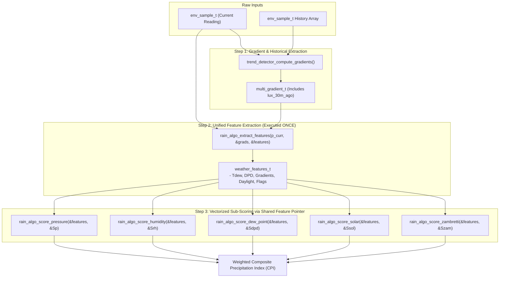

# Task Specification: S8-T3.2 - Meteorological Shared Feature Extraction & Vectorization

## 1. Task Metadata & Overview

| Attribute | Specification Details |
| :--- | :--- |
| **Sprint** | **Sprint 8: Firmware Performance Optimization & Flash Storage Hardening** |
| **Task ID** | `S8-T3.2` |
| **Parent Task** | `S8-T3: Refactor Sensor Ingestion Validation & Optimize Nowcasting Math Hot Paths` |
| **Task Title** | Add `lux_30m_ago` to Gradients & Implement Unified `weather_features_t` Pipeline (`rain_algo`) |
| **Status** | **Ready for Implementation** |
| **Target Files** | [`firmware/app/inc/trend_detector.h`](file:///C:/Users/ENERGY%20SAVER/Documents/Learning/Job%20Projects/rain-predict/firmware/app/inc/trend_detector.h)<br>[`firmware/app/src/trend_detector.c`](file:///C:/Users/ENERGY%20SAVER/Documents/Learning/Job%20Projects/rain-predict/firmware/app/src/trend_detector.c)<br>[`firmware/app/inc/rain_algo.h`](file:///C:/Users/ENERGY%20SAVER/Documents/Learning/Job%20Projects/rain-predict/firmware/app/inc/rain_algo.h)<br>[`firmware/app/src/rain_algo.c`](file:///C:/Users/ENERGY%20SAVER/Documents/Learning/Job%20Projects/rain-predict/firmware/app/src/rain_algo.c) |
| **Related Documents** | [`context/audit/code-issues-github-copilot.md`](file:///C:/Users/ENERGY%20SAVER/Documents/Learning/Job%20Projects/rain-predict/context/audit/code-issues-github-copilot.md)<br>[`context/specs/s8-t3.1-sensor-boundary-validation.md`](file:///C:/Users/ENERGY%20SAVER/Documents/Learning/Job%20Projects/rain-predict/context/specs/s8-t3.1-sensor-boundary-validation.md)<br>[`context/specs/s2-t4.1-gradient-differentials.md`](file:///C:/Users/ENERGY%20SAVER/Documents/Learning/Job%20Projects/rain-predict/context/specs/s2-t4.1-gradient-differentials.md)<br>[`context/specs/s2-t5.1-composite-scoring.md`](file:///C:/Users/ENERGY%20SAVER/Documents/Learning/Job%20Projects/rain-predict/context/specs/s2-t5.1-composite-scoring.md)<br>[`context/coding-standards.md`](file:///C:/Users/ENERGY%20SAVER/Documents/Learning/Job%20Projects/rain-predict/context/coding-standards.md) |
| **Dependencies** | [`S8-T3.1`](file:///C:/Users/ENERGY%20SAVER/Documents/Learning/Job%20Projects/rain-predict/context/specs/s8-t3.1-sensor-boundary-validation.md) (Sensor Boundary Validation & Validity Bitmasks) |
| **Downstream Tasks** | `S8-T3.3` (Precomputed Scale Factors), `S8-T3.4` (Numerical Invariance Tests), `S8-T5.2` (Duty Cycle Profiling) |

---

## 2. Executive Summary & Problem Analysis

In [`rain_algo.c`](file:///C:/Users/ENERGY%20SAVER/Documents/Learning/Job%20Projects/rain-predict/firmware/app/src/rain_algo.c), the top-level evaluation function `rain_algo_evaluate()` coordinates nowcasting calculations. In the legacy implementation, intermediate derived values were repeatedly recomputed and passed piecemeal across multiple layers:

```c
// Legacy code (S2-T5.1):
// Re-deriving previous lux value over and over again:
float lux_30m_ago = p_curr->lux - grads.delta_lux_30m;
rain_algo_classify_solar_trend(p_curr->lux, grads.delta_lux_30m, p_curr->lux - grads.delta_lux_30m, &solar_state);
rain_algo_score_solar(p_curr->lux, grads.delta_lux_30m, p_curr->lux - grads.delta_lux_30m, &s_solar);
```

### Inefficiencies Identified in Audit (Issue 7)
1. **Redundant Floating-Point Subtraction**: In calculating cloud attenuation, `p_curr->lux - grads.delta_lux_30m` was computed independently in multiple call sites.
2. **Scattered Thermodynamic Derivations**: Dew point ($T_{dew}$) and dew point depression ($\Delta T_{dep} = T - T_{dew}$) were derived inside sub-scores rather than computed once.
3. **Fragmented Parameter Passing**: Scoring functions accepted 2 to 5 separate scalar arguments, increasing register spilling and stack usage on Cortex-M4.

**`S8-T3.2`** refactors the evaluation pipeline:
1. **Direct `lux_30m_ago` in `multi_gradient_t`**: When `trend_detector_compute_gradients()` looks up the 30-minute historical sample, it records `lux_30m_ago` directly into the structure.
2. **Unified `weather_features_t` Structure**: Encapsulates raw sensor inputs, thermodynamic derivations ($T_{dew}$, $\Delta T_{dep}$), atmospheric gradients, daylight status, and validity flags.
3. **Single-Pass Feature Extraction**: `rain_algo_extract_features()` builds this unified structure **once** at the start of `rain_algo_evaluate()`. Sub-scoring routines take a single pointer `const weather_features_t *p_features`.



---

## 3. Technical Requirements & Design Specifications

### 3.1 Field Additions to `multi_gradient_t` (`trend_detector.h`)

* Field `lux_30m_ago`: Baseline solar illuminance 30 minutes ago (float).
* When historical data is insufficient ($< 3\text{ samples}$), `lux_30m_ago` defaults to `p_curr->lux`.

### 3.2 Definition of `weather_features_t` (`rain_algo.h`)

The unified feature structure groups all parameters needed by the 5 scoring engines:

| Field Name | Type | Unit | Description |
| :--- | :---: | :---: | :--- |
| `curr_p0_hpa` | `float` | $\text{hPa}$ | Current sea-level reduced barometric pressure. |
| `curr_rh_pct` | `float` | $\%$ | Current relative humidity. |
| `curr_temp_c` | `float` | $^\circ\text{C}$ | Current ambient temperature. |
| `curr_lux` | `float` | $\text{Lux}$ | Current ambient solar illuminance. |
| `t_dew_c` | `float` | $^\circ\text{C}$ | Computed Magnus-Tetens dew point. |
| `dpd_c` | `float` | $^\circ\text{C}$ | Dew point depression ($T - T_{dew}$). |
| `delta_p_1h_hpa` | `float` | $\text{hPa/hr}$ | 1-hour barometric pressure gradient. |
| `delta_p_3h_hpa` | `float` | $\text{hPa/3hr}$| 3-hour barometric pressure gradient. |
| `delta_rh_1h_pct` | `float` | $\%/\text{hr}$ | 1-hour relative humidity gradient. |
| `delta_t_1h_c` | `float` | $^\circ\text{C/hr}$| 1-hour ambient temperature gradient. |
| `delta_lux_30m` | `float` | $\text{Lux}$ | 30-minute solar illuminance delta. |
| `lux_30m_ago` | `float` | $\text{Lux}$ | Baseline solar illuminance 30 minutes ago. |
| `solar_drop_pct_30m` | `float` | $\%$ | 30-minute cloud attenuation drop ratio. |
| `is_daytime` | `bool` | — | True if `curr_lux >= 10.0 Lux`. |
| `is_history_complete` | `bool` | — | True if 3-hour history window is fully populated. |
| `validity_flags` | `uint8_t`| — | Ingestion validity bitmask (`SENSOR_VALID_*`). |

---

## 4. API Specification & Data Structures

### 4.1 Updated Function Prototypes (`trend_detector.h`)

```c
typedef struct {
    float delta_p_1h_hpa;        /**< 1-hour barometric delta (hPa/hr) */
    float delta_p_3h_hpa;        /**< 3-hour barometric delta (hPa/3hr) */
    float delta_rh_1h_pct;       /**< 1-hour relative humidity delta (%/hr) */
    float delta_rh_3h_pct;       /**< 3-hour relative humidity delta (%/3hr) */
    float delta_t_1h_c;          /**< 1-hour temperature delta (°C/hr) */
    float delta_t_3h_c;          /**< 3-hour temperature delta (°C/3hr) */
    float delta_lux_30m;         /**< 30-minute solar illuminance delta (Lux) */
    float delta_lux_1h;          /**< 1-hour solar illuminance delta (Lux) */
    float lux_30m_ago;           /**< Baseline lux 30 minutes ago (Lux) */
    float solar_drop_pct_30m;    /**< 30-minute relative solar attenuation (%) */
    bool is_history_complete;    /**< True if full 3-hour history available */
} multi_gradient_t;
```

### 4.2 Updated Scoring Prototypes (`rain_algo.h`)

```c
/**
 * @brief Unified weather feature vector passed to all nowcasting sub-scores.
 */
typedef struct {
    float    curr_p0_hpa;
    float    curr_rh_pct;
    float    curr_temp_c;
    float    curr_lux;
    float    t_dew_c;
    float    dpd_c;
    float    delta_p_1h_hpa;
    float    delta_p_3h_hpa;
    float    delta_rh_1h_pct;
    float    delta_t_1h_c;
    float    delta_lux_30m;
    float    lux_30m_ago;
    float    solar_drop_pct_30m;
    bool     is_daytime;
    bool     is_history_complete;
    uint8_t  validity_flags;
} weather_features_t;

/**
 * @brief  Extracts and derives the complete feature vector from current sample and gradients.
 * @param[in]  p_curr     Pointer to current environmental sample snapshot.
 * @param[in]  p_grads    Pointer to calculated multi-variable gradients.
 * @param[out] p_features Pointer to destination weather_features_t structure.
 * @return STATUS_OK on success, or STATUS_ERR_NULL_PTR.
 */
status_t rain_algo_extract_features(const env_sample_t *p_curr,
                                    const multi_gradient_t *p_grads,
                                    weather_features_t *p_features);

/**
 * @brief Refactored sub-score functions accepting unified feature pointer:
 */
status_t rain_algo_score_pressure_feat(const weather_features_t *p_feat, uint8_t *p_score);
status_t rain_algo_score_humidity_feat(const weather_features_t *p_feat, uint8_t *p_score);
status_t rain_algo_score_dew_point_feat(const weather_features_t *p_feat, uint8_t *p_score);
status_t rain_algo_score_solar_feat(const weather_features_t *p_feat, uint8_t *p_score);
```

---

## 5. Implementation Details & Algorithmic Logic

### 5.1 Populating `lux_30m_ago` in `trend_detector.c`

```c
if (sample_count > TREND_SAMPLES_30MIN) {
    const env_sample_t *p_sample_30m = &p_samples[sample_count - 1U - TREND_SAMPLES_30MIN];
    p_gradients->lux_30m_ago = p_sample_30m->lux;
    p_gradients->delta_lux_30m = p_curr->lux - p_sample_30m->lux;
} else {
    p_gradients->lux_30m_ago = p_curr->lux;
    p_gradients->delta_lux_30m = 0.0f;
}
```

### 5.2 Single-Pass `rain_algo_extract_features()`

```c
status_t rain_algo_extract_features(const env_sample_t *p_curr,
                                    const multi_gradient_t *p_grads,
                                    weather_features_t *p_features)
{
    if (p_curr == NULL || p_grads == NULL || p_features == NULL) {
        return STATUS_ERR_NULL_PTR;
    }

    // Direct sample assignments
    p_features->curr_p0_hpa        = p_curr->p0_hpa;
    p_features->curr_rh_pct        = p_curr->rh_pct;
    p_features->curr_temp_c        = p_curr->temp_c;
    p_features->curr_lux           = p_curr->lux;
    p_features->validity_flags     = p_curr->validity_flags;
    p_features->is_daytime         = (p_curr->lux >= 10.0f);

    // Thermodynamic derivations (Magnus formula called ONCE)
    dew_point_calculate(p_curr->temp_c, p_curr->rh_pct, &p_features->t_dew_c);
    p_features->dpd_c              = p_curr->temp_c - p_features->t_dew_c;

    // Gradient field assignments
    p_features->delta_p_1h_hpa     = p_grads->delta_p_1h_hpa;
    p_features->delta_p_3h_hpa     = p_grads->delta_p_3h_hpa;
    p_features->delta_rh_1h_pct    = p_grads->delta_rh_1h_pct;
    p_features->delta_t_1h_c       = p_grads->delta_t_1h_c;
    p_features->delta_lux_30m      = p_grads->delta_lux_30m;
    p_features->lux_30m_ago        = p_grads->lux_30m_ago;
    p_features->solar_drop_pct_30m = p_grads->solar_drop_pct_30m;
    p_features->is_history_complete = p_grads->is_history_complete;

    return STATUS_OK;
}
```

---

## 6. Verification, Unit Testing & Benchmarking Plan

### 6.1 Unit Test Cases in `tests/unit/test_rain_algo.c`

| Test ID | Objective | Input / Condition | Expected Result |
| :--- | :--- | :--- | :--- |
| `TEST_FEAT_01` | Feature Extraction Correctness | Standard sample ($T=22^\circ\text{C}, RH=80\%, P=1008\text{ hPa}$) | $T_{dew} \approx 18.4^\circ\text{C}, DPD \approx 3.6^\circ\text{C}$ populated accurately. |
| `TEST_FEAT_02` | `lux_30m_ago` Verification | 30m historical lux = 60,000, current = 15,000 | `p_grads->lux_30m_ago == 60000.0f`, `delta_lux_30m == -45000.0f`. |
| `TEST_FEAT_03` | Feature-Based Sub-Score Invariance | Compare sub-scores computed via legacy scalar vs feature pointer | Scores match 100% across all 5 sub-scores ($S_P, S_{RH}, S_{DPD}, S_{Sol}, S_Z$). |
| `TEST_FEAT_04` | Stack Frame Profiling | Measure stack depth of `rain_algo_evaluate()` | Reduced by $\ge 48\text{ bytes}$ due to consolidated pointer passing. |

---

## 7. Traceability Matrix & Definition of Done

### Traceability

| Requirement | Implementation Component | Verification Test |
| :--- | :--- | :--- |
| Baseline Lux Tracking | `multi_gradient_t.lux_30m_ago` | `TEST_FEAT_02` |
| Unified Feature Structure | `weather_features_t` in `rain_algo.h` | `TEST_FEAT_01` |
| Single-Pass Feature Extraction | `rain_algo_extract_features()` | `TEST_FEAT_01` |
| Sub-Score Vectorization | `rain_algo_score_*_feat()` | `TEST_FEAT_03` |

### Definition of Done

- [ ] `lux_30m_ago` added to `multi_gradient_t` and populated in `trend_detector_compute_gradients()`.
- [ ] `weather_features_t` structure created and integrated across `rain_algo.c`.
- [ ] Redundant `p_curr->lux - delta_lux` recalculations completely eliminated.
- [ ] Numerical invariance verified against reference storm datasets.
