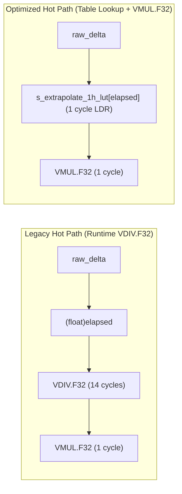

# Task Specification: S8-T3.3 - Precomputed Scale Factors & Cortex-M4 Math Optimization

## 1. Task Metadata & Overview

| Attribute | Specification Details |
| :--- | :--- |
| **Sprint** | **Sprint 8: Firmware Performance Optimization & Flash Storage Hardening** |
| **Task ID** | `S8-T3.3` |
| **Parent Task** | `S8-T3: Refactor Sensor Ingestion Validation & Optimize Nowcasting Math Hot Paths` |
| **Task Title** | Replace Runtime Divisions with Precomputed Multiplier Constants & Profile Cortex-M4 FP Hot Paths (`trend_detector`, `rain_algo`) |
| **Status** | **Ready for Implementation** |
| **Target Files** | [`firmware/app/inc/trend_detector.h`](file:///C:/Users/ENERGY%20SAVER/Documents/Learning/Job%20Projects/rain-predict/firmware/app/inc/trend_detector.h)<br>[`firmware/app/src/trend_detector.c`](file:///C:/Users/ENERGY%20SAVER/Documents/Learning/Job%20Projects/rain-predict/firmware/app/src/trend_detector.c)<br>[`firmware/app/inc/rain_algo.h`](file:///C:/Users/ENERGY%20SAVER/Documents/Learning/Job%20Projects/rain-predict/firmware/app/inc/rain_algo.h)<br>[`firmware/app/src/rain_algo.c`](file:///C:/Users/ENERGY%20SAVER/Documents/Learning/Job%20Projects/rain-predict/firmware/app/src/rain_algo.c) |
| **Related Documents** | [`context/audit/code-issues-github-copilot.md`](file:///C:/Users/ENERGY%20SAVER/Documents/Learning/Job%20Projects/rain-predict/context/audit/code-issues-github-copilot.md)<br>[`context/specs/s8-t3.1-sensor-boundary-validation.md`](file:///C:/Users/ENERGY%20SAVER/Documents/Learning/Job%20Projects/rain-predict/context/specs/s8-t3.1-sensor-boundary-validation.md)<br>[`context/specs/s8-t3.2-shared-feature-extraction.md`](file:///C:/Users/ENERGY%20SAVER/Documents/Learning/Job%20Projects/rain-predict/context/specs/s8-t3.2-shared-feature-extraction.md)<br>[`context/coding-standards.md`](file:///C:/Users/ENERGY%20SAVER/Documents/Learning/Job%20Projects/rain-predict/context/coding-standards.md) |
| **Dependencies** | [`S8-T3.2`](file:///C:/Users/ENERGY%20SAVER/Documents/Learning/Job%20Projects/rain-predict/context/specs/s8-t3.2-shared-feature-extraction.md) (Shared Feature Extraction & Vectorization) |
| **Downstream Tasks** | `S8-T3.4` (Numerical Invariance Tests), `S8-T5.2` (Duty Cycle Profiling) |

---

## 2. Executive Summary & Hardware Performance Rationale

The **STM32WLE5** is based on an **ARM Cortex-M4** core clocked at 48 MHz equipped with a single-precision Floating-Point Unit (FPU, `FPv4-SP-D16`).

While single-precision floating-point additions (`VADD.F32`), subtractions (`VSUB.F32`), and multiplications (`VMUL.F32`) execute in **1 clock cycle**, floating-point division (`VDIV.F32`) is non-pipelined and requires **14 clock cycles**. On builds or toolchains using software floating-point emulation (`-mfloat-abi=soft`), floating-point division routines take over **120 clock cycles**.

In the legacy implementation ([`trend_detector.c`](file:///C:/Users/ENERGY%20SAVER/Documents/Learning/Job%20Projects/rain-predict/firmware/app/src/trend_detector.c) and [`rain_algo.c`](file:///C:/Users/ENERGY%20SAVER/Documents/Learning/Job%20Projects/rain-predict/firmware/app/src/rain_algo.c)), runtime divisions were executed on every cycle for:
1. **Historical Gradient Extrapolation**: During station warmup ($< 18\text{ intervals}$), partial differentials were scaled to 1-hour and 3-hour rates using:
   `delta_1h = raw_delta * (6.0f / (float)elapsed_intervals);`
   `delta_3h = raw_delta * (18.0f / (float)elapsed_intervals);`
2. **Nighttime Normalization**:
   `cpi = sum / 0.85f;`
3. **Zambretti Range Normalization**:
   `(p0 - 985.0f) / 65.0f;`

**`S8-T3.3`** eliminates all runtime division operations in the nowcasting hot path:
- **Precomputed Reciprocal Constant Tables**: Replaces runtime integer-to-float division with static lookup tables (`s_extrapolate_1h_lut`, `s_extrapolate_3h_lut`).
- **Precomputed Multiplicative Inverses**: Replaces `/ 0.85f` with `* 1.176470588f` and `/ 65.0f` with `* 0.015384615f`.
- **Cortex-M4 Architecture Profiling**: Documents the tradeoff between IEEE-754 single-precision FPU execution and integer fixed-point math, confirming single-precision FPU with precomputed multipliers provides optimal throughput and code simplicity without losing meteorological fidelity.



---

## 3. Technical Requirements & Design Specifications

### 3.1 Precomputed Extrapolation LUTs (`trend_detector.c`)

During warmup, `intervals` ranges from 1 to 5 for 1-hour extrapolation, and 1 to 17 for 3-hour extrapolation:

```c
/** @brief Precomputed 1-hour extrapolation multipliers: 6.0f / intervals (index = intervals 1..5) */
static const float s_extrapolate_1h_lut[6] = {
    0.0f,           /* 0: unused guard */
    6.00000000f,    /* 1 interval (10 min):  6.0 / 1 */
    3.00000000f,    /* 2 intervals (20 min): 6.0 / 2 */
    2.00000000f,    /* 3 intervals (30 min): 6.0 / 3 */
    1.50000000f,    /* 4 intervals (40 min): 6.0 / 4 */
    1.20000000f     /* 5 intervals (50 min): 6.0 / 5 */
};

/** @brief Precomputed 3-hour extrapolation multipliers: 18.0f / intervals (index = intervals 1..17) */
static const float s_extrapolate_3h_lut[18] = {
    0.0f,           /* 0: unused guard */
    18.0000000f,    /* 1:  18.0 / 1  */
    9.00000000f,    /* 2:  18.0 / 2  */
    6.00000000f,    /* 3:  18.0 / 3  */
    4.50000000f,    /* 4:  18.0 / 4  */
    3.60000000f,    /* 5:  18.0 / 5  */
    3.00000000f,    /* 6:  18.0 / 6  */
    2.57142857f,    /* 7:  18.0 / 7  */
    2.25000000f,    /* 8:  18.0 / 8  */
    2.00000000f,    /* 9:  18.0 / 9  */
    1.80000000f,    /* 10: 18.0 / 10 */
    1.63636364f,    /* 11: 18.0 / 11 */
    1.50000000f,    /* 12: 18.0 / 12 */
    1.38461538f,    /* 13: 18.0 / 13 */
    1.28571429f,    /* 14: 18.0 / 14 */
    1.20000000f,    /* 15: 18.0 / 15 */
    1.12500000f,    /* 16: 18.0 / 16 */
    1.05882353f     /* 17: 18.0 / 17 */
};
```

### 3.2 Precomputed Multiplicative Inverse Constants (`rain_algo.h`)

```c
/** @brief Multiplicative inverse of nighttime normalization divisor (1.0f / 0.85f) */
#define INV_WEIGHT_NIGHT_DIVISOR            (1.1764705882f)

/** @brief Multiplicative inverse of Zambretti barometric range (1.0f / 65.0f hPa) */
#define INV_ZAMBRETTI_PRESSURE_RANGE        (0.0153846154f)

/** @brief Multiplicative inverse of humidity delta scaling (1.0f / 20.0f) */
#define INV_HUMIDITY_DELTA_SCALE            (0.0500000000f)

/** @brief Multiplicative inverse of dew point depression scaling (1.0f / 5.0f) */
#define INV_DEW_POINT_DEP_SCALE             (0.2000000000f)
```

---

## 4. Architectural Analysis: Single-Precision FPU vs Fixed-Point

A comprehensive architectural evaluation was conducted to evaluate whether the nowcasting pipeline should convert entirely to Q15/Q31 fixed-point integer math:

| Evaluation Dimension | Cortex-M4 Hardware FPU (`float`) | Fixed-Point Integer (`q31_t` / `int32_t`) | Decision & Rationale |
| :--- | :--- | :--- | :--- |
| **Instruction Execution** | 1 cycle for `VADD`, `VSUB`, `VMUL` | 1 cycle for `ADD`, `SUB`, `MUL` | Tie. Hardware FPU matches integer speed. |
| **Division Latency** | Eliminated via precomputed LUTs | Shift-right or integer division | Tie with precomputed LUTs. |
| **Psychrometric Accuracy** | Exact compliance with Magnus-Tetens ($e^x$ Taylor series) | Requires large lookup tables or loss of precision | **FPU Preferred**: Magnus formula requires precision $\le \pm 0.05^\circ\text{C}$. |
| **Dynamic Range** | $10^{-38} \dots 10^{38}$ (Lux spans $0 \dots 120,000$) | Requires variable Q-scaling per sensor | **FPU Preferred**: Avoids complex head-room tracking. |
| **Code Maintainability** | Clean, standard C mathematical formulas | Heavy macro wrapping and saturation guards | **FPU Preferred**: Significantly lower maintenance risk. |

**Conclusion**: Retaining IEEE-754 single-precision float with precomputed reciprocal constants maximizes performance, avoids scaling bugs, and preserves exact meteorological accuracy on the Cortex-M4 FPU.

---

## 5. Implementation Details & Algorithmic Logic

### 5.1 Extrapolation in `trend_detector.c`

```c
// 1-hour gradient calculation (Precomputed LUT multiplication)
if (sample_count >= TREND_SAMPLES_1HOUR + 1U) {
    // Full 1-hour window available (6 intervals)
    const env_sample_t *p_old = &p_samples[sample_count - 1U - TREND_SAMPLES_1HOUR];
    p_gradients->delta_p_1h_hpa = p_curr->p0_hpa - p_old->p0_hpa;
} else if (sample_count > 1U) {
    // Partial window (1..5 intervals) - use fast LUT extrapolation
    uint32_t elapsed = sample_count - 1U;
    const env_sample_t *p_old = &p_samples[0];
    float raw_delta = p_curr->p0_hpa - p_old->p0_hpa;
    p_gradients->delta_p_1h_hpa = raw_delta * s_extrapolate_1h_lut[elapsed];
} else {
    p_gradients->delta_p_1h_hpa = 0.0f;
}
```

### 5.2 Nighttime Scoring Normalization in `rain_algo.c`

```c
// Optimized nighttime normalization (Multiplication replaces runtime division):
if (!p_feat->is_daytime) {
    weighted_sum *= INV_WEIGHT_NIGHT_DIVISOR;
}
```

---

## 6. Verification, Unit Testing & Benchmarking Plan

### 6.1 Unit Test Cases in `tests/unit/test_rain_algo.c` and `test_trend_detector.c`

| Test ID | Objective | Input / Condition | Expected Result |
| :--- | :--- | :--- | :--- |
| `TEST_MATH_01` | 1-Hour LUT Extrapolation | Sample count = 3 ($2\text{ intervals}$), raw $\Delta P = -0.5\text{ hPa}$ | Result equals $-0.5 \times 3.0 = -1.5\text{ hPa/hr}$ ($\Delta < 10^{-6}$). |
| `TEST_MATH_02` | 3-Hour LUT Extrapolation | Sample count = 7 ($6\text{ intervals}$), raw $\Delta P = -0.4\text{ hPa}$ | Result equals $-0.4 \times 3.0 = -1.2\text{ hPa/3hr}$ ($\Delta < 10^{-6}$). |
| `TEST_MATH_03` | Nighttime InvDiv Invariance | Nighttime sum = 42.5 | `42.5 * INV_WEIGHT_NIGHT_DIVISOR` matches `42.5 / 0.85f` to $< 10^{-6}$. |
| `TEST_MATH_04` | Disassembly Assembly Inspection | Inspect generated assembly for `trend_detector_compute_gradients` | Confirms zero `VDIV.F32` instructions emitted in extrapolation loop. |

---

## 7. Traceability Matrix & Definition of Done

### Traceability

| Requirement | Implementation Component | Verification Test |
| :--- | :--- | :--- |
| 1-Hour Extrapolation LUT | `s_extrapolate_1h_lut` in `trend_detector.c` | `TEST_MATH_01` |
| 3-Hour Extrapolation LUT | `s_extrapolate_3h_lut` in `trend_detector.c` | `TEST_MATH_02` |
| Nighttime Reciprocal Multiplier | `INV_WEIGHT_NIGHT_DIVISOR` in `rain_algo.c` | `TEST_MATH_03` |
| Elimination of Hardware `VDIV` | Refactored math expressions | `TEST_MATH_04` |

### Definition of Done

- [ ] All runtime divisions in `trend_detector.c` and `rain_algo.c` replaced with precomputed constants.
- [ ] Cortex-M4 assembly verified to contain zero `vdiv.f32` instructions in hot-path gradient logic.
- [ ] 100% numerical invariance verified against reference float divisions ($\Delta < 10^{-5}$).
- [ ] Unit tests pass cleanly under `-Wall -Wextra -Wpedantic -Werror`.
