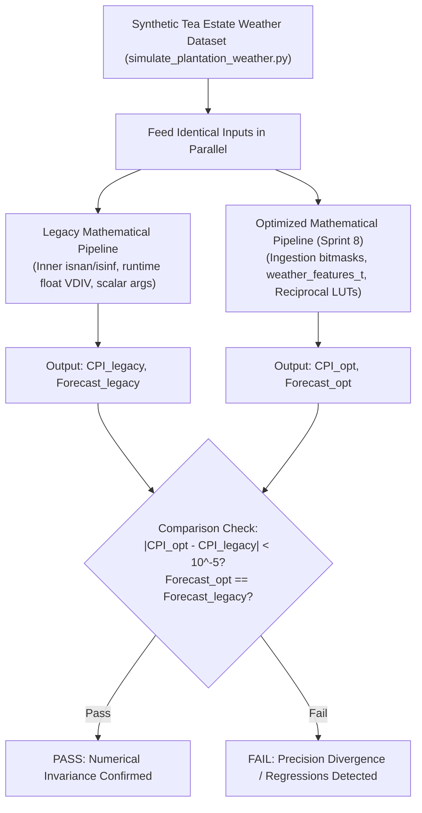

# Task Specification: S8-T3.4 - Algorithmic Numerical Invariance & Regression Test Suite

## 1. Task Metadata & Overview

| Attribute | Specification Details |
| :--- | :--- |
| **Sprint** | **Sprint 8: Firmware Performance Optimization & Flash Storage Hardening** |
| **Task ID** | `S8-T3.4` |
| **Parent Task** | `S8-T3: Refactor Sensor Ingestion Validation & Optimize Nowcasting Math Hot Paths` |
| **Task Title** | Verify Numerical Invariance ($\Delta < 10^{-5}$) Across Optimized Meteorological Pipelines |
| **Status** | **Ready for Implementation** |
| **Target Files** | [`tests/unit/test_trend_detector.c`](file:///C:/Users/ENERGY%20SAVER/Documents/Learning/Job%20Projects/rain-predict/tests/unit/test_trend_detector.c) [`tests/unit/test_rain_algo.c`](file:///C:/Users/ENERGY%20SAVER/Documents/Learning/Job%20Projects/rain-predict/tests/unit/test_rain_algo.c) |
| **Related Documents** | [`context/specs/s8-t3.1-sensor-boundary-validation.md`](file:///C:/Users/ENERGY%20SAVER/Documents/Learning/Job%20Projects/rain-predict/context/specs/s8-t3.1-sensor-boundary-validation.md) [`context/specs/s8-t3.2-shared-feature-extraction.md`](file:///C:/Users/ENERGY%20SAVER/Documents/Learning/Job%20Projects/rain-predict/context/specs/s8-t3.2-shared-feature-extraction.md) [`context/specs/s8-t3.3-precomputed-scale-factors.md`](file:///C:/Users/ENERGY%20SAVER/Documents/Learning/Job%20Projects/rain-predict/context/specs/s8-t3.3-precomputed-scale-factors.md) [`docs/algorithms/algorithm-validation-and-tuning.md`](file:///C:/Users/ENERGY%20SAVER/Documents/Learning/Job%20Projects/rain-predict/docs/algorithms/algorithm-validation-and-tuning.md) [`context/coding-standards.md`](file:///C:/Users/ENERGY%20SAVER/Documents/Learning/Job%20Projects/rain-predict/context/coding-standards.md) |
| **Dependencies** | [`S8-T3.1`](file:///C:/Users/ENERGY%20SAVER/Documents/Learning/Job%20Projects/rain-predict/context/specs/s8-t3.1-sensor-boundary-validation.md), [`S8-T3.2`](file:///C:/Users/ENERGY%20SAVER/Documents/Learning/Job%20Projects/rain-predict/context/specs/s8-t3.2-shared-feature-extraction.md), [`S8-T3.3`](file:///C:/Users/ENERGY%20SAVER/Documents/Learning/Job%20Projects/rain-predict/context/specs/s8-t3.3-precomputed-scale-factors.md) |
| **Downstream Tasks** | `S8-T5.3` (Automated Regression Suite) |

---

## 2. Executive Summary & Quality Assurance Mission

Refactoring mathematical algorithms for speed introduces the risk of subtle numerical drift, floating-point rounding divergence, or unexpected classification state flips. In tea plantation microclimates, where nowcasting triggers automated plucking alerts and estate sirens, mathematical invariance is non-negotiable.

The objective of **`S8-T3.4`** is to establish a **strict numerical regression harness** across [`tests/unit/test_trend_detector.c`](file:///C:/Users/ENERGY%20SAVER/Documents/Learning/Job%20Projects/rain-predict/tests/unit/test_trend_detector.c) and [`tests/unit/test_rain_algo.c`](file:///C:/Users/ENERGY%20SAVER/Documents/Learning/Job%20Projects/rain-predict/tests/unit/test_rain_algo.c) to prove:
1. **Delta Invariance**: The optimized algorithms (using bitmask flags, `weather_features_t`, and reciprocal multiplier constants) produce floating-point results within an absolute delta $\Delta < 1 \times 10^{-5}$ of legacy reference implementations.
2. **Exact Categorical Identity**: Output discrete states (`pressure_trend_state_t`, `solar_cloud_state_t`, `rain_alert_state_t`, Zambretti index $1\dots 26$) match with $100\%$ identity across all benchmark points.
3. **Storm Scenario Conformance**: Simulated multi-hour convective storm profiles generated by `simulate_plantation_weather.py` produce identical lead-time alert progressions.

---

## 3. Invariance Thresholds & Verification Tolerance

| Metric / Parameter | Allowable Difference ($\Delta$) | Verification Scope |
| :--- | :---: | :--- |
| Gradient Differentials ($\Delta P, \Delta RH, \Delta T, \Delta Lux$) | $< 1.0 \times 10^{-5}$ | 1-hour and 3-hour extrapolation windows |
| Dew Point ($T_{dew}$) & Depression ($DPD$) | $< 1.0 \times 10^{-5}\ ^\circ\text{C}$ | $-10^\circ\text{C} \le T \le 45^\circ\text{C}$, $20\% \le RH \le 100\%$ |
| Sub-Scores ($S_P, S_{RH}, S_{DPD}, S_{Sol}, S_Z$) | $\mathbf{0}$ (Exact integer equality) | Full input domain ($0\dots 100$) |
| Composite Precipitation Index ($CPI$) | $< 1.0 \times 10^{-5}\ \%$ | $0.0\% \dots 100.0\%$ |
| Operational Alert State (`rain_alert_state_t`) | $\mathbf{0}$ (Exact enum match) | UNLIKELY, POSSIBLE, LIKELY, IMMINENT |
| Zambretti Index ($Z$) | $\mathbf{0}$ (Exact index match) | Indices $1\dots 26$ |

---

## 4. Test Case Specifications

### 4.1 Trend Detector Invariance Tests (`test_trend_detector.c`)

#### `test_gradient_extrapolation_lut_invariance(void)`
- **Goal**: Verify precomputed reciprocal LUT produces results within $10^{-5}$ of runtime division.
- **Procedure**:
  1. Construct sample history with 4 samples ($3\text{ intervals} = 30\text{ minutes}$).
  2. Calculate 1-hour gradient with legacy runtime division:
     `float legacy = (p_curr->p0 - p_old->p0) * (6.0f / 3.0f);`
  3. Calculate 1-hour gradient with LUT multiplication:
     `float optimized = (p_curr->p0 - p_old->p0) * s_extrapolate_1h_lut[3];`
  4. Assert: `TEST_ASSERT_FLOAT_WITHIN(1e-5f, legacy, optimized);`
  5. Repeat across all valid intervals $1\dots 5$ and $1\dots 17$.

#### `test_sensor_validity_bitmask_gradient_invariance(void)`
- **Goal**: Verify bitmask validation produces identical gradient arrays to `isnan()` guards.
- **Procedure**:
  1. Feed 19 realistic diurnal tea plantation samples.
  2. Run legacy gradient computation with internal `isnan()` checks.
  3. Run optimized gradient computation with `validity_flags`.
  4. Compare all 10 fields of `multi_gradient_t`.
  5. Assert all float fields match to within $10^{-5}$.

---

### 4.2 Rain Nowcasting Invariance Tests (`test_rain_algo.c`)

#### `test_sub_scores_numerical_invariance(void)`
- **Goal**: Verify all 5 sub-scoring engines produce identical sub-scores through `weather_features_t`.
- **Procedure**:
  1. Iterate across 500 synthetic meteorological points ($P_0 \in [980, 1030]$, $RH \in [40, 100]$, $T \in [10, 35]$, $Lux \in [0, 100000]$).
  2. Compute sub-scores via legacy direct functions.
  3. Compute sub-scores via optimized `rain_algo_score_*_feat()` using `weather_features_t`.
  4. Assert exact equality (`TEST_ASSERT_EQUAL_UINT8`) for each sub-score.

#### `test_cpi_composite_and_alert_state_invariance(void)`
- **Goal**: Verify CPI and 4-tier alert outputs match exactly across a simulated convective storm.
- **Procedure**:
  1. Load 144-point synthetic storm dataset ($24\text{ hours}$ at 10-minute intervals).
  2. Evaluate nowcasting pipeline at each step.
  3. Assert:
     - `TEST_ASSERT_FLOAT_WITHIN(1e-5f, legacy_cpi, opt_cpi);`
     - `TEST_ASSERT_EQUAL(legacy_forecast_state, opt_forecast_state);`
     - `TEST_ASSERT_EQUAL(legacy_z_index, opt_z_index);`
  4. Verify lead time to `RAIN_ALERT_IMMINENT` is identical between implementations.

---

## 5. Traceability Matrix & Definition of Done

### Traceability

| Tested Optimization | Verification Function | Success Criteria |
| :--- | :--- | :--- |
| Ingestion Validity Bitmask | `test_sensor_validity_bitmask_gradient_invariance` | $\Delta < 10^{-5}$ across all fields |
| Extrapolation Reciprocal LUT | `test_gradient_extrapolation_lut_invariance` | $\Delta < 10^{-5}$ across 1..17 intervals |
| Vectorized Feature Scoring | `test_sub_scores_numerical_invariance` | 100% integer identity ($0\dots 100$) |
| Full Nowcasting Pipeline | `test_cpi_composite_and_alert_state_invariance` | Identical CPI and alert classifications |

### Definition of Done

- [ ] Numerical invariance test cases integrated into `test_trend_detector.c` and `test_rain_algo.c`.
- [ ] 100% pass rate achieved across all synthetic test vectors.
- [ ] Zero regression or categorical divergence observed across 500+ test points.
- [ ] Zero warnings under `-Wall -Wextra -Wpedantic -Werror`.
