# Task Specification: S8-T4.1 - Branch-Efficient Increment-Compare Ring Buffer Math

## 1. Task Metadata & Overview

| Attribute | Specification Details |
| :--- | :--- |
| **Sprint** | **Sprint 8: Firmware Performance Optimization & Flash Storage Hardening** |
| **Task ID** | `S8-T4.1` |
| **Parent Task** | `S8-T4: Harden Middleware Ring Buffers & LoRaWAN Transmission Queue` |
| **Task Title** | Replace Runtime Modulo Operations with Increment-and-Compare Indexing (`ring_buffer`, `flash_storage`) |
| **Status** | **Ready for Implementation** |
| **Target Files** | [`firmware/middleware/inc/ring_buffer.h`](file:///C:/Users/ENERGY%20SAVER/Documents/Learning/Job%20Projects/rain-predict/firmware/middleware/inc/ring_buffer.h)<br>[`firmware/middleware/src/ring_buffer.c`](file:///C:/Users/ENERGY%20SAVER/Documents/Learning/Job%20Projects/rain-predict/firmware/middleware/src/ring_buffer.c)<br>[`firmware/middleware/src/flash_storage.c`](file:///C:/Users/ENERGY%20SAVER/Documents/Learning/Job%20Projects/rain-predict/firmware/middleware/src/flash_storage.c) |
| **Related Documents** | [`context/audit/code-issues-github-copilot.md`](file:///C:/Users/ENERGY%20SAVER/Documents/Learning/Job%20Projects/rain-predict/context/audit/code-issues-github-copilot.md)<br>[`context/specs/s2-t1.1-static-ring-buffer.md`](file:///C:/Users/ENERGY%20SAVER/Documents/Learning/Job%20Projects/rain-predict/context/specs/s2-t1.1-static-ring-buffer.md)<br>[`context/specs/s5-t3.2-flash-ring-buffer.md`](file:///C:/Users/ENERGY%20SAVER/Documents/Learning/Job%20Projects/rain-predict/context/specs/s5-t3.2-flash-ring-buffer.md)<br>[`context/coding-standards.md`](file:///C:/Users/ENERGY%20SAVER/Documents/Learning/Job%20Projects/rain-predict/context/coding-standards.md) |
| **Dependencies** | [`S2-T1.1`](file:///C:/Users/ENERGY%20SAVER/Documents/Learning/Job%20Projects/rain-predict/context/specs/s2-t1.1-static-ring-buffer.md) (Static Ring Buffer), [`S5-T3.2`](file:///C:/Users/ENERGY%20SAVER/Documents/Learning/Job%20Projects/rain-predict/context/specs/s5-t3.2-flash-ring-buffer.md) (Flash Ring Buffer) |
| **Downstream Tasks** | `S8-T4.4` (Queue Performance Tests), `S8-T5.2` (Duty Cycle Profiling) |

---

## 2. Executive Summary & Problem Analysis

In the embedded firmware architecture, circular ring buffers are utilized in UART serial RX/TX rings, the moving-average filtering pipeline, and the flash non-volatile storage engine.

In [`ring_buffer.c`](file:///C:/Users/ENERGY%20SAVER/Documents/Learning/Job%20Projects/rain-predict/firmware/middleware/src/ring_buffer.c) and [`flash_storage.c`](file:///C:/Users/ENERGY%20SAVER/Documents/Learning/Job%20Projects/rain-predict/firmware/middleware/src/flash_storage.c), head and tail pointer advancements were written using the C modulo operator (`%`):

```c
// Legacy code in ring_buffer.c:
p_rb->head = (p_rb->head + 1U) % p_rb->capacity;
p_rb->tail = (p_rb->tail + 1U) % p_rb->capacity;

// Legacy offset calculation in ring_buffer_peek_offset:
uint16_t item_index = (p_rb->tail + index) % p_rb->capacity;
```

### Inefficiencies Identified in Audit (Issue 5)
1. **Integer Division Overhead**: The ARM architecture lacks a native hardware modulo instruction. Evaluating `(A + 1) % B` where `B` is a runtime variable forces the compiler to emit an unsigned division (`UDIV`, 2 to 12 clock cycles) followed by a multiply-accumulate/subtract (`MLS`, 1 cycle):
   $$R = A - (A / B) \times B$$
2. **Frequency of Invocation**: In high-throughput sensor streams (e.g. UART RX interrupts handling Modbus RTU frames or SDI-12 characters), computing a division instruction on every received byte stalls the pipeline.
3. **Flash Ring Traversal**: In [`flash_storage.c`](file:///C:/Users/ENERGY%20SAVER/Documents/Learning/Job%20Projects/rain-predict/firmware/middleware/src/flash_storage.c), iterating across slots repeatedly executed `% FLASH_RING_TOTAL_CAPACITY` ($896$).

**`S8-T4.1`** replaces all runtime modulo expressions with **branch-efficient increment-and-compare logic**:
- Incremental pointer advance (`head++`, `tail++`):
  ```c
  idx++;
  if (idx >= capacity) {
      idx = 0U;
  }
  ```
  On ARM Cortex-M4, this compiles into an `ADDS`, `CMP`, and conditional select (`IT`/`MOVGE`) executing in **1 to 2 cycles** with zero division instructions.
- Logical offset calculation (`tail + offset`): Since `offset < count <= capacity`, the sum $(\text{tail} + \text{offset})$ is guaranteed to be $< 2 \times \text{capacity}$. It is reduced via a single branch-efficient conditional subtraction:
  ```c
  uint16_t idx = p_rb->tail + offset;
  if (idx >= p_rb->capacity) {
      idx -= p_rb->capacity;
  }
  ```
- Optional power-of-two optimization: If a buffer's capacity is a power of 2, bitwise masking `idx & (capacity - 1)` is enabled.

```mermaid
flowchart TD
    subgraph ModuloExecution["Legacy Modulo Operator (%)"]
        Input1["Index + 1"] --> UDIV["UDIV Instruction (2-12 cycles)"]
        UDIV --> MLS["MLS Instruction (1 cycle): R = A - Q*B"]
        MLS --> Output1["Resulting Slot Index"]
    end

    subgraph BranchCompareExecution["Optimized Increment-and-Compare (S8-T4.1)"]
        Input2["Index++"] --> Add["ADDS Instruction (1 cycle)"]
        Add --> Cmp["CMP with Capacity (1 cycle)"]
        Cmp --> CondMov["Conditional Zero / Sub (1 cycle IT/MOV)"]
        CondMov --> Output2["Resulting Slot Index (Total 1-2 cycles)"]
    end
```



---

## 3. Technical Requirements & Design Specifications

### 3.1 Mathematical Proof of Single Subtraction for Offset Arithmetic

**Theorem**: Let $T \in [0, C-1]$ be the tail index of a ring buffer with capacity $C$. Let $k \in [0, N-1]$ be the logical query offset, where $N \le C$ is the current count of items. Then:
$$0 \le T + k < 2C - 1$$

**Proof**:
1. Maximum value of $T$ is $C - 1$.
2. Maximum value of $k$ is $N - 1 \le C - 1$.
3. Thus, $\max(T + k) = (C - 1) + (C - 1) = 2C - 2 < 2C$.
4. Since $T + k < 2C$, the expression $(T + k) \pmod C$ can be computed by subtracting $C$ at most once:
   $$(T + k) \pmod C = \begin{cases} T + k & \text{if } T + k < C \\ T + k - C & \text{if } T + k \ge C \end{cases}$$
$\blacksquare$

This mathematically guarantees that a loop or modulo operator is never required for valid ring buffer offsets; a single `if (idx >= capacity) idx -= capacity;` statement is 100% sufficient and exact.

---

## 4. API Specification & Data Structures

The public API of `ring_buffer.h` remains fully compatible while internal implementations are upgraded.

```c
/**
 * @brief  Macro helper for branch-free or single-branch ring pointer increment.
 */
#define RING_BUFFER_INC_WRAP(idx, cap) do { \
    (idx)++;                                \
    if ((idx) >= (cap)) {                   \
        (idx) = 0U;                         \
    }                                       \
} while (0)

/**
 * @brief  Macro helper for offset reduction within [0, cap - 1].
 */
#define RING_BUFFER_OFFSET_WRAP(tail, offset, cap) ({ \
    uint32_t _target = (uint32_t)(tail) + (uint32_t)(offset); \
    if (_target >= (uint32_t)(cap)) {                 \
        _target -= (uint32_t)(cap);                   \
    }                                                 \
    (uint16_t)_target;                                \
})
```

---

## 5. Implementation Details & Algorithmic Logic

### 5.1 Refactored `ring_buffer.c` Primitives

```c
status_t ring_buffer_push(ring_buffer_t *p_rb, const void *p_item)
{
    if (p_rb == NULL || p_item == NULL) {
        return STATUS_ERR_NULL_PTR;
    }
    if (p_rb->p_storage == NULL) {
        return STATUS_ERR_NOT_INITIALIZED;
    }

    if (p_rb->count >= p_rb->capacity) {
        if (p_rb->mode == RING_BUFFER_DROP_NEW) {
            return STATUS_ERR_BUSY;
        }
        // Overwrite mode: advance tail using increment-and-compare
        p_rb->tail++;
        if (p_rb->tail >= p_rb->capacity) {
            p_rb->tail = 0U;
        }
    } else {
        p_rb->count++;
    }

    // Copy item to head position
    uint8_t *p_dest = p_rb->p_storage + (p_rb->head * p_rb->item_size);
    memcpy(p_dest, p_item, p_rb->item_size);

    // Advance head using increment-and-compare
    p_rb->head++;
    if (p_rb->head >= p_rb->capacity) {
        p_rb->head = 0U;
    }

    return STATUS_OK;
}

status_t ring_buffer_pop(ring_buffer_t *p_rb, void *p_item)
{
    if (p_rb == NULL || p_item == NULL) {
        return STATUS_ERR_NULL_PTR;
    }
    if (p_rb->p_storage == NULL) {
        return STATUS_ERR_NOT_INITIALIZED;
    }
    if (p_rb->count == 0U) {
        return STATUS_ERR_BUSY;
    }

    // Copy item from tail position
    const uint8_t *p_src = p_rb->p_storage + (p_rb->tail * p_rb->item_size);
    memcpy(p_item, p_src, p_rb->item_size);

    // Advance tail using increment-and-compare
    p_rb->tail++;
    if (p_rb->tail >= p_rb->capacity) {
        p_rb->tail = 0U;
    }
    p_rb->count--;

    return STATUS_OK;
}

status_t ring_buffer_peek_offset(const ring_buffer_t *p_rb, uint16_t index, void *p_item)
{
    if (p_rb == NULL || p_item == NULL) {
        return STATUS_ERR_NULL_PTR;
    }
    if (p_rb->p_storage == NULL) {
        return STATUS_ERR_NOT_INITIALIZED;
    }
    if (index >= p_rb->count) {
        return STATUS_ERR_INVALID_PARAM;
    }

    // Mathematical single subtraction instead of modulo
    uint16_t item_index = p_rb->tail + index;
    if (item_index >= p_rb->capacity) {
        item_index -= p_rb->capacity;
    }

    const uint8_t *p_src = p_rb->p_storage + (item_index * p_rb->item_size);
    memcpy(p_item, p_src, p_rb->item_size);

    return STATUS_OK;
}
```

---

## 6. Verification, Unit Testing & Benchmarking Plan

### 6.1 Unit Test Cases in `tests/unit/test_ring_buffer.c`

| Test ID | Objective | Input / Condition | Expected Result |
| :--- | :--- | :--- | :--- |
| `TEST_RING_INC_01` | Sequential Head/Tail Wrap | Push and pop across capacity boundary ($cap = 10$) | Head and tail wrap from index 9 to 0 seamlessly. |
| `TEST_RING_INC_02` | Offset Subtraction Correctness | $T = 8, cap = 10, index = 4$ | Target slot $8+4-10 = 2$; correct item retrieved. |
| `TEST_RING_INC_03` | Max Offset Boundary | $T = cap - 1$, query offset $cap - 1$ (full buffer) | Index wrapped correctly without buffer overrun. |
| `TEST_RING_INC_04` | Disassembly Audit | Compile with ARM GCC `-O2` | Asserts zero `UDIV` or `SDIV` instructions emitted in `ring_buffer.o`. |

---

## 7. Traceability Matrix & Definition of Done

### Traceability

| Requirement | Implementation Component | Verification Test |
| :--- | :--- | :--- |
| Increment-and-Compare Head Advance | `ring_buffer_push()` | `TEST_RING_INC_01` |
| Increment-and-Compare Tail Advance | `ring_buffer_pop()` | `TEST_RING_INC_01` |
| Single Subtraction Offset Math | `ring_buffer_peek_offset()` | `TEST_RING_INC_02`, `TEST_RING_INC_03` |
| Elimination of Modulo Instructions | Codebase-wide refactor | `TEST_RING_INC_04` |

### Definition of Done

- [ ] All `%` operators removed from `ring_buffer.c` and `flash_storage.c` circular pointer paths.
- [ ] Single subtraction offset wrapping verified mathematically and in unit tests.
- [ ] Generated assembly verified free of division instructions.
- [ ] 100% test pass rate with zero warnings.
