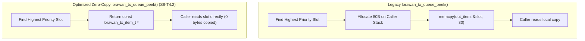

# Task Specification: S8-T4.2 - LoRaWAN Transmission Queue Zero-Copy Pointer Peeking

## 1. Task Metadata & Overview

| Attribute | Specification Details |
| :--- | :--- |
| **Sprint** | **Sprint 8: Firmware Performance Optimization & Flash Storage Hardening** |
| **Task ID** | `S8-T4.2` |
| **Parent Task** | `S8-T4: Harden Middleware Ring Buffers & LoRaWAN Transmission Queue` |
| **Task Title** | Refactor `lorawan_tx_queue_peek()` to Zero-Copy Read-Only Pointer Return (`lorawan_tx_queue`) |
| **Status** | **Ready for Implementation** |
| **Target Files** | [`firmware/middleware/inc/lorawan_tx_queue.h`](file:///C:/Users/ENERGY%20SAVER/Documents/Learning/Job%20Projects/rain-predict/firmware/middleware/inc/lorawan_tx_queue.h)<br>[`firmware/middleware/src/lorawan_tx_queue.c`](file:///C:/Users/ENERGY%20SAVER/Documents/Learning/Job%20Projects/rain-predict/firmware/middleware/src/lorawan_tx_queue.c)<br>[`firmware/middleware/src/lorawan_service.c`](file:///C:/Users/ENERGY%20SAVER/Documents/Learning/Job%20Projects/rain-predict/firmware/middleware/src/lorawan_service.c) |
| **Related Documents** | [`context/audit/code-issues-github-copilot.md`](file:///C:/Users/ENERGY%20SAVER/Documents/Learning/Job%20Projects/rain-predict/context/audit/code-issues-github-copilot.md)<br>[`context/specs/s5-t4.3-lorawan-tx-queue.md`](file:///C:/Users/ENERGY%20SAVER/Documents/Learning/Job%20Projects/rain-predict/context/specs/s5-t4.3-lorawan-tx-queue.md)<br>[`context/specs/s5-t4.1-lorawan-service.md`](file:///C:/Users/ENERGY%20SAVER/Documents/Learning/Job%20Projects/rain-predict/context/specs/s5-t4.1-lorawan-service.md)<br>[`context/coding-standards.md`](file:///C:/Users/ENERGY%20SAVER/Documents/Learning/Job%20Projects/rain-predict/context/coding-standards.md) |
| **Dependencies** | [`S5-T4.3`](file:///C:/Users/ENERGY%20SAVER/Documents/Learning/Job%20Projects/rain-predict/context/specs/s5-t4.3-lorawan-tx-queue.md) (LoRaWAN Priority Transmission Queue) |
| **Downstream Tasks** | `S8-T4.3` (Queue Bitmask), `S8-T4.4` (Queue Performance Tests), `S8-T5.2` (Duty Cycle Profiling) |

---

## 2. Executive Summary & Problem Analysis

In [`lorawan_tx_queue.h`](file:///C:/Users/ENERGY%20SAVER/Documents/Learning/Job%20Projects/rain-predict/firmware/middleware/inc/lorawan_tx_queue.h) and [`lorawan_tx_queue.c`](file:///C:/Users/ENERGY%20SAVER/Documents/Learning/Job%20Projects/rain-predict/firmware/middleware/src/lorawan_tx_queue.c), uplink packets are staged before radio dispatch. The transmission item structure `lorawan_tx_item_t` encapsulates the payload buffer, port, priority, retry counters, callback function pointer, and void user context pointer:

```c
typedef struct {
    uint8_t                    payload[LORAWAN_TX_QUEUE_MAX_PAYLOAD_SIZE]; // up to 64 bytes
    uint8_t                    length;
    uint8_t                    fport;
    lorawan_tx_priority_t      priority;
    bool                       is_confirmed;
    uint8_t                    max_retries;
    uint8_t                    retry_count;
    lorawan_tx_completion_cb_t completion_cb;
    void                      *user_ctx;
    bool                       in_use;
} lorawan_tx_item_t;
```

In the legacy implementation, inspecting the highest-priority pending packet was performed via `lorawan_tx_queue_peek()`:

```c
// Legacy code (S5-T4.3 lines 223-238):
status_t lorawan_tx_queue_peek(lorawan_tx_item_t *out_item) {
    // ...
    int best_slot = find_highest_priority_slot();
    memcpy(out_item, &s_queue[best_slot], sizeof(lorawan_tx_item_t));
    return STATUS_OK;
}
```

### Inefficiencies Identified in Audit (Issue 10)
1. **Full-Structure Stack Copying**: Every inspection copied up to 80 bytes onto the caller's stack frame, including internal callback pointers, retry state, and empty padding bytes.
2. **Repeated Queue Inspection**: During duty-cycle waits and channel backoff polling, the radio state machine calls peek repeatedly to check if a higher-priority urgent alert has arrived to preempt the periodic packet. Copying 80 bytes on every check wastes CPU cycles and battery energy.
3. **Information Overexposure**: Callers only require access to `payload`, `length`, `fport`, and `is_confirmed`.

**`S8-T4.2`** refactors queue inspection to a **zero-copy, read-only pointer pattern**:
- **Direct Pointer Inspection (`lorawan_tx_queue_peek_ptr`)**: Returns `const lorawan_tx_item_t *` directly referencing the internal static array slot.
- **Zero Stack Allocation**: 0 bytes copied; executes in $< 10$ CPU cycles.
- **Const Immutability Guard**: The `const` pointer qualifier enforces compile-time immutability, preventing callers from accidentally corrupting internal queue state.



---

## 3. Technical Requirements & Design Specifications

### 3.1 Pointer Safety & Non-Reentrancy Guarantees

1. **Const-Qualified Storage**:
   The returned pointer `const lorawan_tx_item_t *` prevents external mutation of queue items without calling official queue management APIs (`enqueue`, `dequeue`).
2. **Static Lifetime Guarantee**:
   Because all queue items reside in pre-allocated static internal storage (`static lorawan_tx_item_t s_queue[LORAWAN_TX_QUEUE_CAPACITY]`), the memory address remains valid until dequeued.
3. **Empty Queue Indicator**:
   If the queue has zero pending items, `lorawan_tx_queue_peek()` returns `NULL` (or `STATUS_ERROR_EMPTY` in the pointer-to-pointer variant).
4. **Targeted Field Copy Helper**:
   For callers specifically requiring isolated payload copies, a lightweight helper `lorawan_tx_queue_peek_payload()` copies strictly the active payload bytes (`length` bytes, not the full buffer capacity).

---

## 4. API Specification & Data Structures (`lorawan_tx_queue.h`)

### 4.1 Function Prototypes

```c
/**
 * @brief  Returns a zero-copy read-only pointer to the highest priority pending item.
 * @details Does not copy structure contents or modify queue state.
 * @return const lorawan_tx_item_t* Pointer to active queue slot, or NULL if empty.
 */
const lorawan_tx_item_t *lorawan_tx_queue_peek(void);

/**
 * @brief  Alternative status-returning zero-copy inspection variant.
 * @param[out] pp_item Pointer to receive the read-only item address.
 * @return STATUS_OK on success, STATUS_ERROR_NULL_POINTER if pp_item is NULL,
 *         or STATUS_ERROR_EMPTY if queue is empty.
 */
status_t lorawan_tx_queue_peek_ptr(const lorawan_tx_item_t **pp_item);

/**
 * @brief  Copies strictly the payload bytes and transmission metadata of the top item.
 * @param[out] p_payload  Destination buffer for payload (must be >= item->length).
 * @param[out] p_length   Pointer to receive payload length.
 * @param[out] p_fport    Pointer to receive target FPort.
 * @param[out] p_confirmed Pointer to receive confirmation flag.
 * @return STATUS_OK on success, or STATUS_ERROR_EMPTY.
 */
status_t lorawan_tx_queue_peek_payload(uint8_t *p_payload,
                                       uint8_t *p_length,
                                       uint8_t *p_fport,
                                       bool *p_confirmed);
```

---

## 5. Implementation Details & Algorithmic Logic

### 5.1 Implementation in `lorawan_tx_queue.c`

```c
const lorawan_tx_item_t *lorawan_tx_queue_peek(void)
{
    if (!s_queue_initialized || s_queue_count == 0U) {
        return NULL;
    }

    int best_slot = lorawan_tx_queue_find_best_slot();
    if (best_slot < 0) {
        return NULL;
    }

    return &s_queue[best_slot];
}

status_t lorawan_tx_queue_peek_ptr(const lorawan_tx_item_t **pp_item)
{
    if (pp_item == NULL) {
        return STATUS_ERROR_NULL_POINTER;
    }

    const lorawan_tx_item_t *p_item = lorawan_tx_queue_peek();
    if (p_item == NULL) {
        *pp_item = NULL;
        return STATUS_ERROR_EMPTY;
    }

    *pp_item = p_item;
    return STATUS_OK;
}
```

### 5.2 Consumer Usage in `lorawan_service.c`

```c
// Zero-copy radio staging in lorawan_service.c:
const lorawan_tx_item_t *p_tx = lorawan_tx_queue_peek();
if (p_tx != NULL) {
    // Pass payload buffer pointer directly to Sub-GHz LoRa radio driver
    subghz_radio_send_packet(p_tx->payload, p_tx->length, p_tx->fport, p_tx->is_confirmed);
}
```

---

## 6. Verification, Unit Testing & Benchmarking Plan

### 6.1 Unit Test Cases in `tests/unit/test_lorawan_tx_queue.c`

| Test ID | Objective | Input / Condition | Expected Result |
| :--- | :--- | :--- | :--- |
| `TEST_QUEUE_PEEK_01` | Zero-Copy Pointer Return | Enqueue urgent alert | `peek()` returns non-NULL pointer matching slot address; `count` remains unchanged. |
| `TEST_QUEUE_PEEK_02` | Empty Queue Safety | Empty queue | `peek()` returns `NULL`; `peek_ptr()` returns `STATUS_ERROR_EMPTY`. |
| `TEST_QUEUE_PEEK_03` | Preemption Inspection | Enqueue periodic (Tier 1), then urgent (Tier 0) | `peek()` switches pointer to Tier 0 alert without dequeuing Tier 1. |
| `TEST_QUEUE_PEEK_04` | Stack Footprint Benchmark | Measure stack frame of calling `peek()` | Caller stack usage $\le 8\text{ bytes}$ (vs $\ge 88\text{ bytes}$ legacy). |

---

## 7. Traceability Matrix & Definition of Done

### Traceability

| Requirement | Implementation Component | Verification Test |
| :--- | :--- | :--- |
| Zero-Copy Pointer Return | `lorawan_tx_queue_peek()` | `TEST_QUEUE_PEEK_01` |
| Const Immutability Guard | Return signature `const lorawan_tx_item_t *` | Compiler verification |
| Empty Queue Handling | `NULL` return on empty queue | `TEST_QUEUE_PEEK_02` |
| Preemption Transparency | Priority-based pointer selection | `TEST_QUEUE_PEEK_03` |

### Definition of Done

- [ ] `lorawan_tx_queue_peek()` refactored to return `const lorawan_tx_item_t *`.
- [ ] Radio driver in `lorawan_service.c` updated to consume read-only pointer directly.
- [ ] Full 80-byte `memcpy` eliminated from queue inspection path.
- [ ] 100% test pass rate with zero compiler warnings.
