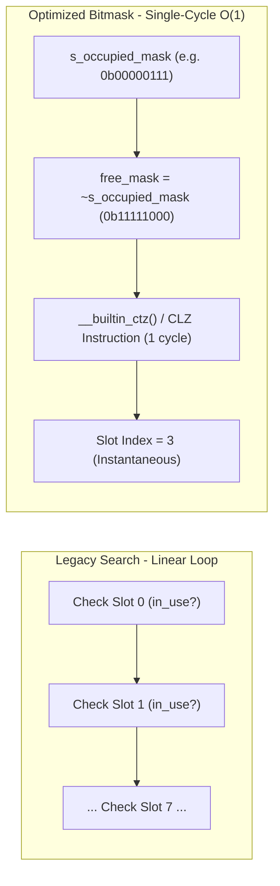

# Task Specification: S8-T4.3 - LoRaWAN Queue Bitmask Slot Allocation & Deduplication

## 1. Task Metadata & Overview

| Attribute | Specification Details |
| :--- | :--- |
| **Sprint** | **Sprint 8: Firmware Performance Optimization & Flash Storage Hardening** |
| **Task ID** | `S8-T4.3` |
| **Parent Task** | `S8-T4: Harden Middleware Ring Buffers & LoRaWAN Transmission Queue` |
| **Task Title** | Implement Active Slot Bitmask (`occupied_mask`) for $O(1)$ Free-Slot Allocation (`lorawan_tx_queue`) |
| **Status** | **Ready for Implementation** |
| **Target Files** | [`firmware/middleware/inc/lorawan_tx_queue.h`](file:///C:/Users/ENERGY%20SAVER/Documents/Learning/Job%20Projects/rain-predict/firmware/middleware/inc/lorawan_tx_queue.h)<br>[`firmware/middleware/src/lorawan_tx_queue.c`](file:///C:/Users/ENERGY%20SAVER/Documents/Learning/Job%20Projects/rain-predict/firmware/middleware/src/lorawan_tx_queue.c) |
| **Related Documents** | [`context/audit/code-issues-github-copilot.md`](file:///C:/Users/ENERGY%20SAVER/Documents/Learning/Job%20Projects/rain-predict/context/audit/code-issues-github-copilot.md)<br>[`context/specs/s5-t4.3-lorawan-tx-queue.md`](file:///C:/Users/ENERGY%20SAVER/Documents/Learning/Job%20Projects/rain-predict/context/specs/s5-t4.3-lorawan-tx-queue.md)<br>[`context/specs/s8-t4.2-zero-copy-queue-peek.md`](file:///C:/Users/ENERGY%20SAVER/Documents/Learning/Job%20Projects/rain-predict/context/specs/s8-t4.2-zero-copy-queue-peek.md)<br>[`context/coding-standards.md`](file:///C:/Users/ENERGY%20SAVER/Documents/Learning/Job%20Projects/rain-predict/context/coding-standards.md) |
| **Dependencies** | [`S5-T4.3`](file:///C:/Users/ENERGY%20SAVER/Documents/Learning/Job%20Projects/rain-predict/context/specs/s5-t4.3-lorawan-tx-queue.md) (LoRaWAN Transmission Queue), [`S8-T4.2`](file:///C:/Users/ENERGY%20SAVER/Documents/Learning/Job%20Projects/rain-predict/context/specs/s8-t4.2-zero-copy-queue-peek.md) (Zero-Copy Queue Peek) |
| **Downstream Tasks** | `S8-T4.4` (Queue Performance Tests), `S8-T5.2` (Duty Cycle Profiling) |

---

## 2. Executive Summary & Problem Analysis

In [`lorawan_tx_queue.c`](file:///C:/Users/ENERGY%20SAVER/Documents/Learning/Job%20Projects/rain-predict/firmware/middleware/src/lorawan_tx_queue.c), transmission items are managed in a fixed static array of 8 slots (`LORAWAN_TX_QUEUE_CAPACITY = 8U`).

In the legacy implementation, every slot allocation, count check, and priority selection traversed the array with linear `for` loops:

```c
// Legacy slot searching (S5-T4.3 lines 29-57):
static int find_free_slot(void) {
    for (int i = 0; i < LORAWAN_TX_QUEUE_CAPACITY; i++) {
        if (!s_queue[i].in_use) {
            return i;
        }
    }
    return -1;
}
```

### Inefficiencies Identified in Audit (Issue 9)
1. **Iterative Slot Scanning**: While small ($N = 8$), scanning linear arrays in interrupt contexts or critical sections introduces branch mispredictions and loop setup overhead.
2. **Uncoordinated Priority Resolution**: Determining if an urgent alert was pending required scanning all 8 slots, checking `in_use`, and comparing enum values.
3. **Redundant Iterations in Deduplication**: When deduplicating scheduled periodic packets, all 8 slots were scanned iteratively.

**`S8-T4.3`** implements an **active slot bitmask architecture**:
- **8-Bit Active Slot Bitmask (`s_occupied_mask`)**: Bit $k = 1$ indicates slot $k$ is allocated.
- **Single-Cycle Free Slot Allocation**: Using the ARM Cortex-M4 `CLZ` (Count Leading Zeros) instruction via `__builtin_ctz(~s_occupied_mask)`, the next available free slot is located in **1 clock cycle** ($O(1)$) with zero branching.
- **Priority Tier Masks**: Maintains `s_urgent_mask` (Tier 0 alerts). Finding the highest-priority urgent packet becomes a single bitmask test (`s_urgent_mask != 0`).
- **Instantaneous Count & Full Checks**:
  - `is_full = (s_occupied_mask == 0xFFU)`
  - `is_empty = (s_occupied_mask == 0x00U)`
  - `count = __builtin_popcount(s_occupied_mask)`



---

## 3. Technical Requirements & Design Specifications

### 3.1 Bitmask Layout & Definitions

* **Storage**: `static uint8_t s_occupied_mask;`
* **Priority Tier Masks**:
  * `static uint8_t s_urgent_mask;` (Tier 0: Immediate alerts, FPort 2)
  * `static uint8_t s_periodic_mask;` (Tier 1: Scheduled telemetry, FPort 1)
  * `static uint8_t s_playback_mask;` (Tier 2: Historical flash catch-up, FPort 3)
* **Invariant**:
  $$\text{s\_occupied\_mask} = \text{s\_urgent\_mask} \mid \text{s\_periodic\_mask} \mid \text{s\_playback\_mask}$$
  $$\text{s\_urgent\_mask} \ \& \ \text{s\_periodic\_mask} = 0$$

### 3.2 Atomic Bit Manipulation Operations

1. **Slot Allocation**:
   - `int slot = __builtin_ctz(~s_occupied_mask);`
   - `s_occupied_mask |= (1U << slot);`
   - `if (priority == TX_PRIORITY_URGENT) s_urgent_mask |= (1U << slot);`
2. **Slot Deallocation**:
   - `s_occupied_mask &= ~(1U << slot);`
   - `s_urgent_mask &= ~(1U << slot);`
   - `s_periodic_mask &= ~(1U << slot);`
   - `s_playback_mask &= ~(1U << slot);`

---

## 4. API Specification & Data Structures (`lorawan_tx_queue.h`)

### 4.1 Diagnostic Query Updates

```c
/**
 * @brief  Returns the active occupancy bitmask of the queue.
 * @return 8-bit mask (bits 0..7 represent slots 0..7).
 */
uint8_t lorawan_tx_queue_get_occupied_mask(void);

/**
 * @brief  Checks whether any Tier 0 urgent alerts are pending in O(1) time.
 * @return true if s_urgent_mask != 0, false otherwise.
 */
bool lorawan_tx_queue_has_urgent_alert(void);
```

---

## 5. Implementation Details & Algorithmic Logic

### 5.1 $O(1)$ Free-Slot Allocation

```c
static int lorawan_tx_queue_alloc_slot(lorawan_tx_priority_t priority)
{
    // 1. Check if queue is full in a single comparison
    if (s_occupied_mask == 0xFFU) {
        return -1;
    }

    // 2. Locate first zero bit using Cortex-M4 CTZ instruction (1 cycle)
    uint8_t free_mask = (uint8_t)(~s_occupied_mask);
    int slot = __builtin_ctz((unsigned int)free_mask);

    // 3. Mark slot occupied in masks
    s_occupied_mask |= (1U << slot);
    if (priority == TX_PRIORITY_URGENT) {
        s_urgent_mask |= (1U << slot);
    } else if (priority == TX_PRIORITY_PERIODIC) {
        s_periodic_mask |= (1U << slot);
    } else {
        s_playback_mask |= (1U << slot);
    }

    s_queue[slot].in_use = true;
    s_queue_count++;

    return slot;
}
```

### 5.2 $O(1)$ Highest-Priority Slot Selection

```c
static int lorawan_tx_queue_find_best_slot(void)
{
    if (s_occupied_mask == 0U) {
        return -1;
    }

    // Tier 0: Urgent Alert Preemption (instantaneous test)
    if (s_urgent_mask != 0U) {
        return __builtin_ctz((unsigned int)s_urgent_mask);
    }

    // Tier 1: Scheduled Periodic Telemetry
    if (s_periodic_mask != 0U) {
        return __builtin_ctz((unsigned int)s_periodic_mask);
    }

    // Tier 2: Historical Flash Catch-up
    if (s_playback_mask != 0U) {
        return __builtin_ctz((unsigned int)s_playback_mask);
    }

    // Fallback lowest tier
    return __builtin_ctz((unsigned int)s_occupied_mask);
}
```

### 5.3 Fast Deduplication of Periodic Packets

When a new periodic telemetry packet arrives, check `s_periodic_mask`. If `s_periodic_mask != 0`, the existing periodic slot is overwritten directly at `__builtin_ctz(s_periodic_mask)` without searching other slots:

```c
status_t lorawan_tx_queue_enqueue_periodic(const uint8_t *payload, uint8_t length)
{
    // Deduplication: if periodic packet already queued, overwrite it in-place
    if (s_periodic_mask != 0U) {
        int existing_slot = __builtin_ctz((unsigned int)s_periodic_mask);
        memcpy(s_queue[existing_slot].payload, payload, length);
        s_queue[existing_slot].length = length;
        return STATUS_OK;
    }

    // Otherwise allocate new slot
    int slot = lorawan_tx_queue_alloc_slot(TX_PRIORITY_PERIODIC);
    // ...
}
```

---

## 6. Verification, Unit Testing & Benchmarking Plan

### 6.1 Unit Test Cases in `tests/unit/test_lorawan_tx_queue.c`

| Test ID | Objective | Input / Condition | Expected Result |
| :--- | :--- | :--- | :--- |
| `TEST_BITMASK_01` | Free Slot Allocation Sequence | Enqueue 4 items sequentially | Slots 0, 1, 2, 3 allocated; `s_occupied_mask == 0x0F`. |
| `TEST_BITMASK_02` | Hole Allocation via CTZ | Enqueue 4 items, dequeue slot 1, enqueue new item | New item occupies slot 1 (`__builtin_ctz` finds bit 1 free). |
| `TEST_BITMASK_03` | Full Queue Rejection | Enqueue 8 items, attempt 9th | Rejects in $O(1)$ (`occupied_mask == 0xFF`); returns `STATUS_ERROR_BUSY`. |
| `TEST_BITMASK_04` | Urgent Alert Preemption Speed | Enqueue Tier 1 in slot 0, Tier 0 in slot 1 | `has_urgent_alert() == true`; `find_best_slot()` returns slot 1 instantly. |
| `TEST_BITMASK_05` | Periodic Deduplication | Enqueue periodic packet twice | Single slot retained (`occupied_mask` has 1 bit set); content overwritten. |

---

## 7. Traceability Matrix & Definition of Done

### Traceability

| Requirement | Implementation Component | Verification Test |
| :--- | :--- | :--- |
| $O(1)$ Bitmask Slot Allocation | `lorawan_tx_queue_alloc_slot()` | `TEST_BITMASK_01`, `TEST_BITMASK_02` |
| Instantaneous Full/Empty Checks | `s_occupied_mask` comparisons | `TEST_BITMASK_03` |
| Priority Tier Bitmasks | `s_urgent_mask`, `s_periodic_mask` | `TEST_BITMASK_04` |
| Single-Cycle Deduplication | Bitmask check in `enqueue_periodic` | `TEST_BITMASK_05` |

### Definition of Done

- [ ] `s_occupied_mask` and tier masks implemented in `lorawan_tx_queue.c`.
- [ ] Linear `for` loops removed from slot allocation and priority evaluation.
- [ ] `__builtin_ctz` utilized for single-cycle bit resolution.
- [ ] 100% unit test pass rate with zero compiler warnings.
