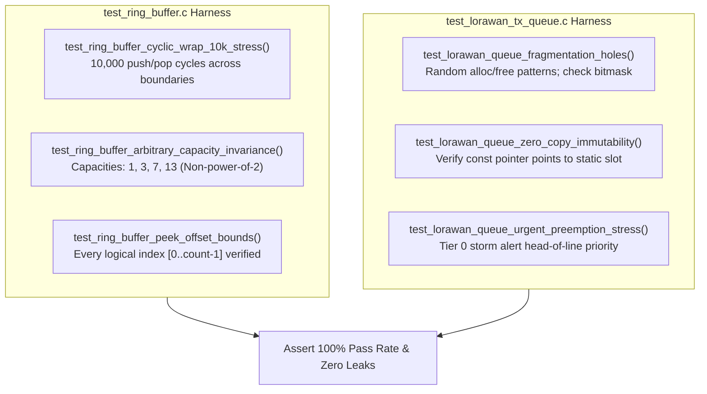

# Task Specification: S8-T4.4 - Queue & Ring Buffer Performance Verification Suite

## 1. Task Metadata & Overview

| Attribute | Specification Details |
| :--- | :--- |
| **Sprint** | **Sprint 8: Firmware Performance Optimization & Flash Storage Hardening** |
| **Task ID** | `S8-T4.4` |
| **Parent Task** | `S8-T4: Harden Middleware Ring Buffers & LoRaWAN Transmission Queue` |
| **Task Title** | Develop Performance & Integrity Test Suite for Ring Buffers and Bitmask Priority Queue |
| **Status** | **Ready for Implementation** |
| **Target Files** | [`tests/unit/test_ring_buffer.c`](file:///C:/Users/ENERGY%20SAVER/Documents/Learning/Job%20Projects/rain-predict/tests/unit/test_ring_buffer.c) [`tests/unit/test_lorawan_tx_queue.c`](file:///C:/Users/ENERGY%20SAVER/Documents/Learning/Job%20Projects/rain-predict/tests/unit/test_lorawan_tx_queue.c) |
| **Related Documents** | [`context/specs/s8-t4.1-increment-compare-ring-buffer.md`](file:///C:/Users/ENERGY%20SAVER/Documents/Learning/Job%20Projects/rain-predict/context/specs/s8-t4.1-increment-compare-ring-buffer.md) [`context/specs/s8-t4.2-zero-copy-queue-peek.md`](file:///C:/Users/ENERGY%20SAVER/Documents/Learning/Job%20Projects/rain-predict/context/specs/s8-t4.2-zero-copy-queue-peek.md) [`context/specs/s8-t4.3-lorawan-queue-bitmask.md`](file:///C:/Users/ENERGY%20SAVER/Documents/Learning/Job%20Projects/rain-predict/context/specs/s8-t4.3-lorawan-queue-bitmask.md) [`context/coding-standards.md`](file:///C:/Users/ENERGY%20SAVER/Documents/Learning/Job%20Projects/rain-predict/context/coding-standards.md) |
| **Dependencies** | [`S8-T4.1`](file:///C:/Users/ENERGY%20SAVER/Documents/Learning/Job%20Projects/rain-predict/context/specs/s8-t4.1-increment-compare-ring-buffer.md), [`S8-T4.2`](file:///C:/Users/ENERGY%20SAVER/Documents/Learning/Job%20Projects/rain-predict/context/specs/s8-t4.2-zero-copy-queue-peek.md), [`S8-T4.3`](file:///C:/Users/ENERGY%20SAVER/Documents/Learning/Job%20Projects/rain-predict/context/specs/s8-t4.3-lorawan-queue-bitmask.md) |
| **Downstream Tasks** | `S8-T5.2` (Duty Cycle Profiling), `S8-T5.3` (Automated Regression Suite) |

---

## 2. Executive Summary & Testing Scope

The optimizations implemented in `S8-T4.1`, `S8-T4.2`, and `S8-T4.3` alter the foundational data structures utilized by serial drivers, filtering pipelines, and radio transmission managers.

The objective of **`S8-T4.4`** is to establish a **dual-domain performance and stress test harness**:
1. **Ring Buffer Increment-and-Compare Integrity**: Validates wrap-around arithmetic across arbitrary non-power-of-two capacities ($C = 3, 5, 7, 10, 896$), verifying zero index runaway or off-by-one errors across $10,000$ cyclic operations.
2. **LoRaWAN Queue Bitmask & Fragmentation Safety**: Simulates arbitrary insertion and deallocation sequences (creating fragmentation holes in the 8-slot array), verifying that bitmasks track slot occupancy without leakage.
3. **Zero-Copy Memory Safety**: Verifies that `lorawan_tx_queue_peek()` provides direct read access to static memory without stack duplication or pointer corruption.

---

## 3. Test Fixture & Verification Specifications

### 3.1 Ring Buffer Stress Testing (`test_ring_buffer.c`)

#### `test_ring_buffer_cyclic_wrap_10k_stress(void)`
- **Goal**: Verify zero division faults and index stability across $10,000$ push/pop operations.
- **Procedure**:
  1. Allocate static ring buffer with capacity $C = 10$, item size $4\text{ bytes}$ (`uint32_t`).
  2. Loop $10,000$ iterations:
     - Push monotonically increasing sequence counter $i$.
     - If buffer is full, pop oldest value and assert it equals $i - 10$.
  3. Assert `head` and `tail` remain strictly bounded within $[0, 9]$.
  4. Assert zero memory corruption in surrounding canary bytes.

#### `test_ring_buffer_arbitrary_capacity_invariance(void)`
- **Goal**: Confirm branch-efficient math works identically on arbitrary prime and odd capacities.
- **Procedure**:
  1. Test with capacities $C \in \{1, 3, 7, 11, 13, 896\}$.
  2. For each capacity, fill buffer to maximum, query each index via `ring_buffer_peek_offset()`, and pop until empty.
  3. Assert every returned item matches expected FIFO ordering.

---

### 3.2 LoRaWAN Queue Bitmask & Zero-Copy Testing (`test_lorawan_tx_queue.c`)

#### `test_lorawan_queue_fragmentation_holes(void)`
- **Goal**: Verify bitmask correctly manages fragmented allocation holes.
- **Procedure**:
  1. Initialize queue (`s_occupied_mask == 0x00`).
  2. Enqueue 8 items to fill queue (`s_occupied_mask == 0xFF`).
  3. Dequeue slot 2 and slot 5:
     - `s_occupied_mask` must equal `0b11011011` (`0xDB`).
     - Slot 2 and 5 bit flags cleared in priority tier masks.
  4. Enqueue new item:
     - Assert it is placed into slot 2 (`__builtin_ctz(~0xDB) == 2`).
     - `s_occupied_mask` becomes `0b11011111` (`0xDF`).
  5. Enqueue second new item:
     - Assert it is placed into slot 5.
     - `s_occupied_mask` becomes `0xFF`.

#### `test_lorawan_queue_zero_copy_immutability(void)`
- **Goal**: Validate that `peek()` returns a direct read-only pointer to internal static storage.
- **Procedure**:
  1. Enqueue urgent storm alert with 4-byte payload `0xDE, 0xAD, 0xBE, 0xEF` on FPort 2.
  2. Call `const lorawan_tx_item_t *p_peek = lorawan_tx_queue_peek();`.
  3. Assert `p_peek != NULL`.
  4. Assert `p_peek->payload[0] == 0xDE`.
  5. Assert pointer address lies within range `&s_queue[0]` to `&s_queue[7]`.
  6. Call `peek()` a second time; assert returned address is identical (idempotent, zero allocation).

#### `test_lorawan_queue_urgent_preemption_stress(void)`
- **Goal**: Confirm Tier 0 alerts instantly jump ahead of Tier 1 periodic and Tier 2 playback items.
- **Procedure**:
  1. Enqueue 4 periodic packets (Tier 1).
  2. Enqueue 3 playback packets (Tier 2).
  3. Call `peek()`; assert top item is Tier 1 periodic.
  4. Enqueue 1 urgent storm alert (Tier 0).
  5. Call `peek()`; assert top item immediately changes to Tier 0 alert.
  6. Dequeue urgent item; assert next item reverts to Tier 1 periodic.

---

## 4. Traceability Matrix & Definition of Done

### Traceability

| Optimization Target | Test Function | Success Criteria |
| :--- | :--- | :--- |
| Increment-Compare Pointer Stability | `test_ring_buffer_cyclic_wrap_10k_stress` | 10,000 cycles with exact FIFO ordering |
| Non-Power-of-Two Capacity Safety | `test_ring_buffer_arbitrary_capacity_invariance` | Verified across capacities 1, 3, 7, 13, 896 |
| Bitmask Hole Allocation | `test_lorawan_queue_fragmentation_holes` | Bit pattern matches holes exactly |
| Zero-Copy Pointer Identity | `test_lorawan_queue_zero_copy_immutability` | Pointer matches static queue array slot |
| Multi-Tier Priority Preemption | `test_lorawan_queue_urgent_preemption_stress` | Tier 0 immediately preempts Tiers 1–3 |

### Definition of Done

- [ ] All test cases implemented in `test_ring_buffer.c` and `test_lorawan_tx_queue.c`.
- [ ] 100% pass rate achieved on host test runner.
- [ ] Zero memory corruption, canary overflows, or division exceptions.
- [ ] Zero compiler warnings under strict `-Wall -Wextra -Wpedantic -Werror`.
