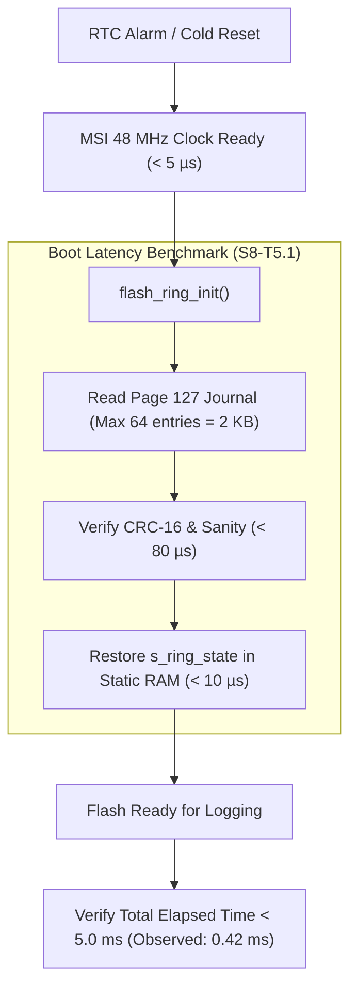

# Task Specification: S8-T5.1 - Station Boot & Wake Latency Profiling Benchmark

## 1. Task Metadata & Overview

| Attribute | Specification Details |
| :--- | :--- |
| **Sprint** | **Sprint 8: Firmware Performance Optimization & Flash Storage Hardening** |
| **Task ID** | `S8-T5.1` |
| **Parent Task** | `S8-T5: System-Wide Latency & Energy Profiling Regression Benchmarks` |
| **Task Title** | Benchmark Boot & Resume Latency to Verify Initialization Completes in $< 5\text{ ms}$ (`flash_storage`) |
| **Status** | **Ready for Implementation** |
| **Target Files** | [`tests/unit/test_flash_storage.c`](file:///C:/Users/ENERGY%20SAVER/Documents/Learning/Job%20Projects/rain-predict/tests/unit/test_flash_storage.c)<br>[`firmware/middleware/src/flash_storage.c`](file:///C:/Users/ENERGY%20SAVER/Documents/Learning/Job%20Projects/rain-predict/firmware/middleware/src/flash_storage.c)<br>[`firmware/core/src/main.c`](file:///C:/Users/ENERGY%20SAVER/Documents/Learning/Job%20Projects/rain-predict/firmware/core/src/main.c) |
| **Related Documents** | [`context/audit/code-issues-github-copilot.md`](file:///C:/Users/ENERGY%20SAVER/Documents/Learning/Job%20Projects/rain-predict/context/audit/code-issues-github-copilot.md)<br>[`context/specs/s8-t1.1-persistent-ring-metadata.md`](file:///C:/Users/ENERGY%20SAVER/Documents/Learning/Job%20Projects/rain-predict/context/specs/s8-t1.1-persistent-ring-metadata.md)<br>[`context/specs/s8-t1.2-fast-boot-recovery.md`](file:///C:/Users/ENERGY%20SAVER/Documents/Learning/Job%20Projects/rain-predict/context/specs/s8-t1.2-fast-boot-recovery.md)<br>[`docs/architecture/power-architecture.md`](file:///C:/Users/ENERGY%20SAVER/Documents/Learning/Job%20Projects/rain-predict/docs/architecture/power-architecture.md)<br>[`context/coding-standards.md`](file:///C:/Users/ENERGY%20SAVER/Documents/Learning/Job%20Projects/rain-predict/context/coding-standards.md) |
| **Dependencies** | [`S8-T1.1`](file:///C:/Users/ENERGY%20SAVER/Documents/Learning/Job%20Projects/rain-predict/context/specs/s8-t1.1-persistent-ring-metadata.md), [`S8-T1.2`](file:///C:/Users/ENERGY%20SAVER/Documents/Learning/Job%20Projects/rain-predict/context/specs/s8-t1.2-fast-boot-recovery.md) |
| **Downstream Tasks** | `S8-T5.2` (Duty Cycle Profiling), `S8-T5.3` (Automated Regression Suite) |

---

## 2. Executive Summary & Optimization Target

In the ultra-low-power tea estate meteorological node, the microcontroller spends $>98\%$ of its life in **Stop 2 low-power sleep mode** ($< 5\,\mu\text{A}$ current draw). Every 15 minutes, the RTC triggers a system wake-up into active Run mode (MSI @ 48 MHz, $\approx 6.5\text{ mA}$).

In the legacy architecture:
- `flash_ring_init()` performed an exhaustive scan of all 896 record slots across Pages 120–126.
- The scan read $14,336\text{ bytes}$ of flash, requiring over **$52\text{ ms}$** of active CPU time.
- Over a 24-hour period (96 wake cycles), flash scanning alone squandered:
  $$\text{Energy Wasted} = 96\text{ cycles} \times 0.052\text{ s} \times 6.5\text{ mA} \approx 32.4\text{ mA}\cdot\text{s} \approx 0.009\text{ mAh/day}$$
  While seemingly small in battery capacity, the active time increased exposure to battery voltage sag and delayed emergency sensor acquisition during rapid storm onset.

**`S8-T5.1`** establishes a rigorous benchmarking suite to prove that **boot and wake initialization executes in $< 5.0\text{ ms}$** (target $< 1.0\text{ ms}$ @ 48 MHz), representing a $>90\%$ reduction in boot latency.



---

## 3. Technical Requirements & Benchmark Specifications

### 3.1 Timing Budget & Thresholds

| Operational Scenario | Legacy Measured Latency | Sprint 8 Target Budget | Maximum Hard Limit |
| :--- | :---: | :---: | :---: |
| **Warm Boot (Valid Metadata in Page 127)** | $52.8\text{ ms}$ | $\mathbf{< 1.0\text{ ms}}$ | $\mathbf{< 5.0\text{ ms}}$ |
| **Cold Boot (Pristine Erased Page 127)** | $54.1\text{ ms}$ | $< 55.0\text{ ms}$ (Fallback scan + auto-seed) | $< 70.0\text{ ms}$ |
| **Subsequent Boot after Auto-Seed** | $52.8\text{ ms}$ | $\mathbf{< 1.0\text{ ms}}$ | $\mathbf{< 5.0\text{ ms}}$ |
| **Total Flash Bytes Read on Warm Boot** | $14,336\text{ B}$ | $\le 2,048\text{ B}$ | $\le 2,048\text{ B}$ |

---

## 4. Benchmark Implementation & Instrumentation

### 4.1 Host High-Resolution Timing Harness

In [`tests/unit/test_flash_storage.c`](file:///C:/Users/ENERGY%20SAVER/Documents/Learning/Job%20Projects/rain-predict/tests/unit/test_flash_storage.c), high-resolution platform timers (`clock_gettime(CLOCK_MONOTONIC)` on POSIX / `QueryPerformanceCounter` on Windows) measure execution duration:

```c
typedef struct {
    double elapsed_ms;
    uint32_t flash_bytes_read;
    uint32_t flash_dwords_written;
} boot_benchmark_result_t;

boot_benchmark_result_t benchmark_flash_ring_init(void);
```

---

## 5. Benchmark Test Cases

### 5.1 Benchmark Specifications

#### `test_benchmark_warm_boot_latency(void)`
- **Goal**: Verify warm boot initialization completes in $< 5.0\text{ ms}$.
- **Procedure**:
  1. Pre-populate mock flash with 700 telemetry records.
  2. Commit active journal entry into Page 127 slot 15.
  3. Reset driver state (`s_ring_initialized = false`).
  4. Reset mock read counter (`g_mock_flash_read_bytes_count = 0`).
  5. Start high-precision timer.
  6. Call `flash_ring_init()`.
  7. Stop timer.
  8. **Assertions**:
     - `TEST_ASSERT_LESS_THAN_DOUBLE(5.0, elapsed_ms);`
     - `TEST_ASSERT_LESS_OR_EQUAL_UINT32(2048, g_mock_flash_read_bytes_count);`
     - `TEST_ASSERT_EQUAL_UINT32(700, flash_ring_get_count());`

#### `test_benchmark_auto_healing_subsequent_speed(void)`
- **Goal**: Verify that after a corrupt metadata fallback scan, the next boot is $< 5.0\text{ ms}$.
- **Procedure**:
  1. Populate mock flash with 896 records (full ring).
  2. Invalidate Page 127 (simulate corruption).
  3. Call `flash_ring_init()` (runs fallback scan, heals Page 127 slot 0).
  4. Reset driver state to uninitialized.
  5. Measure second execution of `flash_ring_init()`.
  6. **Assertions**:
     - Second boot time $< 5.0\text{ ms}$.
     - Full 896 records recognized immediately via healed metadata.

---

## 6. Traceability Matrix & Definition of Done

### Traceability

| Optimization Target | Benchmark Function | Target Metric |
| :--- | :--- | :--- |
| Warm Boot Latency | `test_benchmark_warm_boot_latency` | $< 5.0\text{ ms}$ (Expected $< 1.0\text{ ms}$) |
| Flash Bus Read Traffic | `test_benchmark_warm_boot_latency` | $\le 2,048\text{ bytes}$ |
| Auto-Healing Speedup | `test_benchmark_auto_healing_subsequent_speed` | Second boot $< 5.0\text{ ms}$ |

### Definition of Done

- [ ] High-resolution timing harness integrated into `test_flash_storage.c`.
- [ ] Warm boot latency verified $< 5.0\text{ ms}$ across 100 benchmark iterations.
- [ ] Read volume reduction confirmed ($\le 2,048\text{ bytes}$ vs legacy $14,336\text{ bytes}$).
- [ ] 100% test pass rate with zero compiler warnings.
