# Task Specification: S8-T5.2 - Active Duty Cycle & Execution Duration Profiling

## 1. Task Metadata & Overview

| Attribute | Specification Details |
| :--- | :--- |
| **Sprint** | **Sprint 8: Firmware Performance Optimization & Flash Storage Hardening** |
| **Task ID** | `S8-T5.2` |
| **Parent Task** | `S8-T5: System-Wide Latency & Energy Profiling Regression Benchmarks` |
| **Task Title** | Profile Active Execution Window per Cycle to Verify Total CPU Active Duration $< 1.0\text{ s}$ |
| **Status** | **Ready for Implementation** |
| **Target Files** | [`tests/integration/test_state_machine.c`](file:///C:/Users/ENERGY%20SAVER/Documents/Learning/Job%20Projects/rain-predict/tests/integration/test_state_machine.c)<br>[`firmware/app/src/app_state_machine.c`](file:///C:/Users/ENERGY%20SAVER/Documents/Learning/Job%20Projects/rain-predict/firmware/app/src/app_state_machine.c)<br>[`firmware/middleware/src/power_mgr.c`](file:///C:/Users/ENERGY%20SAVER/Documents/Learning/Job%20Projects/rain-predict/firmware/middleware/src/power_mgr.c) |
| **Related Documents** | [`docs/architecture/power-architecture.md`](file:///C:/Users/ENERGY%20SAVER/Documents/Learning/Job%20Projects/rain-predict/docs/architecture/power-architecture.md)<br>[`docs/hardware/power-supply-and-solar.md`](file:///C:/Users/ENERGY%20SAVER/Documents/Learning/Job%20Projects/rain-predict/docs/hardware/power-supply-and-solar.md)<br>[`context/specs/s7-t2.1-stop2-active-power-profiling.md`](file:///C:/Users/ENERGY%20SAVER/Documents/Learning/Job%20Projects/rain-predict/context/specs/s7-t2.1-stop2-active-power-profiling.md)<br>[`context/specs/s7-t2.2-daily-energy-budget-verification.md`](file:///C:/Users/ENERGY%20SAVER/Documents/Learning/Job%20Projects/rain-predict/context/specs/s7-t2.2-daily-energy-budget-verification.md)<br>[`context/coding-standards.md`](file:///C:/Users/ENERGY%20SAVER/Documents/Learning/Job%20Projects/rain-predict/context/coding-standards.md) |
| **Dependencies** | [`S8-T1.2`](file:///C:/Users/ENERGY%20SAVER/Documents/Learning/Job%20Projects/rain-predict/context/specs/s8-t1.2-fast-boot-recovery.md), [`S8-T1.3`](file:///C:/Users/ENERGY%20SAVER/Documents/Learning/Job%20Projects/rain-predict/context/specs/s8-t1.3-page-erase-tracking.md), [`S8-T2.2`](file:///C:/Users/ENERGY%20SAVER/Documents/Learning/Job%20Projects/rain-predict/context/specs/s8-t2.2-batch-flash-operations.md), [`S8-T3.2`](file:///C:/Users/ENERGY%20SAVER/Documents/Learning/Job%20Projects/rain-predict/context/specs/s8-t3.2-shared-feature-extraction.md), [`S8-T4.2`](file:///C:/Users/ENERGY%20SAVER/Documents/Learning/Job%20Projects/rain-predict/context/specs/s8-t4.2-zero-copy-queue-peek.md) |
| **Downstream Tasks** | `S8-T5.3` (Automated Regression Suite) |

---

## 2. Executive Summary & Energy Profiling Mission

To achieve a **14-day zero-sunlight battery survivability** on a single 3.2V 2500mAh LiFePO4 cell, the tea plantation station must strictly maintain a daily energy consumption $< 25\text{ mAh/day}$ ([`power-supply-and-solar.md`](file:///C:/Users/ENERGY%20SAVER/Documents/Learning/Job%20Projects/rain-predict/docs/hardware/power-supply-and-solar.md)).

Under the Sprint 7 system baseline:
- Stop 2 sleep current was verified at $< 5.0\,\mu\text{A}$.
- The active execution window per 15-minute measurement cycle was capped at $1.2\text{ seconds}$ ($1,200\text{ ms}$).
- Over 96 cycles per day, an active window of $1.2\text{s}$ at an average active current of $22\text{ mA}$ consumed:
  $$\text{Active Energy} = 96 \times \left(\frac{1.2\text{ s}}{3600\text{ s/h}}\right) \times 22\text{ mA} = 0.704\text{ mAh/day}$$

Through the Sprint 8 performance optimizations:
1. Fast boot journal recovery saves $\approx 50\text{ ms}$.
2. Elimination of full-page erase checks saves $\approx 15\text{ ms}$ at boundaries.
3. Ingestion validation bitmasks and unified `weather_features_t` save $\approx 2\text{ ms}$ of pure CPU compute time.
4. Batch flash marking and zero-copy queue peeking eliminate flash HAL thrashing and stack duplication.

The objective of **`S8-T5.2`** is to benchmark and formally verify that the **total active execution duration per measurement cycle is reduced to $< 1.0\text{ second}$** (nominal $\approx 780\text{ ms}$), providing an additional $>16\%$ energy safety margin.

```mermaid
gantt
    title Measurement Cycle Active Duration Breakdown (Total < 1.0s)
    dateFormat X
    axisFormat %s ms

    section Core Lifecycle
    Wake & Clocks (<5ms)             :active, 0, 5
    Sensor Rail Power-On & Delay    :20ms, 5, 25
    Sensor Readout (I2C/UART)       :40ms, 25, 65
    Algorithmic Processing (<2ms)   :2ms, 65, 67
    Flash Telemetry Push (<5ms)     :5ms, 67, 72
    LoRaWAN Uplink & Receive Window :700ms, 72, 772
    Rail Discharge & Pre-Sleep      :8ms, 772, 780
```



---

## 3. Active Window Budget Breakdown

| Phase / Operation | Legacy Baseline | Sprint 8 Optimized Budget | Maximum Allowable Cap |
| :--- | :---: | :---: | :---: |
| **Wake, Clocks & Flash Init** | $55.0\text{ ms}$ | $\mathbf{< 5.0\text{ ms}}$ | $10.0\text{ ms}$ |
| **Power Rail Stabilization** | $20.0\text{ ms}$ | $20.0\text{ ms}$ (Hardware physical delay) | $22.0\text{ ms}$ |
| **Sensor Sampling (BME280 + OPT3001)**| $42.0\text{ ms}$ | $40.0\text{ ms}$ | $50.0\text{ ms}$ |
| **Algorithmic Evaluation (Math Core)**| $4.5\text{ ms}$ | $\mathbf{< 2.0\text{ ms}}$ | $5.0\text{ ms}$ |
| **Flash Logging (NVM Push)** | $22.0\text{ ms}$ | $\mathbf{< 5.0\text{ ms}}$ (Pre-erased bypass) | $10.0\text{ ms}$ |
| **LoRaWAN Radio Dispatch & Windows**| $720.0\text{ ms}$ | $700.0\text{ ms}$ (DR2/DR3 transmission) | $850.0\text{ ms}$ |
| **Power Rail Discharge & Sleep Entry**| $12.0\text{ ms}$ | $8.0\text{ ms}$ | $15.0\text{ ms}$ |
| **Total Active Window per Cycle** | **$875.5\text{ ms} - 1,180\text{ ms}$** | $\mathbf{\approx 780.0\text{ ms}}$ | $\mathbf{< 1,000.0\text{ ms} (1.0\text{ s})}$ |

---

## 4. Benchmark Implementation & Test Fixture

### 4.1 State Machine Profiling Hooks (`test_state_machine.c`)

The integration test harness measures cumulative active cycle time from `STATE_WAKE` to `STATE_SLEEP`:

```c
typedef struct {
    uint32_t wake_to_power_on_us;
    uint32_t power_on_to_sample_us;
    uint32_t sample_to_predict_us;
    uint32_t predict_to_transmit_us;
    uint32_t transmit_to_sleep_us;
    uint32_t total_active_us;
} cycle_profiling_result_t;

cycle_profiling_result_t profile_full_measurement_cycle(void);
```

---

## 5. Benchmark Test Cases

### 5.1 Test Specifications

#### `test_benchmark_total_active_cycle_duration(void)`
- **Goal**: Verify end-to-end active duration remains strictly $< 1.0\text{ second}$ ($< 1,000,000\,\mu\text{s}$).
- **Procedure**:
  1. Initialize complete application state machine in mock environment.
  2. Trigger RTC wake alarm (`EVENT_RTC_WAKE`).
  3. Execute state transitions: `STATE_WAKE` $\rightarrow$ `STATE_POWER_ON` $\rightarrow$ `STATE_SAMPLE` $\rightarrow$ `STATE_FILTER` $\rightarrow$ `STATE_PREDICT` $\rightarrow$ `STATE_TRANSMIT` $\rightarrow$ `STATE_ALERT` $\rightarrow$ `STATE_SLEEP`.
  4. Capture cumulative active execution time.
  5. **Assertions**:
     - `TEST_ASSERT_LESS_THAN_UINT32(1000000, result.total_active_us);`
     - Nominal duration verified at $\le 850,000\,\mu\text{s}$ ($0.85\text{s}$).

#### `test_benchmark_math_and_flash_compute_window(void)`
- **Goal**: Confirm computational processing (algorithms + NVM push) executes in $< 10\text{ ms}$.
- **Procedure**:
  1. Ingest valid sample into `STATE_FILTER`.
  2. Execute gradient computation, Zambretti heuristic, and composite nowcasting.
  3. Push 16-byte record into flash ring buffer.
  4. **Assertions**:
     - Computation duration $< 10,000\,\mu\text{s}$ ($10\text{ ms}$).
     - Proves CPU compute overhead is negligible compared to physical radio time.

---

## 6. Traceability Matrix & Definition of Done

### Traceability

| Energy Requirement | Benchmark Function | Target Metric |
| :--- | :--- | :--- |
| Active Execution Duration | `test_benchmark_total_active_cycle_duration` | $< 1.0\text{ s}$ per 15-minute cycle |
| Math & Storage Sub-Window | `test_benchmark_math_and_flash_compute_window` | $< 10\text{ ms}$ total compute time |
| Daily Energy Invariance | Derived from 96 cycles $\times 0.78\text{s}$ | $< 25\text{ mAh/day}$ verified |

### Definition of Done

- [ ] Active cycle duration profiling integrated into `tests/integration/test_state_machine.c`.
- [ ] Measured total active execution time confirmed $< 1.0\text{ s}$ across 50 full state machine cycles.
- [ ] Zero compiler warnings under `-Wall -Wextra -Wpedantic -Werror`.
