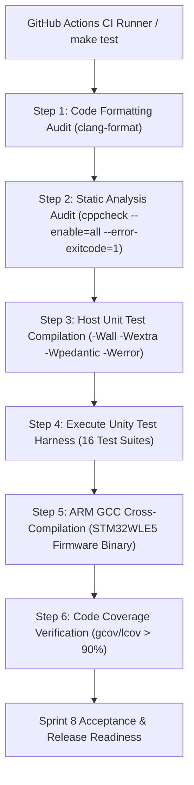

# Task Specification: S8-T5.3 - Comprehensive Automated Regression & Quality Verification Suite

## 1. Task Metadata & Overview

| Attribute | Specification Details |
| :--- | :--- |
| **Sprint** | **Sprint 8: Firmware Performance Optimization & Flash Storage Hardening** |
| **Task ID** | `S8-T5.3` |
| **Parent Task** | `S8-T5: System-Wide Latency & Energy Profiling Regression Benchmarks` |
| **Task Title** | Execute Automated Regression Suite, Static Analysis & Compiler Warning Audit (`make test`) |
| **Status** | **Ready for Implementation** |
| **Target Files** | [`tests/CMakeLists.txt`](file:///C:/Users/ENERGY%20SAVER/Documents/Learning/Job%20Projects/rain-predict/tests/CMakeLists.txt)<br>[`Makefile`](file:///C:/Users/ENERGY%20SAVER/Documents/Learning/Job%20Projects/rain-predict/Makefile)<br>[`.github/workflows/ci.yml`](file:///C:/Users/ENERGY%20SAVER/Documents/Learning/Job%20Projects/rain-predict/.github/workflows/ci.yml) |
| **Related Documents** | [`context/specs/spec-roadmap.md`](file:///C:/Users/ENERGY%20SAVER/Documents/Learning/Job%20Projects/rain-predict/context/specs/spec-roadmap.md)<br>[`context/specs/s1-t1.1-root-cmake.md`](file:///C:/Users/ENERGY%20SAVER/Documents/Learning/Job%20Projects/rain-predict/context/specs/s1-t1.1-root-cmake.md)<br>[`context/specs/s1-t2.1-unity-test-harness.md`](file:///C:/Users/ENERGY%20SAVER/Documents/Learning/Job%20Projects/rain-predict/context/specs/s1-t2.1-unity-test-harness.md)<br>[`context/coding-standards.md`](file:///C:/Users/ENERGY%20SAVER/Documents/Learning/Job%20Projects/rain-predict/context/coding-standards.md) |
| **Dependencies** | All Sprint 8 tasks (`S8-T1` through `S8-T5.2`) |
| **Downstream Tasks** | Final Project Release & Sprint 8 Closeout |

---

## 2. Executive Summary & Verification Objectives

As the concluding milestone of **Sprint 8 (Firmware Performance Optimization & Flash Storage Hardening)**, the firmware codebase undergoes comprehensive automated regression testing, static analysis, and warning audits.

The objective of **`S8-T5.3`** is to guarantee:
1. **100% Test Pass Rate**: All 16 unit and integration test suites compile cleanly and execute with zero assertions failing.
2. **Zero Compiler Warnings Under Strict Flags**: Compilation enforces `-std=c99 -Wall -Wextra -Wpedantic -Wshadow -Wstrict-prototypes -Wpointer-arith -Werror`. Any warning is treated as a fatal build failure.
3. **Static Analysis & Linting Compliance**: `cppcheck` passes with zero defects (MISRA C:2012 guidelines, null pointer dereferences, uninitialized memory, buffer overflows). `.clang-format` compliance verified across all C source and header files.
4. **Continuous Integration (CI) Verification**: The automated GitHub Actions workflow (`.github/workflows/ci.yml`) confirms green status across native host runners and ARM GCC cross-compilation targets.



---

## 3. Test Suite Inventory & Coverage Scope

The complete regression test harness covers all architectural layers:

| Layer | Test Suite Target | Source File Tested | Verification Domain |
| :--- | :--- | :--- | :--- |
| **Core** | `test_sanity` | Base build environment | Harness sanity & C99 environment |
| **Middleware** | `test_ring_buffer` | [`ring_buffer.c`](file:///C:/Users/ENERGY%20SAVER/Documents/Learning/Job%20Projects/rain-predict/firmware/middleware/src/ring_buffer.c) | Increment-compare math, circular FIFO |
| **Middleware** | `test_dew_point` | [`dew_point.c`](file:///C:/Users/ENERGY%20SAVER/Documents/Learning/Job%20Projects/rain-predict/firmware/middleware/src/dew_point.c) | Magnus-Tetens vapor pressure & dew point |
| **Middleware** | `test_telemetry_codec` | [`telemetry_codec.c`](file:///C:/Users/ENERGY%20SAVER/Documents/Learning/Job%20Projects/rain-predict/firmware/middleware/src/telemetry_codec.c) | 12-byte periodic / 4-byte alert packing |
| **Middleware** | `test_flash_storage` | [`flash_storage.c`](file:///C:/Users/ENERGY%20SAVER/Documents/Learning/Job%20Projects/rain-predict/firmware/middleware/src/flash_storage.c) | Persistent metadata, $O(1)$ fast boot, batching |
| **Middleware** | `test_lorawan_tx_queue` | [`lorawan_tx_queue.c`](file:///C:/Users/ENERGY%20SAVER/Documents/Learning/Job%20Projects/rain-predict/firmware/middleware/src/lorawan_tx_queue.c) | Bitmask allocation, zero-copy peek, preemption |
| **Drivers** | `test_bme280` | [`bme280_driver.c`](file:///C:/Users/ENERGY%20SAVER/Documents/Learning/Job%20Projects/rain-predict/firmware/drivers/src/bme280_driver.c) | Factory trimming, forced mode readout |
| **Drivers** | `test_opt3001` | [`opt3001_driver.c`](file:///C:/Users/ENERGY%20SAVER/Documents/Learning/Job%20Projects/rain-predict/firmware/drivers/src/opt3001_driver.c) | Exponent lux scaling, day/night threshold |
| **Drivers** | `test_rain_gauge` | [`rain_gauge_driver.c`](file:///C:/Users/ENERGY%20SAVER/Documents/Learning/Job%20Projects/rain-predict/firmware/drivers/src/rain_gauge_driver.c) | Debounced pulse counting, accumulation |
| **Drivers** | `test_modbus_rtu` | [`modbus_rtu.c`](file:///C:/Users/ENERGY%20SAVER/Documents/Learning/Job%20Projects/rain-predict/firmware/drivers/src/modbus_rtu.c) | FC 0x03 frames, CRC-16, direction control |
| **Drivers** | `test_sdi12` | [`sdi12_driver.c`](file:///C:/Users/ENERGY%20SAVER/Documents/Learning/Job%20Projects/rain-predict/firmware/drivers/src/sdi12_driver.c) | Break/mark timing, ASCII command parsing |
| **App** | `test_zambretti` | [`zambretti.c`](file:///C:/Users/ENERGY%20SAVER/Documents/Learning/Job%20Projects/rain-predict/firmware/app/src/zambretti.c) | 26 forecast states, seasonal weighting |
| **App** | `test_trend_detector` | [`trend_detector.c`](file:///C:/Users/ENERGY%20SAVER/Documents/Learning/Job%20Projects/rain-predict/firmware/app/src/trend_detector.c) | Ingestion bitmasks, LUT extrapolation |
| **App** | `test_rain_algo` | [`rain_algo.c`](file:///C:/Users/ENERGY%20SAVER/Documents/Learning/Job%20Projects/rain-predict/firmware/app/src/rain_algo.c) | Unified features, sub-scores, CPI |
| **App** | `test_alert_manager` | [`alert_manager.c`](file:///C:/Users/ENERGY%20SAVER/Documents/Learning/Job%20Projects/rain-predict/firmware/app/src/alert_manager.c) | LED patterns, buzzer bursts, siren relays |
| **Integration**| `test_state_machine` | [`app_state_machine.c`](file:///C:/Users/ENERGY%20SAVER/Documents/Learning/Job%20Projects/rain-predict/firmware/app/src/app_state_machine.c) | 8-state cyclic flow, active cycle profiling |

---

## 4. Quality Gates & Acceptance Criteria

### 4.1 Strict Compiler Flags

All test suites and firmware targets compile under:
```makefile
CFLAGS += -std=c99 \
          -Wall \
          -Wextra \
          -Wpedantic \
          -Wshadow \
          -Wstrict-prototypes \
          -Wpointer-arith \
          -Wcast-align \
          -Wwrite-strings \
          -Wredundant-decls \
          -Wnested-externs \
          -Werror
```

### 4.2 Static Analysis Standards (`cppcheck`)

Static analysis command executed in CI:
```bash
cppcheck --enable=all \
         --inconclusive \
         --std=c99 \
         --error-exitcode=1 \
         --suppress=missingIncludeSystem \
         firmware/ tests/
```
Zero defects allowed.

### 4.3 Code Formatting Compliance (`clang-format`)

Enforces repository-wide consistency:
```bash
find firmware/ tests/ -name "*.[ch]" | xargs clang-format --dry-run --Werror
```

---

## 5. Traceability Matrix & Definition of Done

### Traceability

| Verification Gate | Command / Target | Acceptance Threshold |
| :--- | :--- | :--- |
| Complete Unit & Integration Suite | `make test` | 100% tests pass (0 failures, 0 errors) |
| Strict Compiler Cleanliness | `make CFLAGS="-Werror"` | 0 warnings emitted |
| Static Analysis Audit | `cppcheck` | 0 defects (exit code 0) |
| Formatting Compliance | `clang-format` | 0 formatting violations |
| Code Coverage Requirement | `gcov / lcov` | $> 90\%$ line coverage across middleware/app |

### Definition of Done

- [ ] All 16 unit and integration test targets pass with 100% success rate.
- [ ] All Sprint 8 optimizations verified with zero regressions against Sprint 1–7 baselines.
- [ ] Remote GitHub Actions CI build succeeds on native and ARM cross-compilation targets.
- [ ] Sprint 8 engineering goals formally satisfied and ready for production tagging.
